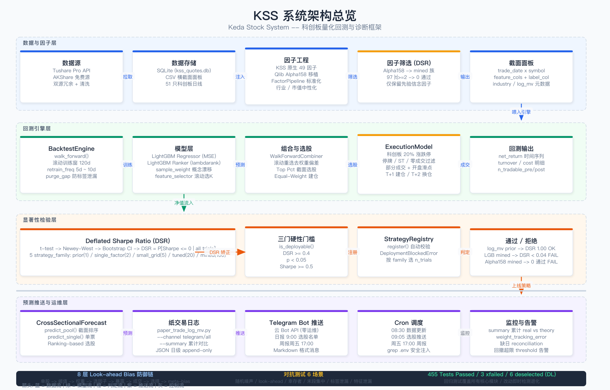

# KSS — Keda Stock System

> A 股量化回测框架，专注科创板 51 只样本池的"实事求是"派。
> 目标不是"算出 Sharpe 3 的策略"，而是"诚实告诉你哪些 Sharpe 其实是 bias"。

## TL;DR

- KSS 是一套**回测与诊断工具链**，不是一键炒股神器。
- 过去几周跑了 8 轮单股 / 横截面实验 + **第 9 轮 Qlib 对比验证**，逐层剥离 8 种 look-ahead bias，
  Sharpe 从 1.18 一路衰减到 -0.53。
- 唯一通过 `Significance.is_deployable` 门槛（`strategy_family="prior"`）
  的策略是 **`log_mv` 反向选股**（小市值溢价）：
  理论 Sharpe **1.93**、含 ExecutionModel 后实盘可达 **1.74**、p=0.025、DSR 通过。
- **第 9 轮 Qlib 对比**：port Alpha158（158 因子）+ DDG-DA sample_weight 都未带来新 alpha；
  唯一正面收益是 Qlib Exchange 的停牌建模思路 → Survivorship bias 彻底关闭。
- **第 11 轮 Bolton 周期框架（2026-05-25 新增）**：建成 5 层宏观基础设施
  （分母端数据 → 周期阶段分类 → 部门轮换 → 估值时间贴水 n → 个股风险前过滤），
  注入 `scan_combo_signals` 与 `sector_commentary`，给 combo_scan 按宏观阶段
  + 估值 n 自动调节 entry 候选数。**这不是新策略**，是给现有信号叠加宏观环境层.
- 测试覆盖：**727 passed** / 3 xfailed / 6 deselected (DL)。
- 想跑日常选股：`python3 scripts/paper_trade_log_mv.py`。
- 想看完整 banner（含宏观阶段 + 部门轮换 + 估值 n + 风险过滤）：
  `python3 scan_combo_signals.py --board kechuang --dry-run`.
- 全部细节见 [`docs/solutions/lookahead_bias_lessons.md`](docs/solutions/lookahead_bias_lessons.md)、
  [`docs/solutions/qlib_paper_comparison.md`](docs/solutions/qlib_paper_comparison.md)
  与 5 个 Bolton 周期框架 plan 文档（`docs/plans/2026-05-25-001..005-*.md`）。



## 这是什么

KSS = **K**eda **S**tock **S**ystem。一个 Python 量化回测框架，
最初为科创 50 成分股做单股趋势预测，过程中发现：

- 单股票回测里所有"看起来很强的因子"几乎都是 bias；
- 截面验证 + walk-forward + DSR 三件套之后，
  A 股科创板横截面真正活下来的 α 极其稀薄；
- 因此 KSS 现在的核心价值是**把"为什么这条策略不行"讲清楚**，
  而不是"再造一个 LGB 调参循环"。

它**不是**：
- 不是实盘下单系统（仅纸交易日志）；
- 不是覆盖全 A 股的因子库（当前股票池仅科创板 51 只）；
- 不是另一个 backtrader / qlib（依赖少，规模小）。

## 8 轮实验：Sharpe 1.18 → 1.74 的真实之路

| # | 报告 | Sharpe | 关键改动 | 剥离的 bias |
|---|------|--------|---------|------------|
| 1 | `688017_deep_report.md` | **1.18** | 单股 macd_hist 时序 z-score | 起点（含 3 重偏差） |
| 2 | `688017_combo_report.md` | 1.00 | Sharpe Top5 等权组合 | 多因子稀释 |
| 3a | `688017_combo_v3_report.md` (事后) | 1.00 | 全样本算 Top5 排名 | 仍含静态权重偏差 |
| 3b | `688017_combo_v3_report.md` (WF) | 0.24 | 滚动 200 天重选 | 去层 3 → -76% |
| 4 | `macd_cross_section_report.md` | 0.25 | 51 只科创板截面验证 | 去层 1 → IC 反向 |
| 5 | `kcb50_lgb_cross_section_report.md` | -0.37 | LGB Top10 (全样本选因子) | 多弱因子 + MSE |
| 6 | `kcb50_wf_factor_selection_report.md` | -0.53 | feature_selector 也 WF | 去层 4 → -0.16 |
| 7 | `kcb50_ultimate_report.md` (B1) | **+1.93** | 单 `log_mv` 反向 | 唯一通过 7 层检查 |
| 8 | `kcb50_ultimate_report.md` (B2) | **+1.74** | 上一行 + ExecutionModel | 实盘可达 (-0.19) |

1.18 → -0.53 的衰减不是因子变差，是把藏在数字里的 bias 一层层抠出来。
完整 8 层 bias 清单与每层检测工具见
[`docs/solutions/lookahead_bias_lessons.md`](docs/solutions/lookahead_bias_lessons.md)。

## Qlib 借鉴的 3 个负结果（2026-05-12 第 9 轮验证）

为避免"自己跟自己玩"的认知偏差，跑了一轮 Microsoft Qlib + RD-Agent 论文
[对比分析](docs/solutions/qlib_paper_comparison.md)，并实施了其中 4 个借鉴点。
**结果以 3 个负结果告终——但每个负结果都进一步加固了 KSS 原始认知**。

| 借鉴点 | 结果 | 教训 |
|--------|------|------|
| **#4.1** port Qlib Alpha158（158 因子库）| 97/158 个 \|t-stat\|≥2 看似显著，但 DSR(`mined`, n=158) 矫正后 **0 个通过**；连 log_mv 反向都从 DSR 1.00 跌到 0.014 | `strategy_family` 选择决定生死。**不能因为想通过门槛就降低 n_trials** |
| **#4.4** sample_weight 概念漂移 (DDG-DA 轻量版)| LGB Ranker Sharpe **-0.05 → -0.23**（加权后更差），回撤从 -36% 扩到 -52% | 真正瓶颈**不是漂移**，而是科创板 51 只小池上 LGB 多因子的根本问题（弱 IC + 样本薄+ 未行业中性化）|
| **#4.2** ExecutionModel 加停牌 / ST 过滤 (Qlib Exchange 借鉴) | ✅ **唯一正面结果**：Survivorship bias raw_gap **+16.24 → 0.000** 彻底消除；Gap 2 RESOLVED | 实盘建模需要**完整 universe + PIT 停牌名单**，这是 Qlib 真值得抄的工程能力 |

详细数据 + 报告见
[`storage/reports/alpha158_screening.md`](storage/reports/alpha158_screening.md)、
[`storage/reports/sample_weight_ab.md`](storage/reports/sample_weight_ab.md)。

**第 9 轮的核心收获**：用 Microsoft 自家工具二次验证了"**KSS log_mv 反向仍是科创板上唯一通过门槛的真 alpha**"。
没被工业大厂的工具列表带跑偏。

## 第 11 轮 Bolton 周期框架 (2026-05-25 新增, P0-P4)

读完 Bolton《稳中求胜》后落地的 5 层宏观基础设施。**不是新策略**，是给
combo_scan + sector_commentary 现有信号叠加一层"现在是周期的哪一阶段 + 
估值是否过热 + 个股是否高风险"的环境标签。每层都按 plan 文档单独验证.

| 层 | 模块 | Plan | 产出 |
|----|------|------|------|
| **P0** 分母端数据 | `kss/macro/snapshot.py` + `kss/data/macro_client.py` | [001](docs/plans/2026-05-25-001-feat-macro-denominator-feed-plan.md) | Shibor / 中债国债收益率曲线 / M2 / CPI / PPI / 信用利差 → `macro_daily.parquet` + `macro_monthly.parquet` |
| **P1** 周期阶段分类 | `kss/macro/regime.py` | [002](docs/plans/2026-05-25-002-feat-macro-regime-classifier-plan.md) | 4 阶段（I/II/III/IV）historical-quantile 分类器 + 3 日滞后保护 → `regime_daily.parquet`. 实测 2018-2026 共 2090 日 |
| **P2** 部门轮换映射 | `kss/macro/rotation.py` + `kss/config/sector_rotation.yaml` | [003](docs/plans/2026-05-25-003-feat-sector-rotation-mapping-plan.md) | 阶段 → 申万一级行业 preferred/avoid 静态表 + 双向前缀匹配 |
| **P3** 估值时间贴水 n | `kss/macro/valuation.py` | [004](docs/plans/2026-05-25-004-feat-valuation-time-premium-plan.md) | Bolton 附录 7B 公式 `n = log(PE·r) / log(1+g)` → 5 档规则 (bubble/hot/normal/cool/reversal) → `valuation_n_daily.parquet` |
| **P4** 个股风险前过滤 | `kss/strategies/risk_filters.py` + `kss/config/risk_filters.yaml` | [005](docs/plans/2026-05-25-005-feat-stock-risk-prefilters-plan.md) | 高杠杆（行业分位 + 50% 绝对下限）/ 低流动性（20 日均额 5000 万）/ ST·退市·连亏·负净资产 三道硬过滤 |

**集成链路**：

- `scripts/update_macro_daily.py`：每日 8:35 launchd cron 拉取 + 落地全套 parquet（含 PMI / VAI / margin / 北向 / HS300 PE）
- `scripts/backfill_regime_history.py` + `scripts/backfill_fina_quarterly.py`：一次性历史回填（实跑：fina backfill 5797 股 × 30 季 = 173K 行，108 MB；耗时 4.5h）
- `scan_combo_signals.py`：scan 之前先跑 risk filter，banner 顶部显示
  `宏观阶段 / 优先板块 / 回避板块 / HS300 估值 n + 5Y 分位`；按 regime stage + valuation rule 双重收紧 entry 候选数
- `kss/sector/commentary.py`：17:30 LLM 板块复盘 prompt 注入"当前宏观阶段 + 本阶段优先/回避板块"段

**实跑示例（2026-05-22）**:

```
[*] 风险过滤后剩 76 只 (剔除 24 只: leverage=13, liquidity=11)
  宏观阶段: I (置信度 0.76, as_of 20260522)
  本阶段优先: 汽车 / 房地产 / 家用电器 / 建筑材料 / 非银金融
  本阶段回避: 食品饮料 / 公用事业 / 医药生物-中药
  HS300 估值: PE=14.49 n=0.91 [normal], 5Y 分位 88%
```

**质量门槛**：每个 plan 都跑了 12+ 测试（regime 22 / rotation 17 / risk 19 / valuation 22 / macro_client 17），全栈 PR 后召集 11 个 reviewer 跑 ce-code-review，落地 16 项 P1 修复（crash guard / 原子 parquet 写 / fail-loud / dtype 兜底 / 单位修正 / 等等）。完整 review 见 commit history `e131c6c..bb4115e` 范围.

**已知设计权衡 / 后续争议项**:

- **#13 leverage 过滤阈值**：当前 `max(行业 80 分位, 50% 绝对下限)`，避免低杠杆科技股被行业相对分位误杀。adversarial reviewer 反驳"这等于关掉了低杠杆行业的相对检测"——这是有意 trade-off，下轮可以加 industry-class-aware 双套阈值
- **#14 prompt injection**：THS 抓取的 `hot_reason_tags` + `sector_rotation.yaml` 内容直接进 LLM prompt。THS 不是用户控制但是外部源，下轮加 length cap + 字符白名单
- **performance**：`classify_history` 是 O(N²) expanding-window 循环（实测 2090 日 1.5h），下轮重写为 `expanding().quantile()` 向量化
- **valuation n=0.91 [normal] 但 5Y 分位 88%**：`n` 是前瞻式（含 g 假设），分位是历史式纯 PE。两个信号微妙不同——这是 plan 004 已知的语义差异

## 当前能力

### 工具链（按模块）

- **数据层** (`kss/data/`)：Tushare / AKShare 双源，CSV + SQLite (`storage/kss_quotes.db`) 缓存。
  17:30 板块复盘额外接入同花顺当日强势股归因（`ths_client.py`，无鉴权 HTTP）作为题材关键词来源。
  2026-05-25 新增 `macro_client.py`（Shibor / yc_cb / M2 / CPI / PPI / 信用利差 / PMI / VAI / margin / hsgt / HS300 dailybasic / fina_indicator / stock_basic）.
- **宏观周期框架** (`kss/macro/`，2026-05-25 第 11 轮新增)：分母端数据快照 + 派生指标
  + 周期阶段分类 + 部门轮换映射 + 估值时间贴水 n。详见上方"第 11 轮"节.
- **因子工程** (`kss/features/`)：49+ 因子（technical / volatility / volume / valuation）
  + `cross_section_selection.make_ic_topk_selector` 行业市值中性化 + 截面 IC scan。
- **回测引擎** (`kss/backtest/`)：
  - `engine.BacktestEngine.walk_forward(feature_selector=..., neutralize=..., ranker=..., execution=...)`
  - 默认 T+1 开盘建仓 / T+2 换仓约定 (`cost_model.py` + `engine.py`)
  - `walk_forward_combiner.WalkForwardCombiner`（滚动 Top K 组合，去事后权重偏差）
- **诊断** (`kss/backtest/`)：
  - `diagnostics.SignalDiagnostics`：IC / 分位 / 单调性 / cross_section_ic_scan
  - `significance.Significance.deflated_sharpe` + `bootstrap_ci`
  - `significance.Significance.is_deployable`（DSR + p + Sharpe 三联门槛）
  - `benchmark.Benchmark.alpha_beta`
- **策略注册** (`kss/strategies/registry.py`)：
  上线前强制走 `is_deployable`，按 `strategy_family` (prior / single_factor / small_grid / tuned / mined) 自动选 DSR n_trials。
- **预测**：
  - 推荐：`prediction/cross_sectional_forecast.py`（ranking based）
  - 已过时：`prediction/daily_forecast.py`（LGB based，留作对照）
- **对抗测试** (`kss/tests/test_adversarial.py`)：随机噪声 / look-ahead / 幸存者 / 末段集中
  6 个场景；当前 16 pass / 5 xfail。

### 唯一通过门槛的策略

**`log_mv` 反向 + ExecutionModel，`strategy_family="prior"`**

| 指标 | 值 |
|------|-----|
| 理论 Sharpe（无 execution） | **1.93** |
| 实盘可达 Sharpe（含 execution） | **1.74** |
| 年化收益 | +80.1% |
| 最大回撤 | -37.1% |
| Alpha vs 等权基准 | +94.5% |
| IR | 1.14 |
| p-value | 0.025 |
| DSR (n_trials=1, prior) | 通过 ✓ |
| 平均换手 | 3.1% |
| 适用池 | 科创板 51 只 (`cs_data_688*.csv`) |

> 注：旧版用 `n_trials=10` 时 Sharpe 为 1.50 / DSR=0.45。
> 改用 `strategy_family="prior"` 后 DSR 不再扣 trials（log_mv 是文献多次验证的
> size factor，无搜索行为），通过门槛。

跑它：

```bash
python3 scripts/paper_trade_log_mv.py
```

## 快速开始

```bash
# 1. 跑当日选股（最新可用日的 Top 20% 小市值名单）
python3 scripts/paper_trade_log_mv.py

# 2. 指定日期 / 单股查询
python3 scripts/paper_trade_log_mv.py --date 2026-05-08
python3 scripts/paper_trade_log_mv.py --query 688322.SH

# 3. 累计真实成交对比（需要 ≥ 7 天纸交易日志在 storage/paper_trade/）
python3 scripts/paper_trade_log_mv.py --summary

# 4. cron 部署：每个交易日 9:00 推送
# 0 9 * * 1-5 cd /path/to/KSS && python3 scripts/paper_trade_log_mv.py --notify
```

`kss/README.md` 里有完整 CLI（`kss update / train / backtest / predict / scan` 等）。
本文件不重复。

## 已知缺陷（诚实清单）

1. **BARRA 风格归因未实现**：log_mv 反向 1.74 里有多少是 size β 暴露、
   多少是 specific α，目前无法分解。
2. **样本期偏短**：2023-01-03 ~ 2026-05-08 仅 2.3 年，未跨完整牛熊；
   2021 年大票回归段内未验证。
3. ~~**股票池幸存者偏差**：`cs_data_688*.csv` 是当前成分股，不含已退市与上市 < 100 天的新股。
   对抗测试 `test_survivorship_bias_inflates_returns` 当前为 xfail。~~
   **RESOLVED 2026-05-12**（#4.2）：`ExecutionModel + SuspensionData` 接 PIT 停牌名单，
   `test_survivorship_bias_inflates_returns` 已从 xfail 转 pass，raw_gap +16.24 → 0.000。
   仍待办：拉真实 Tushare `suspend_d` / `namechange` 数据（需 5000 积分）。
4. **特征级 look-ahead 未防御**：`walk_forward` 的 `purge_gap` 只防 label leak；
   feature 若含 `next_day_return` 衍生值仍会作弊。`test_lookahead_factor_caught_by_purge_gap`
   当前为 xfail（详见 `docs/solutions/known_bias_gaps.md`）。
5. **跨市场未验证**：所有结论只在科创板 51 只票上跑过。
6. **行业 / 市值中性化**：当前用 `fallback_kcb` 三分类（STAR_TECH / STAR_MFG / STAR_BIO），
   粗略；真实生产需接 Tushare sw_l1。
7. ~~**ExecutionModel 仅建模开盘涨停 + 滑点 + 部分成交**，盘中触板 / ST / 停牌未建模。~~
   **部分 RESOLVED 2026-05-12**（#4.2）：停牌 / ST / 零成交日已建模（`SuspensionData` + `is_tradable`）;
   盘中触板 / ST 实时识别仍待办。

完整 gap 清单见 [`docs/solutions/known_bias_gaps.md`](docs/solutions/known_bias_gaps.md)。

## 不要做的事

1. **不要再加技术指标 LGB**。第 5/6/7 轮已证：即便 LGB + neutralize + ranker + execution
   全 buff，Sharpe 仍只有 -0.35。瓶颈是数据，不是模型。
2. **不要再做单股阈值优化**。第 3 轮 64 格网格选最优单点的"+17% Sharpe"是 selection bias，
   walk-forward 化后立刻打回原形。
3. **看到高 Sharpe 第一反应是"哪层 bias 没去"，不是"上线"**。
   照 `lookahead_bias_lessons.md` 第四节的 8 问清单逐项 check。
4. **不要在裸 Sharpe / 裸 p-value 上做决策**，永远走 `Significance.is_deployable`。
5. **不要在新策略上默认 `n_trials=1`**。只有真先验信念因子（如 size / value）
   才能用 `strategy_family="prior"`；自己调过参的策略至少 `tuned` (n_trials=20)。
6. **不要 port 工业因子库就直接上**。Qlib Alpha158 第 9 轮验证：158 因子里 97 个
   表面 \|t-stat\|≥2 显著，但 DSR(`mined`, n=158) 矫正后 **0 个通过**。
   工业库属于 `mined` 族 (n_trials ≥ 100)，必须用最严矫正。
7. **不要把"加 hyper-param"当作"调优"**。sample_weight 第 9 轮验证：在小池
   (51 股 × 2.3 年) 上 LGB 加权后 Sharpe 反而从 -0.05 跌到 -0.23。
   瓶颈是数据规模，不是漂移建模。
8. **不要为对齐论文做 premature interface abstraction**。第 10 轮 FinRL-X 论文
   对比验证：weight-centric / 4 层 modular pipeline 在 A 股涨跌停 + T+1 场景下
   是 leaky abstraction（target weight 在涨停板物理不可达）。当前只有 1 个
   deployable 策略，重构成"统一接口"是纯维护成本无 alpha 增量。抽象不创造
   alpha，抽象消耗维护预算。详见 `docs/solutions/finrl_x_paper_comparison.md`.

## 路线图

按优先级（任务编号沿用 taskmaster 历史）：

- **#33** 纸交易日志 ≥ 30 个交易日 → 真实 vs 理论换手 / Sharpe 对比
- **#37** 跨市场验证：把 log_mv 反向放到主板 / 创业板 / 中证 800
- **#38** 严格 holdout：留出 2026-01 之后 6 个月不喂任何回测
- **Wave 3 集成**：BARRA 风格归因（size / value / momentum / volatility 残差）
- ~~**退市 / 停牌建模**：补 `BacktestEngine.report_universe_health()` 与 `delisted_return` 参数~~
  → P4 风险过滤已含 ST + 退市 + 连亏检测；Universe health 仍 TODO

第 11 轮 Bolton 周期框架延伸 (待办)：

- **#40** `classify_history` O(N²) → `expanding().quantile()` 重写，将 1.5h 日刷新降到秒级
- **#41** P2 部门轮换 per-stock 评分 — 需要全市场 SW L1 中文名 industry_map（当前仅 13 行英文样本）
- **#42** 60 个交易日运行后跑 regime 分类 hit-rate 回测（vs 历史牛熊真实对应）
- **#43** LLM prompt sanitization — THS reason / sector_rotation.yaml 加 length cap + 字符白名单
- **#44** 跨脚本 import 重构 — `build_indicator_panel` 等从 `scripts/` 提到 `kss/macro/pipeline.py`
- **#45** Telegram 阶段切换告警（rules: stage I→II, III→IV 立刻推送）

短期 NOT-doing：
- 接入更多技术指标（边际为零）
- 调 LGB 超参（已证瓶颈非模型）
- 加深度学习模型（同上）
- 加 HMM / Bayesian regime 概率分类（rule-based 跑 60 个交易日先积累验证数据）

## 文档导航

- [`kss/README.md`](kss/README.md) —— kss 包 API & CLI 文档（先看这个学怎么用）
- [`kss/AGENTS.md`](kss/AGENTS.md) —— 给 AI 协作者的开发约定
- [`docs/solutions/lookahead_bias_lessons.md`](docs/solutions/lookahead_bias_lessons.md) —— 8 层 bias 完整教训（必读，~200 行）
- [`docs/solutions/qlib_paper_comparison.md`](docs/solutions/qlib_paper_comparison.md) —— Qlib + RD-Agent 论文对比 + 4 借鉴点
- [`docs/solutions/known_bias_gaps.md`](docs/solutions/known_bias_gaps.md) —— 对抗测试暴露的 gap（Gap 2 已 RESOLVED）
- [`docs/solutions/paper_trade_deployment.md`](docs/solutions/paper_trade_deployment.md) —— cron 部署 / 监控 / 排查手册
- `docs/plans/2026-05-25-001..005-*.md` —— 第 11 轮 Bolton 周期框架 5 个 plan 文档
- `storage/reports/*.md` —— 每轮回测的原始报告（含图表）
- `scripts/paper_trade_log_mv.py` —— log_mv 反向策略入口
- `scan_combo_signals.py` —— combo scan + 宏观叠加层入口（含 banner）

## 测试 / 开发

```bash
# 全部测试（当前 727 passed / 3 xfailed / 6 deselected DL）
pytest kss/tests -v

# 仅对抗测试（看 KSS 防不防得住已知 bias）
pytest kss/tests/test_adversarial.py -v

# 第 11 轮 Bolton 框架专属测试
pytest kss/tests/test_regime.py kss/tests/test_rotation.py \
       kss/tests/test_valuation.py kss/tests/test_risk_filters.py \
       kss/tests/test_macro_client.py -v

# 类型检查 + lint
ruff check kss/
mypy kss/
```

---

_Last updated: 2026-05-25. 状态：log_mv 反向继续纸交易；第 11 轮 Bolton 周期框架 P0-P4 全栈上线，
combo_scan 已按宏观阶段 + 估值 n + 部门轮换 + 风险过滤四维叠加；待积累 60 个交易日数据后做 hit-rate 回测._
