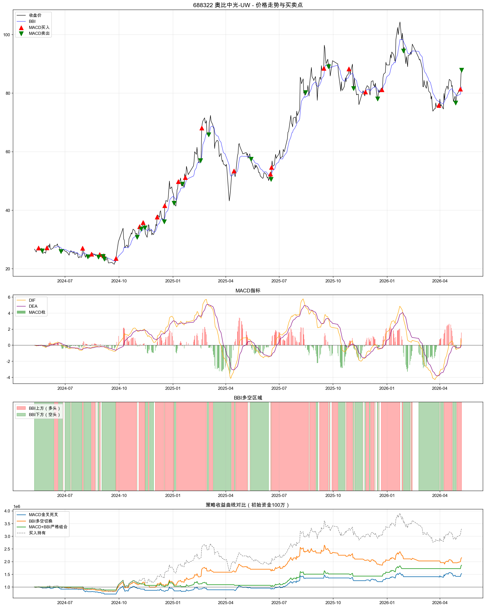
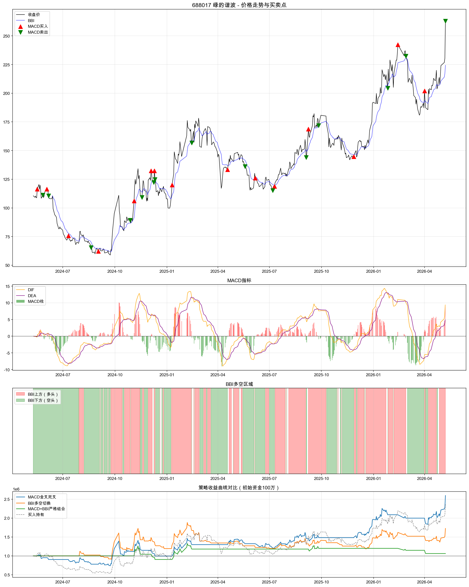

# A股688322 & 688017 MACD+BBI两年回测分析报告

**生成时间**: 2026-05-10 21:25
**回测区间**: 20240510 至 20260510
**交易成本**: 双边0.1%
**初始资金**: 100万

---

## 688322 奥比中光-UW

**两年涨跌幅**: 229.29%

### 策略统计对比
| 策略名称         |   交易次数 | 胜率   | 平均收益   | 平均亏损   |   盈亏比 | 总收益率   | 最大单笔盈利   | 最大单笔亏损   | 平均持仓天数   | 最大回撤   | 相对基准超额   |
|:-----------------|-----------:|:-------|:-----------|:-----------|---------:|:-----------|:---------------|:---------------|:---------------|:-----------|:---------------|
| MACD金叉死叉     |         23 | 39.1%  | 13.58%     | -4.53%     |     3    | 53.01%     | 46.44%         | -10.92%        | 15.9天         | 28.35%     | -176.28%       |
| BBI多空切换      |         37 | 29.7%  | 16.27%     | -2.94%     |     5.54 | 115.72%    | 50.88%         | -6.47%         | 10.7天         | 29.70%     | -113.57%       |
| MACD+BBI严格组合 |         18 | 38.9%  | 16.94%     | -3.70%     |     4.58 | 86.15%     | 46.44%         | -5.82%         | 13.1天         | 20.91%     | -143.14%       |

### MACD金叉后N日收益分布
| 周期 | 平均收益 | 胜率 | 最大收益 | 最大亏损 | 信号次数 |
|------|---------|------|---------|---------|---------|
| 1日 | 1.08% | 56.5% | 8.94% | -4.74% | 23 |
| 3日 | 2.57% | 50.0% | 43.55% | -11.44% | 22 |
| 5日 | 2.20% | 50.0% | 26.46% | -14.16% | 22 |
| 10日 | 3.47% | 68.2% | 17.68% | -12.01% | 22 |
| 20日 | 8.83% | 72.7% | 38.00% | -10.22% | 22 |

### BBI突破后N日收益分布
| 周期 | 平均收益 | 胜率 | 最大收益 | 最大亏损 | 信号次数 |
|------|---------|------|---------|---------|---------|
| 1日 | 0.82% | 51.4% | 11.17% | -5.55% | 37 |
| 3日 | 2.25% | 56.8% | 43.55% | -11.44% | 37 |
| 5日 | 1.64% | 52.8% | 26.46% | -9.92% | 36 |
| 10日 | 1.03% | 44.4% | 20.26% | -12.68% | 36 |
| 20日 | 4.01% | 48.6% | 42.40% | -21.88% | 35 |

---

## 688017 绿的谐波

**两年涨跌幅**: 137.85%

### 策略统计对比
| 策略名称         |   交易次数 | 胜率   | 平均收益   | 平均亏损   |   盈亏比 | 总收益率   | 最大单笔盈利   | 最大单笔亏损   | 平均持仓天数   | 最大回撤   | 相对基准超额   |
|:-----------------|-----------:|:-------|:-----------|:-----------|---------:|:-----------|:---------------|:---------------|:---------------|:-----------|:---------------|
| MACD金叉死叉     |         15 | 53.3%  | 21.44%     | -7.19%     |     2.98 | 159.66%    | 43.19%         | -13.70%        | 27.4天         | 29.52%     | 21.81%         |
| BBI多空切换      |         38 | 28.9%  | 15.38%     | -3.44%     |     4.48 | 72.58%     | 40.10%         | -11.46%        | 9.7天          | 37.02%     | -65.27%        |
| MACD+BBI严格组合 |          7 | 42.9%  | 12.10%     | -6.37%     |     1.9  | 6.19%      | 30.37%         | -7.86%         | 12.3天         | 28.42%     | -131.66%       |

### MACD金叉后N日收益分布
| 周期 | 平均收益 | 胜率 | 最大收益 | 最大亏损 | 信号次数 |
|------|---------|------|---------|---------|---------|
| 1日 | 0.80% | 46.7% | 11.75% | -5.64% | 15 |
| 3日 | 0.62% | 40.0% | 21.62% | -13.86% | 15 |
| 5日 | 0.95% | 46.7% | 26.46% | -16.38% | 15 |
| 10日 | -0.93% | 46.7% | 31.50% | -19.74% | 15 |
| 20日 | 1.55% | 46.7% | 55.85% | -33.39% | 15 |

### BBI突破后N日收益分布
| 周期 | 平均收益 | 胜率 | 最大收益 | 最大亏损 | 信号次数 |
|------|---------|------|---------|---------|---------|
| 1日 | -0.28% | 39.5% | 11.46% | -5.75% | 38 |
| 3日 | 1.75% | 50.0% | 33.39% | -13.86% | 38 |
| 5日 | 3.79% | 60.5% | 74.61% | -16.38% | 38 |
| 10日 | 4.10% | 51.4% | 49.36% | -14.81% | 37 |
| 20日 | 7.12% | 52.8% | 42.57% | -29.69% | 36 |

---

## 核心规律总结

### 1. MACD规律
- 金叉信号在不同周期后的平均收益和胜率
- 死叉作为卖出信号的有效性
- MACD柱状图背离情况

### 2. BBI规律
- 股价突破BBI后的短期/中期表现
- BBI作为多空分界线的可靠性
- 结合趋势方向的BBI信号效果

### 3. 组合规律
- MACD+BBI组合是否优于单指标
- 信号过滤效果（减少假信号）
- 最佳持仓周期建议