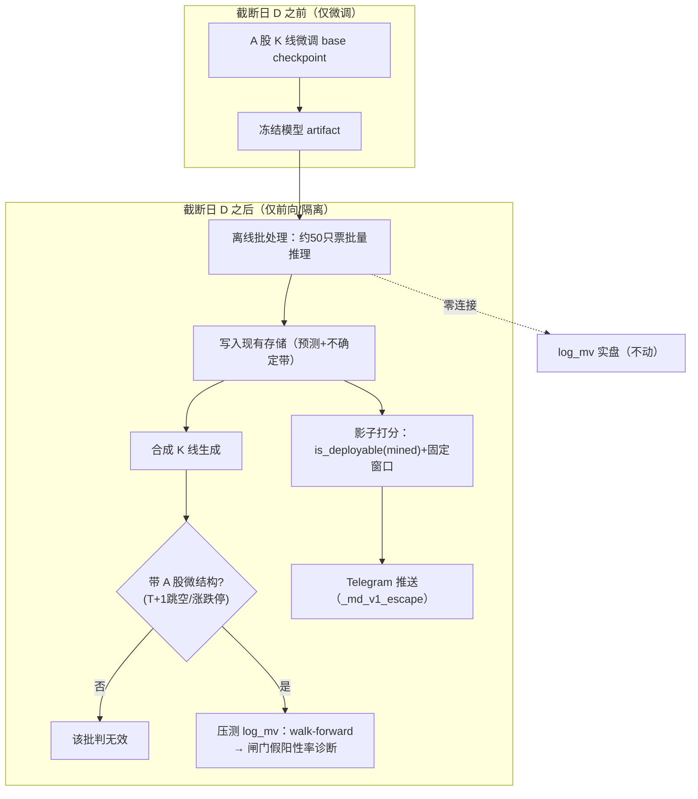

# feat: Kronos 接入 KSS 第一里程碑 — 离线影子部署 + 合成 K 线压测

## Summary

把 Kronos（K 线基础模型）作为只读离线批处理接入 KSS：vendor 进独立子目录、用 base checkpoint 在 A 股 K 线上微调（冻结截断日隔离），每日/每周对约 50 只实盘票产出预测写入现有存储。同一批处理喂两个能力——影子通道（前向预测走 `is_deployable(strategy_family="mined")` 闸门积累无污染战绩）与合成压测（生成对抗 regime 量化闸门假阳性率）。`log_mv` 全程不动。

---

## Problem Frame

KSS 所有回测的最大软肋是样本短（约 50 标的 × 2.3 年），在其上验证的 `is_deployable` 闸门本身可能过拟合；团队对 T+1 涨跌停下的深度方向预测有据可查的怀疑（LGB-MSE / Transformer-DL / Alpha158 均在严格偏差防御下衰减被弃）。直接把 Kronos 当 alpha 源会撞同一堵墙。本计划把 Kronos 用在它擅长且无法被刷分的两处：造对抗数据补样本缺口、跑前向影子攒未污染证据。详见 origin。

---

## Key Technical Decisions

- **Vendor 进独立子目录 + 依赖隔离**（see origin）。Kronos 当前未 vendored；放进独立子目录，依赖与主环境隔离，不污染 KSS 运行栈。
- **微调用 base checkpoint**（102M / 12 层）。mini 虽有 2048 上下文但仅 4.1M 表达力弱；日线 lookback 通常 < 512，base 的 512 上下文够用。
- **影子按 `strategy_family="mined"` 计闸门**。`kss/backtest/significance.py` 已确认 mined → n_trials=100，DSR 极严（足以拒掉 Sharpe 1.93）。基础模型携带巨大隐藏试验次数，这个惩罚是目的不是障碍。
- **合成压测=诊断，非新硬闸门**（see origin）。量化现有闸门在已知零结构数据上的假阳性率，不阻断任何策略上线。
- **冻结截断日做泄漏隔离**（see origin）。微调只用截断日前数据、模型定住；影子与压测只跑截断日后。这是"无污染前向证据"价值主张的前提。
- **A 股微结构校验是合成压测的前置闸门**。生成的 K 线须带 T+1 跳空、涨跌停截断，否则该批压测判无效——做成独立 gating 单元（U6），先过校验再采信 U7 诊断。

---

## High-Level Technical Design

冻结截断日 D 把时间轴切成两段：D 之前只用于微调，D 之后只用于影子与压测，两段零重叠。

---

## Requirements Traceability

覆盖 origin 全部 17 条需求：基础设施 R1–R3（U1/U2/U4）、微调与隔离 R4–R7（U1/U3）、影子 R8–R11（U5）、合成压测 R12–R15（U6/U7）、交付监控 R16–R17（U8）。Acceptance Examples AE1–AE5 映射见各单元 test scenarios。

---

## Implementation Units

按四阶段分组：基础（U1–U4）→ 影子（U5）→ 合成压测（U6–U7）→ 交付（U8）。

### U1. Vendor Kronos + 隔离依赖 + base checkpoint

- **Goal:** 把 Kronos 源码放进独立子目录，建立隔离依赖，拉取 base checkpoint 与配套 tokenizer。
- **Requirements:** R3, R4
- **Dependencies:** 无
- **Files:** `kronos_vendor/`（新建子目录，含上游源码）、`kronos_vendor/requirements.txt`（隔离依赖：`torch>=2.0`、`einops`、`huggingface_hub`、`safetensors`）、`docs/plans/...`（本计划）
- **Approach:** vendor 上游 `model`（`Kronos` / `KronosTokenizer` / `KronosPredictor`）与 `finetune` 目录。base 权重 `NeoQuasar/Kronos-base` + `Kronos-Tokenizer-base`。依赖装进独立环境/约束文件，不并入 KSS 主依赖。确认 CPU/小显存可跑。
- **Patterns to follow:** KSS 现有子模块布局（`kss/` 各功能包）。
- **Test scenarios:** `Test expectation: none -- vendoring 与依赖装配，无行为逻辑`。验证项：base checkpoint 能加载、`KronosPredictor.predict` 在样例 OHLCV 上跑通（冒烟，非单测）。

### U2. KSS OHLCV → Kronos 输入适配器 + 可交易性过滤

- **Goal:** 把 KSS 的日线 CSV/存储转成 Kronos 输入契约，并按 KSS 同口径过滤不可交易标的。
- **Requirements:** R1, R17
- **Dependencies:** U1
- **Files:** `kss/kronos/adapter.py`（新建）、`kss/kronos/tests/test_adapter.py`（新建）
- **Approach:** 输出 Kronos 要求的 DataFrame（列 `open/high/low/close/vol/amount`）+ `x_timestamp` / `y_timestamp` 序列。复用 `kss/data/suspension_data.py` 的 `is_tradable` / `filter_tradable` 剔除停牌/ST/退市/零成交，与 `log_mv` 同口径。
- **Patterns to follow:** `kss/data/suspension_data.py::SuspensionData`；现有 cs_data CSV 列定义。
- **Test scenarios:**
  - happy: 给定一只票的 N 日 OHLCV，适配器产出列名/dtype 正确、时间戳单调递增的 DataFrame。
  - edge: 历史不足 lookback 的票被跳过且记录原因。
  - integration: `Covers R17.` 停牌/ST/零成交标的经 `filter_tradable` 后不出现在输出集。

### U3. A 股微调（冻结截断日）+ 泄漏隔离

- **Goal:** 用 base 在截断日 D 之前的 A 股数据微调，产出冻结模型 artifact；建立并测试无泄漏时间隔离。
- **Requirements:** R4, R5, R6, R7
- **Dependencies:** U1, U2
- **Files:** `kss/kronos/finetune.py`（新建，封装上游 finetune 流程）、`kss/kronos/isolation.py`（新建，截断日与窗口断言）、`kss/kronos/tests/test_isolation.py`（新建）
- **Approach:** 微调输入严格截止于 D；产出带 D 标记的冻结 artifact，里程碑内不再训练。`isolation.py` 断言：(a) 训练样本时间戳 ≤ D；(b) 任何推理输入窗口末尾严格早于被预测 bar。Kronos 未声明 split/泄漏防护，隔离由我方保证。参考 `docs/solutions/known_bias_gaps.md`（特征级 look-ahead 当前无防护，`purge_gap` 只挡标签泄漏）。
- **Execution note:** 先写隔离断言的失败测试，再接微调流程（特征级泄漏是本里程碑最高风险失败模式）。
- **Patterns to follow:** `docs/solutions/lookahead_bias_lessons.md`、`docs/solutions/known_bias_gaps.md`；`kss/tests/test_adversarial.py` 中 `test_lookahead_factor_caught_by_purge_gap` 的镜像写法。
- **Test scenarios:**
  - `Covers AE5.` 构造末尾跨越被预测 bar 的输入窗口 → 隔离断言抛错被回归测试捕获。
  - edge: 训练集含 D 之后样本 → 断言失败。
  - happy: 全部样本 ≤ D 时微调正常产出冻结 artifact 并带 D 元数据。

### U4. 离线批处理推理任务

- **Goal:** 加载冻结模型，对约 50 只票在 D 之后窗口批量推理，预测（点估计+不确定带）写入现有存储，与 `log_mv` 零连接。
- **Requirements:** R1, R2, R3, R6
- **Dependencies:** U2, U3
- **Files:** `kss/kronos/batch_infer.py`（新建）、`kss/kronos/tests/test_batch_infer.py`（新建）
- **Approach:** `predict_batch` 跑全 universe；只读，不写任何与实盘决策耦合的路径。复用现有存储层（SQLite/parquet）；预测表 schema 在实现时定。调度方式与频率见 Open Questions。不进每日实盘 cron 关键路径。
- **Patterns to follow:** `scripts/run_paper_trade_daily.sh` 的 wrapper + `.env` grep 模式；现有 SQLite/parquet 存储写法。
- **Test scenarios:**
  - happy: 给定冻结模型与 universe，批处理产出每票一条 D 之后预测并落存储。
  - `Covers AE1.` 预测仅覆盖 D 之后交易日；D 及之前不产出。
  - error: 单票数据缺失时跳过并记录，不中断整批（exit-code 语义沿用 paper_trade 契约）。
  - integration: 写入存储后不触发任何 `log_mv` 路径（断言零连接）。

### U5. 影子打分：is_deployable(mined) + 固定窗口 + 周校验

- **Goal:** 影子前向战绩走与 `log_mv` 同一闸门（按 mined 计），满固定窗口才毕业；接入周校验。
- **Requirements:** R8, R9, R10, R11
- **Dependencies:** U4
- **Files:** `kss/kronos/shadow.py`（新建）、`kss/kronos/tests/test_shadow.py`（新建）、`scripts/validate_predictions.py`（扩展）
- **Approach:** 影子只读、达标前不影响任何决策。战绩走 `Significance.is_deployable(strategy_family="mined")`（n_trials=100）。毕业 = 过闸门 **且** 满固定前向窗口（窗口长度见 Open Questions）。扩展 `scripts/validate_predictions.py` 给影子打 Brier/方向/区间覆盖，沿用连续两周不达标拉黑的停用规则。
- **Patterns to follow:** `kss/backtest/significance.py::Significance.is_deployable`；`docs/solutions/daily_review_prediction_validation.md`（区间过窄教训：不确定带下限锚在无条件日波动分位）。
- **Test scenarios:**
  - `Covers AE2.` 原始 Sharpe 高但 mined DSR 未过闸门 → 判未毕业、维持只读。
  - happy: 过闸门且满窗口 → 标记可毕业。
  - edge: 窗口未满即使过闸门也不毕业。
  - integration: `Covers R11.` 周校验任务对影子产出 Brier/方向/覆盖率三项并落记录。

### U6. 合成 K 线生成 + A 股微结构校验闸门

- **Goal:** 用冻结模型条件化真实历史生成对抗 regime，并在采信前校验其带 A 股微结构。
- **Requirements:** R12, R15
- **Dependencies:** U3
- **Files:** `kss/kronos/synth_gen.py`（新建）、`kss/kronos/microstructure_check.py`（新建）、`kss/kronos/tests/test_microstructure.py`（新建）
- **Approach:** 生成涨跌停连锁、流动性枯竭、板块急跌等对抗路径。`microstructure_check.py` 校验生成 K 线含 T+1 跳空与涨跌停截断特征；不达标的批次标记无效、不进 U7 诊断。这是 U7 的前置 gating。
- **Patterns to follow:** Kronos 生成 API（temperature/top_p/sample_count）；A 股涨跌停规则（科创/创业 20cm）。
- **Test scenarios:**
  - `Covers AE4.` 缺涨跌停截断或 T+1 跳空的批次 → 标记无效、不进诊断。
  - happy: 含完整微结构的批次通过校验。
  - edge: 涨跌停板比例显著偏离真实分布时告警。

### U7. 合成压测诊断（闸门假阳性率）

- **Goal:** 把 `log_mv` 及候选策略在通过校验的合成路径上跑现有 walk-forward，产出闸门假阳性率诊断报告。
- **Requirements:** R12, R13, R14
- **Dependencies:** U6
- **Files:** `kss/kronos/stress_diagnostic.py`（新建）、`kss/kronos/tests/test_stress_diagnostic.py`（新建）
- **Approach:** 合成数据严格隔离（只压测、不训练、不当实盘信号）。在已知零结构合成路径上跑 `factor_cross_section_backtest`（`kss/backtest/cross_section.py:29`）+ `is_deployable`，统计闸门误判 deployable 的比例 = 假阳性率。输出诊断报告，**不**作为阻断闸门。
- **Patterns to follow:** `kss/backtest/cross_section.py::factor_cross_section_backtest`；`kss/backtest/significance.py`。
- **Test scenarios:**
  - `Covers AE3.` 输出是假阳性率诊断报告，而非阻止策略上线的 PASS/FAIL 门。
  - happy: 给定一批通过校验的合成路径，产出可复现的假阳性率数字。
  - edge: 全部合成批次无效时报告标注"无有效样本"而非给出误导数字。
  - integration: `Covers R13.` 合成数据不写入任何训练或实盘信号路径（断言隔离）。

### U8. 交付与监控接线

- **Goal:** 影子/诊断结果经 Telegram 推送，复用转义与可交易性过滤，避免静默丢失。
- **Requirements:** R16, R17
- **Dependencies:** U5, U7
- **Files:** `kss/kronos/notify.py`（新建）、`kss/kronos/tests/test_notify.py`（新建）
- **Approach:** 任何用户数据字段经 `_md_v1_escape`（`kss/prediction/cross_sectional_forecast.py:43`）转义；发送前 `chat_id=0` dry-run 探针；竖卡布局（V1 不渲染表格）。沿用 `SuspensionData` 过滤口径。
- **Patterns to follow:** `kss/prediction/cross_sectional_forecast.py` 的 `_md_v1_escape` + dry-run；`docs/solutions/telegram_markdown_v1_silent_drop.md`。
- **Test scenarios:**
  - `Covers R16.` 含 `*ST` / `5G_概念` 等保留字的股票名经转义后推送不被 400 拒、不静默丢失。
  - happy: 影子毕业状态与压测诊断各自渲染成合规竖卡消息。
  - error: dry-run 探针失败时 fail loud（非静默返回 False）。

---

## Scope Boundaries

**Deferred for later**
- ideation 其余 5 条：波动率定盘（I3）、残差异常监控（I4）、涨跌停可交易性过滤（I5）、量价泄漏探针（I6）、蒸馏特征（I7）。
- 实盘资金分配——仅到影子 + paper-trade。
- 滚动再微调——本里程碑用单一冻结截断日。

**Outside this product's identity**
- 用 Kronos 替换或挑战 `log_mv` 作为可部署 alpha。
- 把 Kronos 方向点预测直接当交易信号。

**Deferred to Follow-Up Work**
- 预测表 schema 的最终形态（U4 实现时定）。
- 影子毕业后如何接入决策（本里程碑只到"标记可毕业"，不接决策）。

---

## Risk Analysis & Mitigation

- **特征级泄漏（最高风险）。** Kronos 吃滑动窗口、无内建防护。缓解：U3 隔离断言 + 失败测试先行（AE5），镜像现有 `test_lookahead_factor_caught_by_purge_gap`。
- **合成数据不真实 → 压测无效。** 缓解：U6 微结构校验作为 U7 前置闸门（AE4）。
- **影子战绩被微调污染。** 缓解：冻结截断日，影子只跑 D 之后（AE1）。
- **Telegram 静默丢推送。** 缓解：U8 `_md_v1_escape` + dry-run 探针。
- **A 股不在预训练语料（未确认）→ 零样本/微调效果不达预期。** 缓解：影子走 mined 严闸门，达不到就维持只读，不强行上线。

---

## System-Wide Impact

新增 `kss/kronos/` 包与 `kronos_vendor/` 子目录，依赖隔离不动主环境。扩展 `scripts/validate_predictions.py`（影子打分）。`log_mv` 实盘路径、现有 cron、MCP 零改动。新增离线调度任务（频率见 Open Questions）。

---

## Open Questions

**Deferred to Planning（已在本计划解决）**
- checkpoint 选型 → base（KTD）。
- 接入方式 → vendor 独立子目录 + 隔离依赖（KTD）。
- 微结构校验定位 → U6 独立前置闸门。

**Deferred to Implementation**
- 固定前向窗口的具体长度（~1 季度 / 60 交易日为设想，实现/运营时定）。
- 微调数据跨度与冻结截断日 D 的具体取值。
- 预测表 schema 与离线批处理调度频率（日/周）及挂载方式（复用 `run_paper_trade_daily.sh` 式 wrapper 还是新建 launchd/cron）。

---

## Sources & Research

- Origin: `docs/brainstorms/2026-06-15-kronos-shadow-synthetic-stress-requirements.md`
- Ideation: `docs/ideation/2026-06-15-kronos-kss-integration-ideation.html`
- Kronos: github.com/shiyu-coder/Kronos（AAAI 2026, arXiv:2508.02739）；HF `NeoQuasar/Kronos-base`；MIT。
- 既有模块：`kss/backtest/significance.py`（`is_deployable`/mined n_trials=100）、`kss/backtest/cross_section.py:29`（`factor_cross_section_backtest`）、`kss/data/suspension_data.py`、`kss/prediction/cross_sectional_forecast.py:43`（`_md_v1_escape`）、`scripts/validate_predictions.py`、`scripts/run_paper_trade_daily.sh`。
- 学习沉淀：`docs/solutions/lookahead_bias_lessons.md`、`docs/solutions/known_bias_gaps.md`、`docs/solutions/daily_review_prediction_validation.md`、`docs/solutions/telegram_markdown_v1_silent_drop.md`、`docs/solutions/paper_trade_deployment.md`。
