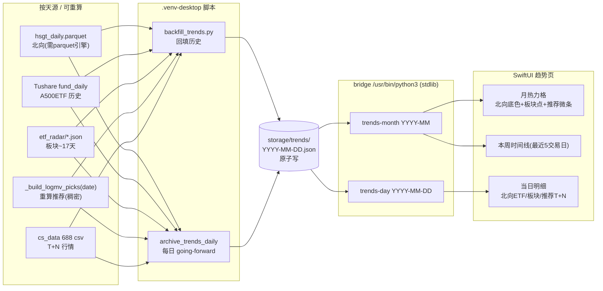

# feat: 趋势页 —— 日历为核心的主力资金/板块/推荐月周变化视图

## Summary

在 KSS Desktop 新增「趋势」页，以日历为核心，把三类总览内容按天铺开，看本周/本月变化：

- **主力资金流向** —— 北向资金净流入（历史稠密）+ A500ETF ×2 当日涨跌幅。
- **板块复盘** —— 概念主题强弱（etf_radar 切片）。
- **每日推荐跟踪** —— 当日 log_mv 推荐 + 后续 T+1/T+5/T+20 表现（红涨绿跌）。

日历形态：**上方月度热力格 + 下方本周横向时间线卡**，点某天展开当日明细。Dayflow（`JerryZLiu/Dayflow`）是独立 macOS app 而非可导入组件，故采用其设计语言、原生 SwiftUI 自建，不引入依赖。

数据策略：**回填历史 + going-forward 每日归档**，落 `storage/trends/*.json`，bridge 用 stdlib 只读（沿用 `market_strip.json` 模式）。**诚实声明数据密度（评审核实）**：北向历史稠密（`hsgt_daily.parquet`）；推荐用 `_build_logmv_picks(date)` 按历史日**重算 log_mv** → 稠密、且 picks 天然属 cs_data 688 池，T+N join 的 csv 必存在；板块 `etf_radar/*.json` 仅 ~17 天（2026-05-22→06-19，聚簇带缺口）→ 板块段回填初期稀疏，随 going-forward 累积变密；A500ETF **无按天 csv**（实时取自 Tushare `fund_daily`），回填需另取 fund_daily 历史或只走 going-forward。

---

## Problem Frame

总览页是「今天」的快照：第一行主力资金、今日板块、今日推荐都只反映当天。用户无法回看「本周北向是持续流入还是反复」「这板块热了几天」「上周推的票现在涨没涨」。需要时间轴维度，把这些按天对齐，月/周两个粒度可读。

约束：
- KSS Desktop 瘦前端，Python CLI 不进包靠仓库跑（记忆 `kss-desktop-packaging-deferred`）。
- LLM 不复述金融数字，真值代码渲染（记忆 `llm-numbers-deterministic-rendering`）；本页全确定性数值，且 T+N 计算需防停牌跳空导致的「按行偏移张冠李戴」（见 U1）。
- 前端默认 M3 响应式布局（记忆 `m3-responsive-layout-default`）。
- bridge 走 `/usr/bin/python3`（stdlib + PyYAML）；重依赖（pandas 读 parquet、Tushare）走 `.venv-desktop`。

---

## Requirements

- **R1** 新增侧栏可重排页「趋势」，「总览」仍置顶（复用 `WorkspaceSection.reorderable` + `ordered(from:)`）。
- **R2** 月度热力格：当前月每天一格，**底色编码北向强弱**（方向+量级），**每格叠加板块热度小点 + 推荐胜负微条**使月尺度同时可读三类（见 KTD4）；非交易日/缺数据/部分数据三态区分（见 U6）。可切上/下月。
- **R3** 本周时间线：**最近 5 个交易日**（KTD6）横向卡片，每张含当日北向、板块 top 主题、推荐数/推荐均 T+N；缺数据行折叠不留空槽。
- **R4** 当日明细：点热力格某天或某周卡 → 展开该日 {北向+ETF、板块主题列表、推荐列表（含 T+1/T+5/T+20，红涨绿跌）}。
- **R5** 历史回填：聚合既有源 + 重算落过去 N 天 `storage/trends/*.json`，**使日历北向段完整、推荐段稠密、板块段在有源日有效**（缺源日明确空态，非"打开即三类全满"）。
- **R6** going-forward 每日归档：新增 launchd 任务每日落当天 trends json；自动并入既有定时任务模块（分类/白名单/漏跑自检无需改）。
- **R7** 页内股票名称/代码点击即走导入路径（复用 `store.selectStock`）。
- **R8** 过渡与形状遵循 M3（复用 `KSSTheme.fadeThrough` / shape tokens）。

---

## Key Technical Decisions

- **KTD1 — Dayflow 作设计参照而非依赖。** 已核实 `JerryZLiu/Dayflow` 是 MIT 独立 macOS app（Swift/SwiftUI，无 Swift Package、非组件库），UI 为时间线卡 + GitHub 活跃度格 + 周报聚合。→ 原生 SwiftUI 自建、借鉴热力格/日卡视觉、不依赖不 fork。
- **KTD2 — 归档落 `storage/trends/YYYY-MM-DD.json`，bridge 只读。** 回填脚本与每日归档脚本都写它（原子写：`.tmp` → `rename`），bridge `trends-month`/`trends-day` 只读做聚合。bridge 保持 stdlib-only；重依赖隔离在 `.venv-desktop` 脚本。
- **KTD3 — 推荐 = 按历史日重算 log_mv（息复用户原选；评审修正）。** 用 bridge 既有 `_build_logmv_picks(date)` 对每个历史日重算 picks → 历史稠密。**关键收益**：picks 天然属 cs_data 688 池，故 T+N join 的 `cs_data_<code>.csv` 必存在，规避「移池/退市取不到」。代价「跨日口径漂移」对个人趋势工具可接受（用户已知情选择）。（曾误改为读 paper_trade 日志——全仓仅 4 天，已回退。）
- **KTD4 — 月热力格三指标分层（评审修正）。** 格子**底色 = 北向净额**（流入红、流出绿、量级控深浅）；**叠加两枚 micro 标记**：板块热度小点（当日强势主题数/强度）+ 推荐胜负微条（当日推荐均 T+N 正负）。使月尺度「一眼」同时承载三类，修复"只北向上色 ⊥ 一眼看三类"的矛盾。空数据日不画标记。
- **KTD5 — 月/周两粒度同页分层。** 上热力格（月度节奏）+ 下本周时间线（最近 5 交易日明细），点击联动当日明细。
- **KTD6 — 「本周」= 最近 5 个交易日（原 OQ3 定稿）。** 与红涨绿跌交易语境一致，避免自然周跨月/含非交易日割裂。R3 据此。
- **KTD7 — 北向回填走 parquet（需先验依赖）、ETF 回填走 Tushare `fund_daily`。** 北向历史读 `storage/macro/hsgt_daily.parquet`，**但本机 `.venv-desktop`/`.venv`/系统 python 当前均缺 pyarrow/fastparquet（评审实测）→ U2 前置：先装 parquet 引擎或改用 Tushare `moneyflow_hsgt` 历史**。A500ETF **无按天 csv**（`cs_data_563360/159361.csv` 不存在），历史走 Tushare `fund_daily`（`.venv-desktop`，已有 token）；若不取则 ETF 段只 going-forward 从 `market_strip.json` 落。

---

## High-Level Technical Design

数据流（多源归档/重算 → 聚合落盘 → bridge 只读 → SwiftUI 两粒度渲染）：



每日 `storage/trends/YYYY-MM-DD.json` 契约（U1 定稿）：

```jsonc
{
  "date": "2026-06-18",
  "isTrading": true,
  "north": { "money": 42.9, "unit": "亿", "dir": "in" },        // 北向净额（万元→亿元换算）
  "etfs": [ { "code": "563360.SH", "name": "A500ETF", "pct": 0.65 } ],   // 缺则 null
  "sectorTop": [ { "name": "半导体", "grade": "强势确认", "past5Ret": 6.3 } ],  // 字段名对齐 _pulse_from_dict（grade，非 strength）
  "sectorCount": 8,
  "recs": [ { "symbol": "688114.SH", "name": "华大智造",
             "fwd": { "t1": 1.2, "t5": 3.4, "t20": 8.1, "asof": "2026-06-25" } } ],   // 缺/停牌→null + asof 标实际落点防张冠李戴
  "recCount": 5,
  "recAvgFwd": 2.3,            // 推荐均 T+5（驱动热力格推荐微条）
  "heat": 0.73,               // 北向量级归一化（驱动格子底色深浅）
  "sectorHeat": 0.5,          // 板块强势强度归一化（驱动板块小点）
  "flags": { "north": true, "etf": true, "sector": true, "recs": true }  // 各类是否有数据，驱动三态/标记
}
```

---

## Output Structure

```text
scripts/
  backfill_trends.py            # 新增：一次性回填历史 → storage/trends/*.json
  archive_trends_daily.sh       # 新增：going-forward 每日归档 wrapper（.venv-desktop）
  archive_trends_daily.py       # 新增：单日 trends json 构建（被 backfill 与 daily 共用，原子写）
  selftest_trends_bridge.py     # 新增：trends-month/day 读取逻辑纯逻辑自检
deploy/launchd/
  com.zcdeng.kss.trends_archive_daily.plist   # 新增
storage/trends/                 # 新增：每日 trends 归档（数据契约 U1）
Sources/KSSDesktop/
  Models/KSSModels.swift        # 修改：WorkspaceSection 增 .trends；新增 Trend* 模型
  Services/KSSStore.swift       # 修改：loadTrendsMonth/Day
  Services/BridgeClient.swift   # 修改：trendsMonth/trendsDay
  Views/ContentView.swift       # 修改：侧栏接入 + detail switch
  Views/TrendsView.swift        # 新增：趋势页
scripts/kss_app_bridge.py       # 修改：trends-month / trends-day 命令
```

---

## Implementation Units

### U1. 数据契约 + 单日构建器（含重算推荐 + 多 horizon T+N）

**Goal** 定稿每日 trends json 契约，实现「给定日期 → 构建该日 trends dict」纯函数，供回填与每日归档共用。
**Requirements** R5, R6
**Dependencies** 无
**Files** `scripts/archive_trends_daily.py`（含 `build_trend_day(date) -> dict`，原子写 helper）、`storage/trends/`
**Approach** 聚合：北向读 `hsgt_daily.parquet`（pandas，万元→亿元；依赖见 KTD7）；ETF 走 Tushare `fund_daily`（缺则 `etfs:null`）；板块读 `storage/etf_radar/<YYYYMMDD>.json`，字段对齐 `_pulse_from_dict`（用 `grade`，取 top 5 + 总数）；**推荐用 `_build_logmv_picks(date)` 重算**当日 picks。**T+N 不复用 `_tracking_return`（它只算单段 T+1→T+2，给不出多 horizon）**，改用 `_recommendation_tracking`/`_horizon_return` + `_HORIZONS=((t1,1),(t5,5),(t20,20))` 同款逻辑，抽成可被脚本 import 的共享 util；**按交易行偏移解析 horizon 后校验落点日期在预期窗口内，停牌/跨大缺口则该 horizon 置 null 并记 `asof` 实际落点**，防止把 3 周后的行当 T+5。缺源字段置 null（Fail loud：stderr 记缺哪类），写 `flags`。
**Patterns to follow** `scripts/refresh_market_strip.py`（hsgt parquet + tushare 读法）、bridge `_build_logmv_picks`/`_recommendation_tracking`/`_horizon_return`/`_pulse_from_dict`。
**Test scenarios**
- 全源日 → dict 含 north/etfs/sectorTop/recs + flags，类型合契约。
- 北向万元→亿元换算正确（429000 万→42.9 亿，dir=in）。
- 重算推荐：对已知历史日 `_build_logmv_picks` 产出非空 picks，且每个 symbol 的 `cs_data_<code>.csv` 存在（池内性）。
- T+N 正常日 → t1/t5/t20 数值正确、红涨绿跌符号对。
- **停牌/跨缺口日 → 受影响 horizon 置 null + asof 标实际落点，不输出错配数值**（防张冠李戴）。
- 缺 etf_radar 日 → sectorTop=[]、flags.sector=false，其余正常。
- ETF 取不到（fund_daily 失败）→ etfs=null、flags.etf=false，不整体失败。
- `Covers R5.` 单日构建器对历史某日产出北向完整 + 推荐稠密的 dict。
**Verification** 对 `20260618` 运行：字段齐全、北向/推荐数值与当日总览一致、T+N 落点合理。

### U2. 历史回填脚本 backfill_trends.py（前置：parquet 引擎）

**Goal** 批量回填过去 N 天 → `storage/trends/*.json`。
**Requirements** R5
**Dependencies** U1
**Files** `scripts/backfill_trends.py`
**Approach** **前置检查 parquet 引擎**（`_has_any_module(("pyarrow","fastparquet"))` 同款）；缺则报错指引安装或回退 `moneyflow_hsgt`（KTD7）。枚举可回填交易日（hsgt 交易日历 ∩ cs_data 范围），逐日调 `build_trend_day`，**原子写**，`--force` 覆盖、**默认跳过 >= today（交给每日任务，避免与 U3 抢写）**。打印每日成功/缺源摘要（Fail loud）。
**Patterns to follow** 既有 `scripts/refresh_*.py` argparse + ROOT。
**Test scenarios**
- 跑已知区间 → 落对应天数 json，无未捕获异常。
- 重跑无 `--force` 跳过已存在；`--force` 覆盖；写中断不留半文件（原子）。
- 缺 parquet 引擎 → 明确报错 + 指引，不静默产错数。
- 某日缺板块/ETF → 仍落 json（部分 null + flags），摘要标注，不整体失败。
**Verification** 回填近一个月后 `ls storage/trends/`：**北向段覆盖该月交易日且数值完整、推荐段稠密；板块/ETF 段仅有源日有效，其余 flags 为 false —— 此为预期，非失败**。随机抽一天数值与当日总览/复盘一致。

### U3. going-forward 每日归档任务

**Goal** 每日自动落当天 trends json，并入既有定时模块。
**Requirements** R6
**Dependencies** U1
**Files** `scripts/archive_trends_daily.sh`（`.venv-desktop`，取 .env TUSHARE_TOKEN）、`deploy/launchd/com.zcdeng.kss.trends_archive_daily.plist`
**Approach** wrapper 调 `archive_trends_daily.py` 落当天（排在 hsgt/etf_radar/paper_trade 更新之后，约 18:10），**原子写**。plist 工作日定时、`StandardOutPath`→`storage/logs/cron/trends_archive_daily.log`。**无需改任务管理代码**——`_launchd_plists` glob 自动纳入；在 `LABEL_TITLES`/`LABEL_CATEGORY` 补一条（标题「趋势归档」、分类「数据更新」）。
**Patterns to follow** `scripts/run_hotspot_rotation_daily.sh` + `com.zcdeng.kss.hotspot_rotation_daily.plist`。
**Test scenarios**
- 手动跑 wrapper → 当天 `storage/trends/<today>.json` 生成（原子）。
- `cron-list` 含「趋势归档」、分类=数据更新、漏跑判定正常。
- Test expectation: launchd 定时触发靠手动 kickstart 验证，不在单测内。
**Verification** `launchctl kickstart` 后日志成功、当天 json 落地；任务页「数据更新」分类出现该任务。
**Execution note** 安装 plist（bootstrap）属持久配置，文件写好、由用户确认后再 bootstrap。

### U4. Bridge 读取命令 trends-month / trends-day

**Goal** stdlib-only：读 `storage/trends/*.json`，聚合月度格子 + 单日明细。
**Requirements** R2, R3, R4
**Dependencies** U1（契约）
**Files** `scripts/kss_app_bridge.py`（新增 `_trends_month`/`_trends_day` + 分发）、`scripts/selftest_trends_bridge.py`（新建，与 cron selftest 分离）
**Approach** `trends-month YYYY-MM` → 读该月所有 json，返回 `{month, days:[{date, isTrading, heat, sectorHeat, recAvgFwd, north, sectorCount, recCount, flags, hasData}]}`。`trends-day YYYY-MM-DD` → 单日完整明细。纯 stdlib（json+pathlib）；**日期参数正则白名单** `^\d{4}-\d{2}(-\d{2})?$`（防注入/路径穿越）。
**Patterns to follow** bridge `sector-rotation <date>` 读取 + `_json_dump`；日期白名单参照 cron label 防注入纪律。
**Test scenarios**
- `trends-month` 有数据月 → days 字段齐全（含 flags 驱动标记）；空月 → days=[]，不抛。
- `trends-day` 有归档 → 完整明细；无归档 → 明确空态结构，不崩。
- 注入/穿越参数（`../`、`2026-06; rm`）→ 正则拒绝，返回错误，不读任意文件。
- `Covers R2/R4.` month/day 输出能驱动热力格三标记与明细。
**Verification** `trends-month 2026-06`、`trends-day 2026-06-18` 合法 JSON；selftest 绿。

### U5. Swift 模型 + Store + BridgeClient 接线

**Goal** 趋势数据 Codable 模型与加载入口。
**Requirements** R2, R3, R4
**Dependencies** U4
**Files** `Sources/KSSDesktop/Models/KSSModels.swift`、`Sources/KSSDesktop/Services/KSSStore.swift`、`Sources/KSSDesktop/Services/BridgeClient.swift`
**Approach** 新增 `TrendMonth`/`TrendDayCell`（含 heat/sectorHeat/recAvgFwd/flags）/`TrendDayDetail`/`TrendRec`（含 `fwd` t1/t5/t20/asof 可选）等 Codable。`BridgeClient.trendsMonth(_:)`/`trendsDay(_:)` 走泛型 `run(_:as:)`。Store：`@Published trendMonth`/`trendDayDetail`/`trendsLoading`，`loadTrendsMonth(_:)`/`loadTrendsDay(_:)`，`Task.detached`。空/缺数据为正常态。**flex 解码**（吸取「复盘 invalid JSON」教训，缺字段给默认值）。
**Patterns to follow** 既有 `scheduledJobs()`/`HotspotLeaderStock` 容错解码。
**Test scenarios**
- Test expectation: 纯模型/接线，行为在 U6 与 bridge selftest 覆盖；此单元验证编译 + 样例 json（含 fwd 可选、flags）解码不丢字段。
**Verification** `swift build` 绿；store 能拉到 U4 输出并 published。

### U6. SwiftUI 趋势页 TrendsView（含完整交互态）

**Goal** 月热力格（北向底色+板块点+推荐微条）+ 本周时间线 + 当日明细，M3 风格 + 完整空/加载/选中态。
**Requirements** R2, R3, R4, R7, R8
**Dependencies** U5
**Files** `Sources/KSSDesktop/Views/TrendsView.swift`
**Approach** 三段：①**月热力格**——7×N，格底色按 `heat`（流入红/流出绿/量级深浅），叠 `flags.sector` 板块小点 + `recAvgFwd` 推荐胜负微条；**三态**：非交易日（空心描边/隐藏，不可点）、缺数据交易日（淡灰、不可点）、有数据（可点）；选中态描边；**色例 legend chip**（红=北向流入/绿=流出）+ ▲▼ 微标作色盲兜底；上/下月切换带骨架/防抖（切月未完成再点取消前一个 task）、越过最早回填月禁用箭头。②**本周时间线**——最近 5 交易日横向卡（北向/板块top/推荐数+均T+N）；today 卡主色描边、选中卡填充底、无数据卡占位「—」不可点；推荐行缺数据折叠。③**当日明细**——固定 `sectorTop` N=5（OQ2 定稿）；独立滚动区、北向ETF 段视觉主、板块 chips、推荐表（t1/t5/t20，红涨绿跌，停牌 horizon 显占位）。股票名/代码点击 → `store.selectStock`（复用导入；反馈复用 DashboardView 既有触感）。M3 shape tokens；进页 fade-through；contentW 居中。
**Patterns to follow** `DashboardView`（contentW、SectionHeader、`signColor`）、`IndexMarquee`/`HotspotRotationView`（自定义布局 + M3 token）、`RunbookView` 行卡。
**Test scenarios**
- 有数据月 → 格按 heat 上色 + 板块点/推荐微条按 flags 显隐；流入红/流出绿、空日三态正确区分。
- legend 显示；色盲微标（▲▼）在选中格可见。
- 切月 → 重新 loadTrendsMonth、骨架态、快速连点防抖；越过最早月箭头禁用。
- 点某天/周卡 → 当日明细加载；today/选中/无数据卡三态可辨。
- 推荐 t1/t5/t20 红涨绿跌正确；停牌 horizon 显占位不崩。
- 点推荐里某票 → `selectStock`（在池跳转/不在池导入）。
- 空数据月 → 空态文案，不崩。
- Test expectation: SwiftUI 以实机截图验证渲染 + 交互（沿用本项目验证方式）。
**Verification** 构建 .app、进趋势页：三段正确渲染、三标记/三态/legend、切月与点选联动、点票走导入、过渡生效（实机截图）。

### U7. 侧栏接入 + 路由 + 过渡

**Goal** 「趋势」进侧栏（可重排，总览置顶），路由与 fade-through 接好。
**Requirements** R1, R8
**Dependencies** U6
**Files** `Sources/KSSDesktop/Models/KSSModels.swift`（`WorkspaceSection` 增 `.trends`）、`Sources/KSSDesktop/Views/ContentView.swift`
**Approach** `WorkspaceSection` 加 `case trends`（displayName「趋势」、symbol `calendar` 或 `chart.line.uptrend.xyaxis`），落 `reorderable`（非 pinned）。`ordered(from:)` 既有「追加缺失 reorderable 项」使老用户配置自动纳入新页。ContentView detail switch 加 `.trends → TrendsView(...)`，复用 `.id(selectedSection).transition(KSSTheme.fadeThrough)` 与首次 `.task` `loadTrendsMonth(当前月)`。
**Patterns to follow** `.hotspot`/`.themes` 既有接入改法。
**Test scenarios**
- 侧栏出现「趋势」、可拖动重排、总览始终置顶。
- 老用户既有 `sidebarOrder` → 趋势自动出现在末尾（`ordered(from:)` 追加），不丢排序。
- 切到趋势页 fade-through 生效；首次进页自动加载当前月。
- Test expectation: 实机验证拖拽与过渡。
**Verification** 实机：趋势页可见、可重排、置顶规则正确、过渡一致。

---

## Scope Boundaries

**本计划内**：趋势页（月热力格三标记 + 周时间线 + 当日明细 + 完整交互态）、trends 归档契约 + 回填（重算推荐）+ 每日任务、bridge 只读命令、模型/store/侧栏接线。

### Deferred to Follow-Up Work
- 热力格热度量多视角切换（北向/板块/推荐主视角切换）—— 默认北向底色（KTD4），切换列后续。
- 趋势页内嵌走势小图（sparkline）/导出。
- 跨月范围选择、自定义区间。
- A500ETF 历史 `fund_daily` 回填若 token 配额紧 → 可先只 going-forward，历史 ETF 段留空。

### 非目标
- 不改总览既有三块（趋势页新增，不替换）。
- 不做盘中实时刷新（按日归档粒度）。
- 不引入/不 fork Dayflow 代码（仅设计参照，KTD1）。

---

## Risks & Dependencies

- **板块历史稀疏（评审实测）** —— `etf_radar/*.json` 仅 ~17 天（2026-05-22→06-19，聚簇带缺口）→ 回填月的板块段多为空。缺源日 `flags.sector=false`、热力格不画板块点、明细空态；随 going-forward 变密。**北向、推荐已不稀疏**（北向 parquet 深、推荐重算稠密）。
- **parquet 引擎缺失（评审实测，U2 前置）** —— `.venv-desktop`/`.venv`/系统 python 当前均无 pyarrow/fastparquet → 北向回填先装引擎或回退 `moneyflow_hsgt`。不可假设 parquet 可读。
- **A500ETF 无按天 csv** —— `cs_data_563360/159361.csv` 不存在；历史走 Tushare `fund_daily`，否则 ETF 段只 going-forward（已在 Deferred 兜底）。
- **T+N 张冠李戴** —— 按行偏移取 horizon 在停牌/缺口会错配 → U1 强制落点日期校验 + null + `asof`，并有专门测试。
- **重算推荐口径漂移** —— 跨日不可严格比较（个人工具可接受，用户知情选择，KTD3）。
- **双写竞争** —— 回填默认跳过 today、两脚本原子写（KTD2/U2/U3）。
- **bridge schema 漂移** —— Swift flex 解码（U5）。
- **依赖**：既有归档持续更新；既有定时任务模块（U3 自动并入）；Tushare token（ETF/北向回退）。

---

## Open Questions

- **OQ1（Deferred，倾向 KTD4）** 热力格底色驱动量：北向（默认）vs 可切板块/推荐。先固定北向 + 叠加标记，多视角切换列 Deferred。
- ~~OQ2 top N 主题~~ → **定稿 N=5**（KTD4/U6）。
- ~~OQ3 「本周」边界~~ → **定稿 = 最近 5 交易日**（KTD6/R3）。

---

## Sources & Research

- **Dayflow** `https://github.com/JerryZLiu/Dayflow`（WebFetch 核实）：独立 macOS app，Swift/SwiftUI，MIT，无 Swift Package、非组件库；UI = 时间线卡 + GitHub 活跃度格 + 周报。→ KTD1。
- **ce-doc-review 六persona + contradiction-finder（2026-06-20）实测更正**：`cs_data_563360/159361.csv` 不存在（ETF 走 fund_daily）；`_tracking_return` 仅单段 T+1→T+2，多 horizon 须用 `_recommendation_tracking`/`_horizon_return`/`_HORIZONS`；`paper_trade` 全仓仅 4 文件 → 推荐回退为 `_build_logmv_picks(date)` 重算（密集，且 picks∈cs_data 池保证 T+N csv 存在）；`etf_radar` 实有 ~17 天非 3 天；parquet 引擎本机缺失；`sectorTop` 字段对齐 `_pulse_from_dict` 的 `grade`；双写需原子+跳 today；月热力格须叠板块/推荐标记否则月视图只传北向一类。
- **代码侦察**：`scripts/kss_app_bridge.py`（`_build_logmv_picks`/`_recommendation_tracking`/`_horizon_return`/`_pulse_from_dict`/`_launchd_plists`/label maps）、`scripts/refresh_market_strip.py`（hsgt parquet + fund_daily 读法）、`storage/{macro,etf_radar,paper_trade}/`、`WorkspaceSection`。
- **项目记忆**：`llm-numbers-deterministic-rendering`、`m3-responsive-layout-default`、`kss-desktop-packaging-deferred`、`verify-data-source-before-building`。
