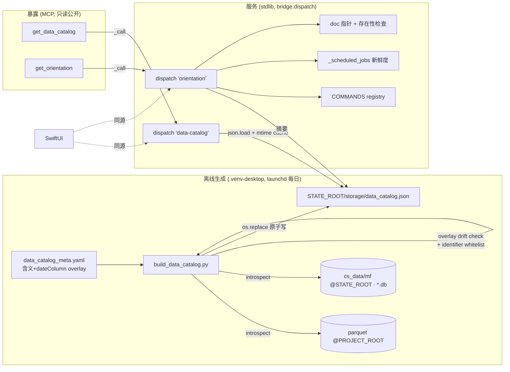

# feat: MCP 数据目录 + get_orientation 定向包(agent 公开地基)

## Summary

给 KSS 加两个公开只读 MCP 工具:`get_data_catalog`(自动反射的数据资产字典)
和 `get_orientation`(一次调用的上手定向包)。两者都经现有 `_call → bridge.dispatch`
缝暴露,与 SwiftUI 零逻辑 fork。这是 KSSDeck agent 面板(#4)及任意 agent
「快速吃透代码库 + 数据库」的地基(ideation #1+#2)。

核心架构:**生成离线 / 服务 stdlib**。`bridge.dispatch` 是 stdlib-only(feasibility 实证:
全程不 import pandas/pyarrow),所以读 parquet schema 的目录生成器作为 full-python 子进程跑、
写 `storage/data_catalog.json`;dispatch 的 `data-catalog` / `orientation` 处理器只做
stdlib `json.load` + 组装,持久 sidecar 里也能跑。

---

## Problem Frame

当前**零数据字典 / 零能力清单**。agent(含 Claude Code、未来 #4 面板 loop)上手要:
读 `kss/AGENTS.md` + 调 `get_snapshot` + 调 `list_cron` + grep pipeline 脚本猜 parquet 列名
(见 ai_native_surface_assessment.md「快速吃透」段)。数据资产散在 `STATE_ROOT` 的
`cs_data_*.csv` + `storage/macro/*.parquet`(11 个)+ 多个 `*.db` + 若干 json/md 目录数据集,
无任何 catalog/manifest。

目标:把「读 4 处 + 猜列名」压成「1-2 个工具调用上手」,且字典 schema 自动反射、**schema 永不漂移**
(含义 overlay 带 drift 检测,见 KTD-1)。

---

## Requirements

- **R1** `get_data_catalog` 返回全量数据资产字典:每个**逻辑数据集**的 列名+类型 · 含义(overlay)·
  粒度 · 刷新源 · 最近日期 · 行/文件数 · 路径(repo-relative)。同 schema 的批量文件
  (如 `cs_data_*.csv`)折叠为单一数据集条目(见 KTD-4)。
- **R2** 目录由代码自动反射 schema/freshness 生成,launchd 每日刷新;**不手维 schema**
  (含义由 overlay 补充并带失配检测,见 R3/KTD-1)。
- **R3** 列「含义」由小型手维语义 overlay(`kss/config/data_catalog_meta.yaml`)与自动 schema
  合并;未注释列 fail-soft 留空;**overlay 名了但实际不存在的列须 fail-loud 检测**(见 KTD-1)。
- **R4** `get_orientation` 单次返回:dispatch 命令图(命令名+读/写+用途)+ `run_task` 白名单 +
  数据目录摘要 + 各 cron 新鲜度 + 关键文档指针。
- **R5** 两工具均为只读、公开(非 `_LIVE` 门控),经 `bridge.dispatch` 暴露,SwiftUI 同源可调。
- **R6**(成功标准,可证伪版)`data_catalog.json` + orientation 报的**每条声明都经得起调用**:
  (a) orientation 报的每个 command 实调返回非 error;(b) 每个 `run_task` task_id 真匹配一个分支;
  (c) 抽样数据集的列在实际读取时确实出现;(d) 新 agent 仅凭 `get_orientation` 输出能正确回答
  N 个具体问题(如「`margin_daily` 有哪些字段、几号的数据」「哪个命令写 paper」)。
  「冷启动后零误调」保留为 aspiration,不作 testable 勾选项(见 KTD-3)。

---

## Key Technical Decisions

**KTD-1 列含义 = 自动 schema + 手维语义 overlay + 失配检测(已与用户确认 auto+overlay)。**
自动反射给列名/类型/粒度/freshness(schema 永不漂移);「含义」放
`kss/config/data_catalog_meta.yaml`(`dataset → {column: 中文含义}`),生成时左连接。
**关键加固(adversarial P1):** 列改名后 overlay 会静默腐烂——生成器须算
`set(overlay[dataset]) - set(实际列)`,非空则在该数据集写 `overlayDrift: [...]` 字段 + warn 日志,
让 orientation 能告诉 agent「此数据集含义可能陈旧」。未注释列 fail-soft 留空(留空≠错误);
**overlay 指向不存在的列 = fail-loud**(留空会把 ideation 警告的「手维必烂」藏起来)。
故「永不漂移」只对 schema 成立,含义靠 drift 检测兜底,不是靠承诺。

**KTD-2 生成离线、服务 stdlib(feasibility 已确认)。** `bridge.dispatch` stdlib-only(只 import
csv/glob/json/os/re/subprocess/datetime/pathlib 等,零 pandas/pyarrow,含 dispatch 路径无 lazy import)。
故 `scripts/build_data_catalog.py`(读 parquet 需 pandas)由子进程跑;dispatch 的
`data-catalog`/`orientation` 仅 `json.load` 预生成文件 + 组装。保证 sidecar(旧解释器)也能服务。

**KTD-3 命令图用显式 registry + 漂移测试(限定其作用)。** 新增一个与 `dispatch()` 同文件相邻的
`COMMANDS` 元数据 dict(命令→{用途, read/write, args}),`orientation` 从它读;配漂移测试断言
dispatch if-chain(字面 `if command == "..."`,可 AST/regex 抓)里每个命令都在 registry。
**注意(product+adversarial):此测试只证 registry 内部一致(maintainer 没漏登),不证 agent 上手快/不误调。**
R6 的可证伪代理(每条声明经得起调用)才是 orientation 有效性的证据,二者不可混。

**KTD-4 cs_data 折叠为单一逻辑数据集。** 同 schema 的 `cs_data_*.csv`(当前磁盘约 115 个,
随 universe 变动——数量由生成时 glob 实测,不写死)在目录里表示为一个 `cs_data` 数据集
(共享列 schema + `fileCount` + 日期范围),不逐文件展开。`mf_*.csv` 同理。
**排除构建产物:** `.build/`、`.cache/` 下的 `*.db`(如 build.db)不纳入 catalog 扫描范围。

**KTD-5 freshness 自描述(加固版)。** `data_catalog.json` 带顶层 `generatedAt` +
`datasetsResolved`/`datasetsExpected` + 每数据集 `latestDate`/`rows`/`overlayDrift`;
`orientation` 同时回 catalog 的 `generatedAt`、`datasetsResolved/Expected` 与 catalog-refresh job
的 cron 新鲜度。**目的(adversarial A2):** 防「全 parquet 解析失败但 generatedAt 仍今天」被读成 GREEN——
gutted catalog 必须读成 degraded。

**KTD-6 sqlite introspection 用 stdlib `sqlite3`。** `*.db` 的表/列经 `PRAGMA table_info` 读
(stdlib);放在生成器内与 parquet 一起处理。

**KTD-7 日期列推导显式化(feasibility F1)。** 日期列不统一:日频用 `trade_date`,
`macro_monthly`/`pmi_monthly` 用 `month`(`pmi_monthly` 甚至无可识别日期列),`fina_quarterly`
有 `ann_date`+`end_date` 两候选。故 overlay 每数据集声明 `dateColumn` + `dateKind`
(`column-max` | `filename` | `none`);生成器按声明取 max,无声明 fallback `trade_date` 再 fallback `null`。
不让实现者硬编 `trade_date`(否则月/季/pmi 的 `latestDate` 静默错,打脸 R6)。

**KTD-8 生成器解释器 + 反射字符串安全(adversarial A2/A5)。**
(a) 生成器优先用项目自有 `.venv-desktop`(有 pyarrow 24,不被 `brew cleanup` GC),而非裸 brew keg
绝对路径——后者 GC 后会静默剥离 pyarrow 致每日 headless 任务全 parquet 失败。
(b) 反射来的列/表名(部分源自外部源如同花顺,见 origin「注入面」)须过 `^[A-Za-z0-9_]+$` 白名单,
不合规存占位符 + flag,堵住「外部列名 → catalog → agent 上下文」未净化通路。
(c) orientation payload 设体积预算(dataCatalog 区只摘要、不内联全列;名+计数为主)。

**KTD-9 双根分裂(feasibility F2)。** macro parquet 实际在 `PROJECT_ROOT`(`update_macro_daily.py`
不读 `KSS_STATE_ROOT`),`cs_data_*.csv` 在 `STATE_ROOT`(`kss_app_bridge.py:211`)。
生成器须按数据集各读其真实根、产物**钉死写 `STATE_ROOT/storage/data_catalog.json`** 以对齐 U4 reader。
dev 模式双根重合,bundle 模式(双根分裂)才暴露——是本计划唯一跨单元契约风险。

---

## High-Level Technical Design

数据流(生成 → 落盘 → 服务 → 暴露):

---

## Implementation Units

### U1. 数据目录 schema 与语义 overlay 种子

**Goal:** 定义 `data_catalog.json` 产物结构 + 创建手维 overlay(含义 + dateColumn)配置种子。
**Requirements:** R1, R3, R6(dateColumn 支撑 latestDate)。
**Dependencies:** 无。
**Files:**
- `kss/config/data_catalog_meta.yaml`(新建;种子覆盖高频数据集:margin_daily / macro_daily /
  macro_monthly / pmi_monthly / fina_quarterly / regime_daily / valuation_n_daily / cs_data / hsgt_daily)
**Approach:** 产物形状:`{generatedAt, datasetsResolved, datasetsExpected,
datasets:[{name, kind(parquet|csv-glob|sqlite|dir), root(project|state), path, columns:[{name,dtype,meaning}],
granularity, source(刷新脚本/job), dateColumn, latestDate, rows|fileCount, overlayDrift:[...]}]}`。
overlay 形状:`{<dataset>: {meanings:{<column>:<中文含义>}, dateColumn, dateKind}}`。
**Patterns to follow:** `kss/config/supply_chain.yaml`(既有 yaml config,随 bundle 走 PROJECT_ROOT)。
**Test scenarios:** Test expectation: none —— 纯配置/数据形状定义,行为在 U2 验证。

### U2. 目录生成器 build_data_catalog.py(full-python)

**Goal:** 反射全量数据资产 schema/freshness,合并 overlay(含 drift 检测 + 安全过滤),原子写产物。
**Requirements:** R1, R2, R3, R6, KTD-1/5/7/8/9。
**Dependencies:** U1。
**Files:**
- `scripts/build_data_catalog.py`(新建)
- `tests/test_build_data_catalog.py`(新建)
**Approach:** parquet 用 `pd.read_parquet`(lazy import,缺引擎 fail-loud,见 `archive_trends_daily.py:49`),
**读 PROJECT_ROOT/storage/macro**(KTD-9);cs_data/mf glob 取一文件读列 + 全 glob 计数 + 日期范围
(`STATE_ROOT.glob("cs_data_*.csv")`,bridge:211);`*.db` 用 stdlib `sqlite3` + `PRAGMA table_info`
(排除 `.build/`、`.cache/`,KTD-4);json/md 目录数据集记 fileCount + latestDate + kind 说明。
`latestDate` 按 overlay `dateColumn`/`dateKind` 取(KTD-7)。overlay 左连接后算 `overlayDrift`
(KTD-1)。反射列/表名过 `^[A-Za-z0-9_]+$`(KTD-8b)。**用 `os.replace` 原子写**(非 shutil.move),
**钉死写 STATE_ROOT**(KTD-9)。统计 `datasetsResolved/Expected`;若磁盘有 parquet 但零 parquet 解析成功
→ 非零退出 + 醒目日志(KTD-8a)。生成器解释器优先 `.venv-desktop`(由 U3 wrapper 指定)。
**Patterns to follow:** `update_macro_daily.py:196`(read_parquet + 原子写);
`archive_trends_daily.py:49`(lazy pandas + 缺引擎兜底)。
**Test scenarios:**
- happy:含 margin_daily.parquet 的临时根 → 产物含该数据集、列名 schema、`latestDate`=数据 max 日期、
  `rows` 正确。**Covers R6**(margin_daily 字段+日期)。
- **月/季日期推导(KTD-7)**:`macro_monthly`(dateColumn=month)、`fina_quarterly`(dateKind 指定
  ann_date)、`pmi_monthly`(dateKind=none)各自 `latestDate` 正确或显式 null,不硬编 trade_date。
- overlay 合并:有注释列 `meaning` 填入;未注释列留空、不报错。
- **overlay drift(KTD-1)**:overlay 含一个实际不存在的列 → 该数据集 `overlayDrift` 非空 + warn 日志
  (fail-loud,不静默)。
- **identifier 白名单(KTD-8b)**:含非法字符的列名 → 存占位符 + flag,不原样落 catalog。
- cs_data 折叠:多个 `cs_data_*.csv` 仅产一个 `cs_data` 数据集,`fileCount`=实测数,含共享 schema。
- 构建产物排除:`.build/build.db` 不出现在 catalog。
- sqlite:给定 .db,产物含表名 + 每表列(PRAGMA)。
- **parquet 黑屏(KTD-8a)**:模拟所有 read_parquet 抛错但 parquet 文件在 → 非零退出 +
  `datasetsResolved` 反映降级(不写 generatedAt-fresh 的 gutted catalog)。
- 单源失败降级不连坐:仅一个 parquet 坏 → 该数据集标 error,其余正常,退出码 0。
- 原子性:`os.replace`,写中途不留半文件。
- 双根(KTD-9):dev 模式双根重合产物正常;模拟 PROJECT_ROOT≠STATE_ROOT 时 parquet 从 project 读、
  产物写 state。

### U3. launchd 每日刷新 job

**Goal:** 每日自动重建 catalog(用户确认保留日 cron);并入 cron 列表与新鲜度体系。
**Requirements:** R2, R5。
**Dependencies:** U2。
**Files:**
- `deploy/launchd/com.zcdeng.kss.data_catalog_daily.plist`(新建)
- `scripts/run_data_catalog_daily.sh`(新建)
- `scripts/kss_app_bridge.py`(改:`LABEL_TITLES` + `LABEL_CATEGORY` 加 `data_catalog_daily` 条目)
**Approach:** plist 仿 `com.zcdeng.kss.sector_review_daily.plist`(每日单 `<dict>`,排在
`macro_daily`/`update_data_daily` 之后,如 08:50,确保 macro parquet 已更新);wrapper 仿
`run_update_data_daily.sh` 骨架(`set -e -o pipefail` + `cd PROJECT_ROOT` +
`exec <.venv-desktop python> scripts/build_data_catalog.py`,**用 .venv-desktop 而非裸 brew keg**,
KTD-8a);日志 → `storage/logs/cron/data_catalog_daily.log`(mtime 即 `_last_run` 新鲜度源)。
`_launchd_plists()` 按 glob 自动纳入。
**Patterns to follow:** `deploy/launchd/com.zcdeng.kss.sector_review_daily.plist`、
`scripts/run_update_data_daily.sh`、bridge `LABEL_TITLES`(:2591)。
**Test scenarios:**
- happy:`_scheduled_jobs()` 返回含 `data_catalog_daily`,title=中文标签、category 正确。
- shell wrapper:可执行位已置;干跑(mock python)按预期路径 + .venv-desktop 解释器调脚本。
- 注意:plist `Label`/`ProgramArguments`/日志路径用绝对路径(launchd 约定),代码内引用全 repo-relative。

### U4. dispatch "data-catalog" 处理器(stdlib 服务 + mtime 缓存)

**Goal:** stdlib 读 `storage/data_catalog.json` 并返回,带 mtime 缓存避免热路径重复解析。
**Requirements:** R1, R5, KTD-2。
**Dependencies:** U2(需产物形状)。
**Files:**
- `scripts/kss_app_bridge.py`(改:加 `DATA_CATALOG_PATH = STATE_ROOT/"storage"/"data_catalog.json"`
  于路径常量区;加 `_data_catalog()`(模块级 mtime 缓存);dispatch 末尾 `raise` 前加分支)
- `tests/test_bridge_data_catalog.py`(新建)
**Approach:** `_data_catalog()`:按文件 mtime 缓存解析后的 dict,mtime 变才重读(adversarial A4——
sidecar 长驻、面板多轮会反复调);存在则返回,不存在返回
`{"error":"catalog_not_built","hint":"运行 build_data_catalog.py 或等 data_catalog_daily"}`。纯 stdlib。
**Patterns to follow:** `_latest_sector_rotation()`、`NAMES_PATH` 等 STATE_ROOT 路径常量(:1718-1733)。
**Test scenarios:**
- happy:catalog 存在 → dispatch("data-catalog") 返回解析内容。
- 缺文件:返回带 `error`+`hint` 的 dict,不抛、不崩 sidecar。
- mtime 缓存:同 mtime 多次调只解析一次;文件更新(mtime 变)后下次调返回新内容。
- 路径正确性:读 `STATE_ROOT`(非 PROJECT_ROOT),bundle 模式命中 state-root。

### U5. dispatch "orientation" 处理器 + COMMANDS registry + 漂移/存在性测试

**Goal:** 单次返回命令图 + run_task 白名单 + catalog 摘要 + cron 新鲜度 + 文档指针。
**Requirements:** R4, R5, R6, KTD-3/8c。
**Dependencies:** U4(catalog 摘要);U2 未生成 catalog 文件时 `dataCatalog` 区降级、其余区仍返回。
**Files:**
- `scripts/kss_app_bridge.py`(改:加 `COMMANDS` 元数据 dict 邻接 `dispatch()`;加 `_orientation()`;
  dispatch 加分支;文档指针静态表)
- `tests/test_bridge_orientation.py`(新建)
**Approach:** `_orientation()` 组装:`commands`(从 `COMMANDS`,read/write 取自 `WRITE_COMMANDS`)、
`runTaskWhitelist`(run_task if-chain task_id,:1449)、`dataCatalog`(catalog 的 generatedAt +
datasetsResolved/Expected + 各数据集 name/latestDate/列数/overlayDrift 摘要,**不内联全列**,KTD-8c)、
`cron`(复用 `_scheduled_jobs()`,突出 stale/lastRunAt)、`docs`(指针:`kss/AGENTS.md`、
`docs/solutions/ai_native_surface_assessment.md`)。纯 stdlib。
**Patterns to follow:** `_scheduled_jobs()`(:2858);`WRITE_COMMANDS`(:3117);run_task 白名单(:1449)。
**Test scenarios:**
- happy:orientation 含 commands/runTaskWhitelist/dataCatalog/cron/docs 五区,非空。
- 命令读写标记:`WRITE_COMMANDS` 里命令标 write,其余标 read。
- **命令漂移守卫(KTD-3)**:dispatch if-chain 每个命令字面量都在 `COMMANDS`;新增命令漏登记即红。
- **run_task 白名单同步**:orientation 报的 task_id 集合 = run_task if-chain 实际接受集合(:1449 字面抓)。
- **可证伪代理(R6)**:测试断言 orientation 报的每个 read command 实调返回非 error;
  抽样一个数据集,其 catalog 列在实际读取时出现。
- **doc 指针存在性(product P3)**:`docs` 区每个指针解析到真实文件(防「手维 doc 必烂」同类漂移)。
- catalog 缺失:`dataCatalog` 区降级 error,其余区正常。

### U6. MCP 暴露 get_data_catalog + get_orientation

**Goal:** 两个只读公开 MCP 工具,经 `_call` 委派。
**Requirements:** R1, R4, R5。
**Dependencies:** U4, U5。
**Files:**
- `scripts/kss_mcp.py`(改:加两个 `@mcp.tool`)
**Approach:** 仿 `get_snapshot`(:40):`@mcp.tool def get_data_catalog() -> dict: return _call("data-catalog")`、
`def get_orientation() -> dict: return _call("orientation")`,中文 docstring,注册在 `if _LIVE` 之外
(只读公开)。验证 `fastmcp` 在 server 实际运行的 venv(`STATE_ROOT/venv`,U6b 已装 3.3.1;
非 `.venv-desktop`——后者无 fastmcp)。
**Patterns to follow:** `kss_mcp.py:40`(get_snapshot)、`:100`(list_cron 多词命令映射)。
**Test scenarios:**
- happy:重启 MCP server 后,`get_orientation`/`get_data_catalog` 实跑返回非空、与直调
  `bridge.dispatch` 结果逐字一致(同源)。
- 公开性:两工具在 `_LIVE=0`(默认安全模式)下仍注册可调。
- 验证 server venv 有 fastmcp(避免 obs 9898 import 失败)。

---

## Scope Boundaries

### Deferred to Follow-Up Work
- **on-demand 刷新**(用户复核后仍 defer):`refresh-data-catalog` 作为 `run_task` 分支(live 写、走
  confirm 闸)让 agent 手动触发重建。保留日 cron 为主;接时只需在 run_task if-chain(:1449)加分支,
  命令仍走 `"run"`(已在 `WRITE_COMMANDS`,frozenset 不动)。
- **#3 编排剧本**、**#4 面板** —— 各自独立 plan。
- overlay 含义/dateColumn 全列覆盖 —— 本轮只种子高频数据集,其余随用随补。
- **正向 orientation eval**(R6.d 的「agent 答 N 问」打分)若做成自动 eval 而非单测,可单列后续。

### 不做
- 不改 SwiftUI(本轮纯后端 + MCP;app 端消费 catalog 是 #4 范畴)。
- 不给 bridge 引 pandas/pyarrow(KTD-2 红线:服务层保持 stdlib)。

---

## Risks & Dependencies

- **R-risk-1 catalog 陈旧**:launchd 漏跑(关机不补跑)→ catalog 过期。缓解:KTD-5 freshness
  自描述(generatedAt + datasetsResolved/Expected)+ orientation 报 cron `stale`,agent 自知;
  catalog 缺失时 dispatch 返 fail-loud 提示。
- **R-risk-2 生成器解释器漂移(adversarial A2)**:`/opt/homebrew/.../python3.11` 现有 pandas 2.3.3 +
  pyarrow 23.0.1(feasibility 已实测 OK),**但** brew keg 会被 `brew cleanup` GC,headless 日跑无人看,
  per-dataset try/except 会把「全 parquet 失败」读成 GREEN。缓解(KTD-8a):wrapper 用项目自有
  `.venv-desktop`(pyarrow 24,不被 brew GC);零 parquet 解析成功但磁盘有 parquet → 非零退出;
  freshness 报 datasetsResolved/Expected 使 gutted catalog 读成 degraded。
- **R-risk-3 server venv 无 fastmcp**:obs 9898 实证 `.venv-desktop` 无 fastmcp。U6 须在
  `STATE_ROOT/venv`(U6b 已装)验证。**注意双 venv 分工:生成器用 `.venv-desktop`(要 pyarrow),
  MCP server 用 `STATE_ROOT/venv`(要 fastmcp)——两者不同,别混。**
- **R-risk-4 catalog 投毒(adversarial A5)**:外部源(同花顺)列名 → parquet header → catalog →
  agent 上下文,绕过 sanitizer。缓解(KTD-8b):反射 identifier 过 `^[A-Za-z0-9_]+$` 白名单。
- **依赖**:U2 parquet 读依赖 `.venv-desktop` 有 pandas+pyarrow(已实测有)。

---

## Success Criteria

- 新 agent 不读任何 pipeline 脚本,经 `get_data_catalog` 正确答出「margin_daily 字段 + 最新日期」(R6.d)。
- orientation 报的每条声明经得起调用:命令实调非 error、task_id 真匹配、抽样列真存在(R6.a-c,可证伪)。
- `data_catalog.json` schema/freshness 自动反射、无手维 schema 漂移;含义 overlay 失配被 `overlayDrift`
  + 日志检出(KTD-1)。
- 命令漂移守卫 + doc 指针存在性测试存在;新增命令漏登记 / doc 指针失效即红。
- 全 parquet 解析失败时 catalog 读成 degraded(datasetsResolved<Expected),不读成 GREEN(KTD-8a)。
- 两 MCP 工具只读公开、与 SwiftUI 同源(直调 dispatch 与 MCP 结果逐字一致)。

---

## Sources & Research

- origin 需求:`docs/brainstorms/2026-06-22-kssdeck-agent-panel-requirements.md`
- 现状盘点:`docs/solutions/ai_native_surface_assessment.md`
- 选题:`docs/ideation/2026-06-22-agent-reasoning-framework-ideation.html`(#1+#2)
- 代码实证(本会话 scout + doc-review feasibility 复核,file:line):MCP 工具模式
  `scripts/kss_mcp.py:30-115`;dispatch `scripts/kss_app_bridge.py:3123-3184`、`WRITE_COMMANDS`:3117、
  run_task 白名单:1449-1500;STATE_ROOT 解析 :25-43;cron `_scheduled_jobs`:2858 / `LABEL_TITLES`:2591;
  双根:macro parquet 在 PROJECT_ROOT(`update_macro_daily.py:35`、`backfill_fina_quarterly.py:55`),
  cs_data glob `kss_app_bridge.py:211`;launchd 模板
  `deploy/launchd/com.zcdeng.kss.sector_review_daily.plist` + `scripts/run_update_data_daily.sh`;
  parquet 读 `update_macro_daily.py:196` + lazy import `archive_trends_daily.py:49`。
- doc-review(2026-06-22):coherence 1×P2 + 2×P3;feasibility 1×P1(日期列)+ 1×P2(双根);
  product 2×P2(零误调代理 / cron 时序——cron 经用户复核保留);adversarial 1×P1(overlay 静默腐烂)
  + 4×P2(环境脆弱 / 零误调不可证伪 / 并发缓存 / 投毒+膨胀)。除 cron 时序外均已并入本版。
