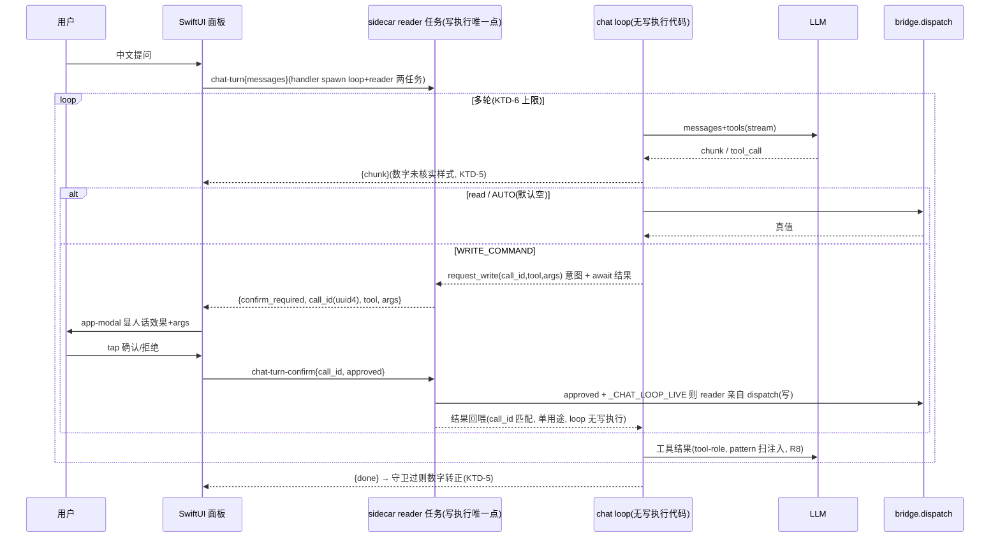

# feat: KSSDeck 内置 AI 复盘助手面板

## Summary

在 KSSDeck 桌面 app 里加一个 AI 复盘助手面板:用户用中文问盘面,一个**薄·工具调用 loop**
(寄居 Python sidecar)调现有 bridge 工具回答,金融真值由代码渲染、流式逐字呈现。把 agent 从
「只有 Claude Code 开发者能用」搬进 app 给本人用。站在 #1+#2 + #3 地基(已 merge main)。

**全档一次做、单 PR**(已确认):读 + paper + **live 写**,但每个写走**人在环内 UI 逐次确认**。
构建顺序 A 只读聊天主链 → B 人在环内写闸 → C 端到端硬化。

**安全核心(doc-review round-1+2 重构):写执行不在 loop 的代码路径里。** loop 只 emit「想写 X」意图帧
并 await 结果;**写 `dispatch` 由 sidecar 的并发 socket-reader 任务在收到 Swift `chat-turn-confirm
{call_id, approved:true}` 后自己执行**,再把结果回喂 loop。loop 代码路径**根本没有写执行调用**——
比「loop 持 token 受限执行器」更硬(无 token 可伪造、无 Future 闭包可内省)。读路径仍走 #3 受限 call。
唯一真进程边界是 Swift↔sidecar;sidecar 内 loop 与 reader 是同进程并发任务,安全靠**控制流约束**
(写 dispatch 只存在于 reader 任务),非 OS 进程隔离(措辞诚实化,见 KTD-4)。

---

## Problem Frame

agent 能力今天只有开 Claude Code 的开发者能摸到。搬进 app 需四块新东西(均不存在,doc-review 实证):
(1) 会 tool-calling + 流式 + 多轮的 LLM 客户端——`openai_client.complete()` 一次性、无工具、无流式、无多轮;
(2) 自主多轮 loop——现只有 cron 批处理;
(3) sidecar 流式 + 暂停恢复——`kss_sidecar.py:46` `_on_connection` 单 readline→单 write→close,**无循环**,
须**重写**连接生命周期(非扩展);
(4) SwiftUI 聊天 UI + 写确认 modal——无任何聊天/流式 UI;且 `BridgeClient.swift:283` socket 3s 超时会杀流式。

**致命前提纠正(doc-review F1)**:bridge 的 `dispatch()`/`run_task` **无 confirm 参数、无 `_LIVE` 闸**
(`_LIVE` 只在 `kss_mcp.py` gate tool 注册)。loop 绕 MCP 直调 `bridge.dispatch` → **继承零写保护**。
故写闸不是「复用既有 bridge 闸」,而是**本计划在 loop 层新建的唯一 enforcement**(KTD-4)。

可复用:bridge dispatch(读工具面)、#3 `_make_read_only_call`(受限 call 真边界)、`MarkdownWebView`、
sidecar unix socket、#3 provenance:llm_prior、U7 commentary 服务端中和先例(见 assessment doc,非本计划单元)。

---

## Requirements

- **R1** 新 LLM chat 客户端:tool-calling + 流式 + 多轮 message;复用 OpenAI/DeepSeek 网关 + `KSS_LLM_MODEL`。
  DeepSeek 流式 tool-call args 分片须跨 chunk 重组再解析(R-spike 实证差异)。
- **R2** 薄工具调用 loop(寄居 sidecar):model → tool_calls → 读经 #3 受限 call、**写经 `request_write`(reader
  任务执行,loop 不调写 dispatch)** → 喂回 → 多轮至无 tool_call 或达上限。不引框架(spike)。
- **R3** 工具执行分级:read 命令自由调;`AUTO_TASKS`(**默认空 frozenset**,准入判据=文件系统只读)免确认;
  **其余所有 `WRITE_COMMANDS` 走人在环内确认**(KTD-4)。
- **R4** 写闸=写执行归 reader 任务,loop 只发意图:loop 碰 `WRITE_COMMANDS` 只 `await request_write`(不调
  `dispatch` 写);reader 任务收 Swift `chat-turn-confirm{call_id, approved}` 后亲自执行写。loop 路径无写代码、
  不持 Future。`call_id` handler 生成、单用途、匹配校验。`_CHAT_LOOP_LIVE`(启动读一次)总开关,reader 执行前查,关则拒。
- **R5** 流式 + 暂停:sidecar 新增**长连 chat-turn handler**(重写连接生命周期):回 newline-delimited 帧
  (`chunk`/`tool_call`/`tool_done`/`confirm_required`/`done`/`error`);`confirm_required` 后同连接
  await 第二消息 `chat-turn-confirm{call_id, approved}`;Swift 用独立 chatTurn socket 方法(无 3s 超时、
  idle-timeout、逐帧解析、无 subprocess fallback)逐块渲染。
- **R6** SwiftUI 面板:新 `WorkspaceSection` + ContentView 分支 + 聊天视图(输入 + 气泡 + `MarkdownWebView`)+
  **会话历史归 `KSSStore`**(防 `.id(selectedSection)` 销毁 @State)+ 完整交互态(见 U4)。
- **R7** 数字纪律(Q1):tool 真值=代码渲染=可引,流式可 eager 渲染;**loop 自产数字流式时视觉隔离
  「未核实」样式**,per-turn provenance 守卫过后才转正(防流式先渲染后守卫,doc-review F4);透传 commentary
  复用 #3 `provenance:llm_prior`。
- **R8** 注入面分两路(doc-review):**user 输入**过 `sanitize_llm_input`(max_len~500);**tool 结果**不过
  64-char 字段 sanitizer(会截断 KB 级 JSON),走 tool-role 消息 + pattern-level 注入扫描。
- **R9** 边界:system prompt operator/explainer 永不 decider;首调建议 `get_orientation`;solo 执行安全闸优先。
- **R10** 上限(Q2):loop 步数上限 + 总超时,达限优雅终止 + 告知。
- **R11** 会话(Q4):**单活动轮**(streaming 中第二 chat-turn 拒/排队);`call_id` 仅**轮内**关联
  confirm(非跨会话隔离——solo 单用户,doc-review);内存态,**不做跨重启持久化**。
- **R12**(成功标准)一句中文完成多步、带代码真值、流式复盘;**诱导 loop 自动 live 写时,无本人 tap 则
  reader 不执行写(loop 路径本无写代码)**;`_CHAT_LOOP_LIVE` 关则全拒。

---

## Key Technical Decisions

**KTD-1 runtime = 薄自建 loop(spike 定),但复杂度中心是写闸状态机不是 query loop(doc-review F3)。**
不用 DeerFlow 2.0(LangGraph/Node/Docker 重,为开放长任务设计,over-engineering)/ Pi(TS/Node 无 Python 嵌入)。
薄 query loop ~80 行成立;但本计划的**可恢复、写闸、流式、暂停-等 Swift socket 消息-恢复**是有状态协议——
风险与代码量集中在此,不享受 spike「薄」的声誉。升级路径(若需结构化重规划):PydanticAI(MCP-native,approval hook)。

**KTD-2 loop 寄居 sidecar(非 Swift),且不持有写执行能力。** sidecar 已 import bridge、零逻辑 fork;
Swift 侧跑 loop 会 fork 整个 bridge API。Swift 只渲染 + 持写确认 modal。loop 读经 #3 受限 call;
**写不由 loop 调 `dispatch`——loop 只 emit 意图、await 结果,写 dispatch 归 reader 任务(KTD-4)。**
约束:`kss_chat_loop.py` 不得 import `kss_sidecar` 运行时符号(code-review checklist),保持调用图边界。

**KTD-3 sidecar chat-turn = 新长连 handler + 并发 reader 任务(doc-review round-2 Gap1)。** 今天
`_on_connection` 单 readline→单 write→close。新增:`_on_connection` 按 cmd 分支——legacy 一次性命令保原路;
`chat-turn` 走长连 handler,它 **spawn 两个并发任务**:(a) loop 任务跑 `run_turn`(`emit` 写帧,每帧
`await writer.drain()`);(b) **reader 任务**循环 `await reader.readline()` 收 `chat-turn-confirm{call_id,
approved}`。`StreamReader`/`StreamWriter` 是同 fd 独立两半,无 fd 争用,**无 Gap1 死锁**(单协程既 await loop
又 readline 才会死)。reader 任务是 confirm/写执行的唯一执行点(KTD-4)。done/error/断连/SIGHUP →
reader 取消所有 pending Future(默认拒)+ close。Swift 端**独立 `chatTurn` 方法**(非改 `unixSocketRoundtrip`):
`SO_RCVTIMEO` 作 **idle 间隔**;`read()==0`=EOF 结束,`read()<0` 查 `errno==EAGAIN/EWOULDBLOCK`=idle 继续
(否则真错);**逐 newline 帧投回调不在首个 `0x0A` break**;无 subprocess fallback(`run`/`import` 仍旧路)。

**KTD-4 写执行归 reader 任务,loop 只发意图(安全核心,doc-review round-2 A3 采纳)。**
- **写执行不在 loop 路径**:loop 碰 `WRITE_COMMANDS` → 经注入的 `request_write(call_id,tool,args)` emit
  `confirm_required` 并 await 一个**结果 Future**;**reader 任务**收到 Swift `approved:true` 后,先查
  `_CHAT_LOOP_LIVE`、再亲自 `bridge.dispatch(写)`、把结果 `set_result` 回该 Future;`approved:false`/拒/超时 →
  set_result 拒绝结果。**loop 代码里没有任何写 `dispatch` 调用,也不持结果 Future 引用**(只 await `request_write`)。
  比 round-1「loop 持 token 受限执行器」更硬:无 token 可伪造、无写执行代码可被 LLM tool_call 误触。
- **call_id 完整性(doc-review round-2 security F1 / adversarial B2)**:`call_id` 由 **reader/handler 在 emit
  `confirm_required` 时生成**(`uuid4().hex`,loop 不能选值);per-connection `dict[call_id→Future]`;`set_result`
  后**立即删条目(单用途)**;`chat-turn-confirm` 的 `call_id` 须匹配当前 pending 条目,不匹配/已消费 → 丢弃+日志
  (非执行);重复 approved 幂等(Future 已 done 则忽略)。杜绝同轮重放/串号授权另一个写。
- **AUTO_TASKS 默认空 `frozenset()`**(doc-review F2 实证:`radar-archive-analysis` `bridge.py:1150` `write_text`、
  `logmv-backtest` 经 paper_trade_log_mv 写盘——「非破坏性」被自己成员证伪)。准入 = **人工调用图审计**(含
  dynamic-dispatch 间接写盘,如经 `dispatch` 路由的 paper_trade_log_mv;`grep write_text` 不充分,doc-review B1);
  可选机械兜底:候选任务在**只读 FS 沙箱**跑测断言零写。存疑即 gate。
- **`_CHAT_LOOP_LIVE`** = `os.environ.get("KSS_APP_LIVE")=="1"` 启动读一次存模块常量(独立 mcp `_LIVE`);
  **reader 任务执行写前查它**,关则 `WRITE_COMMANDS` 全拒(loop 路径总开关,因 bridge 无此闸)。
- **措辞诚实化(doc-review round-2 A1/F2)**:不写「跨进程/物理拿不到」;真相是**调用图/控制流约束**——
  写 dispatch 只存在于 reader 任务,loop 不持 Future、不 import sidecar 运行时符号;唯一 OS 进程边界是 Swift↔sidecar。

**KTD-5 数字 provenance + 流式时序(Q1,doc-review F4)。** tool 返回值=代码渲染真值=可引,流式可 eager 渲染。
**loop 自产正文的数字:流式时以「未核实」视觉样式呈现**,per-turn 守卫(扫文本数字面 vs 本轮 tool 结果)
在 `done` 时过则转正样式、不过则保留标记 + fail-loud 日志(检测 + 可见标记,非静默后置)。透传 commentary 标
`provenance:llm_prior`。system prompt 强制「数字须引 tool 值」。

**KTD-6 会话与上限(Q2/Q4,doc-review)。** Q2:步数上限(初始 ~8)+ 总超时(多轮放宽 `KSS_LLM_TIMEOUT` 量级),
达限优雅终止帧。**超时/步限在 await confirm 时触发 → 该 call_id 即作拒、删条目,后到的 approved 按 call_id-match +
Future-already-done 规则忽略,不执行写**(doc-review round-2 B3)。Q4/R11:**单活动轮**(streaming 中第二 chat-turn
拒或排队,UI 禁输入);`call_id` 仅轮内关联(非跨会话隔离——solo,删并发隔离投机基建);会话历史**内存态 + 归
KSSStore**(`.id(selectedSection)` 会销毁 view @State,doc-review CONV-1);不做跨重启持久化。

**KTD-7 边界双重保证(R9)。** system prompt operator-not-decider + 首调 get_orientation;能力层 loop 读经
#3 受限 call、写经 KTD-4 由 reader 任务执行,loop 路径无写 dispatch 代码。

---

## High-Level Technical Design

聊天一轮 + 写执行归 reader 任务(写代码不在 loop):

`_CHAT_LOOP_LIVE` 关 → reader 任务拒所有 `WRITE_COMMANDS`,根本不执行;loop 路径本就无写 dispatch。

---

## Implementation Units

> 构建顺序(单 PR):**A 只读聊天主链**(U1-U4)→ **B 人在环内写闸**(U5)→ **C 硬化/端到端**(U6-U7)。
> A 完成即可 dogfood 只读面板(loop 钉受限 read call,物理无写)。

### U1. LLM chat 客户端:tool-calling + 流式 + 多轮

**Goal:** 会 function-calling、流式、多轮的客户端,复用现有网关;DeepSeek 分片 args 重组。
**Requirements:** R1, R8(user 输入净化)。
**Dependencies:** 无。
**Files:**
- `kss/llm/chat_client.py`(新建)
- `kss/tests/test_chat_client.py`(新建)
**Approach:** `stream_turn(messages, tools) -> Iterator[event]`(text-delta / tool-call / finish)。复用
`openai_client` 网关/模型/key 解析。`tools` 用 OpenAI function-calling schema(DeepSeek 兼容)。流式 `stream=True`。
**DeepSeek**:`delta.tool_calls[].function.arguments` 跨 chunk 分片,须拼接全 args 再 JSON 解析(R1)。user
输入过 `sanitize_llm_input(max_len~500)`(R8);tool 结果**不**经此(KTD/R8,U2 处理)。
**Patterns to follow:** `kss/llm/openai_client.py:83`(网关/超时);`kss/llm/sanitizer.py`。
**Test scenarios:**
- happy:mock 流式 text-delta → 聚合全文。
- tool-call 单次:event 带 name+args(JSON 解析)。
- **DeepSeek 分片 args**:多 chunk 各携部分 `arguments` → 拼接后解析成功(doc-review F5)。
- 多轮:含 assistant tool_call + tool result 续接。
- 网关:OpenAI/DeepSeek/KSS_LLM_MODEL 各命中。
- user 净化:超长/注入样式 user 文本被 sanitize。
- SDK 抛 → 优雅 error event。

### U2. sidecar 聊天 loop 核心 + 意图发射(写归 reader)+ 上限 + provenance

**Goal:** 薄多轮 loop;读自由、AUTO(空)、写经 verdict-token 受限执行器;上限;provenance;tool 结果注入扫描。
**Requirements:** R2, R3, R4, R7, R8, R10, KTD-2/4/5/6/7。
**Dependencies:** U1。
**Files:**
- `scripts/kss_chat_loop.py`(新建)
- `kss/tests/test_chat_loop.py`(新建)
**Approach:** `run_turn(messages, emit, request_write)`:循环 `chat_client.stream_turn`;text-delta→`emit(chunk)`;
tool_call 分级——read → #3 `_make_read_only_call`(读放行);`AUTO_TASKS`(空 frozenset,准入=人工调用图审计)→
放行;**其余 `WRITE_COMMANDS` → `await request_write(tool, args)`**:loop **不调 `dispatch` 做写**,只发意图
并 await 结果(KTD-4 A3)。tool 结果:tool-role + pattern-level 注入扫描(非 64-char sanitizer,R8),
commentary 标 `provenance:llm_prior`(KTD-5)。步数/超时上限(KTD-6)。
**request_write 契约(钉在此)**:`async def request_write(tool, args) -> result`;实体在 U3 reader 任务——
它生成 `call_id`、emit `confirm_required`、建/await 结果 Future,收 Swift approved 后**自己** dispatch 写并
set_result 回结果(拒绝/超时则 set 拒绝结果)。**loop 不持 Future、不调写 dispatch、不 import kss_sidecar**——
写执行物理上只在 reader 任务的代码里。
**Patterns to follow:** #3 `_make_read_only_call`(`kss_app_bridge.py:3233`);#3 `_gather` 降级;`WRITE_COMMANDS`。
**Test scenarios:**
- happy 单轮:无 tool_call → 流式到 done。
- read 轮:tool_call(read)→ 受限 call dispatch → 喂回 → 二轮出文。
- **loop 无写执行路径(R12 核心,doc-review A3)**:gated 写 tool_call → loop 仅 `await request_write(tool,args)`,
  **源码静态断言 loop 模块无 `bridge.dispatch(写)` 调用、无 `kss_sidecar` import**;写执行不在 loop。
- **意图→结果**:stub request_write 返回执行结果 → loop 续;返回拒绝结果 → loop 收拒绝续(写与否由 reader 定,U3)。
- **AUTO 默认空**:无任务免确认;注入一个文件系统只读测试任务进 AUTO → 放行;写盘任务即使误标也走 request_write。
- **AUTO 默认空**:无任何任务免确认;若注入一个文件系统只读测试任务进 AUTO → 放行;写盘任务即使误标也被 gate。
- 上限:不收敛 tool_call 流 → 达步数/超时优雅终止帧。
- provenance:commentary 标 llm_prior;loop 文本含 tool 结果没有的数字 → 守卫标记 + 日志。
- tool 结果注入:含 `ignore previous` 样式的 tool 返回 → pattern 扫描告警,且不被 64-char 截断(完整透传)。

### U3. sidecar chat-turn 长连 handler + 并发 reader 任务(写执行点)

**Goal:** 重写连接生命周期支持流式 + confirm 暂停;reader 任务是 confirm 处理与写执行的唯一点。
**Requirements:** R4, R5, R11, KTD-3/4/6。
**Dependencies:** U2。
**Files:**
- `scripts/kss_sidecar.py`(改:`_on_connection` 按 cmd 分支;新 `_handle_chat_turn` 长连 handler)
- `kss/tests/test_sidecar_chat.py`(新建)
**Approach:** `_on_connection` 读首行 → `cmd=="chat-turn"` 走 `_handle_chat_turn`(不 close),它 **spawn 两并发
任务**(doc-review round-2 Gap1,解死锁):
- **loop 任务**:`run_turn(messages, emit, request_write)`,`emit` 每帧 `writer.write + await drain`(Gap2)。
- **reader 任务**:循环 `await reader.readline()` 收 `chat-turn-confirm{call_id, approved}`。
`request_write(tool,args)`:生成 `call_id=uuid4().hex`(loop 不选值)、emit `confirm_required{call_id,tool,args}`、
建 `dict[call_id→Future]` 并 await。**reader 任务**收 confirm:`call_id` 须匹配 pending(不匹配/已消费→丢弃+日志),
`approved + _CHAT_LOOP_LIVE` 则 **reader 亲自 `bridge.dispatch(写)`**、`set_result(结果)`、**立即删条目(单用途)**;
拒/超时→set 拒绝结果。`StreamReader`/`StreamWriter` 独立两半无 fd 争用。done/error/断连/**SIGHUP** → reader
`cancel`/拒所有 pending Future(默认拒)+ close + 清理(doc-review round-2 security F3)。legacy 命令保原一次性路径。
**单活动轮**:同连接一次一 turn(R11)。
**Patterns to follow:** `kss_sidecar.py:46` 现有 envelope;`BridgeClient.swift:250` roundtrip。
**Test scenarios:**
- happy:chat-turn → 有序帧以 done 结尾。
- 流式:多 chunk 帧按序(非聚合)。
- **无死锁(Gap1)**:loop 任务 await request_write 期间,reader 任务并发读到 confirm → 解除;非单协程自锁。
- **reader 执行写**:approved + _LIVE → reader 自调 `bridge.dispatch(写)` + set_result(结果);loop 收结果续。
- **从不发 confirm**:无 chat-turn-confirm → 该 call_id Future 永 pending,直到超时/断连按拒收尾(U2 loop await 不挂死)。
- **call_id 完整性(security F1/B2)**:call_id 由 handler 生成;`chat-turn-confirm` call_id 不匹配 pending/已消费 →
  丢弃+日志,不执行;重复 approved 幂等;旧 call_id 不能授权另一个写(单用途删条目)。
- **`_CHAT_LOOP_LIVE=0`**:reader 收 approved 仍拒执行(总开关),回拒绝结果。
- **SIGHUP/断连 mid-confirm(F3)**:reload/断连 → cancel 所有 pending Future(默认拒)+ 清理,无孤儿协程。
- legacy 不回归:snapshot 等一次性命令仍单 readline→单 write→close。

### U4. SwiftUI 聊天面板 + 完整交互态

**Goal:** 新导航区 + 聊天视图 + 独立流式 socket 方法 + KSSStore 会话态 + 全交互态(design review)。
**Requirements:** R5(Swift 侧), R6, R7(数字样式), R9(边界文案), R10/R11(交互态)。
**Dependencies:** U3。
**Files:**
- `Sources/KSSDesktop/Models/KSSModels.swift`(改:`WorkspaceSection` 加 `case aiChat` + displayName/symbol)
- `Sources/KSSDesktop/ContentView.swift`(改:detail switch 分支)
- `Sources/KSSDesktop/Views/AIChatView.swift`(新建)
- `Sources/KSSDesktop/Services/KSSStore.swift`(改:`@Published chatMessages` + 流式态 + 单活动轮)
- `Sources/KSSDesktop/Services/BridgeClient.swift`(改:新 `chatTurn` 增量读方法,无 3s 超时)
- `Sources/KSSDesktop/KSSDesktopTests/AIChatTests.swift`(新建;CLT 无 XCTest 须完整 Xcode 跑 `swift test`)
**Approach:** `WorkspaceSection` 加 case(`ordered(from:)` 自动纳入)。`AIChatView`:`GeometryReader` +
`min(width-48, 960)` 居中(M3),底部 pinned 输入栏(ScrollView 外)+ 气泡 ScrollView(用户/助手交替)+
助手气泡用 `MarkdownWebView` 渐进渲染。**会话历史归 `KSSStore`**(`.id(selectedSection)` 销毁 view,doc-review)。
`BridgeClient.chatTurn`:**独立方法**(非改 `unixSocketRoundtrip`):`SO_RCVTIMEO` 作 idle 间隔,`read()==0`=EOF 结束、
`read()<0` 查 `errno==EAGAIN/EWOULDBLOCK`=idle 继续(否则真错),**逐 newline 帧投回调、不在首个 `0x0A` break**,
无 subprocess fallback(doc-review round-2 Gap3)。交互态(design review,全 conf 100):
- **tool-in-progress**:收 `tool_call` 帧显「正在调用 <tool>…」内联指示。
- **数字未核实样式**(KTD-5/R7):loop 自产数字流式时灰/标,守卫过转正。
- **错误终态**:step-limit→样式气泡「已达步数上限…」+ 重输入;断连→气泡「连接中断」+ 重输入;
  无 API key/LLM 失败→路由 `store.errorMessage` 全局 alert(沿既有)+ 重输入。
- **空状态**:R9 边界文案「AI 不给买卖建议」+ 2 个示例问题 chip(如「688008 今天为什么动」)。
- **输入禁用**:streaming 中禁输入/发送(单活动轮,R11),done/error 重启用。
- **theme token**:user 气泡=`theme.surfaceRaised`、助手=`theme.canvas`+`theme.hairline`、输入栏=`surfaceRaised`;
  `MarkdownWebView` 已走 palette bridge 自适应 8 主题。
**Patterns to follow:** `RunbookView`/`TaskResultCard`(异步结果结构);`MarkdownWebView`;`KSSStore` `Task.detached`
+ `@Published`;ContentView `.alert` errorMessage。
**Test scenarios:**
- happy:发消息 → 流式 chunk 追加 → done。**Covers R12**。
- WorkspaceSection 新 case 入 sidebar + 路由命中。
- 增量渲染:多 chunk 逐步;tool-call 帧显进度指示。
- 数字样式:loop 自产数字流式呈未核实样式,done 守卫过转正(R7)。
- 会话归属:section 切走再回 → 历史仍在(KSSStore 持,非 @State)。
- 错误态:step-limit / 断连 / 无 key 各自 UI + 重输入。
- 空状态:首次显边界文案 + 示例 chip。
- 输入禁用:streaming 中输入禁,done 后启。

### U5. 人在环内 live 写确认 modal(安全核心)

**Goal:** confirm_required ↔ app-modal ↔ chat-turn-confirm 闭环;人话效果;默认拒。
**Requirements:** R4, R12, KTD-4。
**Dependencies:** U3, U4。
**Files:**
- `Sources/KSSDesktop/Views/AIChatView.swift`(改:`confirm_required` → app-modal)
- `Sources/KSSDesktop/Services/KSSStore.swift`(改:pending-confirm 态 + confirm/deny 发送)
- `Sources/KSSDesktop/Services/BridgeClient.swift`(改:`chatTurnConfirm{call_id, approved}`)
- `kss/config/write_command_labels.yaml`(新建:命令→人话效果映射)
- `kss/tests/test_chat_loop.py`(扩:见 U2 写闸边界)
**Approach:** 收 `confirm_required{tool,args,call_id}` → **app-modal**(ContentView 级,navigation 阻塞,
sidebar 显 pending 指示)。内容契约(design MODAL-1/2):标题=`write_command_labels.yaml` 的人话效果
(如「将覆盖本地 688008 日线数据」),body=格式化 args 键值 + loop 最近一句作上下文,按钮「确认执行」/「拒绝」。
**仅本人 tap 确认** → `chatTurnConfirm{call_id, approved:true}`;拒/关窗/导航走=拒(默认安全);拒后立即
气泡内联「已拒绝,继续分析…」(避免 LLM round-trip 静默,design MODAL-3)。Swift 永不在无交互时发 confirm。
**Patterns to follow:** ContentView `.alert`;`kss_mcp.py` confirm 语义;`kss/config/*.yaml`(可维护映射)。
**Test scenarios:**
- **happy 闸(R12)**:confirm_required → modal → tap 确认 → 写执行;tap 拒 → 写不执行 + 内联反馈。
- **诱导自动写被拦**:连发 live 写 → 每个弹 modal,无 tap 则 reader 永不执行(U3 兜底)。
- modal 内容:显人话效果(非裸命令串)+ args + 上下文句。
- 默认拒:关窗/导航走 = approved:false。
- app-modal scope:pending 时 navigation 阻塞 + sidebar pending 指示。
- 多写序列:逐个 modal,各自 call_id。

### U6. system prompt + 边界 + orientation 上手

**Goal:** loop system prompt:operator 永不 decider + 首调 get_orientation + 工具用法 + 数字引 tool + 上限。
**Requirements:** R9, KTD-5/6/7。
**Dependencies:** U2。
**Files:**
- `scripts/kss_chat_loop.py`(改:注入 prompt)
- `kss/config/chat_system_prompt.md`(新建)
- `kss/tests/test_chat_loop.py`(扩)
**Approach:** prompt 放 config(可改不动码):角色=复盘 operator/explainer,**不给个性化买卖判断**;首轮建议
`get_orientation` 上手;数字须引 tool 值(KTD-5);写须用户确认(说明机制);中文应答。
**Patterns to follow:** `kss/sector/commentary.py` prompt 组织;#3 数字纪律。
**Test scenarios:**
- prompt 注入:loop 首条 system message = config 内容(确定性)。
- 边界条款存在:断言 prompt 含 operator-not-decider(确定性);模型遵从为 best-effort 集成观察。

### U7. 端到端集成 + dogfood + 安全闸回归

**Goal:** 全链路 e2e(直驱 sidecar socket)+ 真会话 dogfood + 写闸边界回归。
**Requirements:** R12, 全 KTD 收口。
**Dependencies:** U1-U6。
**Files:**
- `kss/tests/test_chat_e2e.py`(新建:经 unix socket 驱 chat-turn 全链路,mock LLM 固定 tool_call 脚本)
- (手动)dogfood 清单
**Approach:** e2e 经 socket:read 轮真调 bridge、gated 写**无 confirm 消息则 reader 不执行(超时按拒收尾)**、confirm 消息后 reader 执行、
流式帧有序、达限终止、单活动轮。dogfood:真 key 问「688008 今天为什么动」→ 走 explain_stock_today 剧本 +
流式 + 真值;诱导 live 写确认 modal 拦截;**观察首调 get_orientation 后零误调**(R-spike 零误调降为 dogfood 观察)。
**Patterns to follow:** #1+#2 真·stdio 验证手法(这里直驱 socket)。
**Test scenarios:**
- e2e read:chat-turn → 调 read 工具 → 流式真值。**Covers R12**。
- **e2e 写闸**:gated 写 → 无 confirm → reader 不执行(超时拒);confirm 后 reader 执行(端到端边界)。
- 达限:不收敛脚本 → 优雅终止。
- 单活动轮:streaming 中第二 chat-turn → 拒/排队。

---

## Scope Boundaries

### Deferred to Follow-Up Work
- **跨重启会话持久化**(Q4)——内存态;落盘 defer。
- **AUTO_TASKS 放宽**——默认空;成员须代码级「文件系统只读」审计后逐个手加。
- **跨会话并发隔离**——solo 单用户不需(doc-review);仅轮内 call_id 关联。删并发隔离投机基建。
- **硬中和 loop 自产数字**——本轮视觉隔离 + 守卫检测(KTD-5);服务端硬中和(同 U7 commentary,见 assessment doc)defer。
- **app 侧一次性 token 强化**——本轮 reader-任务边界 + call_id 单用途已够;更强的密码学 token(mcp.py:9 提的)defer。
- **PydanticAI 升级**——仅当需结构化多 symbol 重规划。

### 不做
- 不引 agent 框架(KTD-1)。不在 Swift 跑 loop(KTD-2)。loop 不裸调 dispatch 做写(KTD-4 受限执行器)。
- 不给 bridge 服务层引重依赖。loop 路径无写执行代码、不 import sidecar(KTD-4 红线)。

---

## Risks & Dependencies

- **R-risk-1 写闸是安全核心,写执行只在 reader 任务(doc-review round-1+2 重构)**:loop 路径无写 `dispatch`,
  写只由 reader 任务在收 Swift approved + `_CHAT_LOOP_LIVE` 后亲自执行(A3)。安全是**调用图/控制流约束**(写代码
  只在 reader),非 OS 进程隔离;唯一真进程边界是 Swift↔sidecar。**bridge `dispatch` 本身无写闸——reader 任务是
  唯一 enforcement,其正确性 + 「loop 不 import sidecar/不持 Future」的 code-review 约束 = 全部安全。**
  U2/U3/U7 测:loop 源码无写 dispatch、call_id 单用途、无 confirm/超时/SIGHUP→默认拒。这是本计划最需 review 的面。
- **R-risk-2 AUTO_TASKS 误纳写盘任务(doc-review F2 实证)**:默认空 + 准入「文件系统只读」+ 成员审计兜底。
- **R-risk-3 连接生命周期重写(doc-review F2/F3)**:`_on_connection` 须按 cmd 分支,chat-turn 长连 + confirm 暂停
  保连接;Swift 须独立无-3s-超时方法。这是最大净新传输逻辑,非「扩展」。R-risk:断连默认拒 + 清理。
- **R-risk-4 流式数字先渲染(doc-review F4)**:loop 自产数字流式时未核实样式,守卫过转正(KTD-5/R7)。
- **R-risk-5 注入两路(doc-review)**:user 过 sanitizer;tool 结果走 tool-role + pattern 扫描,不过 64-char 截断。
- **R-risk-6 sidecar 旧解释器**:chat 模块改后须 SIGHUP/重启 sidecar(既有坑)。
- **R-risk-7 DeepSeek 流式 tool-call args 分片**:跨 chunk 重组再解析(U1 测)。
- **依赖**:#1+#2+#3 已 merge(get_orientation / 数据目录 / 只读剧本 / `_make_read_only_call` / `WRITE_COMMANDS`)。

---

## Success Criteria

- 在 KSSDeck 一句中文完成多步、带代码真值、**流式**复盘(R12)。
- **写执行只在 reader 任务**:loop 源码静态无写 `dispatch`、无 `kss_sidecar` import(可测断言);诱导 loop 自动
  live 写 → 无本人 tap 则 reader 不执行;`_CHAT_LOOP_LIVE` 关 → reader 拒所有写(R4/R12)。
- AUTO_TASKS 默认空;任何写盘任务即使误标也走 request_write(R3,doc-review F2)。
- **call_id** handler 生成、单用途、不匹配/已消费即丢弃;超时/断连/SIGHUP mid-confirm → 默认拒、无孤儿(doc-review round-2)。
- loop 自产数字流式未核实样式,守卫过转正;commentary 标 provenance(R7)。
- 会话历史归 KSSStore(section 切换不丢);单活动轮;达限优雅终止(R10/R11)。
- 交互态完整:tool-in-progress / 错误三态 / 空状态+边界文案 / 输入禁用 / app-modal 人话效果(R6)。

---

## Sources & Research

- origin:`docs/brainstorms/2026-06-22-kssdeck-agent-panel-requirements.md`(锁定决定 + Q1-Q4)
- runtime spike(landscape,2026-06):薄 loop 胜 vs DeerFlow 2.0(LangGraph/Node/Docker,over-engineering)/
  Pi(TS/Node 无 Python 嵌入);升级路径 PydanticAI。来源:HuggingFace Tiny Agents(2026-01)、bytedance/deer-flow
  v2.0(2026-02-28)、earendil-works/pi(v0.79.9,2026-06-20)、MCP build-client、DEV Agentic Frameworks Comparison。
- 本地架构(scout + doc-review feasibility 实证,file:line):SwiftUI `Sources/KSSDesktop/`
  (`WorkspaceSection` `Models/KSSModels.swift:634/691`、ContentView `.id(selectedSection)`、`Services/KSSStore.swift`
  `Task.detached`、`MarkdownWebView.swift`、`RunbookView`/`TaskResultCard`);sidecar `kss_sidecar.py:46`
  (单 readline→close,无并发/会话);`BridgeClient.swift:250/283`(roundtrip + 3s 超时 + subprocess fallback);
  LLM `openai_client.py:83`(一次性无 tools/流式);**bridge `dispatch`/`run_task` 无 confirm,`_LIVE` 仅
  `kss_mcp.py`**;#3 `_make_read_only_call`(`kss_app_bridge.py:3233`)真边界;`radar-archive-analysis` 写盘
  `bridge.py:1150`、paper_trade_log_mv 写盘;`kss_mcp.py:8-9` 自记写闸威胁模型;commentary LLM 文本;U7 commentary
  服务端中和(`docs/solutions/ai_native_surface_assessment.md`,非本计划单元)。
- doc-review(2026-06-22,6 persona):coherence P1×1(U7 幽灵)+P2×3;feasibility Critical×2(bridge 无闸 / sidecar 须重写)
  +High×2;security Critical×1(信任边界)+High×3(AUTO 写盘/_LIVE 未接 loop/sanitizer 截断);adversarial
  Critical×1(进程内布尔)+Major×3(AUTO 实证/薄 loop 误budget/流式先渲染);design Blocker×5(tool-progress/modal
  内容/modal scope/错误态/会话归属)+Advisory×4;product High×1(写闸 PR 隔离——用户选单 PR)+Medium×2。
  除「拆 PR」(用户选单 PR)外,P1/P2 全并入本版。
