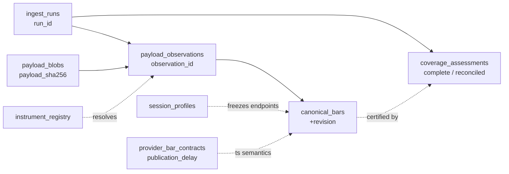
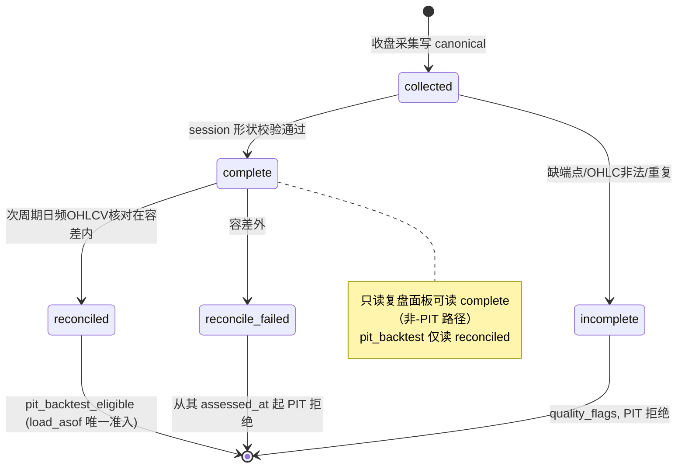
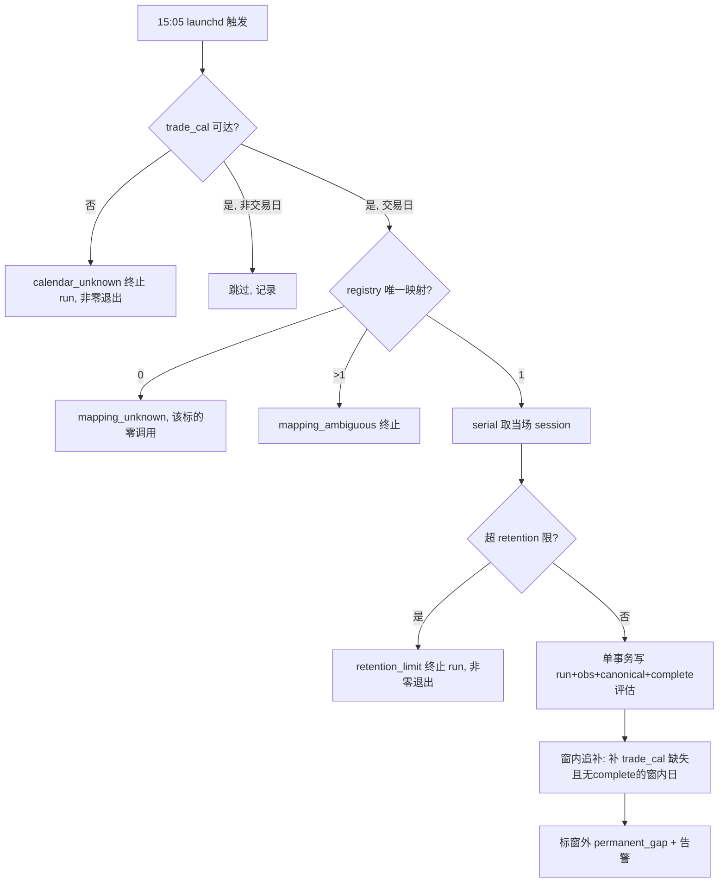

# feat: KSS 分时数据层（PIT-safe）实施计划

## Summary

为 KSS 新增一个**隔离的、分钟级 PIT-safe 研究通道**：独立 SQLite 库 `intraday_quotes.db`（内容寻址 blob + 版本化 canonical bar + 时间版本化 coverage 评估），AKShare/东财 收盘采集器经 launchd 在 15:05 前向沉淀，Tushare 历史（proxy-PIT）推迟到后续阶段。**第一周即开始采集**（薄 logger），前向-PIT 闭环随后建好，历史回测重机器留到真要回测时。日频 `cs_data_*.csv`/`SQLiteStore`/纸交易语义零改动。

本计划覆盖 PRD 交付阶段 1–5（探针 + 前向采集 + 20 场影子运行，**零策略消费**）。阶段 6（历史准入决策，是 gate 非代码）与阶段 7（历史证据机器 + 分钟回测）显式留作 Follow-Up。

---

## Owner-Locked Decisions（不在本计划重新论证）

来自 ce-doc-review 收口，作为硬约束传入：

- **D1 中道**：前向-PIT 核心本计划建（forward-only `load_asof`/eligibility/执行延迟闸）；历史证据机器（`provider_historical_evidence`/`evidence_ref`/`evidence_hash`/proxy 准入）推到 Follow-Up（阶段 7）。
- **D2 保守代理**：历史 PIT = 文档化偏晚 `available_from_ts` 代理（`bar_end` + 最坏发布延迟，或 `trade_date+1` 收盘），标 `proxy-PIT`，抗 look-ahead；不追求 per-bar 厂商证明。（本计划不实现历史路径，但 schema/语义为它留位且不冲突。）
- **D3 薄 logger 先行**：阶段 1 先上 append-only 原始落盘（blob + retrieved_at + run，不做 canonical），立即起采；canonical 归一化事后对已存 blob 追认（非破坏）。
- **D4/SG6 plist 落点**：渲染 plist 落 `PROJECT_ROOT/deploy/launchd/`（code root，bridge glob），"state-root 隔离" 仅指运行期路径（`StandardOutPath`/`KSS_STATE_ROOT`）；渲染器因 bundle 双根而正当。

---

## Resolved Before Planning（评审遗留 3 条 — 已在本计划定型，非实现期再决）

### RB1 — `complete` 与 `reconciled` 是两个独立评估状态（原 A4 时序洞）

**问题**：F4 reconciliation 在「下个数据周期」产出，F5 允许读 `forward_observed`——若一天在 reconcile 前就算「可进回测」，未对账（可能错）的 bar 会泄进回测。

**定型**：`coverage_assessments.assessment_kind` 取两个值：

- `complete` — 当场 session 形状有效（所有期望 endpoint 到齐、OHLC 合法、无重复、时区/合法端点校验通过）。收盘采集即可产出。
- `reconciled` — 次周期对独立日频 OHLCV 交叉核对在容差内通过。最早 `trade_date+1` 产出。

**隔离机制**：`load_asof(..., eligibility='pit_backtest_eligible')` 的准入谓词**强制要求**存在 `assessment_kind='reconciled'` 且 `assessed_at <= as_of_ts` 的评估；仅 `complete` 的 forward bar **结构上被 PIT 查询排除**，直到其 reconciled 评估落地（`assessed_at` 自然门控 as_of）。只读复盘面板走**独立的非-PIT 读路径**（latest-revision-wins，可读 `complete` bar），不经 `load_asof`。落在 U4。

### RB2 — `publication_delay_seconds` 的来源与保守取值（重新引入 look-ahead 的风险）

**问题**：静态 per-provider 常量 vs 滚动免费端点真实发布延迟随负载波动；低估会让信号读到尚不可发布的 bar。

**定型**：

- 存储位置 = `provider_bar_contracts.publication_delay_seconds`（per provider+interval+contract version，schema 已有）。
- 取值来源 = **阶段 1 探针实测**：测「bar_end 到该 bar 首次出现在轮询响应」的滞后分布，取 **p95**。
- 保守策略 = p95 **向上取整 + 安全裕度**（偏晚，与 D2 同方向，抗 look-ahead）。
- 持续校准 = 影子期（U8）复核；`--mode watch`（若启用）每次观测到 bar 到达晚于配置 delay，写 `publication_delay_exceeded` 告警触发重标定（fail-loud，不静默）。
- 信号闸（U4）：`bar_end_ts + publication_delay <= signal_time` 才可作为信号输入；bar N 生成的单不得在 bar N 收盘成交，最早下一个合格 bar。

### RB3 — 停机/恢复窗内追补 + 影子门纳入数据持久性（原 A3/A6）

**问题**：单次 15:05 拉取 + ~5 天滚动窗；>5 天停机=永久丢数（pre-mortem 未列）；19/20 影子门只量 run 成功率不量数据持久性。已知 `launchd 关机不补跑`（学习 #3），且分钟快照丢失**不可由 launchd 重触发恢复**。

**定型**：

- **窗内追补**（U5）：每次收盘 run，向 `trade_cal` 查 SSE 交易日，对**仍在 provider 滚动窗内**、且库中无 `complete` 评估的日子**重拉**（校验字段质量、作为新 observation/revision 进入、次周期 reconcile，**不盲覆盖**）。窗内缺失因此可恢复。
- **窗外=永久 gap**（U5）：检出滚动窗外仍无覆盖的交易日 → 标 `permanent_gap` + 告警（仅能由后续 Tushare 历史 proxy 填补）。补进 PRD pre-mortem 的失败场景。
- **复用既有 launchd 漏跑检测**（学习 #3）：按 `com.zcdeng.kss.*` 命名注册以自动入 selfcheck 看门狗白名单；但**显式记录**分钟快照漏跑语义不同于日频任务（不可重触发，靠窗内追补 + 历史回填）。
- **影子门加数据持久性维度**（U8）：影子通过 = (a) ≥19/20 收盘 run 成功 **且** (b) 窗内零未恢复 gap **且** (c) 零 false-complete 日。run 成功率不再单独定义通过。

---

## Problem Frame

现有 `SQLiteStore`（`kss/data/sqlite_store.py:72`）以 `(ts_code, trade_date)` 为主键、`INSERT OR REPLACE` 更新，适合日频缓存，**无法**保存分钟数据的来源版本与「何时可得」。KSS 架构明确区分 PIT 回测骨架与不可回流的实时解读源（已有红线：`docs/solutions/dragon_tiger_integration_retrospective.md` — 解读层数据严禁回流回测）。AKShare/东财 分钟流**按定义是非-PIT 实时层**，必须结构上隔离，仅在满足质量/时点/执行门槛后才允许进入分钟研究。

本计划交付一个隔离通道：先沉淀连续前向 1m 事实并支持只读分时复盘；版本化、可审计、失败闭合；不改变日频契约。

---

## Scope Boundaries

### 本计划内（PRD 阶段 1–5）

- 隔离 SQLite 库 `intraday_quotes.db` 与前向-PIT 存储/查询契约
- 供应商探针 + 能力门控（AKShare/东财 forward；Tushare 历史 eligibility 评估仅产出分类，不建历史读路径）
- 收盘采集器（serial、幂等、原子 run 状态、窗内追补、retention 限制、coverage 评估）
- launchd 模板 + 确定性渲染器 + wrapper + 部署校验
- catalog/bridge 可见性、可观测性、告警
- 20 场影子运行 + 数据持久性验收

### Deferred to Follow-Up Work

- **阶段 6 历史准入决策**（gate，非代码）：从探针证据决定批准 Tushare（proxy-PIT）或保持 forward-only。本计划完成后单独裁决。
- **阶段 7 历史证据机器 + 分钟回测**（D1）：`provider_historical_evidence` proxy-PIT 准入路径（保守 `available_from_ts`、evidence ref/hash）、session-aware 聚合、执行/成本模型、显著性/稳健性协议。**禁止**复用日频 `FactorPipeline` 或 `next_day_return` 语义。仅在阶段 6 批准后单独立计划。
- `--mode watch`（盘中 watchlist 轮询）：shadow/observability only，单独启用前不接策略。

### Non-goals（来自 PRD，保持不变）

- 无盘中下单/券商对接/tick/order-book 存储/自动实盘
- 不替换 Tushare 日频或既有日频回测
- 不引入 QUANTAXIS/vn.py/RQAlpha/MongoDB/Kafka/新数据库依赖
- 不声称抓取响应本身**证明**历史 PIT 可得性（用 D2 保守代理，标 proxy-PIT）

---

## Key Technical Decisions

### KTD1 — 新 store 镜像 `SQLiteStore` 的「形」，但在并发/事务上刻意背离

`SQLiteStore._conn()`（`kss/data/sqlite_store.py:123-134`）每调用开新连接、无任何 pragma、无多写事务、用 `INSERT OR REPLACE`。新 `IntradayStore` 镜像其结构（class-constant `CREATE TABLE IF NOT EXISTS`、`_conn()` contextmanager、`__init__` 里 `_init_schema()` + `mkdir(parents=True)`），但**刻意背离**：

- 每连接加 `PRAGMA foreign_keys=ON; journal_mode=WAL; busy_timeout=<ms>`（launchd writer 与桌面 app reader 并发——学习 #7 已证此为真实失败模式）。
- 用 `INSERT`（绝不 `INSERT OR REPLACE`）+ `(instrument_id, bar_end_ts, interval_minutes, source, revision)` 唯一索引做原子版本分配。
- ingest 路径用**显式单事务**（`BEGIN`/多写/`commit`-or-`rollback`）写 run 状态+observations+canonical+初始评估；**不**复制 per-call commit 习惯。
- **写一次-PIT 守卫**（学习 #7 的重结算守卫精神）：canonical 版本一旦写入，后续 run 不得静默覆盖 PIT 冻结值；冲突→更高 revision，旧 revision 保持可查。

### KTD2 — 数据层不抛异常 vs 存储层失败闭合，是两层

复用 `kss/data/tushare_client.py:22-68` 的模块级 `_fetch_with_retry`（serial、指数退避、`None`/空=业务信号不重试、最终返回 `None` 不抛——AGENTS.md 数据层契约）做**取数**。但**存储/run 层必须事务性失败闭合**：`calendar_unknown`/`retention_limit`/`schema_drift`/`mapping_ambiguous`/`credential_in_payload` 都是终止 run + 非零退出 + 持久化失败记录、无可查部分行。两层在计划与代码里分清。

### KTD3 — `trade_cal` 失败必须终止，刻意不抄既有 fallback

既有两处 `trade_cal` 调用方**失败即猜**：`scripts/daily_review.py:168`（退化 +1 工作日）、`kss/sector/hotspot_rotation.py:125-149`（退化扫归档文件名）。采集器**刻意不抄**：`trade_cal` 失败→终止 `calendar_unknown` run + 非零退出，绝不 weekday/archive 猜测（PRD F3 / test-spec 集成 #7）。调用约定沿用 `client.get_pro().trade_cal(exchange='SSE', ...)` + `is_open==1` 过滤。

### KTD4 — token 解析扩展到 state-root secrets/keychain；env 仍首位

`TushareClient._resolve_token()`（`kss/data/tushare_client.py:121-141`）当前查 `TUSHARE_TOKEN` env → `~/.tushare/token` → cwd 文件，**不知道** `KSS_STATE_ROOT/secrets/`。扩展它（PRD「Extend: tushare_client.py」）加 `KSS_STATE_ROOT/secrets/`（0600）/keychain 来源；`TUSHARE_TOKEN` env 保持首位（若 launchd/env 设了仍会被拾取——故渲染器**必须**保证 token 不进 plist env）。同时复用 `_bypass_system_proxy()`（L102-119）防 macOS Clash 代理挂起；东财前向路径需类比 NO_PROXY 处理。

### KTD5 — catalog 反射需扩展支持表 allowlist + BLOB 排除（非纯配置）

`scripts/build_data_catalog.py:170-196` 的 `_build_sqlite_dataset` **无条件反射所有表所有列**，无 allowlist、无类型排除。F6/U9 要求 intraday 条目枚举表 allowlist 且排除全部 BLOB 列（`payload_blobs`、`payload_observations.redacted_request_json` 永不出现）。须**扩展该函数**（或加变体）接受可选表 allowlist + BLOB 列过滤，并把 `_DB_CANDIDATES`（L45-51）改成携带 allowlist 的更富结构。**这是真新代码，非加一行配置。** 表/列名须满足 `_IDENTIFIER_RE`（L29）避免 catalog 占位符。

### KTD6 — 渲染 plist 是仓库首例；落 code root，运行期路径指 state root

仓库内 14 个 plist 全是静态硬编码绝对路径文件，**无任何 render/template 先例**。`bridge` 用 `LAUNCHD_DIR = PROJECT_ROOT/deploy/launchd` glob `com.zcdeng.kss.*.plist`（`scripts/kss_app_bridge.py:2590,2631-2637`），故渲染产物**必须**落 `PROJECT_ROOT/deploy/launchd/`。渲染器（greenfield）：注入绝对 `ProgramArguments`、`EnvironmentVariables.KSS_STATE_ROOT`（仓库内首个注入此 env 的 plist——新约定但合双根设计）、`StandardOutPath`/`StandardErrorPath` 于 `<state-root>/storage/logs/launchd`；拒绝未解析占位符/相对路径/任何 token-pattern 字符串。bundle 双根（学习 #4）：store 路径与 blob 目录解析于 state root，验收须模拟 state-root≠code-root（dev-mode 两根相等会**掩盖**此类 100% bundle-mode bug）。

### KTD7 — 规范日期键单一且文档化

仓库有双日期格式（学习 #8）：紧凑 `YYYYMMDD`（parquet/tushare 参数）vs 横杠 `YYYY-MM-DD`（cs_data/`SQLiteStore.trade_date`）。新 store 的 `bar_end_ts`/`trade_date` 须**选定单一规范并文档化**；`bar_end_ts` 用带时区 ISO-8601（Asia/Shanghai），`trade_date` 用横杠 `YYYY-MM-DD` 对齐 `SQLiteStore`。若 blob 用 pyarrow，采集器解释器须确有 pyarrow（`.venv-desktop`；学习 #8 / bridge optional-module 坑）。

---

## High-Level Technical Design

### 数据血缘（每根 canonical bar 可回溯到 blob 与 run）



### 评估状态机（RB1）



### 收盘采集流（U5；KTD3 失败闭合）



---

## Output Structure

```
kss/data/
  intraday_store.py          # 新: IntradayStore（KTD1）
  intraday_client.py         # 新: IntradayProvider 协议 + AKShare/东财/Tushare 适配
  tushare_client.py          # 改: _resolve_token 扩展 secrets/keychain（KTD4）
scripts/
  probe_intraday_provider.py # 新: 探针 + 能力门控（U1）
  collect_intraday.py        # 新: 收盘采集器（薄 logger 起步 → 完整）（U2,U5）
  run_collect_intraday.sh    # 新: wrapper（镜像 run_*.sh）
  render_intraday_launchd_plist.py  # 新: 确定性 plist 渲染器（KTD6, greenfield）
  build_data_catalog.py      # 改: 表 allowlist + BLOB 排除（KTD5）
  kss_app_bridge.py          # 改: LABEL_TITLES/LABEL_CATEGORY 注册 collect_intraday
deploy/launchd/
  com.zcdeng.kss.collect_intraday.plist.template  # 新: 模板（tracked）
  com.zcdeng.kss.collect_intraday.plist           # 生成（落 code root, bridge glob）
kss/config/
  paths.py                   # 改: INTRADAY_DB 常量 + __all__
  data_catalog_meta.yaml     # 改: intraday 字段含义 overlay
kss/tests/
  test_intraday_store.py     # 新
  test_intraday_client.py    # 新
  test_intraday_collector.py # 新
  test_intraday_render_plist.py  # 新
storage/intraday_quotes.db   # 运行时生成（STATE_ROOT/storage）
```

---

## Implementation Units

### U1. 供应商探针 + IntradayProvider 协议 + 能力门控

**Goal**：在写任何客户端代码前，拉真实响应核字段/粒度/增量（学习 #5「先验数据源」），产出不可变探针报告对 10 个代表性标的分类；定义 `IntradayProvider` 协议。

**Requirements**：PRD F1；test-spec U8 + Provider admission test。

**Dependencies**：无（首单，gate）。

**Files**：`kss/data/intraday_client.py`（协议 + AKShare/东财适配的 `fetch_bars`/name/version/intervals/`source_asof_ts`/capability result）、`scripts/probe_intraday_provider.py`、`kss/tests/test_intraday_client.py`。

**Approach**：协议含 `fetch_bars(...)`、provider name/version、supported intervals/assets、`source_asof_ts`、显式 capability 结果。探针对 10 标的（科创/创业/ETF/指数）测：分钟频率与最早/最晚时间戳；字段映射与单位；20 场连续性/重复率/空值率；请求延迟 p95、429/5xx 计数与重试；**publication delay 分布（喂 RB2 的 p95+裕度）**；Tushare entitlement/quota/correction-policy（仅分类，不建读路径）；历史响应是否带可得性证据。报告不可变、**绝不打印 token**（test-spec）。复用 `_bypass_system_proxy` 思路。

**Patterns to follow**：`_fetch_with_retry`（`tushare_client.py:22-68`）；探针报告原子写参考 `build_data_catalog.py:294-298` `_write_atomic`。

**Test scenarios**：
- Covers U8. 权限/覆盖/错误 stub → 失败产 `research_only`/failed run，绝不 `pit_backtest_eligible`。
- AKShare/东财 仅接受为 `forward_observed`/`research_only`；其 1m 近 5 日限制与上游源一致。
- 探针报告含 provider identity、10 标的结果、源区间、minutes、状态码、quota/errors、schema hash、eligibility；且**不含** token 子串。
- publication-delay 分布被记录并可导出（供 RB2 取值）。

**Verification**：`probe_intraday_provider.py --report <path>` 产出机读报告；分类正确；token 不泄露；测试无 live 调用（mock）。

---

### U2. 薄前向 raw-capture 存储 + logger（D3，立即起采）

**Goal**：最小 append-only 落盘——`ingest_runs` + `payload_blobs` + `payload_observations` + 最小 `instrument_registry` 解析（fail-closed），收盘即采，**不做 canonical**。第一周开始沉淀。

**Requirements**：PRD F2（lineage 子集）+ F3（registry fail-closed）；D3；test-spec U2/U3/U10（mapping/retention 部分）。

**Dependencies**：U1（provider 协议 + 门控）。

**Files**：`kss/data/intraday_store.py`（最小 schema + KTD1 连接/事务/写一次守卫 + 凭据安全不变式）、`scripts/collect_intraday.py`（薄 `--mode close` 原始追加）、`kss/config/paths.py`（`INTRADAY_DB` + `__all__`）、`kss/tests/test_intraday_store.py`。

**Approach**：建 `ingest_runs`/`payload_blobs`(内容寻址去重)/`payload_observations`（每次 HTTP observation 都记，含 `availability_class`、`eligibility`、`redacted_request_json`）。pragmas WAL/FK/busy_timeout + 显式单事务（KTD1）。registry 运行期解析器要求**恰好一个**活跃映射：0→`mapping_unknown`、>1→终止 `mapping_ambiguous`，两者该标的**零 provider 调用**；不从前缀推断东财 secid。**凭据安全（D5/D6，从第一单 bake-in）**：单序列化器为 `redacted_request_json` 唯一写入点，序列化前剥离 URL query/header/body 中 `(token|key|secret|auth|credential)`；blob 压缩前扫响应体 token/账号 pattern，命中→终止 `credential_in_payload`；`error_summary` 走同一脱敏器。INTRADAY_DB 解析于 STATE_ROOT（学习 #4）。

**Execution note**：test-first——PIT/不可变/凭据不变式正是测试要钉死的（学习 #2 PIT 用代码而非散文保证）。

**Patterns to follow**：`SQLiteStore` 结构（`sqlite_store.py:72-134`）镜像「形」、KTD1 背离「实」；测试 fixture 用 `tmp_path`（`test_sqlite_store.py:1-22`）。

**Test scenarios**：
- Covers U2. 同 payload 两 run → 一 blob 两 observation 一 canonical revision（canonical 在 U3，此处验 blob/observation 去重与 lineage）；变 payload → 第二条 observation。
- Covers U3. `foreign_keys=ON` 使孤儿写失败；每 observation 连到 blob 与 run。
- Covers U10（部分）。过期映射/两活跃映射 → `mapping_unknown` 跳过 / `mapping_ambiguous` 终止且**零 provider 调用**。
- 凭据：构造含 token 的 Tushare 风格 URL/header/body → `redacted_request_json` 无 token 子串；响应体回显 token → `credential_in_payload` 终止、无可查行。
- 终止 failed run 持久化但无可查部分行。
- state-root≠code-root 模拟：DB 落 state root，非 code root（学习 #4）。

**Verification**：薄 logger 经 launchd（U6 注册前可手动）跑出 run + blob + observation；凭据不泄露；DB 在 `STATE_ROOT/storage/intraday_quotes.db`。

---

### U3. Canonical bar 契约 + session 校验 + 版本化归一化

**Goal**：在 U2 已留 blob 上层叠 canonical 层（非破坏追认）：`session_profiles` + `provider_bar_contracts` + `canonical_bars` + 原子版本分配；归一化（start/end → 合法 end）、session 校验、版本绑定、schema-hash 漂移检测。

**Requirements**：PRD F2（canonical/profiles/contracts）+ F4（质量校验、schema 漂移）；test-spec U1/U4/U5/U11 + S4（schema_drift）。

**Dependencies**：U2。

**Files**：`kss/data/intraday_store.py`（扩展 schema + 归一化 + 校验）、`kss/tests/test_intraday_store.py`（扩展）。

**Approach**：`session_profiles` 冻结 Asia/Shanghai 合法 bar-end 端点/午休/集合竞价/生效区间；`provider_bar_contracts` 冻结每 provider 时间戳是 start/end + `publication_delay_seconds`（RB2）。canonical 行持双版本标识，后续 profile 不能重释先前时间戳。归一化：`start` 戳→合法 end，`end` 戳保留；拒绝不在冻结 profile 的时间戳。校验：时区 Asia/Shanghai、合法端点、`low<=min(open,close)<=max(open,close)<=high`、非负 volume/amount、无重复 `(symbol,bar_end_ts,interval,source,revision)`。用 provider/session 日历而非硬编码 240（东财探针返回 241，区分零成交 bar vs 缺记录）。append-only：每检查写时间戳 `coverage_assessments`（U4），非可变状态字段。**schema-hash 漂移**（S4）：响应结构对探针冻结 hash 不符 → 终止 `schema_drift` run、无 canonical 行、告警，区别于空/坏响应。KTD7 规范日期键。

**Execution note**：test-first（归一化与校验是确定性变换，测意图）。

**Patterns to follow**：`_IDENTIFIER_RE` 合规（`build_data_catalog.py:29`）。

**Test scenarios**：
- Covers U1. 已知合法 1m payload → 归一化字段/单位/`bar_end_ts` 精确匹配 fixture。
- Covers U4. 合法/午休/重复/负量/非法 OHLC → 仅合法完整 bar 过，每缺陷置具体 quality flag。
- Covers U5. 241 戳含零成交 bar → profile 接受 241 形；缺戳=incomplete 不静默填。
- Covers U11. 一原始戳在 `start` 后 `end` 契约 + 两 profile → 归一到声明 bar end；旧行保留其 profile version；无全局 241 假设。
- Covers U2. 变 payload → revision 2，revision 1 保持可查（写一次-PIT）。
- schema 漂移 stub → `schema_drift` 终止、无 canonical 行、告警。

**Verification**：归一化/校验全绿；版本化非破坏；schema 漂移闭合。

---

### U4. coverage 评估 + complete/reconciled 状态 + manifest 绑定 + forward-only load_asof（前向-PIT 核心，D1；RB1+RB2）

**Goal**：建 `coverage_assessments`（`assessment_kind` complete/reconciled + `canonical_manifest_sha256`）、次周期日频对账、`load_asof` forward-only（reconciled 准入）+ 执行延迟闸。

**Requirements**：PRD F4（对账）+ F5（PIT 查询/执行契约）；D1（仅 forward 路径）；RB1+RB2；test-spec U6/U7 + 集成 #3。

**Dependencies**：U3。

**Files**：`kss/data/intraday_store.py`（`coverage_assessments` + `load_asof` + 执行闸）、`kss/tests/test_intraday_store.py`（扩展）。

**Approach**：`assessment_kind` = `complete`（session 形状）/ `reconciled`（日频 OHLCV 核对，RB1）。`canonical_manifest_sha256` = canonical JSON 列（按 `(instrument_id,bar_end_ts,interval_minutes,source)` 排序、含每期望端点选定 revision + observation_id + contract/profile version + 显式缺端点列）的 SHA-256；canonical revision 变或对账跑时重算。`load_asof(instruments,start,end,interval,as_of_ts,eligibility)`：先按 `as_of_ts` 选候选行、推导该 manifest、**仅当**存在同 instrument/day/interval/provider/contract/manifest 且 `assessment_kind` 满足 eligibility（`pit_backtest_eligible` → 强制 `reconciled`，RB1）、`assessed_at <= as_of_ts` 的评估才准入；后到 revision 不能继承前 revision 绿评估。确定性 tie-break：`available_from_ts`→`observed_at`→revision→`observation_id`。**仅 forward**：`forward_observed` 走此路；`provider_historical_evidence`/`research_backfill` 路径推 Follow-Up（D1）；`research_backfill` 永久排除。执行闸（RB2）：`bar_end_ts + publication_delay <= signal_time` 才作信号；bar N 单不得 bar N 收盘成交，最早下一合格 bar。原价与复权因子分开。只读复盘面板**不走** `load_asof`（独立 latest-revision-wins 非-PIT 路径，可读 complete）。

**Execution note**：test-first（这是整个 PIT 安全属性的代码闸，invariant 必须先钉）。

**Test scenarios**：
- Covers U6. forward/research-backfill observation + 定时评估；rev1 有通过 manifest、rev2 在自身评估前到 → 早 as_of 仅返回合格 revision；research_backfill/晚 observation/无评估行永不入 PIT；rev2 被排除不继承 rev1 评估。
- Covers U7. 信号在 N 收盘 / 同收盘请求成交 → 按配置延迟拒绝或移到 N+1。
- 集成 #3. fake 日频在 high/amount 超容差；`as_of_ts` 在两评估间返回当时合格 revision，`as_of_ts >= reconcile_failed.assessed_at` 拒绝；rev2 在自身 reconciled 前被 `load_asof` 排除。
- RB1 隔离：仅 `complete` 的 forward bar 被 `pit_backtest` 查询排除，直到 reconciled 落地；复盘面板路径可读 complete。
- RB2 保守：publication_delay 取探针 p95+裕度；偏晚不引入 look-ahead。

**Verification**：`load_asof` 演示排除晚 observation/research backfill/无合格评估行；执行模型拒绝同收盘成交；complete vs reconciled 隔离生效。

---

### U5. 收盘采集器加固 + 窗内追补 + retention（阶段 3；KTD2/KTD3；RB3）

**Goal**：把 U2 薄 logger 升为完整收盘采集器：serial 限速/重试、`trade_cal` 终止语义、当场 session-only、窗内追补、retention 限制、per-instrument/day coverage 评估。

**Requirements**：PRD F3 + F4（per-run 评估）；KTD2/KTD3；RB3；test-spec U10（retention）+ 集成 #1/#2/#7。

**Dependencies**：U4。

**Files**：`scripts/collect_intraday.py`（完整 `--mode close`，可选 `--mode watch` shadow-only）、`kss/data/intraday_client.py`（采集编排）、`kss/tests/test_intraday_collector.py`。

**Approach**：15:05 SSE 交易日跑；用 provider 门控/能力、serial 限速、`_fetch_with_retry` 有界重试 + `_bypass_system_proxy`。`trade_cal` 失败→终止 `calendar_unknown`、非零退出、**不** weekday/archive 猜（KTD3）。仅采**当场** session；不得用滚动响应（零/改 opens）更新先前日，改记 coverage gap。**窗内追补（RB3）**：每 run 查 `trade_cal`，对仍在 provider 滚动窗内、库中无 `complete` 评估的交易日重拉（校验质量、作新 observation/revision、次周期 reconcile，不盲覆盖）。**窗外 gap（RB3）**：检出窗外无覆盖交易日 → `permanent_gap` + 告警。retention（采集前配硬限）：`INTRADAY_MAX_DB_BYTES=4294967296`、`INTRADAY_MAX_RAW_BYTES_PER_RUN=67108864`；超→终止 `retention_limit`、非零退出（影子后由 U8 校准）。每 instrument/day/interval append `coverage_assessments`。`--mode watch` 仅按配置小 watchlist 5 分钟轮询、shadow/observability、单独启用前不接策略，并喂 publication_delay 复核（RB2）。

**Execution note**：characterization-first 不适用（新代码）；对失败闭合路径 test-first。

**Patterns to follow**：`_fetch_with_retry`/`_bypass_system_proxy`（`tushare_client.py:22-119`）；`trade_cal` 调用约定（`daily_review.py:162`）但**不抄** fallback（`daily_review.py:168`/`hotspot_rotation.py:125-149`）。

**Test scenarios**：
- 集成 #1. mock provider 返回三标的完整当场 session → 一完成 run、raw payload hash、canonical 行、coverage 汇总、零退出码。
- 集成 #2. 一标的有界重试后超时 → 持久化 failed/partial run、成功标的仅 per-symbol、聚合 run 非零、无日全局 `complete`。
- 集成 #7. `trade_cal` 不可达 → 持久化 `calendar_unknown` 终止 run、非零退出，绝无 weekday/archive fallback。
- Covers U10（retention）. 超额 payload/run → `retention_limit` 终止 run、无可查行。
- RB3 窗内追补：构造窗内缺失交易日 → 下一 run 检出并重拉、入新 observation；窗外缺失 → `permanent_gap` + 告警。
- 窗内追补不盲覆盖既有 `complete` 日（写一次-PIT）。

**Verification**：happy path/部分失败/日历失败/retention/窗内追补全绿；漏跑语义文档化（学习 #3）。

---

### U6. launchd 模板 + 确定性渲染器 + wrapper + 部署校验（KTD6/D4；S5 token）

**Goal**：仓库首个 render-plist 机制：模板 + 标准库渲染器 + wrapper，渲染产物落 code root 供 bridge glob；token 不进 plist。

**Requirements**：PRD F3（部署契约）；D4/SG6；S5；test-spec 集成 #5/#6。

**Dependencies**：U5。

**Files**：`deploy/launchd/com.zcdeng.kss.collect_intraday.plist.template`、`scripts/render_intraday_launchd_plist.py`、`scripts/run_collect_intraday.sh`、生成的 `deploy/launchd/com.zcdeng.kss.collect_intraday.plist`、`kss/tests/test_intraday_render_plist.py`。

**Approach**：渲染器 `--project-root <abs> --state-root <abs> --output deploy/launchd/...plist` 写具体绝对 `ProgramArguments`、`EnvironmentVariables.KSS_STATE_ROOT`、`StandardOutPath`/`StandardErrorPath` 于 `<state-root>/storage/logs/launchd`；**拒绝**未解析占位符、相对路径、任何 token-pattern 字符串（S5）。部署须 `plutil -lint` + `launchctl bootstrap gui/<uid>`（手动/本地）。Label=`com.zcdeng.kss.collect_intraday`=文件名 stem，自动入 bridge glob 与 selfcheck 漏跑白名单（学习 #3）。wrapper 镜像 `run_data_catalog_daily.sh` 形，但经 plist env 收 `KSS_STATE_ROOT`（不硬编码 state root；调和静态 wrapper 约定与双根）。**token（S5/KTD4）**：`TUSHARE_TOKEN` 绝不进渲染 plist `EnvironmentVariables`（仅 `KSS_STATE_ROOT`）；采集器从 `KSS_STATE_ROOT/secrets/`（0600，git-ignored）或 keychain 读；渲染器拒绝输出含 token-pattern。

**Patterns to follow**：静态 plist 输出形（`deploy/launchd/com.zcdeng.kss.data_catalog_daily.plist`）、wrapper 形（`scripts/run_data_catalog_daily.sh`）；`_scheduled_job`/`_parse_schedule`（`kss_app_bridge.py:2644,2802-2858`）。

**Test scenarios**：
- 集成 #5. 渲染器以绝对 `--project-root`、`--state-root=tmp_path/state`、显式 output → 解析 plist 无模板标记/相对路径，其 `EnvironmentVariables.KSS_STATE_ROOT`、DB/raw storage、stdout/stderr 路径均解析于供给 root，`ProgramArguments` 名绝对 wrapper。
- 集成 #6. 把渲染 plist 放 bridge-glob 部署目的地，经现有 `_scheduled_job` 解析 → title/category/log path/schedule 可见，CI 不调 `launchctl`；命令级部署 smoke 跑 `plutil -lint`。
- S5：渲染输出含 token-pattern → 渲染器拒绝；`EnvironmentVariables` 无 `TUSHARE_TOKEN`。
- 占位符/相对路径未解析 → 渲染器拒绝。

**Verification**：渲染 plist `plutil -lint` 通过、bridge 自省可见、token 不落盘；`launchctl bootstrap` 留手动。

---

### U7. catalog + bridge 可见性 + 可观测性 + 告警（阶段 4；KTD5）

**Goal**：注册 `intraday_quotes.db` 到 catalog（表 allowlist + BLOB 排除）、bridge 标签、结构化 run 日志与告警。

**Requirements**：PRD F6；KTD5；test-spec U9 + Observability checks。

**Dependencies**：U5（有 run/coverage 可暴露）；U6（plist 可见）。

**Files**：`scripts/build_data_catalog.py`（扩展 `_build_sqlite_dataset` + `_DB_CANDIDATES` 结构）、`kss/config/data_catalog_meta.yaml`（字段含义）、`scripts/kss_app_bridge.py`（`LABEL_TITLES`/`LABEL_CATEGORY` 注册 `collect_intraday`）、`kss/tests/test_build_data_catalog.py`（扩展）。

**Approach**：`_build_sqlite_dataset` 扩展接受表 allowlist（`ingest_runs`/`coverage_assessments`/`instrument_registry`/`session_profiles`/`provider_bar_contracts`/`canonical_bars`）+ 排除全部 BLOB 列；`payload_blobs`、`payload_observations.redacted_request_json` 永不出现（KTD5/S3）。`_DB_CANDIDATES` 改富结构带 allowlist。bridge `LABEL_TITLES["collect_intraday"]="分时收盘采集"`、`LABEL_CATEGORY["collect_intraday"]="数据更新"`（已在 `CATEGORY_ORDER`，无需改序）。每 run 结构化日志：provider、run_id、requested/succeeded symbols、rows、coverage ratio、backlog、failure reason、DB bytes、status、latency。告警：活跃 session 终覆盖低于配置阈值 或 16:00 前无 complete 收盘 run → 机读 `degraded`（阈值与 retention 为保守起值，U8 校准）。bridge 只暴露 state/coverage/latest timestamp，绝不暴露原始 payload 字节。

**Test scenarios**：
- Covers U9. fake DB + meta overlay → catalog 暴露 DB/表字段；overlay 漂移现 warning（沿 `build_data_catalog.py:80-91`）；catalog 输出**无** BLOB 列、无 `payload_blobs` 表。
- bridge `_scheduled_job` 对 collect_intraday 返回正确 title/category。
- 告警：16:00 无 complete run / 覆盖低于阈值 → 机读 `degraded`。
- 隐私：日志/catalog/持久化 redacted request 不含 `TUSHARE_TOKEN`/凭据头；blob 仅响应体。

**Verification**：catalog 注册且 BLOB 排除；bridge 标签正确；告警可触发；零凭据泄露。

---

### U8. 20 场影子运行 harness + 数据持久性验收（阶段 5；RB3）

**Goal**：受控 20 场影子周期 + 报告；定义「run 成功 + 数据持久性 + 零 false-complete」三维通过门；校准 retention/delay/阈值。

**Requirements**：PRD 阶段 5 + 验收标准 7；RB3；test-spec E2E/shadow acceptance。

**Dependencies**：U5、U6、U7。

**Files**：`scripts/collect_intraday.py`（`--shadow-report` 子命令或独立 `scripts/intraday_shadow_report.py`）、`kss/tests/test_intraday_collector.py`（影子报告单元）、运行产物 `storage/reports/intraday_shadow_*.json`。

**Approach**：在批准的活跃策略 universe（非全市场名）跑受控 20 场；trade-cal 确认日 serial 跑出 run 汇总。每成功整日报告覆盖率%、缺失时间戳、对账状态、响应 hash、延迟、磁盘增量。**通过门（RB3）**：(a) ≥19/20 期望收盘 run 成功 **且** (b) 窗内零未恢复 gap **且** (c) 零 `complete` 日有对账失配、且 as-of 回放无 run 消费晚到 bar。失败源日须留可见 gap，不得用滚动 1m 响应回填除非字段质量复验。影子末校准 `INTRADAY_MAX_DB_BYTES`/`INTRADAY_MAX_RAW_BYTES_PER_RUN`/覆盖告警阈值/publication_delay（RB2）从实测值。**零策略消费。**

**Test scenarios**：
- 影子报告聚合：构造 20 场 fixture（含 1 场失败 + 1 场窗内 gap 已恢复）→ 报告正确计 run 成功率、gap 恢复状态、false-complete=0。
- 数据持久性门：未恢复窗内 gap → 影子判失败（即便 run 成功率≥95%）。
- as-of 回放：注入晚到 bar → 报告标记 run 消费晚到 bar = 失败。
- 校准建议：报告输出基于实测的 retention/delay/阈值建议值。

**Verification**：影子报告产出且三维门可判；校准值写回配置文档。

---

## Risks & Dependencies

| 风险 | 早期信号 | 缓解 / 停止条件 |
|---|---|---|
| 东财改/限端点 | 重复 429/JSON schema 错、缺收盘 run | 熔断 provider、留 raw 失败元数据、无自动换源合并；调查再探（U1 schema-hash 漂移闭合 U3） |
| >滚动窗停机=永久丢数 | 窗外交易日无覆盖 | U5 窗内追补尽量补；窗外标 `permanent_gap` + 告警，仅 Tushare 历史 proxy 可填（Follow-Up） |
| publication_delay 低估引入 look-ahead | watch 模式观测 bar 晚于配置 delay | RB2 取 p95+裕度偏晚；`publication_delay_exceeded` 告警触发重标定 |
| 回测漏读后收盘信息 | 同收盘成交、晚 observation/未评估行出现 | U4 `load_asof` + 执行不变式测试拦合并；reconciled-gate 隔离（RB1） |
| dev-mode 掩盖 bundle 双根 bug | dev 跑通但 bundle FileNotFoundError | 每相关单验收模拟 state-root≠code-root（学习 #4，KTD6） |
| 凭据落盘/进 catalog/plist | redacted 含 token、catalog 现 BLOB、plist env 有 token | U2 脱敏不变式 + U7 BLOB 排除 + U6 渲染器拒 token（D5/D6/S3/S5） |

**依赖**：`.venv-desktop` 解释器须含 pyarrow（若 blob 用 pyarrow，学习 #8 / bridge optional-module 坑）；`trade_cal` 经 Tushare（KTD3）；macOS launchd + `plutil`/`launchctl`。

---

## System-Wide Impact

- **新增**：`intraday_quotes.db`（STATE_ROOT/storage）、一个 launchd 任务、有界 raw 保留、catalog 一条新数据集。
- **改动**：`paths.py`（加常量）、`tushare_client.py`（`_resolve_token` 扩展）、`build_data_catalog.py`（反射扩展）、`kss_app_bridge.py`（标签注册）、`data_catalog_meta.yaml`（含义）。
- **零改动**：`cs_data_*.csv`、`sqlite_store.py` 日频表语义、既有日频策略/回测/纸交易。
- **bridge 漂移守卫**：若加手动触发 `collect-intraday`，须同步 `run_task()` if-chain **与** `RUN_TASKS` 元组（`test_bridge_orientation` 漂移测试）；纯 launchd 则免。

---

## Sources & Research

- Origin PRD：`docs/plans/intraday-data/prd-intraday-data-layer.md`；companion `docs/plans/intraday-data/test-spec-intraday-data-layer.md`。
- 代码锚点（已验证）：`kss/data/sqlite_store.py:72-224`、`kss/data/tushare_client.py:18-141`、`kss/config/paths.py:22-76`、`scripts/build_data_catalog.py:29-308`、`scripts/kss_app_bridge.py:2590-2858,3120-3348`、`deploy/launchd/com.zcdeng.kss.data_catalog_daily.plist`、`scripts/run_data_catalog_daily.sh`、`kss/tests/test_sqlite_store.py:1-22`、`scripts/daily_review.py:162-168`、`kss/sector/hotspot_rotation.py:125-149`。
- institutional learnings：`docs/solutions/dragon_tiger_integration_retrospective.md`（PIT 红线：解读层数据严禁回流）、`docs/solutions/lookahead_bias_lessons.md` + `known_bias_gaps.md`（8 层偏差 + 运行期 guard + SQLite WAL/写一次守卫）、memory `launchd-no-catchup-after-shutdown`（漏跑兜底）、`watchlist-review-link-per-symbol`（bundle 双根）、`verify-data-source-before-building`（探针先行）、`llm-numbers-deterministic-rendering`（数字 provenance）、`trends-plan-progress-and-gotchas`（日期格式双轨 + pyarrow）。
- 代码库与 PRD 的 6 处冲突已在 KTD1-6 显式处理（无 pragma/事务、catalog 无 allowlist、trade_cal fallback、token resolver、plist 新约定、render 无先例）。
