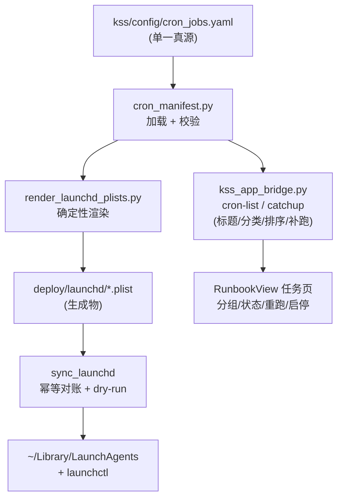

# refactor: 单一清单驱动 KSS launchd 任务 + 安装器 + 任务页同步

## Summary

把当前散落、手维护的 KSS launchd 定时任务收成**单一声明式清单**(manifest)作为唯一真源。清单驱动三件下游产物:① 确定性渲染 `deploy/launchd/*.plist`;② 一个幂等安装器把清单 → `deploy/launchd` → `~/Library/LaunchAgents` → `launchctl` 对账(装缺失、更新变化、清陈旧);③ bridge 的任务元数据(标题/分类/排序/补跑资格)从清单派生,不再硬编码。**保留每个任务独立**(用户决策:不做运行期 pipeline 合并),整合发生在**管理层**——一处编辑,plist 安装与 app「任务」页同步生效。

不改任何任务算什么、不动业务调度时刻、不碰分时采集器(独立通道)。

---

## Problem Frame

KSS 有 **14 个已装** launchd 任务(`~/Library/LaunchAgents/com.zcdeng.kss.*`),管理面分散成三处且会漂移:

- **plist 真源**:`deploy/launchd/com.zcdeng.kss.*.plist`(**15 个**,手写),bridge `cron-list` 以此目录为注册表枚举任务(`_launchd_plists()` 自述为「白名单唯一事实源」)。
- **已装副本**:`~/Library/LaunchAgents/`(**14 个**)——比 `deploy/launchd` 少一个 `data_catalog_daily`,无安装器对账,**漂移已发生**。
- **任务元数据**:`scripts/kss_app_bridge.py` 里 `LABEL_TITLES` / `LABEL_CATEGORY` / `CATEGORY_ORDER` 硬编码;`Sources/KSSDesktop/Views/RunbookView.swift` 又把 `categoryOrder` 硬编码一份——**同一份元数据三处维护**。且元数据本身已不全:`LABEL_TITLES` 只有 **13** 条,`factor_health`、`ledger_settle` 两个在装在跑的任务无标题/分类,UI 里掉进「其他」。

新增/调整一个任务今天要手改 plist、手 `cp` + `launchctl load`、手改 bridge 两个 dict、可能还要改 Swift。本会话刚踩过相关坑:`refresh_market_strip`(**注:它是 `run_update_data_daily.sh` 里的内联步骤,不是 launchd 任务**)此前根本无任何调度,指数数据冻结;现已折进日更。这个坑严格说**清单管不到内联步骤**——但它和「data_catalog 漂移」「元数据三处维护且不全」共同暴露了同一根因:**调度与元数据没有单一真源**。本计划消除这个根因(launchd 任务范畴;内联步骤的调度可见性列入 Follow-Up)。

用户意图:1)整合本机 cron/plist(选定:**保留独立任务 + 统一清单/安装器**,非 pipeline 合并);2)同步调整 app「任务」管理内容。

---

## Requirements

- **R1** 单一清单是所有 KSS 定时任务的唯一真源:每条含 label 后缀、wrapper、调度(时/分/周几或周更)、中文标题、分类、补跑资格(catchup)、启用位。
- **R2** `deploy/launchd/*.plist` 由清单**确定性生成**;手写 plist 被生成物取代(带「生成勿改」头)。
- **R3** 一条安装/同步命令对账 清单 → `deploy/launchd` → `~/Library/LaunchAgents` → `launchctl`:装缺失、更新变化、清陈旧(消解 `data_catalog_daily` 这类漂移);幂等 + dry-run 先行。
- **R4** bridge 任务元数据(标题/分类/排序/补跑资格)从清单派生,删除硬编码;`cron-list`、`_scheduled_job`、`_cron_catchup` 均读清单;`cron-list` 以清单枚举(glob/LaunchAgents 仅作已装态 diff),清单有而未装者显式告警不静默漏。
- **R5** app「任务」页按清单元数据呈现,分组/状态/重跑/启停无回归;移除 Swift 侧 `categoryOrder` 重复硬编码。
- **R6** 各任务行为、调度时刻、计算内容**不变**(纯管理层重构)。

---

## Key Technical Decisions

- **KTD1 — 保留独立任务,整合在管理层**(用户决策)。不合并成运行期 pipeline:保住每任务隔离、单独重跑、独立日志与可观测性;只把「真源 + 安装 + 元数据」收成一处。两条被否决的下游岔路(pipeline 子步状态、selfcheck 按 label 补跑随 pipeline 变)因此不存在。
- **KTD2 — 清单格式 = YAML**,落 `kss/config/cron_jobs.yaml`(与 `kss/config/settings.yaml` 同处),由 `kss/config/cron_manifest.py` 加载 + 校验。理由:可人读、diff 友好、靠近既有配置。
- **KTD3 — 复用并泛化既有 plist 渲染器**。`feat/intraday-data-layer` 分支(PR #40,未合)已有 `scripts/render_intraday_launchd_plist.py`,含确定性渲染 + 安全纪律(env 白名单、不写密钥、`Label == 文件名 stem`、拒未解析 marker)。本计划生成**一个共享渲染器**承接其纪律,而非再造第二个。见 Risks 的合并时序。
- **KTD4 — `data_catalog_daily` 漂移**:它在 `deploy/launchd` + bridge LABEL 映射里但未装。清单强制定夺。默认 = **纳入清单并安装**(既在模板又在元数据,推断本意是要的);留作 Open Question 待确认。
- **KTD5 — 安装器幂等 + dry-run + 改 launchctl 前确认**(部署纪律)。默认 dry-run 打印 diff;`--apply` 才真动 `launchctl`;陈旧任务默认**警告**,`--prune` 才移除。
- **KTD6 — 分类排序单一化**:bridge 把 `CATEGORY_ORDER`(来自清单)随 `cron-list` 下发;Swift `RunbookView` 改读下发顺序,删本地硬编码,消除第三处副本。

---

## High-Level Technical Design

单一清单扇出到两条链路——安装链(plist/launchctl)与元数据链(bridge/app):

左下(渲染→安装)解决「真源分裂 + 漂移」;右下(bridge→app)解决「元数据三处维护」。两链同读清单 `L`,故装与显永不脱节。

---

## Implementation Units

**任务计数基线(单一推导,各单元一律引用此式,不写死字面量)**:`已装 14` →(KTD4=纳入则 +`data_catalog_daily`)`= 15` →(PR #40 合并后 +`collect_intraday`)`= 16`。本计划交付时清单 = **15**(KTD4 默认纳入);`collect_intraday` 的 16 是 #40 后的目标态,不在本计划测试基线内。下文测试断言以「基线 N」表述,N 随 KTD4 切换联动。

### U1. 定时任务清单 schema + 加载器 + 据现状落清单

**Goal** 定义 `cron_jobs.yaml` 结构,写加载/校验模块,并把当前 14 个已装任务(+ `data_catalog_daily` 决策)誊成清单。

**Requirements** R1, R6(忠实誊录现状,不改调度)

**Dependencies** 无

**Files**
- `kss/config/cron_jobs.yaml`(新,清单)
- `kss/config/cron_manifest.py`(新,加载 + dataclass + 校验)
- `kss/tests/test_cron_manifest.py`(新)

**Approach** 每条目字段:`suffix`、`wrapper`(如 `scripts/run_update_data_daily.sh`)、`schedule`(`{hour, minute, weekdays: [1-5]}` 或 `{weekly: {weekday, hour, minute}}`)、`title`、`category`、`catchup`(bool)、`enabled`(bool)。誊录时严格对照现有 **15 个** `deploy/launchd` plist 的实际时刻(见 Problem Frame 时间窗;含未装的 `data_catalog_daily`,去留由 KTD4 定)。**清单是 `LABEL_TITLES`/`LABEL_CATEGORY` 的超集而非照抄**:`factor_health`、`ledger_settle` 当前缺元数据,须读其 plist 补正确 `title` + `category`(如 `校验回测`/`系统`——具体归类是本单元要定的元数据决策,不丢给实现者)。校验:suffix 唯一;`wrapper` 解析后须落在 `PROJECT_ROOT/scripts/` 之内(防清单被改指向任意可执行——见 Risks);`category` ∈ `CATEGORY_ORDER`;schedule 合法;**拒绝任何匹配 `kss.security.redaction.CREDENTIAL_KEY_RE` 的键**(清单禁带密钥,token 由 wrapper 运行时加载)。`CATEGORY_ORDER` 也落清单顶层。

**Patterns to follow** `kss/config/settings.yaml` 的加载方式;`scripts/kss_app_bridge.py` 现有 `LABEL_*` 字典的语义为字段对照表。

**Test scenarios**
- happy:加载完整清单 → 基线 N 条(默认 15,KTD4 改移除则 14;均不含 `collect_intraday`,后者于 #40 后另纳),字段齐全,类型正确;含 `factor_health`/`ledger_settle` 且 title/category 非「其他」。
- 校验:重复 suffix → 报错;未知 category → 报错;缺 wrapper 文件 → 报错;非法 weekday(0/8 越界规则)→ 报错。
- 安全:`wrapper: /usr/bin/curl`(越出 `PROJECT_ROOT/scripts/`)→ 报错;清单含 `tushare_token:` 类键(命中 `CREDENTIAL_KEY_RE`)→ 报错。
- 边界:weekly 任务(paper_trade_weekly / prediction_validation_weekly)解析正确(单 weekday + 时分)。
- 对照:清单誊录的每条 schedule 与对应 `~/Library/LaunchAgents` plist 的 `StartCalendarInterval` 等价(防誊错;此测试是 R6「时刻不变」的拦截闸,须在 U3 `--apply` 覆盖已知良 plist 之前过)。

**Verification** 加载器对真实清单零报错;一个「清单↔现装 plist 调度一致性」测试通过。

---

### U2. 清单驱动的 plist 确定性渲染器

**Goal** 从清单渲染 `deploy/launchd/com.zcdeng.kss.<suffix>.plist`,确定性、可复跑、带安全纪律。

**Requirements** R2

**Dependencies** U1

**Files**
- `scripts/render_launchd_plists.py`(由 #40 合入 main 的 `scripts/render_intraday_launchd_plist.py` **重命名/泛化**而来,非另起新文件——避免 KTD3 禁止的「两套渲染器」)
- 分时采集器对旧渲染器名 `render_intraday_launchd_plist.py` 的调用点(改:指向泛化后的 `render_launchd_plists.py`,或保留薄 shim)
- `kss/tests/test_render_launchd_plists.py`(由 `test_intraday_render_plist.py` 承接/扩展)
- `deploy/launchd/*.plist`(改:转为生成物,加「生成勿改」头注释)

**Approach** 每任务渲染:`Label` = 文件名 stem(`com.zcdeng.kss.<suffix>`,二者必须相等);`ProgramArguments` = wrapper 绝对路径;`StartCalendarInterval` 由 schedule 展开(daily → 周一至五 5 条目;weekly → 单条目);`StandardOutPath`/`StandardErrorPath` = `storage/logs/cron/<suffix>.log`。安全(承接 KTD3,**复用同一真源不重造**):`import CREDENTIAL_VALUE_RE, contains_credential from kss.security.redaction`(与 intraday 渲染器同源,不本地另写正则);env 白名单 `_ALLOWED_ENV_KEYS` 设为**共享常量**(置 `cron_manifest.py` 或 `redaction.py`,两渲染器共用);渲染后过 `contains_credential` 拦 token 形态、拒残留 `__MARKER__`、`Label != stem` 即失败。`plutil -lint` 应通过。**渲染-vs-已知良金标闸(R6 守护)**:把当前 **14 个已装** plist(`~/Library/LaunchAgents`)快照成 known-good fixture;`data_catalog_daily` 未装,其金标基线取 `deploy/launchd` 模板并标注「未装,以模板为基线」(随 KTD4 去留)。渲染输出须在 schedule/wrapper/日志路径上与基线语义等价方可被 U3 `--apply`;调度字段不一致且无显式「已确认变更」标志时,渲染/安装**硬拒**。

**Technical design**(directional)生成器对每条目产出 `(plist_path, xml_text)`;主流程写文件前先 `plutil`-lint 字符串、再原子写。

**Patterns to follow** `feat/intraday-data-layer` 分支 `scripts/render_intraday_launchd_plist.py`(若已合则**泛化复用**,而非另起);intraday 测试 `test_intraday_render_plist.py` 的安全断言集。

**Test scenarios**
- happy:daily 任务渲染含 5 个工作日 `StartCalendarInterval` 条目 + 正确时分;weekly 渲染单条目。
- 安全:env 含非白名单键 → 拒;plist 文本含 token 形态串 → 拒;`Label` 与 stem 不符 → 拒;渲染后残留 `__X__` marker → 拒。
- 安全(同源):mock `kss.security.redaction.contains_credential` 断言渲染期被调用(防新渲染器另写正则与真源漂移)。
- 金标(R6):渲染输出 vs 14 个已装 plist 快照(+ data_catalog 未装模板基线)在 schedule/wrapper/日志路径语义等价;故意把某任务时刻改错 → 金标闸拒(不予 `--apply`)。
- 确定性:同一清单两次渲染字节相同(golden 对照)。
- lint:产物过 `plutil -lint`。

**Verification** 渲染全清单产出与现装 plist 语义等价(调度/wrapper/日志路径);安全断言全绿;golden 确定性测试通过。

---

### U3. 安装 / 同步器(对账漂移)

**Goal** 一条命令把清单落地:渲染 → 装入 `~/Library/LaunchAgents` → `launchctl` 装/启;对账缺失/变化/陈旧;幂等、dry-run 先行。

**Requirements** R3

**Dependencies** U1, U2

**Files**
- `scripts/sync_launchd.py`(新;或 `.sh` 薄封装)
- `kss/tests/test_sync_launchd.py`(新,注入假 LaunchAgents/launchctl)

**Approach** 步骤:① 渲染(U2)到 `deploy/launchd`;② 对账目标态 vs `~/Library/LaunchAgents` 现态 → 计算 install / update / stale 三集;③ 默认 `--dry-run` 打印三集 diff;④ `--apply` 才 `cp` + `launchctl bootstrap/enable`(改变的先 `bootout` 再 `bootstrap`);⑤ 陈旧任务(现装但不在清单,如 `data_catalog_daily` 若决定移除)默认仅**警告**,`--prune` 才 `bootout` + 删文件。幂等:全部已对齐 → 零变更。部署纪律(KTD5):动 `launchctl` 前确认。

**Approach 注** 把对账逻辑(diff 计算)与副作用(cp/launchctl)分离,使 diff 可纯函数单测。

**Test scenarios**
- happy:空 LaunchAgents + 清单基线 N 条 → install 集 = N,stale = 0。
- 漂移:现装含一个不在清单的 label → 进 stale 集;`--prune` 关时仅警告、不删;开时移除。
- 变化:某任务清单时刻改了 → 进 update 集(需 bootout+bootstrap)。
- 幂等:已全对齐再跑 → 三集皆空,零副作用。
- dry-run:`--dry-run` 不触碰 `launchctl`/文件系统(注入的假命令零调用)。

**Verification** 在注入环境模拟「空/漂移/变化/已对齐」四态,diff 计算正确;dry-run 零副作用;`--apply` 调用序列符合预期。

---

### U4. bridge 任务元数据从清单派生

**Goal** 删除 `kss_app_bridge.py` 里硬编码的 `LABEL_TITLES`/`LABEL_CATEGORY`/`CATEGORY_ORDER`(及补跑资格),改从清单读;`cron-list`/`_scheduled_job`/`_cron_catchup` 单一真源。

**Requirements** R4

**Dependencies** U1

**Files**
- `scripts/kss_app_bridge.py`(改:`_scheduled_job`、`cron-list`、`_cron_catchup` 读清单元数据)
- `kss/tests/test_cron_metadata.py`(新)

**Approach** 加载清单(U1)→ 提供 `title_for(suffix)` / `category_for(suffix)` / `category_order()` / `catchup_eligible(suffix)`。`_scheduled_job` 的 `title`/`category` 改走清单。**枚举源改为清单**(消解 R1 与「glob 为准」的矛盾):`cron-list` 以清单(`enabled` 过滤)枚举任务,`deploy/launchd` glob 与 `~/Library/LaunchAgents` 仅作**已装态**用于 diff——清单有而未装的任务在任务页显式标「未安装/需同步」告警,**绝不静默漏掉**(正是要消灭的 refresh_market_strip 式隐性遗漏)。`cron-list`/`snapshot` 两个 payload 均增 `categoryOrder: [String]` 字段下发(供 U5);Swift 读 `snapshot` 中的值。

**Approach 注(catchup,以 main 现实为准)** main 上 `_cron_catchup` 目前补跑所有 stale 启用任务、**无 per-label 排除**(仅排 selfcheck);`NO_CATCHUP_LABELS` 只存在于未合的 `feat/intraday-data-layer`。故在 main 上 `catchup: false` 是**新增能力**(无硬编码可删);与 `NO_CATCHUP_LABELS` 的收敛、`collect_intraday` 的吸收只在 PR #40 合并时发生——见 Risks 硬前置,不作为本单元的现在式删除任务。

**Test scenarios**
- happy:`cron-list` 输出每任务 title/category 与清单一致;payload 含 category order。
- catchup:`catchup: false` 的任务不进 `_cron_catchup` 的 kickstart 集;`true` 的进。
- 回退:清单缺某 suffix → title/category 回退到 suffix/「其他」(不崩)。
- 一致性:bridge 暴露的 category 集 ⊆ 清单 `CATEGORY_ORDER`。

**Verification** `cron-list` 对真实清单输出与现行 UI 等价(标题/分类/排序不变);catchup 按清单 flag 行事;无 `LABEL_TITLES`/`LABEL_CATEGORY` 硬编码残留。

---

### U5. app「任务」页与清单元数据对齐

**Goal** `RunbookView` 用 bridge 下发的分类顺序,删除 Swift 侧 `categoryOrder` 硬编码;分组/状态/重跑/启停无回归。

**Requirements** R5

**Dependencies** U4

**Files**
- `Sources/KSSDesktop/Views/RunbookView.swift`(改:`categoryOrder` 改读下发值)
- `Sources/KSSDesktop/Models/KSSModels.swift`(按需:`AppSnapshot`/cron payload 增 `categoryOrder` 字段)

**Approach** bridge 在 `cron-list`/snapshot 的 payload 增 `categoryOrder: [String]`(U4 下发);Swift `JobsPanel` 用它替代 `private static let categoryOrder`。未列出的分类仍排末尾。其余(行级重跑、批量重跑、启停、健康汇总)读现有 `ScheduledJob` 字段,逻辑不变。

**Execution note** 纯展示数据来源切换 + 删重复常量,无新业务行为;无需 test-first。

**Test scenarios** `Test expectation: none — 纯元数据来源切换 + 删重复常量,无新增行为`。手动核验:任务页分组顺序、各任务标题/分类、重跑/启停与改前一致(`swift build` + 真机目检;本机仅 CLT 无 XCTest,沿用既有约束)。

**Verification** 任务页与改前视觉/交互等价;Swift 无第二份 `categoryOrder` 常量;新增/改任务只动清单即在 UI 反映。

---

## Scope Boundaries

**In scope**:单一清单 + 渲染器 + 安装/同步器 + bridge 元数据派生 + Swift 任务页对齐;消解 `deploy/launchd ↔ LaunchAgents` 漂移。

**Out of scope(非目标)**
- 不做运行期 pipeline 合并(KTD1 用户决策)——任务保持独立。
- 不改任何任务的算法/计算内容/业务调度时刻(R6)。
- 不碰分时采集器(`collect_intraday`)的独立数据通道与 PIT 逻辑。
- 不引入跨机部署/远程编排(本机 launchd 范畴)。

### Deferred to Follow-Up Work
- 把 `kss/config/cron_jobs.yaml` 接入「app 内编辑任务调度」(目前仅 enable/disable/rerun;改时刻仍需编辑清单 + 跑同步器)。
- 安装器接入 `selfcheck` 看门狗自动对账(开机自检时跑 dry-run 报漂移)。

---

## Risks & Dependencies

- **硬前置:PR #40 先合并**(主依赖,已从「建议」升为前置)。`feat/intraday-data-layer`(PR #40,未合)独家持有本计划依赖的三样东西:① `scripts/render_intraday_launchd_plist.py`(U2 要泛化的渲染器,main 上不存在,无法「复用」)、② `kss/security/redaction.py`(U1/U2 的 `CREDENTIAL_KEY_RE`/`contains_credential` 来源,main 上也不存在 → 若本计划先落,U2 连导入都做不到)、③ `NO_CATCHUP_LABELS` + `collect_intraday`(U4 catchup 收敛对象)。结论:**本计划在 PR #40 合并后开工**,届时直接泛化已合入 main 的 `render_intraday_launchd_plist.py`、复用 `kss.security.redaction`、并把 `collect_intraday`(`catchup:false`)作为合并后的一条清单项纳入(基线 15→16;此为 #40 后动作,U4 的「NO_CATCHUP 非现在式删除」与此一致——都在合并后发生)。若坚持先落,须新增一个单元显式承担「造渲染器 + 造 redaction 或临时复制正则 + 后续与 #40 收敛」,有名有主有验收——不留给 Risks 散文。
- **launchctl 是部署操作**:安装器误判 stale 可能 bootout 一个在用任务。缓解:默认 dry-run + 警告、`--prune` 才删、改 `launchctl` 前确认(KTD5);diff 逻辑纯函数单测覆盖四态。
- **手改 plist 漂移**:有人直接编辑生成的 plist。缓解:plist 头加「生成勿改,改 cron_jobs.yaml」注释;安装器以清单为准覆盖。
- **wrapper 日志凭据卫生**:多个 wrapper(`run_update_data_daily.sh:31`、`run_sector_review_daily.sh:42`)`echo TOKEN length=...` 到 `storage/logs/cron/*.log`,而 `storage/logs/` 未 gitignore。清单枚举全部 wrapper,U1 落地前应顺手:① 审计所有 wrapper 不打印任何凭据值/长度(改为布尔「已加载」);② 把 `storage/logs/cron/` 加进 `.gitignore`。低危(长度非凭据本身)但属本计划触达面。
- **誊录错误**:清单时刻/wrapper 抄错 → 任务时间漂移。缓解:U1 的「清单↔现装 plist 一致性」测试在落地前拦截。

---

## Open Questions

- **`data_catalog_daily` 去留**(KTD4):纳入清单并补装,还是从 `deploy/launchd` + 元数据移除?默认**纳入并装**。需用户确认。
- **陈旧任务默认行为**:安装器对「现装但不在清单」默认**警告不删**,`--prune` 才移除——可接受否?
- **与 PR #40 的时序**:已定为**硬前置——#40 先合并**(见 Risks),否则渲染器与 `kss.security.redaction` 在 main 上不存在,U2 无从复用/导入。仅当用户要求先落时才转为「新增收敛单元」。
- **`factor_health`/`ledger_settle` 归类**:两任务当前掉进「其他」,U1 须定其 `category`(候选:`factor_health → 校验回测`,`ledger_settle → 纸交易`?)——请确认归类。
- **`deploy/launchd/*.plist` 是入库生成物还是构建期临时产物?** 清单成枚举真源后,`manifest → deploy/launchd(入库) → LaunchAgents` 是三方一致面。若**入库**:加 pre-commit/CI 闸断言「渲染输出 == 已提交 plist 字节相同」,陈旧提交大声失败。若**临时**:从 git 移除这些 plist、`sync_launchd` 渲染到临时目录,三方收敛为两方(manifest → LaunchAgents)。默认倾向**临时产物**(消除三方负担)。需定夺。

---

## Verification

整体完成判据:
1. 编辑 `kss/config/cron_jobs.yaml` 单处 → 跑同步器 → `deploy/launchd` plist、`~/Library/LaunchAgents`、app 任务页三者一致。
2. `sync_launchd --dry-run` 在当前机器报告漂移集 = `{data_catalog_daily}`(或决议后为空);`--apply` 后 `launchctl list | grep kss` 与清单一致。
3. `cron-list` 输出标题/分类/排序与改前 UI 等价;`cron-catchup` 按清单 `catchup` flag 行事。
4. 任务页分组/重跑/启停无回归;Swift 与 bridge 各自无重复元数据硬编码。
5. 各任务实际调度时刻与计算结果不变(R6)。
