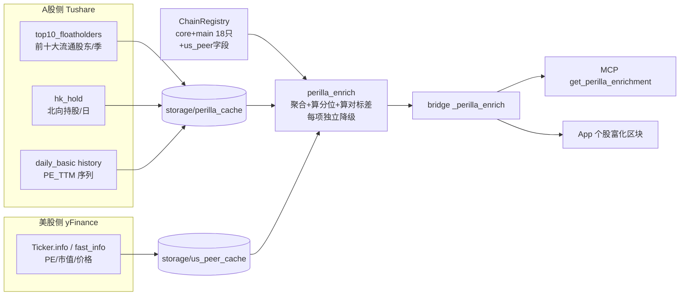

# feat: 紫苏叶个股机构持仓/PE 动态 + 美股对标(yFinance)富化层

## Summary

给**紫苏叶列表内的每只个股**（注册表 `core` + `main` 两层，当前 18 只）叠加一层**只读富化数据**：
1. **机构持仓动态** — Tushare 前十大流通股东季度环比 + 北向(陆股通)持股趋势；
2. **PE 动态** — 现值 PE_TTM + 历史分位（复用 scan_bj50 的分位算法）；
3. **美股对标估值** — 每只票人工标注一个美股对标 ticker（多数=已知全球竞争者里的美股上市者），用 yFinance 拉 PE/市值/价格，算"对标估值差"。

这是**数据/富化层**，不改紫苏叶评分、不改选股、不做回测。重数据层 + MCP/CLI 接入，App 做最小一块"个股富化"区块。外网/接口不通时**优雅降级**（缺哪块标 unavailable，不阻塞主流程）。

---

## Problem Frame

紫苏叶列表筛出了"结构性卡脖子"个股，但列表本身只有产业链结构字段（链层/护城河/锁定）。要把它用于决策，还缺三类**确定性可取**的辅助事实：谁在买（机构持仓动态）、贵不贵（PE 分位）、对标的美股龙头是什么估值（紫苏叶理论的核心论点之一就是"市值 < 行业龙头 1/10"——需要龙头估值才能量化这个 gap）。

这些都是 LLM 不该口算的金融数字（见 [[llm-numbers-deterministic-rendering]]），必须代码确定性获取并缓存。当前缺口：
- Tushare 客户端没有机构持仓相关方法（`top10_floatholders` / `hk_hold` 都没封装；scan_bj50 仅内联用了 `stk_holdernumber`）。
- PE 现值在 `daily_basic` 缓存里有，但那是**单日切片**，无历史 → 算不了分位。
- 注册表没有美股对标字段；yFinance 未安装。

---

## Requirements

- **R1** — 对紫苏叶列表（`tier ∈ {core, main}`）每只票，可取「前十大流通股东季度环比变动」+「北向持股趋势」。
- **R2** — 对每只票，可取 PE_TTM 现值 + 历史分位（基于近 N 季/年的 PE 序列）。
- **R3** — 每只票可人工标注 0 或 1 个美股对标 ticker；有标注时用 yFinance 取对标 PE/市值/价格，并算 A 股 vs 对标的市值/估值差。
- **R4** — 所有富化项**独立优雅降级**：某数据源不可用（外网墙、接口无权限、对标未标注）时该项返回 `unavailable`/`null` + 原因，不报错、不阻塞其他项。
- **R5** — 富化结果可经 bridge 一次性按 symbol 取出，并暴露为 MCP 工具；App 个股视图最小接入一块展示区。
- **R6** — 所有外部取数**带本地缓存**，避免重复打接口（沿用 `storage/*_cache/` 模式）；金融数字全代码渲染，无 LLM 介入。

**成功标准**：对 18 只紫苏叶个股跑一遍富化，能产出结构化 dict（机构/ PE 分位 / 美股对标三块，缺失项标 unavailable），bridge + MCP 可取，App 能渲染；离线/断网下不崩、降级清晰。

---

## High-Level Technical Design

数据流（取数→缓存→富化聚合→出口）：

**降级矩阵**（R4）：每个出口字段独立标 `status: ok|unavailable`，聚合层 try/except 包每个数据源，单源失败不污染其他源。

---

## Key Technical Decisions

- **KTD1 — 机构持仓口径 = 前十大流通股东环比 + 北向持股**（用户确认）。`top10_floatholders` 给季度持仓结构 + 可算环比增减仓；`hk_hold` 给北向日度持股量/占比趋势。**不**纳入股东人数/基金重仓（避免端点蔓延；后续可加）。
- **KTD2 — 美股对标走注册表人工字段 `us_peer`**，不自动推断。契合紫苏叶全程人工策展、可审；多数对标=现有 `analyst_notes` 已写的全球竞争者里的美股上市者（中微→LRCX、华海清科→AMAT、盛美→ACMR、中科飞测→KLAC、长川→TER、天孚→COHR、天岳→WOLF、民士达→DD、金力永磁→MP…）。**部分票无干净美股对标**（南大光电/三环/绿的谐波等，竞争者是日/德系）→ `us_peer: null`，按 R4 降级，不强凑。
- **KTD3 — yFinance 取数最小面**：只取 `trailingPE` / `marketCap` / `currentPrice`（或 `fast_info`），不取财报/历史。降低对慢且易变的 `.info` 的依赖，断网即降级。
- **KTD4 — PE 分位复用 scan_bj50 算法**：`(pe_series < pe_now).mean()`，序列来自每票 `daily_basic` 历史窗口（双创票 cs_data 无 PE 历史，需新拉 daily_basic 历史并缓存，与 scan_bj50 对 BJ 的做法一致）。窗口 < 30 点则分位返回 null。
- **KTD5 — 缓存与刷新**：A 股侧落 `storage/perilla_cache/<ts_code>_{holders,hkhold,pe}.{csv,json}`；美股侧落 `storage/us_peer_cache/<ticker>.json`（带取数日期）。季度数据按季缓存、北向/PE 按交易日。刷新走一个可被 cron 调度的脚本（最小：手动/日频）。
- **KTD6 — 富化层位置**：新模块 `kss/perilla_enrich/`（取数+聚合），bridge 加薄封装 `_perilla_enrich(symbol)`，不塞进 `_perilla_picks`（选股表保持轻量，富化是按需逐票取）。

---

## Implementation Units

### U1. yfinance 依赖 + 美股对标取数模块

**Goal:** 引入 yfinance，封装一个"给 ticker 返回 {pe, marketCap, price, currency, status}"的取数器，带缓存 + 断网降级。

**Requirements:** R3, R4, R6
**Dependencies:** 无
**Files:**
- `pyproject.toml`（加 `yfinance` 依赖）/ `uv.lock`（锁定）
- `kss/perilla_enrich/__init__.py`（新包）
- `kss/perilla_enrich/us_peer.py`（取数器 + 缓存）
- `kss/tests/test_us_peer.py`

**Approach:** `fetch_us_peer(ticker, cache_dir, max_age_days=1)`：先读 `storage/us_peer_cache/<ticker>.json`（未过期直接用）；否则 `yfinance.Ticker(ticker).fast_info`（缺字段回退 `.info`）取 `trailingPE/marketCap/lastPrice`，写缓存。任何异常（网络/未知 ticker）→ 返回 `{status:"unavailable", reason:...}`，不抛。`ticker is None` → `{status:"no_peer"}`。

**Patterns to follow:** scan_bj50 的 `_cache_path` + force 刷新；`tushare_client` 的"失败保留原值/降级"风格。
**Test scenarios:**
- Happy: mock yfinance 返回完整 info → 结构化 dict + 写缓存文件。
- Cache hit: 缓存未过期 → 不调用 yfinance（mock 断言未被调用）。
- 边界 `ticker=None` → `status:"no_peer"`，不触网。
- 失败路径：yfinance 抛异常（网络/ticker 不存在）→ `status:"unavailable"` + reason，不抛。
- 边界：`.fast_info` 缺 PE 字段 → 回退 `.info`；都缺 → PE=null 但 marketCap 仍返回。

**Verification:** 离线（mock）下全测试绿；联网真跑一只（如 LRCX）能落缓存。

---

### U2. 注册表 `us_peer` 字段 + 标注紫苏叶列表

**Goal:** `StockChainInfo` 增 `us_peer` 字段，YAML 解析支持，并给 core+main 18 只标注对标（无干净对标的标 null）。

**Requirements:** R3
**Dependencies:** 无
**Files:**
- `kss/supply_chain/registry.py`（dataclass + `from_yaml` 解析 `us_peer`）
- `kss/config/supply_chain.yaml`（给 18 只加 `us_peer: {ticker, name}` 或 null）
- `kss/tests/test_supply_chain.py`（解析测试）

**Approach:** `us_peer` 为可选 dict `{ticker: str, name: str}`，缺省 `None`。`from_yaml` 容错解析（缺字段→None）。标注以现有 `analyst_notes` 的全球竞争者为依据，仅标美股上市者；日/德系竞争者无美股对标的留 null。

**Patterns to follow:** 现有 `StockChainInfo` 字段 + `from_yaml` 的逐字段 `.get` 容错。
**Test scenarios:**
- 解析含 `us_peer` 的票 → dataclass 带 ticker/name。
- 解析无 `us_peer` 的票 → `us_peer is None`（向后兼容旧 YAML）。
- `us_peer` 字段畸形（非 dict）→ 降级 None + warning，不崩。
- Covers R3: 标注后 `core+main` 至少 10 只有非空对标。

**Execution note:** 字段先行、标注其次；标注是领域判断，带 `[待审]` 注记沿用既有 `[补标...待审]` 约定。

---

### U3. Tushare 客户端：机构持仓 + PE 历史取数方法

**Goal:** `TushareClient` 加 `fetch_top10_floatholders`、`fetch_hk_hold`、`fetch_daily_basic_history` 三个方法（带现有 retry/降级）。

**Requirements:** R1, R2, R6
**Dependencies:** 无
**Files:**
- `kss/data/tushare_client.py`（3 个新 fetch 方法）
- `kss/tests/test_tushare_client.py`（mock `_pro`，断言参数 + 降级）

**Approach:** 复用类内现有 `_call`/retry 包装。`fetch_top10_floatholders(ts_code, period/start,end)` → DataFrame(含 `holder_name/hold_amount/hold_ratio/end_date`)；`fetch_hk_hold(ts_code, start, end)` → 北向持股(`ratio/vol`)；`fetch_daily_basic_history(ts_code, start, end)` → `pe_ttm` 序列。接口无权限/无数据 → 返回 None（与现有 `fetch_report_rc` 一致）。

**Patterns to follow:** `kss/data/tushare_client.py` 现有 `fetch_report_rc`/`fetch_daily_basic` 的签名与降级。
**Test scenarios:**
- 各方法 happy：mock `_pro.<endpoint>` 返回 df → 透传 df，参数（ts_code/日期）正确。
- 无数据：`_pro` 返回空 df → 返回 None 或空（与既有约定一致）。
- 失败：`_pro` 抛异常 → 经 retry 后返回 None，不抛。

**Execution note:** 先写一只票的接口契约测试（mock）确认列名假设，再接聚合层——`top10_floatholders`/`hk_hold` 的列名以 Tushare 文档为准，实测可能要微调。

---

### U4. 机构持仓动态 + PE 分位 计算模块

**Goal:** 纯计算：把 U3 的原始 df 转成「环比增减仓/北向趋势/PE 分位」结构化指标。

**Requirements:** R1, R2
**Dependencies:** U3
**Files:**
- `kss/perilla_enrich/holdings.py`（环比 + 北向趋势）
- `kss/perilla_enrich/valuation.py`（PE 分位）
- `kss/tests/test_perilla_holdings.py`
- `kss/tests/test_perilla_valuation.py`

**Approach:**
- `top10_dynamics(df)`：按 `end_date` 取最近两季，对齐 `holder_name` 算持股比例环比 Δ（新进/退出/增/减），输出 `{latest_period, n_institutions, net_change_pct, movers:[...]}`。
- `hk_hold_trend(df)`：北向持股比例近 20/60 日变动方向 + 现值。
- `pe_percentile(pe_series, pe_now)`：复用 `(s < pe_now).mean()`，< 30 点→ null。

**Patterns to follow:** scan_bj50 `pe_quantile` 计算；纯函数、无 IO。
**Test scenarios:**
- 环比：构造两季 df，含新进/退出/增减各一 → movers 分类正确、net_change 符号正确。
- 环比边界：只有一季数据 → `net_change=null`，不崩。
- 北向：升/降/持平三序列 → 方向标签正确；空序列 → unavailable。
- PE 分位：已知序列 + 现值 → 分位数值正确（happy）；序列 < 30 点 → null；pe_now ≤ 0 → null。

---

### U5. 富化聚合器（单票 → 三块富化 dict）

**Goal:** `enrich(symbol)`：调 registry 取 us_peer，调 U1 取美股、U3+U4 取 A 股机构/ PE，组装成一个每项带 `status` 的 dict；单源失败独立降级。

**Requirements:** R1–R4
**Dependencies:** U1, U2, U3, U4
**Files:**
- `kss/perilla_enrich/aggregate.py`（`enrich(symbol) -> dict`）
- `kss/tests/test_perilla_enrich.py`

**Approach:** 三个 `try/except` 块分别产出 `institutional` / `valuation_pe` / `us_peer` 子 dict，每块 `status: ok|unavailable|no_peer`。美股对标块含「A股市值 vs 对标市值倍数」「PE 对比」（两边都有值时才算 gap，否则标 unavailable）。仅对 `tier ∈ {core, main}` 的票富化；其他 symbol → `{status:"not_in_perilla_list"}`。

**Patterns to follow:** bridge 现有"每数据源独立 try、缺失填 None"风格。
**Test scenarios:**
- Happy：mock 三源齐全 → 三块均 `ok`，对标 gap 数值正确。
- 降级：us_peer=None → 美股块 `no_peer`，机构/PE 仍 `ok`。
- 降级：Tushare 抛错 → 机构块 `unavailable`，其余 `ok`（**集成场景**：验证单源失败不污染其他块）。
- 边界：symbol 不在紫苏叶列表 → `not_in_perilla_list`，不触任何取数。
- Covers R4：任意单源失败，函数返回完整结构、不抛。

---

### U6. Bridge + MCP 出口 + App 最小富化区块

**Goal:** bridge 暴露 `_perilla_enrich(symbol)`；MCP 加 `get_perilla_enrichment` 工具；App 个股视图加一块只读富化区。

**Requirements:** R5
**Dependencies:** U5
**Files:**
- `scripts/kss_app_bridge.py`（`_perilla_enrich` 薄封装 + 命令分发 `get-perilla-enrichment`）
- `scripts/kss_mcp.py`（`@mcp.tool get_perilla_enrichment(symbol)`）
- `Sources/KSSDesktop/Models/KSSModels.swift`（富化 payload 模型）
- `Sources/KSSDesktop/Views/`（个股视图新增富化区块；接入点见下）
- `kss/tests/test_bridge_perilla_enrich.py`（bridge 命令分发）

**Approach:** bridge 函数 import `kss.perilla_enrich.aggregate.enrich`，包成 JSON 命令（与现有 `get-stock`/`get-discovery-candidates` 同分发风格）。MCP 加只读工具。App：在已有个股详情/复盘视图加一块"机构持仓动态 / PE 分位 / 美股对标"卡片，缺失项显示"暂不可用"。UI 为最小接入，不做交互/排序。

**Patterns to follow:** `kss_mcp.py` 现有 `get_stock`；bridge 现有命令分发表（`get-discovery-candidates` 等）；DashboardView 卡片渲染风格。
**Test scenarios:**
- bridge 命令分发：`get-perilla-enrichment` + symbol → 调 enrich、回 JSON；非法 symbol → 结构化降级 dict。
- MCP 工具返回 enrich 结果（mock aggregate）。
- UI: `Test expectation: none -- 纯展示接入，逻辑在数据层；swift build 通过即可`。

**Execution note:** UI 接入点先确认是挂在个股复盘视图（`_stock_review` 链路）还是紫苏叶表行展开——以现有个股详情入口为准，避免新建导航。

---

### U7. 缓存刷新脚本 + cron 接入（可选最小）

**Goal:** 一个可手动/日频跑的刷新脚本，预热 18 只的 A 股缓存；按 cron_manifest 约定登记（可 dry-run 先看）。

**Requirements:** R6
**Dependencies:** U3, U4
**Files:**
- `scripts/refresh_perilla_enrich.py`（遍历 core+main 预热缓存）
- `kss/config/cron_jobs.yaml`（登记，enabled 可先 false）
- `scripts/run_perilla_enrich_daily.sh`（包装）

**Approach:** 遍历 `tier ∈ {core,main}`，逐票拉 holders/hk_hold/pe 历史 + 美股对标，写缓存，限频 sleep。美股侧若全墙则整段跳过 + warning。

**Patterns to follow:** `refresh_daily_basic.py` + `run_scan_bj50_daily.sh`；cron 登记见 [[cron-manifest-plan-progress]]（`sync_launchd.py --apply` 先 dry-run）。
**Test scenarios:** `Test expectation: none -- 编排脚本；核心逻辑已被 U1/U3/U4 覆盖`。冒烟：`--limit 1` 跑一只不报错。

---

## Scope Boundaries

**In scope:** 紫苏叶列表(core+main)个股的机构持仓动态 + PE 分位 + 美股对标取数/缓存/降级；bridge+MCP+最小 UI 接入。

**Out of scope（本次不做）:**
- 改紫苏叶评分/分层/选股逻辑。
- 美股对标的自动推断（坚持人工标）。
- 对标相关性/协整回测、因子化。

### Deferred to Follow-Up Work
- 机构口径扩展：股东人数趋势、基金重仓明细。
- watch 层及全注册表富化（先只 core+main）。
- 美股对标历史估值序列（本次只取现值）。
- 富化数据进 LLM 复盘 prompt（先确保代码渲染真值，注入是下一步）。

---

## Risks & Dependencies

- **R-yfinance/外网墙**（高）：本机外网历史上常不通（[[news-sentiment-digest-spike]] 等记录东财/外部端点不通）。缓解：U1 强制缓存 + `no_peer`/`unavailable` 降级，主流程永不依赖美股可达；联网时机会性刷新。
- **Tushare 端点权限**（中）：`top10_floatholders`/`hk_hold` 可能需积分等级。缓解：U3 无数据即 None 降级；先实测一只确认可达。
- **季度数据 PIT/时滞**（中）：前十大流通股东季报披露滞后；展示需标 `latest_period` 让用户知道是哪季。
- **us_peer 主观性**（中）：对标是判断。缓解：`[待审]` 注记 + 依据写进 analyst_notes/字段；无干净对标坚持 null 不强凑。
- **接口列名假设**（低）：Tushare 字段以文档为准，U3 执行注记要求先跑契约测试。

---

## Verification Contract

- 18 只 core+main 跑 `enrich()`：每只返回三块结构化 dict，缺失项标 `unavailable`/`no_peer`/null，**无异常抛出**。
- 断网（mock 全失败）下 `enrich()` 仍返回完整结构、bridge 命令不崩。
- PE 分位、环比增减仓、对标市值倍数三类数字经单元测试核对正确（确定性，无 LLM）。
- `get_perilla_enrichment` MCP 工具可取；`swift build --build-system native` 通过，App 富化区块渲染（缺失显示"暂不可用"）。
- 全量 `pytest` 绿。

## Definition of Done

R1–R6 全部满足；U1–U6 落地（U7 可选）；新增取数全部带缓存 + 独立降级；测试覆盖各 happy/边界/失败/集成场景且全绿；离线可用、联网机会性增强；金融数字全代码渲染。

---

## Sources & Research

- 注册表/评分/分层：`kss/supply_chain/registry.py`、`kss/supply_chain/scoring.py`、`kss/config/supply_chain.yaml`（本会话 core/main 分层已落地）。
- PE 分位算法、daily_basic 历史缓存：`scripts/scan_bj50.py`、`scripts/refresh_daily_basic.py`。
- Tushare 取数风格/降级：`kss/data/tushare_client.py`（`fetch_report_rc`/`fetch_daily_basic`）。
- 出口风格：`scripts/kss_app_bridge.py`（`_perilla_picks`/命令分发）、`scripts/kss_mcp.py`（`get_stock`）。
- 相关学习：[[llm-numbers-deterministic-rendering]]、[[verify-data-source-before-building]]、[[cron-manifest-plan-progress]]。
- 外部依赖：yfinance（Yahoo Finance 非官方 API，无 key，需外网）；Tushare `top10_floatholders` / `hk_hold` / `daily_basic` 端点。

**Product Contract preservation:** 直接规划（无上游 brainstorm），`product_contract_source: ce-plan-bootstrap`。
