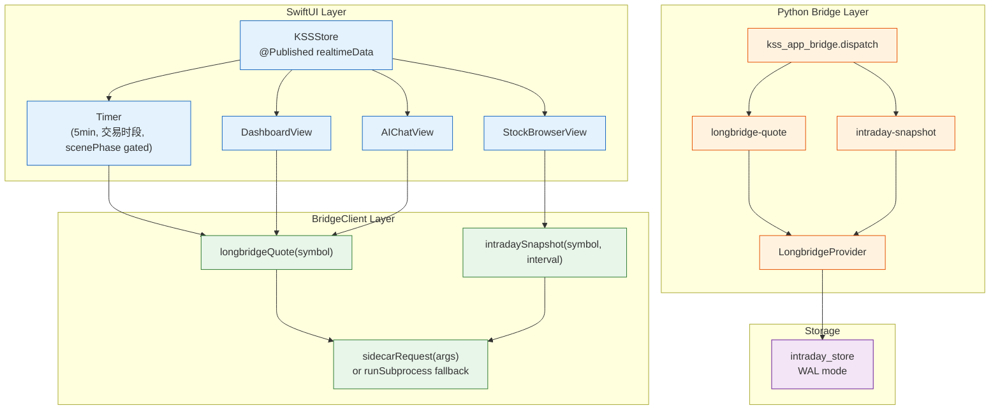

# 动态实时数据接线与分钟K线组件 - Plan

## Goal Capsule

- **Objective:** KSSDeck 页面加载时从 Longbridge 实时源拉取最新行情并落盘本地存储，
  cron 存量数据做回退；个股明细与 Seesaw 内嵌入可复用的分钟 K 线组件；紫苏叶和国产
  替代页面结合定时器自动刷新重算。
- **Product authority:** 方案 C（Longbridge 实时增量，不动现有 cron 采集链）。
- **Open blockers:** 盘中延迟未实测（当前 Longbridge 探针是收盘态跑的），需一个盘中
  交易日验证 minute bar 新鲜度，验证后调整定时刷新间隔；定时刷新间隔默认 5 分钟（implement 时可调）。
- **Product Contract preservation:** 不变（Product Contract 直出 ce-brainstorm + ce-doc-review 修订）

---

## Product Contract

### Summary

KSSDeck 今日总览、个股明细、Seesaw 面板在页面加载时通过 bridge dispatch 只读
Longbridge 命令（`longbridge-quote` / `intraday-snapshot`）拉取最新行情，渲染 + 写
`intraday_store` 落盘。cron 存量数据做回退层（Longbridge 失败 / 非覆盖标的时展示存量 +
标注"非实时"）。个股明细和 Seesaw 内新增今日 1m/5m 分钟 K 线图（可复用组件）。紫苏叶
和国产替代页面停留期间每 N 分钟定时刷新并重算指标。

### Problem Frame

当前 KSSDeck 各页面的数据卡片（指数快照、板块热度、推荐股列表等）在打开时加载的是
上次 cron 任务落盘的存量数据，不是实时拉取。用户打开页面看到的可能是几小时前的数据，
无法感知"此刻盘面"——尤其在盘中（9:30–15:00）时，数据新鲜度直接影响决策质量。

Longbridge 实时数据源（Track A，PR #47）已就绪——`LongbridgeProvider`、bridge 命令
（`longbridge-quote` / `intraday-snapshot`）、Seesaw 工具、kss-mcp 工具、凭据管道全部
上线。但这个实时能力目前**只被 Seesaw AI 对话和 kss-mcp 消费**，页面（今日总览、个股
明细）的 UI 数据卡片还在用存量。

同时，KSSDeck 目前没有任何分钟 K 线图——个股明细页和 Seesaw 只有日线图，用户在盘中想
看今日分时走势无处可看。

紫苏叶个股富化和国产替代表格是纯计算型数据（机构持仓 / PE 分位 / 美股对标），依赖
日线 + 外部数据源，不及时刷新会在盘中错过关键 PE 分位变化和机构调仓信号。

### Requirements

**动态实时拉取（页面加载时触发）**

- R1. 今日总览页（Dashboard）加载时，bridge dispatch 一次 `longbridge-quote` 命令，
  拉取当前指数行情和板块热度对应的标的实时数据，渲染页面中的指数卡片和板块热度卡片。
- R2. 个股明细页（StockBrowser）加载时，bridge dispatch 一次 `intraday-snapshot`
  取该标的的最新分钟 bar，与日线数据并列展示。
- R3. Seesaw 面板（AIChat）加载时与现有首轮 `get_orientation` 并行，bridge dispatch
  一次实时快照，预填「今日盘面」上下文供复盘对话使用。
- R4. 所有页面实时拉取在 Longbridge 失败时，回退展示 cron 存量数据，在数据卡片
  时间戳旁标注灰色时钟图标 + "非实时"。北交所标的恒走回退层（标注"非陆股通标的"）。
  auth_failed 后停止后续定时刷新，展示"实时源未连接"指示器 + 一个手动"重试"入口
  （点击后重新尝试拉取，成功则恢复定时刷新——避免"未连接"状态跨 session 永久滞留）。
- R5. 所有实时拉取的数据（含页面加载和定时刷新触发）均写入 `intraday_store` 落盘，
  复用既有路径和格式，供后续页面或后续 session 复用。

**分钟 K 线组件**

- R6. 新增一个可复用的分钟 K 线渲染组件（WebView-based — 复用现有 `ChartWebView` 的
  TradingView lightweight-charts 渲染路径 + 新增独立日内渲染 API），接收
  `symbol + interval_minutes`，拉取并渲染今日 1m/5m 分钟 K 线。
- R7. 个股明细页（StockBrowser）日线图下方展示今日分钟 K 线，默认 1m，可切 5m。
- R8. Seesaw 对话中 `intraday-snapshot` 工具已接入（best-effort LLM 路由——LLM
  在合适场景下调用）；工具返回包含分钟 bar 数据时，Seesaw 面板渲染 R6 的分钟 K 线
  组件。R3 预填的快照数据优先复用，仅在标的未被预填覆盖时触发独立 `intraday-snapshot`。

**定时刷新与重算**

- R9. 紫苏叶个股富化表格页面停留期间，每 N 分钟（默认 5 分钟）自动重算 PE 分位和
  估值指标。机构持仓和美股对标数据为日级/季级更新，**不在定时刷新中重拉**（仅页面
  加载时拉取一次）。
- R10. 国产替代表格页面停留期间，每 N 分钟自动刷新板块龙头配对和评分排序（股价衍生
  指标依赖 Longbridge 实时价，不重拉外部数据源）。

**数据纪律（不破现有红线）**

- R11. 所有页面实时拉取均走 bridge 只读命令（`longbridge-quote` / `intraday-snapshot`），
  命令 ∉ `WRITE_COMMANDS`，经 `_make_read_only_call` 走受限只读路径（写命令白名单约束 KTD3）。
- R12. 页面层不复述金融数字——所有数字由 bridge 命令返回的真值字段直接渲染，不经过
  LLM 生成（数字纪律）。
- R13. 页面实时拉取和定时器仅在 A 股交易日 9:25–15:05 区间激活。非交易时段或非交易日，
  页面加载直接展示 cron 存量数据（标注"非交易时段"），定时器不启动。交易日判断
  复用既有 `trade_cal` 模块。
- R14. 定时刷新最小间隔 ≥ 2 分钟；页面不可见（TabView 未选中 / 窗口失焦）时暂停
  Timer，恢复可见时在下一个间隔节点触发（不立即触发）；跨页面 dispatch coalescing：
  同一标的 + 同一命令类型 30s 内复用缓存，不重复 dispatch。
- R15. K 线组件覆盖四种状态：loading（骨架占位）、empty（非交易时段 / 零成交 — 显式
  标注"暂无成交数据"）、error（网络/鉴权失败 — 回退 cron 日线 + 标注"分钟线不可用"）、
  unsupported（北交所 / 非陆股通 — 标注"该标的无分钟线"）。

### Key Decisions

- **方案 C：只加 Longbridge 实时增量，不动现有 cron。** cron 采集链（Tushare 日线 /
  东财分钟线）已在产，有自己的重试/去重/eligibility 门控——动它风险大于收益。页面加
  Longbridge 实时增量是纯加法。支持该决策见 brainstorm 对话。
- **分钟 K 线先落在个股明细 + Seesaw，写成可复用组件。** 不做全局 K 线开关或每页
  sparkline——等这两页跑通后再评估铺开到趋势日历等其他页面。
- **分钟 K 线渲染复用现有 ChartWebView 的 TradingView lightweight-charts 路径。**
  当日 K 线已经用 WebView + lightweight-charts 渲染（`ChartWebView.swift`），分钟 K
  线沿用同样的 HTML+JS 渲染层，仅数据源从日线切换到 intraday bar。不做 native SwiftUI
  chart 的重复建设。
- **定时刷新间隔默认 5 分钟。** 紫苏叶 / 国产替代的外部数据源（yFinance / 机构持仓）
  本身不是高频更新的——1 分钟刷新浪费额度，5 分钟是「盘中感知变化」和「节约 API
  额度」之间的合理起点。implement 时可调。
- **Cron 存量数据做回退层，非复制层。** 页面加载优先用实时拉取结果；Longbridge 失败
  时降级到 cron 存量数据（标注"非实时"），不是两套数据并排展示。

### Scope Boundaries

**Deferred for later**
- 北交所标的的实时行情（ChinaConnect 不覆盖，当前无可用实时路径）
- 盘中真延迟的常态化监控看板（独立议题）
- 趋势日历分钟独立视图、全局 K 线 toggle——待分钟 K 线组件跑通后评估
- 每页面 sparkline（每卡片一个标的 × 多卡片 = API 浪费，视觉效果待评估）

**Outside this product's identity**
- 用 Longbridge 做历史回填或任何 PIT 回测准入（PIT 红线）
- 交易执行（下单 / 撤单 / 改单）
- 定时刷新触发 cron 写操作（页面级定时只触发只读拉取 + 本地落盘，不调写命令）

### Outstanding Questions

- OQ1（Deferred to Implementation）：盘中延迟未实测——当前 Longbridge 探针是收盘态跑的，
  minute bar 的新鲜度需一个盘中交易日验证。验证后调整定时刷新间隔。
- OQ2（Deferred to Implementation）：紫苏叶 / 国产替代定时刷新的具体间隔由 implement
  时确定，建议从 5 分钟起步。
- OQ3: `intraday_store` 已启用 WAL mode + busy_timeout=5000ms + INSERT OR IGNORE on
  payload_sha256——并发写由 SQLite 排队保障；implement 时不需额外加锁。页面侧写入
  复用单一共享连接（不每次 dispatch 新建连接）。

### Sources / Research

- PR #47 — Longbridge 实时数据源 Track A + Track B（U1-U9 全部落地，104 tests green）
- `scripts/longbridge_ro.py` — CLI 只读代理（U9）
- `.claude/skills/longbridge-realtime/SKILL.md` — KSS 复盘 skill（U8）
- `Sources/KSSDesktop/Views/DashboardView.swift` — 今日总览 SwiftUI 视图
- `Sources/KSSDesktop/Views/StockBrowserView.swift` — 个股明细 SwiftUI 视图
- `Sources/KSSDesktop/Views/AIChatView.swift` — Seesaw 面板 SwiftUI 视图
- `Sources/KSSDesktop/Views/ChartWebView.swift` — 现有 WebView 日 K 线组件
- `scripts/kss_app_bridge.py:dispatch` — bridge 命令 dispatch 面（新增 `longbridge-quote` / `intraday-snapshot`）
- `kss/data/intraday_store.py` — SQLite 存储层
- OAuth host smoke 结果（2026-07-08）—— 授权 host 在 Clash 下可达

---

## Planning Contract

### Key Technical Decisions

- KTD1. **分钟 K 线渲染复用 ChartWebView 的 TradingView lightweight-charts 路径**
  （升级现有 `chart.html` 和 `ChartWebView.swift` 支持 `intraday` 数据模式），不做 native
  SwiftUI chart 的重复建设。chart JS 层现有的 candlestick overlay、volume bar、theme token
  注入机制直接复用，仅新增 `dataUrl` 参数指向 `intraday-snapshot` 的返回值。
- KTD2. **Swift 层通过 `BridgeClient` typed wrapper 暴露实时命令**（新增 Codable
  model + `longbridgeQuote()` / `intradaySnapshot()`），`KSSStore` 在页面加载时异步
  调用并写入 `@Published` 状态。命令走 sidecar 热路径（不 fork 子进程——bridge dispatch
  已支持 sidecar ≤3s），降级到 subprocess。
- KTD3. **Timer 生命周期由 `KSSStore` 的 `ObservableObject` 统一管理**，不在各 View
  层级分散创建。`scenePhase` 切换时暂停/恢复 Timer，避免后台无效 API 调用。
- KTD4. **`intraday_store` 写路径复用 `collect_intraday` 的 `ingest_run` 口径**
  （WAL mode + INSERT OR IGNORE on payload_sha256），页面侧新增一个`页面拉取` run context
  （不掺入 cron 采集的 run_id 空间），写入成功后不重读（直接渲染 bridge 返回值）。

### High-Level Technical Design

三件数据流桥接：Swift (新 typed bridge call) → Python (已有 dispatch) → Storage (已有 WAL mode). Swift 层的 Timer 管理仅在交易时段激活——受 scenePhase 门控。

### Assumptions

- Bridge sidecar 热路径（Unix socket）对 `longbridge-quote` / `intraday-snapshot` 的
  响应延迟 ≤3s（`BridgeClient.run` 已有 sidecar 优先 + subprocess 回退机制）
- `trade_cal` 模块的交易时段判断可在 Swift 侧复用——或 bridge dispatch 一个轻量查询
  命令确认当前是否在交易时段
- `intraday_store` 的 WAL 模式和 busy_timeout 对页面并发写场景无阻塞锁（已验证 OQ3）

---

## Implementation Units

### U0. Bridge 命令扩展：完整日内序列 + 交易时段查询 + 落盘

- **Goal:** 补齐三个 Python 侧能力缺口，让 Swift 层有可依赖的数据契约。
- **Requirements:** R5, R13（Python 侧支撑）
- **Dependencies:** 无（Python 侧 foundation——PR #47 命令已就绪，此为增量）
- **Files:**
  - `scripts/kss_app_bridge.py`（新增 `intraday-bars` 命令返回完整日内序列；新增 `trading-hours` 命令；`intraday-snapshot` 落盘接线）
  - `kss/data/intraday_store.py`（页面拉取路径的 instrument 惰性注册 + 单 bar/序列写入口）
  - `kss/tests/test_bridge_longbridge.py`（补三个新命令的契约测试）
- **Approach:**
  - **F006 修复（HIGH）：** 现有 `intraday-snapshot` 只返回 `res.rows[-1]`（单 bar）。K 线图需完整序列。新增 `intraday-bars` 命令返回**当日全序列**（`res.rows` 整个 list），供 chart 渲染。`intraday-snapshot`（单 bar）保留给 Dashboard 卡片的"当前价"场景。
  - **F007 修复（MEDIUM）：** 新增 `trading-hours` 命令返回 `{is_trading_session: bool, session_end: str, is_trade_day: bool}`——复用既有 `trade_cal` 模块。Swift 侧调此命令做交易时段门控（不在 Swift 内嵌交易日历逻辑）。
  - **F009 修复（LOW）：** R5 落盘——页面拉取路径首次拉取时惰性 `register_instrument`，写入复用 `ingest_run` 的 `ObservationInput` 口径。用一个独立的"页面拉取" run context（不掺入 cron run_id 空间）。若 instrument 注册开销过大，implement 时可退化为"仅渲染 bridge JSON，跳过 store 写入"（R5 降级为 nice-to-have，在 U0 内注明取舍）。
- **Patterns to follow:** `_intraday_snapshot_inner`（既有单 bar 提取——`intraday-bars` 去掉 `[-1]` 取全 list）；`collect_intraday.ingest_run` 落盘口径
- **Execution note:** 先补 `intraday-bars` + 契约测试（这是 U3 的硬前置）；`trading-hours` 和落盘可并行。
- **Test scenarios:**
  - `dispatch("intraday-bars", ["688008.SH"])` returns `bars` list with ≥1 OHLC entries（mock provider 喂 5 bar → 返回 5 条）
  - `dispatch("intraday-bars", ["830799.BJ"])` 北交所 → error（非覆盖）
  - `dispatch("trading-hours", [])` returns `{is_trading_session, session_end, is_trade_day}` — 交易日 9:30 → is_trading_session=True；周六 → is_trade_day=False
  - 落盘：`intraday-snapshot` 拉取后 intraday_store 有对应 instrument 的 observation 行（或明确跳过写入的降级路径）
  - Covers: happy path + 非覆盖 error + 非交易时段 + 落盘
- **Verification:** `pytest kss/tests/test_bridge_longbridge.py -q` 全绿；`intraday-bars` 返回完整日内序列可被 U3 chart 消费。

### U1. Swift Codable model + BridgeClient typed wrapper

- **Goal:** Bridge 实时命令在 Swift 层有类型化入口——`LongbridgeQuote` / `IntradaySnapshot` /
  `IntradayBars` / `TradingHours` Codable struct + `BridgeClient` 上的 typed 方法。
- **Requirements:** R1, R2, R3, R11, R12
- **Dependencies:** U0（Python 侧命令扩展就绪后 Swift 才有完整契约可映射）
- **Files:**
  - `Sources/KSSDesktop/Models/KSSModels.swift`（新增 `LongbridgeQuote` / `IntradaySnapshot` Codable struct）
  - `Sources/KSSDesktop/Services/BridgeClient.swift`（新增 `func longbridgeQuote(symbol:) throws -> LongbridgeQuote` / `func intradaySnapshot(symbol:interval:) throws -> IntradaySnapshot`）
  - `Sources/KSSDesktop/Services/KSSStore.swift`（新增 `@Published var realtimeQuote: LongbridgeQuote?` / `@Published var intradaySnapshot: IntradaySnapshot?` + `loadRealtimeData()` async）
  - `kss/tests/test_bridge_longbridge.py`（补 Swift model 的 JSON contract 一致性断言——Python side 确认命令返回 shape 与新 model 字段一致）
- **Approach:** 复用 `BridgeClient.run<T: Decodable>(_ args:, as:)` 的既有范型 dispatch 路径。`longbridgeQuote` 调用 `run(["longbridge-quote", symbol], as: LongbridgeQuote.self)`，由既有 sidecar 热路径自动判路径（不在 `subprocessOnlyCommands` 中——读命令默认走 sidecar）。model 字段直接映射 bridge 命令返回的 JSON key。四个 model：`LongbridgeQuote`（单快照）、`IntradaySnapshot`（单 bar）、`IntradayBars`（U0 新增的全序列）、`TradingHours`（U0 新增的时段查询）。**R12 数字纪律：** 所有 model 字段是 bridge 返回的真值数字——Swift 层直接绑定渲染，不经 LLM。
- **Patterns to follow:** `BridgeClient.perillaEnrichment(symbol:)` / `PerillaEnrichment`（同文件内既有 typed bridge → Codable → KSSStore 全套模式）
- **Test scenarios:**
  - `BridgeClient.longbridgeQuote(symbol:)` returns parsed `LongbridgeQuote` with `lastDone` / `symbol` fields non-nil（mock sidecar JSON）
  - `BridgeClient.intradaySnapshot(symbol:interval:)` returns `IntradaySnapshot` with `bar.open/high/low/close` fields
  - `KSSStore.loadRealtimeData()` sets `@Published realtimeQuote` on success, leaves `nil` on error（R4 fallback path）
  - Python-side contract test: `dispatch("longbridge-quote", ["688008.SH"])` returns JSON containing all keys expected by `LongbridgeQuote` Codable
  - Covers: happy path + error path
- **Verification:** `swift build` 通过；Python contract test 全绿。`BridgeClient` 调 `longbridgeQuote("688008.SH")` 返回有效 `LongbridgeQuote` 实例（真机 sidecar 或 mock JSON）。

### U2. KSSStore realtime loading + Dashboard wiring

- **Goal:** 今日总览页（Dashboard）onAppear 时 bridge dispatch Longbridge 实时数据，
  渲染指数卡片和板块热度卡片；失败回退 cron 存量 + 标注"非实时"。
- **Requirements:** R1, R4, R5, R13
- **Dependencies:** U0, U1
- **Files:**
  - `Sources/KSSDesktop/Services/KSSStore.swift`（新增 `loadRealtimeData()` 异步方法，在 snapshot 加载后并行调用）
  - `Sources/KSSDesktop/Views/DashboardView.swift`（新增 `.onAppear { store.loadRealtimeData() }`；指数卡片区域新增 `LongbridgeQuote` 实时数据绑定；非交易时段 `@State` 标记）
  - `kss/tests/test_bridge_longbridge.py`（补 dashboard snapshot + longbridge-quote 组合契约测试）
- **Approach:** `KSSStore` 已有 `loadSnapshot()` 同步加载 cron 存量。`U2` 在 snapshot 加载后异步启动 `loadRealtimeData()`（`Task { ... }`），不阻塞 UI 首帧展示。交易时段判断走 U0 新增的 `trading-hours` bridge 命令——不在交易时段则跳过实时拉取，直接展示 cron 存量（标注"非交易时段"）。失败时回退 cron 存量 + SwiftUI `@State` flag 驱动灰色时钟图标。R5 落盘由 U0 的接线在 Python 侧完成，Swift 侧只消费返回值。
- **Patterns to follow:** `KSSStore.loadStockDetail(symbol:)`（既有 KSSStore —> BridgeClient async load → @Published state 模式）
- **Test scenarios:**
  - Dashboard 交易时段 onAppear → `loadRealtimeData()` fired → index cards show `LongbridgeQuote.lastDone` values
  - Longbridge network error → `LongbridgeQuote` nil → fallback to cron snapshot + badge "非实时" visible
  - 非交易时段/周六 → `loadRealtimeData()` skipped → index cards show cron data + badge "非交易时段"
  - Covers: happy path + error path + 非交易时段 edge case
- **Verification:** 真机（或 sidecar mock）打开 Dashboard，指数卡片显示 Longbridge 实时数据。手动断网 → badge "非实时" 出现。周末/晚间打开 → badge "非交易时段"，无实时拉取。

### U3. StockBrowserView intraday snapshot + minute K-line chart

- **Goal:** 个股明细页 onAppear 时拉取 `intraday-bars` 全序列，日线图下方展示今日分钟 K 线。
- **Requirements:** R2, R6, R7, R15
- **Dependencies:** U0（`intraday-bars` 全序列命令是硬前置）, U1
- **Files:**
  - `Sources/KSSDesktop/Resources/chart.html`（新增 `kssSetIntradayData` JS API + 独立日内 candlestick series，不改既有日线路径）
  - `Sources/KSSDesktop/Views/ChartWebView.swift`（新增 `dataMode: .daily | .intraday` 参数 + `IntradayBars` model → JS message bridge）
  - `Sources/KSSDesktop/Views/StockBrowserView.swift`（新增 segmented picker "日线 | 1分钟 | 5分钟"；切换时 ChartWebView 切换数据源）
  - `Sources/KSSDesktop/Models/KSSModels.swift`（`IntradayBars` / `OHLCBar` 子 model — U1 已就绪）
- **Approach:** `ChartWebView` 已是 WKWebView 承载 lightweight-charts，但现有 `chart.html` 的 `setData()` / `resample()` / `tfKey()` **硬编码日线假设**——时间键是 `date`（YYYY-MM-DD），TF 按钮组是 D/W/M/Y。分钟 K 线**不能简单复用日线 series**，需新增独立的日内渲染路径（feasibility F008）。方案：chart.html 新增 `kssSetIntradayData(payload)` JS API——独立的 candlestick series，时间键用 `time: {year,month,day,hour,minute}`（lightweight-charts 日内格式），不走 `resample`（日内不做 D/W/M/Y 聚合）。Swift 侧在 `StockBrowserView` 用 SegmentedPicker 切换"日线 | 1分钟 | 5分钟"——日线模式调既有 `kssSetData`，分钟模式调 `kssSetIntradayData` 喂 U0 的 `intraday-bars` 全序列。四状态（R15）：loading（ProgressView）、empty（"暂无成交数据" label）、error（"分钟线不可用" label + cron 日线回退）、unsupported（"该标的无分钟线"）。K 线颜色沿用中国股市约定：涨红跌绿。
- **Patterns to follow:** `ChartWebView.updateNSView` 既有 `evaluateJavaScript` 注入 theme/data 的模式；`chart.html` 既有 `kssSetData` API 结构（`kssSetIntradayData` 平行新增，不改既有日线路径）
- **Execution note:** 先在 chart.html 加 `kssSetIntradayData` + 用 U0 的 `intraday-bars` 返回值手动验证 candlestick 渲染（HH:MM 时间轴正确），再连 Swift SegmentedPicker。此 unit 是最重的——chart.html 的日内渲染是新路径（非扩展），JS/Swift 双向数据桥需仔细的时间格式编码。
- **Test scenarios:**
  - StockBrowser 选中 688008，切到 "1分钟" → ChartWebView receives `intraday-bars` full series, renders candlestick chart w/ HH:MM axis
  - 切到 "5分钟" → interval 参数变化，chart 重新拉取全序列
  - R15 empty: 非交易时段 → `intraday-bars` 返回空序列 → StockBrowser shows "暂无成交数据"
  - R15 error: bridge error → "分钟线不可用" label + daily chart fallback
  - R15 unsupported: symbol="830799.BJ" → "该标的无分钟线" label
  - Covers: all four R15 states
- **Verification:** 真机打开 StockBrowser 选中一只科创标的，切到 1 分钟 K 线图 → 渲染 candlestick w/ OHLC + volume bar。切 5 分钟 → 数据刷新。北交所标的 → unsupported state。

### U4. Seesaw panel realtime pre-fill + K-line chat bubble

- **Goal:** Seesaw 加载时预填"今日盘面"实时上下文；对话中提取到适合的工具调用时渲染 K 线。
- **Requirements:** R3, R8, R12
- **Dependencies:** U1, U3
- **Files:**
  - `Sources/KSSDesktop/Views/AIChatView.swift`（新增 `.onAppear { store.preheatRealtimeContext() }`；bubble 渲染分支新增 `ChartBubble` when ChatFrame contains intraday snapshot data）
  - `Sources/KSSDesktop/Models/KSSModels.swift`（`ChatFrame` 新增可选 `chart: ChartAttachment?` 字段——用于在对话 bubble 中嵌入 chart 数据）
  - `Sources/KSSDesktop/Services/KSSStore.swift`（新增 `preheatRealtimeContext()` 调 BridgeClient）
- **Approach:** AIChatView 在 `.onAppear` 里与首轮 `get_orientation` 并行调 `preheatRealtimeContext()` → bridge dispatch `longbridge-quote`（仅拉指数级别快照，不给每个标的逐条拉）。R8 的 K 线渲染走既有 ChatFrame 架构——`intraday-snapshot` 工具返回的数据如果被 LLM 路由调用，其返回的 payload 被映射到 `ChatFrame.chart` 字段；AIChatView 的 bubble builder 遇到 `.chart` 附加时渲染 `ChartWebView` 的分钟模式。**非确定性场景是 known limitation**——LLM 路由 what/when 调用工具，KSS 不保证每次"今天走势"都触发。**R12 数字纪律（最高风险面）：** Seesaw 是 LLM 对话路径，历史上 LLM 复述金融数字会幻觉（见 MEMORY 龙虎榜实证）。K 线 bubble 只渲染 bridge 返回的真值 OHLC 字段，LLM 文本回复不复述具体数字——数字由 chart 组件从 payload 直接渲染。
- **Patterns to follow:** `EvidenceDrawerView` 的 bubble 附加渲染模式（聊天气泡可含内嵌视图）
- **Test scenarios:**
  - AIChatView onAppear → `preheatRealtimeContext()` dispatched alongside `get_orientation`
  - User asks "688008 today's chart" → LLM triggers `intraday-snapshot` → ChatFrame.chart populated → K-line bubble renders
  - User asks undefined question → no chart attachment, normal text bubble only
  - Covers: happy path + 非触发 case
- **Verification:** 真机打开 Seesaw，问"688008 今天走势" → K 线图出现在对话气泡中（或 LLM 未触发时，明说"工具未触发"并在后续调 tool 后能渲染）

### U5. Timer infrastructure for auto-refresh

- **Goal:** KSSStore 内建 Timer 管理——页面可见时按间隔触发实时重算，暂停时停止。
- **Requirements:** R9, R10, R13, R14
- **Dependencies:** U1, U2
- **Files:**
  - `Sources/KSSDesktop/Services/KSSStore.swift`（新增 `Combine.Timer.publish` + `scenePhase` 联动 + `@Published refreshTimestamp: Date?`）
  - `Sources/KSSDesktop/Views/DashboardView.swift`（紫苏叶 Section 绑定 `refreshTimestamp`——变化时触发富化指标重算）
  - `Sources/KSSDesktop/Views/ContentView.swift`（注入 `scenePhase` → `KSSStore` 的 timer 开关）
- **Approach:** 把 Timer 放在 `ObservableObject`（`KSSStore`）层而非 View 层——避免 SwiftUI View struct 重建导致多个 Timer 实例。Timer 订阅生命周期：`scenePhase == .active` AND 当前在 A 股交易时段 → Timer 运行；任何条件不满足 → Timer 暂停。R14 的最小间隔 2 分钟由 `Timer.publish(every:max(120, configuredInterval), ...)` 保证。跨页面 dispatch coalescing：在 `KSSStore` 内维护一个 `lastDispatched: [String: Date]` cache，同一 command+symbol 对 30s 内跳过。紫苏叶重算不重拉外部数据——仅重算 PE 分位和估值指标（日级数据来自已有 `PerillaEnrichment` 缓存）。
- **Patterns to follow:** iOS/macOS `Combine.Timer.publish` + `onReceive` 的标准编排（Apple Developer docs 模式）
- **Test scenarios:**
  - scenePhase=.active + 交易时段 → Timer fires every 5 min → Perilla data recalculated
  - scenePhase=.background → Timer paused, no API dispatch
  - 切换回 .active → Timer resumes at next interval edge (no immediate fire)
  - interval < 2min → clamped to 2min (R14)
  - Covers: happy path + paused + resume + minimum-gap gate
- **Verification:** 真机打开 Dashboard → Perilla section "更新于 HH:MM" timestamp 每 5 分钟刷新。切换到其他 tab 或隐藏窗口 → timer 暂停。回到 Dashboard → 在下个间隔触发，数据显示"更新于 HH:MM" refreshed。

### U6. End-to-end validation and observability

- **Goal:** E2E 验证 + 可观测性埋点——确认 Swift ↔ Python ↔ Longbridge ↔ intraday_store 四层全部通电。
- **Requirements:** R1-R5, R11-R15
- **Dependencies:** U1, U2, U3, U4, U5
- **Files:**
  - `kss/tests/test_bridge_longbridge.py`（新增 E2E composite 测试——mock LongbridgeProvider + 验证 dispatch → Codable 往返 + intraday_store 写入）
  - `Sources/KSSDesktop/Services/KSSStore.swift`（新增 `os_log` 埋点——realtime dispatch latency、fallback trigger、timer fire event）
- **Approach:** Python 侧 composite 测试：mock Longbridge 数据 → bridge dispatch → 模拟 Swift 调 BridgeClient 的 JSON 往返 → 断言 model 字段完整 + intraday_store 写入成功。Swift 侧 os_log 埋点——每条 Longbridge dispatch 的 latency ms 入结构化日志，`R4` 回退事件 p1-prio log，"非实时" badge 渲染时 log。测试覆盖所有 R15 K 线四状态。
- **Patterns to follow:** 既有 `test_bridge_longbridge.py` 中的 mock + dispatch 模式；KSSStore 既有 `os_log` 在 snapshot load 路径
- **Test scenarios:**
  - E2E composite: mock LB → dispatch quote → decode model → write intraday_store → verify rows
  - E2E composite: LB error → decode error field → verify fallback behavior (no write, model nil)
  - Swift log: dispatch latency < 3s (sidecar path) logged as info
  - Swift log: auth_failed logged as error + timer stop signal
  - Covers: full E2E, error path, observability signals
- **Verification:** `pytest kss/tests/test_bridge_longbridge.py -q` 全绿；真机运行 → Console.app 搜索 "Longbridge" → 看到 dispatch latency + R4 fallback 日志

---

## Verification Contract

| What | Command / Gate |
|------|----------------|
| Python bridge 命令契约一致性 | `pytest kss/tests/test_bridge_longbridge.py -q` |
| Swift model ↔ bridge JSON 往返 | `swift build`（Codable 编译期校验 + 新增测试） |
| 全部 Python 测试无回归 | `pytest kss/tests/ -q` |
| E2E 可观测性 | 真机 Console.app filter "Longbridge" — dispatch latency + fallback 事件 |
| 真机 smoke（建议盘中进行） | Dashboard 打开 → 指数卡片显示实时数据。Seesaw → K 线在"今天走势"查询中渲染 |

## Definition of Done

R1–R15 全部满足；U0 三个 bridge 命令扩展（`intraday-bars` 全序列 / `trading-hours` / R5 落盘）完成；Swift Codable model + BridgeClient wrapper 完成；Dashboard/StockBrowser/Seesaw 三页面在交易时段打开时 auto-load Longbridge 实时数据；失败回退 cron 存量 + 标注"非实时" + 手动重试入口；分钟 K 线组件（chart.html 独立日内渲染路径）在 StockBrowser 和 Seesaw 内成功渲染 candlestick；Timer 基础设施支持 ≤5min 刷新 + scenePhase + 交易时段门控；OQ1（盘中延迟）已实测记录；E2E 测试全绿；os_log 埋点覆盖 dispatch latency + fallback 事件。
