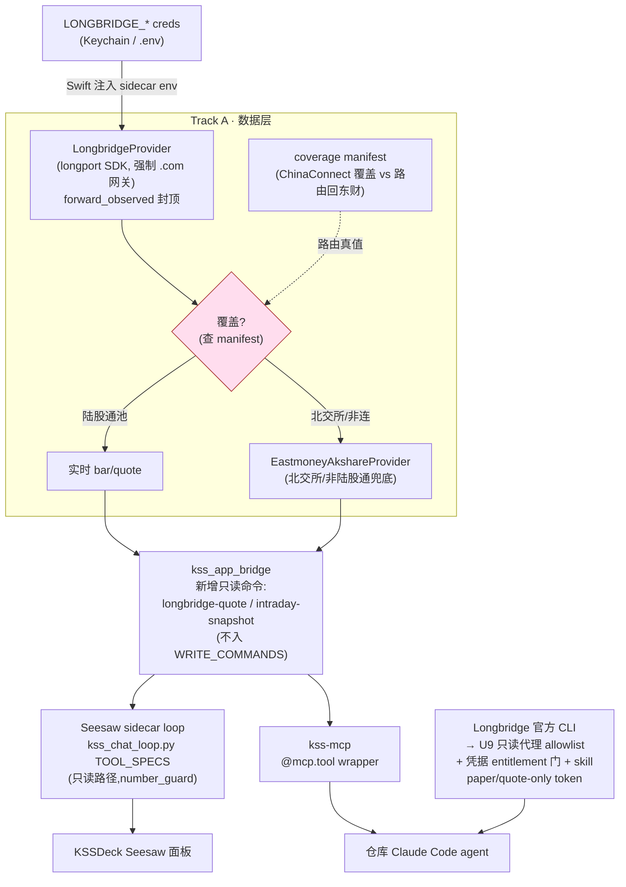

# feat: Longbridge 实时数据源 + Agent 能力面接入

## Summary

给 KSS 接 Longbridge OpenAPI 作为**前向实时数据源**,并把它的 **Agent 能力面(CLI + Skill + 只读工具)** 一并接入,补强两个消费方:

1. **Seesaw**(KSSDeck 内置 AI 复盘助手面板,plan #4)——sidecar 工具调用 loop 新增只读实时工具。
2. **仓库层 Claude Code agent**(kss-mcp + kss-review skill,终端复盘用)——新增 kss-mcp 只读工具 + Longbridge 官方 CLI + 一个 KSS 编写的复盘 skill。

架构杠杆:两个 agent 消费方**共享同一个 `kss_app_bridge` dispatch 面**。一个新的只读 bridge 命令(背后是 `LongbridgeProvider`)同时点亮 Seesaw loop、kss-mcp、直调三处,**零逻辑 fork**。交易面**绝不接入**,且分档运行时强制:Track A(bridge/loop/mcp)= by-construction(不入 `WRITE_COMMANDS`);Track B(原生 CLI)= 运行时只读代理 + 凭据 entitlement 门(U9)——skill 措辞拦不住原生二进制,须进程边界硬闸(doc-review 收敛)。

可行性已实测验证(见 origin)。Longbridge CN 行情权限 = ChinaConnect LV1 实时(实测科创/创业/沪深主板/ETF/指数全通),北交所不覆盖(路由回东财),SDK 默认 `.cn` 网关本机不可达、须强制走 `.com` 国际网关。

---

## Problem Frame

**现状断点**:KSS 分时数据层(PR #40)代码齐备(`IntradayProvider` 协议、`collect_intraday`、`intraday_store`),但唯一在产 provider `EastmoneyAkshareProvider` 的东财实时端点**本机直连/代理均不通**,live 采集空转。Seesaw 与仓库 agent 因此只能答日线/存量,答不了「此刻盘面」。

**要解的**:接一个**可达的、带鉴权的**前向实时源,让两个 agent 消费方都能在复盘时取到当日实时(接受延迟)行情,且不破 KSS 的三条硬纪律——PIT 红线、数字纪律、无个性化交易建议。

**为什么是 Longbridge**:云端网关(`.com` 可达)+ 官方 Python SDK(`longport`)+ Agent 原生 CLI(130+ 命令,JSON 输出)+ 目录式 Skill + 托管 MCP。既能当 KSS 数据层的 provider(Track A),又能当 agent 直接调用的能力面(Track B)。

---

## Requirements

- **R1** `LongbridgeProvider` 实现 `IntradayProvider` 协议,经官方 SDK 取实时快照 + 分钟 bar;强制 `.com` 国际网关;凭据从环境读;取数失败不抛(返回带 `error` 的 `FetchResult`)。
- **R2** eligibility 结构性封顶 `forward_observed`——`longbridge` 进 `FORWARD_ONLY_PROVIDERS`,永不 PIT、永不历史回填(PIT 红线)。
- **R3** 覆盖边界确定性路由:ChinaConnect 覆盖池内标的走 Longbridge,北交所 + 非陆股通标的走东财;路由真值来自一份实测生成的 coverage manifest。
- **R4** `collect_intraday` / `probe_intraday_provider` 支持 provider 选择 + longbridge↔eastmoney 兜底。
- **R5** 新增只读 bridge 命令(`longbridge-quote` / `intraday-snapshot`),经 `kss_app_bridge.dispatch`,**不入 `WRITE_COMMANDS`**;金融数字由代码渲染。
- **R6** Seesaw loop 暴露上述工具:`kss_chat_loop.py` `TOOL_SPECS` 新增 `_spec(...)`,走只读路径;系统提示补「实时 vs 存量」用法。
- **R7** 凭据打通:`LONGBRIDGE_APP_KEY/SECRET/ACCESS_TOKEN` 进 `KeychainStore.managedKeys` + NetworkSettingsView 输入项,注入 sidecar env;dev `.env` 回退同步。
- **R8** kss-mcp 暴露同款只读工具(`@mcp.tool` wrapper),供仓库 Claude Code agent 使用。
- **R9** Track B agent 能力面:装 Longbridge 官方 CLI + 编写 KSS 复盘 skill,**只映射只读子命令**,硬禁交易;OAuth 登录 + paper 账户兜底写进 runbook。
- **R10** 交易面绝不接入,且**运行时强制**(非仅文档):Track A 靠不入 `WRITE_COMMANDS`(by-construction);Track B 靠 U9 的只读 CLI 代理 allowlist + 凭据 entitlement 门(带交易 scope 即拒启);paper/quote-only token 为跨面凭据层兜底。

---

## Key Technical Decisions

- **KTD1 国际网关强制(实测阻塞)**。SDK 默认 `openapi.longport.cn` 本机直连与走 Clash 代理均 `000` 失败;`openapi.longportapp.com` 直连正常。`LongbridgeProvider` **自身**在 `__init__` 里固化三个 env(`LONGPORT_HTTP_URL` / `LONGPORT_QUOTE_WS_URL` / `LONGPORT_TRADE_WS_URL` 指向 `.com`),不劳用户填——模式对齐既有 `EastmoneyAkshareProvider._bypass_system_proxy`。不设=复现东财同款不可达。
- **KTD2 PIT 红线**。`longbridge` 加入 `kss/data/intraday_client.py:FORWARD_ONLY_PROVIDERS`,`classify_eligibility` 确定性封顶 `forward_observed`。券商实时推送本就不是 PIT 源;历史仍归 Tushare。
- **KTD3 只读、无交易——两档强度(doc-review 修订)**。安全等级按面**分档,不可混称**:
  - **Track A(bridge / Seesaw loop / kss-mcp)= by-construction(强)**。read/write 之别 = 是否在 `kss_app_bridge.py:3316 WRITE_COMMANDS`;Longbridge 命令**不加入**该集合 ⇒ 自动走受限只读 call(`_make_read_only_call`,碰写即 `PermissionError`)。数字纪律由既有 `number_guard`(`kss_chat_loop.py:207`)天然覆盖。
  - **Track B(官方 CLI)= by-convention + 运行时硬闸(见 U9)**。CLI 是原生二进制(130+ 命令,含 buy/sell/cancel/replace),skill 只**描述**该用哪个子命令,**拦不住** agent 直接敲交易命令——它根本不经 bridge,`WRITE_COMMANDS` 对它无效。**内部张力(security-lens 指出)**:计划正因「Claude Code 难按工具粒度过滤交易工具」而 defer 托管 MCP,而 CLI 有**同款不可过滤的交易面**。故 Track B 的只读**不能靠 skill 措辞**,须 U9 的**运行时 allowlist 代理**(agent 只可调 KSS 代理脚本、不可调裸 `longbridge`;代理硬拒非白名单子命令)。
  - **凭据层兜底(KTD7)= 唯一跨所有面的强边界**。paper / quote-only 账户使交易在 API 层不可能,无论哪个面持有它。这不是「二次兜底」,对 Track B 是**主要运行时保护**之一。
- **KTD4 共享 bridge 面零 fork**。Seesaw loop(`TOOL_SPECS`)与 kss-mcp(`@mcp.tool`)是**两个独立注册表、同一个 `bridge.dispatch` 命令面**。一个只读命令写一次,两处各加一行薄 wrapper 即全点亮。
- **KTD5 覆盖边界 = coverage manifest**。ChinaConnect LV1 覆盖陆股通池;北交所(`.BJ`)+ 非陆股通标的无返回。U2 实测扫 KSS 全池生成 manifest(covered / route-to-eastmoney),作为 U3 路由与 U4 命令的确定性真值,不靠临场猜。
- **KTD6 provider 选择 + 诚实的降级语义(doc-review 修订)**。Longbridge 为主源;`collect_intraday` 的 provider 选择显式化(现 `scripts/collect_intraday.py:710` 硬编码 `EastmoneyAkshareProvider()`;注:`scripts/probe_intraday_provider.py` 已有 `--provider`,只需加 `longbridge` 选项)。**关键诚实(adversarial 指出)**:东财备源在本机(Clash)**当前不可达**——正是本计划 Problem Frame 的断点。所以 KTD6 的「兜底」在此环境**是名义的**:covered 标的的 Longbridge 失败(token 过期/限流/manifest 陈旧)会降级到**不可达的东财 = 无数据**(而非静默错数据);北交所「恒路由东财」= **今天没有可用实时路径**。故北交所实时**明确标记为当前不可用**,不是「有兜底」。修复东财可达性是独立议题,不属本计划。

- **KTD7 凭据 entitlement 门(新增,security + adversarial 收敛)**。凭据加载时**探一次账户交易 entitlement**(SDK/CLI 登录本就打印权限表):token 带任何交易 scope ⇒ **拒启 Track B**(或高噪告警)。文档硬性规定只许 paper / quote-only token。这把「read-only」从「paper 账户运气」升级为**可核前置条件**。见 U9。

---

## High-Level Technical Design

三条数据纪律的落点:**PIT 红线** 在 `prov`(eligibility 封顶),**数字纪律** 在 `loop`(number_guard + 代码渲染),**无交易** 在 `cmd`(不入 WRITE_COMMANDS,by-construction)与 `cli`(U9 运行时只读代理 + entitlement 门,非仅 skill 措辞)。

---

## Implementation Units

### U1. `LongbridgeProvider`(SDK · 强制 .com 网关 · 前向-only)

- **Goal**:新增经官方 `longport` SDK 的前向实时 provider,实现 `IntradayProvider` 协议。
- **Requirements**:R1, R2, KTD1, KTD2。
- **Dependencies**:无(foundation)。
- **Files**:
  - `kss/data/intraday_client.py`(新增 `LongbridgeProvider` 类;`FORWARD_ONLY_PROVIDERS` 加 `"longbridge"`;`__all__` 补出)
  - `kss/tests/test_intraday_client.py`(新增用例)
  - `pyproject.toml`(加 `longport` 依赖)
- **Approach**:
  - `name = "longbridge"`(须与 `FORWARD_ONLY_PROVIDERS` 条目及 route 令牌逐字一致)。
  - `__init__` 固化 `.com` 三网关 env(KTD1),读 `LONGBRIDGE_APP_KEY/SECRET/ACCESS_TOKEN` 构造 `Config.from_apikey(...)` + `QuoteContext`。**网关-honoring 已实测证实(feasibility/adversarial 关注点已解)**:origin 探针即用 `Config.from_apikey` + `os.environ` 设 `LONGPORT_*` → 命中 `.com` 返回真数据(**非** `from_env`,复述有误)。仍加一条 U1 断言测试:构造后的 context 解析到 `.com` host,防 SDK 版本漂移回退 `.cn`。
  - `fetch_bars` 用 `ctx.candlesticks(symbol, Period.Min_1, count, AdjustType.NoAdjust)`;新增 `fetch_quote`(快照)用 `ctx.quote([...])`。产物归一化到既有 `FetchResult`(保留原始列 + `source_asof_ts` 取最晚 bar 时间)。
  - 失败全吞为 `error`(数据层契约,不抛);建连失败(可达性/鉴权)也走 `error`。**凭据脱敏(security-lens P2)**:SDK 异常**不得原样入 `error`**——SDK 认证异常/签名 URL 常回显 token/secret,原样落 `error` 会经 `intraday_observability` 与 Seesaw loop 进 LLM 上下文(**发到本机外**)。归一为安全类目串(`auth_failed`/`unreachable`/`empty`),并加测试断言 `error`/observability 输出里**不含任何** `LONGBRIDGE_*`/`LONGPORT_*` 值。
  - `capability()` 复用 `classify_eligibility(self.name, reachable=...)` ⇒ 恒 `forward_observed`;`notes` 标「ChinaConnect LV1 / 强制 .com 网关 / 前向-only」。
- **Patterns to follow**:`EastmoneyAkshareProvider`(同文件,`_bypass_system_proxy` / `fetch_bars` / `capability` 全套结构照抄)。
- **Test scenarios**:
  - `classify_eligibility("longbridge", reachable=True)` 返回 `forward_observed`(红线钉死)。
  - `LongbridgeProvider` 满足 `IntradayProvider` 协议(`isinstance` runtime_checkable)。
  - `__init__` 后三个 `LONGPORT_*` env 已被设成 `.com`(monkeypatch os.environ 断言)。
  - 缺凭据 / 建连异常 → `fetch_bars` 返回 `ok=False` 且 `error` 非空、**不抛**。
  - **凭据脱敏**:构造一个异常文本内含假 token 串 → `FetchResult.error` 归一为安全类目、**不含**该 token 子串(security-lens P2)。
  - SDK 返回空 df → `FetchResult` 空行 + `error="empty response"`。
  - happy path 用 fake `QuoteContext`(monkeypatch)喂 5 根 bar → `rows` 长度 5、`source_asof_ts` = 最晚 bar。
- **Execution note**:SDK 调用面 mock 掉,单测不打真网(遵 AGENTS.md 测试规范:数据层测试不依赖外部 API)。

### U2. 覆盖扫描 + 路由 manifest(ChinaConnect 边界)

- **Goal**:实测扫 KSS 全标的池,产出「Longbridge 覆盖 / 路由回东财」的确定性 manifest。
- **Requirements**:R3, KTD5。
- **Dependencies**:U1。
- **Files**:
  - `scripts/probe_longbridge_coverage.py`(新;一次性/可复跑探针,读全池 → 逐标的 `fetch_quote` → 记 covered/uncovered)
  - `kss/data/longbridge_coverage.py`(新;加载 manifest + `route_provider(symbol) -> "longbridge"|"eastmoney"` 纯函数)
  - `kss/tests/test_longbridge_coverage.py`(新)
  - 产物 manifest 落 state(路径复用 `INTRADAY_DB` 同级或 `kss/data/` 静态 JSON,实现期定)
- **Approach**:北交所(`.BJ`)静态直接归东财(实测无返回,无需逐个探);沪深科创创业 ETF 指数逐标的探,非陆股通标的记入 route-to-eastmoney。`route_provider` 是确定性查表纯函数(便于 U3 钉死)。
  - **manifest 带扫描日 + 再扫周期(adversarial P2)**:ChinaConnect 资格季度调整,一次性快照会陈旧——covered 标的丢资格后仍路由 Longbridge → 空 → 落不可达东财 = 静默无数据。故 manifest 记 `scanned_at`,定再扫周期(或对齐陆股通调整日);U3 把「covered 标的连续空响应」当**陈旧信号**而非纯瞬态错误。
  - **密钥卫生(security-lens P2)**:探针**只从 env 读** `LONGBRIDGE_*`,**绝不 inline**;manifest 产物**不含任何凭据**;源凭据文件(`~/Downloads/SEC/LongbridgeAPI.md` 类)**永在 repo 外**。建议加 pre-commit 对 `LONGBRIDGE_`/`LONGPORT_` token 模式的 secret 扫描(补既有 `.env`/`secrets/` gitignore)。
- **Patterns to follow**:`scripts/probe_intraday_provider.py`(探针结构 + `DEFAULT_PROBE_UNIVERSE`)。
- **Test scenarios**:
  - `route_provider("830799.BJ")` → `"eastmoney"`(北交所静态规则)。
  - `route_provider("688008.SH")` 命中覆盖 manifest → `"longbridge"`。
  - manifest 缺失/未扫标的 → 保守回退 `"eastmoney"`(fail-safe,不因漏扫误判有实时)。
- **Execution note**:探针脚本会打真网(需凭据),但 `route_provider` 单测喂固定 manifest 不打网。coverage sweep 本身是运维动作,非 CI。

### U3. provider 选择 + 兜底(collect / probe)

- **Goal**:采集与探针链支持 provider 选择,longbridge↔eastmoney 按 manifest 路由 + 兜底。
- **Requirements**:R4, KTD6。
- **Dependencies**:U1, U2。
- **Files**:
  - `scripts/collect_intraday.py`(`--provider {eastmoney_akshare,longbridge,auto}`——令牌**逐字对齐 `provider.name`**,`auto` 走 `route_provider`;替换 `main()` 里硬编码 `EastmoneyAkshareProvider()` at line 710)
  - `scripts/probe_intraday_provider.py`(**已有 `--provider`**,现仅 `eastmoney_akshare` 一选项;**加 `longbridge` 选项**即可,非从零加参数——feasibility 更正)
  - `kss/tests/test_intraday_collector.py`(补 provider 选择用例)
- **Approach**:`--provider auto` 时按标的查 `route_provider` 分流(返回 `"longbridge"`/`"eastmoney_akshare"`,与 `FORWARD_ONLY_PROVIDERS` 键一致,避免 eligibility 漏判);单源失败降级到备源并记 observability(复用既有 `intraday_observability`)。
- **Patterns to follow**:现有 `build_argparser` / `main` 结构;`collect_watch` / `collect_close` 签名已收 `provider` 参数,只改实例化与分流。
- **Test scenarios**:
  - `--provider longbridge` 实例化 `LongbridgeProvider`;`--provider eastmoney_akshare` 保持旧行为(回归)。
  - `--provider auto` 对北交所标的选东财、对科创标的选 longbridge(mock `route_provider`)。
  - 主源 `fetch_bars` 返回 error → 降级备源被调用(mock 两 provider 断言调用序)。
- **Execution note**:先补一条 `--provider eastmoney` 的 characterization 断言,确保重构不改既有默认行为。

### U4. 只读 bridge 命令(共享面)

- **Goal**:新增 `longbridge-quote` / `intraday-snapshot` 只读命令,经 `bridge.dispatch`,金融数字代码渲染。
- **Requirements**:R5, KTD3, KTD4。
- **Dependencies**:U1, U2。
- **Files**:
  - `scripts/kss_app_bridge.py`(`COMMANDS` 元数据加两条 at ~line 3327;`dispatch` if-chain 加两分支 at ~line 3507;**不动** `WRITE_COMMANDS`)
  - `kss/tests/test_bridge_*.py`(命令注册 + 只读性 + 漂移守卫)
- **Approach**:命令内部 `route_provider` 选源 → 取快照/最新 bar → 返回结构化 dict(数字为真值字段,供上层 verbatim 引用)。
  - **能力错配处理(feasibility P2)**:`EastmoneyAkshareProvider` **只有 `fetch_bars`、无 `fetch_quote`**。故 `longbridge-quote` 对**东财路由(非陆股通/北交所)标的返回结构化 `error`**(明说「该标的无实时快照」),快照能力**只保留给 covered 标的**;`intraday-snapshot`(基于 bar)才是东财可服务的路径。
  - `intraday-snapshot` 复用 `intraday_store` 已有 bar 或直取——**具体走哪条见 OQ2**;OQ2 未决前,U5/U7 的「两工具」wrapper 数是暂定,若最终收敛为单命令带 `mode` 参,U5/U7 应只注册一个工具(scope-guardian)。
- **Patterns to follow**:`get-discovery-candidates` / `perilla-enrichment` 等既有只读命令(同 dispatch if-chain);数字渲染遵 `sector-truth-source-split` 记忆的「真值代码追加」纪律。
- **Test scenarios**:
  - `dispatch("longbridge-quote", ["688008.SH"])` 返回含数字字段的 dict(mock provider)。
  - 两新命令均 `∉ WRITE_COMMANDS` ⇒ 经 `_make_read_only_call` 不 raise(只读性钉死)。
  - 漂移守卫:dispatch 新增分支命令 ⊆ `COMMANDS`(既有 `test_bridge_orientation` 断言不挂)。
  - 未知/停牌标的 → 返回带 `error` 的结构,不抛。
- **Execution note**:数字纪律关键——命令必须返回**真值字段**而非拼好的自然语言,让 loop 的 `number_guard` 能核。

### U5. Seesaw loop 暴露 Longbridge 工具

- **Goal**:Seesaw sidecar loop 能调用两个新只读工具;系统提示补实时用法。
- **Requirements**:R6, KTD3, KTD4。
- **Dependencies**:U4。
- **Files**:
  - `scripts/kss_chat_loop.py`(`TOOL_SPECS` 加两条 `_spec(...)` at ~line 71,`command` 指向 U4 命令)
  - `kss/config/chat_system_prompt.md`(补:何时用实时 vs 存量;实时为 forward_observed、非 PIT;北交所无实时)
  - `kss/tests/test_chat_loop*.py`(工具 schema + resolve + 只读路径)
- **Approach**:`_spec("longbridge_quote", "longbridge-quote", "实时快照(ChinaConnect LV1,接受延迟)。symbol 如 688008.SH", {"symbol": _STR}, ["symbol"])` 一行即注册;`build_tools_schema` / `resolve_tool` 自动纳入;因 `command ∉ WRITE_COMMANDS` 自动走只读 call。
- **Patterns to follow**:`_spec("get_stock", "stock", ...)`(同文件既有只读工具,逐字对照)。
- **Test scenarios**:
  - `build_tools_schema()` 输出含 `longbridge_quote`,params schema 正确。
  - `resolve_tool("longbridge_quote", {"symbol":"688008.SH"})` → `("longbridge-quote", ["688008.SH"])`。
  - `is_write_command("longbridge-quote")` 为 `False`(经只读路径)。
  - `_exec_tool` 走 `read_call` 分支(mock,断言不触 `request_write`)。
- **Execution note**:纯只读工具,`Test expectation` 覆盖 schema/resolve/只读分支即可,无需写闸用例。

### U6. 凭据打通(Swift Keychain + 设置面板 + sidecar env)

- **Goal**:用户在 Seesaw 设置里填 Longbridge 三凭据,注入 sidecar,provider 读到。
- **Requirements**:R7, KTD1。
- **Dependencies**:U1(消费者)。
- **Files**:
  - `Sources/KSSDesktop/Services/KeychainStore.swift`(`managedKeys` 加 `LONGBRIDGE_APP_KEY/SECRET/ACCESS_TOKEN` at ~line 12)
  - `Sources/KSSDesktop/Views/NetworkSettingsView.swift`(Seesaw 段加三个 `SecureField` + save/load,at ~line 98-118)
  - `scripts/kss_app_bridge.py`(`_load_project_env` 的 `allowed` 集加三键 at ~line 674,dev `.env` 回退)
  - `kss/tests/test_*bridge*env*.py`(`.env` 回退加载新键)
- **Approach**:纯凭据管道,复用 `TUSHARE_TOKEN` 既有存取/注入路径(`injectedEnvironment()` → `BridgeClient` spawn env)。`.com` 网关不走用户输入(provider 内部固化,KTD1)。
- **Patterns to follow**:`NetworkSettingsView` 里 `tushareToken` 的 SecureField + Keychain 存取整套。
- **Test scenarios**:
  - `_load_project_env` 能从 `.env` 读出三个 `LONGBRIDGE_*`(Python 侧,`tmp_path` + monkeypatch)。
  - Swift:`Test expectation: none -- 凭据管道无业务逻辑;正确性靠既有 Keychain 存取路径 + U8 真机 smoke`(CLT 无 XCTest,`swift build` 过即可,见 desktop 记忆)。
- **Execution note**:偏配置/管道;首选 `swift build` + 真机填凭据 smoke,不强求单测。

### U7. kss-mcp 暴露只读工具(仓库 Claude Code agent)

- **Goal**:仓库层 Claude Code agent 经 kss-mcp 也能取 Longbridge 实时。
- **Requirements**:R8, KTD4。
- **Dependencies**:U4。
- **Files**:
  - `scripts/kss_mcp.py`(加两个 `@mcp.tool` 读工具,funnel 经 `_call` → 同 U4 bridge 命令)
  - `kss/tests/test_bridge_data_catalog.py` 或对应 mcp 测试(工具可见性)
- **Approach**:与既有 `get_stock` 等 `@mcp.tool` 逐字同构,ungated(读)。因是独立注册表(Explore 已确认),须显式加,不自动继承。
- **Patterns to follow**:`scripts/kss_mcp.py` 既有 `@mcp.tool def get_stock(...)`。
- **Test scenarios**:
  - 新工具注册进 mcp、经 `_call` 命中 U4 命令(mock `bridge.dispatch`)。
  - 无 `KSS_MCP_LIVE` 下工具仍可用(读工具 ungated)。
- **Execution note**:纯 wrapper;工具目录里补 `get_data_catalog` 描述保持一致。

### U8. Longbridge 官方 CLI + KSS 复盘 skill(Track B 能力面)

- **Goal**:仓库 Claude Code agent 具备 Longbridge 原生 CLI 能力,经一个 KSS skill 规范「何时/如何」用,硬禁交易。
- **Requirements**:R9, R10, KTD3, KTD7。
- **Dependencies**:**U9(只读硬闸,必须先落)**;**门控在 Track A 交付之后 + 一次 OAuth-host 可达性 smoke 通过**(adversarial:不与 U4/U7 并列——Track B 同时背着写泄漏面 + 唯一完全未验的 OAuth-under-Clash 依赖,先上已验证的只读数据面,再准入 CLI 能力面)。
- **与 U7 的分工(scope-guardian)**:U7(kss-mcp)给仓库 agent 的是**KSS 存量 + 共享 bridge 的只读实时**;U8 的增量是**官方 CLI 的原生更广面**(未来 deferred 的 145-工具广度接口)+ 兑现用户显式点名的「CLI 和 Skill」。两者不是冗余,是不同能力面。
- **Files**:
  - `.claude/skills/longbridge-realtime/SKILL.md`(新;或扩 `.claude/skills/kss-review/SKILL.md`——见 OQ1)
  - `docs/solutions/longbridge_cli_setup.md`(新;安装 + `longbridge auth login` OAuth + paper/quote-only 前置 + 只读命令清单 + 撤销 runbook)
- **Approach**:skill 描述触发场景(复盘时要「此刻」价/量)→ 映射到 CLI **只读**子命令(**仅 `quote` / `kline`**;**去掉「基本面读」**——基本面在 Deferred,不在本计划范围,scope-guardian),**显式列出禁用命令**(`buy`/`sell`/`cancel`/`replace`);说明实时=forward_observed、北交所无实时、优先 kss-mcp 存量 + Longbridge 补实时。**skill 措辞不是控制**——真正拦截交易的是 U9 的运行时代理(KTD3)。安装与 OAuth 走 runbook,不硬编码凭据;**OAuth smoke 必须探真实授权 host**(非 quote 网关——adversarial:401 只证了行情网关 host,授权走不同域,Clash 下可能被墙)。
- **Patterns to follow**:`.claude/skills/kss-review/SKILL.md`(既有复盘 skill 结构 + kss-mcp 优先纪律);AGENTS.md「数字纪律」段(operator/explainer 非 decider)。
- **Test scenarios**:`Test expectation: none -- skill/runbook 为文档产物,无可执行逻辑;正确性靠 review(skill 触发面 + 禁交易清单完整性)+ U8 真机 CLI smoke(装 → auth → 一条 quote → 确认无交易子命令被 wrap)`。
- **Execution note**:先落 runbook 跑通「装 → OAuth → 一条只读 quote」真机 smoke,再写 skill 映射;交易子命令绝不进 skill(review 硬检)。

### U9. Track B 只读硬闸(CLI 代理 allowlist + 凭据 entitlement 门)

- **Goal**:把 Track B 的「只读」从**文档约定**升级为**运行时强制**——agent 无法经 CLI 触发任何交易,即便被注入。
- **Requirements**:R10, KTD3, KTD7。
- **Dependencies**:无(是 U8 的前置)。
- **Files**:
  - `scripts/longbridge_ro.py`(新;KSS 控制的薄代理:仅放行只读子命令 allowlist `{quote, kline, static-info}`,其余一律拒;symbol 以 argv 传、按 `NNNNNN.(SH|SZ|BJ)` 校验,**绝不 shell 插值**)
  - `.claude/settings.json` 或 skill 内 Bash 约束(agent 只可调 `scripts/longbridge_ro.py`,**不可调裸 `longbridge` 二进制**)
  - 凭据 entitlement 门:接 U6 凭据加载路径,加载时探账户交易 scope,**带交易 scope 即拒启 Track B / 高噪告警**(KTD7)
  - `kss/tests/test_longbridge_ro.py`(新)
- **Approach**:security-lens/adversarial 收敛结论——skill 措辞拦不住原生 CLI,须 KSS 掌控的进程边界。代理是唯一入口,白名单硬编码,交易子命令直接 `exit(非零)`。entitlement 门把 paper/quote-only 从「运气」变「可核前置条件」。
- **Patterns to follow**:`kss_mcp.py` 的 `_LIVE` 启动读一次不重读(KTD5 式反中途翻转);`kss_app_bridge` 的 `_make_read_only_call` 拒写思路。
- **Test scenarios**:
  - 代理收到 `buy`/`sell`/`cancel`/`replace` → 非零退出、不执行(注入防线钉死)。
  - 代理收到 `quote 688008.SH` → 放行。
  - symbol 含 shell 元字符/不匹配 `NNNNNN.(SH|SZ|BJ)` → 拒(注入/命令拼接防线)。
  - 凭据探测返回带交易 scope → Track B 启动被拒(mock entitlement 响应)。
- **Execution note**:先写代理 + 交易拒绝用例(红线),再接 U8 skill 指向代理。

---

## Scope Boundaries

**In scope**:沪深/科创/创业 的 Longbridge 只读实时(快照 + 分钟 bar)接入数据层;Seesaw loop 工具;kss-mcp 工具;仓库 agent 的官方 CLI + KSS skill。全链只读。

### Deferred to Follow-Up Work
- Longbridge 托管 MCP(`mcp.longbridge.com`,145 工具)接进 `.mcp.json`——因含交易工具、Claude Code 难按工具粒度过滤,先用 CLI+skill 的可控只读面;待官方支持只读 scope 或本地 MCP 代理过滤再评估。
- `access_token` 自动刷新守护(SDK 有 `refresh_access_token`;当前 token `exp≈2026`,先手动续)。
- Longbridge 基本面/筛选器/日历等 145-工具广度;期权/权证。
- 盘中真延迟的常态化监控看板(本计划只做一次性实测,见 Verification)。

### Outside this product's identity(永不)
- 下单/撤单/改单等**交易执行**(buy/sell/cancel/replace)——KSS 是 operator/explainer,非 decider(数字纪律)。
- 北交所经 Longbridge 取实时——ChinaConnect 不覆盖,恒路由东财。
- 用 Longbridge 做历史回填或任何 PIT 回测准入——前向-only 红线(KTD2)。

---

## Risks & Mitigations

| 风险 | 影响 | 缓解 |
|---|---|---|
| CLI OAuth **授权 host** 在 Clash 下可达性未验 | Track B 接不上 | U8 smoke **专探授权 host**——`.com` 的 401 只证了 quote 网关 host,OAuth 走**不同域**,不可外推(adversarial);验后再推 |
| `access_token` 有效期已**钉死 2026-10-05 16:09 UTC**(90 天窗,iat 2026-07-07),自动刷新 deferred | 到期后**静默永久降级**(失败被吞为 `error`) | 计划体已 pin 精确 exp;U1 加**过期告警观测信号**——区分 auth-过期 `error` 与瞬态可达性 `error`,让静默过期浮出(adversarial P1) |
| 东财备源本机不可达 ⇒ KTD6「兜底」名义化 | covered 失败/北交所 = 无数据 | KTD6 已诚实标注:降级到**无数据非错数据**;北交所实时**当前不可用**;修东财可达性属独立议题 |
| ChinaConnect 资格季度调整,manifest 陈旧 | covered 标的丢资格 → 空 → 落不可达东财 = 静默无数据 | manifest 带 `scanned_at` + 再扫周期;covered 连续空 = 陈旧信号(U2/adversarial) |
| 盘中真实延迟未测(实测是收盘态) | 延迟大小未知 | Verification 盘中重跑探针;即便延迟,用户已接受 |
| `longport` 版本未 pin + 长桥/longport 品牌迁移期文档打架 | API 面(`from_apikey`/`candlesticks`/`quote`)漂移 | pyproject pin 版本;U1 断言 `.com` host + 协议一致性 |
| 凭据经 `error`/observability 泄漏进 LLM 上下文(发本机外) | token/secret 外泄 | U1 SDK 异常归一为安全类目串 + 测试断言无 `LONGBRIDGE_*`/`LONGPORT_*`(security-lens) |
| paper 账户 entitlement 持久性未验 / 误填 live token | Track B 软闸全变承重,一条误令中实盘 | U9 凭据 entitlement 门:带交易 scope 即拒启;paper/quote-only 硬性前置(security-lens P1) |

---

## Open Questions

- **OQ1**(实现期定):Track B 用**扩 `kss-review` skill** 还是**新建 `longbridge-realtime` skill**?倾向新建(职责单一 + 禁交易清单集中),但若 kss-review 已有实时段落则就地扩。
- **OQ2**(实现期定):`intraday-snapshot` 命令取数走**实时直取**还是**读 `intraday_store` 已落 bar**?直取更新鲜、读库更省额度且可离线;可能都要(参数切)。
- **OQ3**(执行期):`access_token` 刷新——U1 是否顺手接 SDK `refresh_access_token` 的被动刷新(不主动续),还是纯手动?建议 U1 只做「失败即 error」,刷新 deferred;刷新落地时新 token 须回 Keychain/secrets,**不落 log/明文**(security-lens)。
- **OQ4**(强,决策期先查):Longbridge OAuth/entitlement 是否支持 **market-data-only scope / quote-only token**?若支持,**这是最强的跨面写安全边界**——交易在 API 层对所有面(bridge/loop/mcp/CLI)不可能,U9 的代理与 entitlement 门降为纵深防御而非唯一硬闸。查到即优先用此凭据(adversarial/security 收敛)。
- **OQ5**(简化权衡):coverage manifest(U2)相对「静态北交所规则 + U3 兜底」是否值得?倾向保留——manifest 给覆盖真值 + 陈旧检测(季度调整),静态规则给不了;但若非陆股通非 BJ 集很小,可退成静态规则 + U3 兜底吸收缺口(scope-guardian)。

---

## Verification（跨单元）

- **数据层**:U1-U3 单测全绿(mock SDK,不打网);`pytest kss/tests/ -q` 无回归。
- **共享面**:U4 只读性 + 漂移守卫断言通过;`longbridge-quote` 不在 `WRITE_COMMANDS`。
- **Seesaw**:U5 `build_tools_schema`/`resolve_tool` 用例过;真机——Seesaw 面板问「688008 现在多少」能经工具取实时并 verbatim 呈现,`number_guard` 无告警。
- **仓库 agent**:U7 mcp 工具可见;终端 Claude Code 经 kss-mcp 取到实时。
- **Track B**:U8 真机 smoke——装 CLI → `longbridge auth login` → 一条只读 `quote` 成功;确认 skill 未 wrap 任何交易子命令。
- **一次性实测(补 origin 遗留)**:盘中(9:30–15:00)重跑 `scripts/probe_longbridge_coverage.py`,量真实延迟;跑全池 coverage sweep 定 manifest。

## Definition of Done

R1–R10 全部满足;PIT 封顶 + number_guard 可静态论证,Track A 无交易命令(by-construction)、Track B 只读代理拒交易 + entitlement 门拒非 paper token 均有测试;两个 agent 消费方均能取只读实时;coverage manifest 带 `scanned_at` 生成,北交所**明确标记当前无实时路径**(非「有兜底」);token exp(2026-10-05)有过期告警信号;盘中延迟已实测记录;凭据脱敏测试通过;origin 可行性备忘归档为 `docs/solutions/` 经验条目。

---

## Sources & Research

- Origin 可行性备忘(含实测):`docs/brainstorms/2026-07-08-longbridge-rt-data-feasibility.md`
- 现有数据层:`kss/data/intraday_client.py`(`IntradayProvider` / `FORWARD_ONLY_PROVIDERS` / `classify_eligibility`)、`scripts/collect_intraday.py:710`、`scripts/probe_intraday_provider.py:308`
- Seesaw loop 架构(plan #4):`scripts/kss_chat_loop.py`(`TOOL_SPECS`/`_spec`/`build_tools_schema`/`resolve_tool`)、`scripts/kss_sidecar.py`、`kss/llm/chat_client.py`、写闸 `WRITE_COMMANDS`@`scripts/kss_app_bridge.py:3316`
- 凭据链:`Sources/KSSDesktop/Services/KeychainStore.swift:12`、`Sources/KSSDesktop/Views/NetworkSettingsView.swift`、`scripts/kss_app_bridge.py:_load_project_env`
- 共享面/kss-mcp:`scripts/kss_mcp.py`、`.mcp.json`、`docs/plans/2026-06-22-004-feat-kssdeck-agent-panel-plan.md`
- Longbridge 外部:[OpenAPI 文档](https://open.longbridge.com/docs) · [CLI](https://open.longbridge.com/docs/cli) · [MCP](https://open.longbridge.com/docs/mcp) · [longbridge-terminal](https://github.com/longbridge/longbridge-terminal) · [longport PyPI](https://pypi.org/project/longport/)
