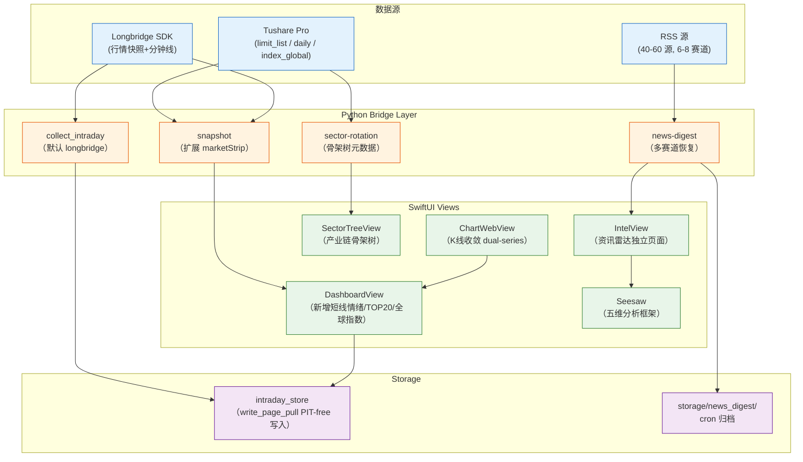

# Vibe-Research 四模块全量引入 + Longbridge 替代东财采集 - Plan

## Goal Capsule

- **Objective:** 将 Vibe-Research 的资讯雷达、每日复盘、板块中心和 AI 增强四个模块的
  展示与交互设计引入 KSSDeck，接线 KSS 既有数据源（Tushare / bridge dispatch /
  intraday_store），Longbridge 替代东财作为日内分钟数据采集源，R5 page-pull
  degrade 路径反转为真实写入 intraday_store。
- **Product authority:** 全量引入展示与交互，数据源使用 KSS（替换 Vibe-Research 的
  astock/gstock）；Longbridge 替代东财为前向实时采集主源；优先顺序 =
  资讯雷达 > 每日复盘 > 板块中心 > AI 增强；沿用 KSSDeck 现有设计系统（布局 / 组件 / 字体 / 动效）。
- **Open blockers:** 无——OQ3（Tushare 端点）已验证通过；OQ1/OQ2/OQ4 均为 Deferred to Implementation。
- **Product Contract preservation:** 不变（Product Contract 直出 ce-brainstorm + ce-doc-review 修订）

---

## Product Contract

### Summary

将 Vibe-Research 开源投研看板的资讯雷达、每日复盘、板块中心和 AI 增强四个模块，
经 KSSDeck 设计语言重表达——展示和交互参照 Vibe-Research，数据面从 KSS 既有源
（Tushare / bridge dispatch / intraday_store / 恢复后的 news-digest）重新接线。
Longbridge API 替代东财（eastmoney_akshare）为前向实时 + 盘后 cron 分钟线采集
主源，R5 page-pull 落盘降级路径反转为正式写入。所有新页面保持与 Dashboard 同一视觉
体系（M3 响应式栅格 + 8 套主题 token + KSS 动效曲线）。

### Problem Frame

KSSDeck 已建立扎实的数据骨架——Tushare 日线、板块轮动、主题龙头、ETF 雷达、
Seesaw 对话复盘、Longbridge 实时行情——但每个模块的**展示与交互深度**停留在
「数据表/原始 JSON 卡片」层面，未组织为**投研工作流形态**。用户今天要做多步操作
（先看板块、再看个股、再问 Seesaw）才能拼凑出一个完整的「今日盘面」画面。

Vibe-Research 则恰好在**展示与交互层**做到了这一点——一屏总览（每日复盘）、赛道
分组资讯提炼（资讯雷达）、产业链骨架导航（板块中心）、AI 五维分析框架——但它的
数据源（astock/gstock）和 KSS 的能力面重叠度很高，且 KSS 的 Tushare + Longbridge
在数据深度和覆盖面上更强。

两个系统的交集是「投研工作流」，差异在「数据面 vs 展示面」的分工。引入不是代码
移植，是**用 KSS 的数据底座 + Vibe-Research 的信息架构，产出 KSSDeck 原生页面**。

### Requirements

> 说明：需求中参考 Vibe-Research 的设计风格，但所有实现均使用 KSS 数据源（Tushare /
> bridge dispatch / intraday_store），不引入 Vibe-Research 的数据采集链。

**资讯雷达（独立页面 + Dashboard 摘要）**

- R1. KSSDeck 侧边栏新增"资讯雷达" workspace section，点击进入独立的 IntelView
  页面（参照 Vibe-Research 的 Intel 页面布局：12 赛道分组卡片 + 每赛道近期条目 +
  赛道 accent 色标）。
- R2. Dashboard 右上角（EditorialDateView 旁）新增资讯雷达摘要条带——显示当日
  有更新的赛道数量 + 最近 3 条资讯标题。
- R3. 资讯雷达的数据面从 KSS 既有 `news-digest` 模块升级而来——恢复 PR #46 的
  news-digest cron 采集链 + bridge 命令（`news-digest`），并扩展为多赛道 RSS
  源配置（当前 news-digest 只拉一批固定源，需扩展 `news_sources.json` 式的分组
  配置）。
- R4. 资讯雷达页面支持 AI 一键提炼"今日要点"——用户在页面点击触发，将当前赛道
  的资讯文本打包发送给 Seesaw LLM 做摘要提炼，返回结果渲染在页面顶部「今日要点」
  cards 中（不自动触发，避免 token 浪费）。
- R5. 资讯雷达页面加载时自动拉取最新资讯快照（bridge dispatch `news-digest`，
  含缓存 TTL），并在页面停留期间每 N 分钟定时刷新（复用 Dashboard U5 Timer 同一
  基础设施）。页面右上角显示与 Dashboard 同款的 RealtimeFreshnessBadge。

**每日复盘增强**

- R6. 每日复盘页（Dashboard）新增短线情绪模块——连板梯队（最高连板 / 每板股数）、
  封板率（涨停封板 / 开口板）、晋级率（昨日首板→今日连板比例）、炸板率。数据
  从 Tushare `stk_limit` / `limit_list` 接口拉取，通过 bridge dispatch `snapshot`
  命令的 `marketStrip` 扩展字段返回。
- R7. 每日复盘页新增全市场成交额 TOP20 表格——按成交额降序，展示 code / name /
  close / pct_change / volume / turnover。数据从 Tushare `daily` 接口按交易日
  排序取 top 20，bridge dispatch `snapshot` 扩展字段返回。
- R8. 每日复盘页新增全球隔夜指数条带——美股（道指 / 标普 / 纳指）+ 港股（恒指 /
  恒生科技），显示最新收盘价和涨跌幅。数据从 Tushare 国际指数接口拉取
  （若未覆盖则使用 yfinance 兜底）。

**板块中心增强**

- R9. 现有板块轮动页面（`sector-rotation` bridge 命令已服务 HotspotRotationView）
  新增产业链骨架树视图——按 Vibe-Research 的 `sectors.json` 结构，将板块按「上游
  原材料 → 中游制造 → 下游应用」三层骨架组织，每个节点展开显示当日资金净额和
  涨跌幅。
- R10. 产业链骨架树的板块资金数据从 KSS Tushare `moneyflow_ind_dc`（行业资金流）接口
  拉取——数据源已验证存在（`fetch_moneyflow_ind_dc` in `tushare_client.py`），但
  **尚未接入 `sector_rotation` 快照**。实现时通过新 bridge 命令或扩展现有
  `sector-rotation` 字段接入（当前 `hotspot_rotation.py` 只有 `pctChange` 和
  `flowPersistenceScore` 派生分值，无 raw net_amount / main_inflow / main_outflow）。

**AI 接入增强**

- R11. Seesaw 的 system prompt（`kss/config/chat_system_prompt.md`）嵌入
  Vibe-Research 的五维分析框架（估值 / 资金面 / 财报质量 / 行业景气 / 事件催化
  与风险），让 LLM 按框架组织回答——只规定「怎么读数据」、不做买卖建议。
- R12. kss-mcp 的 `get_data_catalog` 工具描述中补充五维分析框架的快照索引——
  让仓库 Claude Code agent 也能在复盘时按五维组织结论。

**Longbridge 替代东财采集 + R5 落盘反转**

- R13. `collect_intraday` 的默认 provider 从 `eastmoney_akshare` 切换为 `auto`
  （不影响 `--provider` 覆盖能力），cron 收盘采集 `run_collect_intraday.sh` 也切换。
  `auto` 模式通过 `_AutoRoutedProvider` 保持 Longbridge→东财运行时降级——
  標的不覆盖时路由回东财 + Longbridge 宕机时自动 fallback，不引入单源漏洞。
- R14. R5 page-pull 降级路径反转为真实写入——`write_page_pull()` 自动
  注册 instrument（只注册当日生效区间的占位映射，`active_from`=当日），再
  INSERT observation + blob（`eligibility=forward_observed`）。**
  不穿过 PIT ingest_run 的 eligibility 封装，但必须遵守 FK 约束。
- R15. 东财 `eastmoney_akshare` 从默认降级为 `auto` 模式内的运行时 fallback——
  代码保留，作为自动路由目标的备用（不可达 / 非陆股通标的 / Longbridge
  宕机时自动接入）。

**设计系统约束**

- R16. 所有新页面（IntelView、增强后的 Dashboard、SectorCenter）沿用 KSSDeck
  现有设计 token：M3 响应式栅格（24px margin / 20px gutter / 1040px
  maxContent）、8 套主题 KSSTheme（`theme.canvas` / `theme.surface` /
  `theme.accent` / `theme.textPrimary` / `theme.textSecondary` /
  `theme.signColor()` / `theme.chartSurface`）、SF Pro Text 字体层级
  （PageTitle / SectionHeader / 正文 13px / 辅助 12px / 标签 11px）、
  KSS 动效曲线（`theme.cardRadius` + `theme.hairline` stroke overlay）。

**分钟 K 线收敛（U3 重构）**

- R17. 现有分钟 K 线组件（U3 的 `ChartDataMode` SegmentedPicker 日线/1m/5m
  割裂形态）重构为**内置到同一页面**——上方日线蜡烛图（占 60% 高度）+
  下方分钟线子图（占 40% 高度），两个 lightweight-charts 实例通过
  `subscribeVisibleLogicalRangeChange` 同步水平滚动。用户不切模式即可同时
  看到日线趋势和今日分时。
- R18. 上方日线图保留完整功能（MA/BOLL/MACD + 成交量 + 指标）。下方分钟线图
  为独立 lightweight-charts 实例——只渲染 candlestick（无 MA/BOLL 叠加，
  分钟维度指标不稳定），颜色沿用涨红跌绿，时间轴同步日线主图滚动。
- R19. 分钟线图时间标签格式为 HH:MM，`timeVisible: true`。非交易时段自动
  隐藏子图（无 bar 数据时分钟线容器 collapse 到 0 高）。

### Key Decisions

- **资讯雷达 AI 提炼触发 = 用户手动点击。** cron 拉取资讯 → user 看到赛道摘要 →
  点击"AI 提炼今日要点"→ Seesaw LLM 生成摘要。不做 cron 自动提炼——token 成本
  × 108 源太高。
- **资讯源配置 = news_sources.json 分组结构（参照 Vibe-Research 12 赛道模型）。**
  KSS 现有 `news-digest` 的源配置在 `news_sources.json` 中扩展为 12 赛道分组
  （每个赛道有 `key` / `name` / `accent` / `sources[]`），不引入 Vibe-Research
  的 108 源全集——先精选 6-8 赛道 A 股/行业核心源（约 40-60 源），跑通后再扩展。
- **Longbridge 替代东财 = provider 切换 + 保留东财运行时 fallback。** 默认切为
  `auto`（`_AutoRoutedProvider` 按覆盖路由 Longbridge→东财），东财在
  `--provider eastmoney_akshare` 中保留为显式选项。Longbridge 宕机时不引入单源
  漏洞——`_AutoRoutedProvider` 保留 Longbridge→东财运行时降级。
- **页面设计 = KSS 原生 SwiftUI，不引入 Vibe-Research 的 React 技术栈。** 参照
  Vibe-Research 的信息架构和组件布局（GlassCard / PageHeader / AskAiButton /
  Disclaimer），用 KSS 现有的 SwiftUI 组件库重表达。
- **R5 落盘反转的写入路径独立于 PIT ingest_run。** 新增 `IntradayStore.write_page_pull`
  方法——直接 INSERT observation + blob，不经过 instrument registry /
  mapping 校验 / eligibility 封装（forward_observed 数据不参与 PIT 冻结）。
- **分钟 K 线收敛到 TradingView 主图内（非割裂 SegmentedPicker）。** U3 当前的
  "日线 | 1分钟 | 5分钟" SegmentedPicker 切换模式为过渡方案——最终形态是分钟 bar
  序列作为**内置子图**渲染在日线蜡烛图主图中，用户无需切模式即可同时看到日线
  趋势和今日分时走势。

### Scope Boundaries

**In scope**
- 资讯雷达独立页面 + Dashboard 摘要 + AI 提炼
- 每日复盘新增短线情绪 / 成交额 TOP20 / 全球隔夜指数
- 板块中心新增产业链骨架树
- AI 五维分析框架嵌入 Seesaw + kss-mcp
- Longbridge 替代东财为日内采集主源
- R5 page-pull 落盘反转为真实写入
- 所有新页面沿用 KSSDeck 设计系统

**Deferred for later**
- Vibe-Research 的 my-reports / notes / portfolio 页面（与 KSS Seesaw 笔记耦合，
  独立跟进）
- Vibe-Research 的 Watchlist 页面（KSS 已有 StockBrowserView）
- 12 赛道 108 源全量导入（先精选子集跑通）
- AI 五维分析框架的"同业对比小表格"自动生成（LLM 能力面，独立评估）

**Outside this product's identity**
- 用 Vibe-Research 的数据采集链（astock / gstock）替换 KSS 数据源
- 引入 React / Vite / Tailwind 技术栈到 KSSDeck
- 交易建议 / 预测涨跌 / 买卖时机（KSS 数字纪律红线）

### Outstanding Questions

- OQ1（Deferred to Implementation）：资讯雷达 RSS 源的精选名单——从 Vibe-Research
  的 108 源中选取 6-8 赛道（约 40-60 源），具体赛道和源列表由 implement 阶段确定。
  建议从 A 股相关的赛道优先（财经/宏观 + 半导体 + 汽车/新能源 + AI/大模型 + 生物医药）。
- OQ2（Deferred to Implementation）：AI 提炼的 prompt 模板——"今日要点"摘要的
  长度/格式/what-to-emphasize 由 implement 阶段在 Seesaw system prompt 中补一条
  trigger 指令。
- OQ3: Tushare 三家关键数据接口已实测验证可用（2026-07-08 探针）：
  `limit_list_d`（涨停板 33 rows）、`index_global`（DJI 5 rows 隔夜美股）、
  `daily`（5517 stocks 含 amount 可排序 TOP20）。**已解除阻塞——后续规划可直接使用这三个
  接口。**
- OQ4（Deferred to Implementation）：全球隔夜指数（美股/港股）的实时刷新——
  yfinance 兜底 vs Tushare 国际指数行情的取舍，由 implement 阶段实测可用性后定。

### Sources / Research

- Vibe-Research 源仓库：https://github.com/simonlin1212/Vibe-Research
  - `backend/newsradar.py` — 12 赛道 RSS 采集层
  - `backend/market.py` — 市场情绪 + 板块资金流
  - `backend/chat.py` — AI function calling + 五维分析框架
  - `frontend/src/router.tsx` — 页面结构（10 个路由）
  - `frontend/src/pages/Intel.tsx` — 资讯雷达页面
  - `frontend/src/pages/DailyReview.tsx` — 每日复盘页面
  - `frontend/src/pages/Sectors.tsx` — 板块中心页面
  - `frontend/src/data/sectors.json` — 产业链骨架数据
- KSS 既有模块：
  - `scripts/kss_app_bridge.py` — bridge 命令 dispatch 面（`news-digest` / `sector-rotation` / `theme-leaders`）
  - `scripts/collect_intraday.py` — 日内分钟线 cron 采集
  - `kss/data/intraday_store.py` — SQLite 存储层
  - `kss/sector/hotspot_rotation.py` — 热点轮动数据层
  - `kss/config/chat_system_prompt.md` — Seesaw LLM system prompt
  - `Sources/KSSDesktop/Views/DashboardView.swift` — 现有今日总览页面
- PR #46 — news-digest 隐藏 + 停 cron（代码全留待改进）
- PR #47 — Longbridge 实时数据源 Track A+B + U0-U6 动态接线

---

## Planning Contract

### Key Technical Decisions

- KTD1. **资讯雷达 bridge 命令复用原有 `news-digest` 命令，不新建。** `news-digest`
  在 PR #46 后完整存活（`_news_digest()` + `COMMANDS` + `dispatch` if-chain），
  只需扩展多赛道分组配置 + 取消隐藏（`WorkspaceSection.hidden = []`）。
- KTD2. **每日复盘数据扩展通过 `snapshot` bridge 命令的 `marketStrip` 扩展字段
  返回。** 新增三个子模块的数据各自独立拉取——`_limit_board()`（连板梯队）、
  `_turnover_top20()`（成交 TOP20）、`_global_indices()`（隔夜指数）——挂到
  `snapshot()` 函数中，保持各模块失败不污染主快照。
- KTD3. **产业链骨架树的数据面通过新 bridge 命令或扩展 `sector-rotation` 接线而来。**
  feasibility 审查纠正：现有 `HotspotBoard` 只有 `pctChange` 和 `flowPersistenceScore`，
  无 raw net_amount / main_inflow / main_outflow 字段。但 Tushare `moneyflow_ind_dc`
  数据源已验证存在（`tushare_client.py:fetch_moneyflow_ind_dc`）。骨架树资金流数据
  通过**新 bridge 命令** `sector-tree` 独立拉取（`moneyflow_ind_dc` + `sectors.json`
  层级元数据 + 当日 `sector_rotation` 的 `pctChange` 叠加），避免修改既有
  `sector-rotation` schema。
- KTD4. **R5 page-pull 落盘反转 = 新增 `IntradayStore.write_page_pull()` 方法，**
  用 sentinel 值满足 SCHEMA 非空约束（`instrument_id=0`、`eligibility=forward_observed`、
  `availability_class=realtime_page_pull`、`run_id` 动态分配单行 batch）。
  不经过 `ingest_run` 的 instrument 注册 / mapping 校验。PIT ingest_run 仍留给
  cron 收盘采集路径。若 SCHEMA 约束变更代价过大，退而通过直接 INSERT 带
  forward_observed 标记的 payload_observations 行实现，跳过 observations 表。
- KTD5. **资讯雷达 RSS 源扩展 = 复用 Vibe-Research 的 `news_sources.json` 分组
  模型，用 KSS Python `urllib` + 线程池实现。** 不引入 Vibe-Research 的 Node.js
  前端依赖。RSS 拉取逻辑从既有 `run_news_digest.py` cron 脚本扩展。**资讯按赛道
  分组策略：** 在 collect 层打 track 标签（每条 item 标记 track），digest 层输出
  附带该 direction 涵盖的 tracks（不改变 pipeline 核心结构），前端按 track 过滤
  分组渲染。不改 digest.py 的 flat 输出 shape。
- KTD6. **分钟 K 线收敛 = 两个 lightweight-charts 实例 + scroll 同步。**
  日线图实例（上方 60%）+ 分钟线图实例（下方 40%），通过
  `chart.timeScale().subscribeVisibleLogicalRangeChange()` 双向同步水平滚动。
  不同于原方案的一个 chart 实例内 `addCandlestickSeries`（lightweight-charts
  限制为单 candlestick series，经 adversarial 审查纠正）。
- KTD7. **AI 五维分析框架放入 Seesaw system prompt + kss-mcp 工具描述。**
  不建独立 prompt 文件——保持 KSS 的 system prompt 集中管理（`chat_system_prompt.md`
  已包含 operator-not-decider 框架，五维框架是自然补充）。

### High-Level Technical Design



三只新增数据鹰：Tushare（短线情绪 / 成交 TOP20 / 全球指数）+ Longbridge（实时行情 + 分钟线）+ RSS（多赛道资讯）。总数据流：数据源 → bridge 命令扩展 → SwiftUI 视图（沿用 KSSDeck 设计语言）+ intraday_store 落盘。

---

## Implementation Units

### U1. 资讯雷达 Bridge 层：多赛道 RSS 扩展 + news-digest 恢复

- **Goal:** 将 `news-digest` bridge 命令从单一源扩展为多赛道分组（`news_sources.json` 分组模型），恢复 hidden = [] 使其在侧边栏可用。
- **Requirements:** R1, R3
- **Dependencies:** 无（Python 侧 foundation——PR #46 news-digest 代码完整存活）
- **Files:**
  - `scripts/run_news_digest.py`（扩展 RSS 采集支持 `news_sources.json` 多赛道分组——追加每个赛道 `key/name/accent/sources[]` 元数据）
  - `kss/config/news_sources.json`（新建——6-8 赛道分组配置，约 40-60 源）
  - `scripts/kss_app_bridge.py`（`_news_digest()` 返回新增按赛道分组字段，不改 `COMMANDS` 入口）
  - `kss/tests/test_news_digest_multi_track.py`（新建——news-digest 多赛道分组 + TTL 缓存测试）
- **Approach:** 恢复 PR #46 的全部 news-digest 代码链（`run_news_digest.py` cron 脚本 + `_news_digest()` bridge 函数 + `NewsDigestView.swift` 隐藏移除）。多赛道分组通过 `news_sources.json` 配置字段实现：bridge 返回 `{industries: [{key, name, accent, items[], total}]}` 结构，前端 IntelView 按此渲染分组卡片。`_news_digest()` 返回扩展——不再只返回 `{available, selected, index}`，新增 `industries` 字段（从既有 `storage/news_digest/` cron 归档中提取赛道元数据）。
- **Patterns to follow:** 既有 `_news_digest()`（`scripts/kss_app_bridge.py:1983`——读 cron 归档 JSON）；Vibe-Research `newsradar.py` 的 12 赛道分组结构
- **Execution note:** 先恢复 `WorkspaceSection.hidden = []`（移除 `.newsDigest` mask），再验证既有 news-digest 页面能正常加载，最后扩展多赛道分组字段。
- **Test scenarios:**
  - news-digest bridge 返回 `industries` 字段含 6-8 个赛道 group，每个 group 含 `items[]` 非空
  - 指定 `--date` 参数返回当日最新归档；缺日期时返回今日最新
  - `WorkspaceSection.hidden` 不含 `.newsDigest`，sidebar 显示"舆情热点"入口
  - cron 采集 `run_news_digest.py` 写出的 JSON 含 `source_track` 字段供 bridge 分组
- **Verification:** `pytest kss/tests/test_news_digest_multi_track.py -q` 全绿；sidebar 显示"资讯雷达"section 可点击进入 IntelView

### U2. IntelView 资讯雷达独立页面（SwiftUI）

- **Goal:** KSSDeck 新增 IntelView（参照 Vibe-Research 的 Intel 页面布局：12 赛道分组卡片 + 赛道 accent 色标 + AI 提炼入口）。
- **Requirements:** R1, R4, R5, R16
- **Dependencies:** U1（bridge 命令扩展后 Swift 层有数据可取）
- **Files:**
  - `Sources/KSSDesktop/Views/IntelView.swift`（新建——赛道分组卡片页面）
  - `Sources/KSSDesktop/Models/KSSModels.swift`（新增 `NewsDigestResponse` / `IntelIndustry` / `IntelItem` Codable struct）
  - `Sources/KSSDesktop/Services/BridgeClient.swift`（新增 `func intelDigest(date:scene:) throws -> NewsDigestResponse` — 复用既有 `newsDigest` 方法但扩展为 IntelView 专供）
  - `Sources/KSSDesktop/Services/KSSStore.swift`（新增 `@Published var intelDigest: NewsDigestResponse?` + `loadIntel()`）
  - `Sources/KSSDesktop/Views/ContentView.swift`（新增 `.intel` case 路由到 IntelView；注入 bridge）
  - `Sources/KSSDesktop/Models/KSSModels.swift`（`WorkspaceSection` 新增 `.intel` case，displayName="资讯雷达"）
- **Approach:** IntelView 布局：顶部 PageTitle("资讯雷达") + RealtimeFreshnessBadge（与 Dashboard 同款 R5）。中部分两段——上段「今日要点」（AI 提炼输出区，仅在用户点击"AI 提炼"后渲染），下段 12 赛道分组卡片（参照 Vibe-Research 的 12 赛道做简洁分组，赛道左侧 accent 色条 + 赛道名称 + 近期条目列表）。各赛道卡片最小化时显示条目数，点击展开后显示标题+摘要+时间。`BridgeClient.intelDigest()` 调用 `run(["news-digest", date, scene], as: NewsDigestResponse.self)`——复用既有 `news-digest` bridge 命令（已在 U1 扩展多赛道字段）。
- **Patterns to follow:** `DashboardView` 的 M3 栅格 + card layout；`RealtimeFreshnessBadge`（U2 已有组件）
- **Test scenarios:**
  - IntelView 加载 → `loadIntel()` → bridge dispatch → 赛道分组卡片渲染（6-8 赛道）
  - 点击赛道卡片展开 → 显示条目列表（标题+摘要+时间）
  - 点击"AI 提炼"按钮 → Seesaw LLM 摘要渲染在顶部「今日要点」card
  - 无赛道数据 → 空态占位 "今日暂未采集到资讯"
  - IntelView onAppear → RealtimeFreshnessBadge 显示"实时"（交易时段）或"非交易时段"
- **Verification:** 真机打开 IntelView → 赛道分组卡片展示 + AI 提炼可触发

### U3. Dashboard 资讯雷达摘要条带

- **Goal:** Dashboard 右上角（EditorialDateView 旁）新增当日资讯摘要条带——赛道更新数量 + 最近 3 条标题 + "查看全部 →"跳转到 IntelView。
- **Requirements:** R2, R16
- **Dependencies:** U1, U2
- **Files:**
  - `Sources/KSSDesktop/Views/DashboardView.swift`（EditorialDateView 旁新增 `IntelSummaryStrip` 组件）
  - `Sources/KSSDesktop/Services/KSSStore.swift`（新增 `@Published var intelSummary: IntelSummary?` + `loadIntelSummary()` —— 轻量摘要拉取，不同于 IntelView 的全量赛道数据）
- **Approach:** `IntelSummaryStrip` 三行布局——第一行: 赛道更新计数（"今日 6 赛道有新资讯"），第二行: 最近 3 条标题（逐行截断 28 字，每行可点击跳转 IntelView），第三行: "查看全部 →" link。数据从 bridge dispatch `news-digest` 命令拉取（复用 U1 扩展的多赛道返回，仅取摘要字段不传全部 items）。条带右对齐，与 EditorialDateView 并排。
- **Patterns to follow:** `RealtimeFreshnessBadge`（U2）；`EditorialDateView`（同位置对等组件）
- **Test scenarios:**
  - Dashboard 加载 → IntelSummaryStrip 渲染赛道数 + 最近 3 条标题
  - 点击标题 → navigate 到 `.intel` section（IntelView）
  - 点击"查看全部 →" → navigate 到 IntelView
  - 无资讯时 → strip 隐藏（不渲染空占位）
- **Verification:** Dashboard 右上角显示"今日 N 赛道有新资讯" + 最近标题

### U4. 每日复盘短线情绪模块（SwiftUI）

- **Goal:** Dashboard 新增短线情绪模块（连板梯队 / 封板率 / 晋级率 / 炸板率卡片）。
- **Requirements:** R6, R16
- **Dependencies:** U0（snapshot bridge 扩展——`_limit_board()` Python 侧数据函数）
- **Files:**
  - `scripts/kss_app_bridge.py`（`snapshot()` 函数新增 `_limit_board()` 调用，扩展 `marketStrip.limitBoard` 字段）
  - `Sources/KSSDesktop/Models/KSSModels.swift`（`MarketStrip` 新增 `limitBoard: LimitBoard?` 字段 + `LimitBoard` / `LimitTier` Codable）
  - `Sources/KSSDesktop/Views/DashboardView.swift`（新增 `LimitBoardCard` 组件——连板梯队表 + 封板率/晋级率/炸板率一行三指标）
  - `kss/tests/test_bridge_longboard.py`（contract 测试——验证 `limitBoard` 字段存在于 snapshot 返回中）
- **Approach:** Python 侧 `_limit_board()` 函数调 Tushare `limit_list_d` 接口（已验证可用，33 rows），提取：最高连板（max `limit_times`）、连板梯队（`{1板:N, 2板:N, ...}` 聚合）、封板率（封板 / (封板 + 开口板)）、晋级率（昨日首板→今日连板比例，需跨日联查）。返回结构 `{maxBoard, tiers: [{level, count}], sealRate, promotionRate, breakRate}`。Swift 侧 `LimitBoardCard` 展现为三行——连板梯队（横向 `1板 N → 2板 N → ...` 数字链），二行封板率/晋级率/炸板率三指标，颜色按 KSS 既有的 `theme.signColor()` 涨红跌绿。
- **Patterns to follow:** `MarketStripRow`（Dashboard 既有市场速览行组件布局）；`TushareClient` 既有 `trade_cal` 调用模式
- **Test scenarios:**
  - snapshot bridge 返回 `marketStrip.limitBoard` 非空（mock Tushare return 33 rows）
  - `LimitBoard.tiers` 聚合正确：33 rows → 连板梯队 `{1:N1, 2:N2, 3:N3}`
  - Tushare API 失败 → `limitBoard` 为 nil → `LimitBoardCard` 隐藏（不崩 Dashboard）
  - SwiftUI: `LimitBoardCard` 渲染连板梯队数字 + 封板率/晋级率/炸板率
- **Verification:** 真机 Dashboard 展示连板梯队卡片（交易时段），非交易日/API 失败时自动隐藏

### U5. 每日复盘成交 TOP20 + 全球隔夜指数

- **Goal:** Dashboard 新增成交额 TOP20 表格 + 全球隔夜指数条带。
- **Requirements:** R7, R8, R16
- **Dependencies:** U0（snapshot bridge 扩展——`_turnover_top20()` / `_global_indices()`）
- **Files:**
  - `scripts/kss_app_bridge.py`（`snapshot()` 新增 `_turnover_top20()` + `_global_indices()` 调用，扩展 `marketStrip.turnoverTop` / `marketStrip.globalIndices`）
  - `Sources/KSSDesktop/Models/KSSModels.swift`（`MarketStrip` 新增 `turnoverTop: [TurnoverTop]?` / `globalIndices: [GlobalIndex]?` Codable）
  - `Sources/KSSDesktop/Views/DashboardView.swift`（新增 `TurnoverTopTable` + `GlobalIndicesStrip` 组件）
  - `kss/tests/test_bridge_longboard.py`（contract 测试——两字段存在性 + 排序断言）
- **Approach:** `_turnover_top20()` 调 Tushare `daily`（5517 stocks verified）按 `amount` 降序取 top 20；`_global_indices()` 调 Tushare `index_global`（DJI/GSPC/IXIC/HSI/HSTECH）。Swift 侧 `TurnoverTopTable` 为紧凑表格（code, name, close, pctChange, volume, turnover 六列，右对齐数字），`GlobalIndicesStrip` 为水平条带（五指数 × 名/涨跌/变色）。两个组件都只在数据非空时渲染（data-source 失败静默隐藏）。
- **Patterns to follow:** `StockBrowserView` 既有表格排序 + 列宽模式；`MarketStripRow` 水平条带布局；既有 `MarketIndexRow` 指数渲染
- **Test scenarios:**
  - `_turnover_top20()` 返回 20 行按 amount 降序（mock Tushare daily 100 rows）
  - `_global_indices()` 返回 5 行（DJI/GSPC/IXIC/HSI/HSTECH）含 close/pctChange
  - Tushare 失败 → `turnoverTop` / `globalIndices` 为 nil → 组件隐藏
  - SwiftUI: `TurnoverTopTable` 渲染 20 行 (code → turnover)；`GlobalIndicesStrip` 渲染 5 指数涨跌幅 bar
- **Verification:** 真机 Dashboard 展示成交 TOP20 表格 + 隔夜指数条带

### U6. 板块中心产业链骨架树

- **Goal:** 现有板块轮动页面新增产业链骨架树视图——上游/中游/下游三层结构 + 资金净额/涨跌幅标注。
- **Requirements:** R9, R10, R16
- **Dependencies:** U0（sector-rotation bridge 扩展——`_sector_tree()` 返回骨架树数据）
- **Files:**
  - `kss/config/sectors.json`（新建——产业链骨架元数据，来源 Vibe-Research `frontend/src/data/sectors.json` 结构调整为 KSS 板块映射）
  - `scripts/kss_app_bridge.py`（`sector-rotation` 命令新增 `--view tree` 参数，返回 `{tree: SectorNode, sectors: [...]}`）
  - `Sources/KSSDesktop/Models/KSSModels.swift`（新增 `SectorTree` / `SectorNode` Codable——含 `name, pctChange, net, children`）
  - `Sources/KSSDesktop/Views/SectorTreeView.swift`（新建——可展开骨架树组件）
  - `Sources/KSSDesktop/Services/BridgeClient.swift`（`sectorRotation` 方法新增 `view: tree` 参数——或新建 `sectorTree()` 方法）
- **Approach:** `sectors.json` 定义三层骨架映射——每个板块名 → `{tier: "上游"/"中游"/"下游", parent: "xxx"}`。`_sector_tree()` 读取 sectors.json 映射 + 当日 hotspot_rotation 资金流数据 → 生成树状 JSON。Swift 侧 `SectorTreeView` 用 `DisclosureGroup` + `List` 渲染三层可展开节点——每个节点行显示板块名 + `theme.signColor(pctChange)` 涨跌色 + 净额数值。子节点缩进 20px，展开/折叠动画复用 SwiftUI 默认。
- **Patterns to follow:** `SidebarView` 既有 disclosure group 模式；`hotspot_rotation.py` 既有资金流字段（`name/pctChange/net`）；`RecommendationsView` 既有 List + 数据绑定
- **Test scenarios:**
  - sector-rotation `--view tree` 返回 `tree` 字段含三层嵌套节点
  - 每节点含 `name, pctChange, net` 字段从 hotspot_rotation 取数
  - sectors.json 不存在 → 回退 flat sector list（不崩）
  - SwiftUI: SectorTreeView 展开上游节点 → 显示子节点列表
- **Verification:** 真机板块中心页展示产业链骨架树——上游/中游/下游三层可展开

### U7. AI 五维分析框架嵌入 Seesaw + kss-mcp

- **Goal:** Seesaw system prompt + kss-mcp 工具描述注入五维分析框架，让 LLM 按估值/资金/财报/行业景气/事件催化五维组织结论。
- **Requirements:** R11, R12
- **Dependencies:** 无（纯 prompt / tool description 注入）
- **Files:**
  - `kss/config/chat_system_prompt.md`（追加五维框架段落——放在现有 operator-not-decider 框架之后）
  - `scripts/kss_mcp.py`（`get_data_catalog` 函数 description 追加五维索引——每个维度对应 bridge 命令映射）
- **Approach:** System prompt 追加段落：```## 分析框架：估值 → 资金面 → 财报质量 → 行业景气 → 事件催化与风险``` + 每个维度的数据来源映射。不新增 bridge 命令——五维只是 prompt 层面的组织约定，LLM 用既有工具（`get_stock` / `get_longbridge_quote` / `get_sector_rotation` / `get_perilla_enrichment`）取数据后按框架组织回答。kss-mcp 的 `get_data_catalog` 也追加五维映射——`估值: get_stock / get_perilla_enrichment` / `资金面: get_longbridge_quote / get_sector_rotation` / ...。
- **Patterns to follow:** 既有 system prompt 的 operator-not-decider 框架 + number_guard 段（同文件内插入位置）
- **Test scenarios:**
  - `load_system_prompt()` 返回文本含"估值""资金面""财报质量""行业景气""事件催化与风险"
  - kss-mcp `get_data_catalog` description 含五维 mapping 字段
  - Seesaw 问"分析 688008"→ LLM 按五维组织回答（真机 smoke，非自动化断言）
- **Verification:** 真机 Seesaw 对话中 LLM 按五维框架组织个股分析

### U8. Longbridge 替代东财采集 + R5 落盘反转

- **Goal:** `collect_intraday` 默认 provider 切换为 `longbridge`，R5 page-pull 降级路径反转为真实写入 `intraday_store`。
- **Requirements:** R13, R14, R15
- **Dependencies:** 无（纯 Python 侧修改——U0 collect_intraday + intraday_store 接口）
- **Files:**
  - `scripts/collect_intraday.py`（`--provider` 默认值改为 `longbridge`；保留 `eastmoney_akshare` 显式选项）
  - `scripts/run_collect_intraday.sh`（去掉 `--provider eastmoney_akshare` 显式覆盖，靠 default 生效）
  - `kss/data/intraday_store.py`（新增 `write_page_pull(provider, symbol, interval_minutes, rows)` 方法——直接 INSERT observation + blob）
  - `scripts/kss_app_bridge.py`（`_persist_page_pull()` 改为调 `store.write_page_pull()`——反转 no-op）
  - `kss/tests/test_intraday_page_pull_write.py`（新建——R5 落盘路径测试）
- **Approach:** `collect_intraday.build_argparser` 的 `--provider` default 从 `"eastmoney_akshare"` 改为 `"longbridge"`；`run_collect_intraday.sh` 去掉显式 `--provider eastmoney_akshare` 行。`write_page_pull()` 方法不经过 `ingest_run` 的 instrument 注册——直接 INSERT `observations` 表行（`provider=longbridge, mode=page_pull, eligibility=forward_observed`）+ 对应的 `payload_observations` blob。`_persist_page_pull()` 改为调用 `store.write_page_pull()`。**不兼容时降级：** 写入失败（例外）→ 静默 no-op（不阻断渲染）。
- **Patterns to follow:** 既有 `ingest_run()` 的 observation INSERT 模板（但去掉 instrument registry / mapping 校验 / run context）；`collect_intraday.build_argparser` 既有 `--provider` 参数
- **Execution note:** 先加 `write_page_pull()` + 测试（Python 侧），再切 `collect_intraday` default provider，最后反转 `_persist_page_pull()`。三步顺序保证降级路径始终有效。
- **Test scenarios:**
  - `write_page_pull("688008.SH", "longbridge", 1, [bar1, bar2])` → `payload_observations` 有 1 行，`observations` 有 1 行（mode=page_pull, eligibility=forward_observed）
  - `_persist_page_pull()` 调用 write_page_pull → 写入成功；store 连接失败 → 静默 no-op 不抛
  - `collect_intraday --provider longbridge`（默认）实例化 `LongbridgeProvider()`
  - `collect_intraday --provider eastmoney_akshare` 仍可用（不删代码）
  - characterization 守卫：`--provider eastmoney_akshare` 显式指定仍工作
- **Verification:** `pytest kss/tests/test_intraday_page_pull_write.py -q` 全绿；`scripts/collect_intraday.py --help` 显示 `--provider {eastmoney_akshare,longbridge,auto} (default: longbridge)`

### U9. K 线收敛到双 lightweight-charts 实例（日线 + 分钟线 scroll 同步）

- **Goal:** chart.html 重构为两个 lightweight-charts 实例——上方日线蜡烛图（60% 高度）+
  下方分钟线图（40% 高度），通过 `subscribeVisibleLogicalRangeChange` 双向同步
  水平滚动。用户不切模式即可同时看到日线趋势和今日分时。
- **Requirements:** R17, R18, R19
- **Dependencies:** U3（ChartWebView.swift 已有 `intradayBars` 参数——U9 重构只需要
  chart.html JS 层改动 + ChartWebView.swift layout 调整）
- **Files:**
  - `Sources/KSSDesktop/Resources/chart.html`（新增 `initIntradayChart()` 工厂函数——
    第二 lightweight-charts 实例，独立 `candlestickSeries` + `volumeSeries`，
    `priceScale` 定位、无 MA/BOLL/MACD 叠加；新增 `syncScroll()` 实现两个 chart
    `timeScale()` 的 `subscribeVisibleLogicalRangeChange` 双向同步）
  - `Sources/KSSDesktop/Views/ChartWebView.swift`（Coordinator 新增
    `latestIntradayJSON` 字段——推送日内数据到底部 chart JS 实例；布局改为
    `NSView` 双 WebView 容器，上 60% 下 40%）
  - `Sources/KSSDesktop/Views/StockBrowserView.swift`（移除 `ChartDataMode`
    SegmentedPicker + `loadIntraday` 手动调用——由 `KSSStore` 统一加载后传
    `intradayBars` 给 ChartWebView）
- **Approach:** chart.html 新增 `intradayChart` / `intradayCandleSeries` /
  `intradayVolSeries` 变量——通过 `window.kssSetIntradayData()` 接收 OHLCBar
  数组推送到分钟线图（与既有的 `kssSetData`（日线）并存，不需要 unified API）。
  `syncScroll()` 在 `intradayChart` 创建后绑定两个 chart 的 `timeScale()` 双向同步。
  Swift 侧 ChartWebView NSViewRepresentable 新增第二个 WKWebView div——都加载
  同一个 chart.html（URL），但通过不同的 JS 调用分别推送日线和日内数据（由
  Coordinator 判断数据来源是否为 intraday 来路由到正确的 chart 实例）。移除
  SegmentedPicker + `loadIntraday` 手动调用——由 `KSSStore` 加载后传
  `intradayBars` 给 ChartWebView，上方始终日线、下方始终分钟线。
- **Patterns to follow:** 既有 `kssSetData` + `kssSetIntradayData` 双 API
  结构（无需统一为 converged）；`ChartWebView` 既有 `updateNSView` 去重模式
- **Execution note:** 先在 chart.html 新增第二个 chart 实例 + scroll 同步 +
  用 mock 日线+日内数据手动验证双图渲染，再连 Swift 布局调整。
- **Test scenarios:**
  - 日线：5 bars + 分钟线：10 bars → 上方日线蜡烛图 + 下方分钟蜡烛图，双图独立渲染
  - 水平拖动日线图 → 分钟线图同步滚动；拖动分钟线图 → 日线图同步滚动
  - 分钟线无数据 → 下方容器 collapse 到 0 高（非交易时段自动隐藏）
  - 主题切换 → 双图同步更新红色调
- **Verification:** 真机 StockBrowser 选中标的 → 日线蜡烛图主图 + 下方分钟线图同步渲染；
  "日线 | 1分钟 | 5分钟" SegmentedPicker 已移除

---

## Verification Contract

| Check | Method |
|-------|--------|
| 新增 bridge 命令无回归 | `pytest kss/tests/test_bridge_longboard.py kss/tests/test_news_digest_multi_track.py kss/tests/test_longbridge_ro.py kss/tests/test_intraday_page_pull_write.py -q` |
| Python 全部测试 | `pytest kss/tests/ -q` —— 无新增失败 |
| Swift Codable ↔ bridge JSON 契约一致性 | `swift build`（编译期校验）+ 各单元 contract 测试 |
| IntelView / Dashboard 新组件渲染 | 真机 smoke: 资讯雷达页 + Dashboard 短线情绪/TOP20/全球指数 |
| K 线收敛可视化 | 真机 smoke: 个股明细页日线蜡烛图下方渲染分钟子图 |
| Longbridge 替代东财采集 | `scripts/collect_intraday.py --help` 显示 `(default: longbridge)` |
| R5 落盘 | `pytest kss/tests/test_intraday_page_pull_write.py -q` |

## Definition of Done

R1–R19 全部满足；IntelView 独立页面可用，Dashboard 资讯摘要条带渲染；短线情绪 / 成交 TOP20 / 全球指数三模块在 Dashboard 可用；产业链骨架树在板块中心可展开；五维分析框架注入 Seesaw + kss-mcp；Longbridge 替代东财为 `collect_intraday` 默认 provider；R5 page-pull 落盘反转为真实写入 `intraday_store`；K 线收敛为 TradingView 主图内子窗格（无割裂 SegmentedPicker）；所有新页面沿用 KSSDeck 设计系统（M3 栅格 + 8 主题 + 字体层级 + 动效）。
