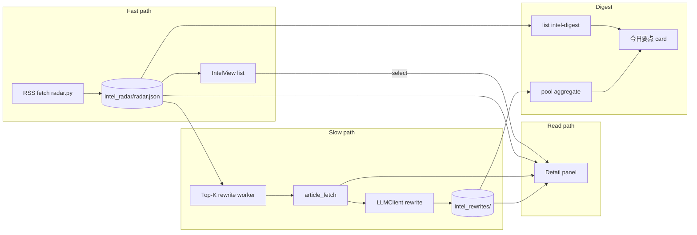

# News Radar Reader Workbench - Plan

## Goal Capsule

- **Objective:** Upgrade KSSDesktop 资讯雷达 from list-only scanning to list + detail reading: in-app body when possible, investment rewrite drafts (not generic blog rewrite), background Top-K auto rewrite per track, and track digests fed by the rewrite pool with fallback to today's list-based digest.
- **Product authority:** Product Contract below (ce-brainstorm). Adjacent plans: `docs/plans/2026-07-09-001-feat-news-radar-ai-digest-plan.md` (existing digest UI/bridge remains fallback), `docs/plans/2026-07-08-002-feat-vibe-research-modules-port-plan.md` (original port). Design *logic* from [qmreader](https://github.com/joeseesun/qmreader); no Node stack fork.
- **Open blockers:** None.
- **Product Contract preservation:** Product Contract unchanged (IDs R/A/F/AE/KD preserved). Planning defaults filled: K=8, pool threshold=3, dual host (cron + in-app kick), thin full-text fetch.

---

## Product Contract

### Summary

Turn 资讯雷达 into a **list-home + detail-panel reading workbench**: keep the 12-track list as the entry surface; opening an item shows body (best-effort full text, else summary + outbound link) plus an investment rewrite layer; the system auto-rewrites up to Top K items per track per day; track-level「今日要点」aggregate from the rewrite pool when enough drafts exist, otherwise keep the existing list-based digest path.

### Problem Frame

Today IntelView is a multi-track RSS title list with optional track-level AI digest. Reading means leaving the app for the source site. That breaks continuous investment scanning: foreign/long pieces are hard to absorb, and digests chew raw titles instead of already-digested material.

qmreader solves a related problem for tech reading (source | list | reader | AI companion; fast RSS then slow AI; personal assets). KSS needs the *pipeline and reading shape*, not the public multi-user product or Qiaomu voice.

### Key Decisions

- **KD1. Layout A — list home + detail panel, not three/four columns.** Preserve track pills and list as primary. Detail panel carries body + investment rewrite. Full qmreader workbench deferred.
- **KD2. Transplant design logic, not the Node stack.** Borrow: in-app reader, fast-then-slow pipeline, article-first processing, rewrite as durable asset. Do not port multi-user, public assets, contributor pages, or Qiaomu-style rewrite.
- **KD3. Investment rewrite schema, not bilingual MT or style clone.** Target structure: 事件 → 影响 → 标的线索 → 待验证 (+ short open questions as needed). Keep original entry always available.
- **KD4. Global auto rewrite with hard Top-K ceiling.** Default: each track auto-queues at most K new items per calendar day (planning default **K=8**). Remaining items stay list-only until opened on demand.
- **KD5. Track digest becomes pool-backed with fallback.** Prefer aggregating 今日要点 from that track's rewrite pool. If the pool is too thin (**threshold=3** drafts for that track/day), fall back to the existing list-fed `intel-digest` path.
- **KD6. Best-effort full text.** Attempt article body fetch for reader and rewrite input; on failure show RSS summary + external link and still allow rewrite from available fields when content is not too thin.

### Actors

- **A1. Solo operator (primary):** uses KSSDesktop 资讯雷达 for investment news scanning and deeper reads.
- **A2. Background rewrite worker:** fetches candidates, writes rewrite drafts, updates pool status without blocking list load.
- **A3. Existing digest path:** list-based track LLM digest retained as fallback when rewrite pool is insufficient.

### Key Flows

- **F1. Scan list (unchanged entry)**
  - **Trigger:** Open 资讯雷达 / switch track / refresh.
  - **Steps:** Load radar cache or force fetch; show track pills + items; show track digest card (pool aggregate or fallback).
  - **Outcome:** Operator sees freshness and can pick an item without waiting on AI.

- **F2. Open item → detail panel**
  - **Trigger:** Select a news row.
  - **Steps:** Open detail panel; show title/source/time; show body (full text or summary); show rewrite draft if ready, or generating/unavailable state; offer open-in-browser.
  - **Outcome:** Operator can finish a meaningful read in-app for Top-K / opened items.

- **F3. Background auto rewrite (Top-K)**
  - **Trigger:** After radar refresh (cron or App kick) or scheduled freshness pass.
  - **Steps:** Rank new items per track; take up to K not-yet-rewritten; best-effort body fetch; produce investment rewrite; store draft; update pool counts.
  - **Outcome:** Pool grows without operator action; list stays fast.

- **F4. On-demand rewrite**
  - **Trigger:** Open item outside Top-K without draft, or explicit "生成投研改写".
  - **Steps:** Queue single-item rewrite; panel shows progress then draft.
  - **Outcome:** Deep dives are not limited to the daily Top-K budget.

- **F5. Track digest from pool (with fallback)**
  - **Trigger:** View track digest or bulk digest action.
  - **Steps:** If rewrite pool meets threshold → aggregate 今日要点 from drafts; else run existing list-based digest; surface which mode was used.
  - **Outcome:** Digests improve as rewrites accumulate without empty states blocking the page.

### Requirements

**Reading surface**

- R1. Selecting a list item opens an in-app detail panel (or equivalent non-browser primary surface) with title, source, time, and body area.
- R2. Body uses best-effort full text; if fetch fails, show RSS summary plus clear external link. Do not pretend full text was loaded.
- R3. Detail panel always exposes investment rewrite region: ready draft, generating, failed, or not queued.

**Investment rewrite**

- R4. Rewrite content follows investment schema (事件 / 影响 / 标的线索 / 待验证), not Qiaomu literary rewrite and not full machine-translation as the primary product.
- R5. System auto-rewrites up to Top K new items per track per day after fetch; K is a documented default (8) and must be changeable later without redesign.
- R6. Operator can request rewrite for an item outside the auto queue (on-demand).
- R7. Rewrite drafts are durable local assets tied to the item (stable enough to re-open and to feed aggregation).

**Pipeline & digest**

- R8. List load and refresh never block on rewrite completion (fast-then-slow).
- R9. Track「今日要点」prefer aggregation from that track's rewrite pool when pool size ≥ threshold (3); otherwise use existing list-based digest.
- R10. UI indicates whether the current track digest is pool-aggregated or fallback.
- R11. Existing bulk/single digest actions remain usable under the fallback path; when pool-backed, bulk action should not re-burn list digests for tracks already pool-rich.

**Quality & failure**

- R12. Empty/loading/error states for body fetch and rewrite are distinct and recoverable (retry).
- R13. Compliance redlines of the current radar pipeline remain in force for items entering auto rewrite.

### Acceptance Examples

- **AE1. In-app read without browser for rewritten item**
  - **Covers:** R1–R4, R7
  - **Given:** Track has a Top-K item with successful body fetch and rewrite.
  - **When:** Operator selects the row.
  - **Then:** Detail panel shows body text and investment rewrite; external link optional, not required to understand the piece.

- **AE2. Full-text failure degrades honestly**
  - **Covers:** R2, R12
  - **Given:** Body fetch fails for an item.
  - **When:** Operator opens it.
  - **Then:** Summary + outbound link shown; rewrite may still appear if generated from available fields or shows not-available with reason—never a blank "full article" claim.

- **AE3. Top-K ceiling**
  - **Covers:** R5, R8
  - **Given:** A track has more than K new items today.
  - **When:** Auto rewrite runs.
  - **Then:** At most K new drafts for that track that day; list remains usable during generation.

- **AE4. Digest fallback then flip**
  - **Covers:** R9, R10
  - **Given:** Track rewrite pool below threshold.
  - **When:** Operator views 今日要点.
  - **Then:** Fallback list digest is used and labeled as such. After pool crosses threshold, same surface shows pool-aggregated points and the mode label updates.

- **AE5. On-demand outside Top-K**
  - **Covers:** R6
  - **Given:** Item not auto-queued, no draft.
  - **When:** Operator requests rewrite.
  - **Then:** Draft generates and persists; later digests may include it in the pool.

### Success Criteria

- **S1.** For the day's Top-K foreign/key items in active tracks, operator can complete a useful read in-app without opening a browser (body or honest summary + rewrite).
- **S2.** Once the pool is rich, pool-backed digests give **structured coverage of rewritten items** (capped, deduped 事件/影响 bullets) that is more actionable than raw title-list digest; until then list fallback still works without empty blocking.
- **S3.** List/refresh remains snappy under auto rewrite load (no multi-minute block on open).

### Scope Boundaries

**In scope**

- List + detail panel reading on IntelView (layout A)
- Best-effort body fetch + investment rewrite + Top-K auto + on-demand
- Rewrite pool storage and pool-backed track digest with list-digest fallback
- Status UX for generating / failed / mode of digest
- Dual host: extend `intel_radar_refresh` cron + App refresh kick (no new daemon)

**Deferred for later**

- Three/four-column continuous workbench (layout B)
- Rewrite-asset-first home (layout C as primary nav)
- Unread / favorites / search / keyboard continuous reading half-hour flow
- Full bilingual MT side-by-side as primary layer
- Article-context free-form AI companion (qmreader Article Agent)
- Public shareable assets, multi-user, contributor pages
- Notes library browser for all rewrites
- Heavy readability/Jina as default (optional later)

**Outside this product's identity**

- Becoming a general tech RSS social site (qmreader product identity)
- Qiaomu-style public rewrite brand voice as the default investment layer

### Dependencies / Assumptions

- **D1.** Existing radar stack remains source of truth for tracks/items: `intel-radar` / `kss/news/radar.py` / `news_sources.json` (12 tracks).
- **D2.** Existing `intel-digest` / Keychain LLM credentials remain available for fallback digests and rewrite calls via `LLMClient.complete`.
- **D3.** Full-text fetch quality varies by site; product accepts degradation rather than requiring 100% full text.
- **PA1.** Primary actor is the solo desktop operator (not multi-tenant).
- **PA2.** Pool threshold default = 3 drafts with status ready for that track on the calendar day.
- **PA3.** Top-K ranking = time-desc within track (source priority later).

### Outstanding Questions

**Resolve Before Planning:** none.

**Deferred to Implementation**

- Exact thin-content skip character count for auto-queue
- Whether detail panel is fixed ~420pt or resizable within Layout A
- Prompt tuning after first real rewrite samples

### Sources / Research

- External: [qmreader](https://github.com/joeseesun/qmreader) — workbench IA, fast-then-slow, article-bound processing.
- `Sources/KSSDesktop/Views/IntelView.swift` — list + track digest; row is external `Link`.
- Split pattern to mirror: `Sources/KSSDesktop/Views/NewsDigestView.swift`, `ReviewsView.swift`.
- Radar: `kss/news/radar.py`, `kss/news/news_sources.json`.
- Digest: `kss/news/digest_ai.py`, bridge `intel-digest` / `intel-digest-save`.
- Fetch adjacent: `kss/research/adapter.py` thin HTML extract (mirror, do not couple research package into news hot path if avoidable — extract shared helper or copy thin pattern into `kss/news/`).
- Cron host: `kss/config/cron_jobs.yaml` `intel_radar_refresh` + `scripts/run_intel_radar.sh`.
- Storage pattern: `kss/storage/notes.py` atomic md+json.
- Design system: `docs/solutions/kss_desktop_swiftui_design_system.md` (custom HStack, not NavigationSplitView).
- Prior plans: `docs/plans/2026-07-08-002-…`, `docs/plans/2026-07-09-001-…`.
- Session grounding: `/tmp/compound-engineering/ce-brainstorm/qmreader-radar-20260710/grounding.md`.

---

## Planning Contract

### Summary (implementation)

Ship a Python rewrite pool + article fetch + Top-K worker, bridge commands, and reshape IntelView to NewsDigest-style list|detail. Keep existing `intel-digest` as fallback. Hook worker into radar refresh cron and App force-refresh kick. Defaults: **K=8**, **pool threshold=3**.

### Key Technical Decisions

- **KTD1. Separate rewrite pool from notes digests.** Store drafts under `STATE_ROOT/storage/intel_rewrites/` (per-item JSON + optional md), keyed by stable item id (hash of url, fallback title+source+time). Each ready draft **persists last successful body** (`body_text`, `body_mode`, `body_char_count`, `fetched_at`) so the detail panel does not re-fetch for AE1. Day key = **Asia/Shanghai (BEIJING)** calendar date, same as radar. Do not overload `intel_digest_*` note files.
- **KTD2. Thin full-text fetcher in `kss/news/`.** New module mirrors `adapter` extract ideas (HTTP get + strip scripts/tags + length cap) using stdlib/`urllib` (and existing project HTTP deps if already present). No new heavy readability dependency. Return `{body, mode: "fulltext"|"summary"|"empty", error?, char_count}`.
- **KTD3. Rewrite via same LLMClient as digest.** Sync `complete(system, user)`; investment system prompt; input = title/source/time + body-or-summary; timeout similar to digest (30s, retries 0). Serial per-item in worker to avoid 429 (same lesson as bulk digest).
- **KTD4. Worker dual-host, no daemon.** Core `run_top_k_rewrites(k=8, force=False)` callable from (a) `scripts/run_intel_radar.sh` after `fetch_radar`, (b) bridge `intel-rewrite-run` kicked after App refresh / on-demand. List load never awaits worker. Top-K budget counts **ready drafts only**. Before LLM: atomic claim `status=generating` (skip if generating/ready; stale generating TTL ~15m). Soft wall-clock per invocation (stop after N minutes / M LLM calls; log `stopped_reason`; fetch exit 0 still).
- **KTD5. Digest mode selector — pool before list-cache.** Always `count_ready(track, day)` first. If ≥ threshold → `aggregate_track_digest` and return `mode=pool` (**ignore** existing list `intel_digest_*` notes cache for that response). Else list `intel-digest` with `mode=list`. UI badge: `改写池` / `列表提炼`.
- **KTD6. Layout A via HStack, not NavigationSplitView.** Mirror `NewsDigestView`: left list (~320–360) + Divider + detail; track pills stay above or in left column header. Replace `Link`-only row with selectable row; external open secondary button.
- **KTD7. Long commands stay subprocess-only.** Register new bridge commands in `subprocessOnlyCommands` and mark write commands in `WRITE_COMMANDS` as appropriate.
- **KTD8. Config constants module.** `kss/news/rewrite_config.py` holds `TOP_K=8`, `POOL_THRESHOLD=3`, thin-content char floor (provisional).

### High-Level Technical Design

### Assumptions (planning)

- Item identity = normalized URL when present; else composite key.
- K and threshold are constants in one config module (env override optional later).
- Auto-queue skips items with empty title or redline-filtered (already filtered at radar).
- Rewrite prompt must not invent tickers: mark 标的线索 as “可能相关/待核实”, never as advice (align digest_ai non-recommendation tone).

### Alternative Approaches Considered

| Approach | Why not chosen |
|---|---|
| Full 3-column workbench first | User chose Layout A; higher IA cost without proving read value |
| Rewrite-asset-first home | User chose list entry; C deferred |
| Jina/readability-first fetch | Extra dep/network; thin fetch + honest degrade matches KD6 |
| Daemon/queue service | Overkill for solo desktop; cron + bridge kick enough |

### Risks & Mitigation

| Risk | Mitigation |
|---|---|
| Full-text fetch blocked/empty | Honest summary mode; rewrite may still run on title+summary if above thin threshold |
| LLM cost / 429 | K=8/track/day, serial worker, reuse force=false cache |
| Digest mode thrashing | Live `count_ready≥3` only; no sticky flag |
| Layout breaks design system | Follow custom HStack patterns from design-system solution |
| `run_intel_radar.sh` uses `exec` | Sequential fetch then worker; no exec after fetch |

---

## Implementation Units

### U1. Article body fetch module

**Goal:** Best-effort article body for a URL with honest mode flags.

**Requirements:** R2, R12, KD6, KTD2

**Dependencies:** none

**Files:**
- `kss/news/article_fetch.py` — create
- `kss/tests/test_article_fetch.py` — create

**Approach:**
- `fetch_article(url, timeout=…) -> {body, mode, error?, char_count}`
- Cap body length for LLM safety; strip HTML; no JS execution
- Unit-test with fixture HTML strings (no live net in unit tests)

**Patterns to follow:** `kss/research/adapter.py` extract helpers; `radar.py` UA/timeout style

**Test scenarios:**
- Happy: HTML with article-like paragraphs → mode fulltext, body non-empty
- Edge: empty HTML / non-HTML → mode empty or summary-only path for caller
- Error: invalid URL / timeout mocked → error set, no crash
- Edge: body over cap truncated

**Verification:** pytest file green; no network required.

---

### U2. Rewrite pool storage + investment rewrite LLM

**Goal:** Durable per-item rewrite drafts and generation API.

**Requirements:** R4, R6, R7, R9, R13, KD3, KTD1, KTD3, KTD8

**Dependencies:** U1 (optional body input)

**Files:**
- `kss/news/rewrite.py` — create (prompt + `run_rewrite` + `aggregate_track_digest`)
- `kss/news/rewrite_config.py` — create (`TOP_K`, `POOL_THRESHOLD`, thin floor)
- `kss/storage/rewrite_pool.py` — create (paths, atomic write, list by track/day, count_ready)
- `kss/tests/test_intel_rewrite.py` — create
- `kss/tests/test_rewrite_pool.py` — create

**Approach:**
- Schema fields: event / impact / leads / to_verify (+ raw text) + body snapshot fields when fulltext/summary fetch succeeded
- Status lifecycle: `generating` → `ready` | `failed` (required, not optional)
- `item_id` from url hash; `day` = BEIJING calendar date
- `force=False` returns existing ready draft; on-demand `run_rewrite` **never checks K** (only worker enforces Top-K); on-demand ready drafts still count toward later auto K
- `aggregate_track_digest(track_key, day) -> {text, mode: "pool"|"insufficient", draft_ids, count}` — **minimal quality bar (S2):** top N by recency (cap 5–8 bullets), prefer non-empty 事件 + one-line 影响, near-duplicate 事件 dedupe; S2 means structured coverage of rewritten items, not a second LLM insight pass (second LLM optional later)
- Patch `LLMClient` in tests

**Patterns to follow:** `digest_ai.py`, `notes.py` atomic write, `test_intel_digest.py`

**Test scenarios:**
- Happy: mock LLM → saved draft with sections + body snapshot; second call force=False no LLM
- Happy: with body vs title-only inputs both produce structured text
- Happy: ≥3 ready drafts → aggregate returns `mode=pool` and ≤8 bullets (R9)
- Edge: <3 ready → aggregate returns `mode=insufficient`
- Edge: missing title → skip/error without write
- Edge: on-demand when ready already ≥K still succeeds
- Error: LLM unavailable → status failed + error_type
- Covers AE5 storage side

**Verification:** pytest green with `KSS_STATE_ROOT=tmp`.

---

### U3. Top-K worker + cron / script hook

**Goal:** After radar fetch, auto-rewrite ≤K per track/day serially.

**Requirements:** R5, R8, R13, KD4, KTD4, AE3

**Dependencies:** U1, U2

**Files:**
- `kss/news/rewrite_worker.py` — create `run_top_k_rewrites(...)`
- `scripts/run_intel_radar.sh` — modify: after fetch, invoke worker (env flag to skip)
- `kss/config/cron_jobs.yaml` — note/comment if args needed; keep schedule
- `kss/tests/test_rewrite_worker.py` — create

**Approach:**
- Auto path **only** consumes items from radar cache (R13 trust boundary); optional `passes_redline` defense-in-depth for on-demand titles
- Rank track items by ts desc; skip ready/generating (non-stale); atomic claim `generating` before LLM; stop when **ready drafts** for track/day reach K
- Serial LLM calls; soft wall-clock / max-calls stop; continue on single-item failure → `failed`
- `run_intel_radar.sh`: **do not use `exec` for fetch** — sequential `fetch_radar` then `run_top_k_rewrites`; env `KSS_SKIP_REWRITE=1` skips worker; worker exception must not fail the shell after successful fetch
- Log counts; never raise away radar success

**Patterns to follow:** bulk digest serial loop; `run_intel_radar.sh` structure

**Test scenarios:**
- Happy: 20 items → at most K **ready** drafts; files appear for first K successes
- Edge: all already rewritten → zero LLM calls
- Edge: two interleaved workers → ≤1 LLM per item_id (claim protocol)
- Edge: fetch fail for item → still may rewrite from summary if allowed; body snapshot may be summary
- Error: one LLM fail → status failed; others continue; ready count still ≤ K
- Covers AE3

**Verification:** pytest with mocks; manual script dry-run optional.

---

### U4. Bridge commands for article, rewrite, run, digest mode

**Goal:** Expose fetch/rewrite/worker/aggregate to Swift via bridge.

**Requirements:** R7–R11, R13, KTD5, KTD7

**Dependencies:** U1–U3

**Files:**
- `scripts/kss_app_bridge.py` — register handlers + COMMANDS/WRITE_COMMANDS
- Extend or add thin wrappers in `kss/news/*` if needed
- `kss/tests/test_intel_bridge_rewrite.py` or extend existing bridge orientation/registry tests

**Approach (directional command set):**
- `intel-article` — `{url}` → body payload (may be skipped by UI if pool has body snapshot)
- `intel-rewrite` — `{track_key, item, force?}` → draft (on-demand; no K check)
- `intel-rewrite-run` — `{k?, force?}` → worker summary counts
- `intel-digest` / digest bridge: **`count_ready` first** — if ≥ threshold → always `aggregate_track_digest` + `mode=pool` (do not return list notes cache); else list path + `mode=list`
- All long ops in `subprocessOnlyCommands`

**Patterns to follow:** `_intel_digest` / `_intel_radar` envelope JSON

**Test scenarios:**
- Happy: rewrite payload → draft json envelope including body snapshot when fetch ok
- Happy: run worker with mocks → counts
- Edge: pool < 3 → digest uses list path flag (`mode=list`)
- Edge: pool ≥ 3 **and** old list notes cache exists → still `mode=pool` text from pool, not notes (R9/AE4)
- WRITE_COMMANDS / COMMANDS registry consistency (existing orientation test)

**Verification:** bridge unit/integration tests; command registry drift guard still green.

---

### U5. Swift BridgeClient + KSSStore + models

**Goal:** Client API and store state for selection, drafts, worker kick, digest mode.

**Requirements:** R1–R12, F1–F5

**Dependencies:** U4

**Files:**
- `Sources/KSSDesktop/Services/BridgeClient.swift` — methods + subprocess set
- `Sources/KSSDesktop/Services/KSSStore.swift` — selection, article body cache, rewrite map, kick worker after refresh, digest mode
- `Sources/KSSDesktop/Models/KSSModels.swift` — response types
- Tests if project has Swift bridge envelope tests

**Approach:**
- `@Published selectedIntelItem` / track-local selection
- On selection: load rewrite draft first → **use pool `body_text` if present**, else `intel-article`, else RSS summary (AE1 durability)
- After successful `refreshIntelRadar`, fire-and-forget `intel-rewrite-run` without blocking UI
- **Required:** when rewrite-run settles, re-fetch digest for active track; on track switch / radar load, if bridge says `mode=pool`, auto-fill 今日要点 without requiring bulk click (AE4)
- `summarizeIntelTrack` / bulk: when `mode=pool`, **do not** re-send full item list for list LLM (R11). Badge from `mode`.
- Map pool status → rewrite chip: generating / ready / failed / none

**Patterns to follow:** existing `summarizeIntelTrack` / bulk serial; design-system selection highlight

**Execution note:** Prefer store-level state so detail panel is dumb view.

**Test scenarios:**
- Registry includes new commands
- Selection changes cancel prior load (logic unit if testable)
- Refresh does not wait for rewrite-run completion (R8)
- Bulk with pool-rich tracks skips list LLM path (R11)
- After worker + pool≥3, active track card flips to pool without manual 提炼 (AE4)
- Select rewritten item with network mocked fail still shows stored body (AE1)

**Verification:** build/smoke; existing Python registry tests if any.

---

### U6. IntelView list|detail UI

**Goal:** Layout A reading surface with rewrite region and digest mode label.

**Requirements:** R1–R4, R6, R10–R12, AE1–AE2, AE4–AE5, KD1, KTD6

**Dependencies:** U5

**Files:**
- `Sources/KSSDesktop/Views/IntelView.swift` — major reshape
- Optional small subviews in same file or `IntelDetailPane.swift` if file grows large

**Approach:**
- Top: title, bulk digest, stats/refresh (keep)
- Below: track pills
- Main: HStack list | detail (mirror NewsDigestView widths)
- Row: select + rewrite status chip (ready/pending/none); secondary open-in-browser
- Detail: header, body (mode badge fulltext/summary), rewrite block, generate button
- Digest card: show `改写池` / `列表提炼` per R10

**Patterns to follow:** `NewsDigestView`, design-system HStack, existing digest card state machine

**Test scenarios:**
- Manual smoke: select row → detail fills without leaving app
- Manual: fetch fail → summary + link + no false fulltext
- Manual: rewrite ready → sections visible
- Manual: pool thin → fallback digest label; after ≥3 → pool label
- Covers AE1, AE2, AE4, AE5 at UI level

**Verification:** `script/sign_and_build.sh` or `script/build_and_run.sh` smoke; open 资讯雷达.

---

## Verification Contract

- **Unit:** `pytest kss/tests/test_article_fetch.py kss/tests/test_intel_rewrite.py kss/tests/test_rewrite_pool.py kss/tests/test_rewrite_worker.py -q` (plus any bridge tests added)
- **Regression:** existing `pytest kss/tests/test_intel_digest.py -q` still green
- **App smoke:** load 资讯雷达 from cache → select item → detail body mode honest → on-demand rewrite with credentials → digest badge mode correct
- **Worker smoke:** `run_intel_radar` or bridge `intel-rewrite-run` produces ≤K files per track under `storage/intel_rewrites/`
- **Non-goals for CI:** live network full-text against arbitrary sites; live LLM calls in unit tests

---

## Definition of Done

- All R1–R13 behaviors implemented or explicitly deferred with user sign-off (none deferred without reason)
- U1–U6 complete with listed tests/smoke
- Product AE1–AE5 demonstrable on a local signed or dev build
- No regression to list load speed: open page still returns cache without waiting for rewrite worker
- Plan Product Contract IDs still accurate; no silent product scope change

---

## Appendix

### Defaults locked at planning

| Knob | Value |
|---|---|
| Top-K per track per day | 8 (ready drafts; failed do not burn) |
| Pool threshold for aggregate digest | 3 |
| Day key | Asia/Shanghai (BEIJING) |
| Worker hosts | cron after fetch + App refresh kick + claim protocol |
| Full-text strategy | thin fetch; body snapshot on draft |
| Aggregate quality | deterministic join, cap 5–8, dedupe 事件 |
| Layout | A — list \| detail HStack |

### Sequencing

U1 → U2 → U3 → U4 → U5 → U6 (U6 can start UI shell after U5 stubs if needed, but prefer U4 first).
