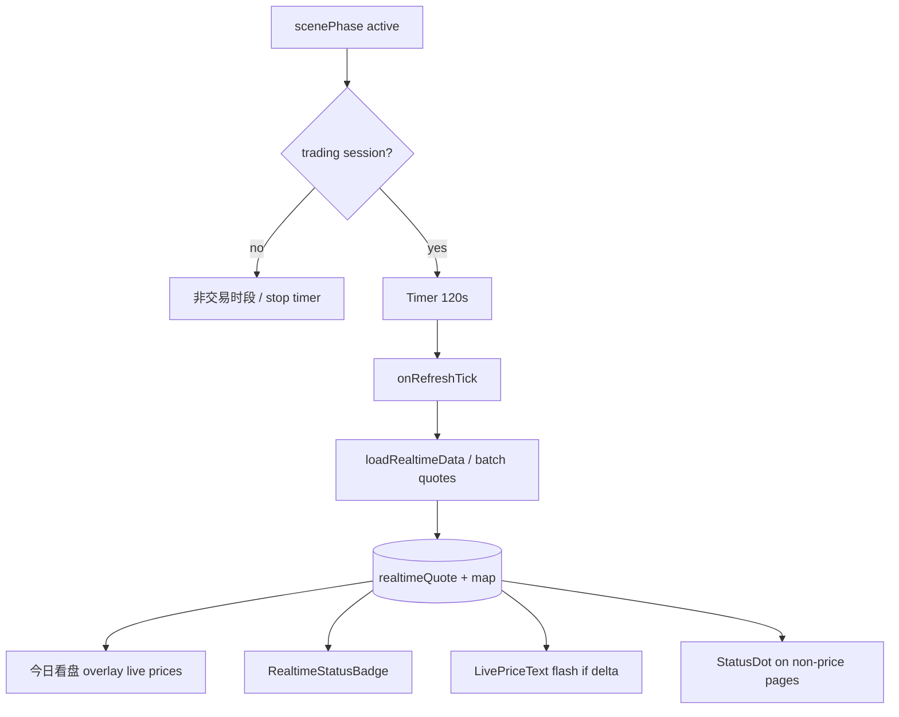

# Longbridge Realtime Label and Motion - Plan

## Goal Capsule

- **Objective:** Close the loop on Longbridge realtime for KSSDesktop: timer actually re-fetches quotes every **2 minutes**, 今日看盘 shows live numbers with honest 实时 labeling, price changes flash lightly, price pages get full treatment, non-price pages get a small status dot.
- **Product authority:** Product Contract below (ce-brainstorm). Adjacent: `docs/plans/2026-07-08-001-feat-dynamic-realtime-wiring-plan.md` (5m default **superseded** to 2m).
- **Open blockers:** None.
- **Product Contract preservation:** Product Contract unchanged; planning adds multi-symbol overlay detail and unit breakdown.

---

## Product Contract

### Summary

Audit and fix Longbridge realtime wiring page-by-page, prioritizing 今日看盘. During trading hours with the window active, refresh every **2 minutes** by re-dispatching Longbridge quote (not a no-op tick). Surface a consistent **实时 / 非实时 / 非交易时段 / 实时源未连接** label. On successful refresh when a displayed price changes, apply a **short color highlight flash**. Pages with liveable prices get full label + flash; pages without prices get only a small connection-status indicator.

### Problem Frame

- Timer default 300s only sets `refreshTimestamp`; **no View listens**, tick **does not** call `loadRealtimeData`.
- 今日看盘 badge can show「实时」while MarketStrip/indices still bind **cron snapshot**.
- No shared flash language on price change.
- Non-price pages lack source-status affordance.

### Key Decisions

- **KD1.** Approach A — fix wiring + shared components (not RealtimeSession framework).
- **KD2.** Refresh interval = **2 minutes** (trading session + window active). Coalesce 30s same-cmd:symbol.
- **KD3.** Price pages full label+flash; non-price pages status dot only.
- **KD4.** Flash = light color highlight ~0.4s on success + value change only.
- **KD5.** Four-state badge semantics preserved.

### Actors

- **A1.** Solo desk operator · **A2.** Background timer · **A3.** Longbridge vs cron fallback.

### Key Flows

- **F1.** Open 今日看盘 in session → gate → load quote → live fields + 实时 badge.
- **F2.** 2-min tick → re-fetch → flash changed prices → update badge time.
- **F3.** Off-session / background → timer stop; honest label; no flash.
- **F4.** Non-price page → small status dot only.

### Requirements

- R1. Timer tick must re-fetch Longbridge data used by 今日看盘.
- R2. Default interval **2 minutes**.
- R3. Pause timer when inactive or outside session.
- R4. Coalescing ~30s same-cmd:symbol.
- R5. Live-capable fields bind quote when `isLive`; else cron + not 实时.
- R6. Top badge reflects provenance (四态).
- R7. Manual retry on 未连接 / 非实时.
- R8. Price pages: same four-state language.
- R9. Non-price pages: compact status only.
- R10. Flash on success + price change.
- R11. No flash on unchanged / fail / off-session.
- R12. Page wiring audit checklist delivered with implementation notes.

### Acceptance Examples

- AE1–AE5 as brainstormed (live open, timer flash, offline, non-price, background pause).

### Success Criteria

- S1. 今日看盘 stays consistent across ≥1 timer cycle without manual refresh.
- S2. One-glance provenance (live/stale/off-session/disconnected).
- S3. Flash perceptible, not noisy.

### Scope Boundaries

**In:** Timer fix, 2m, dashboard live bind, shared badge+flash, price/non-price tiers, audit table.  
**Deferred:** RealtimeSession bus, interval settings UI, 北交所, latency dashboard, sparkline farm.  
**Outside:** PIT backfill, trading execution, timer-triggered writes.

### Dependencies / Assumptions

- D1/D2: bridge + trading-hours gate.  
- A1: Price pages = 今日看盘, 个股, 推荐/持仓/主题中有现价的块.  
- A2: Flash ~0.4s UX default.

### Sources / Research

- Plan 2026-07-08-001 · `KSSStore` timer/load · `DashboardView` badge · ContentView props · grounding dossier under `/tmp/compound-engineering/ce-brainstorm/longbridge-rt-label-20260710/grounding.md`.

---

## Planning Contract

### Summary (implementation)

Make `onRefreshTick` call `loadRealtimeData` (or multi-symbol refresh) every 120s; overlay quote onto 今日看盘 index/ETF rows when symbols match; extract `RealtimeStatusBadge` + `LivePriceText` (flash); wire price pages; non-price pages get status dot; document audit table.

### Key Technical Decisions

- **KTD1. Tick → `refreshRealtimeQuotes`, not a loop of `loadRealtimeData`.**  
  - `loadRealtimeData(symbol:)` today overwrites a **single** `realtimeQuote` and sets `nil` on any failure — **must not** be called in a for-loop over symbols.  
  - New store API: `refreshRealtimeQuotes(symbols:)` → session gate once → per-symbol `longbridge-quote` with `shouldSkipDispatch("longbridge-quote", sym)` → merge into `realtimeQuotesBySymbol` → one `@Published` publish → update canary/`realtimeQuote` for badge.  
  - Default `startRefreshTimer(intervalSeconds: 120)` (`minIntervalSeconds` already 120).  
  - **`realtimeAuthFailed == true` → stop timer**; `retryRealtime` success → `reevaluateTimer`.
- **KTD2. Multi-symbol map + symbol filter.**  
  - Source symbols from `marketStrip` etfs + indices + indexBoard.  
  - **Exclude** non-liveable: `.BJ`, global codes without ChinaConnect shape (`IXIC`, `HSI`, bare tickers), other non-`.SH`/`.SZ` unless proven live.  
  - Cap: prioritize visible hot zone (ETFs + 上证 + A-share board); hard max ≤20/tick.  
  - Sequential single-symbol API is interim (SDK already batches under the hood); optional multi-quote bridge later, non-blocking.
- **KTD3. Shared components.** Extract from private `RealtimeFreshnessBadge`:
  - `RealtimeStatusBadge` (四态 + retry)
  - `RealtimeStatusDot` (compact for non-price pages)
  - `LivePriceText` / modifier: previous+current Double, flash ~0.4s on change
- **KTD4. Field-level provenance + badge rule.**  
  - Overlay helper: `close = lastDone`, `pct = (lastDone - prevClose) / prevClose * 100` when `prevClose > 0`; else price-only live / keep snapshot pct.  
  - Row fields mark `isLive` only on map hit.  
  - Badge「实时」⇔ **at least one displayed, liveable field** on this page is live (not “canary alone while board is cron”).
- **KTD5. Dashboard four price surfaces share overlay.** MarketStripRow, MarketIndexRow, IndexMarquee, IndexBoardGrid all use the same merge helper (or MVP explicitly defers marquee/grid — default: **all four**).
- **KTD6. Stock detail.** Optional same-tick `intradayBars` refresh while StockBrowser visible + coalesce; flash last if shown.
- **KTD7. No new daemon.** All in Swift store + existing bridge.

### High-Level Technical Design

### Page wiring audit (baseline → target)

| Page | Today | Target |
|------|--------|--------|
| 今日看盘 Dashboard | onAppear load; badge; strip=cron; timer no-op | tick reloads; overlay live; flash; badge honest |
| 个股 StockBrowser | intraday on demand | badge + optional 2m bar refresh + flash last |
| AI 复盘 Seesaw | warm context | status + flash if quote shown |
| 推荐/持仓/主题 (price) | cron | badge + live where symbol quote exists + flash |
| 资讯雷达/架构/Runbook 等 | none | status **dot** only |

### Risks

| Risk | Mitigation |
|------|------------|
| Multi-symbol rate limits | Cap symbols/tick; 2m interval; coalesce |
| Badge says live, board still cron | R5/KTD4 provenance per field |
| Flash noise | Only on delta; short duration |

### Assumptions

- ChinaConnect coverage still excludes 北交所 for live.
- `longbridge-quote` remains single-symbol; batch = multiple calls until bridge multi-quote exists.

---

## Implementation Units

### U1. Timer tick re-fetches + 2-minute interval + auth stop

**Goal:** Trading-session timer actually refreshes Longbridge (canary/map pipeline entry).

**Requirements:** R1–R4, F2, F3, AE5

**Dependencies:** none

**Files:**
- `Sources/KSSDesktop/Services/KSSStore.swift` — default interval 120; `onRefreshTick` → `refreshRealtimeQuotes`; wire `shouldSkipDispatch`; stop timer on `realtimeAuthFailed`

**Approach:**
- Replace timestamp-only tick with async `refreshRealtimeQuotes` (U2 implements body; U1 can stub with canary-only then expand).
- **U1 alone does not claim MarketStrip digits are live** — only that refresh runs and `realtimeUpdatedAt` / map pipeline advances.
- Preserve scenePhase + tradingHours gates.

**Test scenarios:**
- Interval default 120; tick no-op when inactive/off-session.
- auth_failed stops further ticks until retry.
- Manual: `realtimeUpdatedAt` advances ~2 min in session.

**Verification:** updatedAt advances; background silent.

---

### U2. Multi-symbol quote map + dashboard overlay (true 今日看盘 live)

**Goal:** 今日看盘 prices reflect live quotes when available; badge matches field provenance.

**Requirements:** R5–R7, AE1, AE3

**Dependencies:** U1

**Files:**
- `Sources/KSSDesktop/Services/KSSStore.swift` — `realtimeQuotesBySymbol`, `refreshRealtimeQuotes`, symbol harvest + filter
- `Sources/KSSDesktop/Views/DashboardView.swift` — overlay helper into Strip / Index row / Marquee / BoardGrid
- Pure merge helper (+ tests in U5)

**Approach:**
- **Never** loop `loadRealtimeData(symbol)` (wipes single slot).
- Filter non-liveable symbols; sequential quote with per-symbol coalesce; one store publish per tick.
- Merge: `pct = (lastDone - prevClose) / prevClose * 100` when prev valid.
- Badge rule KTD4.

**Test scenarios:**
- AE1: live A-share overlays; BJ/HSI remain snapshot without forcing badge live-only-from-canary.
- AE3: empty map → snapshot + 非实时.
- Single symbol fail does not clear other map entries.

**Verification:** Manual session; badge and every overlaid surface provenance match.

---

### U3. Shared RealtimeStatusBadge + StatusDot + LivePriceText

**Goal:** Reusable 四态 label, compact dot, flash price.

**Requirements:** R6–R11, AE2, AE4

**Dependencies:** none (can parallel U1)

**Files:**
- `Sources/KSSDesktop/Support/Components.swift` or new `RealtimeChrome.swift` — extract badge from Dashboard private struct; add Dot + LivePriceText
- `Sources/KSSDesktop/Views/DashboardView.swift` — use shared badge; LivePriceText on overlaid prices

**Approach:**
- Flash: `@State last` + onChange → temporary highlight (theme.up/down/accent) 0.4s.
- Dot: green/gray/red for live/stale/auth.

**Test scenarios:**
- AE2 flash only on delta.
- Dot states on non-price page smoke.

**Verification:** UI smoke all four badge states.

---

### U4. Wire price pages + non-price dots via ContentView

**Goal:** Full sidebar policy.

**Requirements:** R8, R9, R12, AE4

**Dependencies:** U2, U3

**Files:**
- `Sources/KSSDesktop/Views/ContentView.swift` — inject status into section chrome
- `Sources/KSSDesktop/Views/StockBrowserView.swift` — badge + optional tick refresh bars
- Price-bearing views as needed (Recommendations/Watchlist/Themes if they show last price)
- Sidebar or page title trailing status dot for non-price

**Approach:**
- Single `RealtimeChrome` environment or store-driven.
- Audit table in PR description / unit verification notes.

**Test scenarios:**
- Navigate each section: price vs dot behavior correct.
- Stock detail: bars refresh without crash.

**Verification:** Manual walk of sidebar.

---

### U5. Tests + regression

**Goal:** Guard interval, coalesce, overlay selection.

**Requirements:** R1, R2, R4, R5

**Dependencies:** U1–U2

**Files:**
- `Tests/KSSDesktopTests/` or pure helper tests if store hard to unit-test
- Python bridge tests only if multi-quote added

**Approach:** Prefer small pure functions (symbol list extract, merge live into row) with unit tests.

**Test scenarios:**
- Merge prefers live lastDone.
- Coalesce key format.

**Verification:** `swift test` / pytest as applicable.

---

## Verification Contract

- Manual session (or mock trading-hours true): open 今日看盘 → badge 实时 → wait 2m → time advances + flash on change.
- Fail Longbridge (bad token): 非实时/未连接 + cron numbers.
- Background app: no further updates.
- Sidebar tour: price pages badge; 资讯雷达 status dot only.
- Build: `swift build` / `script/sign_and_build.sh` as usual.

## Definition of Done

- R1–R12 satisfied for 今日看盘 + stated price/non-price policy.
- AE1–AE5 demonstrable.
- No regression to trading-hours gate or read-only bridge discipline.
- Wiring audit table present in PR/commit notes.

## Appendix

### Defaults

| Knob | Value |
|------|--------|
| Interval | **120s** (`startRefreshTimer` default; floor already 120) |
| Coalesce | 30s per `longbridge-quote:<symbol>` via `shouldSkipDispatch` |
| Flash | ~0.4s color only on delta |
| Symbol cap / tick | hard ≤20; prefer visible A-share hot zone |
| Multi-quote bridge | follow-up, not blocker |

### Pressure-test notes (2026-07-10)

- Confirmed timer no-op + badge/strip split in live code.
- P0 fixes locked into KTD1–KTD5: no `loadRealtimeData` loop; symbol filter; field-level badge rule; four dashboard surfaces.
- Verdict: **Conditional Go** → plan text updated; ready for `ce-work`.

### Sequencing

U3 can parallel U1; U2 after U1; U4 after U2+U3; U5 throughout.
