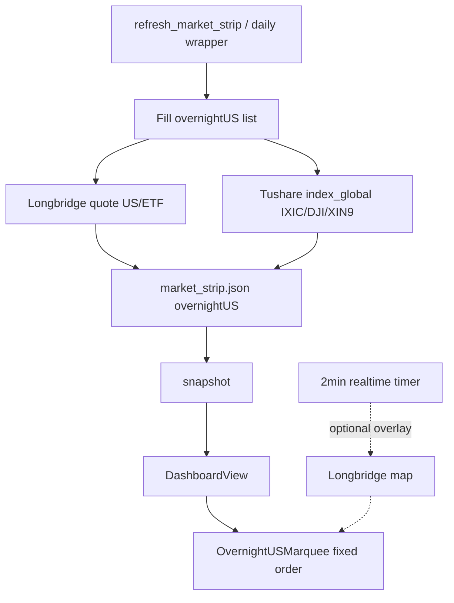

# Overnight US Marquee - Plan

## Goal Capsule

- **Objective:** 在今日看盘 A 股指数跑马灯下方增加「隔夜美股」栏目：固定名单、跑马灯样式、优先实时涨跌（失败回退上一收盘），红涨绿跌、不按涨跌重排。
- **Product authority:** Product Contract below（ce-brainstorm）。相邻：`2026-07-08-002` 的 `globalIndices` 扩展思路；本需求名单更具体 + 跑马灯形态。
- **Open blockers:** None。
- **Product Contract preservation:** Product Contract unchanged; planning source chain **revised after pressure-test** (see Appendix).

---

## Product Contract

### Summary

Solo desk operator 打开今日看盘时，在既有 A 股指数跑马灯正下方看到标题为 **「隔夜美股」** 的第二条跑马灯。条目为固定美股/ETF/指数名单（去掉 SpaceX），横向无缝滚动；展示名 + 涨跌幅（及可选现价），颜色遵循应用红涨绿跌。数据优先实时；单标失败则跳过该标，有至少一只成功才显示整栏。

### Problem Frame

- 盘前/盘中需要一眼扫「隔夜美股与中概/半导体主题」方向，今日看盘只有 A 股条 + 纳指/恒生夹在指数行里，缺少主题化隔夜美股区。
- 已有 `IndexMarquee` 交互语言可复用；缺固定名单与「隔夜/实时」语义。

### Key Decisions

- **KD1.** 位置：现有 A 股 `indexBoard` 跑马灯**正下方**（`SectorPulseStrip` 之上）。
- **KD2.** 标题固定文案 **「隔夜美股」**。
- **KD3.** 视觉与动效：对齐现有指数跑马灯；**不按涨跌幅重排**，固定名单顺序。
- **KD4.** 名单（去掉 SpaceX），展示顺序锁定（见 Planning 代码表）。
- **KD5.** 数字语义：尽量实时涨跌；源不可用 → 回退上一可交易日收盘涨跌。
- **KD6.** 部分失败：有几只显示几只；**≥1 只有效数据才渲染栏目**。
- **KD7.** 本轮不可点进个股；无名单编辑 UI。

### Actors

- **A1.** Solo desk operator · **A2.** 行情源（实时优先，快照回退）

### Key Flows

- **F1.** 打开今日看盘 → 有 ≥1 只成功 → 跑马灯出现。
- **F2.** 实时源更新数字；失败项跳过。
- **F3.** 全部失败 → 隐藏栏目。

### Requirements

- R1–R9 as brainstormed (placement, title, marquee, fixed order, pct+color, live-prefer, partial fail, no SpaceX/no click).

### Acceptance Examples

- AE1–AE4 as brainstormed.

### Success Criteria

- S1–S3 as brainstormed.

### Scope Boundaries

**In:** 今日看盘 UI；固定 12 标的；跑马灯；实时优先 + 收盘回退；部分失败降级。  
**Deferred:** SpaceX；可点击下钻；名单设置；完整全球指数条带。  
**Outside:** 交易下单。

### Dependencies / Assumptions

- **D1/A1.** 代码映射与主源见 Planning Contract（pressure-test 后修订）。
- **A2.** 富时 A50 以 `XIN9`（`index_global` 已验证）为准。

### Sources / Research

- `DashboardView` / `IndexMarquee`
- `refresh_market_strip.py`（`index_global`）
- `kss/data/longbridge_coverage.py` / `longbridge_ro.py`：现网只读闸与归一化面向 **陆股通六位码**
- 2026-07-10 probe：IXIC/DJI/XIN9 ok via `index_global`；`us_daily` **无权限**；`yfinance` 已在 venv（1.5.1）

---

## Planning Contract

### Summary (implementation)

Extend `market_strip` with `overnightUS` (ordered list). Fill in `refresh_market_strip` via **dual snapshot sources**: Tushare `index_global` for IXIC/DJI/XIN9；**yfinance** for US equity/ETF（MCHI/ROBO/BOTZ/NVDA/SOXX/SMH/TSLA/MU/AVGO）。**Do not** rely on Tushare `us_daily` or current Longbridge bridge path for US MVP. Dashboard: `OvernightUSMarquee` under A-share marquee, fixed order. Live overlay (U4) is **best-effort** only if a US-capable quote path is proven; otherwise product “尽量实时” = **refresh pipeline freshness** (cron/盘前盘后 strip 刷新 + 手动刷新 snapshot)，honest asof on chip/date field.

### Key Technical Decisions

- **KTD1. 数据主键：`market_strip.overnightUS`**  
  Shape: `{ code, name, close, pct, date?, source? }`. Written by refresh；bridge 透传整包 JSON；Swift `MarketStrip.overnightUS`.

- **KTD2. 固定名单 + 源分工（pressure-test locked）**

  | Order | Display name | Code | Snapshot source |
  |------:|--------------|------|-----------------|
  | 1 | MSCI中国指数ETF | MCHI | **yfinance** |
  | 2 | 纳斯达克综合指数 | IXIC | Tushare `index_global` |
  | 3 | 道琼斯指数 | DJI | Tushare `index_global` |
  | 4 | 富时中国A50指数 | XIN9 | Tushare `index_global` |
  | 5 | ROBO全球机器人… | ROBO | **yfinance** |
  | 6 | Global X Robotics… | BOTZ | **yfinance** |
  | 7 | 英伟达 | NVDA | **yfinance** |
  | 8 | 半导体ETF-iShares | SOXX | **yfinance** |
  | 9 | 半导体ETF-VanEck | SMH | **yfinance** |
  | 10 | 特斯拉 | TSLA | **yfinance** |
  | 11 | 美光科技 | MU | **yfinance** |
  | 12 | 博通 | AVGO | **yfinance** |

- **KTD3. 主源链（P0 修订）**  
  - **禁止**把现有 `longbridge-quote` bridge 当美股主源：coverage/normalize/`longbridge_ro` 面向 `NNNNNN.(SH|SZ|BJ)`；CLI 侧 auth 且非 US 形态。  
  - **禁止**依赖 Tushare `us_daily`（本 token 无权限）。  
  - **快照：** `index_global` + **yfinance**（项目已锁 `yfinance==1.5.1`）。yfinance 取 `history(period="5d")` 末两日算 pct，或 `info`/`fast_info` last/prev — 实现时选稳定路径。  
  - **“尽量实时”：** strip 刷新挂入既有 `run_update_data_daily` / 任务「刷新市场速览」；Dashboard 手动刷新 snapshot 即更新隔夜条。盘中 yfinance 延迟随源。  
  - **U4 可选：** 若后续 Longbridge 美股 quote 探通，再 overlay；**不阻塞 MVP**。

- **KTD4. UI：`OvernightUSMarquee`**  
  - 视觉对齐 `IndexMarquee`；**禁止**按 pct 排序。  
  - 标题「隔夜美股」；chip：名 + 涨跌%（现价可选）+ `signColor`。

- **KTD5. 失败与空态**  
  缺项 skip；`overnightUS.isEmpty` → 不渲染。单标 yfinance 失败不拖垮整表。

- **KTD6. 不点进个股**  
  展示型 chip。

### High-Level Technical Design

### Implementation Units

### U1. 名单 + yfinance/`index_global` 写入 `overnightUS`

**Goal:** `refresh_market_strip` 产出固定顺序隔夜美股数组。

**Requirements:** R4–R8, KD4–KD6, F1–F3

**Dependencies:** none

**Files:**
- Modify: `scripts/refresh_market_strip.py`
- Optional: `scripts/overnight_us_universe.py`（名单常量 + 纯 merge）
- Test: `kss/tests/test_overnight_us_universe.py`

**Approach:**
- Universe: kind=`index_global` | `yfinance`。
- index_global → `pct_chg`/`close`/`trade_date`。
- yfinance → 最近两根日 K 算 close/pct；网络失败 skip + warn。
- 写入 `overnightUS`；不破坏现有 strip 字段。
- 依赖已有 `yfinance`（勿新增包，除非 pin 漂移）。

**Test scenarios:**
- Universe 12、无 SpaceX。
- 全失败 → `[]`；部分成功 → 相对顺序正确。
- Covers AE2/AE3 数据侧。

**Verification:** 本地跑 refresh → JSON 至少含 IXIC/DJI/XIN9；理想情况 yfinance 多项。

---

### U2. Bridge + Swift 模型透传

**Goal:** snapshot 解码 `overnightUS`。

**Requirements:** R1, R8

**Dependencies:** U1

**Files:**
- Modify: `scripts/kss_app_bridge.py`（若整包读 strip 则通常无需改；确认 camelCase）
- Modify: `Sources/KSSDesktop/Models/KSSModels.swift`

**Approach:**
- `overnightUS: [OvernightUSQuote]?`；缺键/null 安全。

**Test scenarios:**
- Decode with/without key。

**Verification:** snapshot 含数组（有数据时）。

---

### U3. `OvernightUSMarquee` + Dashboard

**Goal:** 今日看盘 UI。

**Requirements:** R1–R6, R9, AE1–AE3

**Dependencies:** U2

**Files:**
- Modify: `Sources/KSSDesktop/Views/DashboardView.swift`
- Prefer **new** marquee struct（避免改 A 股 `sorted by pct` 行为）

**Approach:**
- 标题「隔夜美股」+ 固定顺序 ForEach chip。
- 空则整块不渲染。

**Test scenarios:**
- 有数据：标题+顺序；空：隐藏。

**Verification:** 真机 AE1–AE3。

---

### U4. 刷新时机 + 诚实“尽量实时”（非 Longbridge US 硬依赖）

**Goal:** 隔夜条不因“假实时”停更。

**Requirements:** R7, AE4

**Dependencies:** U1–U3

**Files:**
- Confirm: `scripts/run_update_data_daily.sh` 已调 `refresh_market_strip`（已有）
- Optional: Dashboard/任务「刷新」已走 snapshot 即可
- **Defer** store 2min US overlay 除非 U1 另开 Longbridge US 探通任务

**Approach:**
- MVP：strip 刷新 = 数据新鲜度来源；chip 带 `date` 便于扫 asof。
- 文档化：非交易时段/周末 yfinance 为上一美股交易日。

**Test scenarios:**
- Refresh 后 date 字段更新（mock）。

**Verification:** 跑 strip 刷新后 UI 数字变化（相对旧 JSON）。

---

## Verification Contract

- `refresh_market_strip` → `overnightUS` 非空（指数三项应有；yfinance 视网络）。
- 今日看盘：固定顺序跑马灯；红涨绿跌；无 SpaceX。
- 全失败隐藏；A 股 marquee 排序不变。
- pytest 名单/merge；`swift test` 模型解码若加。

## Definition of Done

- R1–R9；AE1–AE4（实时=strip 刷新新鲜度，非假 Longbridge US）。
- Pressure-test P0 已吸收进 KTD3。

## Risks

| Risk | Mitigation |
|------|------------|
| 无 us_daily / Longbridge US 未证明 | yfinance + index_global |
| yfinance 限流/失败 | 单标 skip；指数仍可出栏 |
| A50 代码 | 已验证 XIN9 |
| 把 A 股 marquee 改排序 | 独立 struct |

## Deferred to Implementation

- yfinance 字段 API 细选（history vs fast_info）。
- chip 是否显示 close。
- Longbridge 美股 quote 探通作为 follow-up。

## Sequencing

U1 → U2 → U3 → U4（轻）。

---

## Appendix: Pressure-test (2026-07-10)

| ID | Finding | Disposition |
|----|---------|-------------|
| P0 | Tushare `us_daily` 无权限 | KTD3：不用 |
| P0 | 现有 Longbridge 栈面向陆股通六位码；`longbridge_ro` 拒非 `NNNNNN.(SH\|SZ\|BJ)` | KTD3：不把 longbridge-quote 当美股主源 |
| P0 | 产品「尽量实时」若绑 Longbridge US 会空栏 | 改为 yfinance 快照 + strip 刷新节奏；U4 不阻塞 |
| P1 | A50 = XIN9 已验证 | KTD2 锁定 |
| P1 | IXIC/DJI 已在 strip.indices 出现，隔夜栏仍按名单再列（允许与上方指数行重复） | 产品接受重复，主题栏完整性优先 |
| P2 | SpaceX 已排除 | OK |

**Verdict:** Conditional Go — plan updated；ready for `ce-work`。
