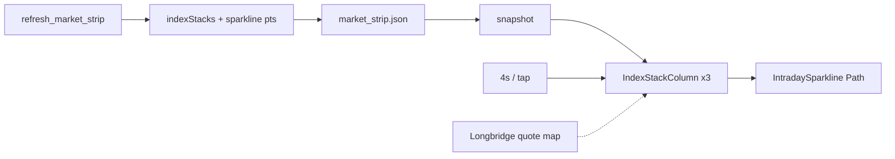

# Index Card Stack and Intraday Sparkline - Plan

## Goal Capsule

- **Objective:** 今日看盘第二行三列指数卡改为**卡片堆叠 + 自动轮播 + 轻点切换**，每张卡增加**当日 1 分钟收盘折线**；列重组为 A 股主板/成长板/港股，本行不再放纳指。
- **Product authority:** Product Contract（ce-brainstorm）。
- **Open blockers:** None。
- **Product Contract preservation:** Product Contract unchanged; planning adds data sources, stack model, and units.

---

## Product Contract

### Summary

Solo desk operator 在今日看盘第二行看到三列「堆叠卡」：主卡显示当前指数的名称、现价、涨跌%、当日分时 sparkline；列内多指数自动轮播，点一下切下一张。列 1 上证/深成指/北证50，列 2 科创综指/创业板指，列 3 恒生/恒生科技。

### Problem Frame

- 现 `MarketIndexRow` 仅三张静态卡（上证 / 纳指 / 恒生），无法在不扩行宽的情况下展示更多 A/港指数。
- 卡片无分时形态，盘中难一眼看走势。

### Key Decisions

- **KD1.** 自动轮播 + 轻点切下一张；三列独立；默认间隔 **4s**。
- **KD2.** 列组成：
  - 列1：`000001.SH` 上证 · `399001.SZ` 深成指 · `899050.BJ` 北证50  
  - 列2：`000680.SH` 科创综指 · `399006.SZ` 创业板指  
  - 列3：`HSI` 恒生 · `HSTECH` 恒生科技（代码以探通为准）  
- **KD3.** 本行不展示纳斯达克。
- **KD4.** 卡面：名 · 现价 · 涨跌% · 当日 1m 收盘折线。
- **KD5.** 无分时：价区仍在，sparkline 空/灰。
- **KD6.** 轮播点按后重置该列计时。

### Actors / Flows / Requirements

- A1–A2, F1–F3, R1–R8, AE1–AE4, S1–S3 as brainstormed.

### Scope Boundaries

**In:** 第二行堆叠 UI；名单；1m sparkline；独立轮播+点击。  
**Deferred:** 纳指回本行；自定义名单；全屏分时；下钻详情。  
**Outside:** 交易；改跑马灯/隔夜美股。

### Dependencies / Assumptions

- **A1.** 北证 = 北证50；科创 = 科创综指。
- **A2.** 恒生科技代码默认 `HSTECH`；`index_global` 若空则试备用代码或 yfinance `^HSTECH` / 等价，失败则该层仅日线无 sparkline。

### Sources / Research

- `MarketIndexRow` / `market_strip.indices`
- Bridge `intraday-bars`（陆股通指数可路由 Longbridge；CLI 无 token 时 `auth_failed`）
- 日线：A 股 `index_daily` 已验证；HSI `index_global` ok
- 项目有 `akshare` / `yfinance` 可作分时或日线后备

---

## Planning Contract

### Summary (implementation)

1) 把 `market_strip.indices` 从「三扁平指数」改为**三列堆叠定义**（或新增 `indexStacks` 字段保留兼容）。2) 刷新脚本为每层拉日线价 + 尽力拉当日 1m 收盘序列。3) Swift 用 `IndexStackColumn`：Timer 轮播 + tap + `IntradaySparkline`（SwiftUI `Path`）。4) 可选 Longbridge quote 叠层现价。

### Key Technical Decisions

- **KTD1. 数据模型：`indexStacks` 优先于改扁平 `indices`**  
  ```text
  indexStacks: [
    { id: "main", items: [ IndexQuote & sparklinePts? ] },
    { id: "growth", items: [...] },
    { id: "hk", items: [...] }
  ]
  ```  
  保留 `indices` 为 stacks 的「当前顶层」扁平快照（兼容旧逻辑），或仅改 Swift 写死 stacks 而价从 strip/board 查表——**推荐 strip 写出 `indexStacks`**，单一真源。

- **KTD2. 价源**  
  - A 股/北证：Tushare `index_daily`（已在 strip board 路径）。  
  - HSI：`index_global`。  
  - HSTECH：先 `index_global`，失败 yfinance 符号探表（实现期锁一个成功码）。  
  - Live overlay：`RealtimeMerge` 对 `.SH/.SZ` 与现有 map 对齐；`.BJ`/港股不强行 live。

- **KTD3. 分时 1m 序列**  
  - **A 股指数：** 优先 bridge/Longbridge `intraday-bars`（有凭证时）；失败则 **akshare 东财指数分钟**（`index_zh_a_hist_min_em` 或等价，实现期锁定 API 名）；再失败 `sparkline: []`。  
  - **港股：** 尽力 yfinance 1m（若有）；失败空线。  
  - 存储：可内嵌于 strip JSON `sparkline: [{t, c}, ...]` 降采样 ≤120 点，或 app 按需拉。**MVP：refresh 写入 strip**，避免 Dashboard 一次 7 路并发。  
  - 折线基准：相对序列**第一点**的涨跌色（简单稳定）；或相对昨收若 strip 有 prevClose——实现选一并单测。

- **KTD4. UI**  
  - `IndexStackColumn`：`@State page` + `TimelineView`/`Timer.publish` 4s；`onTapGesture` 递增。  
  - 堆叠视觉：背后 1–2 层小偏移/缩放（opacity），主卡完整。  
  - `IntradaySparkline`：固定高度 ~36pt，`Path` 线 + 可选 fill；无数据灰虚线框。  
  - **不**复用全量 `ChartWebView`（过重）。

- **KTD5. 纳指**  
  从第二行移除；不写入 stacks。

### High-Level Technical Design



### Implementation Units

### U1. `indexStacks` 配置 + refresh 写价

**Goal:** strip 含三列堆叠的日线价。

**Requirements:** R1–R2, KD2–KD3, AE4

**Files:**
- Modify: `scripts/refresh_market_strip.py`
- Optional: `scripts/index_stack_universe.py`
- Test: `kss/tests/test_index_stack_universe.py`

**Approach:** 固定三列成员；逐 code 拉日线/全球指数；组装 `indexStacks`。

**Test scenarios:** 列成员顺序；无纳指；缺数层 skip 但列可空数组。

**Verification:** JSON 三列非空（视源）。

---

### U2. 当日 1m sparkline 写入 strip

**Goal:** 每层尽量带 sparkline 点列。

**Requirements:** R4–R5, R7, AE3

**Dependencies:** U1

**Files:**
- Modify: `scripts/refresh_market_strip.py`（或 `scripts/fetch_index_sparklines.py` 被 refresh 调用）
- Test: 纯函数 downsample / 空序列

**Approach:** 对 A 股 code 试分钟 API；失败 `[]`。点数上限 ~120。

**Test scenarios:** downsample 长度；空输入。

**Verification:** 至少一个 A 股指数 sparkline 非空（有源时）。

---

### U3. Swift 模型 + `IndexStackColumn` + sparkline

**Goal:** Dashboard 第二行堆叠 UI。

**Requirements:** R1–R6, R8, AE1–AE2, AE4

**Dependencies:** U1–U2

**Files:**
- Modify: `Sources/KSSDesktop/Models/KSSModels.swift`
- Modify: `Sources/KSSDesktop/Views/DashboardView.swift`（替换 `MarketIndexRow`）
- Optional: `Sources/KSSDesktop/Support/IntradaySparkline.swift`
- Test: 可选纯布局无测 / decode fixture

**Approach:**
- Decode `indexStacks`。
- 三列 `IndexStackColumn`；轮播 4s + tap。
- Live 价：若 `quotes` 命中 code 则 overlay。

**Test scenarios:** decode；轮播逻辑可用纯函数测 `nextIndex`。

**Verification:** 真机 AE1–AE2、AE4。

---

### U4. 刷新链路与降级说明

**Goal:** 分时/价随 strip 刷新更新。

**Requirements:** R7, AE3

**Dependencies:** U1–U3

**Files:**
- Confirm: `run_update_data_daily.sh` 已调 `refresh_market_strip`
- Docs: 计划内 asof 行为

**Approach:** 不新增 cron；Dashboard 刷新 snapshot 即更新。Sparkline 非盘中 tick 级。

**Test expectation:** none — 配置/接线；smoke 手动。

**Verification:** 刷新后卡面数字/线更新。

---

## Verification Contract

- strip 含三列 stacks，无纳指。
- UI 轮播+点击；sparkline 有数/无数降级正确。
- A 股 marquee/隔夜美股不受影响。

## Definition of Done

- R1–R8；AE1–AE4。
- 不引入全页 Web 图。

## Risks

| Risk | Mitigation |
|------|------------|
| 指数 1m API 不稳 | 多层回退；空线 |
| HSTECH 代码 | 探表 + yfinance |
| 轮播分散注意力 | 4s；点按可控 |
| BJ 无 live | 日线即可 |

## Deferred to Implementation

- 精确 HSTECH / 分钟 API 函数名。
- 堆叠阴影像素。
- Longbridge 对指数 1m 的覆盖面。

## Sequencing

U1 → U2 → U3 → U4。

## Appendix: Research notes

- 2026-07-10：`index_daily` 对 000001/399001/899050/000680/399006 ok；HSI `index_global` ok；`HSTECH` 初探 empty。  
- `intraday-bars 000001.SH` 无 Keychain 时 auth_failed；app 内可有凭证。  
- Sparkline 必须有无凭证时的 akshare/yfinance 后备，否则盘后演示全灰。
