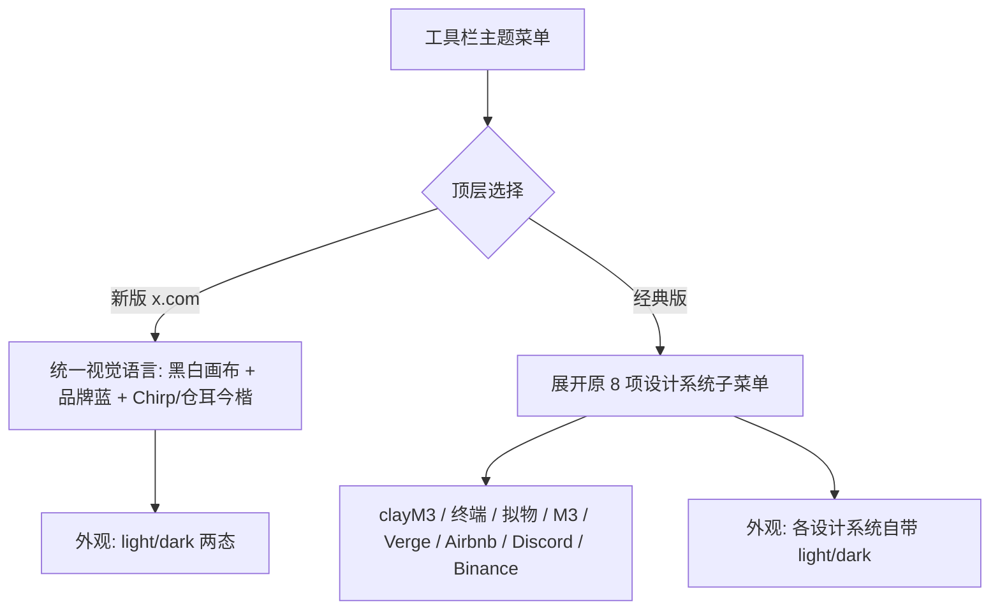
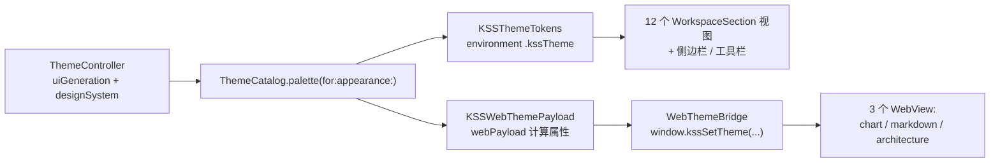

# KSSDeck x.com 设计重构 - Plan

## Goal Capsule

- **Objective:** 为 KSSDeck 新增一套基于 x.com 视觉规范的固定设计语言("新版"),与现有 8 选 1 经典设计系统并存,用户可在工具栏整体切换。
- **Product authority:** 用户本人(KSSDeck 唯一使用者与决策者)。
- **Open blockers:** 无——本轮 brainstorm + planning 对话已澄清主要分歧点(架构定位、布局壳、字体分工、组件整合范围、语义色豁免),Chirp 与仓耳今楷字体文件均已就绪。

## Product Contract

### Summary

KSSDeck 新增一套 x.com 视觉规范驱动的固定设计语言(黑白画布 + 品牌蓝 `#1D9BF0` + Chirp 字体 + hairline 分隔 + pill 组件 + x.com 导航视觉细节),与现有 8 选 1 经典设计系统完整并存。工具栏主题菜单顶层变为"新版/经典版"二选一,一次性覆盖全部 17 个视觉面(12 个工作区 + 3 个 WebView + 侧边栏/工具栏)。

### Problem Frame

现有 8 套设计系统(clayM3/终端/拟物/M3/Verge/Airbnb/Discord/Binance)都是 M3 派生的色板变体,给用户提供了广度,但没有一套视觉足够克制、信息密度足够高、又有清晰品牌识别度的"主打"皮肤。

x.com 的近纯黑/白单色画布 + 单一饱和强调色 + hairline 分隔的视觉语言,恰好是这种克制感的现成范式。但 x.com 本身是社交 feed 产品(三栏布局、中心列定宽 ~600px、极简语义色),而 KSSDeck 是密集金融看板(12 个工作区、表格与 K 线图需要全宽、涨跌色和多语义状态徽章是核心可读性依赖)——直接照搬会牺牲信息密度和金融语义清晰度。

### Key Decisions

- **KD1 — 新增而非替换。** "新版"是与现有 8 选 1 经典系统完整并存的新增分支,8 套设计系统各自的视觉表现与外观模式均不受影响(不改变任何一套经典主题的颜色/圆角/行为)。用户在工具栏顶层二选一。*(实现上 xcom 复用同一个 `KSSDesignSystem` 枚举新增第 9 个 case,见 Planning Contract KTD1——"代码结构完全不动"不成立,但既有 8 套的视觉与行为保持不变。)*
- **KD2 — 布局壳不变,只借导航视觉细节。** 不采用 x.com 的三栏 shell 与 ~600px 定宽内容列;保留现有侧边栏 + 详情两栏密集布局,详情区(表格、K 线图)保持全宽自适应。侧边栏只在"新版"下引入 x.com 式导航视觉(选中项用图标填充表达,而非背景色块)。
- **KD3 — 金融语义色与板块分类色豁免于单一强调色规则。** x.com 规定每屏只保留一个交互强调色(品牌蓝),但涨跌色(红涨/绿跌)、状态徽章多语义色、以及 FlowChips/卡片里用于板块分类扫读的分类色,都是 KSSDeck 的核心可读性依赖——collapse 成单一蓝色会让板块扫读失去区分度。"新版"下这三类继续使用现有 M3 语义色板,不受该规则约束。
- **KD4 — 双字体分工,不是全局替换。** 中文文本新引入仓耳今楷 TsangerJinKai02(现状态是系统默认中文字体栈,TsangerJinKai02 目前不在代码库里,是新增字体资源,与 Chirp 走同样的引入路径;用户已提供 `仓耳今楷02-W02.ttf` 单一字重);英文文本使用 Chirp 字体家族(Regular/Medium/Bold/Heavy 四个字重,已提供 woff 文件),按语言分工混排。
- **KD5 — 组件只换视觉取值,不整合结构。** 现有 9 个独立 Card 类型(RecommendationCard/BacktestCard/StockReviewCard 等)和 3 套重复 FlowChips 组件,在"新版"下各自更新颜色/圆角/字体等取值,不做共享组件抽取或结构重构——先验证视觉效果,结构清理留到以后。
- **KD6 — "新版"直接复用现有二态外观,无需改动。** KSS 现有 `KSSAppearance` 枚举本来就只有 light/dark 两个 case(没有 Dim/护眼这种第三态),"新版"沿用同一枚举即可,不存在"移除 Dim"这回事。*(Planning 阶段修正:原文误判为需要移除一个不存在的模式,见下方 Product Contract preservation note。)*

### Requirements

**主题架构与切换**
- R1. 工具栏主题菜单顶层新增"新版 x.com / 经典版"二选一;选择"新版"时菜单收起为单一项(无子菜单);选择"经典版"时展开原有 8 项设计系统子菜单,原有切换逻辑与持久化不做任何改动。
- R2. "新版"模式复用现有 `KSSAppearance` 二态外观(light/dark),不新增第三态;"经典版"的外观模式(含各设计系统自定义的 light/dark)不受影响。

**视觉规范应用范围**
- R3. "新版"下视觉语言遵循 x.com 规范:近纯黑(dark)/纯白(light)画布、单一品牌蓝 `#1D9BF0` 作为唯一交互强调色、hairline 分隔替代卡片阴影、pill 形状用于按钮与可交互标签、卡片/媒体统一 16px 圆角。pill 按钮的 hover/pressed 态用 accent 的浅色调 tint 表达(参照 x.com 规范的 8% 强调色底);FlowChips 未选中态维持 hairline 描边、选中态填充 accent。
- R4. "新版"一次性覆盖全部 17 个既有视觉面:12 个 WorkspaceSection 工作区(dashboard/recommendations/watchlist/themes/trends/reviews/newsDigest/backtests/stocks/runbook/aiChat/architecture)、侧边栏与工具栏、以及 3 个 WebView(K 线图/复盘 markdown/架构图)。
- R5. 侧边栏导航在"新版"下采用 x.com 式视觉(选中项以图标填充变化表达,不用背景色块),沿用现有折叠宽度(224/64)与拖拽排序行为;不引入 x.com 的三栏 shell 或 ~600px 定宽内容列,详情区保持全宽自适应密集布局。

**字体**
- R6. 英文文本使用 Chirp 字体家族(已提供的 4 个字重 woff 文件),中文文本使用新引入的仓耳今楷 TsangerJinKai02(已提供 `仓耳今楷02-W02.ttf`),两者按语言分工混排,不互相替代。

**金融语义色**
- R7. 涨跌色(红涨/绿跌)、状态徽章(StatusBadge 多语义色)、以及 FlowChips/卡片里的板块分类色,在"新版"下均不受 x.com "每屏仅一个交互强调色"规则约束,继续使用现有 M3 语义色板,与品牌蓝强调色共存。

**WebView 主题同步**
- R8. 3 个 WebView(chart.html/markdown.html/architecture.html)的 CSS 变量在"新版"下同步为 x.com 调色板与字体栈,通过既有 `window.kssSetTheme` / `KSSWebThemePayload` 桥接机制下发,不新增独立桥接通道。

**组件层**
- R9. "新版"下现有 9 个独立 Card 类型与 3 套 FlowChips 组件各自更新颜色/圆角/字体等视觉取值,组件结构与复用关系不做重构整合。

### Key Flows

- F1. 主题模式切换
  - **Trigger:** 用户点击工具栏"主题"菜单。
  - **Steps:** 顶层显示"新版 x.com / 经典版"单选;选择"新版"直接应用统一 x.com 视觉,菜单不再展开子项;选择"经典版"展开原有 8 项设计系统子菜单,恢复原有多主题选择行为。
  - **Outcome:** 两种模式各自独立的外观选择器——"新版"仅 light/dark,"经典版"沿用各设计系统自带的外观模式。
  - **Covers:** R1, R2, R3

### Scope Boundaries

**Deferred for later**
- 现有 9 个 Card 类型 / 3 套 FlowChips 的结构整合(抽取共享组件)。
- Chirp/TsangerJinKai02 之外的语言字体扩展(如日文)。

**Outside this product's identity**
- 采用 x.com 的三栏布局与 ~600px 定宽内容列——KSSDeck 是密集金融看板,不是定宽阅读流。
- 把"点赞/转发"式社交语义配色扩展到非金融场景。

### Dependencies / Assumptions

- Chirp 字体家族的 4 个字重 woff 文件已由用户提供(`chirp-regular-web.woff` / `chirp-medium-web.woff` / `chirp-bold-web.woff` / `chirp-heavy-web.woff`)。这些是 **WOFF 格式**,原生 SwiftUI 文本渲染需要先转换成 TTF 才能用现有 `CTFontManagerRegisterFontsForURL` 注册;WebView 内容可直接使用 WOFF。见 Planning Contract KTD3。
- 仓耳今楷 TsangerJinKai02 此前不在代码库或本机任何位置,是这次新引入的字体资源(不是"继续使用"一个已存在的基线)。用户已提供 `仓耳今楷02-W02.ttf`(真实 TrueType 格式,单一字重),走 U1 同样的打包+注册路径,不需要像 Chirp 那样先做 WOFF→TTF 转换。
- 现有 8 套设计系统持久化于 `UserDefaults`(`designSystemId` / `appearanceMode`);新增的顶层"新版/经典版"开关的持久化设计见 Planning Contract KTD2。
- 现有 WCAG AA 对比度验证(`ThemeValidation`,覆盖 8×2=16 个组合)扩展到 9×2=18 个组合,新增的 xcom×light / xcom×dark 两组合必须零违规,见 U8。

---

## Planning Contract

**Product Contract preservation:** changed — R2, KD6. 原文假设 KSS 现有外观系统里存在一个"Dim(护眼)"模式需要在"新版"下移除;查代码确认 `KSSAppearance` 枚举本来就只有 light/dark 两个 case,没有第三态。两处已改写为"复用现有二态,无需改动",不改变任何实际行为,只是修正了对现状的错误描述。R1/R3-R9、KD1-5、F1、Scope Boundaries 均保持原样。

### Key Technical Decisions

- **KTD1 — xcom 实现为 `KSSDesignSystem` 的第 9 个 case,而非独立并行架构。** 复用现有 `ThemeCatalog.palette(for:appearance:)`、`ThemeValidation` 对比度校验、`KSSWebThemePayload`/`WebThemeBridge` 全部基建,零新增桥接通道。代价是"8 选 1"这个历史命名不再精确(实际是 9 选 1 里的"经典 8 项"子集),但这只是 UI 文案层面,不影响架构。参考 `Sources/KSSDesktop/Support/ThemeCatalog.swift:343-360`(`theVerge` case)作为最接近的既有写法。
- **KTD2 — 新增两个持久化字段,而非一个。** 除了"新版/经典版"模式开关(`KSSUIGeneration`,新 `UserDefaults` 键)之外,再加一个"上次经典设计系统选择"字段,使切回"经典版"时恢复用户原来选的那套(而不是重置为 `clayM3`)。镜像 `ThemeController.swift` 现有两个字段的四段式写法(声明 `@Published`、init 时 normalize + 立即写回、计算属性、`select` 带 no-op guard)。
- **KTD3 — Chirp 字体走两条独立路径,不做统一转换。** 原生 SwiftUI 文本:WOFF 源文件先转换成 TTF(用 `fontTools` 的 `TTFont` 打开 WOFF、清除 `flavor` 标记后另存为 `.ttf`),再走 `KSSDesktopApp.swift` 现有的 `CTFontManagerRegisterFontsForURL` 注册循环。WebView 文本(chart/markdown/architecture 三个 HTML):直接用原始 WOFF 文件,通过 CSS `@font-face` 声明引用——WebKit 原生支持 WOFF,不需要转换。两条路径分别维护各自格式的字体资源。
- **KTD4 — WebView 主题下发不需要新字段。** `KSSWebThemePayload.colors` 字典是 system-agnostic 的(`ThemeTokens.swift:155-201` 对所有 `KSSDesignSystem` case 统一取值),xcom case 落地后 3 个 HTML 自动通过既有 `window.kssSetTheme` 收到新配色,只需给 3 个 HTML 补 Chirp 的 `@font-face` 声明。
- **KTD5 — 中英混排靠字体级联,不做手动拆分。** 原生 UI 里"600519 贵州茅台"这类中英混排字符串不需要手动拆成多个 `Text`/`AttributedString` font run。用 `CTFontDescriptor` 的 `kCTFontCascadeListAttribute` 给 Chirp 挂一个级联列表、把中文回退字体指定为仓耳今楷,单个 `Text` 渲染时 Chirp 覆盖不到的 CJK 字符会自动走级联到仓耳今楷,而不是操作系统默认的通用中文字体。WebView 侧同理,`font-family` 栈里把 Chirp 排在仓耳今楷/中文字体栈前面即可,CSS 字体栈本身就是级联行为。
- **KTD6 — 品牌蓝 `#1D9BF0` 是权威值,实测确实跌破阈值,已用两处非 accent 调整补齐,不改品牌蓝 hex。** 实测发现 3 类问题而非 1 类:(1) `accent@surface` 光有 canvas 纯白才压线过 3:1,任何比 canvas 暗的 surface 色阶数学上必然更低——浅色模式下把 `surface` 直接设为与 `canvas` 相同的纯白(`#FFFFFF`),牺牲卡片与画布的色阶区分,只靠 hairline 分隔(与 x.com "flat by design,hairline 是唯一深度线索" 的既定基调一致);`surfaceContainer`/`surfaceRaised`/`surfaceHighest` 保留独立色阶,`ThemeValidation` 不检查这几个字段。(2) `onAccent@accent` 白字对 `#1D9BF0` 只有 3.0:1,远不到 4.5:1 阈值——`onAccent` 改用深色(`#00151F`),沿用 binanceUS/tradingTerminal 等"亮色 accent 配深色 onAccent"的既有模式,而不是白字。(3) 暗色模式 `textSecondary` 对 elevated surface 只有 3.876:1——`muted` 从 `#71767B` 换成 x.com 自己 Dim 主题的 `#8B98A5`(同一品牌色板内的更亮次文字色)。

### High-Level Technical Design

xcom 模式下颜色/字体从单一来源(`ThemeCatalog`)分别流向原生视图和 WebView 两条消费路径,新增的 `KSSUIGeneration` 只影响顶层菜单结构和侧栏视觉分支,不改变这条既有数据流的形状:

### Assumptions

- 本机可用 Python `fontTools` 包(或等效工具)做一次性的 WOFF→TTF 转换;这是资产准备步骤,不在 app 运行时进行,不产生运行时依赖。
- xcom case 需要一条新的 `ThemeTypography` 预设(`sans: Chirp` 字体名,`serif` 沿用仓耳今楷),补充在 `ThemeCatalog.swift` 现有的 typography 预设旁边。

### Sequencing

U1(字体转换)→ U2(调色板)→ {U3(持久化), U6(12 屏取值), U7(WebView)} 只依赖 U2 可并行开始 → U3 完成后 {U4(菜单), U5(侧栏)} 可并行 → U8(WCAG 校验,依赖 U2 落地后自动生效,放最后确认)。

---

## Implementation Units

### U1. 字体转换与打包(Chirp + 仓耳今楷)

- **Goal:** 把 4 个 Chirp WOFF 文件转换为 TTF 并注册进原生字体系统(同时保留原始 WOFF 供 WebView 使用);把仓耳今楷 TsangerJinKai02 的 ttf 文件打包+注册进原生字体系统。
- **Requirements:** R6
- **Dependencies:** 无——Chirp 与仓耳今楷的字体文件均已就绪
- **Files:** `Sources/KSSDesktop/Resources/chirp-regular-web.ttf`(新,转换产物)、`chirp-medium-web.ttf`、`chirp-bold-web.ttf`、`chirp-heavy-web.ttf`、原始 `chirp-regular-web.woff` / `chirp-medium-web.woff` / `chirp-bold-web.woff` / `chirp-heavy-web.woff`(用户已提供,供 WebView 使用,原样保留原文件名不重命名)、`Sources/KSSDesktop/Resources/仓耳今楷02-W02.ttf`(用户已提供,真实 TTF,直接拷贝无需转换)、`Package.swift`、`Sources/KSSDesktop/App/KSSDesktopApp.swift`
- **Approach:** 对用户提供的 4 个 `chirp-<weight>-web.woff` 文件,用 `fontTools`(`TTFont(path)` 打开 WOFF,清除 `flavor`,`save()` 为对应的 `chirp-<weight>-web.ttf`)转换;转换产物与原始 WOFF 文件名只有扩展名不同,不做大小写或命名风格改写。仓耳今楷的 `仓耳今楷02-W02.ttf` 已是原生 TTF,直接放进 `Resources/` 不需要转换步骤。`Package.swift` 的 `resources` 列表比照现有 `HarmonyOS_Sans_SC_Bold.ttf` 那行,追加 4 条 `.copy("Resources/chirp-<weight>-web.ttf")`、4 条 `.copy("Resources/chirp-<weight>-web.woff")`、1 条 `.copy("Resources/仓耳今楷02-W02.ttf")`;`KSSDesktopApp.swift` 里 `registerBundledFonts()` 的 `for name in [...]` 数组追加 4 个 `chirp-<weight>-web` ttf 文件名 + `仓耳今楷02-W02`(与 `HarmonyOS_Sans_SC_Bold` 同一循环)。
- **Test scenarios:**
  - 应用启动后 4 次 Chirp `CTFontManagerRegisterFontsForURL` 调用 + 1 次仓耳今楷调用全部成功,Console 无 "字体缺失"/"字体注册失败" 日志。
  - `NSFontManager.shared.availableFonts` 能枚举到 4 个 Chirp 字重和仓耳今楷的 PostScript 名。
  - 故意删除一个字体文件重新构建:日志按现有 `guard`/`NSLog` 防御路径打印警告,不 crash(边界情况,复用现有防御逻辑)。
- **Verification:** 启动 app 查看 Console 日志确认全部注册成功;在 xcom 模式下英文标题确认渲染字体是 Chirp,中文文本确认渲染字体是仓耳今楷(Font Book 或 view debug)。

### U2. `KSSDesignSystem` 新增 xcom case + 调色板

- **Goal:** 在 `KSSDesignSystem` 枚举新增第 9 个 case `xcom`,在 `ThemeCatalog.seed()` 里定义 light/dark 两份 Seed(黑白画布 + 品牌蓝 `#1D9BF0` + hairline + 16px 圆角),新增对应的 `ThemeTypography` 预设(sans 用 Chirp、serif 用仓耳今楷)。
- **Requirements:** R3, R7
- **Dependencies:** U1(typography 预设需要引用已注册的 Chirp 字体名)
- **Files:** `Sources/KSSDesktop/Support/ThemeCatalog.swift`、`Tests/KSSDesktopTests/ThemeCatalogTests.swift`(硬编码断言 `KSSDesignSystem.allCases.count == 8` 与组合数 `16` 需同步改为 `9`/`18`,否则新增 case 后这两个断言会直接失败)
- **Approach:** 参照 `theVerge`(`ThemeCatalog.swift:343-360`)的 Seed 写法:`canvas` dark=`#000000`/light=`#FFFFFF`,`accent`=`#1D9BF0`,`onAccent` 走对比度算出的黑/白,`cardRadius`=16,`chipRadius` 取一个足够大的值模拟 pill(圆角封顶效果);`hairline`/`outlineVariant` 取自 x.com 规范的两套 hex(dark `#2F3336`、light `#EFF3F4`);**不覆盖** `up/down/upFill/downFill/ma5/ma20`——这些继续走 `MarketColors.forAppearance` 共享逻辑(遵循 `ThemeCatalog.swift:230-246` 的既有约束,对应 KD3/R7)。`displayName` 加一条 `.xcom: "x.com"` 分支。typography 预设按 KTD5 给 Chirp 挂 `kCTFontCascadeListAttribute` 级联到仓耳今楷,不做手动字符串拆分。
- **Test scenarios:**
  - `ThemeCatalog.palette(for: .xcom, appearance: .dark)` 与 `.light` 均返回非 nil 且颜色值符合规范(canvas/accent/hairline 精确匹配 hex)。
  - `ThemeValidation.contrastFindings(for:)` 对 xcom×dark 和 xcom×light 两个组合返回空数组(零 WCAG 违规)。
  - `up/down` 等市场色在 xcom 下与其他 8 套系统同一 appearance 下的值完全一致(验证未被 Seed 覆盖)。
  - 中英混排字符串(如"600519 贵州茅台")在单个 `Text` 里渲染:英文/数字走 Chirp,中文字符正确级联到仓耳今楷而非系统默认中文字体。
- **Verification:** 跑一遍 `ThemeValidation.allFindings()`(见 U8)确认新增两个组合无违规。

### U3. 顶层"新版/经典版"模式持久化

- **Goal:** 新增 `KSSUIGeneration`(`classic` / `xcom`)状态和它的持久化,并记住用户上次在"经典版"里选的设计系统,使模式切换不丢失经典版偏好。
- **Requirements:** R1
- **Dependencies:** U2
- **Files:** `Sources/KSSDesktop/Support/ThemeController.swift`、`Sources/KSSDesktop/Support/ThemeCatalog.swift`(`KSSUIGeneration` 枚举定义)
- **Approach:** 新增 `KSSUIGeneration` 枚举(`classic`/`xcom`,带 `normalized(_:)` 静态方法,镜像 `KSSAppearance` 的写法)。`ThemeController` 新增两个 `UserDefaults` 键:`uiGenerationId`(当前模式)、`lastClassicDesignSystemId`(经典版偏好记忆)。`select(generation:)` 逻辑:切到 `.xcom` 时,若当前 `designSystem != .xcom`,先把当前值存进 `lastClassicDesignSystemId` 再把 `designSystem` 设为 `.xcom`;切回 `.classic` 时,从 `lastClassicDesignSystemId` 恢复 `designSystem`(缺失/非法值 normalize 到 `clayM3`)。`select(system:)` 在 `.classic` 模式下行为不变;在 `.xcom` 模式下应被禁用或忽略(经典版子菜单本身在 xcom 模式下不渲染,见 U4)。
- **Test scenarios:**
  - 全新用户(无历史 `UserDefaults`)默认 `uiGeneration = .classic`、`designSystem = .clayM3`。
  - 经典版选 `discord` → 切到 `xcom` → 再切回 `classic`:`designSystem` 恢复为 `discord`,不是 `clayM3`。
  - `uiGenerationId` 存了非法字符串(模拟损坏数据):normalize 到 `.classic`。
  - 连续两次调用 `select(generation: .xcom)`(已经是 xcom):no-op,不重复写 `lastClassicDesignSystemId`(guard 生效)。
- **Verification:** 手动执行"经典 discord → 新版 → 经典"三步,确认 UI 显示的设计系统名称正确还原。

### U4. 工具栏主题菜单重构

- **Goal:** Menu 顶层新增"模式"分组(新版 x.com / 经典版二选一);仅当 `uiGeneration == .classic` 时展开原有"设计系统"8 项子菜单。
- **Requirements:** R1, R2
- **Dependencies:** U3
- **Files:** `Sources/KSSDesktop/Views/ContentView.swift`(`themeMenu`,约 166-197 行)
- **Approach:** 在现有 `Menu` 内容最前面插入 `Section("模式")`,渲染两个 `Button` 分别调用 `themeController.select(generation: .xcom / .classic)`,勾选态对应 `themeController.uiGeneration`。原有 `Section("设计系统")`(现有 8 项 `ForEach`)整体包进 `if themeController.uiGeneration == .classic { ... }` 条件。`Section("外观")` 不变(两种模式共用同一枚举,见 R2)。`themeController.summary` 计算属性更新,把当前模式名折进摘要字符串。
- **Test scenarios:**
  - xcom 模式下菜单只显示"模式"+"外观"两个 Section,无"设计系统"子菜单。
  - classic 模式下三个 Section(模式/设计系统/外观)都显示,8 项子菜单勾选态正确。
  - 点击"新版"后菜单响应式收起子项,无需重启 app。
  - `themeController.summary` 在两种模式下都能正确反映当前状态(用于 `.help()`/无障碍标签)。
- **Verification:** 手动点击菜单,确认结构和勾选态符合预期。

### U5. 侧边栏 x.com 导航视觉变体

- **Goal:** `SidebarView` 在 `uiGeneration == .xcom` 时,导航项选中态改为图标填充变化(而非现有背景色块),折叠宽度(224/64)与拖拽排序行为不变。
- **Requirements:** R5
- **Dependencies:** U3
- **Files:** `Sources/KSSDesktop/Views/SidebarView.swift`
- **Approach:** 选中态渲染按 `uiGeneration` 分支:经典模式沿用 `navRow(_:)` 现有的 `.background(isOn ? theme.accent : Color.clear, in: RoundedRectangle(cornerRadius: KSSTheme.shapeS))` 高亮块;xcom 模式下不铺背景色,图标改用 `.symbolVariant(.fill)` 实心变体 + label 字重加粗,与 x.com "选中项图标填充变化" 的规范一致。执行前先过一遍侧栏实际用到的 SF Symbols 图标集,确认每个都有实心变体;个别没有实心对应图标的,单独准备一份实心资源,不与 `.symbolVariant(.fill)` 混用不一致的兜底方式。`sidebarCollapsed` 折叠逻辑和 `DropDelegate` 拖拽排序不受影响。
- **Test scenarios:**
  - xcom 模式下选中项无背景色块、图标呈实心态;非选中项图标保持线框态。
  - classic 模式行为与改动前完全一致(回归测试)。
  - 折叠态(64pt 图标栏)下 xcom 视觉同样生效,无残留背景块。
  - 拖拽排序在两种模式下都能正常工作(不受选中态视觉分支影响)。
- **Verification:** 两种模式来回切换并截图对比侧栏选中态,确认折叠/展开两种宽度下都符合预期。

### U6. 12 个工作区的视觉取值改造

- **Goal:** 12 个 `WorkspaceSection` 视图(dashboard/recommendations/watchlist/themes/trends/reviews/newsDigest/backtests/stocks/runbook/aiChat/architecture)、9 个独立 Card 类型、3 套 FlowChips 在 xcom 模式下的圆角/hairline/字体/pill 取值全部来自 U2 定义的调色板。
- **Requirements:** R3, R4, R7, R9
- **Dependencies:** U2
- **Files:** `Sources/KSSDesktop/Views/DashboardView.swift`、`Views/IntelView.swift`、`Views/ReviewsView.swift`、`Views/StockBrowserView.swift`,以及其余 `WorkspaceSection` 对应视图文件
- **Approach:** 逐屏走查:大多数视图已经通过 `.kssCard()` / 环境注入的 `theme` token 取色,U2 落地后应自动生效,无需改代码;重点排查是否存在硬编码颜色字面量或专属某设计系统的残留效果(如 `skeuomorphism` 的阴影/高光),这些改为读 token。9 个 Card 类型与 3 套 FlowChips 按 KD5/R9 只改颜色/圆角/字体的取值引用,不做结构整合。
- **Test scenarios:**
  - 12 屏在 xcom×dark 与 xcom×light 下逐一巡查:pill 按钮圆角=9999,卡片圆角=16,hairline 可见且颜色正确,画布为纯黑/纯白。
  - 涨跌色、状态徽章多语义色(`StatusBadge`)、板块分类色在 xcom 模式下保持不受"单一强调色"规则影响,与品牌蓝共存(视觉回归,对应 R7)。
  - 9 个 Card 类型和 3 套 FlowChips 各自巡查一遍,确认圆角/字体/hairline 跟随新 token(非结构性改动)。
  - pill 按钮 hover/pressed 态呈现 accent 浅色调 tint;FlowChips 未选中态 hairline 描边、选中态 accent 填充,两态视觉区分清晰。
- **Verification:** 12 屏(light+dark 各一次)截图,与 x.com 规范清单(黑白画布/单一强调色/hairline/pill/16px 圆角)逐条核对。

### U7. WebView 主题同步扩展

- **Goal:** 3 个 HTML(chart/markdown/architecture)在 xcom 模式下通过既有 `window.kssSetTheme` 收到 x.com 调色板,并新增 Chirp 的 `@font-face` 声明。
- **Requirements:** R6, R8
- **Dependencies:** U2
- **Files:** `Sources/KSSDesktop/Resources/chart.html`、`Resources/markdown.html`、`Resources/architecture.html`
- **Approach:** `KSSWebThemePayload.colors` 是 system-agnostic 字典(见 KTD4),U2 落地后 3 个 HTML 通过既有 `applyThemePayload`/`kssSetTheme` 管线自动收到新配色,Swift 侧桥接代码(`WebThemeBridge.swift`)不需要改动。3 个 HTML 各自补一段 `@font-face { font-family: "Chirp"; src: url(...) format("woff"); }`(4 个字重各一条),`body`/相关选择器的 `font-family` 在英文场景下加入 `Chirp` 到字体栈最前面(中文字符仍走仓耳今楷/系统中文字体)。
- **Test scenarios:**
  - 3 个 WebView 在 xcom×dark 与 xcom×light 下,通过 `kssSetTheme` 切换后背景/文字/hairline 颜色正确应用。
  - K 线图涨跌色(`up`/`down`)在 xcom 模式下与经典模式同一 appearance 下取值一致,不受 accent 规则影响。
  - markdown 渲染的英文文本使用 Chirp,中文文本仍走仓耳今楷/系统中文字体栈(不被 Chirp 覆盖)。
- **Verification:** 3 个 WebView 手动触发主题切换并截图,确认颜色与字体符合预期。

### U8. WCAG AA 对比度校验扩展

- **Goal:** 确认 `ThemeValidation.allFindings()` 覆盖新增的 xcom×light / xcom×dark 两个组合且零违规。
- **Requirements:** R3
- **Dependencies:** U2
- **Files:** 无新增文件(`ThemeValidation` 本身是 `allCases` 遍历,U2 落地后自动覆盖新组合)
- **Approach:** 运行 `ThemeValidation.allFindings()`;若 xcom 的两个组合出现违规,回到 U2 调整 Seed 里的具体 hex 值直到 4.5:1(文字)/ 3.0:1(accent/图表色)/ 1.18:1(hairline)等既有阈值达标,不新增校验代码。
- **Test scenarios:**
  - `allFindings()` 遍历全部 9×2=18 组合,xcom 的两个组合返回空 `Finding` 数组。
  - `upDownDistinct(for:)` 对 xcom 两个组合返回 true(涨跌色可区分)。
- **Verification:** 本机无完整 Xcode(仅 CommandLineTools,`swift test` 跑不了 XCTest),按既有验证方式用 `swiftc` 单独编译一个小 driver 跑 `ThemeValidation.allFindings()`(参照 `docs/qa/kssdesktop-theme-matrix/` 里记录的既定验证路径)。

---

## Verification Contract

| 验证项 | 命令/方式 | 适用单元 |
|---|---|---|
| 编译通过 | `swift build` | 全部 |
| 主题矩阵零 WCAG 违规 | `swiftc` 独立编译 driver 跑 `ThemeValidation.allFindings()`(本机无 Xcode,`swift test` 不可用) | U2, U8 |
| 运行时冒烟 | `./script/build_and_run.sh --verify`(如已存在,参照既有主题矩阵验证方式) | U1, U3, U4, U5 |
| 视觉核对 | 12 屏 + 3 WebView 在 xcom×light / xcom×dark 下截图,与 x.com 规范清单逐条核对(画布/强调色/hairline/pill/圆角) | U5, U6, U7 |
| 字体注册核对 | 启动 app 查看 Console 日志确认 4 次 Chirp + 仓耳今楷注册成功 | U1 |
| 回归 | classic 模式下 8 套设计系统的视觉与切换行为与改动前一致 | U3, U4, U5 |

## Definition of Done

- xcom case 通过 `ThemeValidation.allFindings()` 零违规(U2, U8)。
- 4 个 Chirp 字重 + 仓耳今楷成功注册,原生 UI 与 3 个 WebView 都能正确渲染(WebView 走 WOFF,原生走转换后的 TTF/原生 ttf-otf)(U1, U7)。
- 工具栏主题菜单在 xcom/classic 两种模式下结构和勾选态符合 U4 的测试场景(U4)。
- 侧边栏在 xcom 模式下选中态改为图标填充,classic 模式行为无变化(U5)。
- 12 个工作区 + 9 个 Card 类型 + 3 套 FlowChips 在 xcom×light/dark 下视觉核对通过,涨跌色/状态徽章多色系不受单一强调色规则影响(U6)。
- 模式切换(classic ↔ xcom)在应用重启后仍保持各自的持久化状态,且切回 classic 能恢复用户上次选的经典设计系统(U3)。
- classic 模式下原有 8 套设计系统的视觉与行为回归测试无变化。
- 仓库里只保留最终会被 app 使用的字体资源(转换产物 `.ttf` + 原始 `.woff`),`fontTools` 转换过程本身不产生额外中间文件,若实际操作中产生了临时文件不留在仓库里(清理标准)。
