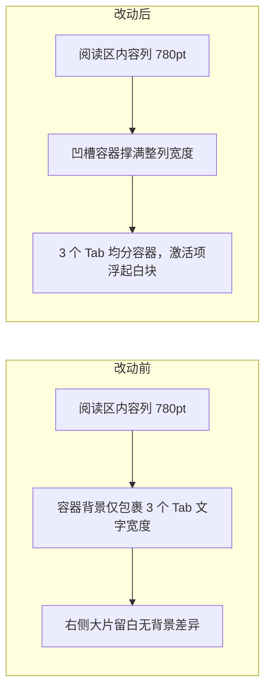

# Intel Radar Tab Affordance - Plan

## Goal Capsule

- **Objective:** 资讯雷达页面两处伪装成标签的切换控件（12 赛道选择行、投研改写/中文改写/原文阅读切换）改为分段控件视觉，让选中态清楚传达"这是切换器"而非一串并列标签。
- **Product authority:** Product Contract below.
- **Open blockers:** None.
- **Product Contract preservation:** changed — (1) KD3 / R6 / Dependencies / Success Criteria 的主题数量从"8 套"更正为代码库当前实际的 9 个设计系统 × 2 种外观（含 xcom）= 18 组调色板组合，已用 `Tests/KSSDesktopTests/ThemeCatalogTests.swift` 核实；(2) ce-doc-review 的 feasibility/coherence 两个独立 reviewer 都发现并经本仓库 `ThemeCatalog.swift` 逐一核实：浮起块用 `theme.surface` 的假设在暗色主题下方向错误（xcom 暗色下 `surface` 与 `surfaceContainer` 数值完全相同），已改为按外观分支取色（见 Planning Contract › KTD2），R6 措辞随之调整；(3) 新增 R7（无障碍：激活项暴露"已选中"状态），源自 design-lens reviewer 的发现，是与本次目标直接对齐的小范围补充。R1-R5、KD1-KD2、Scope Boundaries 原样保留。

---

## Product Contract

### Summary

把资讯雷达（IntelView）里两处切换控件——12 赛道选择行与投研改写/中文改写/原文阅读切换——统一为分段控件（segmented groove）视觉：整行套一层浅色凹槽背景，激活项变成凹槽内浮起的白色块；阅读区凹槽撑满内容列宽度，不再是紧贴文字的窄条。

### Problem Frame

资讯雷达当前用独立描边+背景色的胶囊按钮表示 12 赛道选择和阅读模式切换，视觉上和 App 里其它纯展示性标签（Capsule 徽章/标签）用的是同一套语言，用户扫一眼分不清"这是可切换的导航"还是"一串并列的标签"，影响对整个页面布局层次的理解。阅读区的三个 Tab 容器背景（`theme.surfaceContainer.opacity(0.65)`）只包住文字紧凑宽度，缺 `.frame(maxWidth: .infinity)`，导致选中框在页面上像一小块孤立的灰色补丁，进一步削弱"这是一整条切换器"的读法。

### Key Decisions

- **KD1. 视觉方向：分段控件（Segmented Groove）。** 整行套一层浅色凹槽容器背景，激活项变成凹槽内浮起的实色/白色块。与 App 里 RecommendationsView / ReviewsView 已使用的原生 `.pickerStyle(.segmented)` 视觉逻辑保持一致；这两处仍需自定义 View 实现，因为原生 Picker 放不下赛道色点和数量角标。
- **KD2. 赛道识别方式让位于统一视觉。** 从"按赛道整块着色背景"改为"白块激活态 + 左侧色点"，接受牺牲按赛道整块着色的识别方式——色点 + 文字已足够区分当前赛道。
- **KD3. 必须跨全部主题组合成立。** 两处新视觉复用现有主题 token（`chipRadius`、`surfaceContainer` 等），不写死颜色，确保在 `KSSDesignSystem` 全部 9 个设计系统 × 2 种外观（亮/暗，含 xcom）= 18 组调色板下都有可读对比度，不只是为当前截图这一套主题调好看。

### Requirements

**12 赛道选择行**
- R1. 12 赛道选择行的选中态和未选中态包裹在同一个可见的凹槽容器背景内，容器在横向滚动区域内正确渲染、不被裁切。
- R2. 激活赛道显示为凹槽内浮起的块，与非激活项之间有清晰的层次差异，不再使用按赛道着色的背景色块。
- R3. 每个赛道项保留左侧色点和右侧数量角标，作为赛道识别信号。

**投研改写 / 中文改写 / 原文 阅读切换**
- R4. 阅读切换的凹槽容器背景撑满阅读区可用宽度（对齐现有 780pt 内容列），不再是仅包住文字的窄条。
- R5. 激活 Tab 显示为凹槽内浮起的块，视觉逻辑与 R2 的赛道选中态一致。

**跨主题一致性**
- R6. 两处新视觉复用现有主题 token（圆角、容器背景色、浮起层次色阶等），在 `KSSDesignSystem` 全部 9 个设计系统 × 2 种外观（18 组调色板，含 xcom）下渲染正确，不写死颜色值。

**无障碍**
- R7. 激活项（赛道 pill / 阅读 Tab）在辅助功能树里暴露"已选中"状态，让 VoiceOver 用户也能感知到这是一组切换器而非并列标签，不只是视觉上的浮起块。

### Scope Boundaries

- 只调整这两处控件的视觉呈现，不改变切换行为、数据来源，或资讯雷达页面的整体信息架构。
- 不涉及原生 segmented picker / 菜单 / 卡片选择器所在的其它页面（推荐、复盘、趋势观察、主题菜单等）——已排查，选中态已清晰，不在本次范围内。
- 不做方向键在组内跳转的键盘导航（原生 `NSSegmentedControl` 具备，自定义 `Button` 列表默认没有）；`Button` 本身仍可通过 Tab/Space/Return 操作，R7 只加"已选中"状态播报，不改键盘交互模型，留待后续单独评估。

### Dependencies / Assumptions

- 依赖 `Sources/KSSDesktop/Views/IntelView.swift` 中现有的 `trackPills`（第 342-356 行）、`trackPillLabel`（第 358-381 行）与 `readerTabBar`（第 512-547 行）实现作为改动起点。
- 假设 `Sources/KSSDesktop/Support/ThemeCatalog.swift` 全部 9 个设计系统 × 2 种外观下的 `chipRadius`、`surfaceContainer`、`surface`、`surfaceRaised` 等现有 token 足够表达"凹槽 + 浮起块"的视觉，不需要新增 token（具体每种外观下的取色方案见 Planning Contract › KTD2）。若某套主题下对比度仍不够，作为 Open Question 交给下一轮，不阻塞其余主题落地。

### Success Criteria

- 在默认主题、至少一套深色主题、以及 xcom（`chipRadius = 999`，全胶囊圆角边界场景）下手动核对，凹槽容器和浮起块都有可辨认的边界/对比度，不依赖用户猜测哪块是"选中"。
- 阅读区凹槽在窗口收窄时仍正确撑满可用宽度（不因固定宽度换算出现裁切或错位）。

### Sources / Research

- `Sources/KSSDesktop/Views/IntelView.swift:342-381`（trackPills 实现）
- `Sources/KSSDesktop/Views/IntelView.swift:512-547`（readerTabBar 实现，容器背景缺 `.frame(maxWidth: .infinity)`）
- `Sources/KSSDesktop/Models/KSSModels.swift:277-289`（`IntelReaderTab` 枚举定义）
- 已排查确认不需要同步改动的页面：`Sources/KSSDesktop/Views/RecommendationsView.swift:68-76`（原生 `.pickerStyle(.segmented)`）、`Sources/KSSDesktop/Views/ReviewsView.swift:108-119`（Menu 下拉，勾选态明确）、`Sources/KSSDesktop/Views/ReviewsView.swift:650-660`（原生 `.pickerStyle(.segmented)`）、`Sources/KSSDesktop/Views/TrendsView.swift:218-260`（卡片式选择器，边框选中态清晰）、`Sources/KSSDesktop/Views/ContentView.swift:165-203`（主题 Menu，勾选态明确）。
- `Sources/KSSDesktop/Support/ThemeTokens.swift:14-18`（`surfaceContainerLowest → surface → surfaceContainer → surfaceRaised → surfaceContainerHighest` 色阶定义，凹槽/浮起块的色阶来源）
- `Sources/KSSDesktop/Support/ThemeCatalog.swift:314-483`（9 个 `KSSDesignSystem` 逐一的 `chipRadius` 取值，xcom 为 999 即全胶囊圆角）
- `Tests/KSSDesktopTests/ThemeCatalogTests.swift:8-19`（`testAllSixteenCombinationsResolve` 确认 9 设计系统 × 2 外观 = 18 组合，及必需 role 不透明的约束）
- `docs/solutions/kss_desktop_swiftui_design_system.md`（本仓库 SwiftUI/macOS 自定义设计系统的已知坑，本次改动未触发其中列出的系统容器接管问题，仅供背景参考）

---

## Planning Contract

### Key Technical Decisions

- **KTD1. 共用样式收敛为 `IntelView.swift` 内的私有 helper，不做成跨文件组件。** 12 赛道行与阅读切换共用同一段"凹槽背景 + 浮起块激活态"逻辑，避免复制两份产生视觉漂移；但当前仅这两处需要它，不值得升格为可在其他页面复用的独立组件（对应 Scope Boundaries 的排查结论）。
- **KTD2. 色阶按外观分支选取，不新增 token。** 凹槽背景两种外观下都用 `theme.surfaceContainer`（横向滚动区域内需要更低对比时可退到 `surfaceContainerLowest`）。浮起块**必须按外观区分**：亮色下用 `theme.surface`，暗色下用 `theme.surfaceRaised`——**不是**同一个 `theme.surface` 通吃两种外观。逐一核对 `ThemeCatalog.swift` 里 9 个设计系统的 Seed 取值：亮色下 `surface` 恒亮于 `surfaceContainer`（多数是纯白 `0xFFFFFF`）；但暗色下 `surface` 普遍不比 `surfaceContainer` 亮，xcom 暗色下两者十六进制值完全相同（`0x16181C`），若浮起块沿用 `surface` 会在暗色主题下和凹槽融成一片；改用 `surfaceRaised` 后，9 套暗色 Seed 下 `surfaceRaised` 均严格亮于 `surfaceContainer`（如 xcom 暗色 `surfaceRaised=0x1E2732` vs `surfaceContainer=0x16181C`），方向正确。
- **KTD3. 阅读区改用等宽 `.frame(maxWidth: .infinity)` 撑满，替代原有尾部 `Spacer(minLength: 0)` 写法。** 这是 R4（凹槽撑满 780pt 内容列）在实现层面唯一需要的结构调整；12 赛道行本身是横向可滚动列表，不套用等宽撑满，只需在滚动内容外包一层凹槽背景（凹槽随内容一起滚动，宽度取决于内容总宽而非固定撑满可视区）。
- **KTD4. 验证方式为手工跨主题目视核对，不引入自动化快照测试。** `Tests/KSSDesktopTests` 目前只覆盖业务逻辑（数据合并、主题色阶完整性等），没有 SwiftUI View 快照测试基础设施；为这一次纯样式改动引入快照框架超出范围，验证收敛为 U3 的手工跨主题核对。
- **KTD5. 不新增 hover 态，沿用 `Button` 默认交互反馈。** 移除按赛道着色的背景后，未激活项在 macOS 指针悬停时不额外加色，依赖系统默认的按钮反馈；不在本次范围内设计专门的 hover 视觉。

### Assumptions

- 亮色下 `surface` 恒亮于 `surfaceContainer`、暗色下 `surfaceRaised` 恒亮于 `surfaceContainer`，已对全部 9 个设计系统的两种外观逐一核对 `ThemeCatalog.swift` 的 Seed 取值确认成立（不再是待验证假设，见 KTD2）；U3 仍需目视复核浮起块与凹槽在实际渲染下的可辨识度是否"看起来"够，而不仅是十六进制数值更亮。
- xcom 设计系统的 `chipRadius = 999`（全胶囊圆角）在浮起块套用同一 `chipRadius` 时不会因为窄间距挤出裁切或形状冲突；U3 专门核对这个边界场景。

### Implementation Sequencing

U1 → U2（阅读切换复用 U1 引入的 helper）→ U3（两处都改完后统一做跨主题核对）。三个单元线性依赖，无需拆分阶段。

---

## Implementation Units

### U1. 提取共用分段样式 helper，迁移 12 赛道选择行

- **Goal:** 在 `IntelView.swift` 内引入一个私有的"凹槽背景 + 浮起块激活态"样式 helper，并把 `trackPills` / `trackPillLabel` 迁移到新样式，赛道识别只保留左侧色点 + 数量角标。
- **Requirements:** R1, R2, R3, R6, R7（KD1, KD2, KTD1, KTD2, KTD5）
- **Dependencies:** None
- **Files:**
  - `Sources/KSSDesktop/Views/IntelView.swift`（`trackPills` 第 342-356 行、`trackPillLabel` 第 358-381 行；新增私有 helper）
- **Approach:**
  - 新增一个私有 View 或 ViewModifier（"凹槽容器 + 浮起块子项"两层结构：外层 `.background(theme.surfaceContainer, in: RoundedRectangle(cornerRadius: ...))`；内层激活子项按外观取色——亮色 `.background(theme.surface, ...)`，暗色 `.background(theme.surfaceRaised, ...)`（按 KTD2；通过 `colorScheme` 环境值或主题自身的 appearance 状态判断，具体接线方式执行时确定）+ 轻量 `.shadow(...)`），圆角统一取 `theme.chipRadius`（或 `chipRadius` 基础上做小幅收缩以形成"内嵌"层次，具体数值执行时试验确定）。
  - `trackPills` 的 `ScrollView(.horizontal)` 内的 `HStack` 整体包一层凹槽背景（凹槽随内容一起滚动，宽度取决于内容总宽，不强制撑满可视区）。
  - `trackPillLabel` 激活态改为：套用浮起块子项样式，去掉当前 `pillColor.opacity(0.12)` 背景与 `pillColor.opacity(0.35)` 描边；非激活态在凹槽底色上不再单独加背景/描边，也不新增 hover 态（KTD5）。左侧 `Circle().fill(pillColor)` 色点与右侧数量角标保持不变。
  - 激活项按钮加 `.accessibilityAddTraits(.isSelected)`（R7），让 VoiceOver 播报当前赛道为"已选中"。
- **Test scenarios:**
  - Test expectation: none -- 纯 SwiftUI 视觉样式变更，无行为分支；跨主题对比度核对、可访问性核对、功能性回归（点击切换 `activeTrack` 仍生效）都并入 U3 的手工核对。
- **Verification:** `swift build` 编译通过；手工运行 App 到资讯雷达页，确认点击不同赛道 pill 仍正确切换 `activeTrack` 且列表联动无变化（并入 U3 做跨主题版本）。

### U2. 阅读切换迁移到共用样式，撑满阅读区宽度

- **Goal:** `readerTabBar`（投研改写/中文改写/原文）复用 U1 引入的 helper，容器撑满 780pt 阅读列宽度，三个 Tab 等宽分布。
- **Requirements:** R4, R5, R6, R7（KD1, KTD2, KTD3, KTD5）
- **Dependencies:** U1
- **Files:**
  - `Sources/KSSDesktop/Views/IntelView.swift`（`readerTabBar` 第 512-547 行）
- **Approach:**
  - 外层容器从当前 `theme.surfaceContainer.opacity(0.65)` 改为套用 U1 的凹槽样式（`theme.surfaceContainer`，不透明或与 U1 一致的透明度）。
  - 去掉 `HStack` 尾部的 `Spacer(minLength: 0)`，改为每个 Tab 按钮套 `.frame(maxWidth: .infinity)` 均分容器宽度；容器本身加 `.frame(maxWidth: .infinity, alignment: .leading)`（或依赖父级 780pt 内容列自然撑满），修复 R4 描述的"背景只包住文字宽度"的问题。
  - 激活 Tab 套用 U1 的浮起块子项样式（含按外观分支的 `surface`/`surfaceRaised` 取色，见 U1 Approach），替代当前 `theme.surface` 背景 + `strokeBorder` + `shadow` 的手写版本，保持与 U1 视觉一致；同样加 `.accessibilityAddTraits(.isSelected)`（R7）。
- **Test scenarios:**
  - Test expectation: none -- 纯 SwiftUI 视觉样式变更；功能性回归（点击切换 `readerTab` 仍正确联动 `readerTabPanel`）与跨主题对比度核对并入 U3。
- **Verification:** `swift build` 编译通过；手工运行 App 打开一条资讯详情，确认凹槽背景撑满到与标题/正文同宽（780pt 内容列），且三个 Tab 点击切换正常（并入 U3 做跨主题版本）。

### U3. 跨主题目视核对

- **Goal:** 在有代表性的主题组合下核对 U1/U2 的新样式，覆盖默认主题、至少一套深色主题、以及 xcom 的全胶囊圆角 + 暗色边界场景，同时确认切换行为与可访问性无回归。
- **Requirements:** R6, R7, Success Criteria（跨全部 18 组主题、窗口收窄不裁切）
- **Dependencies:** U1, U2
- **Files:** 无代码改动；如发现对比度不足需要补 token，记录为 Open Question 而非在本单元内扩大改动范围。
- **Test scenarios:**
  - 目视核对：默认主题（截图所示）下，12 赛道行与阅读切换的凹槽/浮起块边界清晰可辨。
  - 目视核对：切到至少一套深色主题（`ThemesView` 选择器），重复上一条核对，确认浮起块用的是 `surfaceRaised` 而非退化成与凹槽同色。
  - 目视核对：切到 xcom 设计系统暗色外观（`chipRadius = 999`，凹槽 `surfaceContainer=0x16181C`、浮起块 `surfaceRaised=0x1E2732`），确认浮起块在全胶囊圆角下不出现裁切/挤压/圆角冲突，且与凹槽有可辨认的亮度差。
  - 目视核对：收窄应用窗口宽度，确认 12 赛道横向滚动凹槽和阅读区凹槽仍正确滚动/撑满，无裁切或错位。
  - 功能回归：在至少一套主题下点击切换赛道 pill 与阅读 Tab，确认 `activeTrack` / `readerTab` 状态和联动内容仍与改动前一致。
  - 可访问性核对：开启 VoiceOver，确认激活的赛道 pill / 阅读 Tab 被播报为已选中（R7）。
- **Verification:** 用 `script/build_and_run.sh`（或等效 dev 运行方式）启动 App，按上述 6 条逐一核对；发现的对比度问题记录进本文件 Open Questions，不在本单元内展开修复。

---

## Verification Contract

| 命令 / 动作 | 适用范围 | 说明 |
|---|---|---|
| `swift build` | U1, U2 | 编译通过，确认 SwiftUI 语法与 token 引用正确 |
| `swift test` | 回归 | 跑现有 `Tests/KSSDesktopTests`（含 `ThemeCatalogTests`），确认本次改动未触及的主题色阶/业务逻辑测试仍全绿；命令行工具链下 XCTest 需要完整 Xcode（非仅 CLT）才能跑 |
| 手工目视 + 可访问性核对（U3 六条 Test scenarios） | U1, U2, U3 | 无自动化替代，逐条在 App 内核对 |

## Definition of Done

- U1、U2、U3 全部完成，`swift build` 编译通过。
- U3 的 6 条目视/功能/可访问性核对全部过一遍且无明显问题；若发现对比度不足，已记录为 Open Question 而非静默忽略。
- 激活项（赛道 pill / 阅读 Tab）都带 `.accessibilityAddTraits(.isSelected)`（R7）。
- 资讯雷达页面之外的其它页面（推荐/复盘/趋势观察/主题菜单等）未被改动。
- 改动清理干净：`trackPillLabel` 不再残留未使用的 `pillColor.opacity(...)` 背景/描边代码；`readerTabBar` 不再残留旧的 `Spacer(minLength: 0)` 尾部占位写法。
