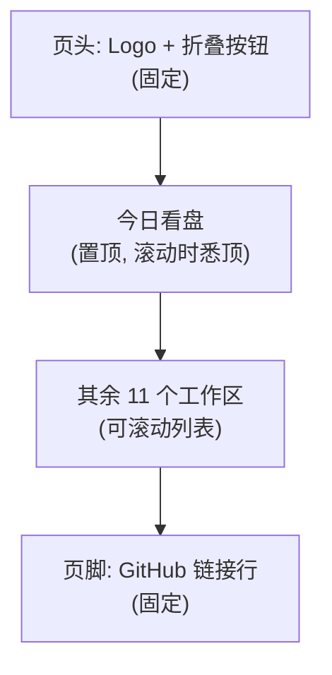
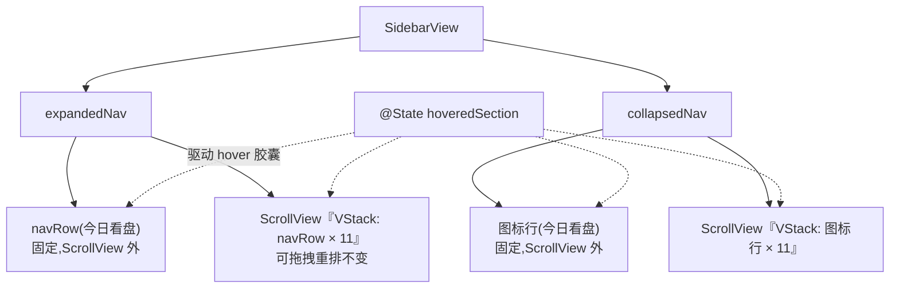

# KSSDeck 边栏 x.com 化精修 - Plan

## Goal Capsule

- **Objective:** 把 KSSDeck xcom(新版)边栏导航从静态观感升级为带鼠标 hover 反馈、行高/图标间距/栏宽贴近 x.com 桌面版实际比例的交互体验,覆盖展开态列表、折叠态图标栏、页头折叠按钮与页脚 GitHub 链接行。
- **Product authority:** 用户本人(KSSDeck 唯一使用者与决策者)。
- **Open blockers:** 无——尺寸方向已通过本地浏览器可视化对比(展开态行高/栏宽/hover 胶囊三方案实测)确认。

## Product Contract

### Summary

xcom(新版)模式下的边栏在鼠标悬停时显示中性灰/黑叠加的胶囊背景反馈,行高、图标与文字间距、边栏宽度调整到贴近 x.com 桌面版的实际比例。12 个工作区在新行高下会超出边栏可视高度,导航列表改为可滚动,固定置顶的"今日看盘"在滚动时保持悉顶。经典 8 套设计系统与既有的选中态视觉(图标填充 + 加粗)不受影响。

### Problem Frame

边栏在 2026-07-11-004 号计划(`docs/plans/2026-07-11-004-feat-kssdeck-xcom-design-plan.md`)里已经拿到 x.com 的配色、字体与选中态图标填充规则,但导航行本身完全静态——鼠标划过没有任何反馈,行高、图标与文字的间距、边栏宽度仍然是经典模式遗留下来的密集数值,没有跟着 x.com 的视觉比例走。这次要把边栏的交互细节补齐,让"新版"在观感上更完整地贴近 x.com 原型。

### Key Decisions

- **KD1 — 只加 hover,不改选中态。** 选中态的图标填充 + label 加粗已经在 `docs/plans/2026-07-11-004-feat-kssdeck-xcom-design-plan.md` 的 U5(边栏 x.com 导航视觉变体,与本计划自己的 U5 是两回事)里实现;本轮只新增鼠标悬停反馈,不重新设计选中态视觉,避免和已上线的选中规则冲突。
- **KD2 — hover 用中性色,不用品牌蓝。** x.com 真实导航项的 hover 背景是灰/黑色叠加,品牌蓝只用于选中态的图标填充;沿用中性色 hover 更贴近"精确复刻"的目标,也避免一屏内出现多个交互色源、稀释强调色规则。
- **KD3 — 行高按 x.com 实测比例走,接受导航区滚动。** KSSDeck 有 12 个工作区,x.com 桌面导航只有 5 条;把 x.com 的行高原样套用会让 12 项撑到远超一屏的高度。经三方案本地可视化对比后,选择保留 x.com 原比例、让导航区可滚动,而不是为了塞下 12 项压缩行高。
- **KD4 — 固定置顶项滚动时悉顶。** "今日看盘"是既有拖拽排序里固定置顶、不参与排序的项;滚动时它继续留在可视区顶部,其余 11 项在它下方滚动,与它"永久置顶"的既有定位保持一致。
- **KD5 — 边栏宽度定目标区间,不锁单一数值。** 展开态宽度从当前 224pt 提升到约 260–280pt(对应 x.com 桌面版约 275px 列宽的比例),折叠态维持 64pt 不变;具体展开态数值留给 planning 阶段结合窗口最小宽度和 WCAG 对比度复核后敲定(见 Outstanding Questions)。

### Requirements

**Hover 反馈**
- R1. xcom 模式下,展开态导航行、折叠态图标行、底部 GitHub 链接行、顶部折叠/展开按钮在鼠标悬停时均显示中性灰/黑叠加的胶囊背景反馈;经典 8 套设计系统的边栏行为不受影响。
- R2. hover 背景色使用中性灰/黑叠加(不透明度参照 x.com 实测量级:浅色模式约 `rgba(15,20,25,.06)`、深色模式约 `rgba(231,233,234,.10)`),不使用品牌强调色。
- R3. 选中态视觉(图标填充 + label 加粗、无背景色块)保持现状不变;hover 与选中同时命中时,两种视觉叠加显示,不互相替换。

**行高与间距**
- R4. 展开态导航行的行高与垂直内边距上调至贴近 x.com 桌面版实测比例,相对当前的 9pt 垂直内边距明显放大;折叠态图标行同步等比放大。
- R5. 图标与文字之间的间距上调至贴近 x.com 实测比例,相对当前的 11pt 明显放大。

**栏宽**
- R6. 展开态边栏宽度从当前 224pt 提升到约 260–280pt 区间(见 KD5);折叠态宽度维持 64pt。

**导航区域可滚动**
- R7. 12 个工作区在新行高下超出边栏可视高度时,导航列表本身可垂直滚动;固定置顶的"今日看盘"在滚动时保持悉顶可见,其余 11 项在其下方滚动进出。

### Acceptance Examples

- AE1. 选中项本身不叠加 hover。**Given** 用户当前停留在"今日看盘"页面且鼠标未悬停任何导航行,**When** 渲染边栏,**Then** "今日看盘"显示图标填充 + label 加粗 + 悉顶,不额外叠加 hover 背景。**Covers:** R3, R7。
- AE2. 悬停非选中项。**Given** 用户鼠标悬停在"推荐"这一行(非当前选中项),**When** hover 触发,**Then** 该行显示中性灰胶囊背景,图标与文字保持未选中态的描边/常规字重,不会因为 hover 变成选中态的填充效果。**Covers:** R1, R2, R3。
- AE3. 窗口高度不足以容纳全部导航项。**Given** 应用窗口高度只够显示 8 个导航行,**When** 用户滚动导航区域,**Then** "今日看盘"始终可见于顶部,其余工作区在其下方滚动进出可视区。**Covers:** R7。

### Scope Boundaries

- 经典 8 套设计系统(clayM3/终端/拟物/M3/Verge/Airbnb/Discord/Binance)的 hover 视觉、放大后的行高/图标文字间距/字号、颜色与图标风格不受本轮改动影响,只有 xcom(新版)模式生效。
- **例外(planning 阶段发现并确认,见 Planning Contract KTD2):** 边栏宽度(224→272pt)与导航区"今日看盘悉顶 + 其余项可滚动"的容器结构是功能性改动,对全部 9 套设计系统生效——经典模式的颜色/字体/圆角等视觉 token 不受影响,但边栏会一起变宽,导航容器机制也一起换成悉顶+可滚动(经典模式行高未放大,12 项内容通常不会超出应用最小窗口高度,实际视觉上多数情况下不会出现滚动条)。
- 不引入 x.com 的三栏 shell 或定宽内容列——沿用既有边栏 + 详情两栏密集布局(继承自 `docs/plans/2026-07-11-004-feat-kssdeck-xcom-design-plan.md` 的 KD2)。
- 图标符号本身不替换,仍使用现有 SF Symbols;本轮只调整间距、hover 背景与行高。
- 键盘/Full Keyboard Access 场景下的焦点态视觉不在本轮范围内——本轮 hover 反馈只针对鼠标交互(`.onHover`),Tab 切换到导航行时沿用系统默认焦点环,不与 hover 胶囊统一;KSSDeck 是单用户桌面工具,键盘可访问性不是当前优先级。

### Dependencies / Assumptions

- 依赖已上线的 xcom 设计系统(`docs/plans/2026-07-11-004-feat-kssdeck-xcom-design-plan.md`,对应 PR #70/#73/#74,已合并 main)提供的调色板、字体与选中态实现;本轮在其基础上扩展,不重新搭建。
- 折叠态 64pt 宽度是否够容纳放大后的图标与 hover 圆形反馈,不在 planning 阶段假定——留给 U4 实现时实机验证,验证不足时的回退方案已写入 U4(见 Planning Contract KTD2、Implementation Units U4)。

### Outstanding Questions

无。原有的三项("hover 精确色值"、"边栏精确宽度"、"字号是否随行高放大")均已在 planning 阶段解析为具体技术决策,详见 Planning Contract KTD1、KTD2、KTD5;不遗留产品范围阻塞项。

---

## Planning Contract

**Product Contract preservation:** changed — Scope Boundaries。Planning 阶段发现边栏宽度与悉顶+滚动的容器结构在代码里是全部 9 套设计系统共用的同一段(不像 hover/字号能按 `isXcom` 条件隔离);与用户确认后,Scope Boundaries 补充了一条例外:这两项结构性改动全局生效,经典模式的视觉 token(颜色/字体/圆角)不受影响。R1–R7、KD1–KD5、AE1–AE3 其余内容与 Requirements 本身未改动。三项"Deferred to Planning"已解析为 KTD1、KTD2、KTD5。

### Key Technical Decisions

- **KTD1 — hover 中性色不进 `ThemeCatalog`,直接在 `SidebarView` 内联计算,取值来自 `theme.ink` 而非裸色。** `navRow` 里的选中态(图标填充/背景色块)已经是按 `theme.system == .xcom` 内联分支渲染,不是从 palette 取值;hover tint 沿用同一模式内联计算,但取值改为 `theme.appearance == .dark ? theme.ink.color.opacity(0.10) : theme.ink.color.opacity(0.06)`(而不是裸的 `Color.white`/`Color.black`)——xcom 的 `ink` 在 dark 下已是 `#E7E9EA`、light 下是 `#0F1419`,与 R2 给出的 `rgba(231,233,234,.10)`/`rgba(15,20,25,.06)` 精确对应,且延续了本代码库"颜色一律出自 theme token"的惯例。给 `ThemeCatalog.Seed` 加新字段会牵连全部 9 套设计系统的 `seed()` 分支和 `ThemeCatalogTests.testAllSixteenCombinationsResolve` 里硬编码的组合数断言(该测试函数名虽仍叫"Sixteen",但断言值在上一轮 xcom 改造里已经改成 18——函数名本身是遗留未清理的产物,不在本轮改动范围内),而这次改动只影响 xcom 一个 case——不新增字段就不触碰这条断言,也不需要扩展 WCAG 校验矩阵。
- **KTD2 — 边栏宽度定为 272pt,不是区间,且全局生效(不按 `isXcom` 隔离)。** `Sources/KSSDesktop/Views/ContentView.swift:77` 的 `.frame(width: sidebarCollapsed ? 64 : 224)` 是全部 9 套设计系统共用的同一处代码,不区分 `theme.system`;与用户确认后(见对话记录),224→272pt 作为功能性改进直接对全部 9 套生效,不额外加 `isXcom` 条件分支。最小窗口 `minWidth: 1080` 下,48pt 的额外宽度让详情区仍有约 807pt 可用(1080 − 272 − 1pt `Divider` 宽度),不构成挤压风险。272pt 对应 x.com 桌面版约 275px 列宽的比例,折叠态 64pt 不变(两种模式都不变)。折叠态 64pt 是否够容纳 KTD5 放大后的图标(18pt)与 hover 反馈,由 U4 在实现时做实机验证,见 U4 的 Test scenarios 与 Verification——不在此处凭空假定够用。
- **KTD3 — 悉顶实现为"固定行 + 独立 `ScrollView`",不用 `LazyVStack(pinnedViews:)`,且容器结构全局生效。** 只有一项("今日看盘")需要悉顶,不是重复的 section header,用 `pinnedViews: .sectionHeaders` 属于杀鸡用牛刀且要多包一层 `Section`。直接把置顶项的 `navRow` 放在 `ScrollView` 外面、其余 11 项放进 `ScrollView` 内的 `VStack`,结构上和现有 `WorkspaceSection.pinned` / `.reorderable` 的既有区分完全对应,折叠态用同样结构。与 KTD2 同理,这段容器重构不按 `isXcom` 分支隔离,全部 9 套设计系统共用同一套悉顶+可滚动结构——经典模式行高未放大(仍是 U2 之前的字面量),12 项内容在应用最小窗口高度(`ContentView.swift:127` 的 `.frame(minWidth: 1080, minHeight: 720)`)下通常不会触发实际滚动,视觉上多数情况下等同于改动前。
- **KTD4 — hover 状态用 `@State private var hoveredSection: WorkspaceSection?` + 合并式 `.onHover` 闭包。** 复刻 `Sources/KSSDesktop/Views/AIChatView.swift:199` 已有的 hover-tag 模式(`hovered = $0 ? tag : (hovered == tag ? nil : hovered)`),避免快速划过多行时状态卡死或多行同时高亮。页脚 GitHub 行与页头折叠按钮是单一元素,各自用局部 `@State private var isHovering = false` 即可,不需要 tag 合并模式。
- **KTD5 — 字号跟行高一起放大,仅 xcom 模式生效。** 展开态 label/图标字号从 15pt 提到 16pt,折叠态图标字号从 17pt 提到 18pt;经典模式沿用原字号不变。数值直接作为字面量传给现有 `KSSFont.themed(...)` 调用(现状本来就是字面量,不经过 palette),不新增 typography 预设字段。

### High-Level Technical Design

`SidebarView` 的内部组成从"扁平 `VStack` + 单一 `navRow`"变成"置顶固定行 + 可滚动列表",展开态与折叠态各自复用同一份 hover 状态:

### Risks & Dependencies

- `.onHover` 与既有 `.onDrag`/`.onDrop` 拖拽重排逻辑在同一行上共存,AppKit 桥接层偶发 hover 状态在拖拽开始/结束时不及时清空的可能——缓解:U2 的测试场景显式覆盖"拖拽过程中 hover 高亮不残留"。
- `hoveredSection` 是 `SidebarView` 级别的单一状态,展开/折叠切换时视图树被 `if collapsed { collapsedNav } else { expandedNav }` 整体替换,SwiftUI 不保证被替换视图的 `.onHover(false)` 会触发——缓解:U2 在 `onToggleCollapse` 里显式重置 `hoveredSection = nil`,见 U2 Approach 与 Test scenarios。
- 依赖已上线的 xcom 设计系统(`docs/plans/2026-07-11-004-feat-kssdeck-xcom-design-plan.md`,PR #70/#73/#74 已合并 main)提供的 `theme.system`/`theme.appearance`/`theme.accent` 等既有 token,本轮不改动其定义,只新增消费方式。

### Sequencing

U1(栏宽)与 U2(展开态 navRow hover/尺寸)可并行开始 → U3(展开态悉顶+滚动结构)、U4(折叠态)均依赖 U2(复用其新增的 `hoveredSection` state)→ U5(页脚/页头,用独立的局部 `isHovering` state,不依赖 U2)与 U2/U3/U4 相互独立,可随时并行。

---

## Implementation Units

### U1. 边栏宽度 224pt → 272pt

- **Goal:** 展开态边栏宽度从当前 224pt 提升到 272pt,折叠态 64pt 保持不变。
- **Requirements:** R6
- **Dependencies:** 无
- **Files:** `Sources/KSSDesktop/Views/ContentView.swift`
- **Approach:** 把 `.frame(width: sidebarCollapsed ? 64 : 224)`(`ContentView.swift:77`)里的 `224` 改成 `272`;`64` 不动。按 KTD2 这是全局改动,不加 `isXcom` 条件——不引入新的状态或分支,单纯改字面量。
- **Test scenarios:**
  - 展开态下边栏实测宽度为 272pt,在 xcom 模式和任一经典设计系统下均一致(全局生效,见 KTD2)。
  - 折叠态宽度仍为 64pt,xcom 与经典模式均未受影响。
  - 应用窗口收缩到 `minWidth: 1080` 下限,详情区(表格/K 线图)在任一设计系统下仍有合理可用宽度(约 807pt,见 KTD2),无内容被裁切或挤出可视区。
- **Verification:** 分别在 xcom 模式和任一经典模式下测量边栏实际宽度,确认展开态均为 272pt、折叠态均为 64pt。

### U2. 展开态导航行(`navRow`):hover 胶囊 + 尺寸放大

- **Goal:** xcom 模式下 `navRow` 补齐鼠标 hover 中性灰胶囊反馈,行高/图标文字间距/字号按 KTD5 放大。
- **Requirements:** R1, R2, R3, R4, R5
- **Dependencies:** 无
- **Files:** `Sources/KSSDesktop/Views/SidebarView.swift`
- **Approach:** 在 `SidebarView` 新增 `@State private var hoveredSection: WorkspaceSection?`(KTD4)。`navRow(_:)` 内部:
  - 给最外层 `Button` 的 label 容器加 `.onHover { hovering in hoveredSection = hovering ? section : (hoveredSection == section ? nil : hoveredSection) }`。
  - `.background(...)` 的判断从 `(!isXcom && isOn) ? theme.accent : Color.clear` 扩展为:非 xcom 走原逻辑不变;xcom 模式下,若 `hoveredSection == section` 则用 `theme.appearance == .dark ? theme.ink.color.opacity(0.10) : theme.ink.color.opacity(0.06)`(KTD1),否则 `Color.clear`;背景形状从 `RoundedRectangle(cornerRadius: KSSTheme.shapeS)` 在 xcom 分支下改用 `theme.chipRadius`(已是 999,SwiftUI 的 `cornerRadius` 会自动钳制到形状短边的一半,所以无论行高多大,999 恒渲染为完整胶囊,不需要跟着 KTD5 的行高改动联动调整)。
  - 垂直内边距按 xcom 分支从 `9` 提到 `14`,水平内边距从 `10` 提到 `12`;`HStack(spacing: 11)` 的间距在 xcom 分支提到 `18`;图标 `.frame(width: 22)` 在 xcom 分支提到 `24`。
  - 图标与 label 的 `KSSFont.themed(15, ...)` 在 xcom 分支下字号改成 `16`(KTD5),经典模式分支保持 `15` 不变。
  - hover 与选中态可同时成立(AE1/AE2):选中态的图标填充/加粗判断逻辑不改,hover 背景只是额外叠加的 `.background`,两者互不覆盖。
  - 拖拽与 hover 的具体规则(而不只是"不冲突"):正在被拖拽的行(`dragging == section`)本身不显示 hover 背景,只显示既有的拖拽半透明态(`opacity(0.4)`);其余行的 hover 判定不受拖拽影响,正常响应。
  - `onToggleCollapse` 触发折叠/展开切换时,顺带把 `hoveredSection` 重置为 `nil`——展开态与折叠态共用同一个 `hoveredSection`,但视图树切换时 SwiftUI 不保证旧视图的 `.onHover(false)` 会触发,不重置会导致切换回来后残留一个已经不在鼠标下的高亮行。
- **Test scenarios:**
  - 鼠标悬停在非选中的导航行上,xcom×dark 下显示 `theme.ink.opacity(0.10)` 胶囊背景,xcom×light 下显示 `theme.ink.opacity(0.06)` 胶囊背景;背景形状为圆角胶囊(`chipRadius`),覆盖整行。Covers AE2。
  - 鼠标悬停在当前选中行("今日看盘")上:图标填充+label 加粗(既有选中态)与 hover 胶囊背景同时可见,互不冲突。Covers AE1。
  - 鼠标移出导航行后,hover 背景立即消失,不残留。
  - 鼠标快速划过多行(模拟真实划动),任意时刻只有一行显示 hover 背景,不出现多行同时高亮。
  - 经典 8 套设计系统下 `navRow` 的 hover/尺寸/字号均与改动前完全一致(回归)。
  - 展开态行高、图标间距、字号在 xcom×light/dark 下截图与放大后的目标数值(14pt 内边距/18pt 图标间距/16pt 字号)一致。
  - 正在拖拽某一行时(`dragging == section`),该行只显示拖拽半透明态、不显示 hover 背景;其余行 hover 正常响应,不产生视觉重叠。
  - 鼠标悬停在某一行上,不移动鼠标的情况下点击折叠按钮再点回展开:重新展开后该行(以及鼠标当前实际所在的任何行)hover 状态与鼠标实际位置一致,无残留高亮。
- **Verification:** xcom×light/dark 下逐行鼠标悬停并截图核对胶囊背景颜色与透明度;切到任一经典模式确认零变化;悬停后触发一次折叠/展开切换确认无残留高亮。

### U3. 展开态导航区:悉顶 + 可滚动

- **Goal:** `expandedNav` 重构为"今日看盘固定悉顶 + 其余 11 项可滚动"的结构(KTD3),12 项在新行高下超出可视高度时可正常滚动。
- **Requirements:** R7
- **Dependencies:** U2(复用其 hover/尺寸已就绪的 `navRow`)
- **Files:** `Sources/KSSDesktop/Views/SidebarView.swift`
- **Approach:** `expandedNav` 从单一 `VStack(spacing: 3) { ForEach(sections) { ... } }` 拆成两段:第一段直接渲染 `sections` 中 `WorkspaceSection.pinned` 命中的那一项(即"今日看盘")的 `navRow`,不包裹拖拽逻辑,放在 `ScrollView` 外;第二段用 `ScrollView { VStack(spacing: 3) { ForEach(sections.filter { !isPinned }) { ... 原有 onDrag/onDrop 逻辑整体搬入 ... } } }`。`.padding(.horizontal, 8)` 与 `.padding(.top, 4)` 分别保留在固定行与滚动容器上,视觉间距与改动前一致。
- **Test scenarios:**
  - 应用窗口在 `minHeight: 720` 下限附近,xcom 模式展开态下,导航区可以滚动;滚动到底部能看到"架构"(最后一项)完整可见。Covers AE3。
  - 滚动过程中"今日看盘"始终固定在顶部,不随滚动位移。Covers AE3。
  - "今日看盘"本身保持不可拖拽、不接受 drop(既有行为不变,`isPinned` 项从不挂载 `onDrag`/`onDrop`)。
  - 其余 11 项的拖拽重排功能在滚动容器内正常工作(拖到滚动容器内任意可见行之前触发 `onReorder`,与重构前行为一致)。
  - 窗口高度足够大、12 项无需滚动即可全部显示时,`ScrollView` 不引入多余的空白或裁切(内容高度小于容器高度时正常收缩)。
  - 经典模式下 `expandedNav` 同样改用悉顶+可滚动结构(全局生效,见 KTD3);由于经典模式行高未放大(U2 的 hover/尺寸放大只在 xcom 分支生效),12 项在 `minHeight: 720` 下限下通常无需实际滚动,视觉上与改动前基本一致。
- **Verification:** 缩小窗口高度到接近下限,人工滚动核对悉顶效果;拖拽重排在滚动状态下手动验证一次;经典模式下确认 12 项在最小窗口高度下仍能完整显示、无需滚动。

### U4. 折叠态图标栏(`collapsedNav`):hover + 尺寸放大 + 悉顶滚动

- **Goal:** `collapsedNav` 应用与 `navRow` 对应的 hover/尺寸变化,并采用与 U3 相同的"悉顶+可滚动"结构。
- **Requirements:** R1, R2, R4, R5, R7
- **Dependencies:** U2(复用其新增的 `hoveredSection` state;须在 U2 落地后再实现本单元)
- **Files:** `Sources/KSSDesktop/Views/SidebarView.swift`
- **Approach:** `collapsedNav` 内联的 `Button` 渲染补 `.onHover`(复用 U2 新增的 `hoveredSection` state),xcom 分支下背景从 `Color.clear` 改为悬停时的中性灰胶囊(取值同 KTD1,`theme.ink.color.opacity(...)`,形状用 `Circle()` 包住图标,匹配 x.com 图标按钮的圆形 hover 惯例,而非沿用展开态的胶囊形);图标字号从 `17` 提到 `18`,`.frame(width: 46, height: 38)` 的高度提到 `44`(宽度不变,折叠栏宽度本身未变)。容器结构按 KTD3 拆成"今日看盘固定 + 其余 11 项 `ScrollView`",与 U3 同构。`collapsedNav` 现状(改动前)本来就没有 `.onDrag`/`.onDrop`——折叠态从未支持拖拽重排,只有展开态的 `navRow` 才有;本单元的容器重构不新增折叠态拖拽能力,也没有需要"搬运"的拖拽逻辑。
- **Test scenarios:**
  - 折叠态下鼠标悬停在图标上,xcom×dark/light 下显示对应中性灰圆形背景;移出后立即消失。
  - 折叠态选中项(图标填充)与 hover 同时命中时视觉正确叠加,不冲突。
  - 折叠态导航区在窗口高度不足时可滚动,"今日看盘"悉顶,与 U3 展开态表现一致。
  - 展开/折叠切换时,悉顶+滚动状态在两种形态下分别独立生效,互不干扰(切换折叠态不残留展开态的滚动位置或反之属预期行为,无需保持滚动位置同步)。
  - 经典模式下折叠态图标栏同样改用悉顶+可滚动结构(全局生效,见 KTD3),hover/字号不变;12 项在最小窗口高度下通常无需实际滚动,视觉上与改动前基本一致。
  - 放大后的 18pt 图标 + 圆形 hover 反馈在 64pt 折叠栏宽度内完整渲染,无左右裁切;若实测发现裁切,回退方案是把折叠栏宽度从 64pt 调到 72pt(同样按 KTD2 的"全局生效"处理,不按 `isXcom` 隔离),并同步更新 U1 的折叠态宽度断言。
- **Verification:** 折叠态下逐个图标悬停截图核对,重点检查 hover 圆形在 64pt 栏宽内不裁切;窗口高度收缩后人工滚动核对悉顶。

### U5. 页脚 GitHub 行 + 页头折叠按钮:hover 反馈

- **Goal:** `SidebarFooter` 的 GitHub 链接行与 `AppHeader` 的折叠/展开按钮在 xcom 模式下补齐鼠标 hover 中性灰胶囊反馈。
- **Requirements:** R1, R2
- **Dependencies:** 无
- **Files:** `Sources/KSSDesktop/Views/SidebarView.swift`
- **Approach:** `SidebarFooter` 与 `AppHeader` 的 `toggleButton` 各自新增局部 `@State private var isHovering = false`(KTD4,不与 U2 的 `hoveredSection` 共用,因为这两处是独立于导航列表之外的单一元素)。`.onHover { isHovering = $0 }`,xcom 模式下 `isHovering` 为真时套用 `theme.ink.color.opacity(...)`(同 KTD1 取值)的中性灰背景,经典模式下不变。两处的 hover 形状分开定:页脚 GitHub 行是横向长条,用 `RoundedRectangle(cornerRadius: theme.chipRadius)` 胶囊形,与 U2 的导航行一致;页头折叠/展开按钮是纯图标按钮,改用 `Circle()` 包住图标,与 U4 折叠态图标的圆形 hover 惯例一致,而不是拉伸成胶囊。
- **Test scenarios:**
  - 鼠标悬停在页脚 GitHub 行上,xcom×dark/light 下显示中性灰胶囊背景;移出后消失;点击行为(打开链接)不受影响。
  - 鼠标悬停在页头折叠/展开按钮上,xcom×dark/light 下显示中性灰圆形背景;点击后正常触发折叠/展开,hover 状态不残留错误值。
  - 折叠态下页头只保留 K 标 + 折叠按钮,折叠按钮的圆形 hover 行为与展开态一致。
  - 经典模式下页脚/页头 hover 行为与改动前一致(无 hover 效果)。
- **Verification:** xcom×light/dark 下分别悬停页脚与页头按钮并截图核对。

---

## Verification Contract

| 验证项 | 命令/方式 | 适用单元 |
|---|---|---|
| 编译通过 | `swift build` | 全部 |
| 主题矩阵零 WCAG 违规回归 | `swiftc` 独立编译 driver 跑 `ThemeValidation.allFindings()`(本机无 Xcode,`swift test` 不可用,沿用既有验证路径,见 `docs/qa/kssdesktop-theme-matrix/`),确认仍是 9×2=18 组合零违规,未新增组合 | U1–U5(回归) |
| 运行时视觉核对:hover | xcom×light/dark 下逐一悬停展开态/折叠态导航行、页脚、页头按钮,截图核对中性灰胶囊背景 | U2, U4, U5 |
| 运行时视觉核对:行高/间距/栏宽 | xcom×light/dark 下截图对比展开态行高(14pt 内边距)、图标文字间距(18pt)、栏宽(272pt) | U1, U2 |
| 运行时视觉核对:悉顶+滚动 | 窗口高度收缩到接近 720pt 下限,滚动导航区,确认"今日看盘"悉顶、其余项正常滚动进出(展开态+折叠态) | U3, U4 |
| 回归:经典模式视觉 token 不变 | 切到任一经典设计系统,确认颜色/字体/圆角/hover(经典模式无 hover)与改动前一致;边栏宽度(272pt)与悉顶+滚动容器结构按 KTD2/KTD3 全局生效 | U1–U5 |
| 回归:拖拽排序 | xcom 模式下拖拽重排其余 11 项,确认排序功能在滚动容器重构后仍正常工作;确认折叠态本来就没有拖拽能力(改动前后一致) | U3, U4 |
| 折叠态宽度余量 | xcom 折叠态下检查 18pt 图标 + 圆形 hover 反馈在 64pt 栏宽内无裁切;若裁切,按 U4 的回退方案调整栏宽 | U1, U4 |
| 折叠/展开切换无残留 hover | 悬停某一行后触发折叠/展开切换,确认 `hoveredSection` 被重置、无残留高亮 | U2 |

## Definition of Done

- xcom 模式下展开态/折叠态导航行、页脚 GitHub 行、页头折叠按钮均有中性灰 hover 反馈;经典模式沿用无 hover 的既有行为(R1, R2)。
- 选中态视觉(图标填充+加粗)在有/无 hover 时均保持既定行为,两者叠加不冲突(R3, AE1, AE2)。
- 展开态行高/图标文字间距/字号按 KTD5 数值放大,折叠态图标行同步放大,仅 xcom 模式生效(R4, R5)。
- 展开态边栏宽度为 272pt、折叠态维持 64pt(或按 U4 回退方案调整后的值),在 xcom 与全部经典设计系统下一致生效(R6, KTD2)。
- "今日看盘"在导航区滚动时悉顶可见,其余 11 项可正常滚动,展开态与折叠态均生效,在 xcom 与全部经典设计系统下一致生效(R7, AE3, KTD3)。
- `ThemeValidation.allFindings()` 对既有 9×2=18 组合仍零违规,未新增调色板字段。
- 拖拽重排功能在滚动容器重构后回归测试通过;折叠态确认本来就无拖拽能力,不是回归。
- 折叠/展开切换后无残留 hover 高亮(U2)。
