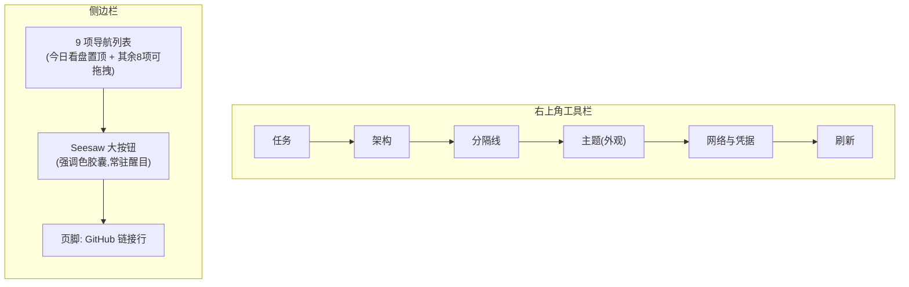

# KSSDeck 边栏任务/架构移至工具栏、Seesaw 独立为侧边栏大按钮 - Plan

## Goal Capsule

- **Objective:** 把侧边栏里的"任务""架构"两个管理类入口移到窗口右上角工具栏;Seesaw(全应用唯一 AI 入口)不进工具栏,改造成侧边栏导航列表下方常驻的强调色大按钮,比照 x.com 侧边栏"Post"按钮的视觉分量。
- **Product authority:** 用户本人(KSSDeck 唯一使用者与决策者)。
- **Open blockers:** 无——布局方向已通过文字方案对比 + 实机截图确认。

## Product Contract

### Summary

侧边栏移除"任务""架构""Seesaw"三项导航行。任务、架构做成两个独立图标放右上角工具栏最左侧,一条分隔线之后是主题(外观设置菜单)、网络与凭据、刷新。Seesaw 不进工具栏——它是全应用唯一的 AI 入口,改成侧边栏导航列表正下方、页脚上方的常驻强调色大按钮(展开态是全宽圆角胶囊 + 图标 + "Seesaw" 文字,折叠态是圆形图标按钮),比照用户提供的 x.com 参考图里"Post"按钮的处理——不是选中态才醒目,而是任何时候都是应用里视觉分量最重的入口之一。点击任务/架构/Seesaw 的行为都与现在点侧边栏一致,直接切换主内容区,不引入弹窗/新窗口交互。

### Problem Frame

KSSDeck 侧边栏目前有 12 个 `WorkspaceSection`,全部显示在侧边栏(`WorkspaceSection.hidden` 当前为空;舆情 digest 此前暂停过,已在近期恢复显示),混杂着日常看盘操作(今日看盘/自选/推荐/资讯雷达等)和偏工具向的功能(任务=后台任务与定时作业面板、架构=系统架构图、Seesaw=AI 对话)。任务和架构本质是"管理/运维"入口,不是日常盯盘会用到的内容。Seesaw 本来也在同一份列表里——它是会话式 AI 助手,代表应用的 AI 属性,但混在 12 项里跟"股票池""趋势观察"这类内容页视觉权重完全相同,体现不出它的特殊性;放进右上角工具栏虽然能跟任务/架构一起挪出侧边栏,但工具栏本身是弱化区域(小图标、次要位置),反而进一步削弱了 Seesaw 的存在感,也不符合"AI 助手应该更显眼"的直觉——这正是 x.com 用大号"Post"按钮而不是把它塞进侧边栏图标行的原因。

### Key Decisions

- **KD1 — 管理功能用独立图标,不折叠进菜单。** 任务、架构各自一个工具栏图标,点击直接跳转,不额外弹出下拉菜单——保持跟侧边栏一致的"点了就到"体验,不多一次展开菜单的点击。
- **KD2 — 管理图标组与用户图标组之间加一条分隔线。** 管理组(任务、架构)在工具栏图标簇最左侧、离主内容区最近;用户组(主题、网络与凭据、刷新)在右侧,"刷新"紧邻窗口右边缘。
- **KD3 — Seesaw 不进工具栏,改成侧边栏导航列表下方的常驻大按钮,比照 x.com "Post" 按钮。** 工具栏图标普遍偏小、偏弱,即使给 Seesaw 单独做胶囊背景(第一版做法),视觉分量依然被工具栏这个"次要区域"本身限制住。改为放在侧边栏——用户主要活动区域——导航列表正下方、页脚 GitHub 行上方,展开态是贯穿边栏宽度的圆角胶囊按钮(强调色填充 + 图标 + "Seesaw" 文字,参照用户提供的 x.com 参考图里"Post"按钮的处理),折叠态收成圆形图标按钮。不管当前选中哪个页面,这个按钮永远是同一个醒目样式。
- **KD4 — 点击行为不变。** 任务/架构/Seesaw 点击后,效果与现在点侧边栏完全一致:直接把主内容区切换过去,不弹 sheet、不开新窗口。
- **KD5 — 任务/架构需要"当前选中"视觉反馈。** 侧边栏行原本会高亮当前选中项,任务/架构挪出侧边栏后失去了这个"你在哪"的提示;工具栏按钮需要在 `store.selectedSection` 命中对应 section 时给出视觉区分(如图标着色),不能是永远同一个样子的静态图标。
- **KD6 — Seesaw 按钮不需要"当前选中"反馈,常驻同一样式。** 跟任务/架构不同,Seesaw 是"随时可以呼出 AI"的入口而不是要在多个同类项里区分"你在哪"的导航项(应用里只有一个 Seesaw 入口),比照 x.com 的"Post"按钮——它也不会因为用户正处在发帖界面就换一种样式。选中与未选中视觉一致,不叠加 KD5 那套着色开关。

### Requirements

**工具栏新增入口**
- R1. 右上角工具栏新增两个独立图标,分别对应"任务"与"架构",点击后主内容区切换到对应页面(与现有侧边栏点击行为一致)。
- R2. 工具栏不新增 Seesaw 图标——Seesaw 的入口在侧边栏(见 R7、R8)。
- R3. 工具栏图标从左到右依次为:任务、架构、分隔线、主题(外观设置菜单)、网络与凭据、刷新。主题/网络与凭据/刷新三者现有的图标样式与内部菜单行为不变。

**侧边栏收缩**
- R4. 侧边栏导航列表不再显示"任务""架构""Seesaw"三项;其余各项(今日看盘/推荐/自选/资讯雷达/主题〈板块〉/趋势观察/AI复盘/AI回测/股票池,共 9 项)的排列、拖拽重排、置顶行为不变。Seesaw 的按钮(见 R7)不属于这份可拖拽重排的导航列表,是列表之外的固定入口。
- R5. "任务""架构""Seesaw"对应的页面视图、数据请求、状态管理均保留,只是不再出现在侧边栏导航列表里——与舆情 digest 此前暂停显示时"代码保留、不上侧栏"的处理方式一致。

**任务/架构选中态反馈**
- R6. 工具栏的任务/架构两个图标在 `store.selectedSection` 命中对应页面时,呈现与未选中态可区分的视觉状态(如图标着色),不是永远同一样式的静态图标(见 KD5)。

**Seesaw 侧边栏大按钮**
- R7. 侧边栏导航列表正下方、页脚 GitHub 行上方,新增一个贯穿边栏宽度的 Seesaw 按钮:强调色圆角胶囊背景、图标 + "Seesaw" 文字,点击后主内容区切换到 Seesaw 对话页。不管是否选中都保持同一醒目样式(见 KD3、KD6)。
- R8. 折叠态侧边栏下,Seesaw 按钮收成强调色填充的圆形图标按钮,同样位于图标导航列表下方、页脚上方,点击行为与展开态一致。

### Scope Boundaries

- 不改变主题(外观设置)、网络与凭据、刷新三个现有工具栏图标的视觉样式、图标符号或内部菜单结构。
- 不引入弹窗/sheet/新窗口——任务/架构/Seesaw 的内容切换方式与现有侧边栏点击完全一致,只是触发入口挪了位置。
- Seesaw 只有侧边栏这一个入口,不在工具栏重复放置。
- 不对 Seesaw 按钮做额外的 hover 动效或与侧边栏其余导航行一致的中性灰 hover——它本身已经是强调色填充,不需要再叠加 hover 反馈层。

### Dependencies / Assumptions

- 依赖侧边栏现有的"暂停不显示"机制先例(`WorkspaceSection.hidden`;此前暂停显示舆情 digest 时用过,现已恢复显示、数组回到空)——enum case、对应视图、`ContentView` 路由都完整保留,只是从侧边栏渲染列表里排除。任务/架构/Seesaw 预期复用同一类机制,而不是从代码里整个删除。
- 假定工具栏(`ToolbarItemGroup`)有足够横向空间容纳新增的任务/架构两个图标加 1 条分隔线;假定侧边栏(展开态 272pt / 折叠态 64pt)有足够空间容纳 Seesaw 大按钮而不需要额外调整边栏宽度。

### Outstanding Questions

无——布局、分组、点击行为、Seesaw 的独立视觉设计均已在对话与实机验证中确定。

---

## Planning Contract

**Product Contract preservation:** changed — Summary、Problem Frame、KD3(重写)、R2/R3/R4/R7(重写)；新增 KD6、R8。Doc review 发现 `WorkspaceSection.hidden` 当前实际为空(舆情 digest 已恢复显示,不在其中),已订正 Problem Frame 与 R4 的过时描述,R4 剩余项清单从 8 项改为 9 项。第一轮实现后,用户两次追加需求:(1) Seesaw 需要独立视觉设计突出重要性——先给了工具栏内的常驻胶囊背景(旧 R7/KD3/KTD6,已实现验证);(2) 用户进一步反馈工具栏本身是弱化区域、样式也不好看,参照 x.com "Post" 按钮把 Seesaw 整个移出工具栏、改成侧边栏导航列表下方的常驻大按钮——本次改写取代了第一版的工具栏胶囊方案。R1、R5、R6、KD1、KD2、KD4、KD5、Scope Boundaries 其余内容未变。

### Key Technical Decisions

- **KTD1 — 复用 `WorkspaceSection.hidden`,靠注释区分"暂停"与"永久挪走"两种排除原因,不新建字段。** `Sources/KSSDesktop/Models/KSSModels.swift` 现有 `static let hidden: [WorkspaceSection] = []`(当前为空)。把任务/架构/Seesaw 加进这个数组,`ContentView.swift` 的 `orderedSections` 计算属性直接调用 `WorkspaceSection.ordered(from:)`,该函数内部已经用 `reorderable`(定义为排除 `pinned` 与 `hidden` 的 `allCases`)构建侧边栏列表——不需要改 `WorkspaceSection.ordered(from:)` 本身。数组上的注释需要更新,说明这三项属于"永久挪走",与舆情 digest 那类"可能恢复显示"的暂停项含义不同。
- **KTD2 — 工具栏图标顺序按 `ToolbarItemGroup` 内的声明顺序决定,不需要额外的布局代码。** 现有工具栏里 `themeMenu`→网络与凭据→刷新的视觉左右顺序就是它们在 `ToolbarItemGroup` 内的声明顺序;新的任务/架构/分隔线三个元素按同一规则,插在 `themeMenu` 之前即可得到"任务、架构、分隔线、主题、网络与凭据、刷新"的最终顺序。
- **KTD3 — 新按钮的标签/图标/tooltip 均从 `WorkspaceSection` 读取,不写字面量。** 工具栏的任务/架构按钮、侧边栏的 Seesaw 按钮都是 `Label(WorkspaceSection.xxx.displayName, systemImage: WorkspaceSection.xxx.symbol)`,不在 `ContentView.swift`/`SidebarView.swift` 里重复写字面量字符串——避免以后改了 `WorkspaceSection` 的命名或图标,这几处忘了同步。工具栏按钮显式加 `.help(WorkspaceSection.xxx.displayName)`,不依赖"SwiftUI 工具栏纯图标按钮自动从 Label 生成 tooltip"这个未在本代码库验证过的行为(`themeMenu` 本身就显式加了 `.help()`)。
- **KTD4 — 任务/架构两个按钮的选中态用 `theme.accent` 着色实现,复刻 `navRow`/`collapsedRow` 现有的选中态判断逻辑。** 对应 R6/KD5。`Label` 的 `foregroundStyle` 按 `store.selectedSection == .xxx ? theme.accent : theme.textSecondary` 区分选中/未选中——跟侧边栏 xcom 模式下"未选中态用 `textSecondary`、选中态用 `accent`"的既有约定一致(`Sources/KSSDesktop/Views/SidebarView.swift` 的 `navRow`)。
- **KTD5 — `Divider()` 实机验证后弃用,改用固定宽度竖线 `Text("|")`。** `ToolbarItemGroup` 里的 `Divider()` 在本代码库没有先例(全仓库唯一一处 `ToolbarItemGroup`);实机验证发现它渲染成一条水平短横线,不是预期的竖线分隔符,已改用 `Text("|")`(`theme.textSecondary.opacity(0.4)`,左右各 2pt padding)。
- **KTD6 — Seesaw 按钮在 `SidebarView.swift` 内实现,展开态 `Capsule()` 全宽、折叠态 `Circle()` 图标,均为常驻 `theme.accent` 填充,不做选中态透明度切换。** 对应 R7/R8/KD3/KD6。展开态:`HStack(icon + Text) .frame(maxWidth: .infinity) .padding(.vertical, 11) .background(theme.accent, in: Capsule())`,前景色 `theme.onAccent`,位置在 `expandedNav`/`collapsedNav` 之后、`Spacer()` 之前。折叠态:同样位置,`Image .frame(width: 46, height: 44) .background(theme.accent, in: Circle())`。不像第一版工具栏胶囊那样用 `opacity(selected ? 1.0 : 0.8)` 区分选中态——按 KD6,Seesaw 不需要"选中态"语义,始终同一强度的强调色填充。取值参照用户提供的 x.com 参考截图里"Post"按钮的处理。

### Sequencing

U1(侧边栏收缩)、U2(工具栏任务/架构 + 分隔线)、U3(侧边栏 Seesaw 大按钮)三者代码层面互不依赖、可并行开发,但**必须同一次提交/合并落地**——U1 单独合并会让任务/架构/Seesaw 同时从侧边栏消失且工具栏/侧边栏都还没有新入口接住它们。

---

## Implementation Units

### U1. `WorkspaceSection.hidden` 收进任务/架构/Seesaw

- **Goal:** 侧边栏导航列表(展开态与折叠态)不再显示任务/架构/Seesaw,其余 9 项排列、拖拽重排、置顶行为不变。
- **Requirements:** R4, R5
- **Dependencies:** 无(须与 U2、U3 同一次提交/合并,见 Sequencing)
- **Files:** `Sources/KSSDesktop/Models/KSSModels.swift`
- **Approach:** 把 `static let hidden: [WorkspaceSection] = []` 改成 `= [.runbook, .architecture, .aiChat]`(按 KTD1)。更新数组上方的注释,说明这三项属于"永久挪走",跟舆情 digest 那类"可能恢复显示"的暂停项含义不同。不改 `SidebarView.swift` 导航列表渲染逻辑、不改 `WorkspaceSection.ordered(from:)`——两者都已经通过 `hidden`/`reorderable` 自动生效。
- **Test scenarios:**
  - 展开态侧边栏导航列表只显示 9 项(今日看盘/推荐/自选/资讯雷达/主题〈板块〉/趋势观察/AI复盘/AI回测/股票池),不出现任务/架构/Seesaw。
  - 折叠态图标栏同样只剩 9 个图标。
  - 拖拽重排这 9 项功能正常,置顶的"今日看盘"依旧不可拖拽。
  - 若本机 `UserDefaults` 里 `sidebarOrder` 之前存过任务/架构/Seesaw 的 rawValue(改动前的历史顺序),重新解析后这三项被自动过滤、不报错、不在列表里留空位或占位符。
- **Verification:** 运行时展开/折叠两种形态各看一遍侧边栏导航列表项数与内容(9 项/9 图标);拖拽重排一次确认排序仍正常。

### U2. 工具栏新增任务/架构两个按钮 + 分隔线

- **Goal:** 右上角工具栏按"任务、架构、分隔线、主题、网络与凭据、刷新"的顺序新增两个可点击图标和一条分隔线,点击后主内容区切换到对应页面。
- **Requirements:** R1, R3, R6
- **Dependencies:** 无代码依赖,但须与 U1、U3 同一次提交/合并(见 Sequencing)
- **Files:** `Sources/KSSDesktop/Views/ContentView.swift`
- **Approach:** 在 `.toolbar { ToolbarItemGroup { ... } }` 里,在 `themeMenu` 之前插入三个元素(按 KTD2/KTD3/KTD4):
  - `Button { store.selectedSection = .runbook } label: { Label(WorkspaceSection.runbook.displayName, systemImage: WorkspaceSection.runbook.symbol) }.foregroundStyle(store.selectedSection == .runbook ? theme.accent : theme.textSecondary).help(WorkspaceSection.runbook.displayName)`
  - 同样写法的架构按钮(`.architecture`)
  - 竖线分隔(见 Execution note)
  两个按钮的显示名/图标符号/tooltip 全部读 `WorkspaceSection` 现有的 `displayName`/`symbol`;选中态着色逻辑复刻 `SidebarView.swift` 的 `navRow`(`theme.accent` vs `theme.textSecondary`)。
- **Execution note:** 按 KTD5 实机验证:`Divider()` 在这个 `ToolbarItemGroup` 里渲染成一条水平短横线,不是预期的竖线分隔符——已改用固定宽度的竖线 `Text("|")`(降低透明度)代替 `Divider()`,视觉上是清晰的竖线分隔。
- **Test scenarios:**
  - 点击"任务"图标,主内容区切换到 `RunbookView`,与之前点侧边栏"任务"效果一致;图标在选中态下变为 `theme.accent` 着色,离开该页面后恢复未选中色。
  - 点击"架构"图标,主内容区切换到 `ArchitectureView`,选中态着色同上。
  - 鼠标悬停任务/架构两个图标,各自显示对应的文字 tooltip("任务"/"架构")。
  - 分隔线在"架构"与"主题"之间可见,不影响主题/网络与凭据/刷新三个已有按钮的现有点击行为。
  - 工具栏在应用最小宽度(`minWidth: 1080`)下新增的两个图标加分隔线不被裁切、不换行。
- **Verification:** 逐个点击两个新图标核对主内容区切换与选中态着色正确;逐个悬停核对 tooltip 文字;在最小宽度窗口下查看工具栏排布是否正常。

### U3. 侧边栏 Seesaw 大按钮(仿 x.com "Post" 按钮)

- **Goal:** 侧边栏导航列表下方新增贯穿边栏宽度的 Seesaw 按钮(展开态胶囊 + 图标 + 文字,折叠态圆形图标),点击后主内容区切换到 Seesaw 对话页,常驻强调色填充、不随选中态变化。
- **Requirements:** R2, R7, R8
- **Dependencies:** 无代码依赖,但须与 U1、U2 同一次提交/合并(见 Sequencing)
- **Files:** `Sources/KSSDesktop/Views/SidebarView.swift`
- **Approach:** 在 `SidebarView.body` 的 `expandedNav`/`collapsedNav` 与 `Spacer()` 之间插入一个 `seesawCTA` 计算属性(按 KTD6):
  - 展开态:`Button { selection = .aiChat } label: { HStack(icon, Text(displayName)) }`,前景 `theme.onAccent`,`.frame(maxWidth: .infinity)`、`.padding(.vertical, 11)`、`.background(theme.accent, in: Capsule())`。
  - 折叠态:同一个 `Button`,label 只保留图标,`.frame(width: 46, height: 44)`、`.background(theme.accent, in: Circle())`。
  - 两种形态都不做 `opacity`/选中态切换,取值恒定为 `theme.accent`/`theme.onAccent`(对应 KD6)。
  - 图标符号与显示名读 `WorkspaceSection.aiChat.symbol`/`.displayName`,不写字面量(KTD3)。
- **Test scenarios:**
  - 展开态下,导航列表(9 项)正下方、页脚 GitHub 行上方,出现一个贯穿边栏宽度的强调色胶囊按钮,图标 + "Seesaw" 文字居中。
  - 点击该按钮,主内容区切换到 `AIChatView`,与之前点侧边栏"Seesaw"或工具栏 Seesaw 图标效果一致。
  - 折叠态下,同一位置出现一个强调色填充的圆形图标按钮,点击行为一致。
  - 当前处于 Seesaw 页面时,该按钮视觉与不在 Seesaw 页面时完全一致(不叠加额外的"选中"高亮),对应 KD6。
  - xcom 与至少一个经典设计系统下、亮色与暗色外观下,按钮的强调色背景与 `onAccent` 文字/图标对比度均清晰可辨,不因某个设计系统的取值组合而糊在一起看不清。
  - 展开/折叠切换时,该按钮在两种形态之间正确切换外观,不残留另一形态的布局。
- **Verification:** 展开/折叠两种形态下点击按钮核对跳转正确;xcom/经典各一个设计系统下、亮暗各一次,截图核对按钮可辨识度。

---

## Verification Contract

| 验证项 | 命令/方式 | 适用单元 |
|---|---|---|
| 编译通过 | `swift build` | 全部 |
| 侧边栏导航列表项数与内容 | 展开态与折叠态各查看一遍,确认只剩 9 项/9 图标 | U1 |
| 拖拽重排回归 | 手动拖拽重排一次,确认 9 项排序功能正常 | U1 |
| 工具栏新入口跳转 + 选中态 | 依次点击任务/架构两个新图标,确认主内容区切换到对应页面,且图标呈现选中态着色 | U2 |
| 工具栏 tooltip | 依次悬停任务/架构两个图标,确认各自 tooltip 文字正确 | U2 |
| 工具栏最小宽度排布 | 窗口收缩到 `minWidth: 1080`,确认新增图标与分隔线不裁切、不换行 | U2 |
| Seesaw 大按钮跳转 + 可辨识度 | 展开/折叠两种形态下点击按钮确认跳转正确;xcom 与经典设计系统、亮/暗外观下确认按钮清晰可辨 | U3 |
| 回归:既有三个用户图标 | 主题/网络与凭据/刷新三个按钮的图标、点击行为与改动前一致 | U2 |

## Definition of Done

- 侧边栏导航列表(展开态+折叠态)不再显示任务/架构/Seesaw,其余 9 项排列与拖拽重排不受影响(R4, R5)。
- 工具栏新增任务/架构两个可点击图标,顺序为"任务、架构、分隔线、主题、网络与凭据、刷新",各自有 tooltip 与选中态着色(R1, R3, R6)。
- 侧边栏导航列表下方新增 Seesaw 大按钮(展开态胶囊、折叠态圆形),强调色常驻填充、不随选中态变化,在 xcom 与经典设计系统、亮/暗外观下均清晰可辨(R2, R7, R8)。
- 点击任务/架构/Seesaw 后主内容区直接切换到对应页面,不弹窗、不开新窗口(R1, R2, KD4)。
- 主题/网络与凭据/刷新三个既有按钮的样式与行为零变化。
- U1、U2、U3 同一次提交/合并落地,不存在任务/架构/Seesaw 同时找不到入口的中间状态。
