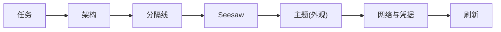

# KSSDeck 边栏任务/架构/Seesaw 移至右上角工具栏 - Plan

## Goal Capsule

- **Objective:** 把侧边栏里的"任务""架构""Seesaw"三个入口移到窗口右上角工具栏,按"用户功能(Seesaw)"与"管理功能(任务/架构)"分两组摆放,与现有的主题/网络与凭据/刷新三个用户功能图标并列。
- **Product authority:** 用户本人(KSSDeck 唯一使用者与决策者)。
- **Open blockers:** 无——布局方向已通过文字方案对比确认(两个独立图标,不折叠进下拉菜单)。

## Product Contract

### Summary

侧边栏移除"任务""架构""Seesaw"三项,改到右上角工具栏:任务、架构做成两个独立图标放最左侧,一条分隔线之后依次是 Seesaw、主题(外观设置菜单)、网络与凭据、刷新。点击任务/架构/Seesaw 的行为与现在点侧边栏一致,直接切换主内容区,不引入新的弹窗/新窗口交互。

### Problem Frame

KSSDeck 侧边栏目前有 12 个 `WorkspaceSection`,全部显示在侧边栏(`WorkspaceSection.hidden` 当前为空;舆情 digest 此前暂停过,已在近期恢复显示),混杂着日常看盘操作(今日看盘/自选/推荐/资讯雷达等)和偏工具向的功能(任务=后台任务与定时作业面板、架构=系统架构图、Seesaw=AI 对话)。任务和架构本质是"管理/运维"入口,不是日常盯盘会用到的内容;Seesaw 虽然是会话式内容,但跟其余 8 个行情类页面性质不同。三者混在同一份侧边栏列表里,拉长了列表,也让"日常盯盘"和"管理/对话"两类操作没有视觉区隔。

### Key Decisions

- **KD1 — 管理功能用独立图标,不折叠进菜单。** 任务、架构各自一个工具栏图标,点击直接跳转,不额外弹出下拉菜单——保持跟侧边栏一致的"点了就到"体验,不多一次展开菜单的点击。
- **KD2 — 管理图标组与用户图标组之间加一条分隔线。** 管理组(任务、架构)在工具栏图标簇最左侧、离主内容区最近;用户组(Seesaw、主题、网络与凭据、刷新)在右侧,"刷新"紧邻窗口右边缘。
- **KD3 — Seesaw 归入用户图标组,紧贴分隔线排在最前,视觉上单独设计、不与其余图标同款。** 现有的主题/网络与凭据/刷新三个图标相对顺序不变,只是整体挪到新增的任务/架构/分隔线/Seesaw 之后。Seesaw 是全应用唯一的 AI 入口,代表应用的 AI 属性,用常驻的强调色胶囊背景(参照用户提供的 x.com 参考图里 Grok 项的胶囊高亮)把它跟任务/架构/主题/网络与凭据/刷新五个纯图标按钮区分开,不是"点了才变色"的处理,而是不管选中与否都保持醒目。
- **KD4 — 点击行为不变。** 任务/架构/Seesaw 从工具栏点击后,效果与现在点侧边栏完全一致:直接把主内容区切换过去,不弹 sheet、不开新窗口。
- **KD5 — 三个新按钮需要"当前选中"视觉反馈。** 侧边栏行原本会高亮当前选中项,任务/架构/Seesaw 挪出侧边栏后失去了这个"你在哪"的提示;工具栏按钮需要在 `store.selectedSection` 命中对应 section 时给出视觉区分(如图标着色),不能是三个永远同一个样子的静态图标。

### Requirements

**工具栏新增入口**
- R1. 右上角工具栏新增两个独立图标,分别对应"任务"与"架构",点击后主内容区切换到对应页面(与现有侧边栏点击行为一致)。
- R2. 右上角工具栏新增一个"Seesaw"图标,点击后主内容区切换到 Seesaw 对话页(与现有侧边栏点击行为一致)。
- R3. 工具栏图标从左到右依次为:任务、架构、分隔线、Seesaw、主题(外观设置菜单)、网络与凭据、刷新。主题/网络与凭据/刷新三者现有的图标样式与内部菜单行为不变。

**侧边栏收缩**
- R4. 侧边栏列表不再显示"任务""架构""Seesaw"三项;其余各项(今日看盘/推荐/自选/资讯雷达/主题〈板块〉/趋势观察/AI复盘/AI回测/股票池,共 9 项)的排列、拖拽重排、置顶行为不变。
- R5. "任务""架构""Seesaw"对应的页面视图、数据请求、状态管理均保留,只是不再出现在侧边栏导航列表里——与舆情 digest 此前暂停显示时"代码保留、不上侧栏"的处理方式一致。

**选中态反馈**
- R6. 工具栏的任务/架构/Seesaw 三个图标在 `store.selectedSection` 命中对应页面时,呈现与未选中态可区分的视觉状态(如图标着色),不是三个永远同一样式的静态图标(见 KD5)。

**Seesaw 独立视觉设计**
- R7. Seesaw 图标常驻强调色胶囊背景,不管当前是否选中都保持醒目,与任务/架构/主题/网络与凭据/刷新五个纯图标按钮的视觉样式明确不同(见 KD3)。

### Scope Boundaries

- 不改变主题(外观设置)、网络与凭据、刷新三个现有图标的视觉样式、图标符号或内部菜单结构。
- 不引入弹窗/sheet/新窗口——任务/架构/Seesaw 的内容切换方式与现有侧边栏点击完全一致,只是触发入口挪了位置。
- 折叠态侧边栏(64pt 图标栏)同样移除这三项,不单独设计折叠态专属方案。

### Dependencies / Assumptions

- 依赖侧边栏现有的"暂停不显示"机制先例(`WorkspaceSection.hidden`;此前暂停显示舆情 digest 时用过,现已恢复显示、数组回到空)——enum case、对应视图、`ContentView` 路由都完整保留,只是从侧边栏渲染列表里排除。任务/架构/Seesaw 预期复用同一类机制,而不是从代码里整个删除。
- 假定工具栏(`ToolbarItemGroup`)有足够横向空间容纳新增的 3 个图标加 1 条分隔线;如果实测空间不够,窗口最小宽度或图标间距的调整留给 planning 阶段处理。

### Outstanding Questions

无——布局、分组、点击行为均已在本轮对话中确定。

---

## Planning Contract

**Product Contract preservation:** changed — Problem Frame, R4, Dependencies/Assumptions,KD3；新增 R6、R7、KD5。Doc review 发现 `WorkspaceSection.hidden` 当前实际为空(舆情 digest 已恢复显示,不在其中),Problem Frame"实际显示 11 项"与 Dependencies 里"当前用于暂停显示舆情 digest"两处描述均为过时信息,已订正;连带 R4 的剩余项清单从 8 项改为 9 项(补上资讯雷达)。新增 R6/KD5,把"侧边栏行选中态消失后工具栏按钮需要自己的选中态反馈"这一 doc review 发现的真实缺口补进 Product Contract。实现阶段用户追加需求:Seesaw 作为全应用唯一 AI 入口需要独立视觉设计以突出重要性,修订 KD3、新增 R7,常驻强调色胶囊背景取代原本"跟其余用户图标同款、只在选中时变色"的处理。R1–R3、R5、KD1–KD2、KD4、Scope Boundaries 其余内容未变。

### Key Technical Decisions

- **KTD1 — 复用 `WorkspaceSection.hidden`,靠注释区分"暂停"与"永久挪走"两种排除原因,不新建字段。** `Sources/KSSDesktop/Models/KSSModels.swift` 现有 `static let hidden: [WorkspaceSection] = []`(当前为空)。把任务/架构/Seesaw 加进这个数组,`ContentView.swift:42` 的 `orderedSections` 计算属性直接调用 `WorkspaceSection.ordered(from:)`,该函数内部已经用 `reorderable`(定义为排除 `pinned` 与 `hidden` 的 `allCases`)构建侧边栏列表——不需要改 `SidebarView.swift`,也不需要改 `ordered(from:)` 本身。数组上的注释需要更新,说明这三项属于"永久挪到工具栏",与舆情 digest 那类"可能恢复显示"的暂停项含义不同,即使目前数组里只有这三项也要写清楚这个区分,方便以后再有暂停项加进来时不会混淆。
- **KTD2 — 工具栏新图标顺序按 `ToolbarItemGroup` 内的声明顺序决定,不需要额外的布局代码。** 现有工具栏(`ContentView.swift:93-121`)里 `themeMenu`→网络与凭据→刷新的视觉左右顺序就是它们在 `ToolbarItemGroup` 内的声明顺序;新的任务/架构/分隔线/Seesaw 四个元素按同一规则,插在 `themeMenu` 之前即可得到"任务、架构、分隔线、Seesaw、主题、网络与凭据、刷新"的最终顺序。
- **KTD3 — 新按钮走既有的 `Button + Label` 直接跳转模式,不套用 `themeMenu` 的 `Menu` 模式,标签/图标/tooltip 均从 `WorkspaceSection` 读取,不写字面量。** 对应 KD1(不折叠进下拉菜单)。四个新按钮各自是 `Button { store.selectedSection = .xxx } label: { Label(WorkspaceSection.xxx.displayName, systemImage: WorkspaceSection.xxx.symbol) }`,显示名与图标符号直接读 `WorkspaceSection` 现有的 `displayName`/`symbol`,不在 `ContentView.swift` 里再写一遍字面量字符串——避免以后改了 `WorkspaceSection` 的命名或图标,工具栏这边忘了同步。显式加 `.help(WorkspaceSection.xxx.displayName)`,不依赖"SwiftUI 工具栏纯图标按钮自动从 Label 生成 tooltip"这个未在本代码库验证过的行为(`themeMenu` 本身就显式加了 `.help()`,新按钮延用这个更保守的写法)。
- **KTD4 — 任务/架构两个按钮的选中态用 `theme.accent` 着色实现,复刻 `navRow`/`collapsedRow` 现有的选中态判断逻辑。** 对应 R6/KD5,仅适用于任务/架构(Seesaw 的选中态走 KTD6,不是同一套处理)。`Label` 的 `foregroundStyle` 按 `store.selectedSection == .xxx ? theme.accent : theme.textSecondary` 区分选中/未选中,不引入新的选中态视觉语言——这跟侧边栏 xcom 模式下"未选中态用 `textSecondary`、选中态用 `accent`"的既有约定一致(`Sources/KSSDesktop/Views/SidebarView.swift` 的 `navRow`)。
- **KTD5 — `Divider()` 实机验证后弃用,改用固定宽度竖线 `Text("|")`。** `ToolbarItemGroup` 里的 `Divider()` 在本代码库没有先例(全仓库唯一一处 `ToolbarItemGroup`);实机验证发现它渲染成一条水平短横线,不是预期的竖线分隔符,已改用 `Text("|")`(`theme.textSecondary.opacity(0.4)`,左右各 2pt padding)。
- **KTD6 — Seesaw 用 `Capsule()` 常驻强调色胶囊背景实现"独立设计",不复用 KTD4 的选中态着色套路。** 对应 R7/KD3。`Label` 前景色固定为 `theme.onAccent`,背景固定是 `theme.accent`(`Capsule()` 裁切),选中态用不透明度区分——`store.selectedSection == .aiChat ? 1.0 : 0.8`——而不是"选中态填色/未选中态灰色"的开关式处理,确保 Seesaw 无论是否选中都保持醒目的胶囊外观,与任务/架构/主题/网络与凭据/刷新五个纯图标按钮的视觉语言明确区分开。取值参照用户提供的 x.com 参考截图里 Grok 项的胶囊高亮处理。

### Sequencing

U1(侧边栏收缩)与 U2(工具栏新按钮)在代码层面互不依赖、可并行开发,但**必须同一次提交/合并落地**,不能只合并 U1——U1 单独合并会让任务/架构/Seesaw 在侧边栏和工具栏里同时找不到入口。

---

## Implementation Units

### U1. `WorkspaceSection.hidden` 收进任务/架构/Seesaw

- **Goal:** 侧边栏(展开态与折叠态)不再显示任务/架构/Seesaw,其余 9 项排列、拖拽重排、置顶行为不变。
- **Requirements:** R4, R5
- **Dependencies:** 无(须与 U2 同一次提交/合并,见 Sequencing)
- **Files:** `Sources/KSSDesktop/Models/KSSModels.swift`
- **Approach:** 把 `static let hidden: [WorkspaceSection] = []` 改成 `= [.runbook, .architecture, .aiChat]`(按 KTD1)。更新数组上方的注释,说明这三项属于"永久挪到工具栏",跟舆情 digest 那类"可能恢复显示"的暂停项含义不同。不改 `SidebarView.swift`、不改 `WorkspaceSection.ordered(from:)`——两者都已经通过 `hidden`/`reorderable` 自动生效。
- **Test scenarios:**
  - 展开态侧边栏只显示 9 项(今日看盘/推荐/自选/资讯雷达/主题〈板块〉/趋势观察/AI复盘/AI回测/股票池),不出现任务/架构/Seesaw。
  - 折叠态图标栏同样只剩 9 个图标。
  - 拖拽重排这 9 项功能正常,置顶的"今日看盘"依旧不可拖拽。
  - 若本机 `UserDefaults` 里 `sidebarOrder` 之前存过任务/架构/Seesaw 的 rawValue(改动前的历史顺序),重新解析后这三项被自动过滤、不报错、不在列表里留空位或占位符(验证 `WorkspaceSection.ordered(from:)` 现有的"非法/hidden rawValue 忽略"逻辑对新增的 `hidden` 项同样生效)。
- **Verification:** 运行时展开/折叠两种形态各看一遍侧边栏项数与内容(9 项/9 图标);拖拽重排一次确认排序仍正常。

### U2. 工具栏新增任务/架构/Seesaw 三个按钮 + 分隔线

- **Goal:** 右上角工具栏按"任务、架构、分隔线、Seesaw、主题、网络与凭据、刷新"的顺序新增三个可点击图标和一条分隔线,点击后主内容区切换到对应页面;Seesaw 用常驻强调色胶囊背景与其余图标区分开。
- **Requirements:** R1, R2, R3, R7
- **Dependencies:** 无代码依赖,但须与 U1 同一次提交/合并(见 Sequencing)
- **Files:** `Sources/KSSDesktop/Views/ContentView.swift`
- **Approach:** 在 `.toolbar { ToolbarItemGroup { ... } }`(约 93-121 行)里,在 `themeMenu` 之前插入四个元素(按 KTD2/KTD3/KTD4/KTD6):
  - `Button { store.selectedSection = .runbook } label: { Label(WorkspaceSection.runbook.displayName, systemImage: WorkspaceSection.runbook.symbol) }.foregroundStyle(store.selectedSection == .runbook ? theme.accent : theme.textSecondary).help(WorkspaceSection.runbook.displayName)`
  - 同样写法的架构按钮(`.architecture`)
  - 竖线分隔(见 Execution note)
  - Seesaw 按钮(`.aiChat`):`.foregroundStyle(theme.onAccent)` + `.padding(.horizontal, 8).padding(.vertical, 4)` + `.background(theme.accent.opacity(store.selectedSection == .aiChat ? 1.0 : 0.8), in: Capsule())`,不用 `theme.textSecondary`/透明背景的未选中态
  四个按钮的显示名/图标符号/tooltip 全部读 `WorkspaceSection` 现有的 `displayName`/`symbol`,不在这里重复写字面量字符串;任务/架构的选中态着色逻辑复刻 `SidebarView.swift` 的 `navRow`(`theme.accent` vs `theme.textSecondary`),Seesaw 走独立的胶囊处理(KTD6)。
- **Execution note:** 按 KTD5 实机验证:`Divider()` 在这个 `ToolbarItemGroup` 里渲染成一条水平短横线,不是预期的竖线分隔符——已改用固定宽度的竖线 `Text("|")`(降低透明度)代替 `Divider()`,视觉上是清晰的竖线分隔。Seesaw 的胶囊背景已实机核对 xcom/经典各设计系统、亮/暗两种外观下均清晰可辨(见 KTD6)。
- **Test scenarios:**
  - 点击"任务"图标,主内容区切换到 `RunbookView`,与之前点侧边栏"任务"效果一致;图标在选中态下变为 `theme.accent` 着色,离开该页面后恢复未选中色。
  - 点击"架构"图标,主内容区切换到 `ArchitectureView`,选中态着色同上。
  - 点击"Seesaw"图标,主内容区切换到 `AIChatView`;胶囊背景在选中态下变为完全不透明,未选中时仍是清晰可辨的胶囊(非透明/非纯图标),不会退化成跟任务/架构一样的纯图标外观。
  - 鼠标悬停任务/架构/Seesaw 三个图标,各自显示对应的文字 tooltip("任务"/"架构"/"Seesaw")。
  - 分隔线在"架构"与"Seesaw"之间可见,不影响主题/网络与凭据/刷新三个已有按钮的现有点击行为。
  - Seesaw 的胶囊背景在 xcom 与至少一个经典设计系统下、亮色与暗色外观下均清晰可辨,不因某个设计系统的 `accent`/`onAccent` 取值组合而糊在背景里看不清。
  - 工具栏在应用最小宽度(`minWidth: 1080`)下新增的三个图标加分隔线不被裁切、不换行。
- **Verification:** 逐个点击三个新图标核对主内容区切换与选中态着色正确;逐个悬停核对 tooltip 文字;在最小宽度窗口下查看工具栏排布是否正常。

---

## Verification Contract

| 验证项 | 命令/方式 | 适用单元 |
|---|---|---|
| 编译通过 | `swift build` | 全部 |
| 侧边栏项数与内容 | 展开态与折叠态各查看一遍,确认只剩 9 项/9 图标 | U1 |
| 拖拽重排回归 | 手动拖拽重排一次,确认 9 项排序功能正常 | U1 |
| 工具栏新入口跳转 + 选中态 | 依次点击任务/架构/Seesaw 三个新图标,确认主内容区切换到对应页面,且图标呈现选中态着色 | U2 |
| 工具栏 tooltip | 依次悬停任务/架构/Seesaw 三个图标,确认各自 tooltip 文字正确 | U2 |
| Seesaw 胶囊可辨识度 | xcom 与至少一个经典设计系统下、亮/暗外观各查看一遍,确认 Seesaw 胶囊背景清晰可辨 | U2 |
| 工具栏最小宽度排布 | 窗口收缩到 `minWidth: 1080`,确认新增图标与分隔线不裁切、不换行 | U2 |
| 回归:既有三个用户图标 | 主题/网络与凭据/刷新三个按钮的图标、点击行为与改动前一致 | U2 |

## Definition of Done

- 侧边栏(展开态+折叠态)不再显示任务/架构/Seesaw,其余 9 项排列与拖拽重排不受影响(R4, R5)。
- 工具栏新增任务/架构/Seesaw 三个可点击图标,顺序为"任务、架构、分隔线、Seesaw、主题、网络与凭据、刷新",各自有 tooltip(R1, R2, R3, R6)。
- 任务/架构两个图标有选中态着色区分(R6)。
- Seesaw 图标常驻强调色胶囊背景,不管选中与否都与其余五个纯图标按钮视觉区分明确,在 xcom 与经典设计系统、亮/暗外观下均清晰可辨(R7)。
- 点击任务/架构/Seesaw 后主内容区直接切换到对应页面,不弹窗、不开新窗口(R1, R2, KD4)。
- 主题/网络与凭据/刷新三个既有按钮的样式与行为零变化。
- U1 与 U2 同一次提交/合并落地,不存在任务/架构/Seesaw 同时在侧边栏和工具栏都找不到入口的中间状态。
