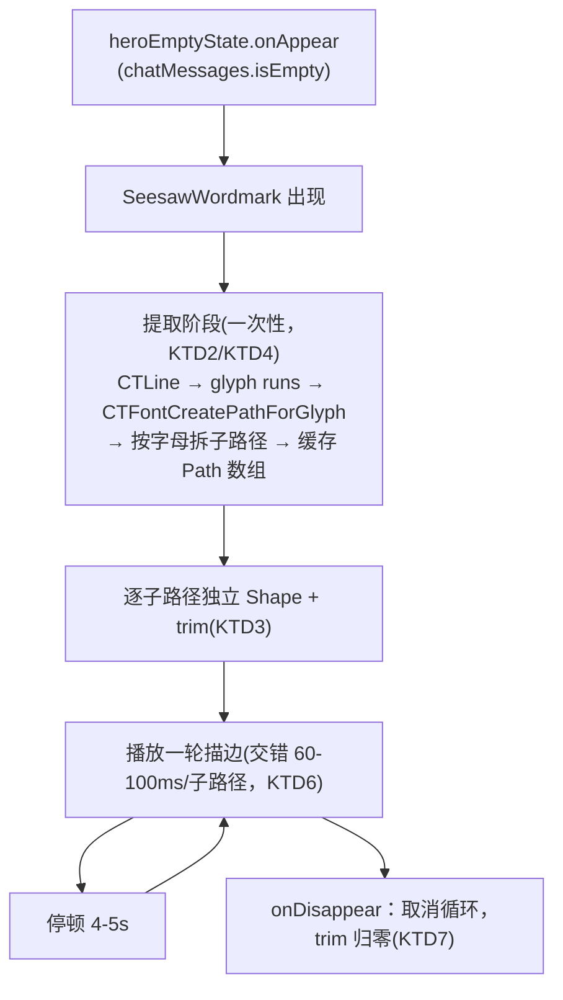

# Seesaw 空态顶部 doodle 换成线条描边字标 - Plan

## Goal Capsule

- **Objective:** `heroEmptyState` 顶部的 `orb` 光晕球换成"Seesaw"线条字标，用系统字体轮廓逐字母描边动画进入，循环重播。
- **Product authority:** 用户本人（KSSDeck 唯一使用者与决策者）。
- **Open blockers:** 无——尺寸、触发时机、字体与回退方案均已在对话中确认，技术路径（CoreText 字形提取）已选定。

## Product Contract

### Summary

`Sources/KSSDesktop/Views/AIChatView.swift` 的 `heroEmptyState` 顶部，`orb`（径向渐变光晕球）换成一个"Seesaw"线条字标：用 CoreText 提取系统字体轮廓、逐字母描边动画进入，每 4-5 秒循环重播，stroke 颜色跟随主题文字色，亮暗两种外观、9 套设计系统下都清晰可辨。

### Problem Frame

用户提供了一个经典的 SVG 线条描边动画参考——渲染出来是 Chime App 的 "chime." 词标，是前端圈"getTotalLength + stroke-dashoffset"逐笔描边技法的知名示例。这个技法值得复刻，但字形要换成 KSSDeck 自己的 "Seesaw"。Seesaw 是全应用唯一的 AI 入口（参见侧边栏那个常驻大按钮），空态页顶部这个位置目前是一个通用的光晕球，没有传达"这是 Seesaw"这件事；复用这个描边技法给它一个专属的、动态的视觉身份，比静态光晕球更贴切。

### Key Decisions

- **KD1 — 字形来源用 CoreText 字体轮廓提取，不手绘 bezier path。** 参考 SVG 的 "chime." 字形是手工矢量画出来的固定 path 数据；KSSDeck 要显示不同的词 "Seesaw"，与其重新手绘一版，不如直接用系统字体的字形轮廓 API 逐字母取路径再描边——不依赖仓库外的设计产出，以后想换字体或字号都是代码层面的事，不用重新画。
- **KD2 — xcom 主题用 Chirp 字体，其余 8 套经典主题回退 SF Pro Rounded Heavy。** Chirp 是 xcom 主题专属打包字体（`theme.nativeFontFamily`），经典主题下不存在；SF Pro Rounded Heavy 是系统自带圆体粗体，视觉气质与 Chirp 接近（都是圆润重体），两套主题体系下这个 doodle 都保持气泡感，不会因为主题切换掉到系统默认字重。
- **KD3 — 循环重播，不响应系统 Reduce Motion。** 每 4-5 秒完整重播一次描边动画，持续传达"这里有活的东西"。KSSDeck 是用户本人独占的本地工具，这里明确不考虑无障碍偏好设置——是选择，不是遗漏。

### Requirements

**doodle 替换**
- R1. `heroEmptyState` 顶部的 `orb` 移除，替换成"Seesaw"线条字标，位置沿用 `orb` 原有的插入点（问候语"你好"上方）。
- R2. 字标是描边渲染（stroke-only，无填充、无背景色块），透明背景，叠加在 `theme.canvas` 上不留矩形边框痕迹。
- R3. 字标宽度约 220pt（参照 `orb` 现有的视觉体量，不抢占问候语和输入卡的注意力）。

**取字与描边**
- R4. 字标内容固定为 "Seesaw" 六个字符，逐字母用系统字体轮廓 API 取字形路径。
- R5. xcom 主题下用 Chirp 字体渲染字形；其余 8 套经典设计系统下回退 SF Pro Rounded Heavy（KD2）。

**动画**
- R6. 进入空态页（`store.chatMessages.isEmpty` 为真）时，每个字母各自从无到有描边画出，字母间允许轻微先后交错，不要求逐帧精确复刻参考 SVG 的交错时长。
- R7. 描边动画完成后间隔 4-5 秒，自动重新播放一次完整描边动画，持续循环，直到离开该空态页（KD3）。

**主题适配**
- R8. 字标 stroke 颜色跟随当前主题的正文文字色 token，亮色外观和暗色外观下都清晰可辨，不需要为这个 doodle 单独定义新的颜色 token。

### Acceptance Examples

- AE1. 动画生命周期
  - **Covers:** R6, R7
  - **Given** 用户导航到 Seesaw 页面且当前无历史消息
  - **When** 空态页出现
  - **Then** "Seesaw" 字标立即开始逐字母描边动画；完成后停顿 4-5 秒再次完整重播；若用户在动画进行中离开该页面（发送了第一条消息、切到别的 workspace section），动画停止，不残留半途描边状态、不在后台继续跑。

### Scope Boundaries

- 不改变 `heroEmptyState` 顶部以外的任何内容——问候语（"你好"/"今天复盘点什么？"）、输入卡、能力卡区域保持原样。
- 不响应系统 Reduce Motion 偏好设置（KD3）。
- 不保留参考图里的 "chime." 品牌字形，只借用线条描边这个动画技法。

### Dependencies / Assumptions

- 假定系统字体轮廓 API 能对 Chirp 与 SF Pro Rounded 两种字体的 "Seesaw" 六个字符给出可用的矢量轮廓；若某个字符在某字体下轮廓质量不理想（断裂、变形），属于执行期需要处理的细节，不阻塞本次范围确认。
- `orb` 的移除是直接删除，不保留开关或回退路径——不是 `WorkspaceSection.hidden` 那种"暂停类"排除，这里没有可复用的显示/隐藏机制，`orb` 相关代码随实现直接清理。

### Outstanding Questions

**Deferred to Planning**
- 描边动画的具体时长、字母间交错延迟、缓动曲线数值——R6/R7 只定了行为（逐字母描边、循环间隔 4-5 秒），具体毫秒数由实现时试出观感。已在 Planning Contract 的 KTD6 给出起始参数。

---

## Planning Contract

**Product Contract preservation:** unchanged — R1-R8、AE1、KD1-KD3 均未改动。规划阶段新增的"子路径级独立描边"（KTD3）是对 R6 的实现精细化，不改变 R6 本身的文字；用户在规划对话中明确选择接受这层额外复杂度，而不是简化处理 e/a 这类有镂空字母的描边效果。

### Key Technical Decisions

- **KTD1 — 新建独立文件 `Sources/KSSDesktop/Views/SeesawWordmark.swift`，不改 `AIChatView.swift` 的既有结构。** 新逻辑量不小（CoreText 提取 + 子路径拆分 + 动画状态机 + 主题接入），塞进 373 行的 `AIChatView.swift` 会让文件职责变杂；`AIChatView.swift` 只需删掉 `orb` 属性、换成一行对新组件的调用（对应 R1）。
- **KTD2 — CoreText 字形提取走 `CTLineCreateWithAttributedString` → `CTLineGetGlyphRuns` → `CTRunGetPositions` → `CTFontCreatePathForGlyph`，不手动算 advance width。** 这是标准路径，能正确处理字距/连字，短字符串同样适用（外部研究确认，见 Sources）。取出的 `CGPath` 在字形坐标系是 Y 轴朝上，SwiftUI `Path` 是 Y 轴朝下——用 `CGAffineTransform(scaleX: 1, y: -1)` + 平移校正，按整条组合路径的 bounding rect 统一计算，不逐字母各自计算（逐字母单独 flip 容易导致基线不齐）。
- **KTD3 — 每个字母的 `CGPath` 先拆成独立子路径（外轮廓 + 镂空各自一条），再各自建 `Shape` + 独立 `.trim()`。** SwiftUI 的 `.trim(from:to:)` 把整条路径（含所有子路径）当成一段连续弧长处理，不按子路径边界切分——"e"/"a" 这类有镂空的字母如果不拆，镂空会在累计弧长跨过外轮廓总长时"突然出现"，不是顺着描边出来的（外部研究以 `Circle().stroke()` 的双子路径案例证实这个机制，见 Sources）。子路径拆分没有现成 API，需要遍历 `CGPath` 的 `applyWithBlock`/`CGPathElement` 序列，按 `.moveToPoint` 分段收集。用户已确认接受这层额外实现复杂度（对应 R6）。
- **KTD4 — 字形路径只在数据变化时计算一次并缓存，不在每帧 `path(in:)` 里重新调用 CoreText。** SwiftUI 在 trim 动画的每一帧都会重新求值 `Shape.path(in:)`；每帧都重跑 CTFontCreatePathForGlyph + 子路径拆分是不必要的重复计算。做法：提取阶段一次性算出所有子路径的 `CGPath` 并转成 SwiftUI `Path`，`Shape.path(in:)` 只做已缓存 `Path` 的定位缩放，不重新调用 CoreText。
- **KTD5 — 字体选择复用 `Theme.swift` 已有的 `nativeFontFamily` 判断模式。** `theme.system == .xcom` 时用 Chirp（`theme.nativeFontFamily`），否则用系统 "SF Pro Rounded" + `.heavy` 粗细（对应 KD2）。不新增字体资源、不新增主题 token——判断逻辑与 `SidebarView.swift` 的 `navRow`/`seesawCTA` 现有 `isXcom` 分支风格一致。
- **KTD6 — 动画时序起始参数（供实现时试调，非最终锁定值）：每条子路径 trim 0→1 用 700-900ms、`easeInOut` 缓动；子路径之间交错 60-100ms；一轮描边完成后停顿 4-5 秒再触发下一轮循环。** 对应 R7 与 Outstanding Questions 里"具体毫秒数由实现时试出观感"，具体数值在实现阶段用实机截图/肉眼判断微调。
- **KTD7 — 动画生命周期绑定 `heroEmptyState` 的可见性，不绑定应用级全局状态。** 进入空态页（`chatMessages.isEmpty` 为真且该 view 出现）时启动循环；离开该页（`onDisappear`，或 `chatMessages` 变为非空导致 view 切换）时取消计时、重置 trim 进度到 0，不留后台计时器（对应 AE1）。

### High-Level Technical Design

### Risks & Dependencies

- **风险：** SF Pro Rounded Heavy 在 macOS 14+ 的可用性未经实现时验证（系统字体，预期存在，但不同系统版本的圆体族命名/粗细档位可能有差异）。**缓解：** U4 实现时用 `CTFontCreateWithName` 后检查返回的 `CTFont` 的 `CTFontCopyPostScriptName` 是否命中预期族名；命不中就退到 `.system(size:weight:.heavy, design: .rounded)`（SwiftUI 原生圆体系统字体，必然可用），保证任何系统版本下都有圆润气泡感的回退，不会掉到默认无衬线字体。
- **风险：** 不同字体、不同字符的子路径数量与缠绕方向（winding）不完全可预测——KTD3 的拆分逻辑需要对"没有镂空的字母只有 1 条子路径"这类情况也能正确处理，不能假设每个字母都至少有 2 条子路径。**缓解：** U1 的测试场景已覆盖"至少 1 条子路径"这类宽松断言（而非精确子路径数），拆分函数按通用 `moveToPoint` 分段逻辑处理，不针对具体字母数量写死分支。

### Sequencing

U1（提取工具）是唯一的纯逻辑基础层，先行；U2（渲染层）依赖 U1；U3（动画生命周期）依赖 U2；U4（主题适配）依赖 U1、U2，可与 U3 并行开发；U5（接入 `AIChatView`）依赖前四者，最后落地。

### Sources / Research

- [`CTFontCreatePathForGlyph` 官方文档](https://developer.apple.com/documentation/coretext/ctfontcreatepathforglyph(_:_:_:)) — `matrix` 参数常用于提供到目标字形原点的平移，支持把 Y 轴校正直接烘进取路径这一步（KTD2）。
- [How to Animate Handwriting in SwiftUI（Medium, 2025-06）](https://medium.com/@justdoswift/how-to-animate-handwriting-in-swiftui-195341c7942a) 与 [Converting Font to Shape in SwiftUI（SwiftUISnippets, 2025-11）](https://swiftuisnippets.wordpress.com/2025/11/24/converting-font-to-shape-in-swiftui/) — 两篇独立实现均采用 CTLine → glyph runs → CTFontCreatePathForGlyph 的取字路径，佐证 KTD2 是这个技术方向的标准做法。
- [Stack Overflow 77217847](https://stackoverflow.com/questions/77217847) — 用 `Circle().stroke()` 的双子路径案例证实 SwiftUI `.trim()` 按路径插入顺序线性处理弧长、不按子路径边界切分，是 KTD3 的直接依据。
- [CGPath 子路径拆分实现思路（myell0w gist）](https://gist.github.com/myell0w/39631f89f6312815a78d3617017c23f7) — 遍历 `CGPathElement` 按 `.moveToPoint` 分段的参考实现，KTD3 的拆分方法基于此思路。
- macOS 15+ 的 `TextRenderer` 协议原生支持逐字形动画，但目标最低系统版本是 macOS 14（`Package.swift`），故未采用，继续走 CoreText/CGPath 路线。

---

## Implementation Units

### U1. CoreText 字形提取 + 子路径拆分工具

- **Goal:** 给定字符串 + `CTFont`，返回按字母分组、按子路径展开的路径数据（外层=字母，内层=该字母的子路径），坐标系已校正为 SwiftUI Y 轴朝下、整体在统一的 bounding box 内定位。
- **Requirements:** R4, R5
- **Dependencies:** 无
- **Files:** `Sources/KSSDesktop/Views/SeesawWordmark.swift`（新建）、`Tests/KSSDesktopTests/SeesawWordmarkTests.swift`（新建）
- **Approach:** `CTLineCreateWithAttributedString` 用给定 `CTFont` 构造整行；`CTLineGetGlyphRuns` 遍历 run；每个 glyph 用 `CTRunGetPositions` 取位置、`CTFontCreatePathForGlyph` 取轮廓（KTD2）。用 `CGAffineTransform(scaleX: 1, y: -1)` + 基于整行 bounding rect 的平移校正 Y 轴。每个字母的 `CGPath` 用 `applyWithBlock` 遍历 element，按 `.moveToPoint` 分段拆成独立子路径数组（KTD3）。按字母分组返回，供 U2 逐字母、逐子路径渲染。
- **Patterns to follow:** `Sources/KSSDesktop/Support/Theme.swift` 里 `CTFontDescriptorCreateWithNameAndSize`/`CTFontCreateWithFontDescriptor` 的用法风格（同一批 CoreText API 家族）。
- **Execution note:** 这一层是纯 Swift/Foundation 逻辑，不依赖 SwiftUI 渲染，适合先写测试锁定子路径拆分行为，再实现。
- **Test scenarios:**
  - 给定系统字体 + "Seesaw"，返回的字母分组数量等于 6。
  - "e"（有镂空的字母）返回的子路径数组长度 ≥ 2；"s"/"w"（无镂空）返回的子路径数组长度为 1（断言"大于1"而非精确值，避免对字体渲染细节过拟合，见 Risks）。
  - 每个子路径的 `CGPath` 非空（`boundingBoxOfPath` 有非零宽高）。
  - 空字符串或字体查找失败的场景，函数不崩溃、返回空数组。
- **Verification:** `swift test` 跑通 `SeesawWordmarkTests`。

### U2. SwiftUI Shape 包装 + 逐子路径独立 trim 渲染

- **Goal:** 把 U1 提取的子路径包装成可独立 `.trim()` 的 SwiftUI 视图，能按 0→1 的进度参数分别驱动每条子路径的描边。
- **Requirements:** R2, R3
- **Dependencies:** U1
- **Files:** `Sources/KSSDesktop/Views/SeesawWordmark.swift`、`Tests/KSSDesktopTests/SeesawWordmarkTests.swift`
- **Approach:** 每条子路径包一个符合 `Shape` 协议的自定义类型，`path(in:)` 直接返回 U1 缓存好的 `Path`，按传入 `rect` 做等比缩放定位，不重新调用 CoreText（KTD4）。外层叠放所有子路径的 stroke，每条各自 `.trim(from: 0, to: progress[i])`，`progress` 是按子路径索引驱动的进度状态。Stroke 用 `.stroke(color, lineWidth: 2)`，无 `.fill()`（对应 R2）。整体按原始 bounding box 比例算出 220pt 宽对应的高度（R3）。
- **Execution note:** `path(in:)` 是纯函数（给定 `rect` 返回 `Path`，不依赖视图生命周期），可以脱离宿主视图直接单测——不需要渲染到屏幕就能断言返回的 `Path` 的边界与内容。
- **Test scenarios:**
  - 给定已知 `Path`（如一个简单矩形/圆形子路径）与目标 `rect`，构造 Shape 后调用 `path(in:)`，返回 `Path` 的 `boundingRect` 落在传入 `rect` 内且不失真（等比缩放，不拉伸变形）。
  - `path(in:)` 不重新调用 CoreText（KTD4）——用一个计数器包装的假字体源验证：多次调用 `path(in:)`（模拟 trim 动画逐帧重绘）不会让 CoreText 提取逻辑的调用计数增加。
  - Test expectation for 实际渲染观感（stroke 颜色、trim 进度可视效果）: none -- 依赖真实屏幕像素，靠 U5 集成后的实机截图验证。
- **Verification:** `swift test` 覆盖 `path(in:)` 的纯函数行为；stroke/trim 视觉效果随 U5 一并做实机截图核对。

### U3. 描边动画生命周期

- **Goal:** 驱动 U2 的 `progress` 数组按 KTD6 的时序播放一轮描边，播完停顿 4-5 秒后自动重播，视图消失时取消并归零。
- **Requirements:** R6, R7
- **Dependencies:** U2
- **Files:** `Sources/KSSDesktop/Views/SeesawWordmark.swift`
- **Approach:** `onAppear` 触发首轮播放：按子路径顺序，用交错 delay（KTD6 起始值 60-100ms）+ `withAnimation(.easeInOut(duration: 0.7...0.9))` 把每条子路径的 `progress[i]` 从 0 动到 1。一轮播完后等待 4-5 秒（用 `.task` 便于随视图生命周期自动取消），重置 `progress` 为 0 再重新播放，循环往复。`.task` 被取消（视图消失）时终止循环、重置 `progress` 为 0（KTD7、AE1）。
- **Test scenarios:**
  - Test expectation: none -- 时序/生命周期靠实机观察，不是能稳定断言的单元测试目标。
- **Verification:** 实机验证：进入 Seesaw 空态页观察描边播放；等待一轮间隔看到重播；切换到别的 workspace section 后返回，确认动画从头开始、不残留上次进度（AE1）。

### U4. 主题适配：字体选择 + 描边色 + 尺寸

- **Goal:** `SeesawWordmark` 按当前主题选对字体（KTD5）、描边色跟随 `theme.textPrimary`（R8），整体宽度约 220pt（R3，与 U2 的 frame 设置整合）。
- **Requirements:** R5, R8
- **Dependencies:** U1, U2
- **Files:** `Sources/KSSDesktop/Views/SeesawWordmark.swift`、`Tests/KSSDesktopTests/SeesawWordmarkTests.swift`
- **Approach:** `theme.system == .xcom` 时取 `theme.nativeFontFamily`（Chirp）对应的 `CTFont`；否则用系统 "SF Pro Rounded"、`.heavy` 粗细（KTD5）。stroke 颜色绑 `theme.textPrimary`，随亮/暗外观自动切换，不新增颜色 token（R8）。
- **Patterns to follow:** `Sources/KSSDesktop/Views/SidebarView.swift` 里 `navRow`/`seesawCTA` 对 `theme.system == .xcom` 的判断写法。
- **Execution note:** 字体选择分支（"给定主题返回哪个字体名"）是不依赖 UI 渲染的纯函数，单测覆盖分支逻辑；描边色/视觉观感留给实机截图。
- **Test scenarios:**
  - 给定 `theme.system == .xcom`，字体选择函数返回 Chirp 对应的字体标识（`theme.nativeFontFamily`）。
  - 给定任一经典主题（`theme.system != .xcom`），字体选择函数返回 "SF Pro Rounded"。
  - Test expectation for 描边色对比度/字体渲染观感: none -- 依赖真实屏幕像素，靠下方实机截图验证。
- **Verification:** `swift test` 覆盖字体选择分支；xcom 亮色/暗色、经典主题（任选一个）各截图一次，确认字体气质（圆润重体）和描边色对比度都清晰可辨。

### U5. 接入 AIChatView.heroEmptyState

- **Goal:** `heroEmptyState` 顶部的 `orb` 移除，替换成 `SeesawWordmark`，位置沿用 `orb` 原有插入点。
- **Requirements:** R1
- **Dependencies:** U1, U2, U3, U4
- **Files:** `Sources/KSSDesktop/Views/AIChatView.swift`
- **Approach:** 删除 `orb` 计算属性与其调用点，换成 `SeesawWordmark()`，沿用相同的 `.padding(.bottom, 22)` 或按新组件实际尺寸微调，保持问候语间距观感不变。
- **Test scenarios:**
  - Test expectation: none -- 纯替换现有调用点，行为由 U1-U4 各自验证覆盖。
- **Verification:** 实机进入 Seesaw 空态页，确认 `orb` 消失、新字标出现在原位置，"你好"及以下内容布局不受影响。

---

## Verification Contract

| 验证项 | 命令/方式 | 适用单元 |
|---|---|---|
| 编译通过 | `swift build` | 全部 |
| 单元测试 | `swift test`（含新增 `SeesawWordmarkTests`） | U1, U2, U4 |
| 描边动画生命周期 | 实机进入/停顿等待/离开空态页，观察播放/循环/停止 | U3, U5 |
| 主题适配可辨识度 | xcom 亮/暗 + 经典主题各截图一次 | U4 |
| 集成回归 | 实机确认问候语/输入卡/能力卡布局不受影响 | U5 |

## Definition of Done

- `orb` 完全移除，`heroEmptyState` 顶部显示"Seesaw"线条字标（R1）。
- 字标为纯描边、无填充、透明背景（R2），宽度约 220pt（R3）。
- 逐字母、逐子路径独立描边动画，"e"/"a" 这类有镂空的字母镂空跟着自己的子路径顺序描边，不是突然出现（R4, R6, KTD3）。
- 进入空态页自动播放，播完停顿 4-5 秒循环重播，离开页面时动画停止且不残留进度（R7, AE1）。
- xcom 主题用 Chirp 字体，其余 8 套经典主题回退 SF Pro Rounded Heavy，描边色跟随 `theme.textPrimary`，亮/暗外观下都清晰可辨（R5, R8）。
- `swift build` 与 `swift test` 全绿，新增 `SeesawWordmarkTests` 覆盖子路径拆分逻辑。
- 无遗留调试代码、无死代码——原 `orb` 相关代码彻底清理，不留注释掉的旧实现。
