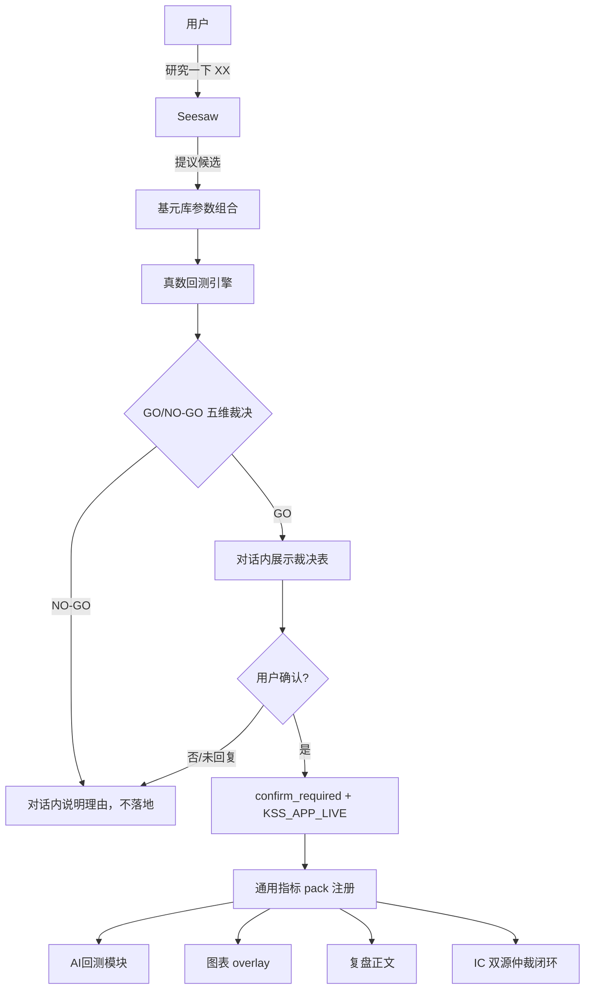
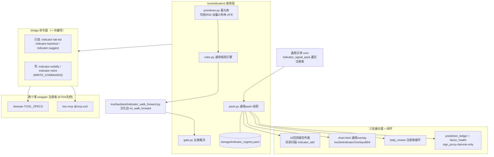

# Seesaw 指标研究回测新技能 - Plan

## Goal Capsule

- **目标**：给 Seesaw（KSSDeck 内置 AI 助手）新增分步骤写工具——从预注册参数化指标基元库提议候选、真数回测、GO/NO-GO 裁决、经用户确认后固化进 AI回测/图表/复盘三处，并把这三处从 mi 硬编码泛化为指标注册表；固化策略接入 IC 双源仲裁闭环（诚实口径：demote-only）。
- **产品权威**：Product Contract（R1-R12，用户已确认）> 本 Planning Contract > 实现时自由裁量。与 Product Contract 冲突时停下询问，不静默改产品行为。
- **执行档位**：按 U1→U9 依赖序执行；U6/U9 涉及 Swift 改动，需一次签名打包验收（R10）。
- **停止条件**：任何单元发现须改 `mi_signal.py` 计算语义、或须改 `prediction_ledger` 现有表结构（新增列以外）时停下确认——两者都可能破坏已上线口径。

---

## Product Contract

### Summary

给 Seesaw 新增一套分步骤、可打断的写工具：从预注册的参数化技术指标基元库出发，对真实 A 股数据回测、套用现有 GO/NO-GO 门禁裁决，经用户在对话中确认后固化进 AI回测、图表、复盘。同时把这三处目前硬编码到单一 mi 指标的机制，一次性泛化成能容纳任意基元库指标的通用注册表；固化后的策略接入现有 IC 双源仲裁闭环做持续验证。

### Problem Frame

今天要把一个指标从想法跑到上线，唯一路径是开一个 Claude Code 会话，手动走 `.claude/skills/kss-indicator-pipeline/SKILL.md` 的 P0-P7：人在场、逐阶段确认、跑完还要过一次应用签名打包才能真正在 App 里看到图和复盘。这条路径本身没问题，但意味着每次想验证一个新想法都要切换到 Claude Code 环境，且完全依赖用户主动发起——没有人在中间随口一问，或者 Seesaw 自己在合适的时机提议。

Seesaw（原"AI 复盘助手"面板）今天是纯请求-响应式的 chat loop，工具集（`scripts/kss_chat_loop.py:71-124`）只有一批只读 bridge 命令加几个受限的写操作（`run_task`/`cron_*`），完全没有触达指标研究或回测执行的路径。同时，AI回测模块的报告列表是硬编码的 8 条路径数组（`scripts/kss_app_bridge.py:406-416`），图表 overlay（`ChartWebView.swift`/`chart.html`）和复盘注入（`daily_review.py:915`）都专属硬编码给 mi 一个指标——这意味着即使给 Seesaw 加上写工具，新指标要真正"上图、上复盘"，仍然会撞上这三处硬编码的墙。

### Key Decisions

- **执行主体是 Seesaw 本身，不是 Claude Code 会话**：新写工具直接挂在 Seesaw 的 sidecar tool-calling loop 上，用户在 App 内随时触发，不需要另开 Claude Code 会话。
- **不走 recipe 机制**：现有 recipe 明确禁止调用 LLM、禁止写操作（`scripts/kss_recipes.py:7-17` 的 KTD-2/KTD-4 不变量），新能力必须作为独立的 gated write-tool 加入 Seesaw 的 TOOL_SPECS，不是扩展 recipe。
- **指标研究限定在预注册参数化基元库**：换取工程与安全成本可控，不给 Seesaw 代码生成或发明全新公式的能力（对比 MI 当年由 Claude Code 手写）；这条边界可在后续单独立项放开。
- **分步骤而非一键流水线**：候选提议、单次回测、GO/NO-GO 裁决各自独立工具调用，可在对话中打断、追问、换参数，优先透明度而非单轮效率。
- **固化前必须人工确认**：延续现有全部写操作的 `confirm_required` + `KSS_APP_LIVE` 双闸模式，不做无人值守自动上线。
- **v1 主动提议只做会话开场，不做后台定时+推送**：把"无需请求也能触发"的诉求收窄到"打开面板时主动开口"，不新增后台调度与推送链路。
- **AI回测/图表/复盘 三处的泛化是本次范围内的基建投入，不是可选项**：不泛化，固化的新指标就上不了图、上不了复盘，等于没交付"复盘图表植入"这一环；泛化完成后需要一次配套的应用签名打包，此后同一基元库内的新指标不再需要重复这个周期。

### Actors

- A1. **用户** — KSS 唯一操作者，通过 Seesaw 对话发起研究请求、审阅 GO/NO-GO 结果、确认固化。
- A2. **Seesaw（sidecar chat loop）** — 持有新写工具，驱动"提议→回测→裁决→（等待确认）→固化"的分步流程。
- A3. **KSS 真数回测引擎**（`kss/backtest/`、`kss/features/`）— 被 Seesaw 的写工具调用，产出真实回测结果，本次不修改其内部逻辑。
- A4. **写闸机制**（`confirm_required` + `KSS_APP_LIVE`）— 拦截固化前的写请求，等待用户显式批准。
- A5. **AI回测/图表/复盘 三处展示面** — 泛化后的通用注册消费方，读取已确认的固化结果。
- A6. **现有 IC 双源仲裁闭环**（`prediction_ledger` + `factor_health`）— 接收固化后的策略，做持续实盘后验。

### Requirements

**指标研究与真数回测**

- R1. Seesaw 新增一组分步骤 write-tool（沿用现有 `confirm_required`/`KSS_APP_LIVE` 写闸模式），覆盖"提议候选→单次回测→GO/NO-GO 裁决"三个阶段，任意一步都在对话历史中可见、可打断。
- R2. 候选指标只能从预注册的参数化技术指标基元库中组合、调参产生；Seesaw 不具备生成新特征工程代码或发明全新公式的能力。v1 基元库覆盖三类：均线类（SMA/EWM 交叉）、阈值类（RSI/动量 Z 分）、波动类（布林带/ATR 止损）。
- R3. 回测复用现有真数回测基础设施（`kss/backtest/`、`kss/features/`）与既有 GO/NO-GO 五维裁决表（经济意义/稳健/可交易/可解释/运维），不新造裁决标准。
- R4. 候选标的池按 kss-indicator-pipeline 既有惯例递进（先指数/板块子集，再落到当前自选），并与 buy&hold、固定参数基线对照。

**固化确认闸**

- R5. GO 门禁通过后，Seesaw 必须在对话中展示裁决结果表并等待用户显式确认；未确认前，研究结论只存在于对话历史中，不写入任何持久存储。
- R6. 固化写入动作复用现有 `request_write` → `confirm_required` → `KSS_APP_LIVE` 写闸链路；`KSS_APP_LIVE` 未开启时固化恒被拒绝。

**AI回测/图表/复盘 通用化基建**

- R7. AI回测模块的报告来源从当前硬编码的固定路径列表，改为可容纳任意已注册指标产出的通用注册机制（类似复盘模块已有的目录扫描模式）。
- R8. 图表 overlay 管线（Swift 属性、bridge JSON 键、`chart.html` JS 接口）从当前专属 mi 一个指标的实现，泛化为可承载基元库中任意指标的通用 schema，避免每新增一个指标就要专属实现。
- R9. 复盘（daily_review）指标段落注入从当前对单一指标的 inline 硬编码调用，改为遍历已注册指标产出的通用循环。
- R10. 完成 R7-R9 泛化后，需要一次配套的应用签名打包发布；此后基元库范围内新增的指标固化，不再需要新的签名打包周期。

**主动提议**

- R11. 用户打开 Seesaw 面板且未提出具体请求时，Seesaw 可在对话开场主动提议一个候选指标及回测理由；候选在面板打开时实时从基元库计算，不依赖任何后台定时任务、批量扫描候选池或推送通知，App 未打开时不产生任何活动。

**接入现有回测闭环**

- R12. 用户确认固化后的策略，接入现有 IC 双源仲裁闭环（`prediction_ledger` + `factor_health`），按现有口径持续做实盘后验，不再是一次性静态裁决。

### Key Flows

- F1. **用户主动请求研究**
  - **Trigger:** 用户在 Seesaw 对话中提出"研究一下 XX 类指标"。
  - **Actors:** A1, A2, A3, A4
  - **Steps:** Seesaw 从基元库提议候选 → 逐个/逐组调用真数回测 → 生成 GO/NO-GO 裁决表并展示 → 用户确认固化 → 走 `confirm_required`/`KSS_APP_LIVE` 写闸 → 通用注册机制落地到 AI回测/图表/复盘 → 策略接入 IC 双源仲裁闭环。
  - **Covers:** R1-R12

- F2. **会话开场主动提议**
  - **Trigger:** 用户打开 Seesaw 面板，未提出具体请求。
  - **Actors:** A1, A2
  - **Steps:** Seesaw 从基元库选一个候选，给出提议理由；用户可接受（并入 F1 后续步骤）或忽略。
  - **Covers:** R11

- F3. **NO-GO 场景**
  - **Trigger:** 回测结果未通过 GO/NO-GO 裁决。
  - **Actors:** A1, A2, A3
  - **Steps:** Seesaw 在对话中说明未通过的具体维度，不触发写闸，不产生任何持久化；裁决记入 NO-GO 记忆，避免重复提议。
  - **Covers:** R3, R5

### Acceptance Examples

- AE1. Given 用户在 Seesaw 里说"研究一下 RSI 阈值指标"，When 回测通过 GO 门禁且用户回复确认，Then 结果同时出现在 AI回测报告列表、对应个股图表 overlay、当日复盘正文，且无需任何新的签名打包动作。Covers R1, R5-R10.
- AE2. Given 同样的请求但回测未通过 GO 门禁，When Seesaw 展示 NO-GO 理由，Then 不产生任何写请求，AI回测/图表/复盘三处均无新增内容。Covers R3, R5.
- AE3. Given GO 门禁通过但用户未回复确认或明确拒绝，When 对话结束，Then 研究结论仅留在聊天记录里，不写入任何持久存储。Covers R5, R6.
- AE4. Given `KSS_APP_LIVE` 未开启，When 用户对已过 GO 门禁的候选回复确认，Then 固化请求仍被写闸拒绝，与现有其它写操作行为一致。Covers R6.
- AE5. Given 用户打开 Seesaw 面板但未提出具体请求，When 面板加载完成，Then Seesaw 主动提议一个基元库内候选指标及回测理由，且不依赖任何后台定时任务。Covers R11.

### Scope Boundaries

**Deferred for later**

- 开放式代码生成/发明全新指标公式（类似当年 MI）——需要给 Seesaw 某种沙盒代码执行能力，工程与安全审查成本值得单独立项。
- 后台定时扫描 + 推送通知式的真正无人值守发现——需要新增类似 `cron_jobs.yaml` 的调度链路和推送通道，v1 先做会话开场提议验证价值。

**Deferred to Follow-Up Work**

- IC 仲裁 promote 路径的生产驱动（CPCV sign_proxy 先验注入）——`docs/solutions/known_bias_gaps.md` 记录的既有欠账，本计划按 demote-only 现状接线，不顺手补。
- 旧 `miSignal`/`miOverlay` 专属字段与 `kssSetMiOverlay` JS 接口的移除——迁移期保留兼容输出，待通用链路跑稳一个发布周期后单独清理。

### Dependencies / Assumptions

- 依赖现有 `kss/backtest/`（`lookahead_guard`、`mi_walk_forward` 骨架、`metrics`）与 `kss/features/technical.py` 作为回测执行底座，本次不新造回测引擎。
- 依赖 `.claude/skills/kss-indicator-pipeline/SKILL.md` 的 P0-P7 阶段划分与 GO/NO-GO 五维表作为既有裁决基准。
- 依赖现有 `confirm_required`/`KSS_APP_LIVE` 写闸模式（`scripts/kss_sidecar.py:41-148`、`scripts/kss_chat_loop.py:116-123`）作为固化确认的复用机制。
- 依赖现有 IC 双源仲裁闭环承接固化后策略的持续验证；新固化策略在攒够约 20 个去重交易日前，与闭环内其它策略一样处于 `insufficient_n` 仅供参考状态——这是继承自现有回测闭环的门控，不是本次新引入的限制。
- 假设：AI回测/图表/复盘三处泛化完成后的一次签名打包，覆盖 v1 基元库的全部指标类型；后续只要新指标仍来自同一批基元，不再需要额外打包。

### Sources / Research

- `.claude/skills/kss-indicator-pipeline/SKILL.md` + `references/worked-example-mi.md` — P0-P7 工作流、MI 路径对照表、打包反模式清单（`__pycache__` 毁签名、markers 须落 history 窗、横幅放图区外）。
- `scripts/kss_chat_loop.py:71-124`（TOOL_SPECS/`_spec` 注册）、`:116-123`（写工具声明）、`:214-222`（number_guard）；`scripts/kss_sidecar.py:41-148`（`_CHAT_LOOP_LIVE`、confirm reader、`request_write`、confirm 超时 300s）。
- `scripts/kss_app_bridge.py`：`WRITE_COMMANDS`（:3677）、`COMMANDS` 注册表+漂移守卫（:3691，`test_bridge_orientation`）、`RUN_TASKS`（:3737，已含 `mi-signal-pack`）、`run_task` 子进程约定（:1535-1608，`_run_process_task`+timeout 600-900s+artifacts+任务历史审计）、`_backtest_reports` 硬编码列表（:406-431）、`stock_detail` mi 挂载（:3025-3044）、read 命令惰性落盘先例（`_persist_page_pull` :4459）。
- `kss/strategies/mi_pack.py` — 泛化母版：`load_rules`/`resolve_rule`/`write_pack`/`read_pack`/`build_pack_from_wf`/`to_mi_signal`/`to_mi_overlay`/`format_mi_section`/`load_ohlcv`/`run_symbol_pack`；`state_root()` 纪律（:36-45）。
- `kss/backtest/mi_walk_forward.py:20-48` — `WFConfig`（train 252/retrain 20/holdout 63/min_trades 4，N 网格+Z 阈值网格）与 `WFResult`。
- `kss/features/technical.py` — 现成基元：`momentum`/`moving_averages`/`macd`/`rsi`/`kdj`/`bollinger`。
- `kss/prediction/ledger.py` — `PredictionRecord` 含 `strategy` 字段；主键 `prediction_id = "{prediction_date}_{symbol}"`（:18）**不含 strategy**。
- `kss/backtest/factor_health.py:57-78` — 状态机、`VERDICT_*`、`IC_METHOD_RANK_IC` vs `IC_METHOD_SIGN_PROXY` 口径守卫。
- `docs/solutions/known_bias_gaps.md:102-130` — 诚实状态：#8 仲裁对 factor 级 sign_proxy 是 demote-only、跨口径拒比、账本 dual-write 影子期。
- `docs/solutions/ai_native_surface_assessment.md` — agent parity 支柱、MCP 写姿态（`KSS_MCP_LIVE`+confirm）、数字纪律（LLM 定性、代码渲染真值）。
- `kss/tests/test_mi_pack.py`、`test_mi_signal.py`、`test_mi_signal_pack_e2e.py`、`test_mi_walk_forward.py` — 测试骨架与 fixture 惯例母版。

---

## Planning Contract

**Product Contract preservation**: unchanged——规划期未改动任何 R/A/F/AE 内容（仅 F3 补记 NO-GO 记忆一句，源自用户确认的 call-out 4 配套设计）。

### Key Technical Decisions

- KTD1. **新工具全部走既有写闸模式，不造新闸**。研究期只读命令按 `_spec` 加入 TOOL_SPECS 走 `_make_read_only_call`；固化/退役是新 bridge 写命令，进 `WRITE_COMMANDS` frozenset + `COMMANDS` 注册表 + `kss/config/write_command_labels.yaml` 人话标签，经 `request_write` → `confirm_required` → `KSS_APP_LIVE` 执行。漂移守卫测试（`test_bridge_orientation`）同步更新。
- KTD2. **研究/固化双通道执行**。研究期回测 = 只读 bridge 命令，单票或小批同步执行（批量上限由实现定，须保证单次工具调用远低于 chat loop 240s 轮超时），结果直接返回对话；可按 `_persist_page_pull` 先例把回测结果惰性缓存到 `storage/indicator_lab/runs/`（fail-silent，失败不影响返回）。固化后的日终刷新 = **一条通用 cron 任务**遍历注册表刷新全部 active 指标的 pack——solidify 永不修改 `kss/config/cron_jobs.yaml`（它是随 bundle 的代码配置，运行时不可写）。全自选批量回测如超出同步预算，走既有 `run` 任务白名单新增条目（子进程、timeout 900s 先例）。
- KTD3. **MI 迁入注册表成为第一个条目，存储路径原地不动**。注册表每条目声明自己的 signals 目录与 rules 文件：MI 条目指向现有 `storage/mi_signals/` + `storage/mi_rules.yaml`（零数据迁移，现有 cron/UI 不断），新指标统一 `storage/indicator_signals/<id>/` + `storage/indicator_rules/<id>.yaml`。通用层是唯一代码路径；`mi_pack.py` 的投影函数由通用模块吸收，MI 专属数学（`build_features`/`reestimate`）保留原位被注册表引用。
- KTD4. **注册表与通用 pack schema**。注册表 = `storage/indicator_registry.yaml`（state 侧，运行时可写）：每条目含 `id`/`name`/`family`(基元族)/`params`/`rules_path`/`signals_dir`/`status`(active|retired)/`solidified_at`/`verdict_ref`。通用 pack = MI pack schema 的超集：加 `indicator_id`、`series` 改为通用键（保留 `mi_series` 兼容读）。GO/NO-GO 裁决与 NO-GO 记忆持久化到 `storage/indicator_lab/verdicts/`，`indicator-suggest` 读它避免重复提议（F3）。
- KTD5. **Swift/JS 通用 overlay 为 additive 变更，不 bump 桥协议**。bridge 在 `stock_detail` 上**新增** `indicatorSignals: []`/`indicatorOverlays: []` 数组字段（每元素含 `indicator_id`+现 MI overlay 同构 payload），迁移期 `miSignal`/`miOverlay` 由同一通用路径继续输出（additive 改动不 bump `BRIDGE_SCHEMA_VERSION`，见 :57-59 注释）。`chart.html` 新增 `window.kssSetIndicatorOverlaysB64`（base64 数组注入），按 `indicator_id` 管理独立副图 pane 与 markers，主题重建后重放 `lastOverlays`；markers 时间必须落在 history 窗口内（LWC 静默不画的既有坑）。Swift 端新增通用 `IndicatorSignal`/`IndicatorOverlay` Codable 与通用横幅（图区外，复用 `MiChartBanner` 模式）。
- KTD6. **IC 接线按生产现状收口（用户已确认 call-out 4）**。固化策略的日终 pack 运行同时写 `PredictionRecord(strategy=<indicator_id>)`；`prediction_id` 对非默认策略采用 `{date}_{symbol}_{strategy}` 命名空间（实现前须验证 settle/query 路径不结构化解析 id——若有解析则改用独立表，停下确认）。因子健康度按 `IC_METHOD_SIGN_PROXY` 口径逐指标落 tracker，**demote-only**：不注入回测先验、不新建 promote 驱动，符号分歧照记 `IC_SOURCE_DIVERGENCE`。绝不与 pipeline 的 rank_ic 跨口径比较（`VERDICT_METHOD_MISMATCH` 守卫已在）。
- KTD7. **裁决表代码算、LLM 只叙事**。五维 GO/NO-GO 的每一维由代码给出数值与布尔结论（经济意义=OOS 相对 BH/固定参数、稳健=相邻参数敏感性、可交易=交易次数与滑点后收益、可解释=规则一句话由模板生成、运维=可批跑标志），Seesaw 拿到结构化 verdict 后叙事；金融数字经 number_guard 核对（KTD-5 数字纪律延续）。
- KTD8. **开场提议 = 确定性建议 chip（用户已确认 call-out 3）**。新增只读命令 `indicator-suggest`：读自选列表 + 注册表 + NO-GO 记忆，代码规则选一个候选（如"自选中信号覆盖缺口最大的基元族"）；AIChatView 空态渲染为可点 chip，点击把预填 prompt 送入对话，Seesaw 才开始 LLM 叙事。不空转 LLM 调用。

### High-Level Technical Design

图为组件拓扑权威示意；与正文冲突时以正文为准。

### Assumptions

- 单票 walk-forward 重估（网格规模与 MI 同量级）耗时秒级——`run_mi_signal_pack` 全自选 900s 超时先例反推单票远低于 chat 轮预算。若实测超预算，按 KTD2 的批量上限收缩或转 `run` 任务。
- `_report_metrics`（Sharpe/年化/最大回撤/胜率解析）可直接消费新报告的 markdown 表格式，不需改解析器。

---

## Implementation Units

### U1. 指标基元库与通用规则引擎

- **Goal**: 建 `kss/indicators/` 库层——三族参数化基元（均线交叉/RSI·动量 Z 阈值/布林·ATR）与通用 entry/exit/filter 规则求值，输出与 `mi_signal.positions_from_rules` 同构的仓位序列。
- **Requirements**: R2, R3
- **Dependencies**: 无
- **Files**: `kss/indicators/__init__.py`、`kss/indicators/primitives.py`、`kss/indicators/rules.py`；测试 `kss/tests/test_indicator_primitives.py`、`kss/tests/test_indicator_rules.py`
- **Approach**: 基元 = `{family, params}` 声明式 spec，特征计算复用 `kss/features/technical.py`（`moving_averages`/`rsi`/`momentum`/`bollinger`；ATR 若缺则在 technical.py 补一个静态方法）。规则语义对齐 `mi_signal.RuleSpec`（上穿/下穿/阈值），执行纪律 t 收盘信号 → t+1 开盘，warm-up 期与 MI 同式。参数网格默认值定义在各族 spec 内（对齐 `WFConfig` 网格风格）。
- **Patterns to follow**: `kss/strategies/mi_signal.py`（`build_features`/`positions_from_rules` 的接口形状与防未来函数写法）；`kss/features/technical.py` 的静态方法+`fill_method=None` 纪律。
- **Test scenarios**:
  - 每族基元对合成 OHLCV 产出确定性特征值（金叉日期、RSI 越阈日期、布林突破日期各一例，手工可验）。
  - 仓位序列在信号日之后一根 bar 才变化（无 look-ahead：对信号日当天收益不产生暴露）。
  - 空数据/样本过短（<80 bar）返回明确 skipped 状态，不抛异常。
  - 非法 family/params 拒绝并报错信息含允许值。
- **Verification**: `uv run pytest kss/tests/test_indicator_primitives.py kss/tests/test_indicator_rules.py` 绿；抽一族与手算对照。

### U2. 通用 walk-forward 回测与五维门禁裁决

- **Goal**: 泛化 `mi_walk_forward` 为参数化引擎 + 新 `gate.py` 产出结构化五维 GO/NO-GO verdict。
- **Requirements**: R3, R4
- **Dependencies**: U1
- **Files**: `kss/backtest/indicator_walk_forward.py`、`kss/indicators/gate.py`；测试 `kss/tests/test_indicator_walk_forward.py`、`kss/tests/test_indicator_gate.py`
- **Approach**: WF 引擎接受基元 spec + 网格（train 252/retrain 20/holdout 63/min_trades 4 沿用 `WFConfig` 默认），返回 `WFResult` 同构结果；对照 buy&hold 与固定参数基线。`gate.py` 计算五维：经济意义（OOS 收益 vs BH/固定参数）、稳健（相邻参数点收益不塌方）、可交易（交易次数区间 + 滑点扣减后仍为正）、可解释（规则模板一句话）、运维（可批跑布尔）；输出 `verdict` dataclass（每维数值+结论+总 GO/NO-GO），阈值集中在模块常量便于外化。
- **Patterns to follow**: `kss/backtest/mi_walk_forward.py`（`_score_window` 的 holdout 夏普+回撤惩罚式）；`kss/backtest/metrics.py`。
- **Execution note**: 先为 gate 写失败样例（纯噪声序列必须 NO-GO）再实现——裁决器的假阳性是本单元最大风险。
- **Test scenarios**:
  - Covers AE2. 合成纯噪声序列 → 总裁决 NO-GO 且经济意义维标不过。
  - 合成强趋势序列 + 均线族 → GO，best 参数落在预期邻域。
  - 相邻参数收益断崖的构造样例 → 稳健维不过。
  - 交易次数过稀（数年 1 笔）→ 可交易维不过。
  - WF 与 MI 现网格跑 MI 族（回归）：与 `mi_walk_forward.reestimate` 结果一致。
- **Verification**: 上述测试绿；用 `storage/` 内一只真实自选票跑通端到端并人工核对裁决表数字来自脚本输出。

### U3. 通用 Signal Pack、注册表与投影（含 MI 迁移）

- **Goal**: 通用 pack 读写 + `storage/indicator_registry.yaml` 注册表 + 三投影函数泛化；MI 注册为第一条目，行为回归不变。
- **Requirements**: R7-R9 的数据层前提；R2
- **Dependencies**: U1, U2
- **Files**: `kss/indicators/pack.py`、`kss/indicators/registry.py`；`kss/strategies/mi_pack.py`（改为薄委托或被引用）；测试 `kss/tests/test_indicator_pack.py`、`kss/tests/test_indicator_registry.py`
- **Approach**: 按 KTD3/KTD4——注册表条目声明 `signals_dir`/`rules_path`，MI 指向现有路径零迁移；通用 pack schema = MI 超集（`indicator_id` + 通用 `series` 键，兼容读 `mi_series`）；`to_signal`/`to_overlay`/`format_section` 泛化为按条目参数化（overlay 的 markers 窗口过滤、400 点截断、空态带 status 全保留）。所有 I/O 走 `state_root()`（bundle 反模式红线）。
- **Patterns to follow**: `kss/strategies/mi_pack.py` 全文；`load_rules` 的 state-先-project-后查找顺序。
- **Test scenarios**:
  - 注册表加载：缺文件→空注册表不抛；非法条目跳过并告警。
  - MI 回归：迁移后 `read_pack`/`to_mi_signal`/`format_mi_section` 对既有 `storage/mi_signals/latest/*.json` 输出与迁移前逐字段一致（golden 对照）。
  - 新指标 pack 写读 roundtrip：asof 目录 + latest 拷贝、裸代码后缀回退。
  - overlay 投影：markers 全落 history_dates 窗内；非 ok pack 输出带 reason 的空态。
- **Verification**: `uv run pytest kss/tests/test_mi_pack.py kss/tests/test_indicator_pack.py kss/tests/test_indicator_registry.py` 绿（MI 旧测试不改一行仍须过）。

### U4. Bridge 命令面 + Seesaw 工具 + MCP 平价

- **Goal**: 新命令一次编写、两处薄 wrapper 点亮（Seesaw TOOL_SPECS + kss-mcp），写命令入闸，NO-GO 记忆落盘。
- **Requirements**: R1, R5, R6; F3
- **Dependencies**: U2, U3
- **Files**: `scripts/kss_app_bridge.py`（dispatch if-chain + `COMMANDS` + `WRITE_COMMANDS` + `RUN_TASKS` 新增 `indicator-signal-pack`）、`scripts/kss_chat_loop.py`（TOOL_SPECS）、`scripts/kss_mcp.py`、`kss/config/write_command_labels.yaml`、`kss/config/chat_system_prompt.md`；测试 `kss/tests/test_bridge_indicator_lab.py`（+更新 `test_bridge_orientation` 漂移守卫）
- **Approach**: 只读命令：`indicator-lab-list`（注册表+verdict 历史）、`indicator-backtest`（symbol 或小批，同步跑 U2 引擎，结果结构化返回+惰性缓存 `storage/indicator_lab/runs/`）、`indicator-suggest`（U9 消费）。写命令：`indicator-solidify`（原子事务：注册表条目 + rules 文件 + 初始 pack + 报告 md 一次写完，任一步失败全回退）、`indicator-retire`（status→retired，不删数据）。裁决结果（含 NO-GO）写 `storage/indicator_lab/verdicts/`。system prompt 补一段新工具使用纪律（金融数字引工具真值）。任务审计沿用 `_append_task_history`。
- **Patterns to follow**: `_spec` 注册（`kss_chat_loop.py:65-124`）；MCP 写姿态（`kss_mcp.py:183-208`：`KSS_MCP_LIVE` + confirm 参数）；`_run_recipe` 的 args 校验风格。
- **Test scenarios**:
  - Covers AE3/AE4. `indicator-solidify` 在 `KSS_APP_LIVE` 未开时被拒（经 `_execute_write` 路径单测）；只调用 backtest 不调用 solidify 时 `storage/indicator_registry.yaml` 无变化。
  - `indicator-backtest` 对合法/非法 symbol、超批量上限的行为（拒绝并提示分批）。
  - solidify 原子性：模拟报告写失败 → 注册表/rules 均无残留。
  - 漂移守卫：dispatch if-chain 新命令 ⊆ `COMMANDS`；TOOL_SPECS 与 MCP wrapper 对新命令平价。
  - NO-GO verdict 落盘后 `indicator-lab-list` 可见、`indicator-suggest` 不再提议同参数候选。
- **Verification**: `uv run pytest kss/tests/test_bridge_indicator_lab.py kss/tests/test_bridge_orientation.py` 绿；dev 模式 sidecar 起动后在 Seesaw 里真调一次 `indicator-backtest` 走通。

### U5. AI回测报告泛化

- **Goal**: AI回测模块报告源支持注册表指标产出目录，固化时自动生成报告。
- **Requirements**: R7
- **Dependencies**: U3, U4
- **Files**: `scripts/kss_app_bridge.py`（`_backtest_reports`）、`kss/indicators/report.py`（报告生成）；测试 `kss/tests/test_bridge_indicator_lab.py` 扩展
- **Approach**: `_backtest_reports` 保留现有 8 条硬编码路径，追加 `REPORT_DIR/"indicator_lab"/*.md` 目录扫描（仿 `_reviews` 的 glob 模式）。`indicator-solidify` 经 `report.py` 生成结构化 markdown（标题 + Sharpe/年化/最大回撤/胜率表 + 裁决五维表 + 参数与 asof），表格式对齐 `_report_metrics` 现有解析正则。
- **Patterns to follow**: `_reviews()` 的 glob+倒序（`kss_app_bridge.py:347`）；`_report_metrics` 的表格解析（:378-403）。
- **Test scenarios**:
  - Covers AE1（报告面）。固化后新报告出现在 `_backtest_reports` 输出且 `metrics` 字段解析出 Sharpe/胜率。
  - 目录为空/不存在时输出与现状完全一致（回归）。
  - 硬编码 8 条与目录扫描结果合并去重、按 mtime 排序稳定。
- **Verification**: 单测绿；App 内 AI回测页肉眼见到新报告条目（dev 模式即可，无需打包）。

### U6. 图表 overlay 泛化（Swift + JS + bridge 挂载）

- **Goal**: `stock_detail` 附加通用 `indicatorSignals`/`indicatorOverlays` 数组，chart.html 与 Swift 端按 `indicator_id` 渲染任意注册指标的 markers/副图/横幅；MI 走同一通用路径。
- **Requirements**: R8, R10
- **Dependencies**: U3
- **Files**: `scripts/kss_app_bridge.py`（`stock_detail` :3025-3044 一带）、`Sources/KSSDesktop/Resources/chart.html`、`Sources/KSSDesktop/Views/ChartWebView.swift`、`Sources/KSSDesktop/Views/StockBrowserView.swift`、`Sources/KSSDesktop/Models/KSSModels.swift`；Swift 测试 `Tests/`（overlay 解码回归）
- **Approach**: 按 KTD5——additive 字段不 bump 桥协议；`window.kssSetIndicatorOverlaysB64` 接收 base64 JSON 数组，逐 `indicator_id` 建独立 `priceScaleId` 副带（与 MACD/OBV 留边），markers 汇总 `setMarkers`；主题 `chart.remove` 后重放 `lastOverlays`；切 1m/5m 清标注（现有纪律）。横幅走图区外通用 `IndicatorChartBanner`（复制 `MiChartBanner` 模式参数化）。迁移期 `miSignal`/`miOverlay` 由通用路径继续产出，Swift 旧读者不改也能跑。
- **Patterns to follow**: `chart.html` 现 MI 段（:109, :283, :614-667）；base64 注入约定 `kssSet*OverlayB64`；`worked-example-mi.md` 反模式表（badge 勿 `right` 压 TF 钮、图内禁绝对定位横幅）。
- **Execution note**: 这是打包敏感单元——改完须 `script/sign_and_build.sh` 全链重打包验证，严禁对已签名 Resources 跑 Python（`__pycache__` 毁签名）。
- **Test scenarios**:
  - Covers AE1（图表面）。固化一个新指标后（数据在 `storage/indicator_signals/<id>/`），详情页图表出现其 markers 与副图，无需再次打包（数据驱动验证：打包一次后仅换数据重验）。
  - MI 回归：迁移后 MI markers/副图/横幅与迁移前视觉一致（人工对照截图）。
  - markers 日期不在 history 窗 → 该点不画且不报 JS 错（console 干净）。
  - 主题切换后 overlay 重放；多指标（MI+1 个新指标）副图不互压、不压 OHLC/TF 钮。
  - 无 overlay 数据时空态与现状一致。
- **Verification**: `swift build` 过；打包 `codesign --verify --deep --strict` 过、app 可启动；上述人工清单逐项过。

### U7. 复盘注入泛化

- **Goal**: `daily_review` 与自选结论卡按注册表循环注入所有 active 指标段落，替换 inline mi 硬编码。
- **Requirements**: R9
- **Dependencies**: U3
- **Files**: `scripts/daily_review.py`（:915-932 一带）、`scripts/kss_app_bridge.py`（复盘结构化字段）、`Sources/KSSDesktop/Views/`（StockReviewCard 通用指标区）；测试 `kss/tests/test_daily_review_indicators.py`
- **Approach**: 单股循环内改为 `for entry in registry.active(): pack=read → format_section(entry, pack)`；键仍用 ts_code + 裸代码回退（既有约定）。bridge 复盘读路径同步产出通用结构化指标字段供结论卡（"复盘 md 有、结论卡无 = 未完成 P6" 的既有验收线）。
- **Patterns to follow**: `daily_review.py` 现 MI 注入块的 pack 解析与缩进重排；按股归档 `{date}_{tscode}.md`。
- **Test scenarios**:
  - Covers AE1（复盘面）。固化新指标后当日复盘 md 含其段落，结论卡结构化字段非空。
  - MI 回归：输出段落与迁移前逐字一致（golden）。
  - 某指标 pack 缺失/error → 该段落输出带 reason 的空态，不拖垮整篇复盘。
  - retired 指标不再注入。
- **Verification**: `uv run pytest kss/tests/test_daily_review_indicators.py` 绿；`run` 任务 `daily-review-symbol` 真跑一只票核对 md。

### U8. IC 双源闭环接线 + 通用日终 cron

- **Goal**: 固化策略日终写预测账本 + sign_proxy 健康度跟踪（demote-only）；一条通用 cron 任务遍历注册表刷新 pack。
- **Requirements**: R12, R10
- **Dependencies**: U3, U4
- **Files**: `kss/indicators/ledger_bridge.py`、`scripts/run_indicator_signal_pack.py`、`scripts/run_indicator_signal_pack_daily.sh`、`kss/config/cron_jobs.yaml`（新 job 条目）、`scripts/kss_app_bridge.py`（`RUN_TASKS` 增 `indicator-signal-pack`）；测试 `kss/tests/test_indicator_ledger_bridge.py`
- **Approach**: 按 KTD6——pack 日终运行对 action=buy/hold 的票写 `PredictionRecord(strategy=<indicator_id>, prediction_id="{date}_{symbol}_{id}")`；**实现前先验证** settle/query 不结构化解析 `prediction_id`（若解析，停下确认改独立表）。factor_health 逐指标落 `IC_METHOD_SIGN_PROXY` 序列，仅 demote/divergence 路径，n 不足自然落 `insufficient_n`。cron 条目仿 `mi_signal_pack`（交易日 17:15 后错峰，catchup: true），wrapper 仿 `run_mi_signal_pack_daily.sh`；任务遍历注册表 active 条目，单票失败不拖垮整池（fail-loud 记日志）。
- **Patterns to follow**: `cron_jobs.yaml` 现有 job 字段（suffix/wrapper/schedule/title/category/catchup/enabled）；`_run_mi_signal_pack` 的子进程+artifacts 声明；`known_bias_gaps.md` 的口径纪律。
- **Test scenarios**:
  - Covers AE1（闭环面）。固化后首个交易日 pack 刷新产生 ledger 记录，`strategy` 字段=指标 id。
  - prediction_id 命名空间与既有 `{date}_{symbol}` 记录不冲突（同日同票双策略并存）。
  - n<20 时健康度查询返回 insufficient_n，不翻转任何状态。
  - retired 指标停止写账本。
  - 单票行情缺失 → 该票 skipped、其余票正常完成、退出码非零并日志可见。
- **Verification**: `uv run pytest kss/tests/test_indicator_ledger_bridge.py` 绿；手跑 `scripts/run_indicator_signal_pack.py` 全链一次核对 artifacts 与日志路径（漏跑判定一致性）。

### U9. 会话开场主动提议 chip

- **Goal**: Seesaw 面板空态显示确定性候选建议 chip，点击进入研究对话。
- **Requirements**: R11
- **Dependencies**: U4
- **Files**: `scripts/kss_app_bridge.py`（`indicator-suggest` 已在 U4 建，此处消费）、`Sources/KSSDesktop/Views/AIChatView.swift`；Swift 空态 UI 测试/预览
- **Approach**: 按 KTD8——AIChatView 空态（现 SeesawWordmark 区下方）异步调 `indicator-suggest`，渲染一条 chip（候选名 + 一句理由）；点击把预填 prompt（"帮我回测 <候选>：<理由>"）作为用户消息发出。命令不可用/超时 → 不显示 chip（优雅缺席，不阻塞面板）。无任何后台定时器。
- **Patterns to follow**: AIChatView 现空态布局（`:61` SeesawWordmark）；BridgeClient 异步调用惯例。
- **Test scenarios**:
  - Covers AE5. 打开面板（有自选数据）→ chip 出现，文案含候选与理由；点击后输入区/对话出现预填 prompt。
  - bridge 不可达 → 面板正常空态，无 chip、无报错弹窗。
  - 全部候选都在 NO-GO 记忆内 → chip 隐藏或提示"暂无新候选"（实现二选一，保持诚实空态）。
- **Verification**: `swift build` 过；dev 模式真机打开面板走一遍三个场景。

---

## Verification Contract

| 门 | 命令 / 动作 | 适用单元 | 通过标准 |
|----|-------------|----------|----------|
| Python 测试 | `uv run pytest kss/tests -q` | U1-U5, U7, U8 | 全绿，含既有 MI 测试零修改通过 |
| Swift 构建 | `swift build` | U6, U7, U9 | 无错误 |
| 打包封印 | `script/sign_and_build.sh` 后 `codesign --verify --deep --strict`，app 能启动 | U6/U7/U9 合并一次（R10） | 验签过、启动无崩溃 |
| Pack 幂等 | 固定输入重跑 pack，diff 为空（动作/参数/点位） | U3, U8 | diff 空 |
| MI 回归 | 迁移前后 MI pack 字段、复盘段落 golden 对照 | U3, U7 | 逐字段一致 |
| 端到端 dogfood | 真 app + 真 sidecar 走 AE1-AE5 五个验收场景 | 全部 | 五场景全过 |

## Definition of Done

- R1-R12 每条在实现或测试中可指认落点；AE1-AE5 全部通过端到端验证。
- MI 迁入注册表后行为回归零差异（pack 字段、图表视觉、复盘段落三面 golden）。
- 一次签名打包后，仅通过写入 `storage/` 数据即可让一个新固化指标同时出现在 AI回测/图表/复盘三处（AE1 的免重打包验证）。
- `KSS_APP_LIVE` 关闭时所有新写命令恒被拒（AE4）；漂移守卫测试覆盖新命令注册。
- 通用日终 cron 任务安装并首跑成功，日志路径与漏跑判定一致。
- 清理：实现过程中的死代码、废弃尝试、临时脚本全部移除，不留在 diff 中。
