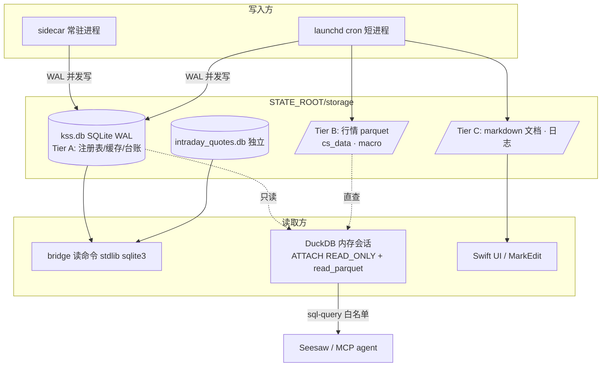
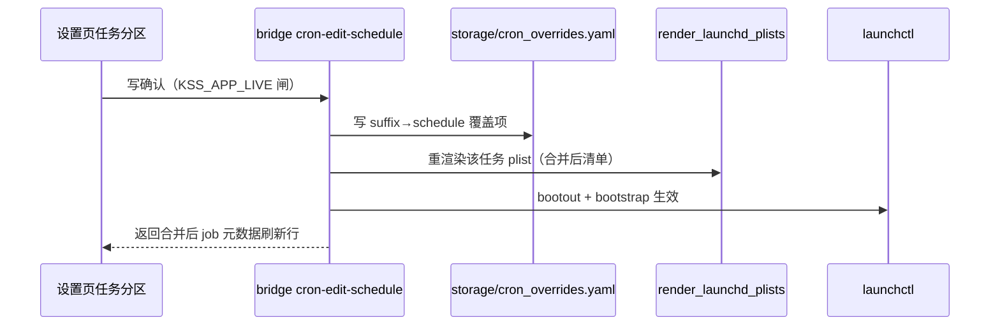

# Release Hardening & Unified Settings - Plan

## Goal Capsule

- **Objective:** 把 KSS Desktop 从"作者自用 2-3 台 Mac"加固到"可交付给作者亲自交付的少数人"的独立发布水准：统一设置模块（密钥/数据源/任务/日志）、应用启动自检、BYOK 开放到任意 OpenAI 兼容端点、结构化存储统一迁移到 SQLite（DuckDB 作 AI 分析查询层）、打包补公证，并以发布要求补齐产品/模块/功能/约束文档。
- **Product authority:** 本文档 Product Contract；发布边界沿用 [docs/plans/2026-06-21-005-feat-kssdeck-standalone-packaging-plan.md](2026-06-21-005-feat-kssdeck-standalone-packaging-plan.md) 的排除项（沙箱化/Windows/Linux/多用户仍在界外）。
- **Execution profile:** 三阶段推进（A 设置与自检 / B 发布加固 / C 存储统一），A/B/C 可并行开发，C 内部按 U13→U14→U15/U16→U17 依赖序走。「交付」定义收紧：A/B 单元合入 main 即在作者机器可用；对外交付 .app 给 A2 只发生在 U17 交付演练通过之后——一次性割接的前提（迁移期间用户数据只在作者机器）由此成为规则而非假设。
- **Stop conditions:** 任一单元的等价验证（尤其 U15 golden 对比）失败且无法在单元内修复时停下上报，不带病推进后续单元；Product Contract 级别的范围疑问停下确认，不自行扩大或收窄。
- **Open blockers:** 无。Apple 公证凭证已就绪（作者本地安全目录，不入库）。

---

## Product Contract

### Summary

为 KSS Desktop 做一轮发布级工程化加固：新增统一"设置"页整合密钥、数据源管理与连通性测试、定时任务管理、日志查看四个分区；应用启动时对运行时、依赖、凭证、sidecar 做一次自检并给出可操作指引；LLM 配置开放到任意 OpenAI 兼容端点；结构化数据统一迁移到 SQLite 库并为 Seesaw 增加只读分析 SQL 能力；构建流程补公证；架构入口移至侧边栏左下角与 GitHub 并排。

### Problem Frame

KSS Desktop 的打包体系（签名 .app + 首启 uv bootstrap）在 2026-06 已上线，但其目标从一开始就限定为"作者自己 2-3 台 Mac"。现在 GitHub 仓库已公开，作者要把应用交给身边少数朋友使用，原有的自用假设开始漏水：包未公证（首次打开触发 Gatekeeper 警告）、bootstrap 会把 dev 依赖组装进生产 venv、多个 cron 脚本硬编码作者机器的绝对路径并绕过 venv 直接调系统 Python、缺任何凭证时功能报错而非指引、DeepSeek base_url 写死无法换端点、日志只落文件且无轮转无应用内入口、依赖许可证清单只覆盖 3 项前端资产。

同时配置入口分散：凭据在工具栏弹窗、定时任务在任务页的一个区块、日志只能翻 Finder——没有一个"这个应用的运行状态和配置都在这里"的地方。存储层是 CSV/JSON/parquet/YAML 混合文件堆，交付给他人前若不统一，之后迁移成本随用户数据积累只会更高。

### Key Decisions

- **目标受众＝作者亲自交付的少数人。** 不做完全自助式分发：允许"拿到包后还能问作者"，因此不需要安装向导、自动更新、遥测；但不允许"必须由作者改代码/改配置文件才能跑起来"——一切用户侧配置必须走应用内 UI 完成。
- **设置模块走整合搬迁，不做并列汇总。** 新"设置"页成为唯一入口：工具栏"网络与凭据"弹窗与任务页的"定时任务"区块收敛进设置页，不保留重复 UI。
- **存储引擎＝SQLite 真相源 + DuckDB 查询层（AI-native 混合架构）。** SQLite（WAL 模式）作唯一可写系统库，sidecar 长驻进程与 cron 短进程并发写安全；DuckDB 作临时、每进程、内存态查询引擎，经官方 sqlite 扩展 `ATTACH` 系统库并直查 parquet，为 LLM agent 提供分析友好方言与零拷贝 pandas/Arrow 互操作。DuckDB 是**增量依赖**（查询层+迁移工具），不是数据落点——其多进程写（Quack 协议）2026 秋 v2.0 才成熟，当前唯一零基础设施的多进程安全落点是 SQLite。外部调研佐证见 Sources。
- **迁移范围＝结构化数据，三层分治。** Tier A（进 SQLite 统一库）：JSON/CSV/YAML 形态的注册表、衍生缓存、追加型台账；Tier B（保留 parquet，DuckDB 就地查询）：大宗 OHLCV/宏观行情数据；Tier C（保留文件）：markdown 复盘/报告文档（MarkEdit 外部打开依赖真实文件路径）、日志、既有分时隔离库 `intraday_quotes.db`（自带表契约与脱敏纪律，不并入）。
- **BYOK 开放到任意 OpenAI 兼容端点，不新增原生供应商适配。** 主/备供应商各自 base_url + key + model 三元组自由配置；Anthropic 等非 OpenAI 协议的原生 API 不在本轮。
- **排期编辑走 state-root overlay，不改签名 bundle 内的清单。** bundle 模式下 `kss/config/cron_jobs.yaml` 在签名 .app 内部不可写（写入即破坏签名），应用内排期编辑落 `storage/cron_overrides.yaml`，清单加载时合并。
- **补公证。** 消除交付对象首次打开的"无法验证"警告；notarytool 凭证已就绪。
- **全量审核的产出直接落为本文档的 requirements，不另出独立审计报告。**

### Requirements

**产品与文档**

- R1. 以发布要求补齐产品描述文档：产品定位、模块清单、功能边界、运行约束（macOS 版本、需要哪些凭证、各凭证解锁什么功能、uv 预装要求）、已知限制（含 sidecar 写命令面对同用户被注入 agent 的既知边界，沿用打包计划 KTD5 记录）。交付对象读完能自行判断"我需要配什么、能用到什么"。
- R2. 第三方依赖声明覆盖全部实际分发内容：现有 [THIRD_PARTY_NOTICES.md](../../THIRD_PARTY_NOTICES.md) 只列 3 项前端资产，需补齐 Python 依赖闭包（57 包 + 新增 duckdb）的许可证清单。

**应用启动自检**

- R3. 应用启动时自动执行一次自检，覆盖：Python 运行时（uv 可用、venv 完整）、关键依赖可导入、sidecar 健康、各凭证配置状态、数据目录可写。结果异常时以横幅呈现"缺什么、去哪修"的可操作指引，应用不崩溃、不静默失败。
- R4. 自检可从设置页手动重跑，结果与启动自检同一呈现。

**统一设置模块**

- R5. 新增独立"设置"工作区页面，含四个分区：密钥、数据源、任务、日志。
- R6. 密钥分区承接现有 Keychain 凭据表单能力（LLM/Tushare/Longbridge/Telegram、写操作开关），凭据仍只存 Keychain 不落明文。
- R7. 数据源分区逐源展示配置状态（已配/未配），并为每个数据源提供连通性测试按钮，测试给出明确的成功/失败与失败原因。LLM 端点算一个数据源，测试即验证 base_url + key + model 三元组可用。
- R8. 任务分区承接任务页现有定时任务面板全部能力（健康汇总、启停、重跑、批量重跑、补跑、同步），并新增排期编辑：修改任务的执行时间/周期后同步到 launchd 生效，无需改代码。
- R9. 日志分区提供应用内日志查看器：覆盖 sidecar 日志与各 cron 任务日志，支持滚动浏览与搜索/筛选；同时建立日志轮转/保留策略，文件不再无限增长。
- R10. 旧入口收敛：工具栏"网络与凭据"按钮与任务页"定时任务"区块移除，功能唯一入口为设置页；任务页保留手动任务运行台与任务记录。

**BYOK 与缺凭证降级**

- R11. LLM 配置开放为任意 OpenAI 兼容端点：主用与备用供应商的 base_url、key、model 均可配置，移除写死的 DeepSeek base_url。现有"DeepSeek 优先、OpenAI 兜底"的已有配置无损兼容。
- R12. 任何凭证缺失时，依赖它的功能优雅缺失：对应面板/入口显示"未配置 X，去设置里填"并可一键跳转设置页，其余功能不受影响；不以报错、空白或崩溃呈现。

**存储统一与智能分析**

- R13. 现有 `storage/` 数据资产先完成盘点（每类数据：谁写、谁读、什么格式、多大量级、归属 Tier A/B/C），盘点结论作为迁移范围的真相源。
- R14. Tier A 结构化数据统一迁移到单一 SQLite 库（含现有历史数据导入）；迁移后所有现有功能行为等价，Tier A 域不再产生新的散文件。Tier B 行情 parquet 与 Tier C 文档/日志/分时库按 Key Decisions 保留。
- R19. Seesaw 获得只读分析 SQL 工具：经 DuckDB 内存会话跨统一库与行情 parquet 做分析查询，只读、不需写确认，并保持 MCP 平价。

**打包与发布加固**

- R15. 签名构建流程补公证：notarytool 提交 + stapler 装订，交付对象首次打开不再出现"无法验证"警告。
- R16. 首启 bootstrap 不安装 dev 依赖组：生产 venv 只含运行所需依赖，不带 pytest 等开发依赖。
- R17. 消除随包脚本对作者机器的硬编码假设：全量清扫 `scripts/run_*.sh` 及仓库根 wrapper（不止 `run_cron_selfcheck.sh` / `run_formal_daily_picks.sh`，`run_data_catalog_daily.sh` 等同病），绝对路径与直接调用系统/dev Python 改为按脚本自身位置解析项目根、按运行时链解析 venv 解释器。清扫范围含 `scripts/render_launchd_plists.py`——其把 `HOME=/Users/zcdeng` 硬编码进每个渲染 plist 且 StandardOutPath 固定 project_root，排期编辑每次重渲染都会重新烙进。

**界面调整**

- R18. 架构入口从工具栏移到侧边栏底部，与 GitHub 链接图标并排，仅显示图标（悬停有说明）；工具栏相应移除该按钮。

### Actors

- A1. 作者/维护者：构建、公证、交付、答疑；唯一改代码的人。
- A2. 交付对象：作者亲自交付的朋友；拿到 .app 后自行完成凭证配置与日常使用，可向作者提问但不改代码、不碰配置文件。
- A3. Seesaw/MCP agent：应用内 AI 与外部 agent，经 sidecar 使用同一套凭证与数据；设置变更（如 LLM 端点）对其即时生效；新增只读分析 SQL 工具（R19）。

### Key Flows

- F1. 交付对象首启
  - **Trigger:** A2 在自己的 Mac 上首次打开作者交付的 .app。
  - **Steps:** 打开无 Gatekeeper 警告（已公证）→ 首启 bootstrap 拉起运行时 → 启动自检运行 → 横幅提示"未配置任何凭证，去设置"→ A2 进设置页填入自己的 LLM key（及可选的其他凭证）→ 逐源点测试确认连通 → 应用可用，未配凭证的功能按 R12 优雅缺失。
  - **Covers:** R3, R5, R6, R7, R12, R15
- F2. 自检发现环境问题
  - **Trigger:** 启动自检或手动重跑发现异常（如 venv 损坏、sidecar 无响应）。
  - **Steps:** 横幅陈述具体问题与修复指引（如"重新初始化运行时"按钮或指向设置页对应分区）→ 用户执行指引动作 → 重跑自检确认恢复。
  - **Covers:** R3, R4
- F3. 应用内调整定时任务
  - **Trigger:** 用户想改某个 cron 任务的执行时间。
  - **Steps:** 设置页任务分区选中任务 → 编辑排期 → 保存写入 state-root overlay → 重渲染 plist + 同步 launchd → 面板反映新排期与健康状态。
  - **Covers:** R8

### Acceptance Examples

- AE1. **Covers R12.** Given 只配置了 LLM key、未配 Tushare，When 打开依赖 Tushare 的看盘面板，Then 面板显示"未配置 Tushare token，去设置"并可跳转，应用其余部分正常。
- AE2. **Covers R11, R7.** Given base_url 指向某第三方 OpenAI 兼容端点并填入对应 key/model，When 在数据源分区点测试，Then 返回成功；随后 Seesaw 对话正常走该端点。
- AE3. **Covers R15.** Given 公证后的 .app 拷贝到一台从未打开过它的 Mac，When 双击打开，Then 不出现"无法验证开发者"警告。
- AE4. **Covers R8.** Given 某任务原定每日 17:00，When 在设置页把它改为 18:30 并保存，Then launchd 中该任务的排期变为 18:30 且下次按新时间执行。
- AE5. **Covers R9.** Given sidecar 日志中有一条错误，When 在设置页日志分区搜索关键词，Then 能定位到该条目，无需打开 Finder。
- AE6. **Covers R3.** Given venv 被删除或损坏，When 启动应用，Then 应用不崩溃，横幅提示运行时异常并给出修复入口。
- AE7. **Covers R14.** Given 存储迁移完成，When 运行日常复盘/回测/雷达等既有功能，Then 输出与迁移前等价，且 Tier A 域不再产生新的散文件。
- AE8. **Covers R16.** Given 一台干净机器完成首启 bootstrap，When 检查生产 venv，Then 其中不含 pytest 等 dev 组依赖。
- AE9. **Covers R19.** Given 统一库迁移完成且行情 parquet 在位，When 在 Seesaw 里问"近 20 日 688017 换手率均值与全池分位"，Then agent 经分析 SQL 工具一次查询给出真值数字（代码渲染，不经 LLM 复述）。

### Success Criteria

- 交付演练通过：在一台非开发 Mac 上，从拷贝 .app 到 Seesaw 可对话、看盘可用，全程零代码修改、零配置文件手工编辑、零终端操作（uv 预装除外，该要求写进 R1 文档）。
- 配置与运维的唯一入口是设置页：完成本轮后，用户可达的密钥/任务/日志操作没有第二个入口。

### Scope Boundaries

**Deferred for later**

- 自助式安装向导、自动更新、崩溃上报/遥测。
- Anthropic 等非 OpenAI 协议的原生 LLM 适配。
- sidecar 写命令面对同用户恶意/被注入 agent 的强认证（一次性 token 方案）——以文档形式在 R1 中明示该约束，不实现。
- 新增 cron 任务的应用内创建（manifest 仍是代码内真相源）——本轮只做既有任务的启停/排期编辑。
- DuckDB 作为存储引擎（多进程写依赖 2026 秋 v2.0 的 Quack 协议成熟）——本轮仅作查询层，届时再评估。
- 向量检索/嵌入库（sqlite-vec）——调研已确认可行路径，待有真实召回需求再立项。

**Outside this product's identity**

- App Sandbox 沙箱化、Windows/Linux、多用户/Server/SaaS 形态。

### Dependencies / Assumptions

- Apple 公证凭证（app-specific password）已就绪于作者本地安全目录，不入库、不写入任何文档。
- 目标交付机器为 macOS 14+，需可联网完成首启 bootstrap；uv 需预装（写进 R1 运行约束）。
- 新增 Python 依赖：`duckdb`（含官方 sqlite 扩展）。锁进 pyproject.toml 精确版本，遵循全量锁定纪律。
- 既有 4 个 pytest 失败为本轮之前的已接受基线（bridge orientation drift guard、cron manifest 20 jobs、longbridge coverage 2 项），验证时以"不新增失败"为准。

---

## Planning Contract

### Key Technical Decisions

- KTD1. **统一库落点与访问纪律。** 统一库为 `STATE_ROOT/storage/kss.db`，SQLite WAL 模式 + `busy_timeout`，所有写入方（sidecar、cron 进程）直接写；严格类型 schema（避免 DuckDB ATTACH 时列退化为 VARCHAR）。DuckDB 会话一律临时/内存态、`ATTACH ... (TYPE sqlite, READ_ONLY)`，每进程用完即弃，永不作为持久落点。`intraday_quotes.db` 保持独立（既有表契约 + 脱敏 allowlist，见 [scripts/build_data_catalog.py:47-60](../../scripts/build_data_catalog.py)）。
- KTD2. **排期 overlay 机制。** `kss/config/cron_manifest.py` 的 `load_manifest` 增加 overlay 合并：读 `STATE_ROOT/storage/cron_overrides.yaml`（仅允许覆盖 `schedule` 字段——启停维持既有 launchctl enable/disable 唯一路径，避免 enabled 双真相源；按 suffix 匹配，未知 suffix 拒绝，沿用 `CREDENTIAL_KEY_RE` 拒凭据纪律），合并后进既有校验。渲染器/同步器/bridge 元数据三条下游链路自动吃到合并结果。金标闸 overlay-aware：`assert_golden_equivalent` 的基线同样先过 overlay 合并，合法的应用内排期编辑天然不触闸；显式 `--acknowledge-schedule-change` 只保留给代码内清单的 schedule 变更。双根规则：bundle 模式下渲染 plist 输出目录与 bridge 的 `LAUNCHD_DIR` 白名单改指 `STATE_ROOT/deploy/launchd`（首次由 bundle 内模板 seed），`_cron_action`/`_cron_sync`/`cron-edit-schedule` 一律从该目录 bootstrap——bundle 内 `cron_jobs.yaml` 与 `deploy/launchd/` 均为只读种子，永不回写（写入即破坏公证签名）。
- KTD3. **设置页接入模式。** 新增 `WorkspaceSection.settings`，加入 `hidden` 数组（与 runbook/architecture 同模式，见 [Sources/KSSDesktop/Models/KSSModels.swift:1414-1417](../../Sources/KSSDesktop/Models/KSSModels.swift)），工具栏以齿轮图标进入（替换现"网络与凭据"钥匙按钮位）。`NetworkSettingsView` 的表单内容重组为设置页密钥分区，sheet 形态退役。
- KTD4. **自检命令形态。** 新增 bridge 只读命令 `self-check`：纯 stdlib、快速（目标 <2s），逐项返回 `{item, status(ok/warn/fail), detail, fix_hint, fix_action}`；Swift 启动时经 sidecar 调用（sidecar 不可达本身即是一项 fail 结果，由 Swift 侧兜底呈现）。横幅复用 `PythonEnvironmentBanner`/catch-up banner 的既有形态。失败分级：`fail`＝功能不可用（venv 损坏、目录不可写），`warn`＝功能受限（某凭证未配）。横幅策略：启动横幅仅在存在 `fail` 项时自动弹出（当前会话可关闭）；`warn` 级不弹启动横幅、仅在设置页自检入口可见——只配 LLM key 是 R12 认可的合法终态，不被常驻打扰。
- KTD5. **BYOK 键位设计。** Keychain 新增 `KSS_LLM_PRIMARY_BASE_URL/KEY/MODEL` 与 `KSS_LLM_FALLBACK_BASE_URL/KEY/MODEL` 六键；`kss/llm/openai_client.py` 的 `_resolve_credentials` 改为主/备三元组解析，移除硬编码 `_DEEPSEEK_BASE_URL`（[kss/llm/openai_client.py:21](../../kss/llm/openai_client.py)）。兼容映射：新键缺失时按旧键（DEEPSEEK_API_KEY→primary、OPENAI_*→fallback）落到新语义，旧配置零操作可用。运行期主→备切换为本轮新增行为（现状只有 key 在/不在的解析优先级，无失败切换）：`_resolve_credentials` 改为返回有序候选 [primary, fallback]，`LLMClient.complete` 对主路径 auth/连接类失败重试一次备路径；流式 `ChatClient`（Seesaw）仅在会话构造时选路，流中不切换。base_url 校验：保存与连通测试双卡点强制 https（仅 localhost/127.0.0.1 例外，容许本地推理端点），不合规拒绝保存并提示原因。
- KTD6. **连通性测试命令。** 新增 bridge 只读命令 `datasource-test <source>`（tushare/longbridge/telegram/llm）：各复用既有 client 的最小调用（tushare 轻量查询、longbridge 单标的 quote、telegram getMe、LLM 1-token completion），返回 `{ok, latency_ms, error, hint}`；LLM 源对主、备两套三元组分别测试（备已配置时），数据源分区双行呈现，避免备用端点到主路故障那一刻才发现失效。读命令、MCP 平价、不需写确认。
- KTD7. **公证流程。** `script/sign_and_build.sh` 启用被注释的公证段：凭证经 `xcrun notarytool store-credentials` 存 Keychain profile（一次性人工步骤，脚本只引用 profile 名，密码永不入脚本/仓库）；`ditto -c -k` 打 zip → `notarytool submit --wait` → `xcrun stapler staple` 到 .app（staple 落在 .app 上，zip 仅是提交容器）。硬化运行时与 entitlements 已在位（[script/sign_and_build.sh:149-151](../../script/sign_and_build.sh)），首启下载 venv 属进程外行为不影响公证。
- KTD8. **bootstrap 依赖收敛。** [Sources/KSSDesktop/Services/BridgeClient.swift:915](../../Sources/KSSDesktop/Services/BridgeClient.swift) 的 `uv sync --frozen` 追加 `--no-dev`；dev 组定义已在 [pyproject.toml:72-77](../../pyproject.toml)。
- KTD9. **wrapper 去硬编码模式。** 统一模板：`PROJECT_ROOT="$(cd "$(dirname "$0")/.." && pwd)"`；`KSS_STATE_ROOT` 尊重外部注入（launchd plist 已注入正确值），仅在环境未提供时回落 PROJECT_ROOT（`: "${KSS_STATE_ROOT:=$PROJECT_ROOT}"`，绝不无条件 `export` 覆盖）；Python 解释器解析链＝`$KSS_PYTHON` 显式指定 → state-root venv（`~/Library/Application Support/KSS/venv/bin/python3`）→ 项目 `.venv-desktop/bin/python` → fail-loud（绝不回退 `/usr/bin/python3`）。日志与一切可写路径从 `KSS_STATE_ROOT` 派生，不从 PROJECT_ROOT（bundle 模式 PROJECT_ROOT 指向签名 .app 内部，不可写）。cron 凭证解析：wrapper 统一 source 共享 helper，经 `security find-generic-password -s com.zcdeng.KSSDesktop.credentials -a <KEY> -w` 读 Keychain（dev 模式回落 .env grep），首次 Keychain 授权（Always Allow）写入 R1 交付文档并列自检项——交付机器上没有 .env 可 grep，Keychain 是 cron 短进程唯一凭证源。
- KTD10. **日志读取与轮转。** 新增 bridge 只读命令 `log-list`（枚举 sidecar + cron 日志与大小）与 `log-tail <name> [lines] [grep]`（尾部读取+过滤，路径白名单锁定 `storage/logs/` 内）；轮转在写入方实施——sidecar 日志由 Swift 侧 `sidecarLogHandle` 打开前检查（>10MB 时轮转保留 3 代），cron 日志由日终 cron 任务统一轮转（>5MB 或 >14 天）。
- KTD11. **Seesaw 分析 SQL 工具护栏。** 新增 bridge 只读命令 `sql-query <sql>`：DuckDB 内存会话，`ATTACH kss.db READ_ONLY` + 注册行情 parquet 视图；语句白名单（仅 SELECT/SUMMARIZE/DESCRIBE/WITH 开头，拒绝 ATTACH/COPY/INSTALL/LOAD/PRAGMA/SET/RESET），行数上限截断，超时熔断。引擎级围栏（必须有——关键词黑名单挡不住 `read_text`/`read_csv`/`glob` 等合法 SELECT 内的文件表函数，被注入 agent 可借此读任意本地文件外泄）：会话工厂在 ATTACH 与视图注册完成后 `SET allowed_directories` 收敛到 `STATE_ROOT/storage` 数据根，随后 `SET lock_configuration=true` 禁止改回；`enable_external_access`/`allowed_directories` 的组合语义在 U16 锁定 duckdb 版本时核对，在保住 parquet 懒读的前提下取最紧配置。数字真值走代码渲染附加，不经 LLM 复述（沿用既有 payload 纪律）。

### High-Level Technical Design

存储三层分治与读写拓扑（Phase C 终态）：

排期编辑数据流（F3）：

### Assumptions

- 迁移期间用户数据只在作者机器上——由 Goal Capsule 的交付门规则保证（对外交付晚于 U17 演练通过），U15 的切换不需要在线双写过渡，一次性割接 + golden 对比即可。
- DuckDB 精确版本在 U16 实施时锁定（选当时最新稳定版）。`INSTALL sqlite` 是在线下载、没有离线形态：构建/打包期按锁定版本预下载对应 `.duckdb_extension` 随包 vendor（bootstrap 时落到 state root），`duck.py` 设 `extension_directory` 指向它，首启不连 DuckDB 扩展仓库；扩展可加载性列入自检 Phase C 追加项。

### Product Contract preservation

changed: R14/AE7（"不再产生散文件"按确认的三层分治收窄为 Tier A 域）；新增 R19/AE9（Seesaw 分析 SQL 工具，AI-native 引擎决策的产品面收益，经用户确认的调研方向导出）；R17 从两处点名扩为全量清扫（研究发现同病 wrapper 不止两处）。其余 R/A/F/AE 原文保留。

---

## Implementation Units

| U-ID | 单元 | 关键文件 | 依赖 |
|---|---|---|---|
| U1 | 设置页骨架 + 密钥分区迁移 | KSSModels.swift, ContentView.swift, SettingsView.swift(新) | — |
| U2 | 架构入口移侧边栏底部 | SidebarView.swift, ContentView.swift | — |
| U3 | BYOK 端点泛化 | kss/llm/openai_client.py, KeychainStore.swift | — |
| U4 | 数据源连通性测试 | kss_app_bridge.py, kss_mcp.py, SettingsView.swift | U1, U3 |
| U5 | 任务分区迁移 | SettingsView.swift, RunbookView.swift | U1 |
| U6 | 排期编辑（overlay 链路） | cron_manifest.py, kss_app_bridge.py, SettingsView.swift | U5 |
| U7 | 日志分区 + 轮转 | kss_app_bridge.py, BridgeClient.swift, SettingsView.swift | U1 |
| U8 | 启动自检 | kss_app_bridge.py, KSSStore.swift, ContentView.swift | U1 |
| U9 | 缺凭证优雅降级 | KSSStore.swift, 各面板 View | U8 |
| U10 | 公证接入 | script/sign_and_build.sh | — |
| U11 | bootstrap --no-dev + wrapper 清扫 | BridgeClient.swift, scripts/run_*.sh | — |
| U12 | 发布文档 + 依赖声明 | README.md, docs/, THIRD_PARTY_NOTICES.md | U1, U3, U8, U10, U11 |
| U13 | 存储盘点 | docs/（盘点产物）, storage/data_catalog.json | — |
| U14 | 统一库 schema + 迁移导入 | kss/storage/db.py(新), scripts/migrate_storage.py(新) | U13 |
| U15 | 写入方割接 + 等价验证 | kss/ 各域模块 | U14 |
| U16 | DuckDB 查询层 + Seesaw SQL 工具 | kss_app_bridge.py, kss_chat_loop.py, kss_mcp.py, pyproject.toml | U14 |
| U17 | catalog 反射扩展 + 交付演练 | build_data_catalog.py, docs/ | U15, U16 及全部 A/B 单元 |

### Phase A — 统一设置与自检

### U1. 设置页骨架 + 密钥分区迁移

- **Goal:** 新"设置"页上线，密钥管理成为其第一个分区，旧"网络与凭据"入口退役。
- **Requirements:** R5, R6, R10（凭据入口部分）
- **Dependencies:** —
- **Files:** `Sources/KSSDesktop/Models/KSSModels.swift`（WorkspaceSection 增 `settings` case + hidden）、`Sources/KSSDesktop/Views/ContentView.swift`（detail 路由 + 工具栏齿轮替换钥匙按钮、移除 `showNetworkSettings` sheet）、`Sources/KSSDesktop/Views/SettingsView.swift`（新建：分区容器 + 密钥分区）、`Sources/KSSDesktop/Views/NetworkSettingsView.swift`（表单逻辑迁入后删除）、`Tests/KSSDesktopTests/`（对应测试）
- **Approach:** 按 KTD3。页面骨架为四分区纵向布局（M3 封顶居中，同 RunbookView 版式）；密钥分区原样承接 NetworkSettingsView 的 KeychainStore 读写与"保存后重启 sidecar"语义。数据源/任务/日志三分区先以占位卡片出现（"由 U4/U5/U7 填充"），保证本单元独立可交付。
- **Patterns to follow:** WorkspaceSection hidden 模式（KSSModels.swift:1414-1417）；页面版式（RunbookView.swift:30-82）。
- **Test scenarios:** ① 选中 settings 页渲染四分区骨架；② 密钥保存后 Keychain 值更新且触发 sidecar 重启（现有 NetworkSettings 行为等价）；③ 工具栏无钥匙按钮、齿轮按钮导航到设置页；④ WorkspaceSection.ordered 不把 settings 排进侧边栏。
- **Verification:** swift build + swift test 过；手动打开设置页四分区可见，改一个 key 保存生效。

### U2. 架构入口移侧边栏底部

- **Goal:** 架构图标与 GitHub 链接并排在侧边栏页脚，工具栏移除该按钮。
- **Requirements:** R18
- **Dependencies:** —
- **Files:** `Sources/KSSDesktop/Views/SidebarView.swift`（SidebarFooter 增架构按钮）、`Sources/KSSDesktop/Views/ContentView.swift`（工具栏删架构按钮）
- **Approach:** SidebarFooter（SidebarView.swift:341-389）从单链接改为横排两图标：架构（`circle.hexagongrid`，点击 `selection = .architecture`）+ GitHub（现有 Link）；折叠态纵排或仅留悬停提示，展开态两图标并排左对齐。仅图标 + `.help()` 悬停说明。
- **Patterns to follow:** SidebarFooter 现有 hover 胶囊与折叠态处理。
- **Test scenarios:** ① 页脚两图标可点，架构图标切到架构页；② 折叠态两图标仍可达；③ 工具栏不再有架构按钮。
- **Verification:** swift test 过；两主题模式（经典/xcom）下目视页脚不破版。

### U3. BYOK 端点泛化

- **Goal:** 主/备 LLM 供应商各自 base_url/key/model 可配，硬编码 DeepSeek base 移除，旧配置零操作兼容。
- **Requirements:** R11
- **Dependencies:** —
- **Files:** `kss/llm/openai_client.py`、`Sources/KSSDesktop/Services/KeychainStore.swift`（managedKeys 增六键）、`kss/tests/test_llm_openai_client.py`
- **Approach:** 按 KTD5。`_resolve_credentials` 改为返回有序候选 [primary, fallback]（新六键优先；新键全缺时执行兼容映射：DEEPSEEK_API_KEY→primary@`https://api.deepseek.com/v1`、OPENAI_API_KEY/OPENAI_BASE_URL→fallback）；运行期主→备失败切换为本轮新增行为，落在 `LLMClient.complete` 层，`ChatClient` 仅构造时选路；base_url 保存/使用前强制 https（localhost 例外）。日志只打 model/base_url，永不打 key。
- **Execution note:** 域行为变更，测试先行——先写兼容映射与新键优先级的失败用例再改解析。
- **Patterns to follow:** 现有 `_resolve_credentials`（openai_client.py:135-165）。
- **Test scenarios:** ① 仅旧键→行为与现状逐字段一致；② 新键在场→优先新键；③ 主备均配、主 401→降级备；④ 全缺→明确 no_credentials 错误；⑤ 自定义 base_url 指向 mock server 走通 completion；⑥ http 非 localhost 的 base_url 被拒并给出原因。
- **Verification:** `uv run pytest kss/tests/test_llm_openai_client.py` 全绿，全量 pytest 不新增失败。

### U4. 数据源连通性测试

- **Goal:** 设置页数据源分区上线：逐源状态 + 测试按钮，`datasource-test` 命令三端可用。
- **Requirements:** R7
- **Dependencies:** U1, U3
- **Files:** `scripts/kss_app_bridge.py`（COMMANDS 注册 `datasource-test`）、`scripts/kss_mcp.py`（平价工具）、`Sources/KSSDesktop/Views/SettingsView.swift`（数据源分区）、`Sources/KSSDesktop/Services/BridgeClient.swift`（调用封装）、`kss/tests/test_bridge_datasource_test.py`（新）
- **Approach:** 按 KTD6。配置状态判定读 env 注入结果（已配/未配），测试按钮逐源发命令并渲染 `{ok, latency_ms, error, hint}`；LLM 源对主、备两套三元组分别测试（备已配置时），结果双行呈现。命令为只读，不进 WRITE_COMMANDS。
- **Patterns to follow:** 近期读命令注册例（indicator-* 系列）；MCP 平价惯例。
- **Test scenarios:** ① 各源未配 token 时返回明确 not_configured 而非异常；② mock 成功/超时/401 三态的 error/hint 文案；③ 命令注册进 COMMANDS 且不在 WRITE_COMMANDS；④ MCP 工具与 bridge 输出一致。
- **Verification:** pytest 新文件全绿；真机四源各点一次测试，结果与实际配置相符。

### U5. 任务分区迁移

- **Goal:** 定时任务面板整体搬入设置页，任务页收敛为手动运行台。
- **Requirements:** R8（承接部分）, R10
- **Dependencies:** U1
- **Files:** `Sources/KSSDesktop/Views/SettingsView.swift`、`Sources/KSSDesktop/Views/RunbookView.swift`
- **Approach:** `ScheduledTasksSection`（RunbookView.swift:86-264）组件原样移入设置页任务分区，KSSStore 方法（loadScheduledJobs/rerun/toggle/sync/catchUp/rerunMany，KSSStore.swift:1088-1150）不动；RunbookView 删该区块及对应参数，保留轻量/正式任务 + 任务记录。设置页 `.task` 触发 loadScheduledJobs。
- **Patterns to follow:** 组件即现成，纯搬迁。
- **Test scenarios:** ① 设置页任务分区渲染健康汇总/分组/行操作；② 任务页不再出现定时任务区块；③ 启停/重跑/补跑行为与迁移前一致（store 方法未变，UI 冒烟即可）。
- **Verification:** swift test 过；真机设置页启停一个任务往返生效。

### U6. 排期编辑（overlay 链路）

- **Goal:** 应用内改任务执行时间/周期，写 overlay → 重渲染 → launchd 生效。
- **Requirements:** R8（排期编辑）
- **Dependencies:** U5
- **Files:** `kss/config/cron_manifest.py`（overlay 合并）、`scripts/kss_app_bridge.py`（`cron-edit-schedule` 写命令 + WRITE_COMMANDS）、`scripts/kss_mcp.py`（平价）、`scripts/sync_launchd.py`（金标闸对 overlay 的放行语义）、`Sources/KSSDesktop/Views/SettingsView.swift`（行内排期编辑器）、`kss/tests/test_cron_manifest.py`、`kss/tests/test_sync_launchd.py`
- **Approach:** 按 KTD2。overlay 仅允许 `schedule`，suffix 不在清单内即拒；`cron-edit-schedule <suffix> <schedule-json>` 校验（复用 `_parse_schedule` 规则）→ 写 overlay → 对该 label 渲染到 `STATE_ROOT/deploy/launchd` + bootout/bootstrap（复用 `_cron_action` 习语）→ 返回合并后 job；渲染或 launchctl 任一步失败即回滚 overlay 条目并返回 `{ok:false, error, hint}`，UI 保持原排期并给重试。UI 用 hour/minute/weekdays 选择器，weekly 任务显示单 weekday。
- **Execution note:** 先加 overlay 合并的清单层测试（含拒绝越权字段/未知 suffix），再接 bridge 与 UI。
- **Patterns to follow:** `_cron_action` launchctl 习语（kss_app_bridge.py:3497-3531）；清单校验纪律（cron_manifest.py 模块头）。
- **Test scenarios:** ① overlay 改 hour 后 load_manifest 返回合并 schedule；② overlay 带非法字段/未知 suffix/凭据键被拒；③ 写命令在 WRITE_COMMANDS、经确认闸；④ Covers AE4：编辑后渲染 plist 的 StartCalendarInterval 反映新时间；⑤ sync 金标闸对 overlay 变更不误拦（基线过 overlay 合并）；⑥ launchctl 失败→overlay 回滚、面板保持原排期、后续应用内 sync 无需终端即可恢复。
- **Verification:** pytest cron 相关全绿；真机改一个任务时间，`launchctl print` 验证新排期。

### U7. 日志分区 + 轮转

- **Goal:** 应用内可浏览/搜索 sidecar 与 cron 日志；日志文件有界增长。
- **Requirements:** R9
- **Dependencies:** U1
- **Files:** `scripts/kss_app_bridge.py`（`log-list`/`log-tail` 读命令）、`Sources/KSSDesktop/Services/BridgeClient.swift`（sidecar 日志轮转）、`kss/config/cron_jobs.yaml`（日志轮转日终任务，或并入既有系统类任务）、`scripts/`（轮转脚本）、`Sources/KSSDesktop/Views/SettingsView.swift`（查看器 UI）、`kss/tests/test_bridge_logs.py`（新）
- **Approach:** 按 KTD10。查看器：左列日志文件清单（名称+大小+mtime），右侧尾部 500 行视图 + 关键词过滤（过滤在 bridge 侧做，避免大文件全量过桥）；自动跟尾不做（刷新按钮即可）。轮转：Swift 侧打开 sidecar.log 前检查大小；cron 侧新增/挂靠日终任务按 KTD10 阈值轮转 `storage/logs/cron/*.log`。
- **Patterns to follow:** 路径白名单纪律（report 路径护栏 `_resolve_markdown_path` 同思路）；trends 命令的正则白名单防穿越（kss_app_bridge.py:3597 注释）。
- **Test scenarios:** ① log-tail 对白名单外路径拒绝；② grep 过滤返回匹配行；③ Covers AE5：写入一条错误后经 log-tail 检索命中；④ 轮转：>阈值文件被轮转且保留代数正确；⑤ log-list 枚举含大小。
- **Verification:** pytest 新文件全绿；真机日志分区搜到 sidecar 真实日志行。

### U8. 启动自检

- **Goal:** 启动横幅呈现环境体检结果，设置页可手动重跑。
- **Requirements:** R3, R4
- **Dependencies:** U1
- **Files:** `scripts/kss_app_bridge.py`（`self-check` 读命令）、`Sources/KSSDesktop/Services/KSSStore.swift`（启动调用 + 状态）、`Sources/KSSDesktop/Views/ContentView.swift`（横幅 overlay）、`Sources/KSSDesktop/Views/SettingsView.swift`（手动重跑入口）、`kss/tests/test_bridge_selfcheck.py`（新）
- **Approach:** 按 KTD4。检查项：venv 解释器在位且可 `import pandas` 探针（子进程超时保护）、sidecar socket 应答、各凭据 env 在/不在、`storage/` 可写、（C 阶段后追加 kss.db 可开）。Swift 启动序：bootstrap 完成后发 self-check；sidecar 起不来时 Swift 直接合成 fail 项。横幅按最高严重度着色，点击展开逐项 + fix_hint，`fix_action` 支持"去设置页"跳转与"重新初始化运行时"；弹出策略按 KTD4——仅 fail 自动弹、当前会话可关，warn 只在设置页可见。
- **Test scenarios:** ① 全绿环境返回全 ok；② 移走某凭据→该项 warn 且 fix_hint 指向设置页；③ Covers AE6：venv 缺失场景 Swift 侧呈现 fail 横幅不崩溃（Swift 单测 mock bridge 错误路径）；④ 手动重跑更新结果。
- **Verification:** pytest + swift test 过；真机删 venv 演练 AE6 后经指引恢复。

### U9. 缺凭证优雅降级

- **Goal:** 依赖缺失凭证的面板显示定向指引而非报错/空白。
- **Requirements:** R12
- **Dependencies:** U8
- **Files:** `Sources/KSSDesktop/Services/KSSStore.swift`（凭证状态集中暴露）、`Sources/KSSDesktop/Views/` 中依赖凭证的面板（看盘/推荐/自选实时区、Seesaw、资讯雷达 LLM 功能、Telegram 相关设置项说明）
- **Approach:** 以 self-check 的凭证状态为单一真源（沿用 `hasLLMCredentials` 先例扩展为按源字典）；各面板在数据为空且对应凭证未配时渲染统一的 `MissingCredentialCard(source:)`（文案"未配置 X，去设置里填"+ 跳转按钮），凭证已配但请求失败仍走现有错误路径（不混淆两种情况）。
- **Patterns to follow:** `hasLLMCredentials`（KSSStore.swift:58）；realtimeAuthFailed 的 UI 降级处理。
- **Test scenarios:** ① Covers AE1：无 Tushare 时看盘面板出卡片并可跳转；② LLM 未配时 Seesaw 输入区出指引；③ 凭证在但网络错→仍显示原错误而非"未配置"；④ 配置补齐后卡片消失。
- **Verification:** swift test 过；真机清空 Tushare token 演练 AE1。

### Phase B — 发布加固

### U10. 公证接入

- **Goal:** 签名构建产物过公证并装订，陌生机器首开无警告。
- **Requirements:** R15
- **Dependencies:** —（与 Phase A 并行无碍）
- **Files:** `script/sign_and_build.sh`
- **Approach:** 按 KTD7。脚本增 `--notarize` 默认开启（`--skip-notarize` 逃生舱）；凭证 profile 名约定 `kss-notary`，脚本检测 profile 缺失时打印一次性 `store-credentials` 指引后 fail-loud。提交失败时拉取 `notarytool log` 摘要进构建输出。
- **Execution note:** 打包/配置类单元，冒烟验证为主——公证一次真实提交 + `spctl -a -vv` 断言，不写单测。
- **Test scenarios:** Test expectation: none — 构建脚本变更，验证走真实构建链（下 Verification）。
- **Verification:** 完整跑 `./script/sign_and_build.sh`，`xcrun stapler validate` 与 `spctl -a -vv -t exec` 通过；Covers AE3：另一台未打开过的 Mac（或删除 quarantine 记录模拟）双击无警告。

### U11. bootstrap --no-dev + wrapper 清扫

- **Goal:** 生产 venv 无 dev 依赖；所有随包 shell wrapper 在任意安装位置可跑。
- **Requirements:** R16, R17
- **Dependencies:** —
- **Files:** `Sources/KSSDesktop/Services/BridgeClient.swift:915`、`scripts/run_*.sh` 全量 + 仓库根 `run_scanner.sh`、`scripts/render_launchd_plists.py`（HOME/输出路径去硬编码）、`kss/tests/test_wrapper_portability.py`（新，静态断言）
- **Approach:** 按 KTD8/KTD9。逐个 wrapper 套统一模板（含 Keychain 凭证 helper 的 source）；`render_launchd_plists.py` 的 `HOME` 改取 `Path.home()`，StandardOutPath 在 bundle 模式从 state_root 派生。新增静态测试扫描所有 `*.sh` wrapper 与渲染器输出，断言不含 `/Users/` 字面量、`/usr/bin/python3` 直调、无条件 `export KSS_STATE_ROOT=` 覆盖（防回归，同 drift-guard 思路）。`run_cron_selfcheck.sh` 的 bridge 调用改经解释器解析链。
- **Test scenarios:** ① 静态扫描断言全部 wrapper 无硬编码；② 解释器解析链单测（env 显式 > state-root venv > .venv-desktop > fail）；③ Covers AE8：干净 venv bootstrap 后 `pip list` 无 pytest（以 uv 干跑或 CI 上等价断言）。
- **Verification:** pytest 全绿；删 state-root venv 重启 app 触发 bootstrap，验证 venv 无 dev 包且 app 功能正常。

### U12. 发布文档 + 依赖声明

- **Goal:** 交付对象可自读的产品/约束文档 + 全量第三方声明。
- **Requirements:** R1, R2
- **Dependencies:** U1, U3, U8, U10, U11（文档描述最终行为——凭证解锁矩阵、设置页配置路径、自检指引均由 Phase A 单元交付）
- **Files:** `README.md`（发布向重组或链接）、`docs/RELEASE_GUIDE.md`（新：安装/凭证/功能解锁矩阵/已知限制含打包计划 KTD5 边界即 sidecar 写命令面）、`THIRD_PARTY_NOTICES.md`（Python 依赖闭包许可证清单，含 duckdb）
- **Approach:** 功能-凭证解锁矩阵为文档核心（每数据源：解锁什么面板/任务、去哪申请）；许可证清单从 uv.lock 派生（License 字段逐包核对，copyleft 项单独标注）。行文遵循全局文档规范。
- **Test scenarios:** Test expectation: none — 纯文档单元。
- **Verification:** 按 Success Criteria 让一位"陌生读者视角"通读演练（作者自查即可）：仅凭文档能完成凭证申请与配置路径判断。

### Phase C — 存储统一与智能分析

### U13. 存储盘点

- **Goal:** 产出 storage/ 全量资产清单与 Tier A/B/C 归属及目标 schema 映射，作为割接真相源。
- **Requirements:** R13
- **Dependencies:** —（可与 A/B 并行启动）
- **Files:** `docs/plans/2026-07-12-005-appendix-storage-inventory.md`（新，盘点产物）；输入含 `storage/data_catalog.json`（23 数据集已反射）与全目录扫描
- **Approach:** 逐目录记录：路径、格式、文件数/量级、写入方模块、读取方（bridge 命令/MCP 工具/Swift 直读）、更新节奏、Tier 归属、目标表名与主键。已知域先行填充：paper_trade（JSON 日志→追加台账表）、sector_rotation、mi_signals、intel radar/rewrites、perilla_cache、indicator_registry.yaml、prediction ledger、factor health、daily_review 索引（正文 md 留 Tier C）、reports 索引、watchlist。data_catalog 覆盖的 parquet 数据集默认 Tier B。
- **Test scenarios:** Test expectation: none — 调研产物单元；完整性由 U15 割接清单逐项对账兜底。
- **Verification:** 盘点表逐行有写入方与读取方 file 引用；与 `storage/` 实际目录 diff 无遗漏顶层项。

### U14. 统一库 schema + 迁移导入

- **Goal:** `kss.db` 建库 + 数据访问层 + 历史数据一次性导入脚本。
- **Requirements:** R14（库与导入部分）
- **Dependencies:** U13
- **Files:** `kss/storage/db.py`（新：连接工厂 WAL/busy_timeout/严格类型、schema 版本表、迁移器）、`scripts/migrate_storage.py`（新：按盘点表逐域导入 + 幂等可重跑）、`kss/tests/test_storage_db.py`（新）
- **Approach:** 按 KTD1。schema 每域一节、显式 STRICT 表（避免 ATTACH 类型退化）；导入脚本逐域"读旧文件→写表→行数/关键字段校验和记录"，产出导入报告；不删旧文件（U15 割接完成后另行归档）。多进程写安全经 busy_timeout + 短事务纪律封装在 db.py。
- **Execution note:** 域行为核心，测试先行：连接纪律（并发写探针）与逐域导入校验和先写用例。
- **Test scenarios:** ① 两进程并发写不 lock 死（WAL 探针）；② 每域导入后行数=源文件记录数、抽样字段逐值相等；③ 重跑导入幂等；④ schema 版本表升级路径；⑤ STRICT 表拒绝类型漂移写入。
- **Verification:** pytest 新文件全绿；对真实 storage/ 跑导入，导入报告零差异。

### U15. 写入方割接 + 等价验证

- **Goal:** Tier A 各域读写方切到 kss.db，功能输出与迁移前等价。
- **Requirements:** R14（割接部分）
- **Dependencies:** U14
- **Files:** 按 U13 盘点表列出的各域模块（kss/ 与 scripts/ 内写入/读取方）、对应 bridge 读命令、`kss/tests/` 各域测试
- **Approach:** 逐域割接（每域一个原子提交：写方+读方+测试同步切），顺序从低风险注册表域（watchlist、indicator_registry）到高频台账域（paper_trade、sector_rotation、radar）。等价验证的输入必须稳定：每域割接窗口内停用该域 launchd 任务（或严格避开其调度窗口），golden 录制与回放针对割接起点的 storage/ 冻结快照副本执行，比对通过后再恢复任务——否则 cron 在录制与比对之间的写入会污染零 diff 判定。割接前录制 golden（关键 bridge 命令输出 + 关键页面数据 JSON），割接后同输入比对；bridge 读路径保持 stdlib sqlite3（不引 pandas）。全部域完成后旧文件移入 `storage/_migrated_archive/`（保留一个版本周期）。逐域写入 `storage/migration_ledger.json` 割接台账（域名/完成时间/golden 结果），供 U16 门控表暴露。
- **Execution note:** 特征化先行——每域割接前先为现行文件行为补录 golden 快照测试，再动写入方。
- **Test scenarios:** ① Covers AE7：逐域 golden 前后一致；② 割接后新写入落库且旧路径无新文件产生（目录监视断言）；③ cron 短进程与 sidecar 并发写同域不冲突；④ 回读路径（bridge 命令）输出 schema 与割接前逐字段一致。
- **Verification:** 全量 pytest 不新增失败；真机跑一轮日常链路（日更→复盘→雷达→纸交易记账）目视等价。

### U16. DuckDB 查询层 + Seesaw SQL 工具

- **Goal:** Seesaw/MCP 获得只读分析 SQL 能力，跨 kss.db 与行情 parquet。
- **Requirements:** R19
- **Dependencies:** U14（库在即可，不必等 U15 全割接）
- **Files:** `pyproject.toml`（增 duckdb 锁定版）、`kss/storage/duck.py`（新：会话工厂 ATTACH READ_ONLY + parquet 视图注册 + 白名单校验）、`scripts/kss_app_bridge.py`（`sql-query` 读命令）、`scripts/kss_chat_loop.py`（Seesaw 工具注册 + 数字真值代码渲染）、`scripts/kss_mcp.py`（平价）、`kss/tests/test_duck_query.py`（新）
- **Approach:** 按 KTD11。视图注册来自 data_catalog（数据集名→parquet 路径），LLM 拿到的工具描述含可用表/视图清单与列含义（catalog meanings 直供）；表暴露按 U15 割接台账门控——未割接域的表不进 LLM 可见目录且查询被拒，避免 kss.db 冻结快照在割接完成前返回自信的陈旧数字。白名单为语句首 token 校验 + 禁用关键词扫描 + KTD11 引擎级围栏，行上限 200 截断带提示，5s 超时。sqlite 扩展按 Assumptions 的 vendor 方案随包预置（构建期按锁定版本下载、`extension_directory` 指向，首启不联网）。
- **Execution note:** 护栏测试先行（注入类语句全拒），再接工具面。
- **Test scenarios:** ① SELECT/SUMMARIZE 放行，ATTACH/COPY/PRAGMA/INSTALL/SET/多语句拒绝；② 跨库 join（kss.db 表 × parquet 视图）结果正确；③ 行上限截断与超时熔断；④ Covers AE9：换手率均值+分位查询端到端返回真值且走代码渲染（在其查询域割接完成后验证）；⑤ READ_ONLY 下写语句报错而非生效；⑥ `read_text('/etc/passwd')`/`glob`/`read_csv` 指向白名单目录外路径被拒；⑦ 未割接域的表不可见且查询被拒。
- **Verification:** pytest 新文件全绿；真机 Seesaw 问 AE9 问题得到正确数字。

### U17. catalog 反射扩展 + 交付演练

- **Goal:** 数据目录反射统一库表；全链路交付演练收尾。
- **Requirements:** R14（自描述收尾）, Success Criteria
- **Dependencies:** U15, U16 及 Phase A/B 全部单元（交付演练逐条核 AE1-AE9，覆盖 U1-U11 交付物）
- **Files:** `scripts/build_data_catalog.py`（kss.db 表反射，沿用 intraday allowlist 模式）、`kss/config/data_catalog_meta.yaml`（新表含义 overlay）、`scripts/kss_app_bridge.py`（自检追加 kss.db 可开与 duckdb 扩展可加载两项）、演练记录归档 `docs/`
- **Approach:** kss.db 反射按表 allowlist（排除任何自由文本敏感列，沿用 S5 纪律）；交付演练按 Success Criteria 在非开发 Mac（或干净用户账户）全流程走 F1，逐条核 AE1-AE9，结果记录归档。
- **Test scenarios:** ① catalog 生成含 kss.db 表且列含义合并；② 反射排除项不出现；③ 自检含 kss.db 可开与扩展可加载两项且迁移后为 ok。
- **Verification:** 演练记录九条 AE 全过；`storage/data_catalog.json` 反射数=预期。

---

## Verification Contract

| 门禁 | 命令/动作 | 适用 | 通过标准 |
|---|---|---|---|
| Python 测试 | `uv run pytest` | 全部 Python 单元 | 不新增失败（既有 4 项基线见 Assumptions）；跑完 `git checkout -- uv.lock` 防漂移 |
| Swift 构建+测试 | `swift build` / `swift test`（需完整 Xcode，CLT 无 XCTest） | U1/U2/U4-U9/U11（所有触及 Swift 文件的单元） | 全绿 |
| 开发冒烟 | `./script/build_and_run.sh run` | UI 单元交付后 | 页面/流程手动核对 |
| 签名+公证链 | `./script/sign_and_build.sh` + `stapler validate` + `spctl -a -vv` | U10 及最终交付 | 公证 Accepted、staple 校验过 |
| golden 等价 | 割接前后 bridge 命令输出比对（U15 内建） | U15 逐域 | 零 diff |
| 交付演练 | 非开发环境走 F1 + AE1-AE9 | U17 | 九条全过，全程零代码/配置文件手工操作 |

## Definition of Done

- R1-R19 全部落地，AE1-AE9 在交付演练中逐条验证通过并留档。
- 全量 pytest 与 swift test 不新增失败；wrapper 硬编码静态扫描长期在测试集内防回归。
- 设置页为密钥/任务/日志唯一入口（旧入口代码删除，非注释隐藏）。
- Tier A 旧散文件已归档、无新增；`storage/data_catalog.json` 反射统一库。
- 实验性/弃用路径代码（NetworkSettingsView sheet、RunbookView 定时任务区块、迁移前双读兼容垫层）全部移除，不留死代码。
- 公证后的 .app 在至少一台非构建机完成 AE3 验证。

---

## Sources / Research

调研已核实的现状事实与外部证据，实施时直接取用：

**仓库内（file:line 均已核实）**

- 公证缺口：`script/sign_and_build.sh:157-162` 公证段被注释；硬化运行时/entitlements 已在 `:149-151`。
- bootstrap dev 泄漏：`Sources/KSSDesktop/Services/BridgeClient.swift:915` `uv sync --frozen` 未带 `--no-dev`；dev 组在 `pyproject.toml:72-77`。
- 硬编码 wrapper：`scripts/run_cron_selfcheck.sh:12,22`（REPO + /usr/bin/python3）、`scripts/run_formal_daily_picks.sh:17`、`scripts/run_data_catalog_daily.sh:12-14`（PROJECT_ROOT + .venv-desktop）——全量清扫依据。
- BYOK 现状：`kss/llm/openai_client.py:21`（DeepSeek base 写死）、`:135-165`（`_resolve_credentials` 主备解析）；UI 字段 `Sources/KSSDesktop/Views/NetworkSettingsView.swift:44-47`；Keychain 受管键 `Sources/KSSDesktop/Services/KeychainStore.swift:12-26`。
- 页面接入模式：`WorkspaceSection` 枚举与 `hidden` 机制 `Sources/KSSDesktop/Models/KSSModels.swift:1359-1457`；工具栏入口 `Sources/KSSDesktop/Views/ContentView.swift:109-141`；侧边栏页脚 `Sources/KSSDesktop/Views/SidebarView.swift:341-389`。
- 定时任务面板：组件 `Sources/KSSDesktop/Views/RunbookView.swift:86-264`；store 方法 `Sources/KSSDesktop/Services/KSSStore.swift:1088-1150`；启停实现（launchctl enable/disable，不改 YAML）`scripts/kss_app_bridge.py:3497-3531`；补跑/批量 `:3534-3591`。
- cron 清单：真相源 `kss/config/cron_jobs.yaml`（YAML 声明式，schedule 两形态）；加载校验 `kss/config/cron_manifest.py`（凭据键拒绝、wrapper 逃逸拒绝）；同步器纪律（纯 diff 核、默认 dry-run、金标闸）`scripts/sync_launchd.py:1-19`。
- SQLite 先例：分时隔离库 `intraday_quotes.db` 反射 allowlist 与敏感列排除 `scripts/build_data_catalog.py:47-60`；数据目录产物 `storage/data_catalog.json`（23 数据集）；含义 overlay `kss/config/data_catalog_meta.yaml`。
- 日志现状：sidecar 追加写 `Sources/KSSDesktop/Services/BridgeClient.swift:478-491`，无轮转；cron 日志 `storage/logs/cron/`（35 文件）无界增长；应用内无日志 UI。
- 既有发布边界与威胁记录：`docs/plans/2026-06-21-005-feat-kssdeck-standalone-packaging-plan.md`（target 自用 2-3 台 Mac；KTD5 sidecar 写命令面边界、KTD7 Python 层完整性 deferred）。

**外部（2026-07 landscape 调研，研究价值：高）**

- DuckDB 并发模型（官方 docs v1.5）：单读写进程/文件；多进程写走 Quack 协议（v1.5.2 beta，v2.0 2026 秋目标成熟）或 DuckLake+PostgreSQL catalog——对单机桌面场景均过重；SQLite WAL 是零基础设施多进程答案。https://duckdb.org/docs/current/connect/concurrency
- 官方 sqlite 扩展：DuckDB 可 `ATTACH (TYPE sqlite)` 读写 SQLite 表，与 read_parquet/read_csv 同查询混用；类型亲和性坑→用 STRICT schema 规避。https://duckdb.org/docs/current/core_extensions/sqlite
- AI-native 证据：社区 LLM 分析引擎明确收敛于 DuckDB（方言友好：SUMMARIZE/GROUP BY ALL、text-to-SQL 错误率低；agent 直查 parquet 免摄取）；官方 MCP server `motherduckdb/mcp-server-motherduck` 支持本地库+只读旗标。SQLite 侧 AI 生态为社区扩展（sqlite-vec ~7.8k stars，暴力检索无 ANN，个人规模够用）；DuckDB VSS 仍标实验性。
- 收敛实践：SQLite 作耐久事务store + DuckDB 作临时每进程查询引擎（Dango 等生产写法）；本计划 KTD1 即此形态。
