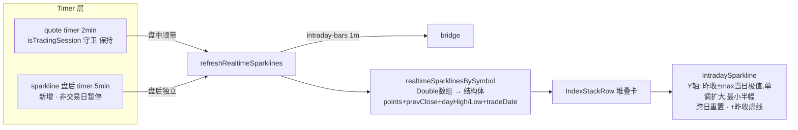

# KSSDesktop 真机反馈第二轮修复 - Plan

## Goal Capsule

- **目标**：修复第二轮真机测试发现的 4 组问题——趋势观察无数据（含全部 U15 域读路径审计）、设置页 IA 重构为 Tab 形态并统一视觉、工具栏图标按频率重新分组、看盘分时缩略图盘后停更与形态跳动。
- **产品权威**：用户真机测试的直接反馈。
- **待解阻塞项**：无——形态决定（Tab+状态点）、分组逻辑（按点击频率）、警示横幅处理（kssCard 色彩变体）已在 brainstorm 对话中拍板。

## Product Contract

### Summary

修复 U15 存储迁移留下的读写路径分裂（趋势观察页因此全无数据），并审计其余全部迁移域；设置页从四段平铺长滚动改为 Tab 形态（tab 标签带状态点），页内组件与字体统一到 x.com 标准样式（新增带色彩变体的 kssCard 承载警示横幅）；工具栏图标按点击频率重排分组；今日看盘堆叠卡分时缩略图恢复盘后低频刷新，Y 轴锚定当日涨跌幅范围加昨收参考线，消除形态跳动。

### Problem Frame

第二轮真机测试发现四组问题。最严重的是"趋势观察"页完全无数据且刷新无效：U15 存储割接把趋势归档的**写入**路径迁到了 `kss.db` 的 `trends_days` 表（`kss/storage/trends.py`），但 bridge 的**读取**路径（`scripts/kss_app_bridge.py` 的 `_trends_month`/`_trends_day`）仍在 glob 旧的 `storage/trends/*.json` 目录——旧目录已随 U15 归档流程移入 `storage/_migrated_archive/`，于是页面永远拿不到数据。该域在割接台账里记为完成、写方已切、旧文件已归档，唯独漏了 bridge 读方——U15 一共割接了 22 个域，同类读写分裂可能不止这一处。

设置页四个分区（密钥/数据源/定时任务/日志）平铺在一个长滚动里，一屏看不完；且视觉语言仍不统一：密钥整段包一张 kssCard、数据源每行一张卡、定时任务分区里警示横幅（关机漏跑/批量提示）还是手写背景色、分类标题裸露无卡片、三种按钮样式混用。

工具栏右上角的元素排列缺乏逻辑：实时状态点紧贴「任务台」按钮（视觉上像同一个胶囊的一部分），分隔符却放在任务台后面；主题（Menu）/设置/刷新三个入口之间没有任何分组。

今日看盘第二行堆叠卡的分时缩略图时有时无：代码注释明确写了"非交易时段也跑"，但驱动重复刷新的 Timer 只在交易时段内运转（`KSSStore.swift` `reevaluateTimer`/`onRefreshTick` 都有 `isTradingSession` 守卫），盘后只在页面加载时一次性拉取、失败即空白且永不重试。缩略图本身的形态也不稳定：Y 轴每帧按当前已加载数据的最大最小值重新缩放（`IntradaySparkline.swift`），同一标的因加载量不同一会儿平一会儿尖。

### Key Decisions

- **趋势观察修复扩展为全部 U15 域读路径审计** — 同一轮迁移里同类分裂可能不止一处，一次性排查全部 22 个域（以 `storage/migration_ledger.json` 为准）的读取方是否与写入方一致，避免同类问题在其他页面再次冒出来。
- **设置页采用"Tab + 状态点"混合形态** — 默认 Tab（复用应用已有的 `KSSSegmentedControl` 分段控件，与 Dashboard/推荐等页面视觉一致），每个 tab 标签可带小状态点（如数据源有未配置项、定时任务有待同步/漏跑项时亮点），兼顾 Tab 的整洁与折叠面板"不展开也能扫健康度"的优点。
- **工具栏按点击频率分组，不按功能类型** — 顺序定为：状态点（非按钮，持续显示）→ 刷新（最高频动作）→ 任务台（频繁导航）→ 分隔符 → 主题 → 设置（低频配置类）。状态点与任务台之间不再紧贴，分隔符移到高频/低频两组之间。
- **警示横幅用带色彩变体的 kssCard，不做去色统一** — 给 kssCard 增加 warning/info 色彩变体，统一圆角/阴影/内边距等结构规范的同时保留警示色语义；完全中性化会丢掉"漏跑警示"的视觉紧迫感。
- **分时缩略图盘后低频继续刷新，不做静态"已收盘"定格** — 与代码里已写明的"非交易时段也跑"意图对齐；盘后/集合竞价等时段仍能看到接近完整的当日分时形态，只是刷新频率降低（约 5-10 分钟一档，具体值 planning 定）。
- **分时缩略图 Y 轴锚定当日涨跌幅范围 + 昨收参考线** — 参考苹果股市 App 小图样式：Y 轴围绕昨收上下对称展开，图上画一条昨收虚线，形态不再随加载数据量变化而跳动，涨跌方向一眼可辨。

### Requirements

**数据链路（U15 读写分裂）**

R1. 「趋势观察」页恢复显示数据：bridge 的 `trends-month`/`trends-day` 读取路径改为读 `kss.db` 的 `trends_days` 表，与写入方（`kss/storage/trends.py`）一致。

R2. 审计 U15 迁移的全部域——以 `storage/migration_ledger.json` 台账为准（22 个域，盘点明细见 `docs/plans/2026-07-12-005-appendix-storage-inventory.md`），逐一核对每个域的所有读取方是否已指向 `kss.db`；发现的读写分裂全部修复，审计结论追加/更新到该 ledger（U15 已建立的逐域记录机制），不另建记录文件。

**设置页 IA 与视觉统一**

R3. 设置页从平铺长滚动改为 Tab 形态：密钥/数据源/定时任务/日志四个 tab，复用 `KSSSegmentedControl`；tab 标签支持状态点——数据源存在未配置或测试失败项、定时任务存在待同步/漏跑/失败项时，对应 tab 亮点提示（具体判定条件 planning 核实现有健康态字段后定）。设置页支持带目标 tab 的打开方式，默认打开密钥 tab；现有三处"去设置"入口（Dashboard 缺 Tushare 凭证卡、AIChat 缺 LLM key 卡、自检横幅的 open_settings 动作）各自指定落点 tab（前两者落密钥 tab，自检横幅按 fail 项归属映射，映射关系 planning 定）。页顶的自检状态条（SelfCheckStatusStrip）保留在页标题与 tab 栏之间、任何 tab 下均可见（自检结果跨分区，不归属单一 tab）。

R4. 设置页内全部分区的组件与字体统一为 x.com 标准样式（kssCard 体系 + `KSSFont.themed`）：定时任务分区遗留的手写背景横幅（关机漏跑/批量提示）、无卡片的分类标题块、混用的按钮样式（bordered/borderedProminent/borderless）全部纳入统一。

R5. kssCard 组件新增 warning/info 色彩变体，警示横幅迁移到该变体上——结构规范（圆角/阴影/内边距）与其他卡片一致，色彩语义保留。

**工具栏**

R6. 工具栏元素重排为按点击频率分组：状态点 → 刷新 → 任务台 → 分隔符 → 主题 → 设置。状态点与任务台按钮之间保持明确间隔（不再视觉上粘连成同一胶囊），分隔符只出现在高频组与低频组之间。现有的 loading spinner 不再作为独立元素占位——合并进刷新按钮（加载中时刷新按钮图标替换为 spinner 并禁用），避免间歇出现的元素挤动分组布局。

**看盘分时缩略图**

R7. 今日看盘堆叠卡的分时缩略图在盘后继续低频刷新（约 5-10 分钟一次，具体频率 planning 定），不再出现"盘后加载一次失败就永久空白"的情况。

R8. 分时缩略图 Y 轴锚定稳定参考系：围绕昨收按当日涨跌幅范围展开，并绘制昨收参考线；同一标的的形态不因先后加载的数据量不同而明显变形。两条硬约束：(a) Y 轴范围的真值源与"当前已加载的 bar 数量"无关——取行情快照的当日极值，或只允许随实际数据单调扩大、不得随加载切片缩小；(b) 平盘日（涨跌接近 0）设最小展开幅度保底，避免微小波动被放大成剧烈锯齿。

### Acceptance Examples

AE1. **Covers R1.** Given 趋势归档任务已把当月数据写入 `kss.db` 的 `trends_days` 表，When 打开「趋势观察」页，Then 趋势月历与"本周"区块显示已归档的交易日数据，点击某日能看到当日明细。

AE2. **Covers R3.** Given 数据源中存在一项"未配置"（如 Telegram），When 打开设置页，Then「数据源」tab 标签上出现状态点；配置完成后状态点消失。

AE3. **Covers R7.** Given 当前为盘后时段（如 20:00），When 打开今日看盘页并持续停留，Then 堆叠卡分时缩略图在一个刷新周期内出现完整当日形态，且期间至少发生一次自动刷新（首次加载失败也能靠后续刷新恢复）。

AE4. **Covers R8.** Given 同一标的的分时缩略图，When 在数据加载早期（仅部分 bar）与加载完整后分别查看，Then 两个时刻的整体形态一致（Y 轴不因数据量变化重新缩放），且都能看到昨收参考线。

### Scope Boundaries

- 主题入口保持 Menu 控件、任务台/设置/刷新保持 Button——控件类型差异保留，只调顺序与分组，不强行统一控件形态。
- 不解决东财 1m 分时数据"仅近 5 个交易日"的上游数据源限制——本轮只修客户端的刷新与渲染，不换数据源。
- 不改动侧边栏与其他页面的布局。

### Outstanding Questions

**Deferred to Implementation：**

- 自检横幅（open_settings 动作）fail 项 → 目标 tab 的逐项映射表——实现时按自检 fail 项的实际字段名逐项归类（凭证类→密钥，数据源连通类→数据源，任务健康类→定时任务），无法归类的落默认密钥 tab。

> 此前 Deferred to Planning 的五项问题：四项由 KTD 拍板——tab 状态点判定条件与视觉区隔（KTD4）、盘后刷新频率 5 分钟与非交易日暂停（KTD6）、quote/sparkline 双 tick 路径拆分（KTD6）、R2 审计口径与批次阈值（KTD2）；第五项（自检横幅 fail 项→tab 映射）planning 只定了分类规则（凭证类→密钥、连通类→数据源、任务健康类→定时任务、无法归类兜底密钥），逐项映射表见上方 Deferred to Implementation。

### Sources / Research

- `Sources/KSSDesktop/Views/TrendsView.swift:74-79` — 趋势页加载触发（`.task { onLoadMonth(currentMonth) }`）。
- `Sources/KSSDesktop/Services/KSSStore.swift:1180-1198`、`Sources/KSSDesktop/Services/BridgeClient.swift:339-345` — `trends-month`/`trends-day` bridge 调用链。
- `scripts/kss_app_bridge.py:3878,3890-3929` — `_TRENDS_DIR = STATE_ROOT / "storage" / "trends"`，`_trends_month`/`_trends_day` 仍 glob 旧 JSON 目录；该目录已随 U15 归档流程整体移入 `storage/_migrated_archive/trends/`，现已不存在。`kss.db` 的 `trends_days` 表已有 45 行数据（2026-05-07 至 2026-07-10），R1 修完即能回显。
- `kss/storage/trends.py:1-23` — 写入方已割接到 `kss.db` `trends_days` 表（"U15 割接自 storage/trends/{date}.json"）；`scripts/archive_trends_daily.py:260-266` — 采集器调 `write_day()` 写表。
- `kss/storage/db.py:283-287` — `trends_days` 表 schema。
- `Sources/KSSDesktop/Views/SettingsView.swift:10-38` — 设置页当前平铺结构；`:84-153`（密钥整段一张卡）、`:267-307`（数据源每行一张卡）。
- `Sources/KSSDesktop/Support/Components.swift:208-237` — `KSSSegmentedControl`（Dashboard/推荐/资讯/复盘 4 个页面已用，设置页与趋势页未用）；全应用无 `DisclosureGroup` 用例。
- `Sources/KSSDesktop/Views/RunbookView.swift:147-181`（catchUpBanner 手写背景）、`:183-199`（batchNoteBar 手写背景）、`:201-238`（categoryBlock 无卡片）、按钮样式混用（`.bordered`/`.borderedProminent`/`.borderless`）。
- `Sources/KSSDesktop/Views/ContentView.swift:91-140` — 工具栏当前排列（spinner → 状态点 → 任务台 → "|" → 主题 → 设置 → 刷新）；`:116-120` 作者注释（分隔符本意分"管理组/用户组"）；`:196-239` — themeMenu 是 Menu 控件。
- `Sources/KSSDesktop/Views/DashboardView.swift:73-79,125` — 堆叠卡 `IndexStackRow(liveSparklines:)` 与 `.onAppear { onLoadRealtime() }`。
- `Sources/KSSDesktop/Services/KSSStore.swift:437-469` — `refreshRealtimeSparklines`（注释："非交易时段也跑"）→ `intraday-bars`；`:340-349` — 非交易时段单次刷新路径；`:932-939,955-961` — Timer 的 `isTradingSession` 守卫（盘后停摆的根因）。
- `Sources/KSSDesktop/Support/IntradaySparkline.swift:17-49` — 每帧按当前 points 的 min/max 重新缩放的 Path 绘制（形态跳动根因）。
- `kss/data/intraday_client.py:44,296` — 东财 1m 仅近 ~5 个交易日的上游限制（已文档化，本轮不解决）。
- `docs/plans/2026-07-12-005-feat-release-hardening-settings-plan.md` 与 `docs/plans/2026-07-12-005-appendix-storage-inventory.md` — U15 存储割接决策记录与盘点明细；`storage/migration_ledger.json` — 22 域权威台账（已实测确认域清单）。
- `docs/plans/2026-07-13-001-fix-desktop-feedback-polish-plan.md` — 第一轮真机反馈修复（实时 badge/任务改名/kssCard 首轮统一）。
- `kss/storage/trends.py:16-45` — 已有 `write_day`/`read_by_date`/`day_exists`/`read_all`，缺按月前缀查询（U1 补）。
- `scripts/kss_app_bridge.py:160-164` — bridge import `kss.storage` 读 kss.db 的既有模式（`load_stock_names(db_path=STATE_ROOT / "storage" / "kss.db")`），U1 照搬。
- `Sources/KSSDesktop/Support/Components.swift:208-237` — `KSSSegmentedControl<Key: Hashable>`，`options: [(key, label)]` + `@Binding selection`，扩展状态点的挂点明确。

---

## Planning Contract

**Product Contract preservation:** unchanged — R1-R8 与 AE1-AE4 保持 brainstorm + doc-review 定稿原文；此前 Deferred to Planning 的五项问题由下方 KTD 拍板（见 Outstanding Questions 注）。

### Key Technical Decisions

- **KTD1 — trends 读路径复用 `kss.storage.trends`，与 `_stock_names` 同模式。** bridge 已有 import `kss.storage` 读 kss.db 的先例（`kss_app_bridge.py:160-164`）；`_trends_month`/`_trends_day` 改调 `read_by_date` 与新增的按月前缀查询（`trends.py` 补一个 `read_month(month)`，`WHERE trade_date LIKE 'YYYY-MM-%'`），返回结构保持与旧 JSON 版一致——`trends_days.payload_json` 存的就是采集器 `build_trend_day` 的完整输出（与旧 JSON 文件同形），bridge 侧的月历字段裁剪/hasData 计算原样保留（Swift 侧 `TrendMonth`/`TrendDayDetail` 解码不动，`BridgeClient.swift:339-346`）。查询前先检查 `kss.db` 文件存在，缺失时直接返回空月结构/`found: False` 并带 error 提示，**不触发 `connect()`**——`kss/storage/db.py` 的 connect 会 mkdir + 建库 + ensure_schema，只读命令静默创建空库会把 STATE_ROOT 解析错误（bundle 双根分裂是本项目已实证的坑）伪装成"没有数据"。旧 `_TRENDS_DIR` glob 逻辑删除。
- **KTD2 — R2 审计用机械判据，分裂当场修，>3 个额外损坏域才重新划批。** 以 `storage/migration_ledger.json` 的 22 个域为准，每域提取旧存储路径特征串（如 `storage/trends`、`storage/intel_radar`、旧 csv/json 文件名），grep 全 repo 的读取方（`scripts/`、`kss/`、`Sources/KSSDesktop/`），命中且属于读路径的即分裂。分裂在本单元内修复——先全量审完再统一修（与 U2 Execution note 一致），>3 个额外损坏域的暂停阈值在全量审计完成、统一修复开始前判定。修复后把审计结论（`read_path_audit: clean|fixed`——核对无分裂记 clean，核对出分裂并已修复记 fixed，另附审计日期）写回 ledger 每域条目；若发现超过 3 个额外损坏域，暂停并向用户重新划批次。
- **KTD3 — 设置页 tab 态用内存 `@State` + store 深链信号，默认密钥 tab。** 不持久化 tab 选择：每次进入设置页默认落密钥 tab。深链用 `KSSStore` 新增的 `settingsTargetTab`（Optional，打开设置页时消费一次并清空）；三处"去设置"入口设置该值后再切 `selectedSection = .settings`。
- **KTD4 — 分段控件状态点：`KSSSegmentedControl` 扩可选 `badgedKeys: Set<Key>`。** 命中 key 的 label 右上角画小圆点，统一用 `theme.ma5`（警示黄）——与 RealtimeStatusDot 的绿/黄/灰/红新鲜度四色语义区隔（那是"数据新不新"，这是"有没有待处理项"）。判定条件：数据源 tab = 任一数据源"未配置"或最近一次测试失败；定时任务 tab = 任一任务 `needsInstall`/`stale`/`failed`。密钥/日志 tab 本轮不设点。
- **KTD5 — `KSSCardStyle` 扩 `.warning`/`.info` 两个色彩变体。** fill 分别用 `theme.ma5` 与 `theme.accent` 的低透明度（对齐现 catchUpBanner 的 0.10 一档），圆角/阴影/内边距走 KSSCard 既有结构；`.warning` 保留 catchUpBanner 现有的 strokeBorder 强调。catchUpBanner→`.warning`、batchNoteBar→`.info` 迁移后删除手写背景。
- **KTD6 — R7 拆双刷新路径：quote timer 不动，sparkline 独立盘后 tick。** 现有 2 分钟 quote timer 保持 `isTradingSession` 守卫；盘中 sparkline 仍随 quote tick 顺带刷新（现状）。新增独立的盘后 sparkline timer：非交易时段每 5 分钟调 `refreshRealtimeSparklines`（不触碰 quote），非交易日（`tradingHours` 判定当天非交易日）整天暂停。`reevaluateTimer` 扩展为同时管理两个 timer 的启停。
- **KTD7 — R8 sparkline 数据升级为结构体，Y 轴单调扩大 + 最小半幅 + 跨日重置。** `realtimeSparklinesBySymbol` 的值从 `[Double]` 升级为含 `points`/`prevClose`/`dayHigh`/`dayLow`/`tradeDate` 的小结构。prevClose 取值：盘中用 `quote.prevClose`；盘后用堆叠卡条目自身的 `close / (1 + pct/100)` 反推（`DashboardView` absoluteChange 已用同式）。Y 轴半幅 = `max(|dayHigh−prevClose|, |prevClose−dayLow|, 已见数据相对昨收的最大偏离, 最小半幅)`——dayHigh/dayLow 可得时首帧即锚定全日范围，缺失时退化为纯单调扩大；最大偏离只随新数据单调扩大、不随加载切片缩小；最小半幅取 0.5%（避免平盘日锯齿）。**跨日重置**：合并新数据时若 `tradeDate` 变化，重置单调极值与 prevClose——app 常驻跨日运行（U6 的盘后 timer 使之成为设计内场景）不得携带昨日极值压平当日形态。昨收画水平虚线。`IntradaySparkline` 增加接收锚定参数的渲染分支，原 min/max 自适应模式保留给不传锚定参数的旧调用方。

### High-Level Technical Design

R7/R8 的刷新与渲染链路（改动集中在两条路径的分叉点）：

---

## Implementation Units

### U1. trends 读路径割接到 kss.db

**Goal:** 「趋势观察」页恢复数据——bridge 读路径与写入方对齐。

**Requirements:** R1 — Covers AE1

**Dependencies:** 无

**Files:**
- `kss/storage/trends.py`（补 `read_month(month)` 按月前缀查询）
- `scripts/kss_app_bridge.py`（`_trends_month`/`_trends_day` 改走 `kss.storage.trends`，删除 `_TRENDS_DIR` glob）
- `kss/tests/test_bridge_trends.py`（新建）

**Approach:** 按 KTD1。`_trends_day` → `read_by_date(date)`（查无返回 `{"date": date, "found": False}` 保持现契约）；`_trends_month` → `read_month(month)` 聚合出与旧版相同的月历结构（字段裁剪/hasData 计算留在 bridge 侧）。返回 JSON 字段名不变，Swift 解码层（`TrendMonth`/`TrendDayDetail`）零改动。查询前守卫 kss.db 文件存在，避免只读命令静默建库。

**Patterns to follow:** `scripts/kss_app_bridge.py:160-164`（`_stock_names` 的 `kss.storage` import + `STATE_ROOT / "storage" / "kss.db"` 传参模式）。

**Test scenarios:**
- Covers AE1. Happy: 向临时 kss.db 写入两日 payload 后，`dispatch("trends-month", ...)` 返回含这两日的月数据、`dispatch("trends-day", ...)` 返回当日明细
- Edge: 查询无数据的月份 → 返回空月结构不报错；查询无数据日期 → `found: False`
- Edge: `read_month` 跨月边界（"2026-07" 不吞 "2026-06-30"）
- Error: kss.db 不存在 → 返回空结构/`found: False` 带 error 提示，且**查询后该路径仍不存在 db 文件**（断言无静默建库副作用）

**Verification:** `pytest kss/tests/test_bridge_trends.py -q` 全绿；真机打开趋势观察页能看到 45 行既有归档数据渲染的月历。

---

### U2. 22 域读路径审计 + 分裂修复 + ledger 回写

**Goal:** 排查全部 U15 域的读写分裂并修复，审计结论落进权威台账。

**Requirements:** R2

**Dependencies:** U1（trends 是第一个已知分裂，先修完作为审计基线样例）

**Files:**
- `storage/migration_ledger.json`（每域追加审计结论字段）
- 审计中发现分裂的读取方文件（数量未知，执行期确定）
- 对应的既有测试文件（若修复涉及行为变化则补测试）

**Approach:** 按 KTD2。逐域从 ledger/盘点附录提取旧路径特征串 → grep `scripts/ kss/ Sources/KSSDesktop/` → 人工判读命中是"读路径"还是注释/归档工具 → 分裂即修（照 U1 模式切到 kss.db 读函数）→ ledger 每域写 `read_path_audit: clean|fixed` 与审计日期。发现 >3 个额外损坏域即暂停向用户重新划批。

**Execution note:** 审计先全量跑完再统一修，避免边审边修丢全局视野；审计中间结论随时落 ledger，防中断丢失。

**Test scenarios:**
- Happy: 审计完成后 ledger 22 个域全部带 `read_path_audit` 字段
- 修复域（若有）：每个修复各带一条最小回归测试（读取方从 kss.db 取到写入方刚写的数据）
- Test expectation（纯审计部分）: none -- grep 判读是一次性排查动作，结论以 ledger 记录呈现

**Verification:** ledger 全域带审计结论；`pytest kss/tests -q` 全绿；修复域对应页面/命令真机抽查。

---

### U3. kssCard warning/info 变体 + 任务分区余留统一

**Goal:** 警示横幅语义并入设计系统，消灭 ScheduledTasksSection 里最后的手写背景与混用样式。

**Requirements:** R4, R5

**Dependencies:** 无

**Files:**
- `Sources/KSSDesktop/Support/Theme.swift`（`KSSCardStyle` 扩 `.warning`/`.info`）
- `Sources/KSSDesktop/Views/RunbookView.swift`（catchUpBanner→`.warning`、batchNoteBar→`.info`、categoryBlock 标题条包卡、按钮样式归一）
- `Tests/KSSDesktopTests/ThemeCatalogTests.swift`（扩展，若已有 card 相关断言）

**Approach:** 按 KTD5。变体只改 fill 与可选 strokeBorder，结构（圆角/阴影/padding 语义）与既有三型一致。按钮样式归一原则：行内动作 `.bordered`、主行动 `.borderedProminent`、图标微动作 `.borderless`——三者保留但每类用途固定，不再随意混用。

**Test scenarios:**
- Happy: `.warning`/`.info` 变体在 8 套主题下取色来自主题 token（若可轻量断言 fill 来源则加测试，否则真机核对）
- Test expectation（视觉迁移部分）: none -- 真机核对设置页与任务台页两处横幅外观

**Verification:** `swift build` 通过；真机核对设置页「定时任务」分区的漏跑横幅/批量提示为卡片形态且保留色彩语义（`ScheduledTasksSection` 只在设置页渲染，任务台页只有 TaskGrid/TaskResultCard、无这两条横幅）。

---

### U4. 设置页 Tab 化：分段控件 + 状态点 + 深链 + 自检条

**Goal:** 设置页从平铺长滚动变为四 tab 结构，支持状态点与外部定向跳转。

**Requirements:** R3 — Covers AE2

**Dependencies:** U3（定时任务 tab 内容以统一后的视觉呈现）

**Files:**
- `Sources/KSSDesktop/Support/Components.swift`（`KSSSegmentedControl` 扩 `badgedKeys: Set<Key>`）
- `Sources/KSSDesktop/Views/SettingsView.swift`（四段平铺 → tab 切换结构；自检条保留在标题与 tab 栏之间）
- `Sources/KSSDesktop/Services/KSSStore.swift`（新增 `settingsTargetTab` 深链信号）
- `Sources/KSSDesktop/Views/ContentView.swift`、`Sources/KSSDesktop/Views/AIChatView.swift`、`Sources/KSSDesktop/Views/DashboardView.swift`（三处"去设置"入口带目标 tab）
- `Tests/KSSDesktopTests/SettingsTabTests.swift`（新建：tab 枚举、状态点判定、深链消费）

**Approach:** 按 KTD3/KTD4。新增 `SettingsTab` 枚举（keys/dataSources/scheduledTasks/logs）；页内 `@State var tab: SettingsTab = .keys`，`onAppear` 消费 `store.settingsTargetTab` 后清空。状态点判定做成纯函数（输入数据源配置态/任务健康列表，输出 `Set<SettingsTab>`），供测试与视图共用。Tab 化重排时顺带核对密钥/数据源/日志分区已全部走 kssCard + `KSSFont.themed`（第一轮 2026-07-13-001 统一的延续核验），发现遗留纳入本单元（R4 主句"全部分区"的兜底）。

**Test scenarios:**
- Covers AE2. Happy: 数据源存在"未配置"项 → 判定函数输出含 `.dataSources`；全部配置且测试通过 → 不含
- Happy: 任务列表含 `stale`/`failed`/`needsInstall` 任一 → 输出含 `.scheduledTasks`
- Edge: 深链信号消费一次后清空（连续两次进设置页，第二次落默认密钥 tab）
- Integration: 设置 `settingsTargetTab = .dataSources` 再切 section → 设置页首帧即 dataSources tab

**Verification:** `swift test --filter SettingsTabTests` 全绿；真机核对四 tab 切换、状态点亮灭、三处"去设置"落点正确、自检条常驻。

---

### U5. 工具栏频率分组 + spinner 合并

**Goal:** 工具栏重排为高频/低频两组，杂散元素归位。

**Requirements:** R6

**Dependencies:** 无

**Files:**
- `Sources/KSSDesktop/Views/ContentView.swift`（ToolbarItemGroup 重排；spinner 合并进刷新按钮）

**Approach:** 按 R6 定稿顺序：状态点 → 刷新 → 任务台 → `Text("|")` → 主题 → 设置。刷新按钮 `isLoading` 时 label 换 `ProgressView().controlSize(.small)` 并 `.disabled(true)`；独立 spinner 删除。状态点与任务台之间用明确 spacing（不共享背景）。

**Test scenarios:** Test expectation: none -- 纯工具栏排列改动，无行为断言；真机核对顺序与加载态。

**Verification:** `swift build` 通过；真机核对新顺序、加载中刷新按钮变 spinner、状态点不再粘连任务台。

---

### U6. sparkline 双刷新路径（盘后 5 分钟 tick）

**Goal:** 盘后分时缩略图持续低频刷新，不再一次失败永久空白。

**Requirements:** R7 — Covers AE3

**Dependencies:** 无（与 U7 同域，先做本单元）

**Files:**
- `Sources/KSSDesktop/Services/KSSStore.swift`（新增盘后 sparkline timer；`reevaluateTimer` 管理两 timer；非交易日暂停）
- `Tests/KSSDesktopTests/RealtimeMergeTests.swift` 或新建 `SparklineRefreshTests.swift`（timer 启停决策的纯函数测试）

**Approach:** 按 KTD6。把"当前应启用哪些 timer"提炼为纯函数（输入 scenePhase/isTradingSession/isTradeDay/authFailed，输出 {quoteTimerOn, sparklineTimerOn}），`reevaluateTimer` 按输出启停。盘中 sparkline 仍随 quote tick 顺带；盘后独立 5 分钟 tick 只调 `refreshRealtimeSparklines`。顺手修一个既有小 bug：`retryRealtime()` 的 coalesce 清理前缀是 `intraday-bars:`，匹配不到 sparkline 实际用的 `intraday-bars-spark:` 键——手动重试后 sparkline 请求可能仍被 30s 窗口吞掉。

**Test scenarios:**
- Covers AE3. Happy: 交易时段 → quote on + sparkline 随行；盘后交易日 → quote off + sparkline on
- Edge: 非交易日 → 两者皆 off
- Edge: 盘后交易日 + `authFailed` → sparklineTimerOn 仍为 true（盘后 sparkline 走 local 降级不依赖 Longbridge 鉴权）；盘中 `authFailed` 时 sparkline 随 quote 链路冻结属现状，本轮不改
- Edge: scenePhase 非 active → 全部 off（现有行为保持）

**Verification:** 测试全绿；真机盘后停留 10 分钟观察至少一次自动刷新。

---

### U7. sparkline Y 轴锚定 + 昨收参考线

**Goal:** 分时缩略图形态稳定、涨跌方向可辨。

**Requirements:** R8 — Covers AE4

**Dependencies:** U6（同一数据链路，避免并行改 KSSStore sparkline 路径冲突）

**Files:**
- `Sources/KSSDesktop/Services/KSSStore.swift`（sparkline map 值升级为结构体，含 prevClose 与单调极值）
- `Sources/KSSDesktop/Support/IntradaySparkline.swift`（锚定渲染分支 + 昨收虚线）
- `Sources/KSSDesktop/Views/DashboardView.swift`（IndexStackRow 传递新结构）
- `Tests/KSSDesktopTests/IntradaySparklineTests.swift`（新建：Y 轴范围计算纯函数）

**Approach:** 按 KTD7。Y 轴范围计算独立成纯函数：输入 prevClose、可选 dayHigh/dayLow、历史最大偏离、当前 points，输出 (yMin, yMax)——偏离只增不减，最小半幅 0.5% 保底，dayHigh/dayLow 可得时并入初值。合并新数据时 `tradeDate` 变化则重置极值与 prevClose（跨日重置）。prevClose 盘中取 quote、盘后按 `close/(1+pct/100)` 反推（与 DashboardView 既有 absoluteChange 同式；注意 snapshot 未刷新时 close/pct 可能与 bars 不同日，锚线错位风险执行期核对）。渲染层加昨收水平虚线；`showEmptyPlaceholder`/旧自适应分支保持兼容。

**Test scenarios:**
- Covers AE4. Happy: 同一 prevClose 下先传 30 个点再传 240 个点（极值不变）→ (yMin,yMax) 不变
- Edge: 新数据出现更大偏离 → 范围单调扩大；随后传入较小切片 → 范围不回缩
- Edge: 平盘日（偏离 <0.5%）→ 半幅取 0.5% 保底
- Edge: dayHigh/dayLow 提供时 → 首帧半幅即覆盖全日范围；缺失时退化为纯单调扩大
- Edge: `tradeDate` 变化（跨交易日）→ 单调极值与 prevClose 重置，昨日大偏离不影响今日半幅
- Edge: prevClose 缺失/为 0 → 回退旧 min/max 自适应分支，不崩溃

**Verification:** `swift test --filter IntradaySparklineTests` 全绿；真机核对堆叠卡缩略图带昨收虚线、加载过程中形态不跳动。

---

## Verification Contract

| Unit | Command | Applicability | Done signal |
|---|---|---|---|
| U1 | `pytest kss/tests/test_bridge_trends.py -q` | 全部 | 测试全绿 + 真机趋势页有数据 |
| U2 | `pytest kss/tests -q` + ledger 检查 | 全部 | 22 域全带审计结论 + 全量测试绿 |
| U3 | `swift build` + 真机核对 | 全部 | 构建过 + 横幅卡片化且保留色彩语义 |
| U4 | `swift test --filter SettingsTabTests` | 全部 | 测试全绿 + 真机四 tab/状态点/深链核对 |
| U5 | `swift build` + 真机核对 | UI-only | 新顺序 + spinner 合并生效 |
| U6 | `swift test`（timer 决策纯函数） | 全部 | 测试全绿 + 真机盘后观察自动刷新 |
| U7 | `swift test --filter IntradaySparklineTests` | 全部 | 测试全绿 + 真机形态稳定 + 昨收线可见 |

## Definition of Done

- [ ] `pytest kss/tests -q` 全绿（含新增 `test_bridge_trends.py`）
- [ ] `swift test` 全绿（含新增 SettingsTabTests / IntradaySparklineTests 及 timer 决策测试）
- [ ] `storage/migration_ledger.json` 22 个域全部带 `read_path_audit` 结论；发现的分裂全部修复（或按 >3 域阈值重新划批并经用户确认）
- [ ] 真机验证：趋势观察页显示归档数据；设置页四 tab + 状态点 + 三处深链落点 + 自检条常驻；工具栏新顺序与 spinner 合并；盘后分时缩略图自动刷新且形态稳定带昨收线
- [ ] 定时任务分区横幅迁移到 kssCard warning/info 变体，8 套主题下抽查对比度正常
