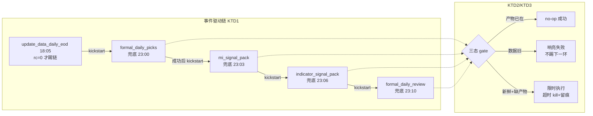

# KSSDesktop 数据管线时序竞态与第三轮反馈修复 - Plan

## Goal Capsule

- **目标**：修复第三轮真机验证暴露的数据链路系统性故障——EOD 数据与下游任务（选股/信号/复盘）的调度时序竞态、7-14 悬空任务、分钟线静默回落无提示与采集链断裂——并完成设置页密钥/数据源的视觉终局对齐（已连续三轮未达标）。
- **产品权威**：用户真机验证的直接反馈 + grounding 调查实证的日志/DB 证据。
- **待解阻塞项**：无——新鲜度口径、调度修法（事件驱动链）、字号规格、Longbridge 替换条件均已拍板。

## Product Contract

### Summary

把选股→信号→复盘从"固定时刻各跑各的"改为"EOD 数据更新成功后自动依次触发"的事件驱动链，下游任务加数据新鲜度断言（旧数据不再静默成功），并回填 7-13 缺失产物；诊断并修复 7-14 四任务悬空与 EOD 采集 4.6 小时的异常；分钟线不可用时图表区给出显眼提示（不再静默回落日线），修复 collect_intraday 采集链，评估 Longbridge 分钟线且可行即直接替换东财源；设置页密钥/数据源分区按已确认的字号对照表与主题化输入框做终局对齐。

### Problem Frame

第三轮真机验证（7-14 盘中）发现三组问题，grounding 调查实证了根因：

**数据停更是调度时序竞态，不是单次漏跑。** 选股 cron 排 17:00、MI 信号 17:15、指标信号 17:16、复盘 17:20，而当日收盘数据的 EOD 采集任务排 18:05——下游永远跑在上游数据落盘之前。7-13（周一）四个任务全部基于 7-10 的旧数据"成功"运行：复盘重算了一遍 7-10 然后因"档案已存在"跳过写档，选股又选了 7-10 的横截面（旧落盘校验按 cron 日期找 `2026-07-13.json` 不存在才暴露 ALERT）。`mi_signal_packs`/`indicator_signal_packs` 的 `MAX(asof)` 停在 2026-07-10。用户在 UI 看到的复盘 7-11、滚动信号 7-10、推荐无当日数据，全部由此而来。

**7-14 存在第二个独立故障。** 当天四个任务 17:16-17:34 起跑后全部悬空——日志只有开始头、无完成记录、无存活进程；同日 EOD 数据更新耗时 16560 秒（约 4.6 小时，正常约 9 分钟）到 22:52 才完成。悬空死因未查明。

**分钟线是"静默回落"叠加"采集链断裂"。** 详情页 TV 图表在分钟数据不可渲染时静默回落显示日线（K 线区无任何提示，仅工具栏一行 caption2 小字），这是用户"点了没反应"的直接体验。个股分钟缓存整体缺失：collect_intraday 连续失败——cron 环境未注入 Tushare token（日志每次都有 "Tushare token not found"）、交易日历判定失败（calendar_unknown）、请求标的数为 0。东财 1m 端点本机直连/代理均不通是既有实证结论，该源已明显不可用。

**设置页字体问题连续三轮未修正。** 密钥区标题层级 11-13pt、数据源区 14pt、定时任务区 14.5pt，且密钥区混用未主题化的 `.system` 字体与裸 `fontWeight`；输入框是 macOS 系统 roundedBorder 样式，与主题卡片风格脱节。前两轮的"顺带核对"没有产生实际修改，本轮以独立验收项处理。

### Key Decisions

- **调度修法选事件驱动链，不选 gate+重试或仅 fail-loud** — EOD 数据更新成功完成后自动依次触发选股→信号→复盘；彻底消除竞态，EOD 跑多久（哪怕 4.6 小时）都不影响正确性。下游任务同时保留数据新鲜度断言作为第二道防线：检测到数据日期落后于预期交易日时报错退出，不得静默用旧数据跑成功。
- **新鲜度口径 = 最近已收盘交易日** — 盘中打开应用看到昨收盘日的复盘/信号/推荐即为正常；不要求盘中生成当日内容。
- **回填 7-13（planning 扩围为全部缺失已收盘日）** — 根因修复后手动补跑，生成缺失交易日的选股/信号/复盘，历史不留洞，纸交易跟踪样本天数不断档。planning 研究发现 7-14 产物同样全缺（当日下游任务悬空），回填范围扩为 7-13 起至实施日的全部缺失已收盘交易日。
- **事件驱动化的连带适配** — 选股/信号/复盘变为"被触发"后，设置页定时任务分区的「下次运行」展示与漏跑（stale）判定逻辑需跟着适配（现在都基于固定时刻表）；这是本轮范围内的必做项，不是可选优化。
- **分钟线失败反馈从"工具栏小字"升级为"图表区显眼提示"** — 分钟档位无数据时 K 线区明确显示原因与来源状态，不再静默回落日线渲染。
- **Longbridge 分钟线：评估可行即直接替换东财源** — 东财 1m 已实证不可用，不再保留为主源。评估覆盖 A 股 1m K 线的权限/覆盖面/配额后，可行则分钟线采集与实时读取直接切 Longbridge；不可行则回退为修复 collect_intraday 现有链路（token 注入 + 交易日历）并保持本地缓存兜底。
- **设置页字号以定时任务分区为基准锚定**（已逐项确认）：分区小节头/行标题 14.5 bold、输入框标签 12.5 semibold、状态文/chip 11.5 semibold+胶囊底、说明文 11.5、等宽 system 11、按钮文字 12 semibold 且统一 `.bordered`；全部走主题化字体，消灭裸 `.system`/裸 `fontWeight`。
- **输入框换主题化自绘样式** — 弃系统 roundedBorder，改为主题 token 底色+描边+圆角，8 套主题自适应。

### Requirements

**数据管线（时序竞态 + 悬空诊断）**

R1. EOD 数据更新任务成功完成后，自动依次触发选股→MI 信号→指标信号→复盘四个下游任务；任一环节失败则中断后续并留下可诊断的失败记录（不静默跳过）。

R2. 四个下游任务各自增加数据新鲜度断言：开跑时检测依赖数据的最新日期是否为预期交易日，不满足即报错退出（exit 非零 + 明确原因），不得基于旧数据跑出"成功"。

R3. 诊断并修复 7-14 的两项异常：(a) 四个任务起跑后悬空无完成记录的死因；(b) EOD 数据更新耗时 4.6 小时（正常约 9 分钟）的原因。修复后 EOD→下游全链在真机完整跑通一次。

R4. 回填缺失的已收盘交易日（7-13 起至实施日，planning 扩围——7-14 产物同样全缺）：生成各缺失日的选股、MI/指标信号、复盘产物，UI 三处（推荐页、个股详情复盘结论、滚动信号）能看到最近已收盘日内容。

R5. 设置页定时任务分区适配事件驱动链：被触发型任务的「下次运行」展示与漏跑判定不再按固定时刻表误判（具体呈现方式 planning 定）。

**分钟线（体验 + 数据源）**

R6. 详情页 TV 图表分钟档位无数据时，K 线区显示显眼的原因提示（含数据来源状态与可行动指引），不再静默回落日线渲染；重试入口保留。

R7. 评估 Longbridge 分钟线（A 股 1m K 线的权限/覆盖/配额），可行则分钟线数据源直接替换为 Longbridge（采集与详情页实时读取两条路径）——该分支的硬验收为自选股盘后能看到当日分钟线（AE4）；不可行则修复 collect_intraday 现有链路的两处断裂（cron 环境 Tushare token 未注入、交易日历判定 calendar_unknown）并保持本地缓存兜底——该分支只承诺链路健康（采集任务不再因 token/日历自伤，东财恢复可达时立即受益），当日分钟线不作硬验收（东财端点本机不可达是既有实证，修链路不等于修通上游）。

**设置页视觉终局**

R8. 密钥/数据源分区按已确认字号对照表对齐（基准=定时任务分区）：行/小节标题 14.5 bold、输入框标签 12.5 semibold、状态文/chip 11.5 semibold+胶囊底、说明文 11.5、等宽 system 11、按钮 12 semibold 统一 `.bordered`；消灭裸 `.system` 与裸 `fontWeight`，全部走主题化字体。

R9. 密钥区输入框（含 SecureField）换主题化自绘样式：主题 token 底色+描边+圆角，8 套主题下不再出现系统白底控件违和。

### Acceptance Examples

AE1. **Covers R1/R2.** Given 交易日 17:00 时 EOD 数据尚未落盘，When 到达原下游任务时刻，Then 不会有任务基于旧数据跑出"成功"；When EOD 更新在任意时刻成功完成，Then 选股→信号→复盘依次自动执行且产物日期为当日。

AE2. **Covers R4.** Given 回填完成，When 打开推荐页/个股详情，Then 推荐/复盘结论/滚动信号三处均显示最近已收盘交易日的内容（7-13、7-14 及实施日前缺失日的产物全部在库，无断档）。

AE3. **Covers R6.** Given 某标的无分钟数据，When 在详情页点击分钟档位，Then K 线区显示明确的原因提示而非静默显示日线；点击重试有反馈。

AE4. **Covers R7.** Given Longbridge 四项验收通过并完成切换，When 盘后打开自选股（.BJ 除外，按已知缺口空态提示）详情页切分钟档位，Then 能看到当日分时 K 线。若验收不通过走回退分支，本例改验链路健康（采集任务 completed 且无 token/日历自伤）。

AE5. **Covers R8/R9.** Given 打开设置页密钥/数据源 tab，When 与定时任务 tab 逐项对比，Then 标题/标签/chip/按钮/等宽字的字号与形态一致，输入框为主题化样式；8 套主题抽查无系统白底控件。

### Scope Boundaries

- 不要求盘中生成当日复盘/信号/推荐——新鲜度目标是最近已收盘交易日。
- 不动日线数据源（Tushare/AkShare 链路维持现状，仅修 cron 环境注入问题）。
- 东财 1m 端点的上游网络阻塞本身不修——通过替换或本地缓存绕过。
- 北交所（.BJ）标的分钟线为已知缺口——Longbridge 陆股通池不覆盖、东财回退本机不通；仅以 UI 空态如实提示（见 KTD6/KTD7），AE4 验收不含 .BJ 标的。
- Longbridge 替换仅限分钟线；日线、实时 quote 等既有 Longbridge 用途不在本轮改动范围。

### Outstanding Questions

**Deferred to Planning：**

- 事件驱动链的实现机制选型（EOD wrapper 尾部串行触发 / launchd 触发文件 / 常驻编排器）与失败中断的呈现方式。
- R5 被触发型任务在设置页的展示形态（显示「随 EOD 数据更新触发」还是估算时刻）。
- Longbridge 1m K 线评估的验收清单（权限探针、陆股通池覆盖、历史回看深度、配额）。

**Deferred to Implementation：**

- 7-14 悬空死因与 EOD 4.6 小时的具体根因（诊断本身是 R3 的工作内容）。
- 回填 7-13 的具体补跑顺序与去重处理。

### Sources / Research

Grounding 调查（2026-07-14 23:29 采集，全部实证）：

- `storage/daily_review/` 最新为 2026-07-10（cron 产出）/ 07-11 / 07-12（部分手动），无 2026-07-13 文件。
- `storage/logs/cron/formal_daily_review.log`：07-13 17:20 运行日志显示「== 20260710 (2026-07-10) 复盘 → 预测 20260713 ==」+「dry-run: 档案已存在, 跳过覆盖」，exitCode 0——旧数据静默成功的直接证据。
- `storage/logs/cron/update_data_daily_eod.log`：07-13 EOD 18:05 开跑、18:14 完成（数据在下游任务之后才落盘）；07-14 EOD 18:16 开跑、22:52 完成（16560s ≈ 4.6 小时）。
- `kss.db`：`mi_signal_packs`/`indicator_signal_packs` MAX(asof)=2026-07-10；`paper_trade_picks` MAX(prediction_date)=2026-07-13（但那 5 条来自 07-10 的运行，pick 日 07-10 → T+1 预测日 07-13）。
- `storage/logs/cron/formal_daily_picks.log`：07-13 17:00 运行选了 07-10 横截面、落盘 `2026-07-10.json`，wrapper 按 cron 日期找 `2026-07-13.json` 不存在 → exit 2 ALERT（该校验路径错位已在 round-2 commit e0b2d74 修复，但时序竞态本身未修）。
- 07-14 悬空：mi/indicator/review/picks 四份日志末行均为孤立开始头（17:16:46 / 17:34:43），无完成 JSON，23:29 无相关进程存活。
- `kss/config/cron_jobs.yaml:68-147`：collect_intraday 15:05 / formal_daily_picks 17:00 / mi_signal_pack 17:15 / indicator_signal_pack 17:16 / formal_daily_review 17:20 / update_data_daily_eod 18:05——时序竞态的排布证据。
- `Sources/KSSDesktop/Views/StockBrowserView.swift:391-405,426-427` + `ChartWebView.swift:80-86`：分钟数据不可渲染时传 nil → 回落日线渲染，错误提示仅工具栏 caption2 一行；chart.html 的空态提示（`#empty`）在 Swift 端回落路径下根本不会触发。
- `kss.db intraday_session_cache`：指数类 symbol 有 07-13 数据，个股 688322.SH 的 session_date 为空——个股无有效分钟缓存。
- `storage/logs/cron/collect_intraday.log`：连续失败——每次运行开头「Tushare token not found; API calls will likely fail.」，07-10/07-11/07-14 calendar_unknown，07-10/07-13 completed 但 requested_symbols=0、observations_written=0 + 17 个 permanent_gap。
- `SettingsView.swift`（字号现状）：密钥区 field 标签 `KSSFont.themed(11, .semibold)`、小节头 11-13、Toggle 副文 10、版本号 `.system(size:10)`、输入框 `.roundedBorder`；数据源区源名 `themed(14, .bold)`、状态文 `themed(11.5)` 裸文字。`RunbookView.swift` ScheduledJobRow（基准）：标题 `themed(14.5, .bold)`、chip `themed(11.5, .semibold)`+Capsule、script `.system(size:11, monospaced)`、按钮 `themed(11.5, .semibold)`。
- 既有结论（round-2 实证）：东财 1m 分钟端点本机直连/代理均不通；东财 1m 仅近 ~5 个交易日为上游限制（`kss/data/intraday_client.py:44,296`）。
- `docs/plans/2026-07-13-002-fix-desktop-feedback-round2-plan.md`：第二轮修复（设置页 Tab 化、sparkline 双刷新等）——本轮 R8/R9 是该轮 R4「全部分区统一」承诺的终局兑现。

Planning 补充研究（2026-07-14/15，两个研究 agent 直接核对源码与日志）：

- `kss/config/cron_jobs.yaml:26-147`：manifest 字段为 suffix/wrapper/args/schedule/title/category/catchup/enabled；`catchup: true` = 看门狗/一键补跑的 kickstart 资格（单一真源 `kss/config/cron_manifest.py:368-371`）。
- `scripts/render_launchd_plists.py:88-142,310-325`：渲染器只支持 `StartCalendarInterval`（无 WatchPaths/StartInterval/KeepAlive）；schedule 签名变更受 golden gate 保护（需 `--acknowledge-schedule-change`）。
- `scripts/kss_app_bridge.py:3261-3298,3406-3439`：stale 判定 = 日志 mtime vs `_fire_times`（走 plist StartCalendarInterval）；无 interval 的 job → `expected=None` 永不 stale、`nextRunAt=None`。`_kickstart_labels`（:3812-3853）已有 `launchctl kickstart -k gui/<uid>/<label>` 惯用法。
- `scripts/run_update_data_daily.sh:53-61,100-144`：EOD wrapper 退出码协议 0=ok / 1=可重试 / 2=数据缺口告警；token 走 `lib_cron_credentials.sh`（Keychain → .env → ~/.tushare/token）。
- `scripts/run_collect_intraday.sh:6-11` + `kss/data/tushare_client.py:122-147`：collect_intraday 设计上只读 `$KSS_STATE_ROOT/secrets/tushare_token`——该文件从未创建（实测缺失），token 全链为空 → trade_cal 失败 → `calendar_unknown`（`scripts/collect_intraday.py:304-322`，KTD3 设计上无日历回退）。
- `storage/logs/cron/update_data_daily_eod.log:1147-1323`：07-14 EOD 4.6 小时根因 = 本机 DNS 断网 18:16–22:48（`api.waditu.com` 解析失败 671 次 + 多段 10-18 分钟挂起），22:48 网络恢复后正常速度收尾；07-14 17:16 起跑的下游任务撞同一断网期、无超时护栏而悬空。
- `kss/data/intraday_client.py:390-698`：`LongbridgeProvider` 已完整实现——`fetch_bars` 走 `ctx.candlesticks(symbol, Period.Min_1, count, AdjustType.NoAdjust)`（:621，count=240/1000），creds 走 `LONGBRIDGE_*` env，网关强制国际站（:391-394），`FORWARD_ONLY_PROVIDERS` PIT 门禁（:40-42），SDK stdout 抑制（:698）。
- `scripts/collect_intraday.py:71-133,795-821`：`_AutoRoutedProvider` 按标的路由 LB/东财、LB 失败回退东财；CLI `--provider {eastmoney_akshare, longbridge, auto}` 默认 `eastmoney_akshare`——生产 cron 未传 flag，仍走已阻塞的东财。
- `kss/data/longbridge_coverage.py:28-112` + `kss/data/longbridge_coverage.json`：`route_provider` BSE(.BJ)→东财、manifest 命中→LB、未扫描默认 LB；manifest 仅 6 只、scanned_at 2026-07-08，全池扫描从未跑过。
- `docs/brainstorms/2026-07-08-longbridge-rt-data-feasibility.md:51,75,107-140`：LV1 陆股通实时随纸账户免费、1m candlesticks 实测可用；北交所实测不覆盖；配额（500 订阅/10 pulls/s）足够；盘中真实延迟未实测（探针跑在盘后）；`.cn` 网关本机不通须走国际站。
- SDK：`venv` 已装 longbridge 4.3.3；`.venv-desktop` 未装（桌面 sidecar 若跑采集需补装）。

---

## Planning Contract

**Product Contract preservation:** changed — R4/AE2/R7 三处 planning 层修正，其余保持 brainstorm 定稿原文：(1) R4 回填范围从「7-13」扩为「全部缺失的已收盘交易日」（研究发现 7-14 的产物同样全缺——当日 17:16 起跑的下游任务全部悬空），R4/AE2/Key Decisions 已同步改写；(2) R7 回退分支的验收从「必须看到当日分钟线」弱化为「链路健康」（东财端点本机不可达是文档自身实证，修 token/日历不等于修通上游，原表述自相矛盾）；(3) R3(b) 的处置显式重释——EOD 4.6 小时根因为本机 DNS 断网（外因，不可代码修复），处置 = KTD1 事件链使 EOD 时长不再影响正确性 + KTD3 下游超时护栏，不对 EOD 加时限。悬空诊断（R3(a)）为断网 + 无超时的推定，实施期由真实链运行验证。

### Key Technical Decisions

- **KTD1 — 事件驱动链用「分布式尾链 kickstart」，不用 WatchPaths 或常驻编排器。** 每个 wrapper 在自身成功退出前 `launchctl kickstart gui/<uid>/<下一环 label>`：EOD(rc=0)→picks→mi_signal→indicator_signal→review。理由：(a) 各 job 保留独立日志文件与退出码——stale 判定/漏跑横幅/看门狗全部基于「日志 mtime vs schedule」，不破；(b) kickstart 惯用法 bridge 已有（`_kickstart_labels`）；(c) WatchPaths 需扩 manifest schema+渲染器+golden gate+stale 逻辑四处，常驻编排器与现有「fire-and-exit」架构冲突。EOD rc=2（数据缺口告警）不触发链——下游 gate 反正会拦，且缺口数据不该生成产物。失败中断语义天然成立：某环失败→不踢下一环→下一环留在兜底档。三条防污染细则（feasibility 实证）：(1) 链上 kickstart **不带 `-k`**——`-k` 会 kill 正在跑的实例（如 EOD 晚到 23:00 后与兜底档重叠时腰斩半途任务），不带 `-k` 时对运行中 job 是 no-op，互斥天然成立；(2) wrapper 全是 `set -e`，kickstart 调用必须局部捕获 rc（`|| true` + 明确日志行），下一环停用/未加载不得把本环从成功改判失败——本环退出码只反映自身工作；(3) EOD 的触发点放在 UPDATE_RC 判定成功之后、step-2（refresh_market_strip）之前——指数条刷新失败与 cs_data 新鲜度无关，不该拦断全链。
- **KTD2 — 下游任务三态 gate。** 每个下游 wrapper 开跑先判：(1) 当日产物已存在**且完整**（如 JSON 可解析且记录数>0 / DB 行数达标——残缺产物视为缺失，防半途 kill 留下的部分写入骗过判定）→ no-op 成功退出（防兜底档重复跑）；(2) 依赖数据最新日期 < 目标交易日 → 响亮失败（exit 非零 + 日志明确原因），不得基于旧数据跑出成功——这是 7-13 事故的直接防线；(3) 数据新鲜且产物缺失 → 正常执行。**目标交易日从数据侧自锚，不从日历工作日推导**：取一组固定 sentinel 标的（3-5 只高流动性个股 + 1 只 ETF）的 cs_data `max(trade_date)` 为目标日——节假日 EOD 无新行时 sentinel max 停在上一交易日、产物同日已在 → no-op，天然消化 2026 节假日（仓内离线假日表只到 2025，`A_SHARE_HOLIDAYS_2024_2025`）；可选兜底：把该假日表扩到 2026 并复用 `_roll_back_to_trading_day`。注意 cs_data 日期为横杠格式（`2026-07-13`），与 parquet/etf_radar 紧凑格式区分（既有坑）。gate 做成共享 helper（python 小工具，pytest 可测），各 wrapper 调用。
- **KTD3 — 每环超时护栏。** 悬空事故的修复核心：每个下游 wrapper 对其主进程设硬超时（picks/review 各 30 分钟档，信号包 10 分钟档，具体值实现期核对历史耗时后定），超时 kill 进程树、按失败留痕、不触发下一环。macOS 无 coreutils `timeout`，用 python/perl 实现守护（实现期定）。EOD 自身的 Tushare 重试已有退避逻辑，不加总时限（数据完整性优先，链在其后天然顺延）。
- **KTD4 — 下游任务的固定时刻改成深夜兜底档。** picks 23:00 / mi 23:03 / indicator 23:06 / review 23:10（工作日），作为链断裂时的安全网：正常日子链在 EOD 完成（~18:14）后启动、按各环历史耗时约在 19:00 前收尾——远早于兜底档，兜底档被 gate(1) no-op；链断时兜底档真跑（gate(2)/(3) 决定成败）。保留 schedule 使 stale/nextRunAt/catchup 机制原样工作。manifest 每个链成员加 `triggered_by: <上游 suffix>` 字段（渲染器忽略、bridge cron-list 下发给 UI 用）。golden gate 的 schedule 签名变更用 `--acknowledge-schedule-change` 确认。
- **KTD5 — `secrets/tushare_token` 落盘（0600）。** collect_intraday 的 token 链与 calendar_unknown 双故障的共同根因是该设计内文件从未 provision。从 Keychain/.env 提取写入 `$KSS_STATE_ROOT/secrets/tushare_token`；selfcheck 增加一项探针（文件存在且非空，缺失 warn 级）防再次静默退化。
- **KTD6 — Longbridge 分钟线切换 = 四项验收探针 + 翻默认。** provider 代码已完整（`LongbridgeProvider.fetch_bars` 走 candlesticks，routing+回退+测试齐备），无需新数据层代码。验收清单：(a) 盘中延迟实测——交易时段跑探针，核 `source_asof_ts` 与本地时钟差（既有 brainstorm 明确此项未测）；(b) 全池覆盖扫描——对 KSS 股票池全量跑覆盖探测刷新 `longbridge_coverage.json`（现仅 6 只、2026-07-08）；(c) 当日 bar 语义核对——count=240 是否稳定覆盖整个交易时段；(d) `.venv-desktop` 补装 SDK（桌面 sidecar 的 live 路径需要）。全过 → cron manifest 的 collect_intraday args 加 `--provider auto` + 详情页 live 路径确认走同一路由。北交所（.BJ）不在陆股通池、东财回退本机不通 → 北交所分钟线记为已知缺口（Scope Boundaries 已列一条），UI 空态提示如实说明。权限/配额沿用 2026-07-08 实测结论（LV1 随纸账户免费、500 订阅/10 pulls/s 足够）不重测；「历史回看深度」并入探针 (c)——count=240/1000 的回看边界一并核清，本轮用途只需当日整段，不做跨日回补验证。
- **KTD7 — 分钟线空态从「静默回落日线」改为「图表区显式空态」。** 分钟档位选中且数据不可渲染时，K 线区显示空态卡（原因文案来自 bridge 返回的 error/hint + 数据源状态），不再把日线画进分钟档；工具栏错误行与重试按钮保留。日线档位行为不变。
- **KTD8 — 设置页字体规格与主题化输入框。** 按已确认对照表：行/小节标题 `themed(14.5, .bold)`、输入框标签 `themed(12.5, .semibold)`、状态文/chip `themed(11.5, .semibold)`+Capsule 底、说明文 `themed(11.5)`、等宽 `.system(size:11, monospaced)`、按钮 `themed(12, .semibold)` 统一 `.bordered`；消灭裸 `.system` 与裸 `fontWeight`。输入框（TextField/SecureField）加共享的主题化样式 modifier（主题 token 底色+描边+圆角，替代 `.roundedBorder`），8 套主题自适应。

### High-Level Technical Design

---

## Implementation Units

### U1. 三态 gate + 超时护栏共享库

**Goal:** 下游任务获得「产物已在→no-op / 数据旧→响亮失败 / 否则限时执行」的统一护栏。

**Requirements:** R2 — Covers AE1（防旧数据静默成功半边）

**Dependencies:** 无

**Files:**
- `scripts/check_pipeline_gate.py`（新建：目标交易日判定 + 数据新鲜度断言 + 产物存在检查，按任务类型参数化）
- `scripts/lib_cron_chain.sh`（新建：wrapper 共用的 gate 调用 + 超时守护 + kickstart 下一环函数）
- `kss/tests/test_pipeline_gate.py`（新建）

**Approach:** 按 KTD2/KTD3。gate 判定做成纯函数（输入：sentinel 数据侧最新日期、产物日期/完整性；输出三态枚举），CLI 壳返回退出码约定（0=可跑 / 3=no-op / 4=数据旧）。目标交易日从 sentinel 集合的 `max(trade_date)` 自锚（不依赖需要 token 的 trade_cal，也不从日历工作日推导——2026 假日表仓内没有）；产物完整性校验纳入「已存在」判定（残缺=缺失）。超时守护用 python 实现（macOS 无 coreutils timeout），`start_new_session` + `killpg` 杀进程组并写明确日志行——bridge `_run_process_task` 的 subprocess timeout 只杀直接子进程，不满足需求，超时值参照 bridge 现值档位（600-900s）核历史耗时后定。

**Test scenarios:**
- Covers AE1. Happy: 数据含目标日、产物缺失 → RUN；数据含目标日、产物完整已在 → NOOP
- Edge: 数据最新日 < 目标日 → STALE_DATA（退出码 4）；节假日（sentinel max 停在上一交易日且产物同日已在）→ NOOP 而非误报
- Edge: 产物存在但残缺（JSON 不可解析/记录数 0）→ 视为缺失 → RUN
- Edge: 超时守护——子进程组超限被 killpg、退出码非零、日志含超时标记
- Error: 数据文件/表不存在 → STALE_DATA 而非崩溃

**Verification:** `pytest kss/tests/test_pipeline_gate.py -q` 全绿。

---

### U2. 尾链接线 + manifest 兜底档改点

**Goal:** EOD→picks→mi→indicator→review 链式触发上线，固定时刻改深夜兜底。

**Requirements:** R1, R2 — Covers AE1

**Dependencies:** U1

**Files:**
- `scripts/run_update_data_daily.sh`（尾部：post-close 且 rc=0 时 kickstart picks）
- `scripts/run_formal_daily_picks.sh`、`scripts/run_mi_signal_pack_daily.sh`、`scripts/run_indicator_signal_pack_daily.sh`、`scripts/run_formal_daily_review.sh`（头部接 gate+超时，尾部成功后 kickstart 下一环）
- `kss/config/cron_jobs.yaml`（四个下游任务 schedule 改 23:00/23:03/23:06/23:10，加 `triggered_by` 字段）
- `kss/config/cron_manifest.py`（schema 容纳 `triggered_by`——现有校验拒绝未知字段，必须改；透传）
- `kss/tests/test_cron_manifest.py`（扩展：triggered_by 解析）
- `deploy/launchd/*.plist`（重新渲染产物；`render_launchd_plists.py` 本身无需改——`build_plist` 只消费类型化字段，自动忽略新字段）

**Approach:** 按 KTD1/KTD4。kickstart 用 `launchctl kickstart gui/$(id -u)/com.zcdeng.kss.<suffix>`——**不带 `-k`**（防腰斩运行中实例，KTD1 细则），调用处局部捕获 rc 不污染本环退出码；EOD 的触发点在 UPDATE_RC==0 判定后、step-2 之前。EOD rc=2 不踢链。golden gate 的 `--acknowledge-schedule-change` 开关在 `sync_launchd.py`（不在 renderer），apply 时带上；先 dry-run 看 diff 再 --apply。

**Execution note:** 先在手动环境串一遍链（手动 kickstart EOD 或直接跑 wrapper），确认四环依次触发且日志各归各家，再 apply launchd。

**Test scenarios:**
- Covers AE1. Happy: manifest 渲染含新 schedule；triggered_by 正确透传 cron-list
- Edge: golden gate 在 acknowledge 前对 schedule 变更报错（保护有效）
- Integration（手动演练，非自动测试）: EOD 成功 → 四环依次完成，各自日志有完成记录；人为让 mi 失败 → indicator/review 不被触发

**Verification:** `pytest kss/tests -q` 全绿；`sync_launchd.py` dry-run diff 符合预期后 apply；手动全链演练一次成功。

---

### U3. secrets 落盘 + collect_intraday 恢复 + selfcheck 探针

**Goal:** 分钟线采集链恢复工作（token + 交易日历双故障同根治）。

**Requirements:** R7（现有链路修复半边）

**Dependencies:** 无

**Files:**
- `$KSS_STATE_ROOT/secrets/tushare_token`（部署动作：0600 落盘，不入 git）
- `scripts/kss_app_bridge.py`（selfcheck 增加 secrets 文件探针，warn 级）
- `kss/tests/test_bridge_selfcheck.py`（扩展）

**Approach:** 按 KTD5。token 从 Keychain/.env 提取写入；selfcheck 探针检查文件存在且非空。落盘后手动跑一次 collect_intraday 验证 calendar_unknown 消失、requested_symbols > 0。

**Test scenarios:**
- Happy: secrets 文件存在且非空 → selfcheck 该项 ok
- Edge: 文件缺失/空 → warn 级 + fixHint 指向修复方式
- Integration（手动）: collect_intraday 跑出 completed 且 observations_written > 0

**Verification:** selfcheck 探针测试绿；真机手动采集一次成功。

---

### U4. 设置页任务展示适配链式触发

**Goal:** 被触发型任务在 UI 上如实显示触发关系，不误报漏跑。

**Requirements:** R5

**Dependencies:** U2

**Files:**
- `scripts/kss_app_bridge.py`（cron-list 下发 `triggeredBy`；链成员 schedule 人读文案含「随数据更新触发 · 兜底 HH:MM」）
- `Sources/KSSDesktop/Models/KSSModels.swift`（ScheduledJob 加 `triggeredBy` 可选字段）
- `Sources/KSSDesktop/Views/RunbookView.swift`（ScheduledJobRow 显示触发关系）
- `kss/tests/test_cron_bridge_metadata.py`（扩展）、`Tests/KSSDesktopTests/`（若有可测纯函数则补）

**Approach:** stale/nextRunAt 机制因兜底 schedule 存在而天然有效，不改判定逻辑；只改展示语义。补跑（catchup/一键补跑）踢单环即可——gate 保证正确性（数据旧则响亮失败，产物在则 no-op）。

**Test scenarios:**
- Happy: cron-list 响应含 triggeredBy；Swift 解码兼容旧响应（字段缺省）
- Edge: 非链成员任务展示不变

**Verification:** `swift build` + pytest 绿；真机核对定时任务 tab 链成员显示触发关系。

---

### U5. 回填缺失交易日 + 全链真机演练

**Goal:** 7-13/7-14（及实施日前所有缺失已收盘日）产物补齐，链上线后真机跑通一次。

**Requirements:** R3, R4 — Covers AE2

**Dependencies:** U1, U2

**Files:** 无新代码（运行既有脚本的 `--date` 路径；若某脚本缺日期参数则最小补参）

**Approach:** 回填前先补齐数据底座：07-14 的 cs_data 实测只有 85/115 只标的有当日行（feasibility 抽查：300002/300014/159915 停在 07-13）——先补跑一次 EOD（`--end 2026-07-14`）确认全池当日行齐全，或抽查确认缺席的 30 只为停牌等合法缺席，再按日期依次补跑 picks/mi/indicator/review。悬空推定（DNS 断网 + 无超时）在 U1-U2 落地后由当日 EOD 触发链（约 18:14 起）的真实运行验证；若再现悬空则回到诊断。注意：机器整晚关机后开机 catchup 会同时踢 EOD 与四个下游（都 stale）——下游先跑会撞 gate STALE_DATA 留一轮预期内失败日志，EOD 完成后尾链再触发才成功，验收时勿误判。

**Test scenarios:** Test expectation: none — 运行动作 + 真机核对（AE2：推荐页/复盘结论/滚动信号三处可见补填日期内容）。

**Verification:** DB/文件三处产物补齐（`mi_signal_packs`/`indicator_signal_packs` MAX(asof) ≥ 07-14、daily_review 档案、paper_trade_picks 当期行）；UI 三处显示正确；当日 EOD 触发链自然跑通一次全绿。

---

### U6. 分钟线图表区显式空态

**Goal:** 分钟档位无数据时用户看到明确原因，不再"点了没反应"。

**Requirements:** R6 — Covers AE3

**Dependencies:** 无

**Files:**
- `Sources/KSSDesktop/Views/StockBrowserView.swift`（分钟档不可渲染时不再传日线兜底，改传空态语义）
- `Sources/KSSDesktop/Views/ChartWebView.swift`（空态分支：显示原因卡而非回落日线）
- `Sources/KSSDesktop/Resources/chart.html`（空态文案容器复用既有 `#empty`，接受原因参数）
- `Tests/KSSDesktopTests/`（空态判定纯函数测试，若抽出）

**Approach:** 按 KTD7。三层联动改（feasibility 核实：现状是分钟不可渲染传 nil → ChartWebView 编码日线点位回落）：Swift 层分钟档空态改传空 bars 数组（保持 intraday 分支，chart.html 按 `intradayBars.length` 显隐 `#empty`）；WebView 桥新增 `kssSetEmptyReason` JS hook（仿既有 `kssSetStatus` 惯用法）；chart.html 的 `#empty` 从写死的「暂无行情数据」改为 reason 注入容器。原因文案取 bridge 返回的 error/hint（既有 `intradayError` 链路已分类：无覆盖/无本地存档/网络失败），叠加数据源状态一行；重试按钮保留。日线档为默认档，行为不变。

**Test scenarios:**
- Covers AE3. Happy: 分钟档 + bars 空 → 空态卡显示原因；切回日线 → 正常渲染
- Edge: 重试成功后空态消失、分钟线渲染
- Edge: 空态文案区分「该标的无覆盖」vs「暂无本地存档」vs「网络失败」

**Verification:** `swift build` 过；真机对无缓存个股点分钟档看到原因卡（AE3）。

---

### U7. Longbridge 分钟线验收探针 + 切换

**Goal:** 四项验收过关后分钟线数据源切 Longbridge，自选股盘后能看当日分钟线。

**Requirements:** R7 — Covers AE4

**Dependencies:** U3（东财回退与探针都需要 token/日历正常）

**Files:**
- `scripts/probe_longbridge_intraday.py`（新建或复用既有探针：盘中延迟实测 + 当日 bar 覆盖语义）
- `kss/data/longbridge_coverage.json`（全池扫描刷新——扫描工具若 plan 2026-07-08 未落地则本单元补）
- `kss/config/cron_jobs.yaml`（collect_intraday args 加 `--provider auto`）
- `.venv-desktop`（补装 longbridge SDK——部署动作）
- `kss/tests/test_longbridge_coverage.py`（manifest 刷新后仍绿）

**Approach:** 按 KTD6。验收四项：盘中延迟（交易时段跑，核 source_asof_ts 滞后）、全池覆盖扫描（刷新 manifest，报告覆盖率与缺口清单）、count=240 覆盖整段交易时段核对、`.venv-desktop` SDK。全过才翻 `--provider auto`；任一不过则本单元收敛为 U3 的修复结果（东财+本地缓存兜底）并把不可行结论写回计划。北交所缺口如实进 U6 的空态文案。

**Execution note:** 延迟探针必须在交易时段（9:30-15:00）跑——盘后跑无效，这是既有 brainstorm 留下的明确教训。

**Test scenarios:**
- Covers AE4. Integration（真机）: 切换后盘后打开自选股详情 → 当日分钟线可见
- Happy: 覆盖扫描后 route_provider 对扫描确认的标的返回 longbridge
- Edge: .BJ 标的仍路由东财（已知缺口路径不变）

**Verification:** 探针报告落 `storage/reports/`；`pytest kss/tests/test_longbridge_coverage.py test_intraday_client.py -q` 绿；AE4 真机验收。

---

### U8. 设置页字体规格 + 主题化输入框

**Goal:** 密钥/数据源分区与定时任务视觉终局一致（连续三轮反馈的收口）。

**Requirements:** R8, R9 — Covers AE5

**Dependencies:** 无

**Files:**
- `Sources/KSSDesktop/Support/Theme.swift` 或 `Components.swift`（新增 `kssInputStyle` 主题化输入框 modifier）
- `Sources/KSSDesktop/Views/SettingsView.swift`（SettingsKeysSection/SettingsDataSourcesSection 全量字号按对照表改；TextField/SecureField 换新样式；数据源状态文改 chip 形态）
- `Tests/KSSDesktopTests/ThemeCatalogTests.swift`（若可轻量断言则扩展）

**Approach:** 按 KTD8 对照表逐项执行。grep 自查规则必须精确（feasibility 实扫发现 naive 规则会漏）：允许集 = 仅 `\.system\(size: 11, design: \.monospaced\)` 精确匹配，其余任何 `.system(` 出现即 fail——现状 SettingsView 内 :370/:623 是非等宽 `.system(size: 11)`（含"11"会骗过宽松豁免，必须主题化），:181/:378/:383 的 10/10.5 mono 统一改 11 mono，:186 唯一裸 `fontWeight` 一并消灭。

**Test scenarios:**
- Covers AE5. 真机：密钥/数据源/定时任务三 tab 并排逐项对比字号与组件形态；8 套主题抽查输入框
- Test expectation（代码断言部分）: 精确 grep 自查规则作为验收脚本，无 `.roundedBorder`、无裸 `fontWeight(`、`.system(` 仅剩 11 mono 精确形态

**Verification:** `swift build` 过；AE5 真机逐项核对通过。

---

## Verification Contract

| Unit | Command | Applicability | Done signal |
|---|---|---|---|
| U1 | `pytest kss/tests/test_pipeline_gate.py -q` | 全部 | 三态 gate + 超时测试全绿 |
| U2 | `pytest kss/tests -q` + sync dry-run + 手动链演练 | 全部 | 四环依次触发、日志各归各家 |
| U3 | selfcheck 测试 + 手动采集 | 全部 | calendar_unknown 消失、observations>0 |
| U4 | `swift build` + pytest + 真机 | 全部 | 触发关系显示正确、无误报漏跑 |
| U5 | DB/文件核对 + 真机三处 UI | 全部 | 缺失日产物补齐 + 当日链自然跑通 |
| U6 | `swift build` + 真机 | 全部 | 分钟档空态卡可见（AE3） |
| U7 | 探针报告 + coverage 测试 + 真机 | 全部 | 四项验收结论明确 + AE4 或如实回退 |
| U8 | `swift build` + grep 自查 + 真机 | UI | AE5 逐项一致、8 主题抽查过 |

## Definition of Done

- [ ] `pytest kss/tests -q` 全绿（含新增 test_pipeline_gate.py）；`swift build` 过
- [ ] 事件驱动链上线并在真机自然跑通至少一个交易日（EOD→picks→mi→indicator→review 全绿，各自日志有完成记录）
- [ ] 任一下游任务不再可能基于旧数据跑出 success（gate 生效证据：兜底档 no-op 或响亮失败的日志样本）
- [ ] 缺失交易日（7-13/7-14 起至实施日）产物回填，UI 三处（推荐/复盘结论/滚动信号）显示最近已收盘日内容
- [ ] collect_intraday 恢复正常采集（completed 且 observations>0），selfcheck 含 secrets 探针
- [ ] 分钟档空态卡上线；Longbridge 四项验收有明确结论，可行则已切 `--provider auto` 且 AE4 通过，不可行则结论写回计划
- [ ] 设置页密钥/数据源与定时任务视觉逐项一致（AE5），grep 自查规则通过
