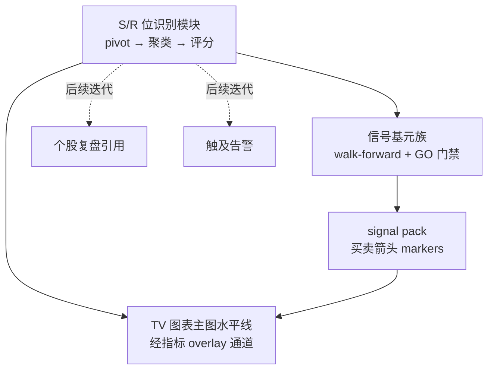

# A股支撑阻力（S/R）指标 - Plan

## Goal Capsule

- **目标**：为 KSS 新增 A 股适配的支撑/阻力（S/R）能力——位识别独立成可复用计算，薄信号族进指标实验室走 walk-forward + GO 门禁，S/R 位以主图水平线上 TV 图表。
- **产品权威**：用户本人（唯一使用者，最终裁决 = GO 门禁回测数据）。
- **开放阻塞**：无。参考仓库源码未拉取属显式假设（见 Dependencies / Assumptions），不阻塞实施。
- **执行画像**：六个实施单元按依赖序推进（U1→U2→U3、U1→U4→U5、U1→U6）；Python 侧 pytest 先行，Swift/JS 侧以构建 + 真机冒烟收口。
- **停止条件**：任一单元的测试场景无法在不改 Product Contract 的前提下满足时停下上报，不得静默改需求。

---

## Product Contract

### Summary

新增一个 S/R 位识别模块（pivot 检测 → 容差聚类 → 强弱评分，多周期汇聚作为可选参数），作为独立可复用计算；其上封装一个新的指标基元族进入指标实验室（registry + walk-forward 重估 + 五维 GO 门禁），产出买卖信号 pack；同时 S/R 位经通用指标 overlay 通道渲染为 K 线主图水平线——画位能力不依赖信号是否通过门禁。

### Problem Frame

灵感来源是 GitHub 仓库 SPX-Price-Action-Compass 的 `futu_sr_indicator.py`（面向 SPX/富途平台）。用户被「S/R 罗盘」概念吸引但未实际使用过该指标，因此真实需求不是复刻该实现，而是让 KSS 拥有一个经回测门禁验证的 S/R 能力。KSS 图表现有指标（MA/BOLL/MACD 等）全是趋势/摆动类，没有任何水平价位类指标；指标实验室现有三族基元（均线交叉/RSI 阈值/布林·ATR）也不含位置事件类信号。

### Key Decisions

- **取方法论、弃忠实搬运。** 保留 S/R 识别的算法思想（pivot、聚类、评分、多周期汇聚），参数与交易规则按 A 股日线 + T+1 现实重新设计，参数由 walk-forward 重估裁定，不沿用原仓库默认值。
- **位计算是一等公民，信号族是薄封装。** 「OHLCV → 带评分的位列表」独立成可复用能力，信号族只是其消费方之一。理由：用户对该指标无实盘验证，信号被 GO 门禁毙掉是现实可能；解耦后门禁毙信号不损失看盘画位价值。
- **多周期汇聚进参数网格，由回测自证。** 周线位与日线位重合加权（原「罗盘」方法论的疑似精髓）做成族参数开关进 walk-forward 网格，是否有用由数据裁决，不靠感觉预设。
- **入出场规则做成参数变体。** 回踩支撑企稳买入（bounce）与放量突破阻力买入（breakout）均作为规则变体进网格，walk-forward 选优，不预先钦点其一。
- **范围对齐现有实验室：日线 + 自选股池。** 与现有基元族同数据源、同宇宙、同 T+1 执行纪律。



### Requirements

**位识别能力**

- R1. 输入单标的日线 OHLCV，输出当前有效的支撑/阻力位列表；每个位带价格、类型（支撑/阻力）、强弱评分与形成依据（触及次数、近因）。
- R2. 位识别只使用截至当前 bar 的历史数据，满足现有管线的无前瞻约束。
- R3. 多周期汇聚（周线位与日线位重合加权）作为可开关参数，进入 walk-forward 参数网格。

**信号族与回测**

- R4. 新基元族接入指标注册表，复用现有 walk-forward 重估、五维 GO 门禁、日终 cron 与实验室 bridge 命令（backtest / solidify / retire），不改动引擎本身。
- R5. 入出场规则含 bounce 与 breakout 两个变体，作为族参数进网格由 walk-forward 选优。
- R6. 信号 pack 与现有族同 schema，买卖点经既有 markers 通道上图，复盘/纸面交易等既有 pack 消费方自动可用。

**图表渲染**

- R7. S/R 位在 K 线主图渲染为水平价位线，支撑/阻力视觉可区分，强弱评分影响呈现（如线宽/透明度/标签）。
- R8. 画位与信号解耦：族未 GO 或状态异常时，位仍可渲染；仅信号 markers 受 pack 状态控制。
- R9. 位渲染仅日线结构周期（日/周/月/年）生效；分钟日内模式不渲染，与现有指标行为一致。
- R10. 图表指标开关行含 S/R 项，随用随隐，跨主题切换/重采样后状态保持——与现有指标钮同行为。

### Acceptance Examples

- AE1. **Covers R8.** Given 某标的 S/R 族回测 verdict 为 NO-GO，When 用户打开该标的图表，Then 主图仍画出 S/R 水平线，但无该族买卖箭头。
- AE2. **Covers R9.** Given 图表当前显示 S/R 位，When 用户切到 1 分/5 分周期，Then 位线隐藏；切回日线后恢复。
- AE3. **Covers R3, R5.** Given walk-forward 网格含多周期开/关 × bounce/breakout 变体，When 某窗口重估完成，Then 选出的参数组合可在 pack 的 params 与规则描述中看到。

### Success Criteria

- 位路径：位识别模块附带确定性「位命中统计」——回看期内价格进入某位 ±容差后的 N 日反应分布（反弹/跌破占比），作为画位质量的可量化体检，不以肉眼观察为唯一判据。
- 信号路径：维持现状，由五维 GO 门禁裁决。

### Scope Boundaries

Deferred for later（有意推迟，非否定）：

- 分钟线（1m/5m）日内 S/R 位识别与渲染。
- S/R 位触及告警（Telegram 推送等）。
- 个股复盘 markdown 引用 S/R 位（位模块的接口设计应为此留门，但 v1 不接线）。

### Dependencies / Assumptions

- **假设：** 参考仓库 `futu_sr_indicator.py` 源码本次未能拉取（网络工具临时故障）。位识别算法将按业界标准技术自行设计（分形 pivot + ATR 容差聚类 + 触及计分为基线）；源码可读后仅作交叉参考，不构成规划阻塞。
- **依赖：** 日线 OHLCV 本地数据（现有 `cs_data_*.csv` 体系）覆盖自选股池；周线由日线重采样得到，无新数据源。
- **假设（承重）：** 信号在日线收盘评估、T+1 开盘执行，而 S/R 触及发生在盘中——入场点相对位的滑移是结构性的。门禁裁决检验的是「日线粒度下可交易的 S/R 信号」；NO-GO 不等于 S/R 概念本身被证伪。
- **风险（已接受）：** S/R 触及是稀疏事件，单票窗口内交易笔数少，GO 门禁「可交易」维度（≥3 笔、滑点后均笔为正）预计是主要淘汰点；部分标的长期停在 NO-GO/样本不足属正常态。

### Sources / Research

- 参考仓库：https://github.com/kain26/SPX-Price-Action-Compass/blob/main/futu_sr_indicator.py（本次未读到内容，见假设）。
- 图表渲染管线：`Sources/KSSDesktop/Resources/chart.html`（通用指标 overlay 通道 `kssSetIndicatorOverlays`、markers 汇总 `collectMarkers`、日内独立渲染路径）；`Sources/KSSDesktop/Views/ChartWebView.swift`（Swift→JS 注入）。
- 指标实验室：`kss/indicators/registry.py`（注册表，kss.db 真源）、`kss/indicators/primitives.py`（三族基元与参数网格模式）、`kss/indicators/rules.py`（entry/exit 状态机、T+1 执行）、`kss/indicators/gate.py`（五维 GO 门禁，`MIN_TRADES = 3`）、`kss/indicators/pack.py`（pack schema 与 overlay 投影）。
- bridge 接入点：`scripts/kss_app_bridge.py`（`stock_detail` 遍历注册表产出 indicatorSignals/indicatorOverlays；indicator-backtest/solidify/retire 命令）。
- 日终批跑：`scripts/run_indicator_signal_pack.py`（遍历 active primitive 条目，只刷条目 `symbols`，空列表现状为跳过）。
- Walk-forward 引擎：`kss/backtest/indicator_walk_forward.py`（train 252 / retrain 20 / holdout 63；每 retrain 点全网格打分——网格规模直接乘算成本）。
- Swift 解码：`Sources/KSSDesktop/Models/KSSModels.swift`（`IndicatorOverlay` 为 additive Codable 字段，先例：indicatorSignals/indicatorOverlays 不 bump BRIDGE_SCHEMA_VERSION）。

---

## Planning Contract

**Product Contract preservation**：Product Contract 未改动。原 Outstanding Questions 四条（overlay 契约扩展、网格边界、周线重采样位置、强弱视觉编码）全部由下方 KTD 就地解决并从文档移除。

### Key Technical Decisions

- **KTD1 · 位与信号双通道分离。** 位（levels）在 bridge `stock_detail` 内按需计算：浏览任意个股即算即画，不依赖注册表条目、pack 状态或固化记录——直接满足 R8（pack 非 ok 时现有投影清空载荷的约束因此不再影响位）。信号（买卖箭头）走既有 pack 管线。回测宇宙仍按自选股池对齐；位展示不受此限（用户已确认）。
- **KTD2 · 信号族自动注册（用户本轮确认）。** `sr` 条目内置于注册表默认集（同 MI 先例：库/表缺失也保底存在），status=active、params 标 unpinned、`symbols` 留空。日终批跑对 `symbols` 为空的 primitive 条目回退用当前自选股池——首次批跑后信号即上图。实验室 backtest/GO/solidify/retire 保留为调参与质量评估手段，不再是上图前置闸。
- **KTD3 · 参数网格 16 组合封顶。** pivot 窗口 {3,5} × 聚类容差 {0.5,1.0}×ATR × 规则变体 {bounce,breakout} × 多周期 {on,off}。walk-forward 每 retrain 点全网格打分、GO 门禁稳健维全网格重算，16 与现有三族（8/6/9）同量级，夜间批跑成本可控。扩网格属后续调参，不在本计划。
- **KTD4 · 位的 overlay 契约为 additive 字段。** 通用 overlay 对象新增可选 `levels` 数组（价格、类型、强度、触及数），Swift/JS 双端向后兼容解码，不 bump BRIDGE_SCHEMA_VERSION（先例：indicatorOverlays 本身即 additive 加入）。周线重采样在位识别模块内部用 pandas 完成，不复用图表 JS 侧聚合。
- **KTD5 · 视觉编码 v1 定案。** 支撑=跌色/阻力=涨色（随主题 palette），虚线，强度分两档映射线宽 1/2，标签 `S/R + 价格`；单图按强度取前 6 条。日内模式与分钟档不渲染（对齐 R9）。
- **KTD6 · 位算法基线（显式假设下的选型）。** 分形 pivot（左右各 N bar 确认，因果、有确认延迟）→ ATR 容差聚类 → 触及次数 × 近因衰减评分，多周期开启时周线位重合加权。参考仓库源码未读属既记假设；本选型独立成立，源码可读后仅作交叉参考。

### High-Level Technical Design

```mermaid
flowchart TB
  subgraph 位通道（按需、任意个股）
    CSV[cs_data 日线 OHLCV] --> DET[sr_levels.detect_levels<br/>pivot→聚类→评分]
    DET --> OV[sr_levels overlay<br/>levels 字段]
    OV --> CH[chart.html createPriceLine<br/>主图水平线]
  end
  subgraph 信号通道（自选股池、日终）
    REG[registry: sr 条目<br/>自动注册 active] --> WF[walk-forward 重估<br/>16 组合网格]
    WF --> PK[signal pack 落 kss.db]
    PK --> MK[markers 买卖箭头]
    MK --> CH
  end
  DET --> HS[hit_stats 位命中统计<br/>成功判据报告]
```

### Assumptions

- 自选股池读取在 Python 侧已有可复用入口（bridge `_indicator_watchlist_symbols` 同源数据）；U3 若发现仅 bridge 内可用，则在 kss 包内补一个薄读取器，不改存储。

---

## Implementation Units

### U1. S/R 位识别模块

- **Goal:** 独立可复用的位识别：输入日线 OHLCV，输出带强弱评分的支撑/阻力位列表；附位命中统计。
- **Requirements:** R1、R2、R3；Success Criteria 位路径。
- **Dependencies:** 无。
- **Files:** `kss/indicators/sr_levels.py`（新建）、`kss/tests/test_sr_levels.py`（新建）。
- **Approach:** 分形 pivot 因果确认（右侧 N bar 收齐才成立）；ATR 容差聚类合并邻近 pivot 价；评分 = 触及次数 × 近因衰减 + 周线重合加权（多周期参数开启时，周线由日线 pandas resample 得出）；提供 `detect_levels(df, params, asof=None)` 与逐 bar 因果序列化入口（供 U2 特征列消费，保证无前瞻）；`hit_stats(df, params)` 输出触及后 N 日反弹/跌破分布。
- **Patterns to follow:** `kss/indicators/primitives.py` 的特征计算风格；`TechnicalFactors.atr` 复用（`kss/features/technical.py`）。
- **Test scenarios:** 构造三次触及的平台形序列 → 检出位价落在平台价 ±容差内；触及次数多者评分更高；因果性——asof T 的位列表不因追加未来 bar 改变；多周期开关只在周线位重合时改变评分；样本过短/空输入 → 返回空列表不抛异常；hit_stats 对构造的「触及后反弹」序列给出正确占比。
- **Verification:** `pytest kss/tests/test_sr_levels.py` 全绿。

### U2. 基元族 sr_level 接入规则引擎

- **Goal:** 第四基元族：bounce/breakout 规则变体进参数网格，walk-forward/门禁/pack 全链路可跑。
- **Requirements:** R4、R5；AE3。
- **Dependencies:** U1。
- **Files:** `kss/indicators/primitives.py`、`kss/indicators/rules.py`、`kss/indicators/pack.py`（`_PRIMARY_SERIES_COLS`）、`kss/tests/test_indicator_pack.py`（扩展）、`kss/tests/test_sr_family.py`（新建）。
- **Approach:** `build_features` 经 U1 因果入口产出特征列（最近支撑/阻力价与距离、位强度）；bounce 变体=回踩支撑容差带后收回其上入场、跌破支撑或触及阻力离场，breakout 变体=收盘上穿阻力入场、ATR 追踪止损离场，均只用 shift(1)/当期值；`warm_period` 覆盖 pivot 确认延迟 + 聚类窗口；`signal_strength`/`rule_sentence`/`_ACTION_TEMPLATES` 按族补齐；网格按 KTD3 恰 16 组合。
- **Test scenarios:** `param_grid("sr_level")` 恰 16 组；entry/exit 无前瞻（与现有族同式断言）；合成趋势数据 replay 产出至少一笔完整回合；`signal_strength` 值域 [-1,1]；`rule_sentence` 含变体名；`reestimate` 在 400 bar 合成数据上返回 ok 且 best_params 属网格。
- **Verification:** `pytest kss/tests/test_sr_family.py kss/tests/test_indicator_pack.py` 全绿。

### U3. 自动注册与日终批跑接入

- **Goal:** `sr` 条目免固化自动生效：注册表内置保底 + 空 symbols 回退自选股池。
- **Requirements:** R4、R6；KTD2。
- **Dependencies:** U2。
- **Files:** `kss/indicators/registry.py`、`scripts/run_indicator_signal_pack.py`、`kss/tests/test_indicator_registry.py`（有则扩展，无则新建）。
- **Approach:** 仿 `MI_ENTRY` 先例增加内置 `SR_ENTRY`（kind=primitive、family=sr_level、默认参数、status=active、`symbols=[]`），`load_registry` 缺失即插入；批跑脚本对 `symbols` 为空的 primitive 条目回退解析当前自选股池（复用/下沉 bridge 的自选股读取逻辑，见 Assumptions），行为变化写进脚本 docstring。
- **Test scenarios:** 空库 `load_registry` 同时含 mi 与 sr 且不重复；已有 sr 行不被内置项覆盖；批跑符号解析——条目 symbols 非空用条目值、为空回退自选股池、自选股池也空则跳过并打印原因；solidify 更新 sr 条目后 symbols 以固化值优先。
- **Verification:** `pytest kss/tests/test_indicator_registry.py` 全绿；`--asof` 干跑脚本对样例自选股产出 pack。

### U4. Bridge 位按需投影

- **Goal:** `stock_detail` 对任意浏览标的即时计算位并以 `sr_levels` overlay（含 `levels` 字段）附加进 detail 载荷。
- **Requirements:** R7（数据侧）、R8；AE1。
- **Dependencies:** U1。
- **Files:** `scripts/kss_app_bridge.py`（`_indicator_detail_projections` 或近旁）、`kss/indicators/sr_levels.py`（`to_levels_overlay` 投影助手）、对应 Python 测试（投影助手单测入 `kss/tests/test_sr_levels.py`）。
- **Approach:** 复用 detail 已加载的日线数据调 `detect_levels`；产出 `{indicatorId:"sr_levels", status, levels:[{price,kind,strength,touches}], markers:[], series:[]}`；status 仅反映位计算本身（数据不足=skipped+reason），与 sr 信号 pack 状态完全无关（AE1）；异常降级不崩 detail（对齐既有惰性 import 风格）。
- **Test scenarios:** 覆盖 AE1——sr pack 缺失/NO-GO 时投影仍产出 levels；数据不足 → status=skipped 且 reason 非空；levels 数值四舍五入、按强度降序。
- **Verification:** `pytest kss/tests/test_sr_levels.py` 全绿；bridge 手动调 `stock_detail` 样例含 sr_levels 项。

### U5. Swift 解码与图表渲染

- **Goal:** 位在 K 线主图渲染为水平价位线，SR 开关钮、周期门控、主题重建全对齐既有指标行为。
- **Requirements:** R7、R9、R10；AE1、AE2。
- **Dependencies:** U4。
- **Files:** `Sources/KSSDesktop/Models/KSSModels.swift`（`IndicatorOverlay.levels` + `SRLevel` 结构）、`Sources/KSSDesktop/Resources/chart.html`、`Tests/KSSDesktopTests/`（解码单测，有基建则加）。
- **Approach:** Swift 侧 additive Codable 字段透传（`encodeIndicatorOverlays` 现有 JSON 编码自动携带）；chart.html 在 `applyIndicatorOverlays` 内对含 `levels` 的 overlay 走 `candleSeries.createPriceLine` 渲染（KTD5 编码：色随涨跌 palette、虚线、强度两档线宽、`S/R+价` 标签、强度前 6 条），price line 句柄集中登记，TF 切换/日内模式/主题重建时先清后画（复用 `lastIndicatorOverlays` 重绑时机）；`#ind` 行加 `SR` 钮接 `indState`。
- **Test scenarios:** Swift 解码含 levels 的 overlay JSON 字段齐全；缺 levels 字段的旧载荷解码不失败（向后兼容）。
- **Execution note:** chart.html 无 JS 测试基建——按冒烟清单真机验证：日线可见、切 1m/5m 隐藏、切回恢复（AE2）、SR 钮开关、主题切换后位线保持、NO-GO 标的仍画位（AE1）。
- **Verification:** `swift build` 通过；解码单测绿（XCTest 可用时）；冒烟清单逐项通过。

### U6. 位命中统计报告

- **Goal:** 成功判据落地：自选股池批量位命中统计报告，画位质量可量化体检。
- **Requirements:** Success Criteria 位路径。
- **Dependencies:** U1、U3（自选股池解析复用）。
- **Files:** `scripts/report_sr_hit_stats.py`（新建）、`kss/tests/test_sr_levels.py`（hit_stats 场景已含，报告组装单测入此或新文件）。
- **Approach:** 遍历自选股池调 `hit_stats`，汇总为 markdown + csv 落 `storage/reports/indicator_lab/sr_hit_stats_{date}.{md,csv}`（对齐 bj50_scan 报告落盘风格）；单票失败不拖垮整池。
- **Test scenarios:** 两只合成标的 → 报告含两行且比率正确；单票抛异常 → 报告仍生成并记录失败；输出路径含日期。
- **Verification:** `pytest` 相关用例全绿；脚本对真实自选股干跑产出报告文件。

---

## Verification Contract

| 关卡 | 命令 / 动作 | 适用单元 | 通过信号 |
|------|------------|----------|----------|
| Python 单测 | `.venv/bin/python -m pytest kss/tests -q` | U1–U4、U6 | 全绿，无跳过掩盖 |
| Swift 构建 | `swift build` | U5 | 编译零错误 |
| Swift 单测 | `swift test`（需完整 Xcode；CLT 环境降级为仅 build） | U5 | 解码用例绿 |
| 批跑干跑 | `.venv/bin/python scripts/run_indicator_signal_pack.py --asof <近期交易日>` | U3 | sr 条目对自选股产出 pack，无异常 |
| 冒烟清单 | dev 模式起 app，按 U5 Execution note 清单逐项核 | U5 | 六项全过 |

---

## Definition of Done

- U1–U6 全部落地，Verification Contract 五关全过。
- AE1–AE3 逐条可演示：NO-GO 标的画位无箭头；分钟档隐藏位线、日线恢复；选参可在 pack params 与规则描述中读到。
- 位命中统计报告对当前自选股池成功产出一份真实文件。
- 试验性/死代码清理干净，不留放弃方案的残骸。
- 图表 SR 钮、周期门控、主题切换行为与既有指标钮无差异。
