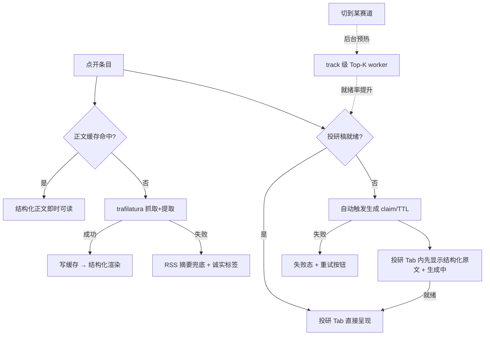

# Intel Radar Reader Experience - Plan

## Goal Capsule

- **Objective:** 重构资讯雷达阅读链路：投研改写保持默认并把就绪率做到「点开即读」；长尾条目点开自动生成、等待期先读排好版的原文；原文从压平纯文本升级为正文提取 + 结构化排版；中文改写独立 Tab 下线，并入原文 Tab 作按需「译成中文」开关。
- **Product authority:** 下方 Product Contract；基线 = 现有资讯雷达（12 赛道 RSS + yupi 热议混排 + 投研稿池），不替换。
- **Open blockers:** 无。
- **Product Contract preservation:** Product Contract unchanged（planning 仅补充 HOW）。
- **Stop conditions:** trafilatura 在真实源上提取质量不达标（U1 验证步不通过）时停下回报，不静默降级换库。

---

## Product Contract

### Summary

资讯雷达详情页收敛为「投研改写 / 原文」两个 Tab。投研改写靠预生成覆盖头部条目实现秒开，长尾点开自动生成并以结构化原文兜底等待期。原文抓取改为正文提取（去噪声、保段落/小标题/列表），外文文章在原文 Tab 内按需生成忠实译文。

### Problem Frame

点击列表条目后默认进入投研改写 Tab，但预生成每赛道每天只覆盖 8 条，其余条目要手动点按钮并等 LLM 现场生成。切到中文改写是另一次排队，切到原文则是整页 HTML 压成的一块无段落纯文本——抓取时所有换行被压成空格（`kss/news/article_fetch.py` 的 HTML strip），导航、注释、正文糊在一起。三个 Tab 没有一个能立刻读，阅读器实际不可用。

### Key Decisions

- **KD1. 投研改写仍是默认 Tab。** 解决路径是把预生成覆盖率提上去，不是换默认视图。
- **KD2. 长尾条目点开自动触发生成，原文兜底等待期。** 取消手动生成按钮的必经路径；用户永远不面对空等待页。
- **KD3. 原文升级为正文提取 + 结构化排版。** 接受引入 readability 类提取能力（依赖或自写启发式），打破现有「stdlib-first 不引重依赖」的抓取取向，换 qmreader 级阅读体验。
- **KD4. 中文改写独立稿种下线入口，语义改为「译文」。** 原文 Tab 内按需「译成中文」；译文是保留段落结构的忠实翻译，不是 qmreader 风格的流畅改写稿。
- **KD5. 旧条目按需重抓。** 已入库正文是压平存储的，点开时按需重抓重提取，不做全量回填。

### Requirements

**预生成与就绪率**

- R1. 赛道列表头部条目点开时，投研改写默认已就绪（秒开）。预生成机制（提高 Top-K、加密调度、打开赛道时预热）由 planning 选型，验收看就绪命中率。
- R2. 预生成与自动生成仍受每日 LLM 调用预算约束，不得无界扩张。

**长尾自动生成与兜底**

- R3. 点开无就绪投研稿的条目时自动触发生成，无需手动按钮；沿用既有 claim/TTL 防重入协议。
- R4. 生成期间投研 Tab 内直接展示结构化原文（无全文时用摘要），带生成中状态；就绪后提示切换或自动填充。
- R5. 生成失败呈现可读失败态与重试入口，不得停留在无限生成中。

**原文阅读**

- R6. 全文抓取保留结构：段落、小标题、列表分块存储与渲染，不再压平成单块文本。
- R7. 正文提取剔除导航、评论、相关链接等页面噪声。
- R8. 模式标签保持诚实（全文/摘要/不可用）；抓取失败回退 RSS 摘要并注明。
- R9. 旧条目（压平存储）点开时按需重抓重提取；重抓失败则维持现有文本展示。

**译文（并入原文 Tab）**

- R10. 中文改写独立 Tab 下线，阅读 Tab 收敛为「投研改写 / 原文」两个。
- R11. 原文 Tab 对外文文章提供「译成中文」按需生成；译文保留原文段落结构，可在原文/译文间切换；中文文章不出现该入口。
- R12. 既有 chinese 稿种的后端数据与表结构保留，不迁移不删除。

### Actors

- A1. 研究员（桌面端主用户）
- A2. 改写后台管线（Top-K worker + 按需生成 + 译文生成）

### Key Flows

- F1. 点开头部条目 — 投研稿已就绪，直接呈现（R1）
- F2. 点开长尾条目 — 自动触发生成 → 当屏展示结构化原文 + 生成中提示 → 就绪后切换（R3–R5）
- F3. 读原文 — 结构化排版渲染；旧条目按需重抓（R6–R9）
- F4. 译成中文 — 原文 Tab 内按需翻译，原/译切换（R11）

### Acceptance Examples

- AE1. **Covers R3, R4.** Given 条目无投研稿，When 点开，Then 自动开始生成，当前屏显示结构化原文与生成中提示，无需按任何按钮。
- AE2. **Covers R8.** Given 全文抓取失败，When 查看原文，Then 显示 RSS 摘要与「全文抓取失败」说明，模式标签为摘要。
- AE3. **Covers R9.** Given 旧条目正文为压平存储，When 点开原文，Then 按需重抓并结构化渲染；重抓失败保持旧文本。
- AE4. **Covers R11.** Given 中文文章，When 查看原文 Tab，Then 不出现「译成中文」入口。

### Scope Boundaries

- 今日要点 / 全景等 digest 管线不动，继续消费投研稿池。
- 不做已入库正文的全量重抓回填。
- 不做付费墙 / 强 JS 渲染站点的 headless 抓取增强。
- 中文改写稿种只下线入口，不删数据不做迁移。

### Dependencies / Assumptions

- yupi 热议条目常无可抓全文，R8 的诚实兜底链对其同样适用；其投研稿基于标题 + 摘要薄内容生成，维持现状。
- 自动生成的调用量由用户点击行为天然限流，叠加 R2 预算约束即可，不设新配额机制。

### Sources / Research

- 压平根因：`kss/news/article_fetch.py:26-41`（`stripped_strings` + `\s+` 归一把换行全部压成空格）。
- 预生成现状：`kss/news/rewrite_config.py`（`TOP_K=8`、`WORKER_MAX_LLM_CALLS=96`）、`kss/news/rewrite_worker.py`（Top-K worker 仅投研稿种，全赛道无 track 过滤）。
- 稿池与防重入：`kss/storage/rewrite_pool.py`（`claim_generating` 原子 claim + `GENERATING_TTL_SEC=900`；kind = investment / chinese）。
- 点开链路现状：`Sources/KSSDesktop/Services/KSSStore.swift:591-646`（`selectIntelItem` 并行发起正文抓取 + 中文改写 + 投研改写，force:false 意味着**点开即自动生成两路 LLM**，同步等待）；`Sources/KSSDesktop/Services/BridgeClient.swift:283-320`（intelArticle / intelRewrite / intelRewriteRun 封装）。
- UI 现状：`Sources/KSSDesktop/Views/IntelView.swift:541`（默认投研 Tab）、`:598-634`（原文单块 `Text` 渲染 + 摘要兜底）、`:795-874`（结构化阅读块 `parseReadingBlocks`：## 标题 / 列表 / 段落解析，中文与投研改写共用）。
- 正文无持久缓存：bridge `_intel_article`（`scripts/kss_app_bridge.py:2402-2419`）每次点开现场 `fetch_article`（14s 超时），仅 Swift 内存 `intelArticleByID` 会话内缓存。
- cron：`kss/config/cron_jobs.yaml:188-203`（intel_radar 盘前 8:45 / 盘后 17:40，wrapper `scripts/run_intel_radar.sh` 内含 Top-K worker）；App 刷新后亦 kick worker（`KSSStore.kickIntelRewriteWorker`）。
- 依赖闭包：`pyproject.toml`（57 包全量 `==` 锁定，bs4/lxml/html5lib 已在；uv 首启 bootstrap 与跨机 sync 的真相源）。
- 上游 plan：`docs/plans/2026-07-21-001-feat-intel-radar-yupi-chinese-hot-plan.md`（yupi 混排条目是本链路的输入之一）。

---

## Planning Contract

### Key Technical Decisions

- **KTD1. 正文提取用 trafilatura，输出 markdown-lite，失败回退现有 strip 链。** trafilatura 支持 `output_format="markdown"`，直接产出 `##` 小标题 / `-` 列表 / 空行分段的结构化文本，与 Swift 侧既有 `parseReadingBlocks` 渲染器（`IntelView.swift:795`）零成本对接。提取失败或产出过短（低于现有 `_MIN_USEFUL_CHARS` 门槛）时回退现网 `_strip_html` 平文本，mode 标签保持诚实。版本进 `pyproject.toml` 锁定闭包（`==` pin，实现时取当时最新稳定版）。**外部核实缺口：** 规划期 web 搜索不可用，trafilatura 能力按训练知识定案，U1 第一步先拉真实源验证（见 U1 execution note）。
- **KTD2. 新增 kss.db 正文缓存表 `intel_article_items`，读穿缓存。** 现状每次点开现场抓 URL 是原文慢的另一半原因。表存结构化正文 + `extractor` 标记；bridge `intel-article` 先读缓存，命中即返回。旧条目（缓存无记录，或 rewrite payload 里只有压平 `body_text`）按需重抓重提取（R9），失败回退旧文本。文章内容静态，缓存不设 TTL。
- **KTD3. 预生成 = 保持全局 Top-K 与 cron 两窗不变，新增「打开赛道预热」。** 不提高全局 K（12 赛道 × K 的日常 LLM 成本翻倍不划算）。`run_top_k_rewrites` 增加 `track_key` 过滤；Swift 在用户切到某赛道时后台 kick 该赛道的 worker（会话内每赛道节流一次）。用户正在看的赛道头部条目在浏览列表的几十秒内变为就绪，命中「点开即读」。预算沿用 `WORKER_MAX_LLM_CALLS`。
- **KTD4. 译文为新稿种 `kind=translation`，复用 rewrite pool 协议。** 不复用 chinese 稿种（语义不同：忠实翻译 vs 流畅改写）。新增 translation prompt：保留原文 markdown 结构逐段翻译，不增删信息。chinese 数据与 `VALID_KINDS` 中的注册保留（R12），仅 UI 入口移除。
- **KTD5. 点开链路只保留投研一路自动生成。** `selectIntelItem` 现在并行自动发起中文+投研两路 LLM；改为只发投研（+ 读正文缓存）。中文那路移除是净节流。译文只在用户点按钮时发起。
- **KTD6. 语言判定用 CJK 字符占比启发式。** 正文 CJK 占比低于阈值（如 30%）判为外文，原文 Tab 显示「译成中文」入口；不引语言检测库。

### High-Level Technical Design

点开条目后的读取与生成链路（改造后）：

稿种与生成入口（改造后）：investment（cron 两窗 + 赛道预热 + 点开自动），translation（仅原文 Tab 按钮），chinese（数据保留，无入口）。

### Assumptions

- trafilatura 对主流科技媒体 / 官方博客 / 中文资讯站的提取质量足够（U1 真实源验证兜底；不达标即停，见 Stop conditions）。
- 新依赖落地按既有链路：`pyproject.toml` 加 pin → `uv sync` 重建 venv → sidecar 全杀重启（SIGTERM，避免 SIGHUP 留旧解释器/旧 env 的已知坑）。
- Swift 单测需完整 Xcode（CLT 无 XCTest），故 Swift 侧验证以 `swift build` 编译 + 真机走查为准。

### Sequencing

U1 → U2 → U3 / U4（并行）→ U5 → U6。python 层先行，Swift 层最后两个单元收口。

---

## Implementation Units

### U1. trafilatura 结构化正文提取

- **Goal:** `article_fetch` 产出保留段落/小标题/列表的 markdown-lite 正文，去导航噪声。
- **Requirements:** R6, R7, R8
- **Dependencies:** 无
- **Files:** `pyproject.toml`、`kss/news/article_fetch.py`、`kss/tests/test_article_fetch.py`（若无则新建）
- **Approach:** 新增 `extract_structured(html)`：trafilatura `extract(output_format="markdown", include_links=False)` 为主；产出空/过短（沿用 `_MIN_USEFUL_CHARS` 思路设结构化门槛）回退 `_strip_html`。`fetch_article` 返回体增加 `body_md` 与 `extractor` 字段，保留 `body`/`mode` 兼容旧调用方；`mode` 语义不变（fulltext/summary/unavailable）。截断上限沿用 `_MAX_BODY_CHARS`。
- **Execution note:** 第一步先写一个拉 3-5 个真实 RSS 条目 URL 的验证脚本/测试（覆盖英文科技媒体 + 中文资讯站），肉眼核对提取质量与 markdown 结构，再接入主路径——先验数据源再写代码。
- **Test scenarios:**
  - 给定含 `<h2>`/`
`/`<ul>` 的文章 HTML，提取结果含 `##` 小标题、空行分段、`-` 列表（离线 fixture，不打网络）。
  - 给定含导航/页脚噪声的整页 HTML，提取结果不含导航文本。
  - trafilatura 返回空或过短 → 回退 `_strip_html` 平文本，`extractor` 标记为 fallback，mode 仍诚实。
  - Covers AE2. 抓取网络失败 → 返回 error + mode=summary 兜底路径不变。
  - 非 http(s) URL / 空 URL 拒绝路径回归（现有校验不破坏）。
- **Verification:** 目标测试文件全绿；验证脚本对真实源的提取产出人工确认后记入 PR 描述。

### U2. 正文缓存表与 bridge 读穿

- **Goal:** 点开条目先读 kss.db 缓存，未命中才抓取并落库；旧压平条目自动走重抓。
- **Requirements:** R9, R6（存储侧）
- **Dependencies:** U1
- **Files:** `kss/storage/article_cache.py`（新建）、`kss/storage/db.py`（ensure_schema 增表）、`scripts/kss_app_bridge.py`（`_intel_article`）、`kss/tests/test_article_cache.py`（新建）
- **Approach:** 表 `intel_article_items(item_key TEXT PRIMARY KEY, url, title, mode, body_md, char_count, extractor, fetched_at)`，`item_key` 复用 `rewrite_pool.item_id_for` 的 url-hash 规则。`_intel_article` 改为：缓存命中且 `extractor` 非空 → 直接返回；未命中或旧格式 → U1 抓取提取 → 写缓存 → 返回。抓取失败且缓存有旧记录 → 返回旧记录（R9 兜底）。`intel-article` 由此产生写副作用，须登记进 `WRITE_COMMANDS`（`scripts/kss_app_bridge.py:4804`，MCP paper-only 写闸的分类依据，有漂移守卫测试）。
- **Test scenarios:**
  - 首次请求：抓取成功 → 落库 → 返回结构化 body；第二次请求同 URL 不再触发抓取（可用 monkeypatch 计数）。
  - Covers AE3. 缓存记录无 `extractor` 标记（模拟旧压平数据）→ 触发重抓；重抓失败 → 返回旧记录不报错。
  - 缓存未命中且抓取失败 → 返回摘要兜底结构，不落污染记录。
- **Verification:** 目标测试全绿；`sqlite3` 手查表结构与一条真实落库记录。

### U3. 译文稿种 kind=translation

- **Goal:** rewrite 管线支持忠实译文稿种，供原文 Tab 按需调用。
- **Requirements:** R11, R12
- **Dependencies:** U1（译文输入用结构化正文）
- **Files:** `kss/storage/rewrite_pool.py`（`VALID_KINDS`）、`kss/news/rewrite.py`（translation prompt + 分支）、`kss/tests/test_intel_rewrite.py`、`kss/tests/test_rewrite_pool.py`
- **Approach:** `VALID_KINDS` 增 `translation`；新增 `_TRANSLATION_SYSTEM`：按原文 markdown 结构逐段忠实翻译，保留 `##`/列表/段落与全部数据，不增删不演绎；输入优先 `body_md`。`run_rewrite(kind="translation")` 复用 claim/TTL/失败落库全套协议。chinese 稿种代码与数据不动（R12）。
- **Test scenarios:**
  - kind=translation 正常生成 → status=ready、text 保留 `##` 结构（mock LLM）。
  - 二次请求命中缓存 from_cache=True，不再调 LLM。
  - kind 归一化：非法 kind 仍回落 investment；translation 不被误归一。
  - `list_drafts` 默认 kind=investment 不包含 translation（digest 池不受污染）。
- **Verification:** `pytest kss/tests/test_intel_rewrite.py` 全绿。

### U4. 赛道级预热 worker

- **Goal:** worker 支持按单赛道跑 Top-K，供打开赛道时后台预热。
- **Requirements:** R1, R2
- **Dependencies:** 无（与 U3 并行）
- **Files:** `kss/news/rewrite_worker.py`、`scripts/kss_app_bridge.py`（`_intel_rewrite_run` 接受 `track_key`）、`kss/tests/test_rewrite_worker.py`
- **Approach:** `run_top_k_rewrites(track_key=None)`：给定时只处理该赛道。预算护栏不变（`WORKER_MAX_LLM_CALLS`、`WORKER_WALL_SEC`、每赛道每日 K 条 ready 上限），已就绪条目跳过成本为零。cron 全量路径不变。
- **Test scenarios:**
  - track_key 过滤：只生成该赛道条目（mock LLM 计数）。
  - 该赛道当日已有 K 条 ready → 直接返回不调 LLM（R2）。
  - track_key 不存在 → 空跑返回 summary，不抛异常。
- **Verification:** worker 相关测试全绿；`KSS_APP_BRIDGE intel-rewrite-run '{"track_key":"tech"}'` 手跑返回 per-track summary。

### U5. Swift 点开链路与预热接线

- **Goal:** 点开只自动生成投研一路；正文走缓存；切赛道触发后台预热。
- **Requirements:** R1, R3, R5
- **Dependencies:** U2, U4
- **Files:** `Sources/KSSDesktop/Services/KSSStore.swift`、`Sources/KSSDesktop/Services/BridgeClient.swift`
- **Approach:** `selectIntelItem` 移除 `chineseTask`，保留 article + investment 并行；同函数内正文兜底链 `chinese?.bodyText ?? invest?.bodyText`（`KSSStore.swift:634-643`）去掉 chinese 引用，只留 invest。`BridgeClient.intelRewriteRun` 增 `trackKey` 参数；`KSSStore` 新增赛道切换钩子（IntelView `activeTrack` 变化时调用），会话内每赛道最多预热一次（`Set<String>` 节流），fire-and-forget 不阻塞 UI。既有失败态/重试逻辑保留（R5）。
- **Test scenarios:** Test expectation: none — Swift 单测需完整 Xcode 环境，本单元以 `swift build` 编译 + U6 后真机走查覆盖（预热触发可从 bridge 日志观测）。
- **Verification:** `swift build` 通过；真机切赛道后 bridge 日志出现 track 级 rewrite-run 记录。

### U6. Swift 阅读 UI：两 Tab + 兜底 + 译文开关

- **Goal:** Tab 收敛为「投研改写 / 原文」；投研生成中先读原文；原文结构化渲染 + 外文译文开关。
- **Requirements:** R4, R5, R8, R10, R11
- **Dependencies:** U3, U5
- **Files:** `Sources/KSSDesktop/Views/IntelView.swift`、`Sources/KSSDesktop/Models/KSSModels.swift`（`IntelReaderTab` 枚举）
- **Approach:** 枚举删 chinese case（`KSSModels.swift:319-338`），并清理 `IntelView.swift:1233` 处 `zhReady` 的 chinese 稿种徽章逻辑（改为仅投研或移除）；`originalBodyPanel` 改用既有 `parseReadingBlocks` 渲染 `body_md`（无 `body_md` 的旧数据仍走单块 `Text`）；投研 `rewritePanel` 的 generating 分支内嵌结构化原文（复用同一渲染），顶部保留生成中提示，就绪后自动切换为投研稿（状态驱动，无需手动）；原文 panel 对 CJK 占比 < 30% 的正文显示「译成中文」按钮 → `requestIntelRewrite(kind: "translation")` → 就绪后原/译分段切换（segmented 或 toggle）；失败态沿用既有重试 UI。
- **Test scenarios:** Test expectation: none — UI 单元，验证走编译 + 真机走查清单（见 Definition of Done 的走查项；Covers AE1, AE2, AE3, AE4）。
- **Verification:** `swift build` 通过；真机按 DoD 走查清单逐项核对。

---

## Verification Contract

| 门槛 | 命令 | 适用单元 |
|---|---|---|
| Python 定向测试 | `pytest kss/tests/test_article_fetch.py kss/tests/test_article_cache.py kss/tests/test_intel_rewrite.py kss/tests/test_rewrite_pool.py kss/tests/test_rewrite_worker.py -q` | U1–U4 |
| Python 全量回归 | `pytest kss/tests -q` | 合并前一次 |
| Swift 编译 | `swift build` | U5, U6 |
| 真实源提取验证 | U1 验证脚本对 3-5 个真实 URL 的产出人工确认 | U1 |
| 真机走查 | dev 启动（`--build-system native`）按 DoD 清单逐项 | U5, U6 |

依赖变更部署链：`pyproject.toml` 加 pin → `uv sync` 重建 venv → sidecar SIGTERM 全杀重启（不用 SIGHUP，避免旧解释器/旧 env 残留）→ cron wrapper 无需改（自动用同一 venv）。

---

## Definition of Done

- U1–U6 全部完成，Verification Contract 各门槛通过。
- 真机走查清单：
  - 打开某赛道浏览片刻后点开头部条目 → 投研稿即时呈现（R1）。
  - 点开长尾条目 → 无需按钮自动生成，当屏可读结构化原文 + 生成中提示，就绪自动切换（AE1）。
  - 原文 Tab：段落/小标题/列表分明，无导航噪声（R6/R7）。
  - 抓取失败条目 → 摘要 + 诚实标签（AE2）；旧条目点开被重抓（AE3）。
  - 英文文章原文 Tab 有「译成中文」，中文文章没有（AE4）；译文保留结构、可切换。
  - 点开条目 bridge 日志只出现一路 investment 自动生成，无 chinese 自动调用。
- 今日要点 / 全景 digest 行为回归无变化（消费 investment 池路径未动）。
- 废弃试验代码清理：未采用的提取/渲染尝试不留在 diff 中。
