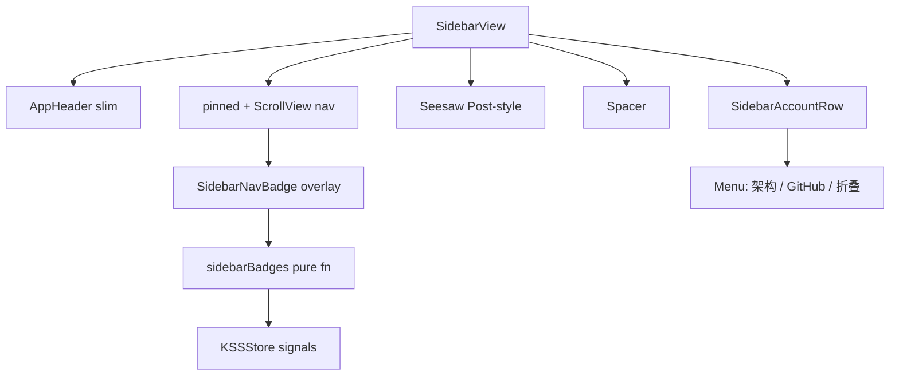
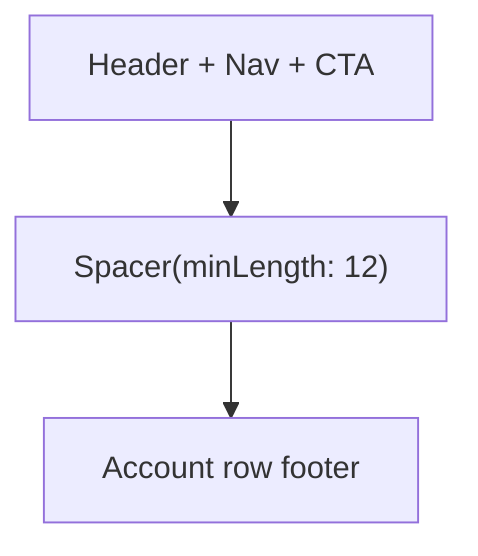

# KSSDeck 边栏 x.com Paper 精修 - Plan

## Goal Capsule

- **Objective:** 按 Paper 导出的 x.com 侧栏样式，在 xcom 模式下完成导航选中色、字阶、Seesaw/Post、底栏账户行、顶栏减负、badge、间距与 hit 区等 10 项精修，使侧栏观感与参考稿对齐。
- **Product authority:** 用户本人（KSSDeck 唯一使用者与决策者）。
- **Open blockers:** 无——范围与 4 个产品向默认已在本会话 scoping 确认。
- **Execution profile:** UI 视觉精修；以 xcom×light/dark 运行时截图对照 + `swift build` 为主；纯逻辑抽测写单元测试。
- **Stop when:** Definition of Done 全部满足，经典 8 套选中/hover 语义无回归。

---

## Product Contract

### Summary

对照 Paper（2026-07-23）导出的 x.com 侧栏，在 **xcom 模式**下做一轮全量精修：导航 ink 色体系、字阶/间距升档、Seesaw 对标 Post、底栏账户级一行、顶栏减负、角标、hover/折叠 hit 区与图标线重统一。经典 8 套的选中色块语义与字号不改；不换三栏 shell；不引入完整自定义 icon 套。

### Problem Frame

2026-07-11 xcom 设计与 2026-07-12 边栏 hover/行高/272 宽已上线，但与真实 x.com 桌面侧栏仍有可见差距：选中图标用品牌蓝、未选中图标偏灰、标签 16pt 偏小、Seesaw 蓝胶囊偏矮、底栏是两个小图标、顶栏 wordmark+折叠钮信息过密、无角标。用户提供了 Paper 导出组件作为像素级参照，需要按 10 项清单收敛。

### Key Decisions

- KD1 — 只改 xcom 视觉分支；经典 8 套 nav 选中仍为 accent 色块 + onAccent 字。
- KD2 — 选中/未选中导航图标与文字在 xcom 下统一 ink（`textPrimary`），选中靠 fill + heavy，不用 accent 蓝。
- KD3 — Seesaw 展开态对标 Paper Post：黑底白字、≥52 高、约 90% 宽、纯文字「Seesaw」；折叠态仍为 accent 圆钮（或 ink 圆钮二选一见 KTD）。
- KD4 — 底栏改为账户级一行（kmark + 标题 + ⋯ 菜单承载架构/GitHub/折叠等），替代并列小圆钮。
- KD5 — 导航标签 18pt（非 20），在贴近参考与 8 项滚动密度间折中。
- KD6 — badge 先做视觉 + 可注入数据源；优先接已有 store 真信号，无信号时不造假数字。

### Requirements

**选中与色（P0-1）**
- R1. xcom 展开/折叠导航：选中与未选中图标均使用 `theme.textPrimary`；选中叠加 `.symbolVariant(.fill)` + heavy 字重；未选中 outline + regular。
- R2. xcom 导航标签：选中 bold/`textPrimary`，未选中 regular/`textPrimary`（或与 body 同 ink）；不再用 `textSecondary` 灰图标。
- R3. 经典 8 套 navRow/collapsedRow 选中色块与字色逻辑保持现状。

**字阶与间距（P0-2）**
- R4. xcom 展开态：标签 **18pt**、图标字号约 **20–22**、图标框约 **26**、icon–text spacing **20**、行间距约 **4–6**；垂直 padding 保持可点热区 ≥ x.com 感。
- R5. xcom 折叠态：图标字号与圆形 hit 同步放大到约 **50×50** 热区（见 R15）。

**Seesaw / Post（P0-3）**
- R6. xcom 展开态 Seesaw：底色 ink `#0F1419` 系（`theme.textPrimary` 在 light 为 ink）、白字、字号 17 bold、`minHeight` ≥ 52、宽度约侧栏内容区 90% 居中、无图标。
- R7. 折叠态 Seesaw 保持圆形主按钮，尺寸与折叠导航 hit 协调；主色可与展开态一致（ink）或保留 accent——见 KTD3。
- R8. 经典主题 Seesaw 继续 accent + onAccent，高度可对齐但颜色不跟 xcom 黑底。

**布局节奏（P2-8）**
- R9. 侧栏纵向接近 `justify-between`：上区（header + nav + CTA）与底栏分离；去掉魔法数 `.padding(.bottom, 52)`，用 Spacer + 稳定间距替代。
- R10. CTA 相对 nav 上边距约 12–16；底栏与 CTA 间距自然、不「上紧下松」。

**底栏账户行（P1-4）**
- R11. xcom 展开态底栏：左侧 40 级圆形 kmark、主标题（如 KSS / 本地身份）、可选副标题（muted）、右侧 ⋯；整行 `p≈12` + hover 胶囊。
- R12. ⋯ 菜单至少含：架构、GitHub（外链）、折叠/展开边栏；可扩展设置入口但不强制迁回侧栏主导航。
- R13. 折叠态底栏：圆形头像热区 + ⋯ 或菜单可达，架构/GitHub 不丢。

**顶栏减负（P1-5）**
- R14. xcom 展开态顶栏以 logo（kmark，热区约 50 圆、图 ~28–30）为主；wordmark 去掉或显著弱化；折叠控件迁入底栏 ⋯ 或仅 hover 顶栏时显示，避免常驻工具条感。

**折叠 hit（P2-9）**
- R15. xcom 折叠导航圆形 hit 统一约 **50**，与 Seesaw 折叠圆钮一致，64 栏宽内不裁切。

**hover polish（P2-7）**
- R16. xcom hover 中性灰保持 ink 叠加；light ≈0.06–0.08、dark ≈0.10；选中项悬停仍显示 hover 底；pressed 可略加深（可选）。

**图标线重（P2-10）**
- R17. xcom 下统一依赖 SF Symbol 字重轴（regular/heavy）+ fill 变体；不新增自定义 path 图标包。无 fill 变体的符号靠 fontWeight 兜底（既有注释继续有效）。

**Badge（P1-6）**
- R18. 导航图标支持角标：小圆点（dot）与数字胶囊（count，accent 底、白字 ~11、白描边）。
- R19. 角标数据来自可测的 badge 映射（store 计算或纯函数）；无真信号时该 section 不显示假数字。至少接通 1 个真实信号（优先：`selfCheck` 失败数映射到合适入口，或推荐/资讯可用计数）。

### Acceptance Examples

- AE1. xcom 选中「今日看盘」：图标 fill + heavy、**非蓝**，标签 bold ink；未选中「推荐」图标同为 ink outline。**Covers R1, R2.**
- AE2. xcom 展开 Seesaw：黑底白字、高度 ≥52、无左侧图标、宽度明显小于通栏满宽。**Covers R6.**
- AE3. xcom 底栏一行：头像 + 标题 + ⋯；⋯ 可选架构并切到 Architecture 页；GitHub 仍外链。**Covers R11, R12.**
- AE4. 某 section 有 badge 映射 count=2：图标右上数字胶囊「2」；映射清空后角标消失。**Covers R18, R19.**
- AE5. 切到任一经典主题：nav 选中仍为 accent 色块；Seesaw 仍为 accent 胶囊（非强制黑底）。**Covers R3, R8.**

### Scope Boundaries

- 不改 x.com 三栏 shell / 定宽内容列。
- 不替换全量 SF Symbol 为自定义 path 套件。
- 不把设置/任务台迁回侧栏主导航列表（`WorkspaceSection.hidden` 策略保留）。
- 不改 ThemeCatalog 9×2 调色板字段结构（除非 badge 必须——默认不进 Seed）。
- 不做 WebView/详情区视觉联动。
- 经典模式不强制账户行布局（可共享结构、视觉 token 仍经典）。

#### Deferred to Follow-Up Work

- 完整自定义 x.com 线标 icon 包。
- badge 全量业务（每 section 未读策略、持久已读状态）。
- 键盘 Full Keyboard Access 焦点环与 hover 统一。

### Dependencies / Assumptions

- 依赖已上线 xcom 系统与 2026-07-12 边栏 polish（hover、272 宽、悉顶滚动、Chirp）。
- Paper 参考为用户会话提供的导出组件（2026-07-23）；Post 为 `bg #0F1419` 白字。
- 本机无 Xcode 时 `swift test` 可能不可用；沿用 `swift build` + 主题矩阵 driver 惯例。

---

## Planning Contract

**Product Contract preservation:** N/A — `product_contract_source: ce-plan-bootstrap`，Product Contract 本轮新建。

### Key Technical Decisions

- KTD1 — **xcom 导航前景色：icon/label 一律 `theme.textPrimary`，选中只改 fill + weight。** `(session-settled: user-directed — chosen over accent-blue selected icons: Paper 参考同色 ink，蓝只留给 CTA/badge/链接)`。不新增 catalog 字段。
- KTD2 — **字阶默认 18 / icon ~20–22 / spacing 20 / VStack spacing 4–6。** `(session-settled: user-directed — chosen over 20pt labels: 8 项导航在 720 高下可滚动但不过稀)`。
- KTD3 — **Seesaw xcom 展开态：`theme.textPrimary` 作填充 + 固定白字 + minHeight 52 + 水平 inset 使宽约 90% + 去掉图标。** `(session-settled: user-directed — chosen over keep-blue Post: 对齐 Paper 黑 Post)`。折叠态圆钮同样 ink 填充 + 白图标，避免展开/折叠主色分裂。经典模式高度可同步抬到 ≥50，颜色仍 accent/onAccent。
- KTD4 — **布局：`VStack { topStack; Spacer(minLength: 12); footer }`，删 `.padding(.bottom, 52)`。** topStack = header + nav + CTA(top 12–16)。ScrollView 仍贪婪占 nav 区；CTA 固定在 nav 下、footer 上。
- KTD5 — **底栏 `SidebarAccountRow` 替换并排 ArchitectureFooterButton + GitHubFooterLink。** ⋯ 用 `Menu`；架构 `selection = .architecture`；GitHub `Link`/`NSWorkspace`；折叠回调 `onToggleCollapse`。展开 40 avatar；折叠 32–36 圆。经典模式可共用结构、hover/字色走既有 token。
- KTD6 — **顶栏 xcom：展开只显 kmark（可点回 dashboard 可选）；`ToggleButton` 从常驻移入 ⋯ 或 `opacity` 随 header hover。** wordmark 在 xcom 隐藏；经典可保留 wordmark+toggle 现状以免经典顶栏变空。
- KTD7 — **Badge：`enum SidebarNavBadge { case dot; case count(Int) }` + `View` overlay；映射 `func sidebarBadges(from store) -> [WorkspaceSection: SidebarNavBadge]` 纯函数可单测。** 首批接线：`selfCheckItems.filter(\.isFail).count` → 若 >0 给 **settings 不可侧栏** 则改映射到 **今日看盘** 用 **dot**（表示有自检问题，详情仍靠 banner），或 count 挂在 **推荐/资讯** 若 snapshot 有明确计数。禁止无数据时硬编码「2」。
- KTD8 — **不抽 ThemeCatalog 新色；hover 继续 `textPrimary.opacity`。** 可选 light 提到 0.08 贴近手感。
- KTD9 — **测试策略：纯函数（badge 映射、可选 nav style token 表）进 `Tests/KSSDesktopTests`；视图像素用运行时 xcom light/dark 对照 + 经典回归。** 无 SidebarView UI 测试现状延续。

### High-Level Technical Design

纵向节奏（目标）:

### Sequencing

U1（ink 选中）→ U2（字阶间距，依赖 U1 色不回归）→ U3（Seesaw + 布局 Spacer）可与 U2 部分并行 → U4（Header + Account footer）依赖 U3 布局壳 → U5（Badge 视图 + 映射 + 接线）可在 U1 后并行 → U6（hover/hit 微调 + 回归）收尾。

### Risks & Dependencies

| Risk | Mitigation |
|------|------------|
| 18pt + 8 项 + 52 CTA 在 minHeight 720 下 nav 可滚但 CTA 被挤 | U3 验证；必要时略减 nav vertical padding 仅 xcom |
| 黑底 Seesaw 在 dark xcom 上 ink 已是浅色 → light/dark 需分支 | dark 下 Post 用 `textPrimary` 浅底 + 深字，或固定白底黑字/蓝底——实现时以 light 对齐 Paper、dark 用「反相 ink 按钮」：浅底(`E7E9EA`) + 深字，避免浅 ink 字画在浅底上 |
| 账户行占高挤掉 CTA | 账户行紧凑 padding；菜单代替第二行图标 |
| selfCheck 角标语义不清 | 首批用 dot on dashboard 或仅 count 有明确业务计数的 section；文档写清语义 |

**Dark Seesaw 细则（KTD3 补）:** light = 黑底白字；dark = 浅 ink 底 + 近黑字（对比度 ≥ WCAG AA），不在 dark 上硬画白字在 `#E7E9EA` 反。

---

## Implementation Units

### U1. xcom 导航 ink 选中体系

- **Goal:** xcom 下选中/未选中图标与标签统一 ink，去掉 accent 蓝选中与灰未选中图标。
- **Requirements:** R1, R2, R3, R17
- **Dependencies:** 无
- **Files:**
  - Modify: `Sources/KSSDesktop/Views/SidebarView.swift`（`navRow`, `collapsedRow`）
  - Test: `Tests/KSSDesktopTests/SidebarNavStyleTests.swift`（若抽纯函数；否则 Verification 以运行时为主）
- **Approach:**
  1. xcom 分支 foreground：icon/label 均 `theme.textPrimary`（选中/未选中同色）。
  2. 保留 fill/heavy vs outline/regular；保留无 fill 符号的 `fontWeight` 兜底。
  3. 经典分支一字不改。
- **Patterns to follow:** 既有 `isXcom` 分支；`ThemeCatalog` xcom ink token。
- **Test scenarios:**
  - xcom：选中 section 的 icon/label 色等于 `textPrimary`，不等于 `accent`。
  - xcom：未选中 icon 不等于 `textSecondary` 灰路径。
  - 经典：选中仍 onAccent on accent 块。
- **Verification:** xcom light/dark 截图对照 Paper；经典抽一套主题目测无回归。
- **Execution note:** 视觉向；优先改色再动尺寸，避免一次 diff 过大。

### U2. xcom 导航字阶与间距升档

- **Goal:** 标签 18、图标/间距/行距贴近 Paper，热区足够。
- **Requirements:** R4, R5
- **Dependencies:** U1
- **Files:**
  - Modify: `Sources/KSSDesktop/Views/SidebarView.swift`
- **Approach:**
  1. xcom `navRow`：label 18、icon font ~20–22、frame width ~26、HStack spacing 20、VStack spacing 4–6、padding 复核热区。
  2. xcom `collapsedRow`：与 U6 hit 50 协调（可本单元先改字号，hit 在 U6 锁死）。
  3. 经典字面量保持 15/17 等现状。
- **Test scenarios:**
  - xcom 展开标签字号 18；经典仍 15。
  - 8 项 + 悉顶在 minHeight 720 可滚，pinned 不滚走。
- **Verification:** 截图量行高；滚动回归拖拽排序。

### U3. Seesaw Post 形态 + 侧栏 justify-between 节奏

- **Goal:** Seesaw 对齐 Paper Post；去掉 bottom 52 魔法间距。
- **Requirements:** R6, R7, R8, R9, R10, KTD3, KTD4
- **Dependencies:** U2 建议先完成字阶，以免 CTA 与 nav 比例再拧
- **Files:**
  - Modify: `Sources/KSSDesktop/Views/SidebarView.swift`（`body`, `seesawCTA`）
- **Approach:**
  1. 重构 `body`：`top`（header/nav/CTA）+ `Spacer(minLength: 12)` + footer。
  2. CTA top padding 12–16；删除 `.padding(.bottom, 52)`。
  3. xcom 展开：ink 填充、白字（light）、无图标、minHeight 52、水平 inset ~5% 或 fixed padding 使宽≈90%。
  4. xcom dark：浅底深字（KTD3 补）。
  5. 折叠圆钮 ink + 白图标，尺寸 ~50。
  6. 经典：accent/onAccent，minHeight 可对齐。
- **Test scenarios:**
  - xcom light Seesaw 背景非 accent 蓝。
  - 展开 Seesaw 无 scale.3d 图标。
  - 矮窗下 footer 仍可见，CTA 不被挤出（或仅 nav 滚动）。
  - 经典 Seesaw 仍可读 onAccent。
- **Verification:** light/dark/经典三态截图；矮窗拖高度。

### U4. 顶栏减负 + 账户级底栏

- **Goal:** Header 去工具条感；Footer 账户行 + ⋯ 菜单。
- **Requirements:** R11, R12, R13, R14, KTD5, KTD6
- **Dependencies:** U3（布局壳）
- **Files:**
  - Modify: `Sources/KSSDesktop/Views/SidebarView.swift`（`AppHeader`, `SidebarFooter` 及子视图；可能新增 `SidebarAccountRow`）
  - 可能 Modify: `Sources/KSSDesktop/Views/ContentView.swift`（仅当 footer 需更多回调时——优先闭包注入）
- **Approach:**
  1. xcom `AppHeader`：展开仅 kmark（~50 热区）；隐藏 wordmark；toggle 不常驻。
  2. `SidebarAccountRow`：avatar + 「KSS」/产品名 + optional muted 副标题 + `Menu`。
  3. Menu：架构、GitHub、折叠边栏；保留 `.help`。
  4. 折叠态：avatar 或 kmark 圆 + 菜单可达。
  5. 经典：可保留现 GitHub+架构并排，或共用账户行但显示 wordmark 级标题——默认 **共用账户行结构**，经典着色走 token，降低两套布局分叉。
- **Patterns to follow:** `GitHubFooterLink` bundle 图加载；`Menu` 系统控件。
- **Test scenarios:**
  - ⋯ → 架构：`selectedSection == .architecture`。
  - ⋯ → GitHub：打开仓库 URL（手动）。
  - ⋯ → 折叠：宽度 64。
  - xcom 顶栏无常驻 sidebar.leading。
  - 折叠态仍能打开架构与 GitHub。
- **Verification:** 展开/折叠 + 菜单三项；经典底栏不崩。

### U5. 导航 Badge 组件与数据映射

- **Goal:** dot/count 角标 + 可测映射 + 至少 1 路真信号。
- **Requirements:** R18, R19, KTD7
- **Dependencies:** U1（角标叠在 icon 上）
- **Files:**
  - Modify: `Sources/KSSDesktop/Views/SidebarView.swift`
  - Create or Modify: `Sources/KSSDesktop/Support/SidebarBadges.swift`（纯映射，可选）
  - Modify: `Sources/KSSDesktop/Services/KSSStore.swift` 或仅 View 层读 store 字段
  - Test: `Tests/KSSDesktopTests/SidebarBadgeMappingTests.swift`
- **Approach:**
  1. `SidebarNavBadge` + overlay（dot 小圆；count 胶囊 min 尺寸、11pt、accent、白描边）。
  2. 纯函数：`sidebarBadges(selfCheckFailCount:recommendationsCount:…)` → 字典。
  3. 接线：`selfCheck` fail → dashboard **dot**（有问题时提醒进总览/banner 已存在）；若 snapshot 有推荐条数且「今日有新增」可 count——无则只接 selfCheck。
  4. 折叠态角标仍可见（小圆/缩略 count）。
- **Test scenarios:**
  - failCount=0 → 无 dashboard badge。
  - failCount=3 → dashboard `.dot`（或产品定 count——实现按 KTD7 用 dot）。
  - count badge 渲染路径：映射 `.count(2)` → 字典含 2（纯函数）。
  - 未知 section 不出现。
- **Verification:** 人为制造 selfCheck fail（或单测）见角标；清零消失。
- **Execution note:** 映射纯函数测试优先；视图叠层 smoke。

### U6. hover / 折叠 hit 收尾与回归

- **Goal:** hover 透明度微调；折叠 50 hit；全链路回归。
- **Requirements:** R15, R16, R17
- **Dependencies:** U2, U3, U4
- **Files:**
  - Modify: `Sources/KSSDesktop/Views/SidebarView.swift`
- **Approach:**
  1. 折叠 row / Seesaw / header logo hit ≈50。
  2. hover opacity light 0.06→0.08 可选试；选中+hover 叠加。
  3. 拖拽中无 hover 残留；折叠切换清 `hoveredSection`（既有）。
- **Test scenarios:**
  - 64 宽折叠无裁切。
  - 快速划过多行仅一行 hover。
  - 经典无 xcom hover。
- **Verification:** 折叠展开切换、拖拽排序、主题切换完整 smoke。

---

## Verification Contract

| 验证项 | 方式 | 单元 |
|--------|------|------|
| 编译 | `swift build` | 全部 |
| Badge 映射单测 | `swift test` 若可用；否则 `swiftc` 测 driver 惯例 | U5 |
| 主题矩阵 | 既有 `ThemeValidation` / qa 矩阵路径，确认无新 Seed 字段破 18 组合 | 全部 |
| xcom light 对照 Paper | 截图：选中色、字阶、Post、账户行、顶栏 | U1–U4 |
| xcom dark | Seesaw 对比度、hover、角标 | U3, U5, U6 |
| 经典回归 | 抽 clayM3：色块选中、Seesaw 蓝/accent、无强制黑 Post | U1, U3, U4 |
| 矮窗 | minHeight 720：nav 滚、CTA+footer 可见 | U3, U4 |
| 拖拽排序 | 展开态重排仍工作 | U2, U6 |

## Definition of Done

- xcom 导航选中非蓝、未选中非灰图标（R1–R2, AE1）。
- xcom 标签 18 与间距升档落地（R4）。
- xcom Seesaw 黑/反相 Post 形，高≥52，展开无图标（R6, AE2）。
- 侧栏无 magic bottom 52；footer 账户行 + ⋯ 含架构/GitHub/折叠（R9–R13, AE3）。
- xcom 顶栏无常驻折叠工具钮与 wordmark 抢视线（R14）。
- badge 组件 + 可测映射 + ≥1 真信号（R18–R19, AE4）。
- 折叠 hit ~50；hover 正常；经典 AE5 通过。
- `swift build` 通过；有单测则绿。
- 无遗弃实验代码、无未使用 Theme 字段。

---

## Sources & Research

- Paper 导出侧栏组件（用户会话，2026-07-23）：宽 ~275、nav p-3 pill、icon 26.25、label 20、Post min-h 52 黑底、账户 40 avatar。
- 既有实现：`Sources/KSSDesktop/Views/SidebarView.swift`、`ContentView.swift` 宽 272。
- 前序计划：`docs/plans/2026-07-11-004-feat-kssdeck-xcom-design-plan.md`、`docs/plans/2026-07-12-001-feat-kssdeck-sidebar-xcom-polish-plan.md`、`docs/plans/2026-07-13-001-fix-desktop-feedback-polish-plan.md`。
- 制度学习：`docs/solutions/kss_desktop_swiftui_design_system.md`（自管侧栏宽、实色底）。
- 外部研究：跳过——本地 xcom 模式充足，参考由用户 Paper 给定。
