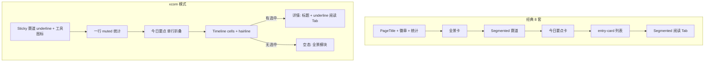

# 资讯雷达 x.com Timeline Chrome - Plan

## Goal Capsule

- **Objective:** 在 **xcom 模式**下把资讯雷达（`IntelView`）的 chrome 从 qmreader 读报台（重顶栏 + 凹槽分段 + 卡片列表）收成 x.com 时间线节奏：扁平行、underline Tab、薄顶栏、要点/全景降级；经典 8 套视觉与全部数据/阅读链路行为零回归。
- **Product authority:** 用户本人；范围来自本会话对照 Paper 导出 x.com Home Timeline 的设计分析与确认清单。
- **Open blockers:** 无。
- **Execution profile:** 纯 SwiftUI 视觉 / 布局；`theme.system == .xcom` 分支；`swift build` + xcom×light/dark 与任一经典主题手工对照。
- **Stop when:** Definition of Done 全部满足；bridge / rewrite / yupi / 投研默认 Tab 行为不变。

---

## Product Contract

### Summary

资讯雷达在 xcom 下呈现为「研究用双栏时间线」：中栏是扁平 feed + sticky 赛道 underline Tab；右栏是详情阅读（投研/原文 underline）；AI 工具（今日要点、全景、一键提炼）降级为折叠行 / 右栏模块 / 图标菜单，不再压首屏。经典主题保留现有 segmented 凹槽 + entry-card 列表。

### Problem Frame

`ThemeCatalog` 的 xcom token（`#0F1419` / `#536471` / `#1D9BF0`、Chirp、`elevation=0`）与侧栏 Paper 精修（`2026-07-23-001`）已接近 x.com，但 `IntelView` 仍是 2026-07-10 读报台 + 2026-07-11 凹槽分段：PageTitle 大号顶栏、全景/今日要点大卡、`KSSSegmentedGroove` 赛道、圆角 10 卡片列表带选中阴影。颜色像 x，组件习语不像 timeline。

### Key Decisions

- **KD1. 仅 xcom 视觉分支。** 判定：`theme.system == .xcom`（与侧栏一致；`uiGeneration == .xcom` 时 designSystem 恒为 `.xcom`）。经典 8 套不改列表卡片与 segmented 凹槽。
- **KD2. 保留 list|detail 双栏。** 不改成 x 单栏线程；桌面投研阅读需要详情列。中栏宽仍约 380–420，细节可微调但不引入第三栏 shell。
- **KD3. 不碰数据与阅读产品链路。** 不改 bridge、`intel-radar` / rewrite pool / 正文缓存 / 投研默认 Tab / yupi 混排语义；只动 `IntelView`（及必要的极小共享 helper）。
- **KD4. 赛道与阅读 Tab 在 xcom 下用 underline，经典保留 groove。** 2026-07-11 凹槽方案继续服务经典；xcom 对齐 Paper 底蓝条。
- **KD5. AI chrome 降级不删能力。** 今日要点、全景、一键提炼、刷新、热议状态全部可达；默认折叠或迁右栏/菜单，首屏 ≥70% 是列表。
- **KD6. Search pill 与 hairline token 微调本轮不做。** 记入 Deferred；本轮专注 chrome 节奏。

### Requirements

**列表 timeline cell（P0）**

- R1. xcom 下列表项为全宽扁平 cell：无圆角卡片底、无选中阴影；行间 hairline（`theme.hairline`）；内边距约 `horizontal 16` / `vertical 12`。
- R2. xcom 选中态：浅底（`surfaceContainer` 或 `textPrimary` 极低 opacity）**或** 左侧 2–3pt `accent` 竖条；二者择一并在 U1 统一，不得同时用卡片描边+阴影。
- R3. xcom 行布局：左 40 圆 favicon → 主列（meta 一行 + 标题最多 2 行 + 摘要最多 1 行）；右侧 58 大方缩略去掉或仅有图时 52 圆角 12（无图不占位）。
- R4. xcom meta：`源 · 时间` 为 13pt muted；热议 / 投研就绪用小字或圆点，避免多枚大胶囊堆叠。
- R5. xcom 行 hover：`textPrimary` 叠加约 light 0.06–0.08 / dark 0.10（对齐 `SidebarView.hoverTint` 量级）。
- R6. 经典主题 `newsRow` 保持现有 entry-card（圆角 10、spacing 8、选中 surface + shadow）。

**顶栏瘦身（P0）**

- R7. xcom 下去掉或显著弱化 `PageTitle("资讯雷达", …)` 常驻大号标题（侧栏已标明工作区）；刷新 / 一键提炼改为中栏右上图标或紧凑按钮，不占第二行大徽章区。
- R8. xcom 下统计行（源数、更新时间、yupi 健康）收敛为 Tab 下方一行 12–13pt muted，或仅失败时展开 yupi 原因；成功态不占多行。
- R9. 错误条（`store.errorMessage`）保留，样式可不变。

**Underline Tab（P0）**

- R10. xcom 赛道行：横滑文字 Tab；激活 = `textPrimary` + bold + 底 `accent` 圆角条（约 4pt）；未激活 = `textSecondary` + medium；底 hairline；可 sticky。
- R11. xcom 赛道可保留条数数字（muted 小号）；色点可选弱化或去掉（执行时二选一并全赛道一致）。
- R12. xcom 阅读 Tab（投研改写 / 原文）：同 underline 语义，撑满详情内容列宽度；激活项 `.accessibilityAddTraits(.isSelected)`。
- R13. 经典主题赛道与阅读 Tab 继续 `KSSSegmentedGroove` / `KSSSegmentedControl`，行为与 2026-07-11 一致。

**要点 / 全景降级（P1）**

- R14. xcom 下「今日要点」默认折叠为一行预览（标题 + 单行摘要 + 展开），去掉 accent 大描边卡对列表的强挤压；展开后仍可看 bullet 与重试。
- R15. xcom 下「12 赛道全景」不放在赛道 Tab 上方大卡：迁到 **无选中条目时的详情空态** 或详情顶栏下方次级模块；仍可生成/刷新/展开。
- R16. 经典主题全景/要点位置可保持现状（顶卡 + 列表上折叠卡），避免经典布局回归成本。

**行为与跨主题**

- R17. 点击赛道、选条目、切阅读 Tab、点开自动投研生成、外链打开等行为与改前一致。
- R18. 全部 9×2 主题编译与运行安全；经典 8 套目视与 xcom 改动前一致（允许像素级无 diff 目标：结构与样式类不变）。

### Actors

- A1. 研究员（桌面端主用户，xcom 与经典切换）

### Key Flows

- F1. xcom 打开资讯雷达 — 首屏主体为列表；赛道 underline 可见；无大标题墙。
- F2. 点赛道 — 列表切换；要点行重置折叠。
- F3. 点条目 — 右栏详情；阅读 underline Tab；默认投研。
- F4. 展开今日要点 / 在空态看全景 — 能力可达，不挡列表。

### Acceptance Examples

- AE1. **Covers R1, R2.** xcom light：列表无圆角阴影卡；选中行无 drop shadow，有浅底或左边蓝条。
- AE2. **Covers R10, R13.** xcom 赛道激活有底蓝条；切经典 clay 后赛道回到凹槽浮起块。
- AE3. **Covers R7, R14.** xcom 首屏看不到常驻 28pt「资讯雷达」标题墙；今日要点默认一行。
- AE4. **Covers R15.** xcom 无选中条目时，详情区能看到全景入口或内容（非顶栏大卡）。
- AE5. **Covers R17.** 点条目后仍自动走投研 Tab / 生成链路（与 2026-07-22 阅读体验 plan 一致）。

### Scope Boundaries

- 不改 bridge、Python 雷达、rewrite worker、正文提取。
- 不改三栏 App shell、侧栏（侧栏由 2026-07-23-001 负责）。
- 不引入列表内 Search pill（Deferred）。
- 不强制改 `ThemeCatalog` hairline 到 Paper 的 `#EFF3F4`（Deferred）。
- 不做 WebView 截图自动化 / 快照测试基建。
- 不抄 x 发帖框、互动计数、关注推荐。

### Deferred to Follow-Up Work

- 列表内 Search pill 过滤标题/源。
- xcom light hairline 对齐 Paper `#EFF3F4`。
- 赛道 sticky + 真毛玻璃（若 U2 仅用 solid canvas 不够再开）。
- 相对时间文案（「2m」）若后端只给绝对时间则不动。

### Dependencies / Assumptions

- 依赖现有 `KSSThemeTokens` / `theme.system`；不新增 Seed 字段。
- 侧栏 hover 色可复制量级，不要求抽共享 API（可在 `IntelView` 内局部常量）。
- 2026-07-11 凹槽组件（`Components.swift`）保留给经典与其它页；本 plan 不删除。

### Sources / Research

- 会话分析：Paper `app.paper.design` 导出 Home Timeline（For you/Following 兴趣 Tab、backdrop sticky、timeline cell、右栏 Search）。
- `Sources/KSSDesktop/Views/IntelView.swift` — body 顶栏、`trackPills`、`trackListColumn`、`newsRow`、`detailPane`、`readerTabBar`、`panoramaBar`、`digestCardView`。
- `Sources/KSSDesktop/Support/Components.swift` — `KSSSegmentedGroove` / `KSSSegmentedControl`。
- `Sources/KSSDesktop/Support/ThemeCatalog.swift` — xcom Seed；`Sources/KSSDesktop/Views/SidebarView.swift` — xcom hover。
- 上游：`docs/plans/2026-07-11-006-fix-intel-radar-tab-affordance-plan.md`（经典凹槽）、`docs/plans/2026-07-22-001-feat-intel-reader-experience-plan.md`（阅读内容，本 plan 不改）、`docs/plans/2026-07-23-001-feat-sidebar-xcom-paper-round-plan.md`（侧栏 xcom 分支先例）。

**Product Contract preservation:** Product Contract authored in this bootstrap run（会话范围确认）；无独立 brainstorm 文件。

---

## Planning Contract

### Key Technical Decisions

- **KTD1. 单一文件主改 `IntelView.swift`。** 视觉分支集中，避免过早抽象；若 underline Tab 在赛道与阅读两处重复超过 ~30 行，再抽 **文件内** `IntelUnderlineTabBar` 私有 View，不进 `Components.swift`（经典页不需要）。
- **KTD2. 分支条件统一 `theme.system == .xcom`。** 不用散落的 `uiGeneration` EnvironmentObject（`IntelView` 已有 `kssTheme`）；与 `SeesawWordmark` / 侧栏一致。
- **KTD3. 选中行采用「浅底 + 可选左边条」，默认浅底。** 左边条在窄列表上更像「导航选中」；若实现时浅底对比不足（xcom light surface=white）则叠加左边 accent 条。禁止恢复 card shadow。
- **KTD4. 顶栏结构拆「chrome header」与「feed header」。** xcom：`PageTitle` 移除；工具图标放进赛道 sticky 行右侧（对标 Paper Tab 行 `+`）；统计 muted 行贴在赛道下。经典：保留现有 `VStack` 顶栏结构。
- **KTD5. 全景迁空态，不迁第三栏。** 无 `selectedIntelItemID` 时 `detailPane` 空态展示全景模块 +「选择左侧一条…」；有选中时全景不占详情正文。避免改 App 级三栏。
- **KTD6. 今日要点仍在中栏上方，但默认折叠一行。** 改 xcom 的 `digestCardView` 容器样式（去 accent 强描边 → hairline 或透明底），不改 `store.summarizeIntelTrack`。
- **KTD7. 验证以手工 + 编译为主。** 无 SwiftUI 快照基建；可选对「分支选择纯函数」不写测。行为回归靠点赛道/点条目/切 Tab。

### High-Level Technical Design



布局意图（xcom，非实现规格）：

```
┌─ 中栏 feed ─────────────────┬─ 右栏 reader ────────────┐
│ [赛道… underline] [↻ ✨]    │ 标题 / meta / 外链图标     │
│ 12 赛道 · N 条 · 更新于 …   │ [投研|原文] underline      │
│ 今日要点 · 一行预览 ▾       │ 正文 / 改写块               │
│ ─ ─ ─ ─ ─ ─ ─ ─ ─ ─ ─ ─ ─  │                            │
│ ○ 源 · 时间                 │  （无选中时：全景 + 提示） │
│   标题                      │                            │
│   摘要一行                  │                            │
│ ─ ─ ─ ─ ─ ─ ─ ─ ─ ─ ─ ─ ─  │                            │
└─────────────────────────────┴────────────────────────────┘
```

### Assumptions

- `theme.system == .xcom` 时 Chirp 已由 `KSSFont.themed` 生效，本 plan 不改字体注册。
- 列表项 `summary` 可能为空；无摘要时行高自然收紧。
- 一键提炼按钮在无 LLM 凭证时已有隐藏逻辑，迁图标后沿用同一 `hasLLMCredentials` 门控。

### Alternative Approaches Considered

| 方案 | 结论 |
|------|------|
| 全主题统一改 underline + 扁平行 | 否 — 经典用户刚适应 2026-07-11 凹槽；跨主题回归面过大 |
| 单栏 feed 取消详情 | 否 — 违背投研阅读台定位 |
| 抽出全局 `TimelineRow` 组件 | 延后 — 仅 Intel 一处；先文件内分支 |
| 改 ThemeCatalog 驱动列表样式 | 否 — 布局非 token 问题 |

### Implementation Sequencing

U1（列表 cell）→ U2（顶栏 + 赛道 underline + 工具位）→ U3（阅读 underline + 详情字阶）→ U4（要点/全景降级）→ U5（跨主题核对）。U1 可独立合入即见效；U2–U4 可同 PR。

---

## Implementation Units

### U1. xcom 列表 timeline cell

- **Goal:** xcom 下 `newsRow` / `trackListColumn` 呈现扁平时间线；经典 entry-card 不变。
- **Requirements:** R1–R6, R17
- **Dependencies:** None
- **Files:**
  - `Sources/KSSDesktop/Views/IntelView.swift`（`trackListColumn`、`newsRow`、相关 favicon 尺寸）
- **Approach:**
  1. `newsRow` 按 `theme.system == .xcom` 分支布局与 chrome。
  2. xcom：`LazyVStack(spacing: 0)`；行底 `Divider` 或 `overlay` hairline；hover 用 `@State` / 行级 `onHover`（macOS）。
  3. xcom 主列 meta/标题/摘要字阶按 R3–R4；缩略策略按 R3。
  4. 经典路径保持现有 padding / radius / shadow 代码路径，避免「共参微调」误伤。
- **Patterns to follow:** `SidebarView` xcom hover 透明度；`sourceFavicon` 既有圆形裁剪。
- **Test scenarios:**
  - Test expectation: none -- 纯视觉分支；功能「点击选中」并入 U5 手工。
- **Verification:** xcom 下列表无卡片阴影；经典仍有圆角卡；点击选中仍更新 `selectedIntelItemID`。
- **Execution note:** 先做 U1 单独跑一眼，确认「最像 x」的收益再叠 U2。

### U2. xcom 顶栏瘦身 + 赛道 underline + 工具位

- **Goal:** xcom 首屏去掉标题墙；赛道改为 Paper 式 underline 横滑 Tab；刷新/提炼收成赛道行右侧图标。
- **Requirements:** R7–R11, R13, R17
- **Dependencies:** U1（可并行，但建议 U1 后合以免冲突 body 结构）
- **Files:**
  - `Sources/KSSDesktop/Views/IntelView.swift`（`body` 顶栏、`trackPills` / `trackPillLabel`、`statsRefreshRow`、`bulkDigestButton` 安置）
- **Approach:**
  1. `body` 顶栏：`if theme.system == .xcom` 走瘦 chrome；`else` 保留现 `PageTitle` + 徽章 + 统计 + 全景位（全景位 U4 再动经典/xcom 差异）。
  2. 新增文件内 underline 赛道条：激活底条 `accent`、`accessibilityAddTraits(.isSelected)`、横滑 `ScrollView`。
  3. 右侧工具：刷新（`refreshIntelRadar`）、一键提炼（沿用 bulk 状态机：running 显示进度或禁用）、失败重试按钮逻辑不丢。
  4. 统计 muted 一行放赛道下；yupi 失败 reason 可第二行或 help。
- **Patterns to follow:** Paper Tab 行高与 bold/medium 对比；不删除 `KSSSegmentedGroove` 实现（经典仍用）。
- **Test scenarios:**
  - Test expectation: none -- 样式；切换赛道行为并入 U5。
- **Verification:** xcom 无 28pt 标题墙；赛道底蓝条；经典顶栏与凹槽赛道仍在。

### U3. xcom 阅读区 underline Tab + 标题字阶

- **Goal:** 详情阅读 Tab 与赛道同 underline 语言；标题从杂志 cover 收到线程感字号。
- **Requirements:** R12, R13, R17；配合 AE5
- **Dependencies:** U2（共享 underline 子 View 更干净）
- **Files:**
  - `Sources/KSSDesktop/Views/IntelView.swift`（`detailPane`、`readerTabBar`）
- **Approach:**
  1. `readerTabBar`：xcom 用 underline 双 Tab（投研/原文），`stretch` 满内容列；经典继续 `KSSSegmentedControl`。
  2. xcom 标题约 17–19 bold；meta 行外链改图标为主（`Label` 可 help）。
  3. 不改 `readerTabPanel` / 生成 / 原文结构化渲染逻辑。
- **Test scenarios:**
  - Test expectation: none -- 样式；Tab 切换并入 U5。
- **Verification:** 点投研/原文内容切换正确；默认仍投资 Tab。

### U4. xcom 今日要点折叠样式 + 全景迁空态

- **Goal:** 要点/全景不再双卡压中栏顶；能力保留。
- **Requirements:** R14–R16
- **Dependencies:** U2（顶栏已去掉 xcom 全景原位时需本单元接住入口）
- **Files:**
  - `Sources/KSSDesktop/Views/IntelView.swift`（`panoramaBar` 调用点、`digestCardView`、`detailPane` 空态）
- **Approach:**
  1. xcom：`body` 不再在赛道上方插全景大卡；全景 UI 复用到 `detailPane` 无选中分支。
  2. xcom：`digestCardView` 默认折叠视觉（弱底/hairline），展开逻辑沿用 `digestExpanded`。
  3. 经典：保持全景在顶、要点在列表上的现位置（R16）。
  4. 生成中/失败/重试按钮在新位置仍可用。
- **Test scenarios:**
  - Test expectation: none -- 布局迁移；生成按钮可达性并入 U5。
- **Verification:** xcom 无选中时右栏见全景；有列表时要点默认一行；经典布局未拆。

### U5. 跨主题与行为核对

- **Goal:** 确认 xcom light/dark 与至少一套经典主题；行为无回归。
- **Requirements:** R17, R18, AE1–AE5, Success Criteria
- **Dependencies:** U1–U4
- **Files:** 无代码；问题记 Open Questions
- **Test scenarios:**
  - 目视 AE1–AE4（xcom light；建议补 xcom dark）。
  - 经典 clay 或当前默认：顶栏、凹槽赛道、卡片列表与改前一致。
  - 功能：切赛道、选条目、投研/原文 Tab、刷新、有 key 时一键提炼入口仍在、yupi 失败文案仍可达。
  - VoiceOver：xcom 激活赛道/阅读 Tab 播报已选中。
  - 窄窗：赛道横滑不裁切工具图标。
- **Verification:** `swift build` 通过；上述清单勾完。

---

## Verification Contract

| 命令 / 动作 | 适用范围 | 说明 |
|---|---|---|
| `swift build`（或仓库惯用 `script/build_and_run.sh`） | U1–U4 | 编译通过 |
| 手工 xcom light / dark | U1–U5 | AE1–AE4 |
| 手工经典主题 | U5 | 凹槽 + 卡片零回归 |
| 行为冒烟 | U5 | 赛道 / 选中 / 阅读 Tab / 刷新 / 提炼入口 |

## Definition of Done

- U1–U5 完成；`theme.system == .xcom` 与经典路径分界清晰，无「半 xcom」泄漏到经典。
- AE1–AE5 手工通过。
- 无 bridge / store 阅读链路行为变更（除 UI 触发入口位置变化）。
- 不引入 Search pill / ThemeCatalog hairline 改动（除非实现中发现编译级必要，否则不扩 scope）。
- 侧栏 plan（2026-07-23-001）文件与代码无强制耦合；可独立合入。

## Risk Analysis & Mitigation

| 风险 | 缓解 |
|------|------|
| body 结构大改导致经典回归 | 顶栏用显式 `if xcom / else` 两套，禁止「参数化一套顶栏」 |
| 全景迁空态后用户找不到 | 空态文案写明「全景」；有选中时 ⋯ 或菜单不在本轮强制 |
| hover 与 List 选择冲突 | 用 Button + onHover，不用 `List` selection 样式 |
| 与进行中的 reader experience 改动冲突 | 不改 `readerTabPanel` 内容与 store API；仅 chrome |

## System-Wide Impact

- **影响面：** 仅资讯雷达页；主题菜单与其它 Workspace 页面无改。
- **用户：** xcom 用户获得 timeline 感；经典用户无感。
- **后续：** Search pill 可挂在 U2 工具位旁作为 follow-up。

## Open Questions

- 无阻塞项。执行时可选：赛道色点去留（R11）——默认 **去掉色点、保留数字**，更贴近 Paper 兴趣 Tab。

---

## Goal Capsule（执行入口摘要）

实现 `docs/plans/2026-07-23-002-feat-intel-radar-xcom-timeline-chrome-plan.md`：xcom 下 IntelView 列表扁平化、顶栏瘦身、underline 赛道/阅读 Tab、要点折叠与全景迁空态；经典零回归；不改数据链路。按 U1→U5 顺序，验证见 Verification Contract。
