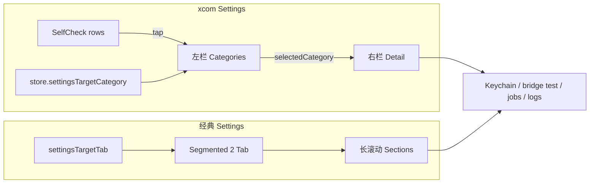

# 设置页 x.com Master-Detail 交互重构 - Plan

## Goal Capsule

- **Objective:** 在 **xcom 模式**下把「设置」从「两 Tab + 长滚动大卡」收成 x.com 式 **左分类 / 右详情** 工作台：分类级导航、深链落点到具体源、未保存态与自检跳转可预期；**经典主题**保持现有两 Tab 长滚动；Keychain 保存 / sidecar 重启 / datasource-test / 任务·日志 bridge **语义不变**。
- **Product authority:** 用户本人；scoping 默认（用户跳过选项问答）= 左分类+右详情 + 交互逻辑为主 + 仅 xcom。
- **Open blockers:** 无。
- **Execution profile:** SwiftUI 设置壳 + 路由/深链纯函数；`swift build` + 既有 `SettingsTabTests` 扩展 + xcom 手工冒烟。
- **Stop when:** Definition of Done 满足；经典路径结构/标签/保存行为零回归。

---

## Product Contract

### Summary

设置在 xcom 下采用 master-detail：左侧固定分类列表（自检、四数据源、yupi、任务、日志），右侧只渲染当前分类的表单/面板；顶栏瘦化；交互补齐「从自检/横幅/Seesaw 跳到正确分类」「编辑中 dirty 角标」。经典主题仍是 `数据源与凭证 | 任务与日志` 两 Tab 全量滚动。存储与测试 API 不重做。

### Problem Frame

`SettingsView`（~1100 行）是 2026-07-12 发布加固产物：两 Tab、凭证四源大卡堆叠、yupi 挂在凭证 Tab 下、任务/日志串在第二 Tab。相对已落地的 xcom 侧栏 / 资讯雷达 timeline：

1. **扫视成本高**：LLM 卡字段极长，要滚很远才到 yupi。
2. **深链粒度粗**：`settingsTargetTab` 只能落到 credentials / operations，不能落到 Longbridge 或日志。
3. **自检与表单脱节**：strip 在顶、fail 项不能点进对应源。
4. **视觉仍是 KSS 大卡墙**，不像 x Settings 的「左导航 + 右单页」。

### Key Decisions

- **KD1. 仅 xcom 改壳与导航。** `theme.system == .xcom` 走 master-detail；经典 8 套保持两 Tab 长滚动（与 intel/sidebar 先例一致）。
- **KD2. 交互逻辑重构，存储语义冻结。** 改导航、深链、dirty 提示、自检行跳转；**不改** Keychain 键名、按源 `save` 后 `restartSidecarForEnvChange`、`datasourceTest`、任务 toggle/rerun、日志 list/tail。
- **KD3. 引入 `SettingsCategory` 作为 xcom 导航原子。** 与现有 `SettingsTab` 并存：`SettingsTab` 继续服务经典 + 旧别名；Category 映射到 Tab 供 badge / 兼容深链。
- **KD4. 右侧一屏一分类。** 数据源不再四卡同屏；选 Tushare 只见 Tushare 表单。yupi / 任务 / 日志各自成分类。
- **KD5. 不抽全局 Settings framework。** 逻辑集中在 `SettingsView.swift` + `KSSModels` 路由 + 可选 `SettingsXcomChrome` 纯策略；不改 App 三栏 shell。

### Requirements

**信息架构（xcom）**

- R1. xcom 设置主区为 **左栏分类列表 + 右栏详情**（非顶部两 Tab 切换内容）。
- R2. 左栏至少含：自检、Tushare、Longbridge、Telegram、Seesaw LLM、资讯雷达 yupi、任务、日志（顺序固定、可测）。
- R3. 选中分类时右栏只渲染该分类内容；切换分类不丢失未保存字段（各源 `@State` 仍挂在父级或 section 生命周期允许的范围内——见 KTD）。
- R4. 左栏选中态对齐 xcom 侧栏：ink 字重 + 浅底/圆角 hover；可用 status 圆点/角标（未配置、测试失败、任务 stale）。

**顶栏与 chrome（xcom）**

- R5. 去掉或显著弱化常驻大号 `PageTitle("设置")`；可用左侧「设置」小标题 + 版本 mono 行（`BridgeClient.appVersion`）。
- R6. 输入框 / 按钮节奏贴近 x：标签 13 muted、输入 15、主操作 accent 或 ink 胶囊；卡片可用 hairline 分区代替厚 `kssCard` 阴影（不强制删卡片语义，可 flat section）。

**深链与自检逻辑**

- R7. 扩展深链：从自检 fail 项、`SelfCheckBanner`、Seesaw「去设置」、工具栏跳转等，能落到 **具体 Category**（至少 tushare/longbridge/telegram/llm；yupi/venv 类落合理默认）。
- R8. 保留 `SettingsTab` 别名兼容（`.keys` → credentials）；经典路径仍只切 Tab。
- R9. xcom 下自检详情行可点击跳到对应 Category；无法映射的项留在「自检」分类。
- R10. 编辑某源字段后：该源左栏或详情显示 dirty/未保存提示；保存成功仍显示「已保存」并清 dirty；语义仍是按源保存。

**经典回归**

- R11. 经典主题：两 Tab 标签文案、四源同屏卡片、yupi 挂凭证 Tab、任务+日志挂 operations、`KSSSegmentedControl` 顶栏结构保持。
- R12. 现有 `SettingsTabTests` 全部继续通过；新增 Category 路由测试。

**非目标（逻辑边界）**

- R13. 不引入「整页 Sticky 统一保存所有源」。
- R14. 不自动 on-blur 连通性测试、不批量一键测全部源（可作为 Deferred）。

### Actors

- A1. 研究员（配置凭证 / 任务 / 看日志）
- A2. 自检 / 横幅 / Seesaw 深链入口

### Key Flows

- F1. xcom 打开设置 → 默认选中「自检」或上次分类（默认自检）→ 左栏扫一眼状态。
- F2. 点 Longbridge → 右栏仅三字段 + 测试/保存。
- F3. 自检 fail「tushare」→ 自动选中 Tushare 分类。
- F4. 改 LLM key 未保存切到任务 → 返回 LLM 时字段仍在，dirty 仍在。
- F5. 经典主题打开设置 → 仍两 Tab 长滚动，保存/测试与今日相同。

### Acceptance Examples

- AE1. **Covers R1–R3.** xcom：左栏可见 8 类；选「日志」时右侧无凭证表单。
- AE2. **Covers R7.** 自检项 `longbridge` 深链后左栏选中 Longbridge。
- AE3. **Covers R10.** 改 Tushare token 未保存：有 dirty 提示；保存后提示变为已保存。
- AE4. **Covers R11.** 经典 clay：仍见「数据源与凭证」「任务与日志」分段与四源同屏。
- AE5. **Covers R12 / 存储冻结。** 保存 Tushare 仍写 `TUSHARE_TOKEN` 并触发 sidecar 重启（行为与现网一致，仅 UI 位置变）。

### Scope Boundaries

- 不改 Keychain API、bridge `datasource-test` / log / scheduled-jobs 协议。
- 不改侧栏、App shell、其它工作区页（除深链调用改为 Category 时的最小接线）。
- 不做 macOS 系统 Settings 多窗 / 搜索全设置索引。
- 不把任务排期编辑器重写视觉（可嵌在右栏，chrome 轻触即可）。

### Deferred to Follow-Up Work

- 设置内 Search pill 过滤分类/字段。
- 一键测试全部数据源。
- 经典主题也 master-detail。
- yupi OpenRouter 与 LLM 卡字段合并（产品语义，另开 brainstorm）。

### Dependencies / Assumptions

- 依赖 `IntelXcomChrome` / 侧栏 xcom 的分支习惯：`theme.system == .xcom`。
- `ScheduledTasksSection` 可整体嵌入右栏，不拆 Runbook 组件。
- 用户跳过选项问答：采用本文推荐默认（左分类+右详情 / 交互逻辑 / 仅 xcom）。

### Sources / Research

- `Sources/KSSDesktop/Views/SettingsView.swift` — 主壳、凭证卡、yupi、任务、日志、自检 strip。
- `Sources/KSSDesktop/Models/KSSModels.swift` — `SettingsTab` / `SettingsTabRouting`。
- `Tests/KSSDesktopTests/SettingsTabTests.swift` — badge 与深链。
- `Sources/KSSDesktop/Views/ContentView.swift` / `AIChatView.swift` — `settingsTargetTab` 调用点。
- `Sources/KSSDesktop/Views/RunbookView.swift` — `ScheduledTasksSection`。
- 先例：`docs/plans/2026-07-23-002-feat-intel-radar-xcom-timeline-chrome-plan.md`、`2026-07-23-001` 侧栏。
- 上游设置能力：`docs/plans/2026-07-12-005-feat-release-hardening-settings-plan.md`（R5–R10 能力基线，本 plan 不削弱）。

**Product Contract preservation:** bootstrap 本会话；无独立 brainstorm。默认三决策见 Goal Capsule。

---

## Planning Contract

### Key Technical Decisions

- **KTD1. 新增 `SettingsCategory` 枚举（稳定 rawValue）。**  
  cases：`selfCheck`, `tushare`, `longbridge`, `telegram`, `llm`, `yupi`, `tasks`, `logs`。  
  提供：`label`、`tab: SettingsTab`（前五个+yupi→credentials；tasks/logs→operations）、`badge` 计算入口（可选纯函数）。
- **KTD2. 深链升级为 Category，Tab 为投影。**  
  - Store：`settingsTargetCategory: SettingsCategory?`（优先）；若仅设旧 `settingsTargetTab`，xcom 落到该 Tab 的默认 Category（credentials→tushare 或 selfCheck；operations→tasks）。  
  - 或单一 `settingsDestination` 枚举兼容旧 Tab——实现时选更少断裂的一种；**测试锁映射表**。  
  - `SettingsTabRouting.targetCategory(forSelfCheckItem:)` 扩展现表；未知 → `.selfCheck`。
- **KTD3. xcom 壳：`HStack { nav | detail }`，状态 `selectedCategory`。**  
  凭证四源 + llm 的 `@State` 字段上提保留在 `SettingsCredentialsSection` 父级或 `SettingsView`，避免切分类丢编辑；子 View 只接收 Binding。yupi/tasks/logs 可继续 section 内自有 `@State`（进入时 load）。
- **KTD4. 经典路径显式 `if !isXcom` 保留现 body 结构。** 禁止「一套 layout 参数化」导致经典变窄栏。
- **KTD5. Dirty 态：`Set<SettingsCategory>` 或 per-source `Set<String>`。** 字段 `onChange` 插入；`save` 成功移除。左栏未保存点用 accent 小点或「·」文案。
- **KTD6. 视觉策略可选 `SettingsXcomChrome` 纯函数。** 左栏宽、是否 show PageTitle、nav hover opacity——单测锁 xcom/classic 分支，对齐 intel 模式。
- **KTD7. 不改 `SettingsDataSource.save` / `runTest` 实现体。** 仅搬调用入口到单源详情工具栏。

### High-Level Technical Design

Category 顺序（权威）：

| # | Category | 右栏内容 |
|---|----------|----------|
| 1 | selfCheck | 现 `SelfCheckStatusStrip` 展开版 / 列表 |
| 2 | tushare | 单源表单 |
| 3 | longbridge | 单源表单 |
| 4 | telegram | 单源表单 |
| 5 | llm | 单源表单（含 live toggle + 兼容旧键） |
| 6 | yupi | `SettingsIntelKeywordsSection` |
| 7 | tasks | `SettingsTasksSection` |
| 8 | logs | `SettingsLogsSection` |

### Assumptions

- 左栏 ~220–260pt 在默认窗口宽度下可接受；极窄窗可横向压缩右栏，不强制折叠左栏（Deferred）。
- `SettingsTabRouting.dataSourcesNeedsBadge` 仍用于「凭证相关」聚合；左栏 per-category 角标用 `SettingsDataSource.isConfigured` + test results + job health。

### Alternative Approaches Considered

| 方案 | 结论 |
|------|------|
| 仅 chrome 精修两 Tab | 否——用户明确要交互设计 + 逻辑，且深链粒度问题未解 |
| 全主题 master-detail | 否——经典回归面大；默认仅 xcom |
| 统一 Sticky 保存条 | 否——与现「按源保存+重启」语义冲突 |

### Implementation Sequencing

U1 路由/Category → U2 xcom 壳 → U3 凭证单源详情 → U4 自检/yupi/任务/日志嵌入 + dirty → U5 经典回归与测试。

---

## Implementation Units

### U1. SettingsCategory + 深链路由 + 测试

- **Goal:** 可测的 Category 模型与自检/旧 Tab 映射；Store 深链能携带 Category。
- **Requirements:** R7, R8, R12
- **Dependencies:** None
- **Files:**
  - `Sources/KSSDesktop/Models/KSSModels.swift`（`SettingsCategory`、`SettingsTabRouting` 扩展）
  - `Sources/KSSDesktop/Services/KSSStore.swift`（`settingsTargetCategory` 或等价）
  - `Sources/KSSDesktop/Views/ContentView.swift`、`AIChatView.swift`（调用点最小改）
  - `Tests/KSSDesktopTests/SettingsTabTests.swift`（扩展 Category 用例）
- **Approach:**
  1. 定义 `SettingsCategory` + `allCases` 顺序 + `var tab: SettingsTab` + `label`。
  2. `targetCategory(forSelfCheckItem:)`：tushare/longbridge/telegram/llm/intraday_secrets→对应源；任务相关字符串→tasks；其余→selfCheck。
  3. Store 增加 Category 目标；`onAppear` 消费后清空。旧 `settingsTargetTab` 仍可用：映射到默认 Category。
  4. 单测：每条映射、旧别名、Tab 投影。
- **Test scenarios:**
  - `tushare` → category `.tushare`，tab `.credentials`
  - 未知 `venv` → `.selfCheck`
  - `.keys` 别名仍等于 `.credentials`
  - jobs stale 时 operations badge 仍 true（既有用例）
- **Verification:** `swift test --filter SettingsTabTests` 全绿。

### U2. xcom master-detail 壳 + 左栏导航

- **Goal:** xcom 下左栏分类 + 右栏占位切换；经典 body 原样。
- **Requirements:** R1, R2, R4, R5, R11
- **Dependencies:** U1
- **Files:**
  - `Sources/KSSDesktop/Views/SettingsView.swift`
  - 可选 `Sources/KSSDesktop/Support/SettingsXcomChrome.swift`
- **Approach:**
  1. `body`：`if Intel/Settings xcom` → `xcomSettingsShell` else 现 `classicSettingsShell`（抽现 body）。
  2. 左栏 `ForEach(SettingsCategory.allCases)`：选中 ink bold + fill；hover 用侧栏量级 opacity。
  3. 右栏 `switch selectedCategory` 先挂现有 section 组合（凭证可先整段 `SettingsCredentialsSection` 过渡，U3 再拆）。
  4. 消费 `settingsTargetCategory` 设置 `selectedCategory`。
- **Patterns to follow:** `SidebarView` xcom navRow；intel `usesSlimHeader` 分支风格。
- **Test scenarios:**
  - Test expectation: none for pure layout — 策略宽/是否 slim 若抽纯函数则单测；否则 U5 手工。
- **Verification:** xcom 左 8 项可点；经典仍两 Tab。

### U3. 凭证：单源详情 + 工具栏测试/保存

- **Goal:** xcom 下四源 + LLM 各占一 Category 右栏；字段/保存/测试逻辑复用。
- **Requirements:** R3, R6, R10, R13, R14, AE5
- **Dependencies:** U2
- **Files:**
  - `Sources/KSSDesktop/Views/SettingsView.swift`（`SettingsCredentialsSection` 拆 `sourceDetail` 或按 Category 过滤）
- **Approach:**
  1. 将 `sourceCard` 内容提炼为 `credentialDetail(source:)`；xcom 右栏只调一个 source。
  2. 经典仍 `ForEach` 四源卡片。
  3. dirty：`onChange` 记入 set；保存成功 clear + 「已保存」。
  4. 不改 `save`/`runTest`/`load` 键集合。
- **Test scenarios:**
  - 若 dirty 判定抽纯函数：编辑→dirty、save→clean。
  - 否则：手工 AE3 + 代码审阅 save 键列表未变。
- **Verification:** xcom 仅见当前源；保存后自检仍触发。

### U4. 自检可点跳转 + yupi/任务/日志嵌入 + 角标

- **Goal:** 自检分类完整可用；行点击跳 Category；左栏角标反映未配置/失败/任务健康。
- **Requirements:** R4, R7, R9
- **Dependencies:** U2, U3
- **Files:**
  - `Sources/KSSDesktop/Views/SettingsView.swift`（`SelfCheckStatusStrip` 或详情变体）
- **Approach:**
  1. 自检右栏：摘要 + 可点列表（映射 `targetCategory`）。
  2. yupi/tasks/logs：直接嵌现有 section，外层 padding 适配右栏。
  3. 左栏 badge：源 `!isConfigured` 或 test fail；tasks 用 `scheduledTasksNeedsBadge`；logs 无强制 badge。
- **Test scenarios:**
  - 纯函数：self-check item id → category（U1 已覆盖则补 yupi 相关字符串若有）。
- **Verification:** 点自检 fail 行切换左栏；任务分类可见 `ScheduledTasksSection`。

### U5. 经典回归 + 构建/测试闸门

- **Goal:** 经典零回归；全量 Settings 测试与编译通过。
- **Requirements:** R11, R12, Success Criteria
- **Dependencies:** U1–U4
- **Files:** 测试与文档注释更新
- **Approach:**
  1. 跑 `SettingsTabTests`（含新用例）。
  2. `swift build`。
  3. 手工：xcom F1–F4；经典 F5。
- **Verification:** 见 Verification Contract。

---

## Verification Contract

| 命令 / 动作 | 说明 |
|---|---|
| `swift test --filter SettingsTabTests` | 路由/badge/别名/Category |
| `swift build` | 桌面目标编译 |
| 手工 xcom | AE1–AE3、F1–F4 |
| 手工经典 | AE4 两 Tab + 四源同屏 |
| 静态审阅 | `save`/`KeychainStore.write` 键集合与改前 diff 无删键 |

## Definition of Done

- xcom 设置 = 左 Category 导航 + 右单分类详情。
- 深链可到具体数据源 Category；旧 Tab 深链不炸。
- Dirty/已保存反馈在单源详情可用。
- 经典两 Tab 长滚动与保存/测试语义保持。
- `SettingsTabTests` 全绿；无 bridge/Python 协议变更。

## Risk Analysis & Mitigation

| 风险 | 缓解 |
|------|------|
| 切 Category 丢失 LLM 长表单编辑 | 字段 `@State` 上提到 Credentials 容器，详情只读 Binding |
| 深链双字段（tab vs category）不同步 | 单一写入 API：`openSettings(category:)` 同时投影 tab |
| 左栏过挤 | 固定 8 项短标签；副文案只在右栏 |
| 经典回归 | 显式双 shell，禁止共用一个有条件的 Scroll 结构 |

## System-Wide Impact

- **调用点：** ContentView 自检横幅、AIChat 去设置、侧栏进设置——改为 Category 深链。
- **用户：** xcom 配置路径变短；经典用户无感。
- **后续：** Search / 全主题 master-detail 见 Deferred。

## Open Questions

- 无阻塞。执行默认：首次进入 xcom 设置选中 **自检**；从侧栏无深链时同样。

---

## Goal Capsule（执行入口摘要）

实现 `docs/plans/2026-07-23-003-feat-settings-xcom-master-detail-plan.md`：xcom 设置 master-detail + Category 深链 + dirty 提示；经典两 Tab 零回归；Keychain/bridge 语义冻结。按 U1→U5，`SettingsTabTests` + build 为闸门。
