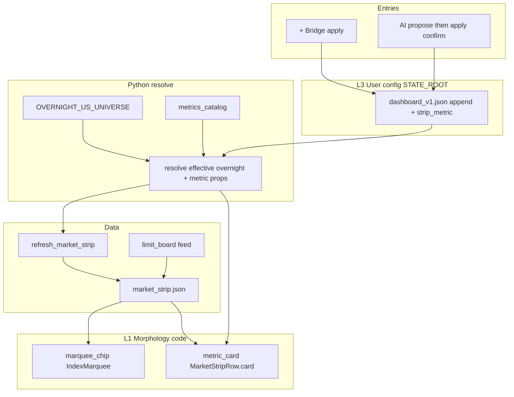

# Dashboard UI Surface Config - Plan

## Goal Capsule

- **Objective:** 在盯盘页既有布局与组件形态不变的前提下，交付可配置 surface：隔夜美股跑马灯 = 系统默认名单 + 用户追加；总览第一行旁 1 张可换绑指标小卡；`+` 与 `AI` 双入口共用同一写路径；自然语言只做绑定翻译，金融数字仍由代码/bridge 解析渲染。
- **Authority:** Product Contract（本会话 settled 决策 + 本文件）；形态约束继承 `docs/plans/2026-07-10-003-feat-overnight-us-marquee-plan.md`（固定顺序、部分失败、≥1 才显示）；写闸与数字纪律继承 `docs/solutions/ai_native_surface_assessment.md` 与 agent-panel KTD-4。
- **Execution profile:** Standard feature；Python config/bridge 单测优先，Swift 模型解码 + 布局接线，agent 写路径走 confirm。
- **Stop conditions:** Definition of Done 全部满足；或 U0 探针判定 `limit_max_board` 数据源不可用时，**停止 U3 并回报用户请求 KD5 重新裁决**——执行者不得自行更换默认 metric（见 R10 / KTD5 / U0）。
- **Out of scope for executor:** 自由画 UI、A 股指数跑马灯名单编辑、隐藏系统默认隔夜项、多 profile、美股 live tick。

---

## Product Contract

### Summary

Solo 用户在盯盘页不改代码、不填表结构的情况下，用 `+` 或 `AI` 给隔夜美股跑马灯追加标的，并切换总览一条指标小卡的绑定；系统默认 12 只始终在前且不可删；配置落 `KSS_STATE_ROOT`，UI 与 agent 同一 bridge 真源。

### Problem Frame

盯盘页卡片与跑马灯数据源写死在 Swift / 刷新脚本里，换关注面只能二次开发。传统配置 UI 要求用户懂表/字段，不符合 solo 使用场景。AI-native 应是「自然语言或点选 → 合法绑定」，不是 agent 改 View 代码。

既有隔夜美股计划明确 **deferred 名单设置**；本计划补上该缺口，但形态仍锁死为现有 chip / strip card。

### Key Decisions

- KD1. 名单策略：**系统默认 + 用户追加**。`(session-settled: user-directed — chosen over 完全自定义名单: 保留产品默认顺序与基线体验)`  
  Governs R1, R2, R3.
- KD2. 入口：**`+` 与 `AI` 双入口**，同一写路径。`(session-settled: user-directed — chosen over 仅表单或仅对话: 点选与 NL 互补)`  
  Governs R4, R5.
- KD3. 范围：**隔夜跑马灯 + 一条指标小卡**。`(session-settled: user-directed — chosen over 仅跑马灯或全页可配: P0 可交付面)`  
  Governs R1, R6.
- KD4. 默认隔夜项：**固定可见、不可删**；仅用户追加项可移除。`(session-settled: user-approved — chosen over 可隐藏默认: P0 降复杂度、防空栏)`  
  Governs R2, R3.
- KD5. 指标小卡默认 metric：**`limit_max_board`（最高连板）**。`(session-settled: user-approved — chosen over 封板率默认: 与 ETF/北向不重复)`  
  Governs R6, R10.
- KD6. 追加范围：**`+` 用精选候选表**；**AI 可试表外 code，resolve 失败则拒绝写入**。`(session-settled: user-approved — chosen over 两端仅候选表: 保留 NL 灵活度 + 校验闸)`  
  Governs R7.

### Actors

- A1. Solo desk operator — 点 `+` / 点 `AI` / 确认写 / 移除追加项 / 切换指标。
- A2. In-app agent (chat loop) — 读 config / 提 patch / 经人在环确认写。
- A3. 行情与情绪数据源 — overnight 报价、limit 板数据；失败时 fail-loud 降级。

### Key Flows

- F1. 追加隔夜标的（`+`）  
  - **Trigger:** 隔夜美股区点 `+`。  
  - **Steps:** 候选表搜索 → 选中 → 校验去重/上限 → `surface-apply` 写配置 → 触发或等待 refresh → 跑马灯在默认项后出现 chip。  
  - **Outcome:** 配置持久化；重启仍在。  
  - **Covered by:** R1, R4, R7, R8.
- F2. 追加 / 移除（AI）  
  - **Trigger:** 点 `AI` 或对话「隔夜跑马灯加 AAPL」。  
  - **Steps:** propose（含真值预览）→ 用户确认写闸 → apply → 同 F1 刷新语义。  
  - **Outcome:** 无确认则不落盘。  
  - **Covered by:** R5, R9.
- F3. 切换指标小卡  
  - **Trigger:** 小卡菜单或 AI「小卡改成封板率」。  
  - **Steps:** metric_id 须在白名单 → apply → 卡皮不变、数字换源。  
  - **Outcome:** 无数据时「—」+ 原因，不编造。  
  - **Covered by:** R6, R10.
- F4. 冷启动 / 坏配置  
  - **Trigger:** 配置文件缺失或损坏。  
  - **Steps:** load 降级为全默认；日志 fail-loud；UI 不崩。  
  - **Covered by:** R8.

### Requirements

**隔夜跑马灯**

- R1. 显示序列 = 系统默认 `OVERNIGHT_US_UNIVERSE` 成功项（固定顺序）+ 用户 `append` 成功项（append 顺序接在默认后）。
- R2. 系统默认项不可通过 UI/API 删除或隐藏；对 default code 的 remove 须拒绝。
- R3. 用户追加项可移除；移除只改用户配置，不改代码常量。
- R4. 隔夜区提供 `+` 追加与用户项移除两个点选手势；二者与 AI 路径共用同一 apply（不暴露表结构）。
- R7. `+` 仅候选表；AI 可提交表外 code，须经 resolve（kind 推断 + 报价探针）成功才可写入；失败返回明确 error，不落盘。code 规范化为显式白名单：大写归一后须匹配 `^[A-Z0-9.^-]{1,12}$`，不匹配即拒绝且**不发探针请求**。AI 推断得到的 kind 须连同来源与探针快照落盘（见 R17）。
- R11. 用户 `append` 上限 8；满额拒绝并说明。
- R12. 与默认 code 或已有 append 冲突时幂等拒绝（不重复 chip）。

**指标小卡**

- R6. 总览第一行（`MarketStripRow` 同排）固定 1 槽指标小卡；形态复用现有 strip card；绑定由 `metric_id` 白名单驱动。
- R10. 默认 `metric_id = limit_max_board`；白名单至少含 `limit_max_board`、`limit_seal_rate`（若 seal 数据同批接通）、以及 1–2 个后备。**后备必须是已有 Python writer 的字段**：`turnover_top1` 因 `turnoverTop` 在仓库中只有 Swift 模型、无 Python 生产者而排除；P0 后备限定为基于 `marketStrip.indexBoard` 的 index 摘要类指标。缺数时显示「—」而非假数。
- R13. 小卡绑定不得与第一行已固定展示的「双 A500ETF + 北向」重复：`metric_id` 白名单不得包含任何 north 类指标；`+` 与 AI 提交 north 类 metric 一律**拒绝**并返回「第一行已固定展示北向资金」。校验权威在 U4（Python），U6 仅做候选菜单的呈现层过滤。
- R17. AI 表外 code 落盘时须持久化 `kind_source`（`candidate_table` | `ai_inferred`）、`resolved_at`（探针成功时间戳）、`probe_close`（探针取到的收盘价）；`surface-get` 透传三字段，UI 对 `ai_inferred` 项在移除菜单展示 kind 与首次探针价供肉眼校验。

**双入口与 agent**

- R5. `AI` 入口打开/聚焦 agent，并带 region 上下文（overnight 或 strip_metric）；写操作走人在环确认。
- R9. `+` 与 `AI` 最终调用同一 Python `save/apply`；禁止 AppStorage 与文件双真源。
- R14. Agent 可读当前配置与 resolved 预览；写工具进 `WRITE_COMMANDS` + chat `request_write`。**P0 的 MCP 只注册 `surface-get` / `surface-metrics` / `surface-propose` 三个读 tool，`surface-apply` 不进 `scripts/kss_mcp.py` 的 `_LIVE` 段**——MCP 的 confirm 来自 agent 自身而非人在环，不等价于 app chat UI 的写闸。

**存储与纪律**

- R8. 配置唯一路径在 `KSS_STATE_ROOT` 下（推荐 `storage/ui_surface/dashboard_v1.json`）；原子写；坏 JSON 降级默认。
- R15. 展示用金融数字只来自 bridge/refresh 解析结果，不来自 LLM 口述。
- R16. 形态锁死：P0 不允许注册新 component type；只允许 `marquee_chip` 实例与 `metric_card` 单槽。

### Acceptance Examples

- AE1. Covers R1, R4. Given 默认 12 只正常显示，When 用户经 `+` 追加候选内 `AAPL`，Then 跑马灯默认项后出现苹果 chip，顺序不重排默认段。
- AE2. Covers R2, R3, R4. Given 配置中有用户 `AAPL`，When 请求 remove `IXIC`，Then 拒绝；When 用户在跑马灯 chip 菜单移除 `AAPL`（不经 AI 路径），Then 仅去掉追加项，且**跑马灯上苹果 chip 随即消失**（读时对账，不等下次 refresh）。
- AE3. Covers R5, R9. Given AI 提议追加 `AMD`，When 用户未确认写闸，Then 配置未变；When 确认后，Then 与 `+` 写入同一 JSON 字段语义。
- AE4. Covers R6, R10. Given strip 含 limitBoard 真值，When 默认小卡，Then 显示最高连板 N；When 切换到白名单另一 metric，Then 卡皮不变、主值换源。
- AE5. Covers R7, R13. Given AI 提交无效 code，When resolve 失败，Then 拒绝写入并返回 error hint；Given 含非法字符或超长的 code，When validate，Then 拒绝且探针零调用；Given `set_strip_metric = north_money`，When apply，Then Python 侧拒绝并返回「第一行已固定展示北向资金」。
- AE6. Covers R8. Given 损坏的 dashboard_v1.json，When 打开盯盘，Then 全默认可渲染，日志记录损坏。

### Success Criteria

- S1. 不改发版代码即可追加/移除用户隔夜项并在重启后保留。
- S2. 无配置时 `effective_overnight_universe(OVERNIGHT_US_UNIVERSE, [])` 逐项等于 `OVERNIGHT_US_UNIVERSE`（code/name/kind 全等、顺序全等），由 `test_ui_surface_resolve.py` 断言；且 `DashboardView` 中 `OvernightUSMarquee` 的调用参数不变（无配置分支不进新代码路径）。
- S3. `+` 与 AI 写后 config 同一 schema 定义；`kind_source` 值可不同（见 R17）。
- S4. 指标小卡可在白名单内切换；无数据 fail-loud。
- S5. AI 诱导自动 live 写时，无用户确认则配置不变。

### Scope Boundaries

**In**

- 隔夜美股 region 的 append/remove（用户项）
- 一条 strip 指标小卡 + 白名单切换
- `+` / `AI` 双入口 + bridge + chat tools
- 接通 `limit_max_board`（及同批可得的 seal 率）最小数据路径，使默认 metric 可用
- 候选表常量（代码内，非用户 SQL）

**Deferred for later**

- 隐藏/重排系统默认隔夜项
- A 股指数跑马灯可配
- 多 metric 卡 / 拖拽排序 / 多 profile 分享
- 美股 Longbridge live overlay
- 任意 SQL / 自由 widget 类型注册

**Outside this product's identity**

- 个性化买卖建议、下单
- Agent 直接改 SwiftUI 源码或布局树

### Dependencies / Assumptions

- D1. 隔夜跑马灯实际有**三份**名单，本计划须全部覆盖：①`scripts/overnight_us_universe.py::OVERNIGHT_US_UNIVERSE`（历史收盘，写 `market_strip.json`）；②`kss/data/us_market.py::DEFAULT_US_MARKET_UNIVERSE`（实时报价路由，带 route / yfinance_symbol / longbridge_symbol）；③`Sources/KSSDesktop/Services/KSSStore.swift::usMarketCodes`（Swift 请求列表）。只改①会让追加项永久停在「静态 · 历史收盘」。
- D2. `refresh_market_strip` 产出 `storage/macro/market_strip.json`；snapshot 透传 `marketStrip`。
- D3. Chat 写闸：`WRITE_COMMANDS` + `request_write` + Swift confirm（`docs/plans/2026-06-22-004-feat-kssdeck-agent-panel-plan.md` KTD-4）。
- A1. Tushare `limit_list_d`（或等价）对本账号的可用性**由 U0 探针判定，非假设**；U0 失败即按 Stop conditions 阻塞回报，不进入 U3 编码。
- A2. yfinance 对用户追加美股/ETF 的可用性与现 overnight 路径同级；失败则该 chip 不出现、配置保留。

### Sources

- 会话 settled 产品决策（2026-07-28）
- `docs/plans/2026-07-10-003-feat-overnight-us-marquee-plan.md`（形态与 deferred 名单设置）
- `docs/solutions/ai_native_surface_assessment.md`
- `docs/plans/2026-07-08-002-feat-vibe-research-modules-port-plan.md` U4（limitBoard 未落地，本计划最小接通）
- Pattern: `kss/news/track_keywords.py`（default ∪ user override JSON）
- Pattern: `indicator-solidify` / `WRITE_COMMANDS` / chat TOOL_SPECS

---

## Planning Contract

### Key Technical Decisions

- KTD1. **三层 surface 模型**  
  L1 形态代码拥有（`marquee_chip` / `metric_card` 渲染器）；L2 区域代码拥有（`overnight_us_marquee` / `strip_metric_slot`）；L3 用户实例 JSON 可写。Agent/UI 只写 L3。  
  *Rationale:* 锁形态、放实例，避免低代码变成自由布局。

- KTD2. **配置存储 = track_keywords 式 JSON，非自由 SQL**  
  路径：`$KSS_STATE_ROOT/storage/ui_surface/dashboard_v1.json`。模块 `kss/ui_surface/`：`config`（default + validate + 原子写，复刻 `track_keywords.py` 单文件形状）/ `resolve`（effective universe + metrics catalog + 候选表常量）。原子 `tmp` + `replace`。  
  *Rationale:* 与 intel keywords 同构——该先例单文件 108 行即处理 12 赛道×词表的更复杂结构，本计划的域（≤8 项 append + 单个 metric_id）更简单，不应拆得更细。配置路径用函数 `_config_path()` 每次调用重算，**不做模块级常量**，否则 tmp state root 的测试与验收门会因 import 缓存失效。bundle 安全；diff 友好。不进 DuckDB 写路径。

- KTD3. **overnight 合并点：配置 + 默认 universe → refresh 拉数 + 读时对账**  
  `refresh_market_strip._fetch_overnight_us` 必须读 L3 append 合成 effective universe，再 `merge_overnight_quotes`。仅改 UI 不改 refresh 会导致「配置在、行情永不出现」。  
  同时 `scripts/kss_app_bridge.py::_market_strip()` 返回前须用 effective universe 对 `overnightUS` 做**读时过滤 + 排序**（不在 effective 列表内的 code 直接剔除），使 remove 在下一次 snapshot 拉取即生效，无需等 refresh。  
  三份名单（D1）须同步：`USMarketQuoteService` 接受 effective universe（`DEFAULT_US_MARKET_UNIVERSE` + L3 append 派生的 `USMarketSymbol`，route 由 kind 映射），`_select_universe` 对未知 code 返回显式 `unavailable` 而非静默丢弃；`KSSStore.usMarketCodes` 改为从 snapshot 派生，不再硬编码。

- KTD4. **双入口同一 `surface-apply` 实现**  
  `+`：BridgeClient 直调 `surface-apply`（用户手势 = 已确认）。  
  AI：`surface-propose`（读）+ `surface-apply`（WRITE + request_write）。  
  禁止 Swift 本地另一份真源。

- KTD5. **默认 metric 依赖最小 limit 数据接通**  
  现状：Swift `LimitBoard` 已建模，但 `refresh_market_strip` / `_market_strip` **不写 `limitBoard`**（2026-07-08 U4 未落地）。本计划 U3 必须最小实现 `_limit_board`（或等价）并入 strip/snapshot，否则 R10 不可验收。  
  实现路径唯一：Tushare `limit_list_d` → `maxBoard` / `sealRate` 写入 `market_strip.limitBoard`。  
  **该源不可用时（由 U0 判定）→ 停止 U3，向用户回报并请求 KD5 重新裁决；执行者不得自行更换默认 metric。** 降级是 user-approved 决策的变更，必须回到用户手里，不是实现期自由裁量。

- KTD6. **候选表与 AI 表外码**  
  代码常量候选（美股/ETF/全球指数常用子集）——**候选表的默认段直接 import `OVERNIGHT_US_UNIVERSE`，不重抄常量**，只在其上追加扩展候选，保证默认名单单一真源。行结构须含 `yfinance_symbol` / `longbridge_symbol` 以便构造 `USMarketSymbol`（见 D1/KTD3）。  
  `+` 列出候选。AI 表外码：字符白名单校验（R7）→ 推断 `kind`（`index_global` vs `yfinance`）→ 轻量报价探针 → 失败拒写；成功则连同 `kind_source` / `resolved_at` / `probe_close` 落盘（R17）。

- KTD7. **数字纪律**  
  propose 预览与卡面数字一律 resolve 自代码；LLM 只产出 op（code / metric_id / remove）。对齐 solidify「先裁决真值、再确认写」。

- KTD8. **SectionHeader 动作区**  
  现 `SectionHeader` 仅 title+caption。扩展可选 `trailing` 或外层 `HStack` 挂 `+` / `AI`，不改全局其它页默认外观。

### High-Level Technical Design



```mermaid
sequenceDiagram
  participant U as User
  participant UI as Dashboard Swift
  participant B as bridge
  participant Loop as chat loop
  participant FS as dashboard_v1.json
  U->>UI: tap +
  UI->>B: surface-apply append
  B->>FS: atomic write
  B-->>UI: ok + resolved preview
  U->>UI: tap AI / chat
  UI->>Loop: region context
  Loop->>B: surface-propose
  B-->>Loop: patch + truth preview
  Loop-->>U: confirm sheet
  U->>Loop: approve
  Loop->>B: surface-apply
  B->>FS: atomic write
```

### Assumptions

- 用户接受 append 上限 8、默认项不可藏。
- kick refresh 的耗时与 yfinance 失败跳过可接受（与现 overnight 一致）。
- `AI` 按钮导航到既有 Seesaw/chat，不新建第二聊天面。

### Implementation Constraints

- 所有写路径 `KSS_STATE_ROOT`；测试用 tmp state root。
- 新 bridge 命令必须登记 `COMMANDS` +（若写）`WRITE_COMMANDS` + dispatch + orientation 漂移测。
- 不改 A 股 `IndexMarquee` 默认 `sortByPct: true` 行为。
- overnight 用户段 `sortByPct: false` 保持。

### Sequencing

U0 → U1 / U2 / U3 可并行（U2 依赖 U1；U3 依赖 U0 通过）→ U4 → U5 与 U6（均依赖 U4）。

U0 失败时：surface config 主干（U1/U2/U4/U5/U6）仍可独立交付，U3 与 KD5 默认 metric 一起降级为后续单独计划——**此路径须用户裁决，执行者不得自选**。

### Research Notes

- Local patterns: track_keywords JSON override；indicator-solidify write gate；overnight merge 纯函数。
- Gap: `limitBoard` 模型有、管道无 — 本计划显式补最小接通。
- External research: 跳过（本地 pattern ≥3）。
- Agent-native: 配置变更必须 bridge 平价；写确认与 solidify 同构。

---

## Implementation Units

### U0. limit_list_d 可用性探针（前置门）

- **Goal:** 在写任何 U3 代码前证实/证伪 A1，把返工成本从半天降到 5 分钟。
- **Requirements:** —（gate，非交付面）
- **Dependencies:** None
- **Files:**
  - create: `scripts/probe_limit_list.py`（一次性探针，可留仓备查）
- **Approach:**
  1. 用本账号真 token 调一次 `pro.limit_list_d(trade_date=<最近交易日>)`
  2. 断言返回非空且含 `limit_times` / `limit` 字段
  3. 结论（行数 + 字段名）记入 progress.md
- **Patterns to follow:** `scripts/probe_intraday_provider.py`、`scripts/probe_longbridge_coverage.py`（先验数据源再写代码）
- **Test scenarios:** —（人工执行一次）
- **Verification:** 探针输出记录在案。**通过才开 U3；失败即按 Stop conditions 阻塞回报用户，请求 KD5 重新裁决。**

### U1. Config schema, store, validate

- **Goal:** L3 配置的加载/校验/原子保存/默认降级，含 append 上限、默认码不可删。
- **Requirements:** R2, R3, R7, R8, R11, R12, R16, R17
- **Dependencies:** None
- **Files:**
  - create: `kss/ui_surface/__init__.py`
  - create: `kss/ui_surface/config.py`（schema + store 合一，复刻 `track_keywords.py` 单文件形状）
  - create: `kss/tests/test_ui_surface_store.py`
- **Approach:**
  1. 定义 versioned document：`overnight_us.append[]`（含 `code` / `kind` / `kind_source` / `resolved_at` / `probe_close`）、`strip_metric.metric_id`
  2. validate：code 白名单 `^[A-Z0-9.^-]{1,12}$`（不匹配即拒且不发探针）、kind ∈ {yfinance, index_global}、max 8、拒绝 default code 进入 remove 成功路径、**未列举的 patch op 名一律拒绝**
  3. store：缺文件→空 append + 默认 metric；坏 JSON→降级 + 可观测错误结构
  4. 配置路径用 `_config_path()` 函数每次重算，不做模块级常量
- **Patterns to follow:** `kss/news/track_keywords.py` 原子写与 default∪user 思想（append-only 列表，非整 track 替换）；`kss/llm/sanitizer.py` 的外部串字符白名单纪律
- **Test scenarios:**
  - 缺文件 load 得到默认 strip_metric 与空 append
  - 坏 JSON load 不抛未捕获异常，返回 degraded + error code
  - append 第 9 条拒绝
  - append 与 default 重复拒绝
  - remove default code 拒绝；remove user code 成功
  - 原子写后读回一致
  - 含非法字符 / 超长 code 被拒，且 mock 断言探针零调用
  - 未知 op 名被拒且不落盘
- **Verification:** `pytest kss/tests/test_ui_surface_store.py` 全绿

### U2. Overnight effective universe + refresh

- **Goal:** 刷新与解析使用 default+append；产出 overnightUS 含用户项（有价时）。
- **Requirements:** R1, R7, R15
- **Dependencies:** U1
- **Files:**
  - modify: `scripts/overnight_us_universe.py`（若需 `merge` 助手：defaults 后接 append 列表）
  - modify: `scripts/refresh_market_strip.py`
  - modify: `kss/data/us_market.py`（`USMarketQuoteService` 接受 effective universe；`_select_universe` 未知 code 返回显式 `unavailable`）
  - modify: `kss/tests/test_overnight_us_universe.py`
  - create: `kss/ui_surface/resolve.py`（effective universe / metrics catalog / 候选表常量 / preview props）
  - create: `kss/tests/test_ui_surface_resolve.py`
- **Approach:**
  1. `effective_overnight_universe(defaults, append)` → 有序 list
  2. refresh 读 store append，对 effective 列表拉数；merge 保持顺序
  3. resolve 提供「配置有、报价暂无」的 pending 语义供 UI/agent 文案——**必需字段，非可选**；勿假装有价
  4. 候选表默认段 import `OVERNIGHT_US_UNIVERSE`，不重抄；行结构含 `yfinance_symbol` / `longbridge_symbol`
- **Patterns to follow:** 现 `merge_overnight_quotes`；`index_stack_universe` 常量风格
- **Test scenarios:**
  - 无 append 时与现 12 默认 merge 行为一致（同时作为 S2 的断言）
  - append 成功码出现在默认成功项之后
  - append 缺价则跳过该项，不打乱默认段
  - AI 表外码 resolve 失败不进入可写 patch（单元测 resolve 函数）
  - `_select_universe` 遇未知 code 返回 `unavailable`，不静默丢弃
  - 候选表默认段与 `OVERNIGHT_US_UNIVERSE` 逐项相等（防重抄漂移）
- **Verification:** overnight 单测全绿；手工/脚本 refresh 后 JSON 含追加 code（有价时）

### U3. Limit board data for default metric

- **Goal:** 使 `limit_max_board`（及可选 seal）在 snapshot/strip 上有真值，供小卡 resolve。
- **Requirements:** R6, R10, R15
- **Dependencies:** **U0 通过**（探针失败则本单元不开工）；与 U4 集成
- **Files:**
  - modify: `scripts/refresh_market_strip.py` 和/或 `scripts/kss_app_bridge.py`（`_limit_board` / snapshot merge）
  - modify: `Sources/KSSDesktop/Models/KSSModels.swift`（仅当字段对齐需要）
  - create: `kss/tests/test_limit_board_feed.py`（mock Tushare 或固定 fixture）
- **Approach:**
  1. 最小实现：最高连板 + 封板率（若成本可控）
  2. 写入 `marketStrip.limitBoard` 或 snapshot 同级字段；失败则 null + 日志
  3. resolve 的 metrics catalog 将 `limit_max_board` 映射到该字段；后备 metric 限定为基于 `indexBoard` 的 index 摘要（`turnover_top1` 无 Python writer，不入白名单）
- **Patterns to follow:** `docs/plans/2026-07-08-002` U4 目标结构；partial fail 隐藏而非假数
- **Execution note:** 先用 mock 固定 33-row 样例断言聚合，再对接真 API。
- **Test scenarios:**
  - fixture 行聚合 maxBoard 正确
  - API 失败返回 null，不抛垮 snapshot
  - sealRate 边界：分母 0 → null 或明确 status
- **Verification:** 单测绿；有交易日数据时 snapshot 出现非空 maxBoard（环境允许时）

### U4. Bridge surface commands

- **Goal:** 暴露 get/propose/apply/metrics，登记 COMMANDS/WRITE，orientation 不漂移；**所有配置校验的权威落点**。
- **Requirements:** R4, R5, R8, R9, R13, R14
- **Dependencies:** U1, U2, U3
- **Files:**
  - modify: `scripts/kss_app_bridge.py`（含 `_market_strip()` 读时对账）
  - modify: `kss/config/write_command_labels.yaml`（按 op 分键）
  - modify: `kss/tests/test_bridge_orientation.py`（或新增 `kss/tests/test_bridge_ui_surface.py`）
- **Approach:**
  1. 读命令：`surface-get`、`surface-metrics`、`surface-propose`（propose 可无副作用）
  2. 写命令：`surface-apply` ∈ WRITE_COMMANDS
  3. apply 接受**闭集** patch ops：`overnight_append` / `overnight_remove` / `set_strip_metric` / `reset_overnight_append`（清空用户追加，不动默认与 metric）/ `reset_strip_metric`（metric 回默认）；未列举 op 一律拒绝
  4. 返回 resolved 预览 props（真值）
  5. north 类 metric 在此拒绝（R13 校验权威，非 Swift）
- **Patterns to follow:** `intel-keywords-get/set`；`indicator-solidify` 校验失败不写
- **Test scenarios:**
  - COMMANDS 含新命令；apply 在 WRITE_COMMANDS
  - dispatch 字面量 ⊆ COMMANDS（orientation 守卫）
  - apply 合法 append 后 get 可见
  - apply 非法 metric_id 拒绝；`set_strip_metric=north_money` 拒绝
  - 未知 op 名拒绝且不落盘
  - 重复 apply 同一 code 返回幂等成功而非 error（覆盖 sidecar 双跑残留）
  - propose 不修改磁盘
- **Verification:** bridge 单测绿

### U5. Chat tools + system prompt

- **Goal:** Agent 可 propose/apply surface；写走 request_write。
- **Requirements:** R5, R9, R14, R15
- **Dependencies:** U4
- **Files:**
  - modify: `scripts/kss_chat_loop.py`（TOOL_SPECS）
  - modify: `kss/config/chat_system_prompt.md`（短说明：region、须预览真值、禁止臆造数字）
  - modify: `kss/tests/test_chat_loop.py`
  - modify: `scripts/kss_mcp.py`（MCP 只注册三个读 tool；`surface-apply` **不进** `_LIVE` 段）
- **Approach:**
  1. 工具名与 bridge command 映射清晰
  2. `write_effect_label` 按 op 分文案：把现有 `run.{task}` 二级查表推广为通用 `{command}.{op}`，`write_command_labels.yaml` 分键 `surface-apply.overnight_append` / `.overnight_remove` / `.set_strip_metric` / `.reset_overnight_append` / `.reset_strip_metric`——破坏性 op 与新增 op 不得共用一句标题
  3. 测试：写工具不直接 dispatch
- **Patterns to follow:** solidify_indicator 两步文案；test_chat_loop gated write；`write_command_labels.yaml` 既有 `run.update-cs-data` 等 11 条二级分键
- **Test scenarios:**
  - apply tool 判定 is_write_command
  - 未确认路径不调用写 dispatch（既有 harness）
  - schema 含必填参数
  - remove / reset op 的 effect 文案与 append 不同
  - MCP 侧 `surface-apply` 未注册（即使 `_LIVE=1`）
- **Verification:** chat_loop 相关测绿

### U6. Swift Dashboard UI + BridgeClient

- **Goal:** 隔夜区 `+`/`AI`、用户项移除、strip 指标小卡、配置应用后刷新 snapshot。**本单元不承担配置校验——校验权威在 U1/U4；U6 只负责入口呈现与 snapshot 重载。**
- **Requirements:** R4, R5, R6, R13（仅呈现层过滤）, R16, R17（展示 kind 供校验）
- **Dependencies:** U4（及 U3 数据）
- **Files:**
  - modify: `Sources/KSSDesktop/Views/DashboardView.swift`
  - modify: `Sources/KSSDesktop/Models/KSSModels.swift`
  - modify: `Sources/KSSDesktop/Services/BridgeClient.swift`
  - modify: `Sources/KSSDesktop/Services/KSSStore.swift`
  - modify: `Sources/KSSDesktop/Views/ContentView.swift`（若需 onOpenAgent / section 回调）
  - modify: `Sources/KSSDesktop/Views/AIChatView.swift`（`WriteConfirmView` 真值预览区）
  - modify: `Tests/KSSDesktopTests/RealtimeMergeTests.swift`（MarketStrip 构造字段）
  - create: `Tests/KSSDesktopTests/DashboardSurfaceConfigTests.swift`（解码/映射纯逻辑，若有 helper）
- **Approach:**
  1. SectionHeader trailing 或 HStack：`+` popover 候选、`AI` 打开 agent 并带 context。**SectionHeader 须移出 `!overnight.isEmpty` guard**，仅 marquee 主体受该条件控制，否则当日取数全失败时管理入口一并消失
  2. Overnight 列表模型可选 `isUserAppended`；仅用户项挂 `contextMenu` 移除（默认项不挂载，从交互层保证 R2）
  3. `OvernightUSMarquee` 的 `statusLabel()` / `sourceLabel()` 增 pending 分支（文案「待刷新」，不显示任何数字）
  4. MarketStripRow 同排增加 metric 卡；常驻切换图标 + 菜单（菜单不列出 north 类）
  5. apply 成功后 reload snapshot；`surface-apply` / `surface-propose` 须加入 `BridgeClient.subprocessOnlyCommands`（含外网探针，会撞 sidecar 3s 超时导致双跑）
  6. `KSSStore.usMarketCodes` 改为从 snapshot 派生，不再硬编码
- **Patterns to follow:** `StockBrowserView` / `SettingsView` 的搜索 TextField + 过滤列表（**不是** RunbookView 的表单式 popover）；WriteConfirm 既有链路；MarketStripRow.card
- **Execution note:** Swift 侧重解码与接线；复杂 UI 可用预览/真机 smoke，单测保 Codable 与 merge 字段不回归。
- **Test scenarios:**
  - MarketStrip 含 limitBoard/overnight 构造不崩（更新 RealtimeMergeTests）
  - 配置 JSON 样例解码（若 Swift 侧有 model）
  - pending=true 的追加项渲染为带 pending 标签的 chip，不被过滤掉也不崩
  - Covers AE1/AE4 的手工验收清单写入 Verification
- **Verification:** Desktop 相关测绿；真机：追加 → 见 chip；切换 metric → 见真值或「—」

---

## Verification Contract

| Gate | Command / action | Proves |
|------|------------------|--------|
| Pre-flight | `python scripts/probe_limit_list.py` 返回非空且含 `limit_times` / `limit` | U0；A1 成立 |
| Python unit | `pytest kss/tests/test_ui_surface_store.py kss/tests/test_ui_surface_resolve.py kss/tests/test_overnight_us_universe.py kss/tests/test_limit_board_feed.py kss/tests/test_bridge_ui_surface.py kss/tests/test_chat_loop.py -q`（以实际文件名为准） | U1–U5 |
| Bridge orientation | 既有 orientation 漂移测 | 新命令登记完整 |
| Swift | `swift test --filter RealtimeMergeTests`（CLT 无 XCTest 时降级为 `swift build`） | U6 模型不回归 |
| Manual smoke | 盯盘：`+` 追加候选；AI 追加并确认/拒绝；移除用户项（chip 即时消失）；切换小卡；损坏 config 后冷启动 | AE1–AE6 |
| Bundle write | **在子进程中**设 `KSS_STATE_ROOT` 跑一次 `surface-apply`，断言 PROJECT_ROOT 下无 `storage/ui_surface/`（同进程 import 缓存会使环境变量失效） | R8 |

---

## Definition of Done

- U0 探针通过（或经用户裁决后显式改道）；全部 U1–U6 验收通过；无「默认 metric 恒空却显示正常数」的静默失败，也无「未经用户裁决即更换默认 metric」的静默降级。
- Product Requirements R1–R17 有对应实现或显式 defer 记录（不得 silently drop）；每条 R 只挂在其校验权威所在的单元，不双挂。
- 无配置时 overnight 视觉/顺序与改前一致（同数据）。
- AI 写无确认不落盘；`+` 与 AI 写同一 schema。
- 清理实验代码与死路径；不留下第二配置真源。
- 可选：`docs/solutions/` 短记「surface config pattern」——执行后 compound，不阻塞 DoD。

---

## Risks & Dependencies

| Risk | Mitigation |
|------|------------|
| limit_list_d 权限/空窗 | U0 开工前探针；失败即阻塞并回报用户请求 KD5 重裁，执行者不自行降级 |
| refresh 未读 append | U2 强制接线 + 测 |
| 三份隔夜名单不同步 | D1 列全；KTD3 要求三处同改；`_select_universe` 未知 code 显式 `unavailable` |
| 双真源 | KTD4；code review 禁 AppStorage 配置；候选表 import 默认常量不重抄 |
| 写闸绕过 | apply 仅 WRITE；AI 不直 dispatch；校验权威统一在 U4 Python 侧 |
| AI 推断 kind 错误固化 | R17 记录 kind_source / probe_close，UI 可肉眼复审 |
| 跑马灯过长 | max 8 append |
| MCP 无人在环 | P0 不注册 MCP 写 tool，写路径唯一入口是 app chat confirm |

---

## System-Wide Impact

- **Agent parity:** 新读/写 surface 命令应对齐 bridge；MCP **只做读平价**（`surface-get` / `surface-metrics` / `surface-propose`），P0 不暴露 MCP 写 tool。agent 在 MCP 场景下能读不能写，须在 system prompt 写明以免模型反复尝试。
- **Snapshot payload:** marketStrip 可能增 limitBoard 实值；Swift 已有 optional 字段。
- **Cron:** refresh_market_strip 日更须包含 append 与 limit 拉取耗时（可接受增加）。

---

## Open Questions

- OQ1. **Deferred:** apply 成功后是否自动 kick `refresh-market-strip`，还是仅文案「待下次刷新」+ 手动。默认建议：apply 后异步 kick 一次（`+` 路径），AI 路径在 confirm 文案中写明会刷新。
- OQ2. **已裁决（本轮 review）：** 白名单 P0 **不含** `turnover_top1`——`turnoverTop` 在仓库中只有 Swift 模型、无 Python 生产者，与 `limitBoard` 同属 2026-07-08 U4 未落地字段。后备限定为基于 `indexBoard` 的 index 摘要（见 R10）。

### From 2026-07-28 review

- OQ3. **apply 后刷新的定案与 UI 等待语义。** F1 Steps 写「触发或等待 refresh」，AE1 无时效限定；而 `refresh_market_strip` 是日更 cron（8:30 / 18:05），bridge timeout 180 秒。不 kick 则用户点完 `+` 要等到次日才看到 chip，「加了但什么都没发生」；kick 则需要 UI 给出刷新中状态否则用户会重复点击。需与 OQ1 一并定案，并决定 F1 Outcome 是否补「chip 在刷新完成后可见」。
- OQ4. **kick refresh 是否算在 apply 的已确认范围内。** 一次 `surface-apply` 确认若顺带触发 `run refresh-market-strip`（后者自身在 WRITE_COMMANDS 且有独立标签「刷新并覆盖大盘指数条数据」），用户批准的范围被悄悄扩大。KTD3 要求「AI 路径若串联须二次确认或明确为副作用并在 confirm 文案说明」，但 U5 指定的文案不含刷新字样。可选方向：apply 绝不 kick，刷新只由 `+` 路径的 Swift 在 apply 返回后另行发起。
- OQ5. **limit 数据风险是否收窄到小卡子范围。** 现 Stop conditions 让 `limit_max_board` 不可用阻塞整个计划，但 6 个单元中 4 个属隔夜跑马灯（仅依赖已在跑的 `merge_overnight_quotes`），而隔夜名单设置正是 2026-07-10 计划显式 deferred 的原始缺口。是否改为：U0 失败时仅阻塞 R6/R10/U3，隔夜部分照常交付。此项改变交付面，须用户裁决。
- OQ6. **AI 写确认弹层真值预览区的形态。** F2 要求「propose（含真值预览）」、KTD7 要求预览数字与卡面同源，但复用的 `WriteConfirmView` 现只有效果句 + 原始 JSON 块，用户确认前看不到 AMD 当前报价这个「真值」本身。需定：`PendingWriteConfirm` 加什么结构化字段、预览区渲染哪几项（ticker / 价格 / 涨跌幅 / metric 当前值）。

---

## Appendix: Output Structure

```text
kss/ui_surface/
  __init__.py
  config.py                  # schema + store + 原子写（track_keywords.py 单文件形状）
  resolve.py                 # effective universe + metrics catalog + 候选表常量
storage/ui_surface/          # runtime under STATE_ROOT, not committed
  dashboard_v1.json
```

Implementer may adjust module split if cleaner; per-unit Files remain authoritative intent.
