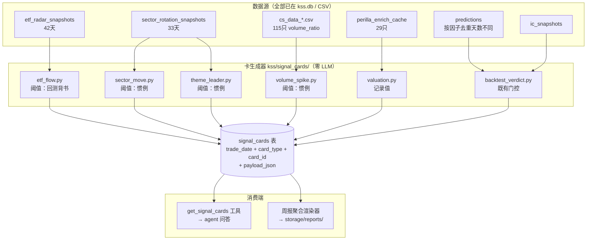

# 信号卡中间层 - Plan

## Goal Capsule

- **Objective:** 为 KSS 建一层确定性的每日信号卡，让 agent 问答和周报渲染共用同一份可复算、可下钻的结构化中间层，把"分析太浅"的根因从「每次在散装原始数据上从零现想」改成「在已聚合的信号上做交叉」。
- **Product authority:** 深度基准为 `投资分析周报_V3_2026-07-13_to_2026-07-17.html`（另一系统 Codex Investment OS 的产物，KSS 无法直接消费其数据，需自建同构中间层）。
- **Open blockers:** 无。

**Product Contract preservation:** 已变更 — 规划期核实推翻了四条 requirements 期的推测（见「研究推翻的假设」），其中三条放宽了限制、一条收紧了方向语义。Product Contract 的六类卡范围、确定性原则、双消费端结构未变。

---

## 问题诊断

用户报告三条症状：停得太早、面窄（只看行情，不串新闻/资金/板块/历史）、正确的废话（换只股票换个日子照样成立）。

这三条是同一根因的三种表现。浅检索只能产出泛泛结论——"正确的废话"不是独立的病，是前两者的输出签名。

根因经代码核实，有三个层次：

**1. 五维分析框架里两维指向 agent 调不到的工具。** `kss/config/chat_system_prompt.md` 第 44-54 行定义五维投研框架，其中「估值」（第 48 行）和「财报质量」（第 50 行）标注「工具: get_stock / get_perilla_enrichment」。但 `get_perilla_enrichment` 只存在于 `scripts/kss_mcp.py` 第 76-83 行的独立 FastMCP server，`scripts/kss_chat_loop.py` 与 `scripts/kss_sidecar.py` 从未 import 它（grep 零命中）。

**2. 三个数据域没有工具层入口。** 42 个工具（`scripts/kss_chat_loop.py` 第 93-258 行 `TOOL_SPECS`）中没有 ETF 申赎、本地资讯雷达、daily_review 归档。

**3. 提示词没有任何覆盖或继续挖的指令。** 第 42 行是唯一一句关于停止的话，无最少工具数、无覆盖清单。步数上限 8（`_DEFAULT_MAX_STEPS`，第 44 行硬编码）远未成为约束——模型离 8 步还远就停了。

**但补齐这三条不足以达到基准深度。** 基准周报的深度来自：结构化中间层（1143 张卡，每张带 stance_score/conviction/catalyst_events/evidence_quality）、其上的确定性聚合（温度计、共识演变、持续强共识 ≥3 天且 ≥2 人、风险雷达、催化日历，无一条是 LLM 判断）、每条结论可下钻到卡片 ID。特异性不是要求出来的，是结论由具体卡片聚合而成。

---

## 研究推翻的假设

Requirements 期标注「待核实」的四条推测，规划期查证结果：

| Requirements 期推测 | 查证结果 |
|---|---|
| ETF 数据 45 天待核实 | 那 45 个是 `.commentary.md`（Tier C 点评）。Tier A 真值在 `etf_radar_snapshots` 表，42 条（20260522–20260728），`read_all_ascending()` / `read_history(limit)` 现成 |
| ETF 阈值需依数据分布标定 | 阈值已存在且经一年回测：`_GRADE_CONFIRM_TH=-2.0`、`_ACCEL_THRESHOLD_PCT=1.5`、`_DIVERGENCE_RET_TH=3.0`、staleness `lag_days>4` |
| 回测裁决卡第一期恒空（paper_trade 仅 9 文件） | 那 9 个是割接前遗留，但结论只**部分**推翻。门控真身是 `kss/backtest/factor_health.py` 第 276 行读 `realized_ic_min_n`（配置值 20，`kss/config/factor_health_thresholds.yaml` 第 24 行），口径是**单因子的去重交易日数**，不是表级计数。按因子核实：`log_mv_reverse` 29 天 → 过；`sr` 5 天 → 不过。故第一期**按因子分别判定**，见 U5 |
| 估值卡稀疏到近乎无用 | `perilla_enrich_cache` 已缓存 **29 只票** × {holders, pe}，但它是**覆盖式缓存不是时间序列**：每个 `(ts_code, kind)` 仅 1 行，`distinct cached_at` 仅 1 个值（2026-07-27）。故估值卡不能按日产卡，见 KTD11 |

**存储方案不需再选。** kss.db 的「索引列 + `payload_json`」STRICT 表是既有主流形态（`etf_radar_snapshots` / `sector_rotation_snapshots` / `mi_signal_packs` / `indicator_signal_packs`）。`kss/storage/db.py` 第 12 行明确规则：复杂嵌套域用 payload_json 兜底，不强行拆列——「覆盖不全就是静默丢字段」。

---

## Product Contract

### 信号卡层（确定性，零 LLM 参与）

每个交易日为可检测的市场异动各生成一条结构化记录。信号判定全部由代码阈值规则完成。

- **R1** 卡的判定逻辑不调用 LLM。同样输入重跑产出同样的卡。
- **R2** 每张卡携带：`card_type`、`trade_date`、`data_as_of`、触发规则标识、触发时的具体数值、涉及标的/主题、`threshold_source`。
- **R3** 每条聚合结论可下钻到构成它的卡 ID 列表。
- **R4** 所有金融数字由代码写入，不经模型复述。
- **R5** 方向标签的前提是能附上真实回测胜率与有效样本数。无胜率背书的卡类型 `direction=null`。
- **R6** 统计口径以**去重交易日数**为有效 n，不用卡片条数。
- **R7** 缺数据的卡类型显式标记未覆盖，不表现为空白或错误。

### 六类卡与数据源（全部已查证）

| 卡类型 | 数据源 | 覆盖 | 阈值来源 |
|---|---|---|---|
| ETF 申赎 | `etf_radar_snapshots` | 42 天，6 主题 | **一年回测** |
| 板块异动 | `sector_rotation_snapshots` | 33 天，每天约 880 个板块 | 行业惯例 |
| 主题龙头 | sector 的 `crossSourceSignals` + `theme_registry`（21 主题） | **从板块分类推导，见下** | 无阈值（映射推导） |
| 个股放量 | `cs_data_*.csv`（仓库根 115 只） | 2023-01-03 起；最新日 `volume_ratio` 常为空 | 行业惯例 |
| 估值/持仓 | `perilla_enrich_cache` | 29 只票，**单一快照非序列** | 无阈值（记录值与分位） |
| 回测裁决 | `predictions` + `ic_snapshots` | `log_mv_reverse` 29 日过门控；`sr` 5 日不过 | 既有门控 min_n=20 |

**主题龙头卡的推导方法（替代不可用的外部 `leaderBoards` 源）：**

原始方案依赖 `leaderBoards`，但该字段源于外部源 `duanxianxia.com`（已在所有 33 天快照中停用，`missing=['kaipan:disabled']`）。但龙头信号**不需要那个外部源**——KSS 的 `sector_rotation_snapshots` 自带完整的分类系统。

具体方法：sector 快照的 `crossSourceSignals` 字段每天把 882 个板块分为四类——`demonBoard`（妖板）、`mainline`（主线）、`oldHotspotFading`（褪色）、`satellite`（跟风）。分类逻辑在 `kss/sector/hotspot_rotation.py` 中为纯代码规则。`theme_registry` 的 21 个主题各映射着一组概念/行业板块名。

对于每个主题，查其旗下的概念和行业板块 **今天是否出现在 `demonBoard` 或 `mainline` 列表中**。命中时记录：
- 该主题旗下排名最高（`todayRank` 最小）的板块及名称
- 该板块的 `heatScore`、`pctChange`、`rankJump`
- 该主题在 `demonBoard` 和 `mainline` 中各命中几个板块
- 板块名模糊匹配：`theme_registry` 中的概念名与快照板块名偶有后缀差异（如"光刻机概念" vs "光刻机"、"数据中心" vs "数据中心(AIDC)"），实现时用 `name in snapshot_name or snapshot_name.startswith(name)` 补齐，避免因命名差异漏判。

实测 33 天中每天 1-3 个主题命中 demonBoard，当天快照的板块数足以支撑（20 demonBoard+6 mainline 板块，21 个主题各映射 2-25 个板块）。

`threshold_source="derived"`——这类卡是通过分类映射推导的，不涉及可调的数值阈值。

**资讯事件不进第一期。** 该源效果未达预期，页面已隐藏、cron 已停（PR#46）。

### 方向语义（R5 的具体形态）

**ETF 卡带方向 + 胜率 + 有效样本数。** 依据 `docs/solutions/etf_flow_signal_lessons.md` 的 flow_5d 剂量曲线（双重排序已排除动量马甲混淆）：

**区间约定：左开右闭**（下界不含、上界含），最低档为无下界。实施与测试必须按此约定，边界值归属唯一：

| flow_5d 区间 | 后5日均值 | 胜率 | 边界归属 |
|---|---|---|---|
| ≤ -5% | +3.14% | 66% | -5.0 属本档 |
| (-5%, -2%] | +3.45% | 77% | -2.0 属本档 |
| (-2%, 0%] | +1.05% | 71% | 0.0 属本档 |
| (0%, +2%] | +0.21% | 49% | +2.0 属本档 |
| > +2% | -0.30% | 50% | — |

**同一文档的禁令必须同时执行：** 三个方向性检验按日聚合后无一过 |t|≥2，文档原话「雷达『只做仓位观察、禁止方向解读』的 prompt 约束被回测背书，不改」。因此 ETF 卡的方向字段承载的是**剂量档位对应的历史条件收益**，不是对后市的预测。渲染时必须与胜率、样本数同时出现，不得单独显示档位标签。

**ETF 卡不适用「持续信号」聚合。** 实测 flow_5d 档位在 42 天窗口内高度自相关——同一方向连续 ≥3 天的覆盖率：芯片 98%、人工智能 93%、机器人 90%、科创50 78%、科创芯片 71%、半导体 60%。「连续 3 天同方向」对 ETF 卡不是信号，是序列自相关的算术结果。ETF 卡在周报中仅出现在信号演变栏（逐日展示档位 + 回测值），不进入持续信号/持续观察项。这与基准周报的「持续强共识 ≥3 天且 ≥2 人」有根本性不同——人的独立判断不共享同一个底层序列的 autocorrelation 效应。

另外，**剂量曲线在校准时的 regime 条件与当前实盘窗口完全不一致。** 剂量曲线在 R3 动量 regime 下校准（`mom20>8% AND breadth_5dma≥2%`），当前 42 天实盘 `in_regime=False` 覆盖整个窗口（0/42 天）。册中胜率（77%、66% 等）在这个非动量期可能不成立。卡上须显式标注 `regime_mismatch=true`，周报渲染时附一句「当前市场处于非动量期，历史胜率来自动量期回测，本期尚未校准」。

**「大跌日 ETF 获大额申购」已被证伪**（后5日 -0.42% vs 对照 +0.90%）。任何卡或聚合都不得把大跌日申购表述为抄底信号。

**其余五类卡第一期 `direction=null`**（`threshold_source` 按类型取 `convention`/`gated`/`none`）。字段结构预留，待攒够去重日并通过 walk-forward 验证后补方向语义，届时不需改表。

**`direction` 的取值刻意避开「看多/看空」**，改用 `hist_favorable`/`hist_unfavorable`。原因：原始卡数据会被日志、DB 行、未来重构直接读到，那些场景没有渲染层的免责说明。存成预测语感的词等于把本节禁止的误读写进数据本身。渲染时可译成中文，但必须与胜率、有效 n 同时出现。

### 消费端一：agent 问答

新增 `get_signal_cards` 工具。需支持的问法（验收用）：
- 「这只票本周命中了哪些信号」
- 「这个板块连续几天异动」
- 「本周哪些板块同时出现异动和 ETF 净申购」

### 消费端二：周报渲染

确定性聚合 + 渲染，结构对齐基准：信号演变、持续信号（连续 N 天且 ≥M 来源）、风险雷达、催化跟踪。聚合全部代码计算。

### 同时修复的三个接线缺陷

- **R8** 五维框架中 `get_perilla_enrichment` 指向 agent 不可调用的工具 — 接进 `TOOL_SPECS` 或修正提示词，两者择一但必须一致。
- **R9** ETF 申赎、daily_review 归档缺工具入口 — 补上。
- **R10** 提示词缺覆盖/继续挖指令 — 补上。

---

## Key Technical Decisions

**KTD1. 卡由确定性规则判定，不由 LLM 生成。** *(session-settled: user-directed — 选择「纯确定性规则」而非「规则筛选+LLM标注」或「LLM扫描生成」：基准周报的可信度来自可复算与可下钻，让模型决定"什么值得记一张卡"会把当前的"浅"原封搬到卡层。)* Governs R1, R4。先例：`kss/sector/etf_radar.py` 第 16 行模块自述「本模块只产出确定性数字（判断类任务不进代码）」。

**KTD2. 第一期建横向信号卡（B 型），不建纵向个股观察卡（A 型）。** *(session-settled: user-directed — B 优先。)*

**KTD3. 卡层同时服务 agent 与周报，不分叉。** *(session-settled: user-directed — 两边同时，卡层共用。)* 正因卡是确定性的，两端不会互相拉扯形态。

**KTD4. 存储用 kss.db「索引列 + payload_json」STRICT 表，迁移追加版本 7。** 遵循 `kss/storage/db.py` 第 24 行规则：新增表一律追加新迁移，不改历史迁移 SQL 文本。当前版本 6。

**KTD5. ETF 卡复用既有阈值，不重新标定。** 阈值来自一年剂量曲线回测。重新标定会踩 `docs/solutions/lookahead_bias_lessons.md` 第 2 层偏差（阈值优化偏差 —— 全样本网格搜索选单点最优）。

**KTD6. 其余五类第一期用行业惯例阈值并显式标记未验证。** *(session-settled: user-directed — 选择「行业惯例值+标明未验证」而非「只做ETF卡」或「先跑回测再定」：保住交叉验证能力，同时不假装信号质量已知。)* 卡上 `threshold_source="convention"` 可见。

**KTD7. 方向标签以真实胜率为前提。** *(session-settled: user-approved — 用户选「带方向+附胜率样本数」，规划期补充边界：无回测背书的卡类型无胜率可附，第一期 direction=null。)* Governs R5。依据 `docs/solutions/daily_review_prediction_validation.md`：无实证支撑的方向输出实测方向命中 43%（低于随机 50%）、Brier 0.828（差于随机 0.80）。

**KTD8. 有效 n 按去重交易日计，不按卡片条数。** Governs R6。依据 `etf_flow_signal_lessons.md` 方法论教训第 1 条：88 个事件只有 46 个去重日期，个体层面 Welch t=2.64 是聚集假象，按日聚合后 t=1.54。规则原文：「横截面单位间高相关时，t 检验的有效 n 是去重日期数，不是事件数」。信号卡层天生会踩这个——一天生成 6 张主题卡 + N 张个股卡。

**KTD9. 不引入 DojoAgents 运行时或任何新第三方依赖。** 上游已核实真实活跃（Apache-2.0，1827 stars，2026-07-27 仍有提交），但其 agent loop 是 AWS Strands Agents 的包装（`DojoStrandsModelBridge`、`DojoBridgedTool` 直接位于 `dojoagents/agent/loop.py`，非独立适配层），继承等于拖入 `strands-agents` 整条依赖。只借一个思路：用确定性阈值圈定分析对象（对应其 `sector-attribution` 契约的 `|change_percent| ≥ 3%` / top-3 / `avg_market_cap > 50B`）。其 loop guard 阈值（相同失败 2 警告/5 阻止、同工具连续失败 3 警告/8 终止、无进展 2 警告/5 阻止）记录备查，第一期不实施——它治"转太多圈"，与本期方向相反。

**KTD11. 估值卡按快照更新触发，不按交易日产卡。** `perilla_enrich_cache` 是覆盖式缓存（每个 `(ts_code, kind)` 仅 1 行，`cached_at` 只有一个值），没有历史序列。按日产卡会在数据未变时天天写重复卡，把"信号"语义污染成"当前状态快照"。故估值卡的 `trade_date` 取缓存的 `cached_at`，同一 `cached_at` 只产一次；卡的 `card_id` 哈希含 `cached_at`，重跑幂等。这类卡不参与「持续信号」聚合——一个不随日期变化的值连续出现 N 天不构成持续信号。

**KTD12. 卡层内部统一紧凑日期，读横杠源时在生成器边界转换。** 六类卡的源数据格式分裂：ETF/sector 是紧凑 `YYYYMMDD`，而 `cs_data`、`predictions`、`paper_trade_picks`、`perilla_enrich_cache` 都是横杠 `YYYY-MM-DD`。依据 `scripts/build_data_catalog.py` 第 110 行既有记录。转换在每个生成器的读取边界完成，卡层内部只见紧凑格式；共用一个 `_to_compact(date_str)` helper，避免各生成器各写一遍。

**KTD13. 周报聚合复用 `kss/research/investment_analysis.py` 已有的确定性 helper。** 该模块（664 行）已实现基准周报所需的全部聚合语义：`_temperature`（加权归一化）、`_persistent_themes`（连续 ≥3 交易日且 ≥≥2 来源）、`_risk_severity`、`_catalysts`、`_trend`。U9 必须调用这些函数，不得并行实现第二套。两个事实：
- 该模块的卡是 LLM/分析师语料抽取出来的 `PrecisionCard`，与信号卡的阈值派生**来源不同但聚合形态相同**——这是可以复用的关键区别。
- `research_precision_cards` 表当前 0 行，`research_formula_runs` 也是 0 行，故无生产数据冲突，但名称冲突与语义错位已具雏形。
U9 的 Approach 第 1 条改为：`from kss.research.investment_analysis import _persistent_themes, _temperature, _risk_severity, _catalysts`。把信号卡的 payload 适配成 `PrecisionCard`-like 结构传入，或在两个 helper 的输入契约之间建薄适配层（在 U9 文件内，不侵入原模块）。

**KTD10. 不采用 `docs/plans/dojo-agent-loop-integration-plan.md` 的方向。** 该文档整体做减法（答案交付闸门、证据绑定、拒绝跨市场结论），优化"别说错话"；本需求要"说得更透"。且其在两处将 `ResearchAuditService` 作为既有事实引用，该类在代码中不存在。保留其一条属实判断：`after_step` 返回值在 `scripts/kss_chat_loop.py` 中被丢弃，而 `before_tool_call` / `after_tool_call` 的返回值确实参与控流。

---

## High-Level Technical Design



**卡的统一形态：**

```text
card_id        稳定哈希(card_type + trade_date + subject)
card_type      etf_flow | sector_move | volume_spike
               | theme_leader | valuation | backtest_verdict
trade_date     YYYYMMDD（紧凑，对齐 etf_radar/parquet 约定）
data_as_of     实际数据日期（可能 T-1，如 ETF 份额）
subject        主题名 / 板块名 / ts_code
rule_id        触发的规则标识
metrics        {触发时的具体数值}
direction      "hist_favorable" | "hist_unfavorable" | null
               取值刻意不用「看多/看空」——该字段是历史条件收益读数，
               不是对后市的预测。null = 无胜率背书。
dose_bucket    档位标识|null（如 "flow5d_le_-5"）
hist_forward_ret  该档位历史后5日均值|null
win_rate       float|null（direction 非 null 时必非 null）
effective_n    去重交易日数|null（direction 非 null 时必非 null）
threshold_source  "backtested"  阈值经回测验证（仅 etf_flow）
                | "convention"  行业惯例，未经回测
                | "gated"       沿用既有统计门控（backtest_verdict）
                | "none"        无阈值，纯记录值（valuation）
                | "derived"     分类映射推导（theme_leader）
coverage       "covered" | "not_in_list" | "insufficient_data"
```

**日期格式陷阱（已确认）：** `scripts/build_data_catalog.py` 第 110 行原文——「项目内日期两种格式并存: 紧凑 YYYYMMDD(parquet/etf_radar) vs 横杠 YYYY-MM-DD(cs_data/daily_review)」。卡层统一用紧凑格式，读 `cs_data` 与 `predictions` 时必须转换。

---

## Implementation Units

### U1. 建 signal_cards 表与迁移

**Goal:** 落地卡层存储与读写接口。

**Requirements:** R2, R3 / KTD4

**Dependencies:** 无

**Files:**
- `kss/storage/db.py`（追加 MIGRATIONS 版本 7）
- `kss/storage/signal_cards.py`（新建）
- `kss/storage/reports_index.py`（新建，`record_signal_weekly` 写入 helper）
- `kss/tests/test_storage_signal_cards.py`（新建）

**Approach:**
1. 在 `MIGRATIONS` 元组末尾追加 `(7, """...DDL...""")`，不改动版本 1-6 的任何 SQL 文本。
2. 表结构：`signal_cards(trade_date TEXT, card_type TEXT, card_id TEXT PRIMARY KEY, subject TEXT, payload_json TEXT NOT NULL, created_at TEXT) STRICT`，加 `(trade_date, card_type)` 索引。
3. 读写接口对齐 `kss/storage/etf_radar.py` 的既有命名：`write_cards(cards, db_path=None)`、`read_by_date(trade_date)`、`read_range(start, end)`、`read_by_subject(subject, limit)`。
4. 不建物理 latest 副本——遵循 `kss/storage/signal_packs.py` 第 5 行既有结论。
5. 同时提供 KTD12 的共用 helper `_to_compact(date_str)`：横杠 `YYYY-MM-DD` → 紧凑 `YYYYMMDD`，已是紧凑则原样返回，格式不可识别时抛错（不静默返回原值）。放在卡层入口而非各生成器内。

**Patterns to follow:** `kss/storage/etf_radar.py` 的 `write_snapshot`/`read_by_date`/`read_history` 形态；`connect()` + `ensure_schema()` 开头惯例。

**Test scenarios:**
- 迁移在空库上从版本 6 升到 7，`schema_migrations` 记录新增一行。
- 重复调用 `ensure_schema()` 幂等，不重复建表。
- `write_cards` 同 `card_id` 二次写入为 REPLACE 而非重复行。
- `read_by_date` 返回该日全部卡，跨 card_type。
- `read_range` 边界包含起止日。
- `read_by_subject` 按 trade_date 降序，limit 生效。
- 空库查询返回空列表而非抛错。
- `_to_compact("2026-07-28")` → `"20260728"`；`_to_compact("20260728")` 原样返回；`_to_compact("07/28/26")` 抛错而非静默返回原值。

**Verification:** 迁移可在现有 47 表的库上应用且不影响既有表；新表读写往返一致。

---

### U2. ETF 申赎卡生成器（唯一带方向的卡）

**Goal:** 把 `etf_radar_snapshots` 的确定性数字转成带回测背书的信号卡。

**Requirements:** R1, R2, R4, R5 / KTD1, KTD5, KTD7

**Dependencies:** U1

**Files:**
- `kss/signal_cards/__init__.py`（新建）
- `kss/signal_cards/etf_flow.py`（新建）
- `kss/tests/test_signal_cards_etf_flow.py`（新建）

**Approach:**
1. 读 `kss/storage/etf_radar.py::read_by_date`，逐主题产卡。
2. **复用**既有阈值常量。先在 `kss/sector/etf_radar.py` 加三个公开导出名（如 `GRADE_CONFIRM_TH = _GRADE_CONFIRM_TH`），再从公开名 import，不直接跨包引入带下划线的私有变量。数值本身不变——只有引用路径从协议层面变成非私有的。
3. flow_5d 映射到剂量档位与胜率表（本计划 Product Contract 中的五档），`direction` 与 `win_rate` 同时写入，缺一不写。
4. `threshold_source="backtested"`。
5. `data_as_of` 取 payload 的 `data_date`（通常 T-1），与 `trade_date` 分开存。
6. `stale=True`（`lag_days>4`）时 `coverage="insufficient_data"`，不产方向。

**Execution note:** 剂量档位与胜率的对应关系先写成测试再实现——这是唯一带方向语义的卡，写反了会把证伪过的结论产品化。

**Patterns to follow:** `kss/sector/etf_radar.py` 的 fail-loud 契约（全主题拉不到数据返回 None）。

**Test scenarios:**
- flow_5d = -6.0 落 ≤-5% 档，win_rate=0.66。
- flow_5d = -3.0 落 (-5%,-2%] 档，win_rate=0.77。
- flow_5d = -1.0 落 (-2%,0%] 档，win_rate=0.71。
- flow_5d = +1.0 落 (0%,+2%] 档，win_rate=0.49。
- flow_5d = +3.0 落 >+2% 档，win_rate=0.50。
- 边界值按左开右闭归属：-5.0→第一档、-2.0→第二档、0.0→第三档、+2.0→第四档，四个断言各自独立且无重叠无空隙。
- `direction` 非 null 时 `win_rate` 与 `effective_n` 必非 null。
- `stale=True` 输入产出 `coverage="insufficient_data"` 且 `direction=null`。
- `divergence=True`（上涨中 flow_5d 转正）产出见顶预警规则标识，不产看多方向。
- 大跌日 + 申购的输入**不**产出任何抄底/看多语义（回归测试，防证伪结论复活）。
- `data_as_of` 与 `trade_date` 不同值时两者都正确写入。
- **存量 schema 漂移**：20260609 之前的 11 天 ETF 快照主题 payload 缺 `accel`/`n_funds`/`rank_5d` 三键——读取这些键时产出**缺此值的卡**并标 `coverage` 标记，不抛 KeyError。
- 主题数差异：20260611 实际只有 4 个主题（非 6 个）——产卡数如实取 4，不补齐到 6。

**Verification:** 用库里 42 天真实快照跑一遍，产卡数按每天实际主题数累加（1 天 4 主题 + 41 天 6 主题 = 250 张）。存量回补时 20260609 之前的 11 天 schema 缺 `accel`/`n_funds`/`rank_5d` 三键——U2 不得 KeyError，应当产出缺此三值的卡（`coverage` 标记，非异常）。

---

### U3. 板块异动卡 + 主题龙头卡生成器

**Goal:** 从 sector 快照产出板块异动卡与主题龙头卡。

**Requirements:** R1, R2, R4, R5, R7 / KTD6

**Dependencies:** U1

**Files:**
- `kss/signal_cards/sector_move.py`（新建）
- `kss/signal_cards/theme_leader.py`（新建）
- `kss/tests/test_signal_cards_sector.py`（新建）

**Approach:**
1. 读 `kss/storage/sector_rotation.py::read_by_date`，payload 含 `concepts`/`industries`/`leaderBoards`/`crossSourceSignals`。
2. 板块异动阈值用行业惯例，**涨跌幅门槛与排名门槛必须同时满足**（`|pctChange| >= 阈值` AND `todayRank <= N`），不是二选一。实测：每天约 880 个板块，仅按 3% 涨跌幅过滤时中位数 20 张卡、最高 470 张、33 天累计 1733 张——单一卡类型压倒 ETF 卡（6 张/天）两个数量级，会扭曲所有下游聚合。排名门槛按构造给每日卡数封顶。常量置顶注释「未经回测，`threshold_source=convention`」。
3. 板块卡 `direction=null`、`win_rate=null`、`threshold_source="convention"`。
4. 主题龙头卡读 `theme_registry`（21 主题→板块映射）+ sector 快照的 `crossSourceSignals`，对每个主题查其旗下概念/行业板块今天是否命中 `demonBoard` 或 `mainline`。命中时记入：该主题旗下今日排名最高的板块（`todayRank` 最小），附带 `heatScore`/`pctChange`/`rankJump`，以及该主题在 `demonBoard` 和 `mainline` 中各自命中几个板块。板块名做模糊匹配——`theme_registry` 中概念名与快照板块名偶有后缀差异（如"光刻机概念" vs "光刻机"）。`threshold_source="derived"`，`direction=null`。
5. 尊重既有分工：板块轮动已于 2026-07 重标定为「妖板情绪」价格面雷达，强势真值归 ETF 申赎。板块卡不得表述为资金流真值。

**Test scenarios:**
- 涨幅超阈值的板块产卡，未超的不产。
- 阈值边界值归属明确。
- 所有产出卡 `direction=null` 且 `threshold_source="convention"`。
- 只满足涨跌幅、不满足排名门槛的板块不产卡（双门槛回归断言）。
- 单日产卡数不超过设定上限（防 470 张回归，CI 可捕获而非事后肉眼发现）。
- **主题龙头**：某主题旗下板块命中 `demonBoard` → 产卡记录该板块信息。
- **主题龙头**：某主题旗下板块命中 `mainline` → 同上述记录。
- **主题龙头**：某主题无任何旗下板块命中 `demonBoard` 或 `mainline` → 当天不为该主题产龙头卡（常态，不是异常）。
- **主题龙头**：模糊匹配将"光刻机概念"映射到快照中的"光刻机"板块（精确匹配失败时启用 `name in snapshot_name or snapshot_name.startswith(name)`）。
- **主题龙头**：`threshold_source="derived"`，`direction=null`。
- 板块卡文案不含资金流/申赎类表述（防越界回归测试）。

**Verification:** 用库里 33 天真实快照跑通；每日卡数在上限内，33 天累计远低于单门槛时的 1733 张。

---

### U4. 个股放量卡生成器

**Goal:** 从日线 CSV 产出个股异动卡。

**Requirements:** R1, R2, R4, R5 / KTD6, KTD8

**Dependencies:** U1

**Files:**
- `kss/signal_cards/volume_spike.py`（新建）
- `kss/tests/test_signal_cards_volume.py`（新建）

**Approach:**
1. 读 `cs_data_*.csv`（路径解析复用 `scripts/kss_app_bridge.py::_stock_file` 的 `STATE_ROOT` 约定，该函数只读仓库根目录，不读 `cs_data/` 子目录——子目录的 50 个文件是陈旧副本，最新日期 2026-05-11）。CSV 自带 `volume_ratio`、`turnover_rate`、`pct_chg`、`total_mv` 列，**不需自行计算量比**。
1a. **最新交易日 `volume_ratio` 常为空**（62/115 个文件在近 30 行内至少一行留空；3 只 ETF 全部留空；59 只最新行留空）。 `volume_ratio` 为空字符串时，对该标的的该行 `coverage="insufficient_data"`，不静默跳过——空值与"无信号"在结果上不可区分。
1b. 文件起始日期不是 2025-05-16（96/115 个从 2023-01-03 开始），这是 `Data Catalog` 表的 `oldest_date` 被一只 2025-05-16 的文件拉偏了。实际覆盖范围是 2023-01-03 起。
2. **日期格式转换**：CSV 是横杠 `YYYY-MM-DD`，卡层用紧凑 `YYYYMMDD`。
3. 惯例阈值：`volume_ratio` 门槛 + `pct_chg` 绝对值门槛，常量置顶注释未验证。
4. `direction=null`、`threshold_source="convention"`。

**Execution note:** 先写一个真实 CSV 的读取往返测试再实现规则——日期格式是已知踩坑点。

**Test scenarios:**
- `volume_ratio` 超阈值且 `pct_chg` 超阈值 → 产卡。
- 仅一个条件满足 → 不产卡。
- 阈值边界值归属明确。
- 横杠日期 `2026-07-28` 正确转成 `20260728` 写入卡。
- `volume_ratio` 列为空字符串 → 产 `coverage="insufficient_data"` 卡，**不静默跳过**（最新日 59/115 个文件此处留空，跳过即误报"今天无异动"）。
- CSV 文件不存在 → 返回空列表并记录，不抛错（fail-loud 但不中断批量）。
- 产出卡 `direction=null`、`threshold_source="convention"`。
- 文件发现仅扫仓库根目录 115 个 CSV；`cs_data/` 子目录 50 个文件是陈旧副本（最新日期 2026-05-11），不重复产卡。

**Verification:** 对仓库根目录 115 个 CSV 跑一遍不抛错；抽查若干卡的数值与 CSV 原值一致；最新日为空 `volume_ratio` 的标的产出 `coverage="insufficient_data"` 卡而不是被忽略。

---

### U5. 估值卡与回测裁决卡生成器

**Goal:** 补齐两类"有既定覆盖条件"的卡。

**Requirements:** R1, R2, R4, R7 / KTD11

**Dependencies:** U1

**Files:**
- `kss/signal_cards/valuation.py`（新建）
- `kss/signal_cards/backtest_verdict.py`（新建）
- `kss/tests/test_signal_cards_coverage.py`（新建）

**Approach:**
1. 估值卡读 `perilla_enrich_cache`（29 只票 × {holders, pe}）。按 KTD11：`trade_date` 取 `cached_at`（转紧凑），同一 `cached_at` 只产一次，不按交易日重复产卡。名单外标的产出 `coverage="not_in_list"` 的显式卡，不静默跳过——依据 `kss/perilla_enrich/aggregate.py` 第 52 行的 `not_in_perilla_list` 既有语义。
2. 回测裁决卡读 `predictions` + `ic_snapshots`，**按 strategy/factor 分别判定门控**，不做表级一刀切。门控口径：`kss/backtest/factor_health.py` 第 276 行的 `realized_ic_min_n`（配置 20），**读取 `ic_snapshots.n_periods`（不是 `predictions` 的去重日期数）**。两个数字在实盘中确实不同：`pipeline:log_mv` 的 `n_periods` 最高 **25**，其对应 `predictions` 策略 `log_mv_reverse` 的已结算日期有 **29** 个——两者由不同代码路径填充、去重逻辑不同，错用会放行 `factor_health.py` 实际已判 `PENDING_REVIEW` 的策略（该策略正在降权/待审状态）。
2a. **两表的键命名空间不同，必须显式映射，不能直接 join。** 实测 `predictions.strategy` = `{log_mv_reverse, sr}`，`ic_snapshots.factor_id` = `{pipeline:log_mv, sr}`，交集只有 `sr`——即唯一过门控的 `log_mv_reverse` 在 `ic_snapshots` 里根本查不到同名键。上游 `scripts/compute_pipeline_alpha.py` 的 `PIPELINE_HIT_READERS` 把 `pipeline_id="log_mv"` 映射到筛 `strategy == "log_mv_reverse"` 的读取器，再以 `f"pipeline:{pipeline_id}"` 写快照。卡层需一个显式解析函数，解析不到时产 `coverage="insufficient_data"` 而非静默无卡。
3. 实测现状：`log_mv_reverse` 29 天过门控实产；`sr` 5 天不过，产 `coverage="insufficient_data"` 卡并写明差 15 天。生成器不得硬编码这两个策略名——从表中动态分组，新策略自动纳入。
4. 门控阈值从 `kss/config/factor_health_thresholds.yaml` 读取，不在卡层复制数值。

**Execution note:** 门控按因子分组这一点先写测试——requirements 期与规划期各错过一次（一次数错文件、一次把表级计数当因子级门控），是本计划最易复发的错误。

**Test scenarios:**
- 名单内 ts_code 产出带 pe/holders 数值的卡。
- 名单外 ts_code 产出 `coverage="not_in_list"` 卡，不是空也不是异常。
- `perilla_enrich_cache` 无该 ts_code 记录 → `coverage="insufficient_data"`。
- 同一 `cached_at` 跑两次只产一张估值卡（KTD11 幂等断言）。
- 估值卡 `trade_date` 为 `cached_at` 转换后的紧凑格式，非当日日期。
- **命名空间解析**：`strategy="log_mv_reverse"` 的卡取到的 IC 来自 `factor_id="pipeline:log_mv"`（非同名键）。
- 解析不到对应 `factor_id` 的策略产出 `coverage="insufficient_data"`，不静默跳过。
- 去重交易日 ≥20 的策略产出实际裁决卡含 outcome。
- 去重交易日 <20 的策略产出 `coverage="insufficient_data"` 并写明差额天数。
- 门控边界：恰好 20 天的策略判定为通过。
- 未结算（status=open）predictions 不计入去重日计数。
- 表中新增一个未预期的 strategy 值时自动纳入分组判定（防硬编码回归）。
- 门控阈值从配置读取——把配置改成 5 后，原本不过的策略变为通过。
- 两类卡均 `direction=null`（估值与裁决不做方向判断）。

**Verification:** 18 只 A 股名单票产出估值卡（`holders` + `pe` 两种）；另有 11 行 `us_peer` 缓存不产卡（是美股对标，不是 A 股标的）。总数不等于 29。

---

### U6. 每日卡生成编排与 cron

**Goal:** 把六个生成器串成一个可复算的每日任务。

**Requirements:** R1, R3

**Dependencies:** U2, U3, U4, U5

**Files:**
- `kss/signal_cards/pipeline.py`（新建）
- `scripts/build_signal_cards.py`（新建）
- `scripts/run_signal_cards_daily.sh`（新建）
- `kss/config/cron_jobs.yaml`（追加 job 条目）
- `kss/tests/test_signal_cards_pipeline.py`（新建）

**Approach:**
1. `pipeline.build_for_date(trade_date)` 依次调六个生成器，汇总写库。
2. 单个生成器失败不中断其余——记录到结果的 `failed_generators` 列表，fail loud 但不静默。
3. 支持 `--backfill start end` 回补历史，用于首次生成 42 天存量。
4. cron 条目挂在 `hotspot_rotation_daily`（17:50）之后，用**链式触发**而非 `triggered_by`（`triggered_by` 是元数据，`cron_manifest.py` 第 80 行明确「renderer does not consume it」——调度器不会据此执行）。正确做法：在 `run_hotspot_rotation_daily.sh` 末尾加 `kss_kick_next signal_cards_daily`，wrapper 照抄链成员 `scripts/run_mi_signal_pack_daily.sh` 的形状（source `lib_cron_chain.sh`、kss_gate_or_exit、kss_mark_done、kss_kick_next），不是照抄 `hotspot_rotation_daily`（它不参与链，不 source chain 脚本）。另给新 job 一个晚间兜底 schedule（防止链式触发因上游失败一天都不跑）。
5. wrapper 脚本形态照抄 `scripts/run_hotspot_rotation_daily.sh`（PROJECT_ROOT 解析 + KSS_PYTHON 选择 + credential 加载）。

**Test scenarios:**
- 单日编排产出六类卡且写入成功。
- 某生成器抛异常时其余五类仍产出，`failed_generators` 含该项。
- 同一日期重跑产出完全相同的卡集合（可复算性核心断言）。
- `--backfill` 跨多日正确逐日生成。
- 无任何数据源可用时返回明确失败而非空成功。
- cron manifest 新条目通过 `cron_manifest.py` 的必填键校验。

**Verification:** 回补 42 天存量成功；同一天连跑两次数据库状态一致。

---

### U7. get_signal_cards 工具（agent 消费端）

**Goal:** 让 agent 问答能直接拿到已聚合的信号事实。

**Requirements:** R3, R9

**Dependencies:** U6

**Files:**
- `scripts/kss_chat_loop.py`（`TOOL_SPECS` 追加）
- `scripts/kss_app_bridge.py`（`COMMANDS` 追加 + `dispatch()` 追加分支）
- `kss/tests/test_signal_cards_tool.py`（新建）

**Approach:**
1. 三处都要改，缺一不可：`TOOL_SPECS` 的 `_spec(...)` 条目、`COMMANDS` 字典登记、`dispatch()` if-chain 分支。既有漂移守卫测试会断言 dispatch 命令 ⊆ COMMANDS。
2. 参数：`symbol`（可选）、`date`（可选，空则最新）、`days`（可选回看窗口）、`card_type`（可选过滤）。
3. 只读，无需 handler 注册（走 `read_call` 路径）。新增的 `get_signal_cards` 需额外在 `scripts/kss_mcp.py` 注册对应的 `@mcp.tool`，保持 agent loop 与外部 MCP 客户端的工具集对称——本计划开篇的诊断恰好反过来指的就是这种错位，不能在同一个计划里复现。
4. 同批补 R9 缺的另两个入口：ETF 申赎（读 `etf_radar_snapshots`）、daily_review 归档（读 `daily_review_index`）。这三个工具彼此无共享逻辑，**可独立提交**——任一个卡在评审或测试不阻塞其余两个落地。
5. ETF 申赎工具返回**原始快照**，与 U2 的 ETF 信号卡是同一张表的两个视图。U8 的提示词须引导「先查卡、需要原始数值时再查快照」，避免 agent 绕过已聚合的档位/胜率直接读原始数字——那正是本计划要消除的行为。

**Test scenarios:**
- 按 symbol 查询返回该标的的卡，跨 card_type。
- 按 date 查询返回该日全部卡。
- `days=7` 返回七个交易日窗口内的卡。
- `card_type` 过滤生效。
- 无参数调用返回最新交易日的卡。
- 查询无卡的日期返回空结果而非错误。
- dispatch 命令集合 ⊆ COMMANDS（既有漂移守卫仍通过）。
- 新增三个工具都出现在 `build_tools_schema()` 输出中。
- **交叉查询（DoD #11 的机器可验证部分）**：给定一个日期，单次调用返回该日的板块异动卡、ETF 申赎卡、个股放量卡，三类同时存在且各自的 card_id 可用于回查原卡。

**Verification:** 在真实 sidecar 中调用三个新工具均返回数据。

---

### U8. 修复五维框架的断裂引用与覆盖指令

**Goal:** 消除提示词中指向不可调用工具的引用，补上覆盖指令。

**Requirements:** R8, R10

**Dependencies:** U7

**Files:**
- `kss/config/chat_system_prompt.md`
- `scripts/kss_chat_loop.py`（若走「接进 TOOL_SPECS」分支）
- `scripts/kss_app_bridge.py`（同上，COMMANDS + dispatch）
- `kss/tests/test_chat_system_prompt.py`（新建或追加）

**Approach:**
1. 第 53 行与第 55 行的 `get_perilla_enrichment` 引用二选一，**由本单元独立完成，不依赖 U7**（U8 依赖 U7，U7 已先完成，不存在「同批」的可能）：
   - **(a) 接进工具层**——按 U7 的三处改法新增第四个工具。选此路径时，Verification Contract 与 DoD 中「三个新工具」的表述同步改为四个。
   - **(b) 改提示词指向 `get_signal_cards` 的估值卡**——不动工具层，本单元 Files 只需提示词与测试。
   推荐 (b)：估值卡已覆盖同一数据，(a) 会让 agent 多一条绕过卡层的原始路径（同 U7 第 5 点的理由）。无论选哪个，守卫测试都必须通过。
2. 五维框架各维补上对应的 `get_signal_cards` 用法。
3. 补覆盖指令：说明信号卡层可用、多维问题应先查卡层再决定是否深挖。措辞不设硬性最少工具数（会诱发凑数调用），而是描述何时该继续。
4. 保留第 54 行简单事实问题的豁免——那条是对的。

**Test scenarios:**
- 提示词中出现的每个工具名都存在于 `TOOL_SPECS`（防再次断裂的守卫测试）。
- 五维框架每一维至少指向一个可调用工具。
- 提示词不含硬编码的最少工具数字。

**Verification:** 守卫测试对当前提示词通过；人工读一遍五维段落无断裂引用。

---

### U9. 周报聚合与渲染

**Goal:** 产出结构对齐深度基准的周报。

**Requirements:** R3, R6 / KTD8

**Dependencies:** U6

**Files:**
- `kss/signal_cards/weekly.py`（新建）
- `scripts/build_signal_weekly.py`（新建）
- `kss/tests/test_signal_cards_weekly.py`（新建）

**Approach:**
1. 聚合调用 `kss/research/investment_analysis.py` 的 `_persistent_themes`（≥3 日且 ≥2 来源）、`_temperature`（加权归一化）、`_risk_severity`、`_catalysts`。该模块 664 行、已实现全部聚合语义，不得在 U9 内写第二套。信号卡的 payload 通过薄适配层转成类 `PrecisionCard` 传入，适配逻辑在 U9 文件内、不侵入原模块。KTD13 是此条的上游依据。
2. **每条聚合结论附构成它的 card_id 列表**——这是"可下钻"的落地形态，也是特异性的来源。
3. **统计口径按 KTD8**：任何呈现样本量的地方用去重交易日数，卡片条数只作为次要信息且需标注。
4. 渲染照既有惯例：字符串拼接生成 markdown，写 `storage/reports/signal_weekly/`，路径入 `reports_index`。`reports_index` 表当前**没有** `kss/storage` 写入 helper（仅有 `scripts/migrate_storage.py:455` 一处生产者）。在 U1 的 Files 内追加 `kss/storage/reports_index.py`（`record_signal_weekly(path, db_path=None)`，沿用 `write_snapshot` 的形态），遵循 UNIQUE(report_name) 用 INSERT OR REPLACE（重复跑同一周必须 upsert，否则第二次报 UNIQUE 冲突）。
5. ETF 卡的方向必须与胜率、有效 n 同时渲染；其余卡类型不渲染方向。
6. **「持续信号」分两栏渲染，不混排**：`threshold_source="backtested"` 的卡进「持续信号」；`convention` 的卡进「持续观察项」并标注「阈值未经回测，连续出现不代表统计显著」。基准周报的持续强共识之所以有意义，是因为底下 1143 张卡是独立人工判断；`volume_ratio≥2` 连续三天只说明连续三天成交活跃，聚合不产生额外信息。混排会让读者把工程确定性误读为统计显著性。
7. 估值卡（KTD11）不参与任何持续性聚合——它不随交易日变化。

**Execution note:** 先写"持续信号"判定的测试——连续天数与来源数的边界最容易写错。

**Test scenarios:**
- 连续 3 日且 2 来源的信号进入"持续信号"，连续 2 日的不进。
- 边界：恰好 N 日、恰好 M 来源均计入。
- 每条持续信号条目携带非空 card_id 列表，且列表中每个 ID 在库中存在。
- 样本量呈现为去重交易日数，不是卡片条数。
- ETF 方向渲染时胜率与有效 n 同时出现。
- 非 ETF 卡类型的渲染输出不含方向词汇。
- 空周（无卡）产出明确的"无信号"报告而非崩溃或空文件。
- 报告路径正确写入 `reports_index`。
- `backtested` 卡进「持续信号」栏，`convention` 卡进「持续观察项」栏，两栏不混排。
- 「持续观察项」栏含未经回测的免责标注。
- 估值卡不出现在任何持续性聚合栏目中。
- 周内缺某个交易日的数据时，报告显示实际覆盖天数（如「4/5 交易日」）而非按满周计算比率。
- 某卡类型该周完全无卡时显示明确的"本周无 X"，不是省略该栏目。

**Verification:** 对 `2026-07-13`~`2026-07-17` 那一周跑一遍，与深度基准对照结构完整性；随机抽三条结论下钻到卡验证数字一致。

**该周的已知数据缺口（验收时不得误判为 bug）：**
- ETF 与 sector 快照缺 `20260714`（实测该周只有 13/15/16/17 四天）。周报须显式呈现「覆盖 4/5 交易日」而非静默按 5 天算——这正是 KTD8 去重日口径要防的失真。
- 估值卡不会出现在该周（`cached_at` 只有 `2026-07-27`，见 KTD11）。周报对该栏目应显示「本周无估值快照」。
- `predictions` 该周 5 天齐全。

---

## Verification Contract

| 门槛 | 命令/动作 |
|---|---|
| Python 测试 | `pytest kss/tests -v` 全绿（基线：187 个测试文件 / 2570 passed, 2 skipped） |
| 迁移安全 | 在现有 47 表库上应用版本 7，既有表行数不变 |
| 可复算性 | 同一 trade_date 连跑两次 `build_signal_cards.py`，库状态一致 |
| 工具可达 | sidecar 中 `get_signal_cards` 等三个新工具返回真实数据 |
| 漂移守卫 | 既有 dispatch ⊆ COMMANDS 测试仍通过 |
| 提示词一致 | 提示词中每个工具名都在 `TOOL_SPECS` 中 |
| 存量回补 | 42 天 ETF + 33 天 sector 回补成功 |
| 周报对照 | 07-13~07-17 周报结构对齐基准，抽样结论可下钻 |

---

## Scope Boundaries

### 不做

- 不引入 `strands-agents`、`dojosdk` 或任何新第三方依赖。
- 不实施 Dojo 的 PlanEngine、AgentPool、sandbox、plugin loader。
- 不做答案交付闸门、不做 thinking 隔离。
- 不改动 Research DAG，不新增 Research Profile。
- 第一期不接资讯事件信号。
- 不做纵向个股观察卡。
- 不重新标定 ETF 阈值。

### Deferred to Follow-Up Work

- **五类卡的方向语义**——攒够去重交易日后跑 walk-forward 验证，通过则补 `direction`/`win_rate`，字段已预留，不需改表。
- **纵向个股观察卡（A 型）**——横向卡层验证有效后可增补，共享存储与下钻机制。
- **资讯事件卡**——待数据质量问题解决，接口形态与现有六类一致。
- **Loop guard 防空转**——Dojo 阈值已记录，若出现循环空转再作为独立议题。
- **步数上限调整**——`_DEFAULT_MAX_STEPS=8` 当前不是瓶颈，卡层上线后重新评估。

---

## Risks

**R-1. 惯例阈值产出的信号质量未知。** ETF 以外的五类卡第一期无回测背书，可能产出大量噪声卡或几乎不产卡。缓解：`threshold_source` 字段可见，周报不把这些卡当结论；U6 回补后先人工看一轮卡量级再决定是否调阈值（调整也只在惯例区间内，不做全样本优化）。主题龙头卡（`derived`）不涉及数值阈值，风险是 daily coverage 稀疏（每天 1-3 个主题命中），在周报中这是预期行为而非缺陷。

**R-2. 聚合统计制造假象。** 一天六主题+N 个股 → 卡片数虚高。缓解：KTD8 的去重日口径写进 U9 测试断言。

**R-3. ETF 方向语义被误读为预测。** 缓解：U2 与 U9 各有一条回归测试，禁止大跌日申购表述为抄底、禁止档位标签脱离胜率单独出现。

**R-4. 卡层增加了每日 cron 的失败面。** 缓解：U6 单生成器失败不中断其余；`triggered_by` 链式挂在 sector 之后避免读到陈旧快照。

---

## Sources & Research

- `docs/solutions/etf_flow_signal_lessons.md` — 一年回测（246 交易日 × 6 主题）：flow_5d 剂量曲线（KTD5、R5 的依据）、按日聚合规则（KTD8）、大跌日申购证伪、「禁止方向解读」约束。
- `docs/solutions/lookahead_bias_lessons.md` — 八层事后偏差清单；第 2 层「阈值优化偏差」是 KTD5/KTD6 的直接依据。
- `docs/solutions/daily_review_prediction_validation.md` — 无实证支撑的方向输出实测方向命中 43%、Brier 0.828；KTD7 的依据。
- `docs/solutions/known_bias_gaps.md` — `FeatureLookaheadGuard`、`SuspensionData` 两个 gap 已 RESOLVED，卡层不重复造。
- `kss/sector/etf_radar.py` — 既有确定性阈值与 fail-loud 契约，U2 直接复用。
- `kss/storage/db.py` — 迁移机制（append-only MIGRATIONS，当前版本 6）与 payload_json 设计规则。
- `Alpha-Dojo/DojoAgents` @ `0d3389e`（Apache-2.0，1827 stars，2026-07-27 最后提交）— 借用「确定性阈值圈定分析对象」思路；loop guard 阈值记录备查。若日后复制任何源码片段，先核对固定 commit 的 LICENSE 并履行 Apache-2.0 义务；优先重新实现而非复制。
- 深度基准 `投资分析周报_V3_2026-07-13_to_2026-07-17.html` — 结构参照（信号演变/持续信号/风险雷达/催化日历 + 全程可下钻）。

---

## Definition of Done

1. `signal_cards` 表存在，迁移版本 7 已应用，既有 47 表未受影响。
2. 六类卡生成器全部落地，42 天 ETF + 33 天 sector 存量已回补。
3. 同一交易日重跑产出一致结果（可复算性验证通过）。
4. 回测裁决卡按因子分别判定：`log_mv_reverse` 产实际裁决，`sr` 产 `insufficient_data` 并写明差额。
5. 估值卡总数等于名单票数（29），不随回补天数倍增。
6. `get_signal_cards` 及 ETF、daily_review 两个补充工具在 sidecar 中可调用并返回真实数据。
7. 五维框架不再存在指向不可调用工具的引用，守卫测试锁定。
8. 周报可对 07-13~07-17 产出，每条聚合结论可下钻到 card_id；该周显示实际覆盖 4/5 交易日（缺 0714），估值栏显示本周无快照。
9. ETF 卡方向与胜率、有效 n 同时呈现；其余五类 `direction=null`。
10. 周报「持续信号」与「持续观察项」分栏，convention 卡不混入前者。
11. 一条交叉结论可产出：某板块连续异动 + 同期 ETF 净申购 + 板块内个股放量，每个数字可下钻。**可验证部分**由 U7 的交叉查询测试锁定（单次调用返回三类卡且 card_id 可回查）；**结论成文**由 agent 组合这些卡完成，属人工验收。
12. `pytest kss/tests -v` 全绿。
