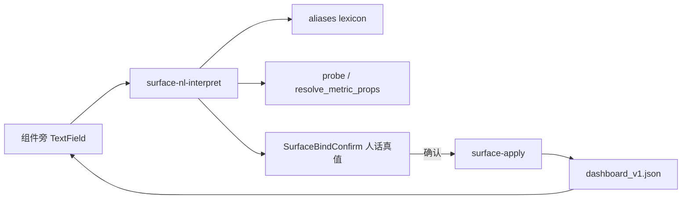
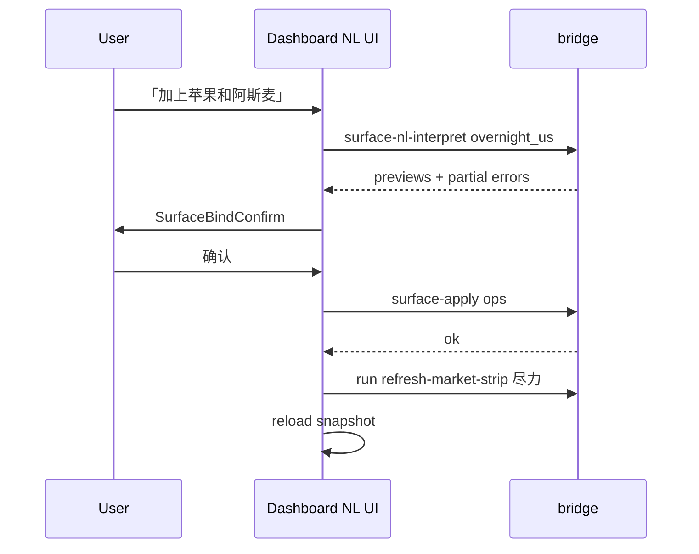

# Dashboard NL Binding - Plan

> **产品目标** 钉死于 Product Contract；**实现 HOW** 见 Planning Contract 与 Implementation Units（本 enrichment）。  
> 001 = L-Shell 底座（已 merge）；本计划 = **档 A 受控 NL 主路径**。档 B 开放绑定不在本执行范围。

---

## Goal Capsule

- **Objective:** 在盯盘页形态不变前提下，以**组件旁自然语言**为主路径完成：① 隔夜用户追加/移除；② 指标小卡切换已登记 metric——不经列表点选 code、不经菜单点选 metric_id，不必懂表结构；预览真值后人确认落盘。
- **Authority hierarchy:** Product Contract（本文件）> 001 工程底座 > 实现细节。
- **Foundation:** `2026-07-28-001` 的 `kss/ui_surface/`、`surface-*` bridge、写闸、chip/card 壳。
- **Execution profile:** Standard；Python 解析单测优先；Swift 组件旁输入 + 预览确认；可选增强 Seesaw 确认弹层。
- **Stop conditions:** S1–S5 / AE1–AE7 未过不得宣称 NL 低代码完成；档 B 未做不得宣称开放绑定。
- **Out of scope for this execution:** 档 B catalog 开放绑定、自由布局、任意 SQL 灌 UI、A 股跑马灯 region 扩展。

**Product Contract preservation:** Product Contract **unchanged in meaning**（R/F/AE/S 保持）；enrichment 只关闭 HOW 问题并增加 Planning/Units。原 Open Questions for Planning 已在 KTD 中裁决。

---

## 与 001 的关系（防止再次误读）

| 层级 | 001（已 merge） | 本计划（档 A） |
|------|-----------------|----------------|
| L-Shell | ✅ | 复用 |
| L-Bind | 窄白名单 + code 探针 | 同契约 + **别名/意图解析** |
| L-NL 主 UX | 列表/菜单 | **组件旁 NL + 真值预览确认** |
| 验收 | 点选可配 | S1–S5：不说 code/id 也能完成 |

---

## Product Contract

### Summary

Solo 用户在盯盘页对着「隔夜美股」或「指标小卡」用中文描述需求，系统解析为合法绑定草案，**展示代码算出的真值预览**，确认后写入既有 surface 配置；组件皮不变。候选列表与 metric 菜单仅兜底。

### Problem Frame

001 落地后主路径是列表/菜单，与 NL 低代码意图相反；工具挂在 Seesaw 却无组件旁闭环，对用户等于没做 NL。开放任意指标无契约会破坏数字纪律，故本执行只做**档 A 受控 NL**。

### Key Decisions（产品，钉死）

- KD1. 主路径 = 自然语言绑定（组件旁 NL）。Governs R1, R2, R10.
- KD2. 点选是兜底，不是完成定义。Governs R3, R11.
- KD3. 形态锁死。Governs R4.
- KD4. 数字纪律：预览/卡面数字只来自代码；确认须人话真值。Governs R5, R6, R12, R18.
- KD5. 档 A 必须交付；档 B 路线图不阻塞。Governs R7–R9, R13.
- KD6. 默认隔夜名单不可 NL 删。Governs R14.
- KD7. 写须人在环确认。Governs R15.

### Actors

- A1. Solo operator  
- A2. 绑定解析器（**档 A：确定性代码**）  
- A3. surface apply / refresh  

### Key Flows

- F1. 隔夜 NL 追加 → 解析 → 探针 → 真值预览 → 确认 → apply（允许多标的部分成功预览）。  
- F2. 隔夜 NL 移除用户项；默认项拒绝。  
- F3. 小卡 NL 切换已登记 metric。  
- F4. 消歧 ≤3 候选。  
- F5. 兜底点选仍写同一 schema。

### Requirements

**主路径**

- R1. 隔夜区组件旁 NL 入口（非仅 Seesaw）。
- R2. 指标小卡组件旁 NL 入口。
- R3. 列表/菜单兜底，同 apply。
- R10. 若保留全局 AI，须预填 region；空白聊天不算完成。

**档 A 绑定**

- R7. 中文名/英文名/ticker → code；一句多标的。
- R8. 已登记 metric 语义 + 同义词（至少 001 四指标）。
- R9. 未登记指标失败大声 + 可说示例。
- R13. 档 B 不纳入本执行验收。

**预览确认**

- R5. apply 前预览；数字来自代码。
- R6. 人话确认 UI，禁止仅 JSON。
- R15. 未确认不落盘。
- R16. 歧义须消歧。

**继承**

- R4 形态；R12 禁北向小卡；R14 默认不可删；R17 STATE_ROOT；R18 数字纪律；R11 反假完成表述。

### Acceptance Examples

- AE1–AE7：同 requirements 原文（F1 追加苹果、预览非 JSON、移除/拒默认、NL 换封板率、未登记失败、拒北向、无组件旁 NL 即未完成）。

### Success Criteria

- S1–S5：同 requirements 原文。

### Scope Boundaries

**In（本执行）:** 档 A 全链路；`surface-nl-interpret`；组件旁输入+预览确认；别名表；部分失败预览；可选 WriteConfirm 真值增强；region 预填 AI。  

**Roadmap 档 B / 扩 region:** 另立项。  

**Out:** 自由布局、任意 SQL UI、买卖建议、用菜单冒充完成。

### Dependencies

- D1. 001 `surface-apply` / config schema。  
- D2. 写闸与数字纪律。  
- A1. metric 登记表初始 = 001 + 同义词。  
- A2. 探针失败可感知。

---

## Planning Contract

### Key Technical Decisions（HOW，本 enrichment 裁决）

- KTD1. **档 A 意图解析 = 确定性代码优先，不经 LLM。**  
  `(session-settled: user-approved — enrichment default for 可控验收)`  
  动词/分隔/别名表/登记 metric 同义词全部代码化；单测可钉死「加上苹果」→ AAPL。LLM 不进入档 A 主路径，避免数字与实体幻觉。复杂句失败时返回可说示例，不静默降级到菜单。  
  *关闭原 OQ1：* 组件旁 = **内联输入 + 本地/ bridge 确定性解析**，不是每句打满 agent turn。全局 AI 仅为可选增强（R10）。

- KTD2. **新读命令 `surface-nl-interpret`。**  
  入参：`region` ∈ {`overnight_us`,`strip_metric`} + `text`（用户原句）。  
  出参：`{ ok, action, items[]|metric, previews[], ambiguities[], error, suggestions[] }`；**不落盘**。  
  落盘仍只走既有 `surface-apply`（写闸不变）。Swift 主路径：interpret → 本地确认 sheet → apply。

- KTD3. **同义词/别名 = 代码常量模块。**  
  `(关闭原 OQ2)`  
  `kss/ui_surface/aliases.py`（或 `nl_lexicon.py`）：标的别名 → code/kind；metric 别名 → metric_id。热更新非 v1 范围；改表发版 + 单测。

- KTD4. **一句多标的：部分成功预览。**  
  `(关闭原 OQ3)`  
  每个实体独立探针；预览列出成功项 + 失败项原因；用户确认后 **只 apply 成功项**（或提供「仅应用成功」默认）。整单拒绝不作默认。

- KTD5. **档 B 单独立项。**  
  `(关闭原 OQ4)`  
  本计划执行范围不含 catalog 开放绑定。

- KTD6. **组件旁确认 = 专用 `SurfaceBindConfirm` sheet（人话真值）。**  
  展示：操作摘要、每行 name/code/close/pct 或 metric 标题+valueText/reason。  
  复用 theme/card 风格；**不**把 raw ops JSON 当唯一确认面。  
  Seesaw 路径：增强 `WriteConfirmView`/`PendingWriteConfirm` 可选 `truthRows` 字段（与组件旁同结构），满足 R6 于 AI 路径。

- KTD7. **解析流水线（overnight）。**  
  1) 规范化空白/中英文逗号/「和」「与」；2) 识别动作 append|remove|clear_mine（关键词：加/加上/添加/加入 vs 去掉/删除/移除 vs 清空我的）；3) 剩余片段查别名表 + 直接 CODE_RE；4) 未命中 → ambiguities 或 error；5) append 调既有 `probe_overnight_code`；6) remove 只匹配当前用户 append。

- KTD8. **解析流水线（strip_metric）。**  
  1) 识别 set_metric；2) 别名表命中 metric_id；3) 北向类拒绝；4) `resolve_metric_props(strip, id)` 填预览。

- KTD9. **apply 后刷新。**  
  组件旁确认成功后：Swift 调 `surface-apply`，再 **尽力** `run refresh-market-strip`（与 001 `+` 路径一致）；UI 在 pending 时保持「待刷新」。  
  **不**把 refresh 塞进 `surface-apply` 的 chat 确认语义（apply 只改配置）。

- KTD10. **不双真源。**  
  NL 不写 AppStorage；只写 `dashboard_v1.json` via apply。

### High-Level Technical Design

### Assumptions（HOW）

- 档 A 不引入新 LLM 依赖即可验收；若未来要 LLM 兜底，须另开变更且不得削弱 R18。
- `surface-nl-interpret` 放 subprocessOnly（可能探针外网），与 propose/apply 一致。

### Sequencing

U1 → U2 → U3/U4 并行 → U5 → U6（验收与文案）。

---

## Implementation Units

### U1. 别名表 + 确定性 NL 解析核

- **Goal:** 纯 Python：utterance+region → 结构化 draft（无 I/O 落盘；探针可注入）。
- **Requirements:** R7, R8, R9, R12, R14, R16, R18；KTD1, KTD3, KTD4, KTD7, KTD8
- **Dependencies:** None（复用 `probe_overnight_code` / `METRIC_CATALOG` / `default_codes`）
- **Files:**
  - create: `kss/ui_surface/aliases.py`
  - create: `kss/ui_surface/nl_interpret.py`
  - create: `kss/tests/test_ui_surface_nl_interpret.py`
- **Approach:**
  1. 标的别名：至少 苹果→AAPL、阿斯麦→ASML、英伟达→NVDA、纳指/纳斯达克→IXIC（IXIC 为默认码时 append 应失败并说明已是默认）等；覆盖候选表常见中文名。
  2. metric 别名：最高连板/连板高度→limit_max_board；封板率→limit_seal_rate；科创50→index_kcb50；创业板/创业板指→index_cyb。
  3. `interpret(region, text, *, config, market_strip, probe_fn=...)` 返回统一 draft。
  4. 多实体 partial：items 带 status ok|failed|ambiguous。
- **Patterns:** `resolve.py` / `config.py` 纯函数风格。
- **Test scenarios:**
  - 「加上苹果」→ overnight_append AAPL
  - 「苹果和英伟达」→ 两项 append draft
  - 「去掉苹果」且 append 含 AAPL → remove
  - 「去掉纳斯达克」且为默认 → error 不可删默认
  - 「改成封板率」→ set_strip_metric limit_seal_rate
  - 「北向五日均」→ ok=false + suggestions
  - 「小卡显示北向」→ 拒绝北向
  - 歧义名（若表内构造）→ ambiguities 长度≤3
  - mock probe：一成一败 → partial previews
- **Verification:** `pytest kss/tests/test_ui_surface_nl_interpret.py` 全绿

### U2. Bridge：`surface-nl-interpret`

- **Goal:** 把 U1 暴露为只读 bridge 命令；orientation 不漂移。
- **Requirements:** R5, R15；KTD2
- **Dependencies:** U1
- **Files:**
  - modify: `scripts/kss_app_bridge.py`（COMMANDS + dispatch + `_surface_nl_interpret`）
  - modify: `kss/tests/test_bridge_ui_surface.py` 或新建 `kss/tests/test_bridge_surface_nl.py`
- **Approach:**
  1. 命令名 `surface-nl-interpret`，args: REGION TEXT。
  2. 读 load_config + _market_strip，调 interpret，返回 JSON。
  3. **不在** WRITE_COMMANDS。
  4. subprocessOnly 由 Swift 侧登记（U3）。
- **Patterns:** `surface-propose` 只读、不落盘。
- **Test scenarios:**
  - 命令在 COMMANDS 且非 WRITE
  - dispatch 对「加上苹果」返回 ok 预览结构
  - 坏 region 返回 error
  - 不创建/修改 dashboard_v1.json
- **Verification:** bridge 单测绿；orientation 守卫绿

### U3. Swift：隔夜组件旁 NL + SurfaceBindConfirm

- **Goal:** 隔夜区主路径 NL 闭环（S1/AE1/AE2/AE3）。
- **Requirements:** R1, R5, R6, R7, R14, R15, R16；KTD6, KTD9
- **Dependencies:** U2
- **Files:**
  - modify: `Sources/KSSDesktop/Views/DashboardView.swift`（`OvernightUSSection`）
  - modify: `Sources/KSSDesktop/Models/KSSModels.swift`（interpret/confirm 模型）
  - modify: `Sources/KSSDesktop/Services/BridgeClient.swift`（`surfaceNlInterpret` + subprocessOnly）
  - modify: `Tests/KSSDesktopTests/DashboardSurfaceConfigTests.swift`（解码 interpret 响应）
- **Approach:**
  1. 标题行下增加 TextField +「解析」/回车提交。
  2. 调 interpret → 若 ambiguities 先消歧 UI。
  3. `SurfaceBindConfirm` sheet：人话行项目；确认 → apply → reload → 尽力 refresh-market-strip。
  4. 保留 `+` 列表为次要。
- **Patterns:** 001 OvernightUSSection popover；Settings 搜索框。
- **Execution note:** 解码与 apply 路径单测；全链路真机 smoke。
- **Test scenarios:**
  - interpret 响应 Codable
  - 确认模型字段含 close/pct/valueText
  - Covers AE1/AE2 手工清单
- **Verification:** `swift test --filter DashboardSurfaceConfig`；真机 S1

### U4. Swift：指标小卡组件旁 NL

- **Goal:** 小卡 NL 切换已登记 metric（S2/AE4/AE5/AE6）。
- **Requirements:** R2, R8, R9, R12；KTD6, KTD8
- **Dependencies:** U2
- **Files:**
  - modify: `Sources/KSSDesktop/Views/DashboardView.swift`（`MarketStripRow` metric 区）
  - 复用 U3 `SurfaceBindConfirm`
- **Approach:**
  1. 小卡上/旁 TextField「用中文换指标…」。
  2. interpret strip_metric → 预览 valueText → 确认 apply set_strip_metric。
  3. 菜单保留兜底。
- **Test scenarios:**
  - 「封板率」映射解码
  - 北向拒绝文案
- **Verification:** 与 U3 同测包 + 真机 S2

### U5. Seesaw 路径增强（可选但建议同 PR）

- **Goal:** 满足 R10/R6 在 AI 路径：region 预填 + 确认弹层真值行。
- **Requirements:** R6, R10；KTD6
- **Dependencies:** U2
- **Files:**
  - modify: `Sources/KSSDesktop/Views/DashboardView.swift`（AI 钮带 region 上下文到 store/chat）
  - modify: `Sources/KSSDesktop/Models/KSSModels.swift`（`PendingWriteConfirm` 可选 truth rows）
  - modify: `Sources/KSSDesktop/Views/AIChatView.swift`（`WriteConfirmView` 渲染 truth）
  - modify: `Sources/KSSDesktop/Services/KSSStore.swift`（若需 draft 首条用户消息）
  - modify: `kss/config/chat_system_prompt.md`（强调组件旁为主、chat 为辅）
- **Approach:**
  1. 隔夜/小卡 AI 钮：打开 Seesaw 并插入系统/用户前缀「region=overnight_us，请用 surface 工具…」。
  2. surface-apply 的 confirm_required 若 tool 结果带 previews，映射到 truth rows。
  3. 无 truth 时仍显示 effect 文案，但不回退为「已满足 AE2」——AE2 以组件旁为准。
- **Test scenarios:**
  - PendingWriteConfirm 含 truthRows 时 View 可解码（若可测）
- **Verification:** 手工：从 AI 钮进入有 region 提示；写确认可见价（若链路带上）

### U6. 验收钉扎与反假完成

- **Goal:** 测试与文档表述对齐 S1–S5 / AE7。
- **Requirements:** R11, S5
- **Dependencies:** U3, U4
- **Files:**
  - modify: `kss/tests/test_ui_surface_nl_interpret.py`（补齐边界）
  - modify: 本计划无需改 001 历史表述；若 README/设置文案提及 surface，改为诚实措辞
  - optional: `docs/solutions/dashboard_nl_binding.md`（compound 可选）
- **Approach:**
  1. 固定验收清单脚本或测试模块 docstring。
  2. PR 模板对照 S1–S5。
- **Verification:** 全量相关 pytest + Desktop 解码测 + 真机清单全勾

---

## Verification Contract

| Gate | 命令/动作 | 证明 |
|------|-----------|------|
| 解析核 | `pytest kss/tests/test_ui_surface_nl_interpret.py -q` | U1 |
| Bridge | `pytest kss/tests/test_bridge_ui_surface.py kss/tests/test_bridge_orientation.py -q` | U2 |
| Desktop | `swift test --filter DashboardSurfaceConfig` | U3/U4 模型 |
| 真机 S1 | 隔夜 NL 追加+移除，不经列表 | AE1–AE3 |
| 真机 S2 | 小卡 NL 切换，不经菜单 | AE4–AE6 |
| 真机 S3 | 确认面为人话真值 | AE2 |
| 反假完成 | 无组件旁 NL 的构建不得标完成 | AE7 |

---

## Definition of Done

- U1–U4 必达；U5 建议同交付；U6 文案诚实。  
- S1–S5 真机通过。  
- 档 B 未做且未宣传。  
- 无第二配置真源；数字不经 LLM。  
- 可对外称「盯盘 NL 绑定（受控档 A）」，不得单独称「开放低代码任意指标」。

---

## Risks & Dependencies

| Risk | 缓解 |
|------|------|
| 中文分词过简漏实体 | 别名表 + 「和/与/,/，」分割；失败给 suggestions |
| 别名表不全 | 单测黄金句；用户可用兜底列表 |
| 探针慢 | interpret 超时提示；subprocessOnly |
| 与 001 菜单双入口混乱 | UI 文案：NL 主、列表次 |
| 假完成 | AE7 + DoD 红线 |

---

## System-Wide Impact

- 新只读 bridge 命令进入 orientation/MCP 读平价（建议 MCP 注册 `surface_nl_interpret` 只读）。  
- `surface-apply` 写闸与 MCP 不暴露写 保持 001 策略。

---

## Open Questions

无阻塞产品/ HOW 问题。档 B 立项时新开计划。

---

## 给实现者的红线

1. 不得只加菜单宣称完成。  
2. 不得以「Seesaw 能调 tool」代替组件旁 NL。  
3. 不得 LLM 填预览主值。  
4. 未登记指标必须失败大声。  
5. 执行范围 = **档 A only**。

---

## Appendix: 001 复用清单

| 资产 | 路径 |
|------|------|
| 配置 | `kss/ui_surface/config.py` |
| resolve/探针/metric | `kss/ui_surface/resolve.py` |
| apply | `surface-apply` |
| UI 壳 | `OvernightUSSection`, `MarketStripRow` |
| 写闸 | WRITE_COMMANDS + request_write |
