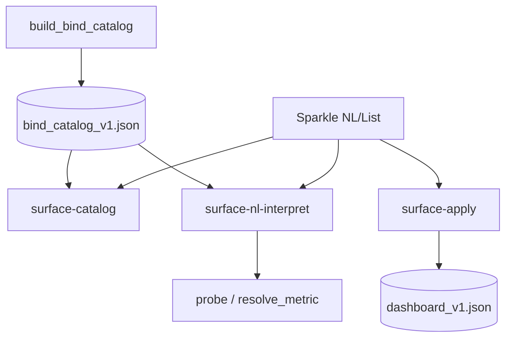
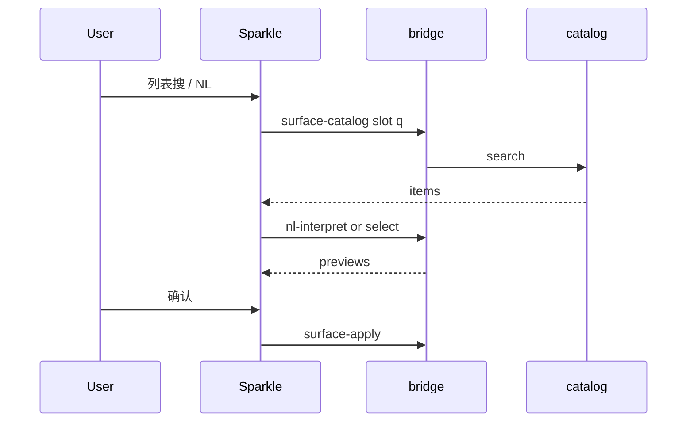

# Dashboard Open Binding（档 B）- Plan

> **产品目标** 钉死于 Product Contract；**实现 HOW** 见 Planning Contract 与 Implementation Units（本 enrichment）。  
> **本执行范围：** **B0–B4**（目录契约 → 热指标 → 美股/ETF → A 股 → H 股）。  
> **B5 KSS 算法 / B6 LLM 意图** 仍在北极星，**不在本执行验收**（另开里程碑）。  
> 底座：001 L-Shell + 003 档 A（Sparkle、`surface-nl-interpret`、真值确认、`surface-apply`）。

---

## Goal Capsule

- **Objective:** 将盯盘可绑空间从静态短名单升级为 **Bind Catalog**：本执行交付 **B0–B4**——目录驱动 + 热指标扩展 + 美股/ETF 宇宙 + A 股宇宙 + H 股宇宙；NL 与列表共用目录；确认后写 surface；数字只来自代码。
- **Authority hierarchy:** Product Contract（本文件）> 003 交互壳 > 001 写闸与 schema。
- **Foundation:** `kss/ui_surface/*`、`surface-*` bridge、`DashboardSparkleControl`、`dashboard_v1.json`。
- **Execution profile:** Standard；Python catalog + probe 单测优先；Swift 接 catalog 列表/筛选；分域可合并 PR 但验收按域勾选。
- **Stop conditions:** 未上 catalog 契约不得称开放绑定；B0–B4 未过不得称「全市场可绑」；B5/B6 未做不得写入完成叙事。
- **Out of scope for this execution:** B5 算法指标、B6 LLM 路由、自由布局、任意 SQL UI、002 signal-card 槽实现（仅预留 `allowed_slots`）。

**Product Contract preservation:** Product Contract **unchanged in meaning**（R/P/AE/S 与 KD-B1～B3 保持）；enrichment 关闭 HOW 并增加 Units。用户已批准 KD-B1～B3 与执行范围 **B0–B4**。

---

## 与 档 A / 001 的关系

| 层 | 001 | 003 档 A | 本计划 档 B（B0–B4） |
|----|-----|----------|---------------------|
| L-Shell | ✅ | 复用 | 复用 |
| L-Bind | 窄白名单 | 同 + 别名 | **Bind Catalog** |
| L-NL | 无 | 确定性 | 目录检索（本执行 **无 LLM**） |
| 验收 | 点选可配 | 四指标 + 短表 | 分域清单 B0–B4 |

**档 A 不废弃：** 最小子集与回归基线；catalog 生成物须覆盖档 A 黄金句。

---

## Product Contract

### Summary

Solo 用户在盯盘页对绑定槽打开 Sparkle：NL 或目录浏览，从 **Bind Catalog** 选出标的/指标，**代码真值预览**后确认写入 surface。不必懂 metric_id / 表结构。

### Problem Frame

档 A 管道已通，可绑空间过窄。产品化要求：**灵活 = 目录可长可检索**；**纪律 = 未登记/无真值路径不可绑、主值不经 LLM**。

### Product Principles

| ID | 原则 |
|----|------|
| P1 | 形态锁：改绑数据，不改自由布局 |
| P2 | 目录即真理：NL / 列表 / AI 辅助同一宇宙 |
| P3 | 数字纪律：主值只来自 resolve/probe |
| P4 | 槽位资格：`allowed_slots`；北向禁小卡 |
| P5 | 失败大声 + 域上线状态 |
| P6 | 人在环确认；批量可部分成功 |
| P7 | 分期诚实：分域完成才可对外宣称 |

### Key Decisions（产品，用户已批准）

- KD-B1. 小卡只绑「单主值可卡片化」指标。  
- KD-B2. 隔夜 marquee 以标的为主；算法默认不进跑马灯。  
- KD-B3. 全量进目录 ≠ 默认名单；用户 append 有上限。  
- KD1–KD7（003）：组件旁 NL 主路径、点选兜底、形态锁、数字纪律、默认名单不可删、人在环——**继承**。

### Actors

- A1 Solo · A2 绑定解析器（目录检索）· A3 Catalog 构建 · A4 apply/refresh  

### Key Flows

- F1 Sparkle NL → 目录 0～3 → 消歧/预览 → 确认 → apply  
- F2 Sparkle 列表：市场/kind 筛选 + 搜索 → 预览 → 确认  
- F3 多实体部分成功  
- F4 目录未命中：失败 + 域状态  
- F5 MCP 只读 catalog / propose  

### Requirements

**范围（本执行 B0–B4 必须推进；B5/B6 北极星不验收）**

- R1. 标的：美股/ETF、A 股、H 股（B2–B4）；以可探针真值为 active 门闩。  
- R2. 指标：热指标 M1–M3（B1）；M4 算法本执行不验收。  
- R3. 主路径 Sparkle；不靠手改 JSON。  

**目录与槽位**

- R4. Bind Catalog 唯一可绑真源（字段见信息架构）。  
- R5. 槽位：`overnight_marquee`（配置键仍可 `overnight_us`）、`strip_metric`。  
- R6. `allowed_slots` 门闩；北向禁 strip_metric。  
- R7. 列表 Tab 筛选 + 搜索。  

**NL**

- R8. 输出只能是 catalog 项或失败。  
- R9. 确定性 + 目录检索；**本执行 LLM 默认关**（B6）。  
- R10. 消歧 ≤3。  

**真值与写**

- R11. 预览必 probe/resolve。  
- R12. apply 兼容 001/003 ops；kind/schema 扩展须版本化。  
- R13. 默认隔夜名单不可删。  
- R16. 用户 append 上限（见 KTD）。  

**表述**

- R14. 禁止 B1 完成称全市场。  
- R15. UI 展示已上线域。  

### Acceptance Examples

- AE1 档 A「科创50」回归。  
- AE2 「上证/A50」在 B1 后可绑小卡。  
- AE3 「加上贵州茅台」在 B3 后可绑隔夜。  
- AE4 列表筛选与 NL 同目录。  
- AE5（B5 外）算法项本执行可不测。  
- AE6 北向绑小卡拒绝。  
- AE7 确认面人话真值。  
- AE8 无 Sparkle/目录浏览不得称档 B。  
- AE9 H 股代码在 B4 后可搜可绑（探针可用时）。  
- AE10 超 append 上限失败大声。  

### Success Criteria（本执行 B0–B4）

- S1 Catalog 可生成/加载；bridge 可列举/搜索。  
- S2 B1 热指标 + B2 美股/ETF + B3 A 股 + B4 H 股 分域端到端可绑（H/A 以探针可用为 active）。  
- S3 NL 与列表集合一致。  
- S4 数字纪律：无 LLM 主值。  
- S5 文案分域诚实；不宣称 B5/B6 完成。  

### Scope Boundaries

**In（B0–B4）:** Catalog 模型与生成；bridge catalog API；Sparkle 接目录；热指标 resolve 扩展；美股/ETF/A/H 标的目录与探针路由；append 上限；域状态文案；MCP 只读 catalog。  

**Roadmap:** B5 KSS 算法、B6 LLM 意图、002 槽实现。  

**Out:** 自由布局、任意 SQL UI、荐股、假全量目录。  

### Dependencies

| ID | 依赖 |
|----|------|
| D1 | 001/003 surface + Sparkle |
| D2 | `storage/macro/stock_name_index.json` / `kss.storage.stock_names`（A 股） |
| D3 | yfinance / index_global / longbridge 探针路径 |
| D4 | `refresh_market_strip` 指数与 limitBoard |
| D5 | HK 报价路径（longbridge 或既有） |
| D7 | data_catalog 可选参考，**可绑 ≠ 全库暴露** |

### Assumptions

- A1 全量 = 可标识 + 可预览真值，非全球名义列表。  
- A2 H/部分美股探针可 degraded；degraded 不进 active 可选或标 degraded。  
- A4 Catalog 物化策略见 KTD3。  

---

## 产品信息架构

### Bind Slot

| slot_id | UI | 绑定物 |
|---------|-----|--------|
| `overnight_marquee` | 隔夜 chip | 标的 |
| `strip_metric` | 指标小卡 | 单值指标 |

配置兼容：`overnight_us.append`、`strip_metric.metric_id` 保持；slot 名在 catalog/API 用逻辑 id。

### Catalog 项字段

```text
id, kind, market, codes{}, names[], aliases[],
allowed_slots[], resolve_ref, status, provenance, domains[]
```

`domains[]` 例：`metric_hot` / `equity_us` / `equity_cn` / `equity_hk` — 供 UI「已上线域」。

### NL 流水线（B0–B4）

```text
utterance + slot
  → 档 A 动词/分隔
  → catalog 检索（精确 code → 别名 → 名称包含；槽位过滤）
  → 0 / 1 / 2–3
  → probe/resolve → 确认 → apply
```

---

## Planning Contract

### Key Technical Decisions（HOW，本 enrichment 裁决）

- **KTD1. 配置键保留 `overnight_us`，多 market 靠 `kind` 扩展。**  
  `(session-settled: user-approved — B0–B4 不强制改文件名)`  
  `ALLOWED_KINDS` 扩展：`yfinance` | `index_global` | `a_share` | `hk`（实现名可微调，须单测钉死）。CODE_RE 放宽至可表达 `600519.SH` / `00700.HK` 等（或分 kind 校验）。  
  *关闭原 HOW-1。*

- **KTD2. A 股探针：优先 Longbridge 只读 quote（若凭证可用），否则日线/cs 最新收盘；失败则 pending chip 可确认写入（与 001 pending 语义一致）。**  
  `(session-settled: user-approved 产品侧「有真值才 active」；pending 仅用户显式确认后)`  
  H 股同构优先 longbridge。  
  *关闭原 HOW-2。*

- **KTD3. Catalog 物化：`STATE_ROOT/storage/ui_surface/bind_catalog_v1.json`；生成器脚本 + 启动/日更可重建；运行时读缓存。**  
  缺文件时 fallback 内存生成最小集（档 A + 内建热指标），fail-loud log。  
  *关闭原 HOW-3。*

- **KTD4. 用户 overnight append 上限 `MAX_APPEND = 24`（现 8）；超额 `limit_exceeded`。**  
  *关闭原 HOW-4。*

- **KTD5. B0–B4 无 LLM 路由。**  
  *关闭原 HOW-5。*

- **KTD6. 002 signal-card 仅 `allowed_slots` 预留，本执行不实现槽。**  
  *关闭原 HOW-6。*

- **KTD7. `surface-catalog` 只读 bridge：**  
  入参：`slot` + 可选 `q` / `market` / `kind` / `domain` / `limit`。  
  出参：`{ ok, domains_online[], items[], total }`。不落盘。

- **KTD8. NL 与列表统一 `catalog.search(slot, q, …)`；**  
  `nl_interpret` 改为：命中 catalog → probe；档 A 别名表可收编为 catalog 生成源，避免双真源。

- **KTD9. 热指标（B1）resolve：**  
  指数类：从 market_strip `indexBoard` / `indices` / `indexStacks` 按 code 取 close/pct；宽度类：`limitBoard` 扩展字段（涨停家数、破板率等已有则映射，缺则 degraded）。  
  A50：`XIN9` 等走 strip 或 index_global 探针填 props。

- **KTD10. 域在线状态：**  
  `domains_online` 由生成器写入（如 `metric_hot`, `equity_us`, `equity_cn`, `equity_hk`）；Sparkle 空态/失败文案引用。

### High-Level Technical Design





### Sequencing

U1（B0 核）→ U2（bridge catalog）→ U3（NL 目录化 + 回归）→ U4（Sparkle 接目录）→ U5（B1 热指标）→ U6（B2 美股/ETF）→ U7（B3 A 股）→ U8（B4 H 股）→ U9（域文案 + 验收钉扎）。

可并行：U5 与 U6 在 U3 后；U7 与 U8 在 U6 后可并行。

---

## Implementation Units

### U1. Bind Catalog 模型 + 生成器 + 最小集

- **Goal:** 可序列化 catalog；生成档 A 子集 + 域元数据；读加载 API。  
- **Requirements:** R4, R5, R6, KTD3, KTD8, KTD10  
- **Dependencies:** None  
- **Files:**
  - create: `kss/ui_surface/bind_catalog.py`
  - create: `scripts/build_bind_catalog.py`
  - create: `kss/tests/test_bind_catalog.py`
  - modify: `kss/ui_surface/__init__.py`（export）
- **Approach:**
  1. 定义 item schema 与 `Catalog` 容器（version、generated_at、domains_online、items）。  
  2. 生成器从 `METRIC_CATALOG` + 档 A 别名 + overnight 默认/候选 产出 items。  
  3. `load_catalog()` 读 STATE_ROOT 路径；缺失则 `build_minimal()`。  
  4. `search(slot, q, market=, kind=, limit=)` 确定性匹配。  
- **Patterns:** `config.py` 纯函数；`build_data_catalog.py` 物化风格。  
- **Test scenarios:**
  - 最小集含 limit_seal_rate 与 AAPL，allowed_slots 正确  
  - search strip_metric「封板」命中  
  - search overnight「苹果」命中 AAPL  
  - 北向 metric 不在 strip 可选或 allowed 不含 strip_metric  
  - 缺文件 fallback 不抛  
- **Verification:** pytest `test_bind_catalog` 绿  

### U2. Bridge / MCP / chat：`surface-catalog`

- **Goal:** 只读暴露 catalog 搜索。  
- **Requirements:** R7, F5, KTD7  
- **Dependencies:** U1  
- **Files:**
  - modify: `scripts/kss_app_bridge.py`
  - modify: `scripts/kss_mcp.py`
  - modify: `scripts/kss_chat_loop.py`
  - modify: `kss/tests/test_bridge_ui_surface.py` 或 `kss/tests/test_bridge_surface_catalog.py`
- **Approach:**
  1. 命令 `surface-catalog`，args：SLOT [Q] [可选 JSON filters]。  
  2. 不在 WRITE_COMMANDS；orientation 登记。  
  3. MCP tool `surface_catalog` 只读。  
- **Test scenarios:**
  - 命令在 COMMANDS 且非 WRITE  
  - dispatch 返回 domains_online + items  
  - 坏 slot 返回 error  
  - 不写 dashboard_v1.json  
- **Verification:** bridge 单测 + orientation 守卫  

### U3. NL interpret 目录化 + 档 A 回归

- **Goal:** interpret 只通过 catalog 解析实体/metric；黄金句仍绿。  
- **Requirements:** R8, R9, R10, AE1, KTD5, KTD8  
- **Dependencies:** U1  
- **Files:**
  - modify: `kss/ui_surface/nl_interpret.py`
  - modify: `kss/ui_surface/aliases.py`（可选：改为 catalog 源注释；或生成器读取）  
  - modify: `kss/tests/test_ui_surface_nl_interpret.py`
- **Approach:**
  1. overnight：token → catalog.search(overnight_marquee) → code/kind → probe。  
  2. strip_metric：utterance → catalog.search(strip_metric) → metric_id → resolve。  
  3. 未命中：error_zh 带 domains_online 提示。  
  4. 多命中：ambiguities ≤3（若 UI 尚未做消歧，可先取唯一最优 + suggestions）。  
- **Execution note:** 先跑通现有黄金句再加目录用例。  
- **Test scenarios:**
  - Covers AE1：改成封板率  
  - 加上苹果 / 去掉默认纳斯达克  
  - 未知指标带 domains 提示  
  - 北向拒绝  
- **Verification:** nl_interpret 全绿  

### U4. Swift：Sparkle 接 surface-catalog

- **Goal:** 列表 Tab 真目录；筛选/搜索；域状态文案。  
- **Requirements:** R3, R7, R15, AE4, AE8  
- **Dependencies:** U2  
- **Files:**
  - modify: `Sources/KSSDesktop/Support/Components.swift`（DashboardSparkleControl / list）
  - modify: `Sources/KSSDesktop/Services/BridgeClient.swift`
  - modify: `Sources/KSSDesktop/Models/KSSModels.swift`（catalog DTO）
  - modify: `Sources/KSSDesktop/Views/DashboardView.swift`（metric/overnight 列表数据源）
  - modify: `Tests/KSSDesktopTests/DashboardSurfaceConfigTests.swift`
- **Approach:**
  1. `surfaceCatalog(slot:q:…)` subprocessOnly。  
  2. 列表 Tab 调 catalog；metric 用 metric 项；overnight 用 equity/etf 项。  
  3. 展示 domains_online 一行（已上线域）。  
  4. 选中后仍走现有预览/apply。  
- **Test scenarios:**
  - catalog JSON 解码  
  - 空 q 返回有 items  
- **Verification:** Desktop 解码测 + 真机列表可搜  

### U5. B1 热指标扩展（M2+M3）

- **Goal:** 小卡可绑常用指数与宽度指标。  
- **Requirements:** R2, AE2, KTD9  
- **Dependencies:** U1, U3  
- **Files:**
  - modify: `kss/ui_surface/resolve.py`（METRIC_CATALOG + resolve_metric_props）
  - modify: `scripts/build_bind_catalog.py` / `bind_catalog.py` 生成源  
  - modify: `kss/tests/test_ui_surface_resolve.py`
  - modify: `kss/tests/test_ui_surface_nl_interpret.py`
- **Approach:**
  1. 登记：上证 `000001.SH`、深成 `399001.SZ`、创业板/科创（已有）、A50 `XIN9` 或 strip 内等价、可选恒生若 strip 有。  
  2. 宽度：涨停家数/破板率等从 limitBoard 映射（有字段才 active）。  
  3. NL「上证指数」「富时A50」「A50」→ 对应 metric_id。  
- **Test scenarios:**
  - Covers AE2：A50 / 上证 命中且 props 有 valueText 或 reason  
  - 北向仍拒绝  
  - 档 A 四指标回归  
- **Verification:** resolve + nl 测绿  

### U6. B2 美股/ETF 宇宙

- **Goal:** 隔夜可搜可绑超出静态 _EXTRA 的美股/ETF（在可探针前提下）。  
- **Requirements:** R1, AE4  
- **Dependencies:** U1, U3  
- **Files:**
  - modify: `kss/ui_surface/bind_catalog.py` / build 脚本（US/ETF 源表）
  - modify: `kss/ui_surface/resolve.py`（probe 保持 yfinance）
  - create 或 extend: 候选/别名数据源（代码常量或 yaml 在 `kss/ui_surface/`）  
  - modify: tests  
- **Approach:**
  1. 扩展 US 股票+ETF 种子集（常用流动性标的，可分期加大；**全量美股**以可维护种子 + 精确 ticker 直绑：CODE 命中 catalog 或 yfinance 探针成功则 **动态 active 项**）。  
  2. KTD：精确 ticker 在 overnight 槽：catalog 未收录但 CODE_RE+probe ok → 允许 ad-hoc bind（写入时 kind=yfinance），避免「只有名单内」。  
  3. 中文别名继续 aliases/catalog。  
- **Test scenarios:**
  - 精确 TSLA/AMD 探针路径  
  - 未知乱码失败  
  - MAX_APPEND 仍生效  
- **Verification:** probe + nl + catalog search  

### U7. B3 A 股宇宙

- **Goal:** 中文名/ts_code 绑入隔夜 append。  
- **Requirements:** R1, AE3, AE10, KTD2, KTD4  
- **Dependencies:** U1, U3  
- **Files:**
  - modify: `kss/ui_surface/bind_catalog.py`（注入 name_index / stock_names）
  - modify: `kss/ui_surface/config.py`（MAX_APPEND=24, ALLOWED_KINDS, CODE_RE）
  - modify: `kss/ui_surface/resolve.py`（`a_share` probe）
  - modify: `kss/ui_surface/nl_interpret.py`
  - create: `kss/tests/test_bind_catalog_cn.py`
- **Approach:**
  1. 从 `stock_name_index.json` 或 `kss.storage.stock_names` 生成 equity_cn 项（id 稳定、codes.ts_code）。  
  2. 大表：search 必须索引化（前缀/精确），禁止全表扫到 UI 超时；limit 默认 50。  
  3. probe：longbridge → 日线 fallback → pending。  
  4. 展示：chip 显示中文名 + 价。  
- **Test scenarios:**
  - Covers AE3：贵州茅台 / 600519.SH  
  - 超 MAX_APPEND  
  - 默认 IXIC 仍不可删  
- **Verification:** cn 测绿；手工一条茅台  

### U8. B4 H 股宇宙

- **Goal:** 港股代码/常见名可搜可绑。  
- **Requirements:** R1, AE9, KTD2  
- **Dependencies:** U1, U3  
- **Files:**
  - modify: catalog 生成（HK 源：longbridge 可覆盖列表或静态热门 + 精确代码）  
  - modify: `resolve.py`（`hk` probe via longbridge）  
  - modify: tests  
- **Approach:**
  1. kind=`hk`；code 形式 `00700.HK` 等与 longbridge 对齐。  
  2. 精确代码 + probe ok 允许 ad-hoc（同 U6）。  
  3. 凭证缺失：domain equity_hk degraded，文案诚实。  
- **Test scenarios:**
  - mock probe 腾讯  
  - 无凭证 degraded 不静默成功  
- **Verification:** 单测 + 有凭证真机一条  

### U9. 域文案、上限与验收钉扎

- **Goal:** R14/R15/S5；B0–B4 清单可勾。  
- **Requirements:** R14, R15, S5  
- **Dependencies:** U4–U8  
- **Files:**
  - modify: Sparkle 文案 / 可选 Settings 一行  
  - modify: 本计划 Definition of Done 勾选说明  
  - optional: `docs/solutions/` 不做强制  
- **Approach:**
  1. Sparkle 展示 `domains_online`。  
  2. 失败文案区分「域未上线」vs「无匹配」。  
  3. 文档：本执行完成 = B0–B4，B5/B6 未宣称。  
- **Test expectation:** none — 文案与手工清单  
- **Verification:** 真机清单 AE1–AE4, AE6–AE10  

---

## Verification Contract

| Gate | 证明 |
|------|------|
| Catalog | `pytest kss/tests/test_bind_catalog.py` |
| Bridge | surface-catalog 单测 + orientation |
| NL | `test_ui_surface_nl_interpret` 含 B1 句 |
| Resolve | 热指标 + a_share/hk probe mock |
| Desktop | catalog DTO 解码 |
| 真机 B1 | 小卡 A50/上证 |
| 真机 B2 | 隔夜搜美股 ETF |
| 真机 B3 | 茅台中文 |
| 真机 B4 | 港股一条（有凭证） |
| 反假完成 | 不宣称 B5/全市场算法 |

---

## Definition of Done（本执行 B0–B4）

- U1–U9 完成；档 A 回归绿。  
- domains：`metric_hot`、`equity_us`、`equity_cn` 为 active；`equity_hk` active 或诚实 degraded。  
- Sparkle 列表 = catalog；NL 不发明 id。  
- MAX_APPEND=24；默认名单不可删；北向禁小卡。  
- **不得**宣称 B5 算法绑定或 B6 LLM 完成。  
- 可称：「盯盘开放绑定 B0–B4（目录 + 热指标 + 美/A/H 标的）」。  

---

## Risks & Dependencies

| Risk | 缓解 |
|------|------|
| A 股全表搜索卡顿 | 索引 + limit；禁止无 q 全表刷 UI |
| H/LB 凭证缺失 | domain degraded |
| CODE_RE 过严 | KTD1 分 kind 校验 |
| 双真源 aliases | 生成器单一源 |
| 范围膨胀到 B5 | DoD 红线 |

---

## System-Wide Impact

- 新只读命令 `surface-catalog` → orientation / MCP / chat。  
- `MAX_APPEND` 与 `ALLOWED_KINDS` 行为变更须测旧配置兼容。  
- overnight chip 可能出现 A/H 码，刷新脚本须能识别 kind（pending 可接受）。  

---

## Open Questions

无阻塞产品问题。执行期未知：具体 HK 代码规范化表、A 股索引性能阈值——实现时用测试与 profiling 定，不挡开工。

---

## 给实现者的红线

1. 不得菜单扩选项代替 catalog。  
2. 不得 LLM 填主值。  
3. 不得 B1 完成称全市场。  
4. 不得本 PR 夹带 B5 算法半成品当完成。  
5. 档 A 黄金句必须绿。  

---

## Appendix: 本执行分域清单

| 域 | Phase | 本执行 |
|----|-------|--------|
| Catalog 契约 | B0 | ✅ 必交 |
| 热指标 M2+M3 | B1 | ✅ 必交 |
| 美股/ETF | B2 | ✅ 必交 |
| A 股 | B3 | ✅ 必交 |
| H 股 | B4 | ✅ 必交（可 degraded） |
| KSS 算法 M4 | B5 | ❌ 下里程碑 |
| LLM 意图 | B6 | ❌ 下里程碑 |
