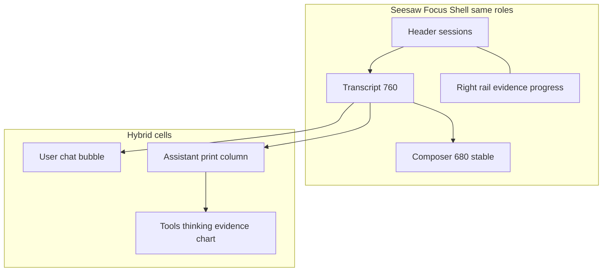

# Seesaw Dialogue Shell Polish - Plan

## Goal Capsule

- **Objective:** Upgrade Seesaw's dialogue shell so side-by-side screenshots read as a mature AI product: **hybrid message rhythm** (chat-style user turns, print-style assistant prose), plus a **same-role chrome restyle** of header / right rail / sidebar / composer density—without changing agent protocol or feature ownership.
- **Product authority:** Product Contract below (from `ce-brainstorm`); `DESIGN.md` Focus Layout and safety rules remain binding.
- **Open blockers:** None.
- **Execution:** `code` (KSSDesktop Seesaw surfaces).
- **Stop conditions:** R10 features unreachable after restyle; new SPM/FlowDown source; agent protocol or write-gate behavior changed.
- **Product Contract preservation:** restructured, no scope change — Product Contract meaning and R/A/F/AE IDs unchanged; planning sections added.

---

## Product Contract

### Summary

Restyle Seesaw as one coherent dialogue shell: **C · hybrid editorial** message rhythm at the center, and a full **visual/density redraw** of chrome that **keeps the same role map** (sessions in header, evidence/progress in right rail, skills near composer). FlowDown is **visual reference only**. Success is a clear before/after screenshot upgrade with zero loss of write-gate, evidence, tools, skills, or models.

### Problem Frame

Seesaw already carries a full agent workspace. The gap is **feel**: internal-tool density and uneven message language. Users want FlowDown-class maturity without adopting FlowDown source or swapping the agent stack.

### Key Decisions

- **KD1. Hybrid message rhythm (C).** User turns use chat-style bubbles; assistant turns use print-style prose without a heavy chat bubble. (session-settled: user-directed — chosen over pure chat-bubble B and status-quo A: investment delivery should read as finished prose.) Governs R1, R2, R4.
- **KD2. Same-role chrome restyle (approach 2).** Header, right rail, global sidebar affordances, and composer may be fully redrawn for density and polish; **control ownership stays**. (session-settled: user-approved — chosen over conversation-column-only and full IA restructure.) Governs R6, R7, R8.
- **KD3. FlowDown visual-only.** No FlowDown / LanguageModelChatUI source or SPM. (session-settled: user-directed — chosen over source replace.) Governs R9.
- **KD4. Protocol and capability freeze.** Agent protocol, write confirm, evidence, skills/memory/models capabilities stay. Governs R10.
- **KD5. Screenshot-first success.** Primary acceptance is side-by-side visual maturity; streaming smoothness is secondary. (session-settled: user-directed.) Governs R11.

### Requirements

**Message rhythm**

- R1. User messages present as **chat-style bubbles** (right-biased or clearly user-owned), distinct from assistant turns at a glance.
- R2. Assistant messages present as **print-style prose columns** (no heavy chat bubble); headings, lists, and tables read as finished copy when content provides them.
- R3. Tool progress, thinking disclosure, evidence drawer, chart attachments, and numbers-unverified labels remain **discoverable next to the assistant turn** without restoring internal-tool card density.

**Markdown / long assistant copy**

- R4. Assistant markdown must support readable hierarchy (headings, lists, quotes, tables, code) consistent with print-style R2. Strategy must not reintroduce nested scroll lock in the transcript for normal turns.
- R5. User-turn short markdown may stay lightweight; assistant path is the quality bar.

**Shell & composer (same roles)**

- R6. Header may be restyled but continues to own **session navigation** and compact execution entry as today.
- R7. Right rail / narrow drawer may be restyled but continues to own **active progress, evidence, live market/context, and related inspector content**.
- R8. Composer keeps a **single stable identity** across empty and hydrated transcripts; light layout changes are in scope; dissolving the input when history loads is not.
- R9. No new third-party chat UI dependency; FlowDown may inform spacing, alignment, and rhythm only.

**Safety & continuity**

- R10. Write-confirm, evidence, tool rows, skills pinning, memory entry, models center, queue/stop, and provenance labels remain functional and reachable after the visual restyle.
- R11. Delivered work must pass a **before/after screenshot comparison** on: empty conversation, active conversation with mixed turns, streaming or tool-in-progress, and at least one long structured assistant answer.

### Actors

- A1. **Primary user** — solo operator using Seesaw as the only in-app AI entry.
- A2. **Seesaw agent runtime** (system) — streams assistant text, tools, evidence; unchanged except as consumer of the same UI contracts.

### Key Flows

- F1. Empty → first send — **Covered by:** R1, R2, R8, R11
- F2. Mixed transcript reading — **Covered by:** R1–R4, R3, R10
- F3. Tool / write path unchanged — **Covered by:** R3, R10

### Acceptance Examples

- AE1. Hybrid rhythm at a glance — **Covers:** R1, R2, R11
- AE2. Structured assistant copy — **Covers:** R2, R4, R5
- AE3. Role map preserved after chrome restyle — **Covers:** R6, R7, R8, R10
- AE4. Composer stability — **Covers:** R8

### Success Criteria

- SC1. Side-by-side screenshots show a clear maturity jump to a non-author reviewer.
- SC2. R10 features remain reachable in one intentional navigation hop each.
- SC3. No new SPM / vendored FlowDown app tree.

### Scope Boundaries

**In scope:** Message rhythm (C), assistant print readability, composer light layout polish, same-role chrome restyle.

**Deferred for later:** Streaming-first engineering as primary KPI; full shell IA restructure; MIT MarkdownView SPM.

**Outside product identity:** Replacing Seesaw with FlowDown source; changing agent protocol or write-gate policy.

### Dependencies / Assumptions

- Focus geometry in `SeesawXcomChrome` (760 / 680) is the starting measure; token tweaks allowed if roles stay.
- Kami / `MarkdownWebView` remains for long-form report surfaces outside the transcript default path.

### Outstanding Questions

**Resolve Before Planning:** none.

**Deferred to Planning / Implementation**

- Exact length threshold or structural heuristic for Kami fallback on assistant bodies (if used).
- Final spacing scale numbers within theme tokens.
- Whether any non-Focus message list path is still reachable in shipping builds; if yes, parity is required under the Assumptions bullet.

### Sources / Research

- `DESIGN.md`, visual probe C selection, prior FlowDown Reject verdict.
- Code: `Sources/KSSDesktop/Views/AIChatView.swift` (`focusMessageCell`, `focusComposer`, `focusHeader`, `focusInspector`), `Support/SeesawMarkdown.swift`, `Support/XcomListChrome.swift`.

---

## Planning Contract

### Key Technical Decisions

- KTD1. **Native-first assistant Markdown in transcript.** Default assistant body uses native `SeesawMarkdown` block rendering (print hierarchy). Kami/`MarkdownWebView` only as fallback for large/complex bodies (tables-heavy or very long). (session-settled: user-approved — chosen over all-Kami assistant path: stream-stable native, print quality via layout tokens.) Governs R2, R4.
- KTD2. **Hybrid cells stay in `focusMessageCell`.** Do not extract a new chat-kit package; evolve user/assistant branches in place so evidence/tool/chart attachments keep current plumbing. Governs R1–R3, R10.
- KTD3. **Chrome restyle is token + component chrome, not IA.** Edit Focus shell layout metrics and visual density in `AIChatView` + `SeesawXcomChrome` / theme consumers; do not re-home sessions, skills, or evidence. Governs R6–R8.
- KTD4. **Zero new SPM.** FlowDown informs rhythm only; no LanguageModelChatUI, MarkdownView package, or FlowDown app tree. Governs R9, SC3.
- KTD5. **Regression via existing Seesaw tests + manual screenshot matrix.** Extend `SeesawMarkdownTests` / design geometry tests where behavior is pure; UI maturity proof is installed-app screenshots per R11.

### High-Level Technical Design



**Assistant MD path (directional):**

```text
assistant text
  → short/normal → SeesawMarkdown.parse → native block views (print tokens)
  → complex/long (heuristic) → optional MarkdownWebView fitsContent
user text → lightweight bubble + markdownText / AttributedString
```

### Sequencing

1. U1 hybrid message cells  
2. U2 native-first print Markdown  
3. U3 composer polish  
4. U4 same-role chrome density  
5. U5 verification screenshots + test updates  

### Assumptions

- Existing `ChatMessage` model and store APIs need no schema change.
- Focus Layout is the live product path; other message render sites in `AIChatView` (~legacy/list helpers that also call `SeesawMarkdownView` / `markdownText`) must either receive the same hybrid/print treatment or be explicitly left non-shipped and unlinked from navigation (no half-old transcript when Focus is active).

---

## Implementation Units

### U1. Hybrid message rhythm cells

- **Goal:** User turns read as chat bubbles; assistant turns as print columns; attachments and safety chrome stay attached without tool-card clutter.
- **Requirements:** R1, R2, R3, R10; AE1
- **Dependencies:** none
- **Files:**
  - modify: `Sources/KSSDesktop/Views/AIChatView.swift` (`focusMessageCell`, `focusToolRow`, spacing in `focusMessageList`)
  - test: `Tests/KSSDesktopTests/SeesawXcomDesignTests.swift` or new lightweight layout assertion helpers if pure constants move
- **Approach:**
  1. Tighten user branch: bubble shape, max width, padding, right bias already present — refine to product density (FlowDown-informed spacing, not brand).
  2. Assistant branch: remove residual "card" framing; left print column with clearer vertical rhythm between prose, tool chip, thinking, evidence, chart.
  3. Soften `focusToolRow` to chip/inline progress (R3) without losing tool name.
- **Patterns to follow:** Current `focusMessageCell` structure; theme tokens only.
- **Test scenarios:**
  - Happy: user vs assistant visual roles remain distinct in accessibility/structure (role-based branches still compile and render for fixture messages).
  - Regression: evidence drawer and chart still appear under assistant messages when models provide them (unit-level view composition where testable).
  - Covers AE1: structure supports hybrid (user padded bubble container; assistant max-width leading stack without bubble fill).
- **Verification:** Focus transcript shows hybrid rhythm on sample session; R10 attachments still present.

### U2. Native-first print Markdown for assistant

- **Goal:** Assistant structured copy renders with print hierarchy without nested scroll lock for normal turns.
- **Requirements:** R2, R4, R5; AE2; KTD1
- **Dependencies:** U1
- **Files:**
  - modify: `Sources/KSSDesktop/Support/SeesawMarkdown.swift`
  - modify: `Sources/KSSDesktop/Views/AIChatView.swift` (if threshold wiring lives at call site)
  - test: `Tests/KSSDesktopTests/SeesawMarkdownTests.swift`
- **Approach:**
  1. Switch `SeesawMarkdownView.body` default from always-`MarkdownWebView` to native `blockView` pipeline with print-oriented type/spacing (ink hierarchy, list markers, table readability). This component is shared by Focus and any remaining legacy message cells — one body switch upgrades all call sites.
  2. Optional Kami fallback only when content exceeds a simple heuristic (e.g. table present or length over threshold); document the rule in code comment + tests. Fallback must keep `fitsContent` nested-scroll discipline already used in transcript.
  3. Keep error tint path.
  4. Do not change non-Seesaw long-form pages (Reviews/Intel) that use `MarkdownWebView` directly.
- **Execution note:** Prefer characterization tests on parse/layout first if changing thresholds.
- **Patterns to follow:** Existing `SeesawMarkdown.parse` / `blockView`; Kami remains for Reviews/Intel long-form outside Seesaw default.
- **Test scenarios:**
  - Happy: heading + list + paragraph parse to expected block sequence.
  - Edge: empty string, only code fence, table block still produces readable structure or routes fallback if heuristic says so.
  - Covers AE2: structured markdown does not expose raw `#` / `-` as the only presentation for headings/lists outside code.
- **Verification:** `swift test --filter SeesawMarkdownTests` green; manual long assistant answer reads print-like.

### U3. Composer light polish

- **Goal:** Composer feels stage-centered and product-grade while keeping one identity across empty/hydrated.
- **Requirements:** R8, R10; AE4
- **Dependencies:** U1
- **Files:**
  - modify: `Sources/KSSDesktop/Views/AIChatView.swift` (`focusComposer`, control bar, skill chips)
- **Approach:**
  1. Refine padding, corner, stroke, control grouping (send/stop, attach, skills) without unmounting composer when messages appear.
  2. Preserve `focusConversationWorkspace` single-composer structure and tests that assert one composer.
  3. Keep provider issue strip and queue panel reachable.
- **Patterns to follow:** Existing composer control bar; DESIGN composer stability rule.
- **Test scenarios:**
  - Regression: empty and non-empty workspace still share one composer host (existing design tests if any; else manual AE4).
  - Happy: send/stop/attach/skill chips remain visible when configured.
- **Verification:** AE4 holds; no second input surface on history load.

### U4. Same-role chrome density restyle

- **Goal:** Header, right rail/inspector, and Seesaw-adjacent sidebar chrome look product-dense without moving feature ownership.
- **Requirements:** R6, R7, R9, R10; AE3; KTD3
- **Dependencies:** U1, U3
- **Files:**
  - modify: `Sources/KSSDesktop/Views/AIChatView.swift` (`focusHeader`, `focusInspector`, empty state)
  - modify: `Sources/KSSDesktop/Support/XcomListChrome.swift` (geometry/token tweaks if needed)
  - optionally: `Sources/KSSDesktop/Views/ContentView.swift` / sidebar CTA only if density coupling is required
  - test: `Tests/KSSDesktopTests/SeesawXcomDesignTests.swift`, `XcomListChromeTests.swift`
- **Approach:**
  1. Restyle header type/spacing while keeping session controls and execution entry.
  2. Restyle inspector/rail sections for calmer density; do not relocate evidence or models entry.
  3. Align empty-state intro with hybrid transcript language (still Seesaw product copy).
- **Patterns to follow:** `SeesawXcomChrome` constants; DESIGN role map.
- **Test scenarios:**
  - Geometry: feed/composer widths remain intentional constants or documented updates with tests.
  - Covers AE3: role regions still host the same actions (manual checklist + any existing nav tests).
- **Verification:** Wide and compact widths still show correct inspector vs drawer behavior.

### U5. Screenshot matrix and regression harness

- **Goal:** Prove SC1/R11 and keep pure logic regressions green.
- **Requirements:** R11, SC1–SC3
- **Dependencies:** U1–U4
- **Files:**
  - test: `Tests/KSSDesktopTests/SeesawMarkdownTests.swift`, `SeesawXcomDesignTests.swift` (extend as needed)
  - docs: optional short note under plan or `docs/solutions/` only if a durable pattern emerges (not required to ship)
- **Approach:**
  1. Run filtered desktop tests for Seesaw markdown/design.
  2. Capture installed-app screenshots: empty, mixed, tool/stream, long structured assistant — before optional if available; after mandatory.
  3. Confirm no new SPM entries in `Package.swift`.
- **Test expectation:** automated for pure MD/geometry; visual maturity is manual screenshot gate.
- **Verification:** test filter green; screenshot set attached to PR or local review; Package.swift still dependency-free for chat UI.

---

## Verification Contract

| Gate | Command / action | Applies |
|------|------------------|---------|
| Markdown unit tests | `swift test --filter SeesawMarkdownTests` | U2, U5 |
| Design geometry tests | `swift test --filter SeesawXcomDesignTests` and/or `XcomListChromeTests` | U4, U5 |
| Broader desktop smoke (optional) | `swift test --filter KSSDesktopTests` when time allows | pre-merge |
| Visual matrix | Installed app screenshots for R11 scenarios | U5 / DoD |
| Dependency policy | Inspect `Package.swift` — no new chat UI packages | SC3 |

---

## Definition of Done

- All U1–U5 complete with cited requirements satisfied.
- AE1–AE4 demonstrable on installed app or equivalent.
- R10 checklist: write confirm, evidence, tools, skills, models, queue/stop still reachable.
- No FlowDown source/SPM introduced.
- Abandoned experimental UI branches cleaned from the diff.
- Plan requirements R1–R11 not contradicted by implementation.

---

## System-Wide Impact

- Seesaw is the sole in-app AI entry; visual changes affect daily operator trust more than any other surface.
- Kami path remains canonical for non-Seesaw long-form (Reviews/Intel); U2 must not silently regress those surfaces if shared components change.
- Theme tokens may need careful edits so other workspaces do not inherit chat-only density.

## Risks & Dependencies

| Risk | Mitigation |
|------|------------|
| Native MD weaker than Kami on tables | Heuristic fallback to Kami for table-heavy bodies (KTD1) |
| Chrome restyle accidentally hides controls | AE3 checklist + U4 role map freeze |
| 4k-line `AIChatView` merge risk | Surgical edits to named Focus helpers only |
| Screenshot-only success is subjective | Use fixed sample session text for before/after; AE1 requires a non-author second look when possible |
| Dual message render paths in `AIChatView` drift | U2 switches shared `SeesawMarkdownView`; U1 documents Focus as source of hybrid bubble layout — audit other call sites in U5 |

## Sources & Research

- Product origin: this file's Product Contract (ce-brainstorm).
- Incumbent cells: `AIChatView.focusMessageCell` (~1200–1278), `focusComposer` (~1300+).
- MD: `SeesawMarkdown.swift` body currently always `MarkdownWebView`; native `blockView` still present.
- Geometry: `SeesawXcomChrome` feed 760 / composer 680.
- Policy: `DESIGN.md` native SwiftUI, no new dependencies; `THIRD_PARTY_NOTICES.md` no AGPL/SPM chat kits.
