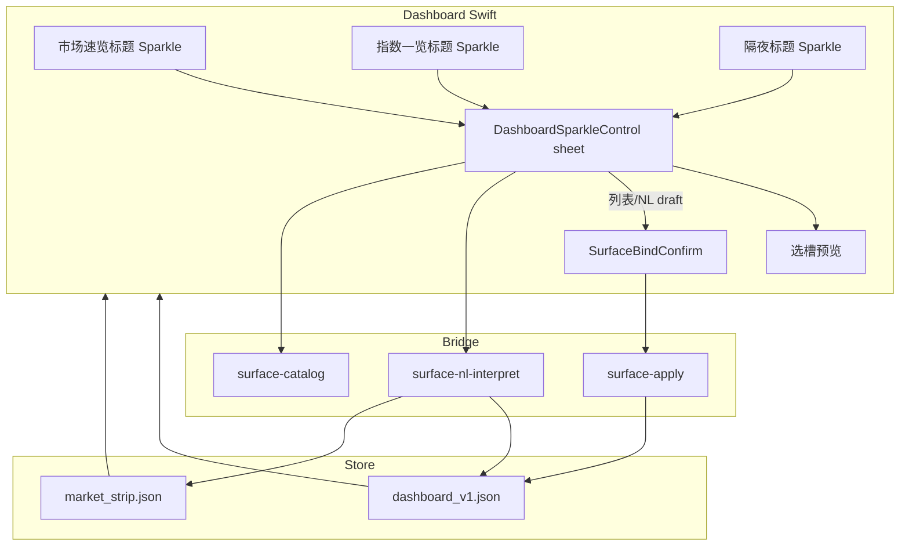
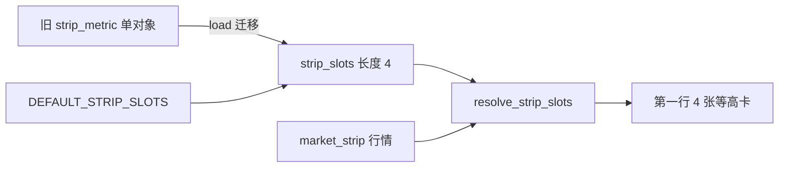

# Dashboard Sparkle Reinforce - Plan

> **产品目标** 钉死于 Product Contract；**实现 HOW** 见 Planning Contract 与 Implementation Units。  
> **Product Contract preservation:** Product Contract unchanged in meaning（R/F/AE/S/KD 保持）；本 enrichment 关闭 Deferred-to-Planning Q1–Q4 为 KTD，并增加 Units。  
> 底座：001 surface 写闸 + 003 档 A Sparkle/NL 确认 + 004 档 B catalog。

---

## Goal Capsule

- **Objective:** 在最新发布的盯盘 Sparkle 能力上同发补强：多色星芒入口与区块右对齐；配置卡取消 + 列表真值确认；市场速览固定四槽全可配指标；指数一览区块级增删改。
- **Authority hierarchy:** 本 Product Contract > 档 A/B 继承原则（形态锁、目录即真理、数字纪律、人在环）> 本 Planning Contract（HOW）。
- **Foundation:** `kss/ui_surface/*`、`surface-*` bridge、`DashboardSparkleControl`、`SurfaceBindConfirm`、`dashboard_v1.json`、`market_strip.json`。
- **Execution profile:** Standard；Python schema/ops/单测优先 → bridge → Swift UI；图标资源与浅深色可辨识。
- **Stop conditions:** 四槽不可各自换绑、列表点选仍直接 apply、配置卡无 sheet 级取消、指数一览仍不可配、入口仍埋在单卡内，均不得宣称完成。
- **Out of scope:** 自由布局、单元格级 Sparkle、B5 算法指标、B6 LLM 意图、改指数一览列数产品规格。

---

## Product Contract

### Summary

盯盘页 Sparkle 统一升级：多色星芒图标、区块标题行右侧对齐；配置卡可取消，列表与 NL 同走真值预览再确认；市场速览固定四槽可配指标（区块一个入口，卡内选槽）；指数一览区块级增删改，保持现有网格密度。同一里程碑一次交付。

### Problem Frame

档 A/B 已让「隔夜美股」与「一张指标小卡」可绑，但体验仍有断点：入口单色且指标入口埋在单卡右上；列表 Tab 点选即写、配置 sheet 在列表态无显式取消；市场速览混排且仅一张可换；指数一览名单写死在刷新脚本侧。

### Key Decisions

- KD1. **区块级 Sparkle，小卡不挂入口。** `(session-settled: user-directed — chosen over 每卡右上入口)` Governs R1, R2, R10.
- KD2. **四槽全可配指标。** `(session-settled: user-directed — chosen over 混排重绑 / 旁挂四指标)` Governs R5–R8.
- KD3. **配置卡内先选槽再换指标。** `(session-settled: user-approved — chosen over 仅 NL 点名 / 先点卡再 Sparkle)` Governs R9, F2.
- KD4. **列表与 NL 同路径：draft → 真值预览 → 确认。** `(session-settled: user-approved — chosen over 列表内二次确认无预览 / 列表直写)` Governs R12, R13, F1–F5.
- KD5. **配置卡标题栏右侧「取消/关闭」。** `(session-settled: user-approved — chosen over 仅 Esc / 仅 NL 底部取消)` Governs R4. （NL Tab 底部已有取消；本决策要求 **sheet 级** 全 Tab 可见。）
- KD6. **指数一览区块级增删改。** `(session-settled: user-directed — chosen over 单元格级 / 双入口)` Governs R15–R17, F4.
- KD7. **出厂默认保持现有内容；5→4 保序取前 4。** `(session-settled: user-directed — chosen over 纯盘面四指标 / 用户另指定名单)` Governs R8.
- KD8. **一刀切同发。** `(session-settled: user-approved — chosen over 两阶段 / 指数一览另开)` Governs S1–S4, R20.
- KD9. **图标采用参考图多色星芒簇。** Governs R1.

### Actors

- A1. Solo 盯盘用户
- A2. 绑定解析 / Bind Catalog
- A3. surface apply 与刷新真值

### Key Flows

- F1. 打开区块 Sparkle → 取消关闭 — **Covered by:** R1, R4
- F2. 四槽换指标（列表）— 选槽 → 列表 → 预览 → 确认 — **Covered by:** R5–R7, R9, R12–R13
- F3. 四槽换指标（NL）— 选槽或点名 → 解析 → 预览 → 确认 — **Covered by:** R9, R12–R13
- F4. 指数一览增删改 — **Covered by:** R15–R17, R12–R13
- F5. 隔夜列表补齐确认 — **Covered by:** R12–R13, R18

### Requirements

**入口视觉与对齐**

- R1. 盯盘页所有 Sparkle 入口使用参考图多色星芒簇（非系统单色 `sparkles`）。
- R2. Sparkle 仅出现在区块标题行右侧（市场速览、指数一览、隔夜美股）；小卡本体不挂入口。
- R3. 各区块 Sparkle 相对各自标题行右缘对齐。

**配置卡交互**

- R4. Sparkle sheet **标题栏右侧**提供取消/关闭；任意 Tab 可关且不写入。
- R12. 列表 Tab 选中项只产生 draft，不得直接 apply；须进入与 NL 相同的真值预览确认。
- R13. 预览确认卡保留取消与确认；取消不写入。
- R18. 隔夜美股列表路径遵守 R12–R13；默认隔夜名单不可删。

**市场速览四槽**

- R5. 第一行固定 **4** 张等高小卡。
- R6. 四张均为可配指标槽；绑定对象须 catalog/`allowed_slots` 允许进入 strip 类槽。
- R7. 任意一槽可独立替换指标。
- R8. 出厂/迁移：现网从左到右保序映射到四槽取满 4；溢出不进默认；不发明无关名单。
- R9. 区块 Sparkle 先展示四槽当前绑定；点槽后再 NL/列表；NL 可点名槽位或现绑名称。
- R10. 卡面主值与辅文案只来自代码 resolve/probe。

**指数一览**

- R15. 标题行右侧 Sparkle；支持追加、移除、替换。
- R16. 保持现有自适应网格密度；非自由拖拽、不改列数产品规格。
- R17. 变更须 catalog/可探针真值门闩。
- R19. 用户未改前保持现网默认板；用户变更后持久化，刷新不丢。

**交付**

- R20. 本里程碑一次交付 R1–R19；半套不验收。

### Acceptance Examples

- AE1. 取消不写 — **Covers R4, F1.** 列表已点选未确认时关 sheet → surface 不变。
- AE2. 列表必须预览 — **Covers R12, R13, F2.** 选槽 2 点「封板率」未确认 → 不写；确认后仅槽 2 变。
- AE3. 四槽独立 — **Covers R5–R7, F2.** 只改槽 4 → 1–3 不变。
- AE4. 迁移保序取前 4 — **Covers R8.** 现网 5 张 → 升级后四槽对应前 4 语义。
- AE5. 指数一览增删 — **Covers R15–R17, F4.** 追加有真值指数、移除另一只 → 网格与持久化正确。
- AE6. 入口位置 — **Covers R1–R3, KD1.** 三区块标题右为多色星芒；小卡无 Sparkle。

### Success Criteria

- S1. Solo 不改 JSON 可完成换槽、改指数板、取消误操作。
- S2. 抽测列表写入路径均经真值预览，无直写。
- S3. 四槽与指数板变更刷新后仍在。
- S4. 图标与右对齐在浅/深色主题可辨识且位置一致。

### Scope Boundaries

**In:** 图标与区块右对齐；配置卡取消 + 列表确认（含隔夜）；四槽全可配；指数一览区块增删改。

**Deferred for later:** 单元格 Sparkle / 拖拽排序；B5/B6；指数板列数重设计；跨区块批量绑定。

**Outside this unit:** 自由布局画布；手改 JSON 主路径；非盯盘页 Sparkle 图标体系。

**Deferred to Follow-Up Work:** 无（本里程碑不切半）。

### Dependencies / Assumptions

- 依赖档 A/B Sparkle 壳、`SurfaceBindConfirm`、catalog、apply 写闸。
- 假设 strip 类与 index_board 类用 `allowed_slots` 区分。
- 假设参考图可作桌面资源（多色，非 SF Symbols 单色）。
- 「3×16」= 现网自适应网格密度口语，非硬编码行列规格。

### Outstanding Questions

**Resolve Before Planning:** 无。

**Deferred to Planning（已在本 enrichment 关闭 → 见 KTD）:** 原 Q1–Q4。

### Sources / Research

- `Sources/KSSDesktop/Support/Components.swift` — `DashboardSparkleControl`；NL Tab 已有底部取消，列表 Tab 无 sheet 级取消；`listContent(dismiss)` 鼓励点选即关。
- `Sources/KSSDesktop/Views/DashboardView.swift` — `MarketStripRow` 仅 `metricCard` 挂 Sparkle；`setMetric` 列表直写 apply；`IndexBoardGrid` 只读。
- `kss/ui_surface/config.py` — 单对象 `strip_metric`；`NORTH_METRICS` 禁小卡；ops 闭集无 index_board。
- `kss/ui_surface/resolve.py` — `METRIC_CATALOG`、`resolve_metric_props`。
- 前序：`docs/plans/2026-07-28-003-feat-dashboard-nl-binding-plan.md`、`004-feat-dashboard-open-binding-plan.md`。

---

## Planning Contract

### Key Technical Decisions

- KTD1. **配置键 `strip_slots`：长度恰好 4 的数组。**  
  每项 `{ "slot_id": "strip_0"|…|"strip_3", "metric_id": "<id>" }`。  
  旧键 `strip_metric` 读时迁移：填入槽位策略见 KTD3；写路径只写 `strip_slots`。  
  新 op：`set_strip_slot`（`slot_id` + `metric_id`）、`reset_strip_slots`。保留 `set_strip_metric` 为兼容别名 = 写 `strip_3`（或最后一槽），单测钉死。  
  *关闭原 Q1。* Governs R5–R8 实现。

- KTD2. **解除「北向禁 strip」以实现四槽语义。**  
  删除/放宽 `NORTH_METRICS` 对 strip 槽的硬拒绝；`north_money` 登记进 `METRIC_CATALOG` 并可 `allowed_slots` 含 strip。  
  产品已选「北向可作为可替换指标」。Governs R6。

- KTD3. **默认四槽与迁移保序。**  
  `DEFAULT_STRIP_SLOTS`：四个 metric_id，语义对齐现网从左到右可见内容（ETF 行情类 metric、北向、现 `strip_metric`/`limit_max_board`）。  
  迁移：`load_config` 若无 `strip_slots` 而有旧 `strip_metric`，生成 4 槽 = `DEFAULT` 前 3 + 旧 metric 覆盖对应位（优先保留用户已选 metric 于最右匹配槽）；若已有完整 4 槽则不覆盖。  
  ETF 价作为 metric：在 catalog/resolve 增加可 resolve 的 fund/etf 类 metric（至少覆盖现 `ETFS` 两只或合并为语义等价展示）。具体四码实现时按「保序语义」定，单测钉迁移不丢用户 `metric_id`。  
  *关闭原 Q1 默认策略。* Governs R8。

- KTD4. **指数一览用户名单 = 全量覆盖默认板。**  
  配置键 `index_board: { "codes": [ "000001.SH", … ] }`；缺省/null = 使用脚本 `INDEX_BOARD` 默认 13 码。  
  一旦用户 apply 过名单，以用户列表为唯一展示源（非默认∪用户）。  
  ops：`index_board_set`（全量替换）、`index_board_append`、`index_board_remove`、`reset_index_board`（回默认）。  
  上限：实现时给合理 cap（建议 ≤ 48，防刷）；超限 fail loud。  
  *关闭原 Q2（选全量覆盖）。* `(session-settled: user-approved — chosen over 默认∪追加)` Governs R15–R19。

- KTD5. **列表路径统一为 draft → SurfaceBindConfirm。**  
  列表点选 **禁止** 调 `surfaceApply` / `setMetric` 直写。  
  构造与 NL 同形的 `SurfaceBindDraft`（opsJSON + previews 来自 probe/resolve 或轻量 `surface-nl-interpret`/新 preview helper）。  
  隔夜列表 `appendCandidate` 同样改 draft。Governs R12, R18。

- KTD6. **sheet 级取消在标题栏。**  
  `DashboardSparkleControl.sheetBody` 标题 `HStack` 右侧加取消/关闭（全 Tab）；NL 底部取消可保留或改为次要。Governs R4。

- KTD7. **区块级入口 + 配置卡内选槽。**  
  市场速览：标题行（或 `MarketStripRow` 外层 header）一个 Sparkle，`region=strip_slots`（或保留 `strip_metric` region 但 payload 带 `slot_id`）。  
  sheet 首屏：四槽芯片/行展示当前 title+value；选中槽后进入 NL/列表。  
  选槽 UI 形态（芯片 vs 列表）实现自决，满足 R9 即可。  
  *关闭原 Q4。* Governs R2, R9。

- KTD8. **多色星芒 = 资源图，非 SF Symbol。**  
  将 brainstorm 参考图落入 `Sources/KSSDesktop/Resources/`（PDF/SVG 或多倍率 PNG）；`DashboardChromeIconKind.sparkles` 改绑资源。  
  浅/深色：若单资源对比不足，用 template + 双色图层或两套 asset；验收 S4。  
  *关闭原 Q3 方向。* Governs R1。

- KTD9. **resolve 与 snapshot 合并。**  
  第一行 UI **不再** 用 `strip.etfs` + 固定北向 + 单 `stripMetric` 混排驱动；改为 `resolve_strip_slots(config, market_strip) → [StripMetricProps×4]`。  
  `market_strip.json` 仍作行情原料；指数一览展示 `effective_index_board(config, market_strip.indexBoard)`。  
  apply 后尽力 `refresh-market-strip`（沿用 003 KTD9）。

- KTD10. **region / NL 扩展。**  
  `surface-nl-interpret` region 扩展：`strip_slots`（需 slot 上下文或句内点名）、`index_board`。  
  槽点名：「第一张/第二张/槽1–4/把最高连板改成…」。  
  指数：「加上中证1000」「去掉北证50」「换成…」。  
  消歧与失败大声沿用档 A/B。

### High-Level Technical Design

### Assumptions

- catalog 可为 strip 槽扩展 fund/etf/north 类 metric 而不破坏隔夜 region。
- 指数板探针复用现有 index 行情路径；无真值则 apply 拒绝。
- 图标资源版权/来源由用户提供的参考图授权本项目使用。

### Sequencing

U1（schema/ops/resolve）→ U2（NL region + 单测）→ U3（bridge）→ U4（Swift 四槽 UI + Sparkle 壳）与 U5（指数一览 + 隔夜列表确认）可并行于 U3 后 → U6（图标资源与对齐验收）。

---

## Implementation Units

### U1. surface 配置：strip_slots + index_board

- **Goal:** Python 配置/写闸支持四槽与指数板全量名单；迁移旧配置；解除北向禁 strip。
- **Requirements:** R5–R8, R15–R19；KTD1–KTD4, KTD9
- **Dependencies:** None
- **Files:**
  - modify: `kss/ui_surface/config.py`
  - modify: `kss/ui_surface/resolve.py`
  - modify: `kss/ui_surface/bind_catalog.py`（`allowed_slots`、strip/board 项）
  - modify: `kss/tests/test_ui_surface_store.py`
  - modify: `kss/tests/test_ui_surface_resolve.py`
- **Approach:**
  1. `empty_config` / `validate_config_body` / `save_config` / `apply_patch` 纳入 `strip_slots` 与 `index_board`。
  2. 实现 KTD1 ops 与兼容 `set_strip_metric`。
  3. `DEFAULT_STRIP_SLOTS` + 迁移；`north_money` 进 `METRIC_CATALOG`；ETF 类 metric resolve 从 `market_strip.etfs` 或 fund 路径取价。
  4. `effective_index_board`：用户 codes 全量 或 默认 `INDEX_BOARD`；提供 quote 合并 helper。
  5. `resolve_strip_slots` → 4× props。
- **Patterns:** 现有 `apply_patch` 幂等与 ValueError → `{ok:false}`。
- **Test scenarios:**
  - 旧 JSON 仅 `strip_metric` → load 得 4 槽且含原 metric_id
  - `set_strip_slot` 只改一槽
  - `set_strip_metric` 兼容写最后槽
  - `north_money` 可 set 到槽；非法 metric fail
  - `index_board_append` 有真值 code；重复幂等；remove；reset 回默认
  - 用户空 codes 列表合法或显式拒绝（钉一种：建议至少 1 项，空则 error 或 reset——**选 fail loud 要求 ≥1**）
  - cap 超限 fail
- **Verification:** `pytest kss/tests/test_ui_surface_store.py kss/tests/test_ui_surface_resolve.py` 相关用例绿

### U2. NL：strip 选槽 + index_board 意图

- **Goal:** 确定性 interpret 支持四槽与指数板 region。
- **Requirements:** R9, R12, R15, R17；KTD5, KTD10
- **Dependencies:** U1
- **Files:**
  - modify: `kss/ui_surface/nl_interpret.py`
  - modify: `kss/ui_surface/aliases.py`
  - modify: `kss/tests/test_ui_surface_nl_interpret.py`
- **Approach:**
  1. region `strip_slots` / 兼容 `strip_metric`：解析槽位序号 + metric 别名 → `set_strip_slot` op + preview。
  2. region `index_board`：追加/移除/替换动词 → ops + 探针 preview。
  3. 未选槽且句内无法点名 → error_zh 提示先选槽或说「第 N 张」。
- **Patterns:** 003 确定性流水线；不落盘。
- **Test scenarios:**
  - 「第二张改成封板率」→ slot strip_1 + limit_seal_rate
  - 「改成封板率」无槽上下文 → 失败提示
  - 「加上中证1000」index_board → append draft
  - 「去掉北证50」→ remove；默认板未用户化时仍可预览 remove 后全量
  - 未知指数 → fail + suggestions
- **Verification:** `pytest kss/tests/test_ui_surface_nl_interpret.py` 绿

### U3. Bridge 与 Swift 模型

- **Goal:** bridge/orientation/Swift Codable 认识新 config 与 ops；catalog slot 字符串。
- **Requirements:** R6, R10, R17；KTD1, KTD4, KTD10
- **Dependencies:** U1, U2
- **Files:**
  - modify: `scripts/kss_app_bridge.py`（surface-get/apply/nl/catalog 透传）
  - modify: `kss/tests/test_bridge_ui_surface.py`
  - modify: `Sources/KSSDesktop/Models/KSSModels.swift`（`SurfaceConfigBody`、`SurfaceGetResponse` 四槽 props、index board 字段）
  - modify: `Sources/KSSDesktop/Services/BridgeClient.swift`（若签名需 region 扩展）
  - modify: `Tests/KSSDesktopTests/DashboardSurfaceConfigTests.swift`（若有）
- **Approach:**
  1. surface-get 返回 `strip_slots` resolved props 数组 + effective index board 元数据。
  2. apply 接受新 ops；写闸不变。
  3. Swift 解码容错：无 `strip_slots` 时用旧 `stripMetric` 填 UI 过渡（与 Python 迁移双保险）。
- **Test scenarios:**
  - bridge apply set_strip_slot 不落坏 JSON
  - surface-get 含 4 props
  - catalog slot=strip / index_board 有 items
- **Verification:** bridge pytest + Swift 模型编译；相关 Desktop 测试绿

### U4. Swift：Sparkle 壳 + 四槽市场速览

- **Goal:** 区块入口、sheet 取消、选槽、四卡展示、列表走确认；去掉卡内 Sparkle 与直写。
- **Requirements:** R1–R7, R9–R13, R20；KTD5–KTD8
- **Dependencies:** U3
- **Files:**
  - modify: `Sources/KSSDesktop/Support/Components.swift`（`DashboardSparkleControl` 标题栏取消；可选 slot chrome）
  - modify: `Sources/KSSDesktop/Views/DashboardView.swift`（`MarketStripRow` 重构为 4 槽；header Sparkle；删除 `setMetric` 直写；列表 → draft）
  - create/modify: 图标资源于 `Sources/KSSDesktop/Resources/`（或 Asset Catalog）
  - modify: `Sources/KSSDesktop/Support/Components.swift` `DashboardChromeIcon` 绑资源
- **Approach:**
  1. `MarketStripRow`：header 右 Sparkle；body 四张 `DashboardStripCard` 无 trailing Sparkle。
  2. sheet：先槽位条；再 NL/列表；列表 onSelect 建 `SurfaceBindDraft` 再 `SurfaceBindConfirm`。
  3. `maxPerRow` 逻辑改为固定 4。
  4. 图标资源 + 可访问标签「自然语言/列表」。
- **Execution note:** UI 变更以 AE1–AE3、AE6 为验收轴；列表路径加/改 Desktop 或逻辑可测的 draft 构造单测若可行。
- **Patterns:** 隔夜区 header Sparkle 布局；`SurfaceBindEncoding.draft`。
- **Test scenarios:**
  - Covers AE1：取消不写（逻辑：draft 未 apply）
  - Covers AE2：列表不调用 apply 直至 confirm
  - Covers AE3：单槽 apply 的 ops 仅含一 slot
  - Covers AE6：小卡无 sparkles 入口（代码审查/快照可选）
- **Verification:** 桌面手动走 F1/F2；相关单测绿；主题浅深看图标

### U5. Swift：指数一览绑定 + 隔夜列表确认

- **Goal:** 指数一览区块 Sparkle 增删改；隔夜列表不再直写。
- **Requirements:** R12, R15–R19, R18；KTD4, KTD5
- **Dependencies:** U3
- **Files:**
  - modify: `Sources/KSSDesktop/Views/DashboardView.swift`（`IndexBoardGrid` 外层 Section + Sparkle；overnight `appendCandidate` → draft）
- **Approach:**
  1. SectionHeader「指数一览」行右侧 Sparkle，`region=index_board`。
  2. 列表/catalog 选指数 → preview → confirm → apply → refresh/reload。
  3. 展示 `effective` 名单 + live quotes。
  4. 隔夜列表同样 draft 化（F5）。
- **Patterns:** overnight Sparkle 列表 + confirm。
- **Test scenarios:**
  - Covers AE5：append/remove 后配置与 UI 一致
  - 隔夜列表选中不直接改 append 直至 confirm
  - reset_index_board 回 13 默认
- **Verification:** 手动 F4/F5；Python 单测已覆盖 ops

### U6. 对齐与交付钉扎

- **Goal:** 三区块入口右对齐一致；全路径无列表直写；文档/空态文案更新。
- **Requirements:** R3, R20, S1–S4
- **Dependencies:** U4, U5
- **Files:**
  - modify: `Sources/KSSDesktop/Views/DashboardView.swift`（空态文案去掉「点卡内 ✦」类旧提示）
  - 按需：orientation / skill 文案若写死单指标卡
- **Approach:**
  1. 扫 `set_strip_metric` 直写、`setMetric`、列表 onSelect 直 apply 残留。
  2. 统一 header 间距与图标 hit 区。
  3. 对照 AE1–AE6 清单勾验。
- **Test expectation:** none for pure copy — 行为由 U1–U5 覆盖；本 unit 为集成验收。
- **Verification:** S1–S4 手工清单通过

---

## Verification Contract

| Gate | Command / proof | Applies |
|------|-----------------|---------|
| Config/resolve | `pytest kss/tests/test_ui_surface_store.py kss/tests/test_ui_surface_resolve.py -q` | U1 |
| NL | `pytest kss/tests/test_ui_surface_nl_interpret.py -q` | U2 |
| Bridge | `pytest kss/tests/test_bridge_ui_surface.py -q` | U3 |
| Desktop | 既有 `Tests/KSSDesktopTests` 中 surface 相关；新增逻辑可测则补 | U3–U5 |
| 行为 | 手动：F1 取消；F2 列表预览；F4 指数增删；入口位置 AE6 | U4–U6 |
| 回归 | 隔夜 NL 追加仍走确认；默认隔夜不可删 | U5 |

---

## Definition of Done

**Global**

- [ ] R1–R20 与 AE1–AE6 可演示或单测覆盖
- [ ] 无列表路径 `surfaceApply` 直写残留
- [ ] 旧 `dashboard_v1.json` 可迁移加载
- [ ] 浅/深色主题 Sparkle 可辨识
- [ ] 无半套交付（缺指数一览或仍单指标卡不算完成）
- [ ] 废弃实验代码已清理

**Per unit**

- U1: store/resolve 单测绿；迁移与 index_board 全量覆盖钉死  
- U2: NL 槽位与指数意图单测绿  
- U3: bridge + Swift 解码可用  
- U4: 四槽 UI + sheet 取消 + 列表确认  
- U5: 指数一览可配 + 隔夜列表确认  
- U6: 对齐与文案、集成勾验  

---

## System-Wide Impact

- **surface schema v 兼容：** 读迁移写新形；其他消费者（MCP surface-get）需能解析 `strip_slots`/`index_board`。
- **RealtimeMerge：** 核心订阅集合改为四槽 resolve 后的 codes + effective index board，避免仍只订 etfs。
- **刷新脚本：** `refresh_market_strip.py` 仍产全量原料；用户板是配置子集，不要求脚本动态改默认 13（除非后续优化）。

---

## Risks & Dependencies

| Risk | Mitigation |
|------|------------|
| ETF→metric 映射丢失现网双 A500 展示 | DEFAULT_STRIP_SLOTS 显式覆盖两只 fund metric 或一主一备；迁移单测 |
| 用户清空指数板 | ≥1 约束或 reset；fail loud |
| 列表改 draft 后交互变慢 | 复用已有 probe；列表选中再 probe 一次 |
| 多色图标深色糊 | 双主题资源或描边 |

---

## Appendix: 实现备注（非规范）

- NL Tab 底部已有「取消」；产品要求是 **标题栏全 Tab** 可见（R4/KTD6）。
- 现网 `DashboardStripCardSpec.maxPerRow = 5`；本计划产品为 4 槽固定。
- 参考图标路径（brainstorm 会话）：用户提供的多色星芒簇图；落地时复制进 Desktop Resources。
