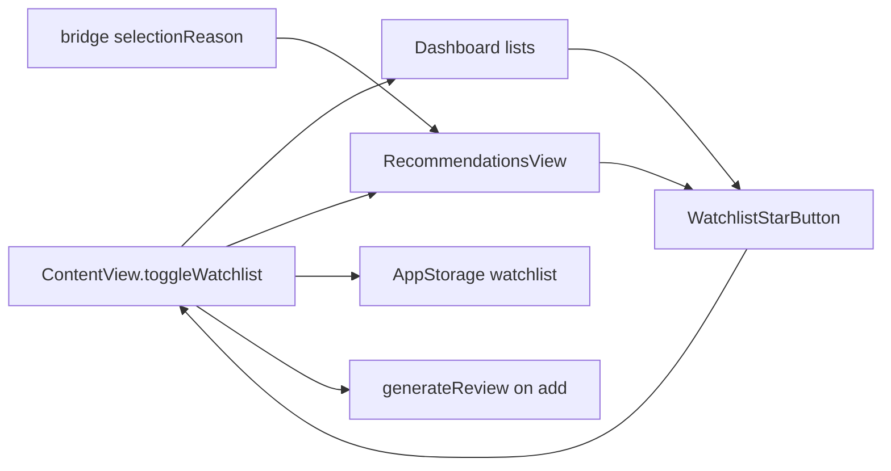

# Watchlist Stars and Rec Reason Column - Plan

> **产品目标** 钉死于 Product Contract；**实现 HOW** 见 Planning Contract 与 Implementation Units。  
> **Product Contract preservation:** Product Contract unchanged in meaning（R/F/AE/KD 保持）；本 enrichment 关闭 Deferred Q1–Q3 为 KTD，并增加 Units。

---

## Goal Capsule

- **Objective:** 盯盘页全部标的列表 + 推荐页（当日与往期）行尾星标自选 toggle；推荐页当日推荐去掉权重列，名称/代码后展示确定性合成「入选理由」。
- **Authority hierarchy:** 本 Product Contract > 既有 `WatchlistToggle` / AppStorage / 加自选即时复盘（U5）。
- **Foundation:** `ContentView.toggleWatchlist`、`RecommendationsView`、`TodayPicksList` / `PerillaPicksTable` / `BJScanSection`、`scripts/kss_app_bridge.py` 推荐组装。
- **Execution profile:** Standard；Swift UI 接线为主；bridge 补 `selectionReason` 合成 + Python 单测。
- **Stop conditions:** 覆盖列表无星标、加入不入自选/不触发复盘、当日表仍有权重或无理由列 → 未完成。
- **Out of scope:** 趋势/回测/资讯列表；持久化 `pick_reason`；LLM 理由。

---

## Product Contract

### Summary

盯盘与推荐页标的行统一行尾 ★/☆ toggle 自选（加入仍触发即时复盘）；推荐页当日推荐去掉权重，在名称/代码后增加「入选理由」，由 bridge 用排名/因子/行业等确定性合成。

### Problem Frame

自选入口集中在股票浏览详情，盯盘与推荐列表无法就地加自选。推荐页权重列信息量低；用户需要紧挨名称看到入选原因，而现网 `Recommendation` 无 reason 字段。

### Key Decisions

- KD1. **覆盖 = 盯盘全部标的列表 + 推荐页（当日与往期）。** `(session-settled: user-directed)` Governs R1–R3.
- KD2. **行尾星标 toggle。** `(session-settled: user-approved)` Governs R4–R6.
- KD3. **入选理由确定性合成。** `(session-settled: user-approved)` Governs R8–R10.
- KD4. **当日表去权重，理由在名称/代码后。** Governs R7–R8.
- KD5. **往期加星标，不改往期列结构。** `(session-settled: user-directed)` Governs R3.

### Actors

- A1 Solo · A2 自选真源 · A3 复盘生成（仅加入）

### Key Flows

- F1 点空星 → 入自选 + 即时复盘（不导航）— R4–R6  
- F2 点实心星 → 取消自选、不生成复盘 — R5  
- F3 点行体 → 打开个股 — R6  
- F4 当日推荐：无权重、有理由、有星 — R7–R10  

### Requirements

**加为自选**

- R1. 盯盘：今日推荐、紫苏叶、北证扫描行尾星标。  
- R2. 推荐页当日列表行尾星标。  
- R3. 推荐页往期跟踪展开后的 pick 行行尾星标。  
- R4. 未自选空星 / 已自选实心；a11y「加为自选」/「取消自选」。  
- R5. 经 `WatchlistToggle` + AppStorage + DB 同步；加入触发 `generateReview`，取消不触发。  
- R6. 点星不 `onSelectSymbol`；点行仍导航。  

**推荐列**

- R7. 当日推荐移除权重列与权重排序。  
- R8. 名称/代码后「入选理由」列。  
- R9. 理由代码合成，不经 LLM。  
- R10. 无法合成时「—」，不编造事件叙事。  

**交付**

- R11. R1–R10 同里程碑。  

### Acceptance Examples

- AE1 盯盘今日推荐加自选 — R1,R4–R6  
- AE2 取消不触发复盘 — R5  
- AE3 点行看个股 — R6  
- AE4 无权重有理由 — R7–R10  
- AE5 往期 pick 可加自选 — R3  

### Success Criteria

- S1–S4：一键加/取消；状态一致；当日表正确；复盘行为不回归。  

### Scope Boundaries

**In:** R1–R11。  
**Deferred:** 其它页列表星标；持久化 reason；浏览主列表行内 toggle。  
**Outside:** 改自选真源架构；下单。  

### Dependencies / Assumptions

- 列表下传 `watchlist` + `onToggleWatchlist`。  
- paper pick 仍有 rank / industry / factor_value / 策略语境。  

### Outstanding Questions

**Resolve Before Planning:** 无。  
**Deferred to Planning:** 已关闭 → KTD。  

### Sources / Research

- `ContentView.toggleWatchlist` / `WatchlistToggle`  
- `RecommendationsView` 权重列；`Recommendation` 模型  
- Bridge 推荐组装 `scripts/kss_app_bridge.py`  
- 盯盘：`TodayPicksList`、`PerillaPicksTable`、`BJScanSection`  

---

## Planning Contract

### Key Technical Decisions

- KTD1. **公共 `WatchlistStarButton`。**  
  输入 `symbol`、`isWatched`、`action`；`Button` + `star`/`star.fill`；`.buttonStyle(.plain)` + 阻止冒泡（嵌套在行 Button 内时用独立 Button，外层 row 用 HStack 拆分点击区，避免整行 Button 包星）。  
  Governs R4, R6.

- KTD2. **接线：ContentView 下传闭包。**  
  `DashboardView` / `RecommendationsView` 增加 `watchlist: [String]`、`onToggleWatchlist: (String) -> Void`，由 `ContentView` 注入现有 `toggleWatchlist`。  
  不新建自选真源。Governs R5.

- KTD3. **行结构：星与导航分离。**  
  今日推荐/紫苏叶/北证/推荐当日：行 = `HStack { Button(导航){…}; WatchlistStarButton }` 或等价；禁止整行单一 Button 吞掉星点击。Governs R6.

- KTD4. **入选理由字段 `selectionReason: String?`。**  
  Bridge 组装 recommendation 时写入；Swift `Recommendation` 解码。  
  合成函数纯 Python，例如：  
  `log_mv 截面排名 #{rank} · {industry}`；无 industry 则省略；无 rank 则 `—`。  
  策略名若 paper log 有 `strategy` 可作前缀（有则用，无则默认 log_mv 语境与页脚 caption 一致）。  
  单测钉 2–3 条样例。  
  *关闭 Q1。* Governs R9–R10.

- KTD5. **当日推荐列：去 weight 排序与展示。**  
  `RecSort` 删 `.weight`；header/row 去权重；`selectionReason` 列在名称块后、状态前（满足「名称/代码后」）。Governs R7–R8.

- KTD6. **往期 `TrackingDayCard`：**  
  pick 行尾加星；传入 watchlist + toggle；不改 1d/5d/20d 列。Governs R3.

### High-Level Technical Design

### Assumptions

- 指数/ETF 行不在本范围（R1 仅 A 股标的列表）。  
- 星标列宽约 28–32pt，不重排破坏现价列对齐时可微调固定宽。  

### Sequencing

U1（reason 合成 + 模型）→ U2（Star 组件 + Dashboard 三表）→ U3（Recommendations 当日列 + 星）→ U4（往期星 + 接线验收）。

---

## Implementation Units

### U1. Bridge / 模型：selectionReason

- **Goal:** 推荐 item 带确定性 `selectionReason`；Swift 可解码。  
- **Requirements:** R8–R10；KTD4  
- **Dependencies:** None  
- **Files:**  
  - modify: `scripts/kss_app_bridge.py`（推荐组装处）  
  - create or modify: 纯函数模块（可放 bridge 内 `_selection_reason(pick, meta)`）  
  - modify: `Sources/KSSDesktop/Models/KSSModels.swift`（`Recommendation.selectionReason`）  
  - modify: `kss/tests/test_bridge_recommendations.py`（或新建）  
- **Approach:**  
  1. `_selection_reason`：`rank` + industry + 可选 factor 标签。  
  2. items JSON 增加 `selectionReason`（camelCase 与现有字段风格一致）。  
  3. Swift optional String。  
- **Test scenarios:**  
  - rank=2 industry=电子 → 含 `#2` 与 `电子`  
  - 无 industry → 无多余分隔符  
  - 无 rank → `—` 或等价  
- **Verification:** pytest 相关用例绿  

### U2. WatchlistStarButton + 盯盘三表

- **Goal:** 公共星标；今日推荐 / 紫苏叶 / 北证扫描可 toggle。  
- **Requirements:** R1, R4–R6；KTD1–KTD3  
- **Dependencies:** None（接线用 ContentView 在 U2 末或 U4）  
- **Files:**  
  - create: `Sources/KSSDesktop/Support/WatchlistStarButton.swift`（或 Components 内）  
  - modify: `DashboardView.swift`（`TodayPicksList`、`PerillaPicksTable`、`BJScanSection` + 父级参数）  
  - modify: `ContentView.swift`（Dashboard 注入 watchlist/toggle）  
- **Approach:**  
  1. Star 组件。  
  2. 三表增加 `watchlist` + `onToggleWatchlist`。  
  3. 行点击区与星分离。  
- **Test scenarios:**  
  - 逻辑：`WatchlistToggle` 既有单测不破坏  
  - 可选：纯函数「isWatched」展示  
  - 手动 AE1–AE3  
- **Verification:** 编译通过；手动盯盘三表  

### U3. 推荐页当日：去权重 + 理由 + 星

- **Goal:** 当日推荐表产品列与星标。  
- **Requirements:** R2, R7–R10；KTD5  
- **Dependencies:** U1  
- **Files:**  
  - modify: `RecommendationsView.swift`  
  - modify: `ContentView.swift`（注入 watchlist/toggle）  
- **Approach:**  
  1. 删 weight sort/column。  
  2. 展示 `item.selectionReason ?? "—"`。  
  3. 行尾星。  
- **Test scenarios:**  
  - Covers AE4  
  - 解码无 selectionReason 的旧快照不崩溃  
- **Verification:** 编译 + 手动推荐页  

### U4. 往期跟踪星标 + 总验收

- **Goal:** 往期 pick 行星标；全路径 AE 勾验。  
- **Requirements:** R3, R11；KTD6  
- **Dependencies:** U2, U3  
- **Files:**  
  - modify: `RecommendationsView.swift`（`TrackingDayCard`）  
- **Approach:**  
  1. Card 增加 watchlist/toggle 参数。  
  2. 展开行尾星。  
  3. 扫漏：Dashboard/Rec 调用点均注入。  
- **Test scenarios:**  
  - Covers AE5  
  - 加入仍 generate、取消不 generate（沿用 ContentView）  
- **Verification:** S1–S4 手工清单  

---

## Verification Contract

| Gate | Proof |
|------|--------|
| Reason 合成 | pytest bridge recommendations |
| 编译 | `swift build` / Xcode |
| 行为 | AE1–AE5 手工：盯盘三表 + 推荐当日/往期 |
| 回归 | 股票详情加自选仍触发复盘；取消不触发 |

---

## Definition of Done

- [ ] R1–R11 / AE1–AE5  
- [ ] 无权重列；有 selectionReason 展示  
- [ ] 所有覆盖列表星标可用  
- [ ] 无半套交付  
- [ ] 废弃实验代码清理  

---

## Risks & Dependencies

| Risk | Mitigation |
|------|------------|
| 行 Button 吞星点击 | KTD3 分离点击区 |
| 旧 snapshot 无 reason | optional + `—` |
| 列过挤 | 理由 `lineLimit(2)` + 略减其它列宽 |
