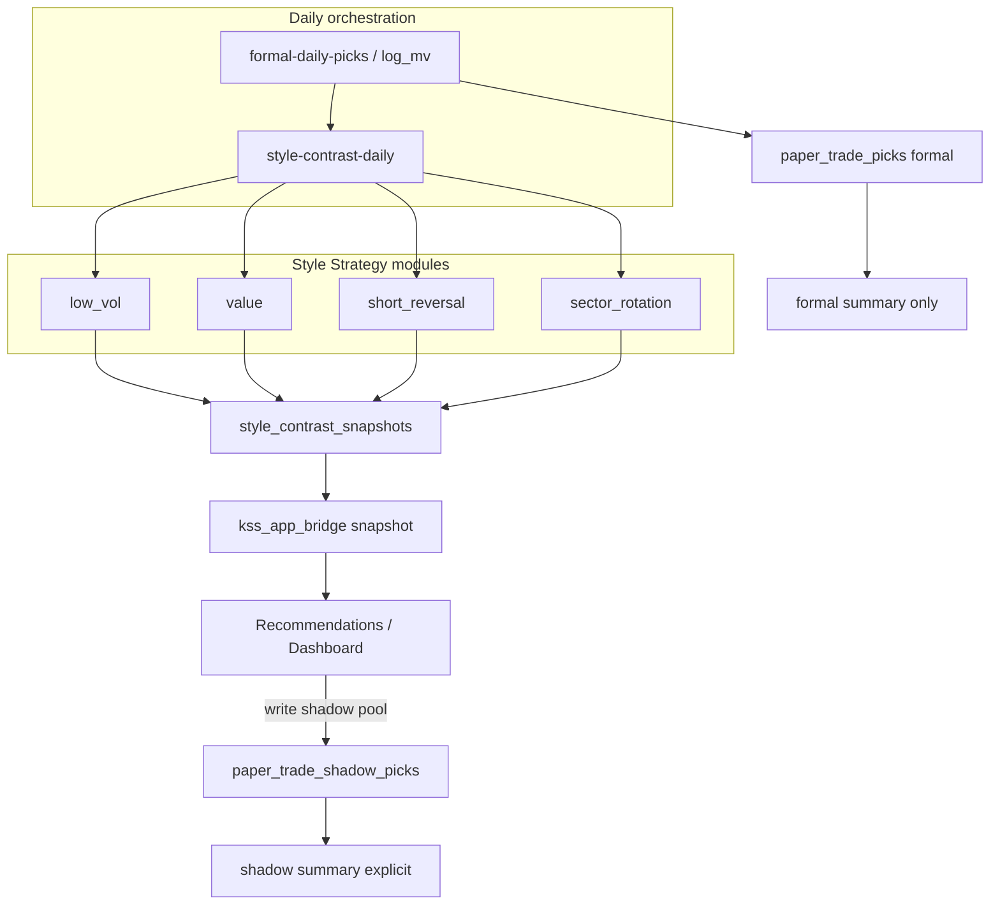

# Recommendation Style Contrast Strategies - Plan

## Goal Capsule

- **Objective:** 在推荐页保留 log_mv 正式主推荐的前提下，日更四套风格对照选股池（低波/BAB、价值、短期反转、板块动量轮动），每风格以完整策略模块产出信号与回测，研究态可见且强标注门禁；对照整池写入与正式纸交易分轨的影子日志。
- **Product authority:** Product Contract（R1–R14）> Planning Contract（KTD）> 实现裁量。冲突停下询问。本计划只拥有「选股推荐侧风格对照」；指标库/回测模型库/awesome 纯策展非 active scope。
- **Product Contract preservation:** unchanged（R/A/F/AE IDs 与产品决策保持 brainstorm 原意）。
- **Execution profile:** code；优先单测/集成测覆盖策略与分轨，UI 用 bridge 契约 + 编译/快照级验证。
- **Stop conditions:** 改正式 log_mv 主推荐语义、把影子混入正式汇总、或迁入外部回测引擎时停下。
- **Open blockers:** 无。

---

## Product Contract

### Summary

在正式 log_mv 反向主推荐旁，增加四个风格对照池。每风格是完整策略（信号 + 回测 + 门禁状态），日更名单带出处与研究/门禁标签；对照整池进影子纸交易分轨，失败栏占位不静默消失。

### Problem Frame

今日正式推荐路径以 `log_mv` 反向（小市值）为唯一已过 `is_deployable` 的主策略，纸交易与推荐页都围着它转。风格一旦失效，推荐面没有可对照的「另一套票」，单策略暴露过于集中。awesome-systematic-trading 提供大量股票论文策略线索，但多为美股/QC 实现；KSS 需要的是 A 股可 PIT 化、可解释、能挂到推荐侧的对照选股，而不是再造回测引擎或整库迁入外部框架。

### Key Decisions

- **主战场 = 选股策略补强（推荐）** — 不把指标库、回测模型库、源策展层并入本计划 Requirements。`(session-settled: user-directed — chosen over 指标库/回测库/纯策展/整包主线: 先解单策略集中暴露)` Governs R1.
- **形态 = 主推荐 + 风格对照栏** — 主推荐仍一份 log_mv；对照不自动混入主名单。`(session-settled: user-directed — chosen over 可切换主配方/多风格合成/仅研究库存: 分散可见且不动已过门禁主路径)` Governs R2, R3.
- **常驻四风格** — 低波/BAB、价值、短期反转、板块动量轮动；单票动量族与质量/ROA/资产增长不进 v1 对照栏。`(session-settled: user-directed — chosen over 常驻3/含动量族5全亮: 四栏可解释且复用 sector 能力)` Governs R4.
- **门禁 = 研究可见 + 强标注** — 未过上线门槛的风格仍展示，禁止当作正式主推荐。`(session-settled: user-approved — chosen over 仅绿灯展示/影子满 N 日才亮: 快速见分散且不假装可上线)` Governs R5, R6.
- **成功标准 = 推荐页每日稳定主推荐 + 四对照池** — 以日更可见与可追溯为首要验收。`(session-settled: user-directed — chosen over 低相关硬指标/行为验收/仅回测报告: 产品面先稳)` Governs R2, SC1.
- **失败表现 = 该栏占位 + 原因** — 不隐藏、不整区降级。`(session-settled: user-approved — chosen over 隐藏该栏/整页降级: 避免误以为风格消失)` Governs R7.
- **动作 = 对照整池影子纸交易** — v1 要能把某风格整池写入影子日志。`(session-settled: user-directed — chosen over 只读/加自选/提升进主推荐: 便于后验且不动主路径语义)` Governs R8, R9.
- **正式/影子分轨** — 汇总与指标绝不混算。`(session-settled: user-approved — chosen over 同表靠字段区分/仅落文件: 防误读混算)` Governs R9, R10.
- **实现形态 = 每风格完整 Strategy 模块** — 具备信号生成与回测能力。`(session-settled: user-directed — chosen over 配方目录/单一计分板: 与现有 Strategy 上线同构)` Governs R11, R12.
- **源导入方式** — 论文配方 + A 股适配 + 出处标签；不整库迁入 QC/backtrader。Governs R13.

### How This Work Fits Together

<!-- ce-section: work-relationships -->

本计划只拥有 **推荐侧风格对照选股**。下方是当前对更广诉求的理解，不是承诺路线图。

- **本计划：推荐风格对照策略**
  - **Enables** 后续对照风格中过门禁者的升权讨论（本计划不自动升权）
  - **Shares** 正式 log_mv 主推荐与纸交易口径（只读依赖）
  - **Shares** Strategy 抽象、回测门禁、sector 轮动、估值/波动因子面
- **周边候选（非本计划 Requirements）**
  - **指标库扩容** — Can proceed independently of 本计划
  - **回测模型库** — Can proceed independently of 本计划
  - **awesome 源策展层** — Shares 出处标签思路；本计划不建全库策展产品
  - **单票动量族 / 质量与资产增长** — Deferred

### Actors

- A1. **用户** — 看主推荐与四对照；可选把对照整池写入影子轨。
- A2. **正式主推荐路径** — log_mv 日更与正式纸交易。
- A3. **风格策略模块（×4）** — 信号、回测、门禁状态。
- A4. **推荐页对照栏** — 名单、理由、出处、门禁标签、失败占位。
- A5. **影子纸交易轨** — 按风格分轨，与正式轨隔离。
- A6. **既有门禁语义** — 决定标签与能否冒充正式主推荐，不决定是否研究展示。

### Requirements

**推荐面与对照栏**

- R1. 本计划交付「选股推荐侧风格对照」，不交付指标库扩容、回测模型库产品化、或 awesome 全库策展产品。
- R2. 推荐页每日稳定展示：**一份正式主推荐（log_mv）+ 四个风格对照池**（低波/BAB、价值、短期反转、板块动量轮动）。
- R3. 对照池不得自动改写或混入正式主推荐名单；主推荐口径保持 log_mv 反向。
- R4. v1 常驻对照仅限上述四风格；单票动量族、质量/ROA/资产增长不进对照栏。
- R5. 每只对照票与每栏展示：风格名、排序依据的可读理由、awesome/论文出处标签（有则必挂）、门禁状态（已过门槛 / 研究·未过门禁）。
- R6. 未过上线门槛的风格仍可展示，但必须强标注为研究态，且不可被当作正式主推荐或正式纸交易来源。
- R7. 任一风格当日无法产出时，该栏保留占位并给出失败原因；其余栏与主推荐照常；不得静默隐藏该栏或整区降级。

**影子纸交易与分轨**

- R8. 用户可将某一对照风格的**整池**写入当日影子纸交易日志（按风格区分）。
- R9. 正式纸交易轨仅服务 log_mv 主推荐；影子轨服务对照风格；两轨存储与汇总隔离。
- R10. 默认汇总视图只展示正式轨指标；影子轨需显式切换后查看；禁止把影子收益混入正式 Sharpe/回撤等汇总。

**策略模块与源适配**

- R11. 每一常驻风格实现为完整策略模块：至少能生成横截面选股信号，并能跑与 KSS 既有纪律一致的回测（walk-forward 类滚动评估；成本与 PIT 纪律沿用项目既有红线）。
- R12. 每风格可查询门禁评估结果（通过 / 未通过 + 失败项摘要），供 R5/R6 标签使用；未通过不得注册为「可上线正式策略」。
- R13. 风格配方从 awesome-systematic-trading 股票论文策略中选取并 **A 股适配**（可计算因子、可解释排序、挂出处）；禁止以迁入外部回测框架或原样 QC 脚本作为交付路径。
- R14. 板块动量轮动对照池须与 KSS 已有板块/热点轮动能力语义对齐，失败时仍遵守 R7。

### Key Flows

- F1. 日更对照产出 — 主推荐 + 四风格信号 → 对照产出 → 推荐页渲染（失败占位）。Covers R2, R3, R5, R6, R7, R11.
- F2. 研究态展示未过门禁风格 — 强标注、阻断正式主推荐路径。Covers R5, R6, R12.
- F3. 对照整池写入影子轨 — 校验有效整池 → 影子写入 → 正式汇总不变。Covers R8, R9, R10.
- F4. 对照栏失败占位 — 单栏原因、其余正常。Covers R7, R14.

### Acceptance Examples

- AE1. 正常四栏日更 — Covers R2, R5.
- AE2. 未过门禁仍可见 — Covers R6, R12.
- AE3. 单栏失败不拖垮 — Covers R7.
- AE4. 影子与正式隔离 — Covers R8, R9, R10.
- AE5. 主推荐不被对照改写 — Covers R3.

### Success Criteria

- SC1. 连续可用交易日推荐页均能打开「主推荐 + 四对照栏位」（失败栏算占位成功）。
- SC2. 每风格具备可复核的回测/门禁状态摘要，标签与 R5/R6 一致。
- SC3. 至少一次完整 F3：某风格整池入影子轨后，正式汇总数值不变。
- SC4. 四风格均挂出处标签；无出处不得静默上栏。

### Scope Boundaries

**Deferred for later**

- 单票动量 / 残差动量 / 52 周高；质量/ROA/资产增长
- 多风格合成主推荐；对照票提升进主推荐
- 指标库扩容、回测模型库、awesome 统一策展产品
- 对照栏一键加自选

**Outside this product's identity**

- 替换或废弃 log_mv 正式主策略身份
- 迁入 backtrader / vectorbt / Zipline / QuantConnect 作主回测引擎
- 加密货币、外汇、期权、高频做市导入
- 实盘自动下单

### Dependencies / Assumptions

- **依赖:** log_mv 日更与正式纸交易可用；Strategy 与门禁语义存在；估值/波动/板块数据可算或可失败降级。
- **假设 A1:** 四风格 v1 以可解释横截面因子排序为主，不强制 LightGBM。
- **假设 A2:** 对照 Top-N 默认与主推荐同量级（规划定为 5，可配置）。
- **假设 A3:** 价值优先 PB（PIT）；缺失过高走 R7。
- **假设 A4:** 可按 U 序分阶段合并，验收仍以 SC1/R2/R8 为产品完成线。

### Outstanding Questions

**Resolve Before Planning:** （无）

**Deferred to Planning → 已在 Planning Contract 裁定**

- Q1–Q6 见 KTD1–KTD6 与各 U 的 Approach。

### Sources / Research

- 源: [awesome-systematic-trading README_zh](https://github.com/paperswithbacktest/awesome-systematic-trading/blob/main/README_zh.md)
- 正式主策略: `scripts/paper_trade_log_mv.py`（log_mv 反向唯一 prior is_deployable）
- 策略: `kss/strategies/base.py`, `cross_sectional.py`, `registry.py`
- 因子: `kss/features/valuation.py`, `volatility.py`, `pipeline.py`
- 板块: `kss/sector/hotspot_rotation.py`
- 纸交易: `kss/storage/paper_trade.py`；表 `paper_trade_picks` PK `(prediction_date, symbol)` — **不能**同日多策略共表
- Bridge/UI: `scripts/kss_app_bridge.py` `_recommendations`；`Sources/KSSDesktop/Views/RecommendationsView.swift`；`DashboardView.swift`；`KSSModels.swift` `Recommendation`
- 日更: `scripts/run_formal_daily_picks.sh` → formal-daily-picks → `paper_trade_log_mv.py`
- 相邻: `docs/plans/2026-06-21-001-backtest-loop-closure-plan.md`；`docs/plans/2026-07-12-004-feat-seesaw-indicator-backtest-skill-plan.md`

---

## Planning Contract

### Key Technical Decisions

- KTD1. **影子轨独立表** — 新建 `paper_trade_shadow_picks`（或等价名），PK 含 `(prediction_date, strategy_id, symbol)`。`(session-settled: user-approved — chosen over 复用 paper_trade_picks: 正式表 PK 无 strategy，同日多风格会撞行)` Governs R9, R10. 正式 `paper_trade_picks` / `day_exists` / formal summary **只读 log_mv 轨**。
- KTD2. **因子横截面 Strategy，不强制 ML 模型** — 共享 `FactorRankStyleStrategy`（名可调）：`generate_signals` 按单日因子排序取 Top-N；`backtest` 用既有横截面/成本模型做滚动评估；`StrategyBase` 的 `model`/`feature_cols` 对纯因子风格可为 no-op 或恒等打分适配，不引入 LightGBM 训练依赖。`(session-settled: user-directed 完整 Strategy 模块的 how)` Governs R11, R12.
- KTD3. **四风格默认因子与出处标签**
  - `style_low_vol` — 短窗波动升序（低波优先）；出处 low-volatility / BAB 论文标签
  - `style_value` — PB 升序（低 PB 优先，PIT daily_basic）；出处 value book-to-market
  - `style_short_reversal` — 近 5 日收益升序（弱者反转）；出处 short-term reversal
  - `style_sector_rotation` — 复用 hotspot/板块动量映射到个股龙头池再截面取 Top-N；出处 sector momentum rotational
  - 默认 `top_n=5`，可配置。Governs R4, R5, R13, R14.
- KTD4. **对照日更与正式日更隔离编排** — 在 `formal-daily-picks` 成功/失败之后**另跑**对照任务；主推荐失败不挡对照；对照失败不挡主推荐与正式落盘。`(session-settled: user-approved HOW)` Governs F1, R7.
- KTD5. **对照产出与门禁状态分存** — 日更写入 `style_contrast_snapshots`（按日：四栏名单/失败原因/出处/门禁摘要）；门禁评估结果可缓存，失败不阻止名单研究展示。Governs R5, R6, R7, R12.
- KTD6. **UI 经 bridge 契约扩展** — snapshot 增加 `styleContrasts`（或等价）数组；影子写入为独立写任务（confirm 闸）；桌面 `RecommendationsView` / 总览推荐区渲染对照栏。Governs R2, R8, F3.
- KTD7. **正式汇总脚本默认不读影子** — `paper_trade_log_mv --summary` / formal-paper-summary / 默认纸交易卡只认正式轨；影子汇总另入口或显式 strategy 参数。Governs R10, SC3.

### High-Level Technical Design

数据纪律：PIT 估值/因子仅用当日可得字段；外部非 PIT 快照不进回测（对齐回测闭环红线）。

### Implementation Constraints

- 不改 `log_mv` 正式主推荐排序与正式纸交易默认写入路径语义。
- 不扩展 Seesaw 指标基元 family（指标库另案）。
- 不引入 backtrader/vectorbt/zipline/QC 依赖。
- 影子写入必须走既有写闸模式（App confirm / live flag 惯例）。
- 金融数字与门禁结论由代码算；UI 只展示。

### Sequencing

U1 → U2 → U3 → U4 可与 U3 后并行启动 U5/U6 中的契约先行，但 UI 依赖 U2 载荷与 U5 bridge。

推荐序：**U1 策略 → U2 对照快照存储 → U3 日更编排 → U4 影子轨 → U5 bridge → U6 桌面 UI**。

---

## Implementation Units

### U1. Factor-rank style strategies (four modules)

- **Goal:** 落地四风格完整策略模块：信号 Top-N、滚动回测、出处元数据、门禁评估钩子。
- **Requirements:** R4, R5, R11, R12, R13, R14
- **Dependencies:** 无
- **Files:**
  - create: `kss/strategies/style_base.py`（或等价共享基类）
  - create: `kss/strategies/styles/low_vol.py`, `value.py`, `short_reversal.py`, `sector_rotation.py`（路径可微调，保持 strategies 包内）
  - modify: `kss/strategies/__init__.py`
  - create: `kss/tests/test_style_strategies.py`
- **Approach:**
  1. 实现因子横截面 `generate_signals`（单日排序 + Top-N=5 默认）。
  2. `backtest` 复用成本模型与横截面滚动评估模式（对齐 `CrossSectionalStrategy` / engine 现有能力，避免新引擎）。
  3. 每风格声明 `style_id`、展示名、出处标签、因子列与排序方向（KTD3）。
  4. 板块风格调用 `hotspot_rotation` 可得龙头/板块映射；数据不足抛可捕获错误供 R7。
  5. 门禁：对回测净收益序列调用 `Significance.is_deployable`（或 registry 同等语义），结果只作标签，不阻止研究展示。
- **Patterns to follow:** `kss/strategies/cross_sectional.py`；`scripts/paper_trade_log_mv.py` 因子面板构建；`kss/strategies/registry.py` 门槛。
- **Test scenarios:**
  - Happy: 合成面板上低波/价值/反转各产出 5 只且理由字段非空。
  - Edge: 因子全 NaN → 明确失败（供占位），不静默空列表当成功。
  - Edge: Top-N 大于可用股票 → 返回实际数量。
  - Error: 板块数据缺失 → sector 风格失败信息可序列化。
  - Integration: 至少一风格 backtest 返回非空收益序列并可跑门禁函数（mock 或小样本）。
  - Covers AE1 factor path / R11.
- **Verification:** `pytest kss/tests/test_style_strategies.py` 通过；四风格可 import 且元数据含出处。

### U2. Style contrast snapshot storage

- **Goal:** 按日持久化四栏对照产出（成功名单或失败原因 + 门禁摘要 + 出处）。
- **Requirements:** R2, R5, R6, R7
- **Dependencies:** U1
- **Files:**
  - modify: `kss/storage/db.py`（新表 schema）
  - create: `kss/storage/style_contrast.py`
  - create: `kss/tests/test_style_contrast_storage.py`
- **Approach:**
  1. 表设计支持按 `prediction_date` + `style_id` 读写；payload 含 picks[]、status、error、gate_label、source_tags、generated_at。
  2. 读 API：`read_day(date)` 返回固定四 style 槽位（缺失槽位也要有 status=missing 结构，便于 UI 占位）。
  3. 写 API：单风格 upsert；禁止写入正式 `paper_trade_picks`。
- **Test scenarios:**
  - Happy: 写四风格后 read_day 四槽齐全。
  - Edge: 只写三风格 → 第四槽 missing/占位结构。
  - Edge: 失败风格写入 error 文案后读回一致。
  - Covers AE3 storage shape.
- **Verification:** 存储单测通过；与 formal paper_trade 表互不覆盖。

### U3. Daily style-contrast runner and orchestration

- **Goal:** 日更计算四风格并落快照；挂到 formal-daily 链路之后且失败隔离。
- **Requirements:** R2, R7, R11, F1
- **Dependencies:** U1, U2
- **Files:**
  - create: `scripts/style_contrast_daily.py`（或 `kss/cli` 子命令，二选一保持项目惯例）
  - modify: `scripts/run_formal_daily_picks.sh` 或 bridge 任务注册处（在 formal 之后追加对照任务）
  - modify: `scripts/kss_app_bridge.py` 任务白名单（若走 bridge run）
  - create: `kss/tests/test_style_contrast_daily.py`
- **Approach:**
  1. Runner：给定 date，逐风格 try/except → 成功写 picks / 失败写 error 槽。
  2. 编排：formal-daily-picks 结束后触发；formal 失败仍可跑对照（KTD4）。
  3. 不写正式 paper_trade；不改 log_mv 名单。
- **Execution note:** 先单测 runner 在假数据上四槽写入；再接线 shell/bridge。
- **Test scenarios:**
  - Happy: 四风格成功 → 四槽 active。
  - Error isolation: 一风格 raise → 该槽 failed + 原因，其余成功。
  - Covers AE1, AE3, AE5（不写 formal）。
- **Verification:** 本地 dry-run 指定日写出快照；formal 与对照互不阻断的断言在测试中体现。

### U4. Shadow paper-trade rail

- **Goal:** 独立影子表与读写/汇总；整池写入按 style_id；默认汇总排除影子。
- **Requirements:** R8, R9, R10, F3, SC3
- **Dependencies:** U2（名单来源）
- **Files:**
  - modify: `kss/storage/db.py`
  - create: `kss/storage/paper_trade_shadow.py`
  - modify: formal summary 路径（确保不读影子）— `scripts/paper_trade_log_mv.py` / bridge formal-paper-summary 若有共用逻辑
  - create: `kss/tests/test_paper_trade_shadow.py`
- **Approach:**
  1. PK `(prediction_date, strategy_id, symbol)`；字段对齐正式 picks 的可比较子集。
  2. `write_style_day(style_id, payload)`；`read_style_day`；`summarize_shadow(style_id|all)` 独立 API。
  3. 审计：正式 `day_exists`/`read_all_days` 不扫影子表。
- **Test scenarios:**
  - Happy: 写入 short_reversal 整池后 shadow 可读。
  - Isolation: 同日 formal log_mv 与 shadow 并存；formal summary fixture 不变。
  - Covers AE4.
- **Verification:** 分轨单测通过；grep 确认 formal summary 无影子表读取。

### U5. Bridge: contrast payload + shadow write task

- **Goal:** 快照 API 暴露对照栏；用户可经写闸把对照整池写入影子轨。
- **Requirements:** R2, R5, R6, R8, R9, F2, F3
- **Dependencies:** U2, U4
- **Files:**
  - modify: `scripts/kss_app_bridge.py`（snapshot 组装、任务注册）
  - create/modify: 相关 Python 序列化测试若有 bridge 测
  - create: `kss/tests/test_style_contrast_bridge.py`（优先纯函数级，避免起全量 App）
- **Approach:**
  1. snapshot 增加 `style_contrasts: [{style_id, name, gate_label, source_tags, status, error?, picks[]}]` 固定四槽顺序。
  2. `recommendations` 主列表仍只来自 formal log_mv。
  3. 写任务 `style-contrast-shadow-write`：参数 style_id + date；confirm_required；从快照读整池写 U4。
  4. 未过门禁风格：gate_label 研究态；写影子允许（研究后验），写正式禁止。
- **Test scenarios:**
  - Happy: mock 快照 → bridge DTO 含四槽与主 recommendations 分离。
  - Error: 失败槽 status=failed 带 error。
  - Write: shadow write 调存储；不调用 formal write_day。
  - Covers AE2, AE4, AE5.
- **Verification:** bridge 单元/契约测通过；主 recommendations 字段形状不回退。

### U6. Desktop recommendation contrast UI

- **Goal:** 推荐页与总览推荐区展示主推荐 + 四对照栏；失败占位；影子写入入口。
- **Requirements:** R2, R5, R6, R7, R8, SC1
- **Dependencies:** U5
- **Files:**
  - modify: `Sources/KSSDesktop/Models/KSSModels.swift`
  - modify: `Sources/KSSDesktop/Views/RecommendationsView.swift`
  - modify: `Sources/KSSDesktop/Views/DashboardView.swift`（总览推荐区旁对照摘要，按密度裁剪）
  - modify: `Sources/KSSDesktop/Services/KSSStore.swift`（若需触发写任务）
  - test: 以现有 Swift 测试习惯为准；若无 UI 单测则依赖编译 + 手工验收清单
- **Approach:**
  1. 模型解码 `styleContrasts`；缺字段兼容旧快照（空数组 → 四槽 missing 文案）。
  2. 对照栏：风格名、门禁徽章、出处、名单或失败原因。
  3. 「写入影子纸交易」按钮 → 现有写闸确认流。
  4. 正式纸交易卡文案保持 log_mv；影子汇总另入口或设置内切换（v1 最小：推荐页可查看影子写入结果提示，汇总图可二期）。
- **Execution note:** Prefer compile/runtime smoke over heavy UI unit coverage if project lacks View tests.
- **Test scenarios:**
  - Happy: 有四槽数据时对照区可见且主列表仍为 log_mv。
  - Edge: 一槽 failed 显示原因。
  - Edge: 旧快照无 styleContrasts 不崩溃。
  - Covers AE1, AE2, AE3.
- **Verification:** macOS target 编译通过；手工打开推荐页见主+四栏；影子写入后 formal 汇总不变（SC3）。

---

## Verification Contract

| Gate | Command / signal | Applies |
|------|------------------|---------|
| Style strategies | `pytest kss/tests/test_style_strategies.py -q` | U1 |
| Contrast storage | `pytest kss/tests/test_style_contrast_storage.py -q` | U2 |
| Daily runner | `pytest kss/tests/test_style_contrast_daily.py -q` | U3 |
| Shadow rail | `pytest kss/tests/test_paper_trade_shadow.py -q` | U4 |
| Bridge contract | `pytest kss/tests/test_style_contrast_bridge.py -q` | U5 |
| Desktop build | 项目既有 Swift 编译入口（Xcode / 现有 script） | U6 |
| Isolation smoke | 同日 formal summary 与 shadow 共存后 formal 指标不变 | U4–U6, SC3 |
| Product SC1 | 推荐页主推荐 + 四对照栏位（含失败占位） | U6 |

不要求本计划触发全量 `release:validate`，除非改动触及打包/签名路径。

---

## Definition of Done

**Global**

- [ ] R1–R14 行为可在实现与测中追踪
- [ ] AE1–AE5 有对应自动化或书面手工验收记录
- [ ] SC1–SC4 满足
- [ ] 正式 log_mv 主推荐与 formal 汇总语义未回归
- [ ] 无 abandoned 实验代码残留
- [ ] 四风格出处标签齐全

**Per unit**

- U1: 四策略可信号+回测+门禁钩子；测过
- U2: 四槽快照读写；测过
- U3: 日更隔离编排接线；测过
- U4: 影子表分轨；formal 不读影子；测过
- U5: bridge 载荷 + 写闸任务；测过
- U6: UI 展示与影子入口；编译通过 + SC1 手工点验

---

## Risks & Dependencies

| Risk | Mitigation |
|------|------------|
| 价值/板块数据缺失导致常失败 | R7 占位；监控失败率；不阻塞主推荐 |
| A 股动量/反转与论文方向相反 | 门禁标签诚实；研究可见不强行 is_deployable |
| StrategyBase 与 model 参数耦合 | KTD2 适配层；单测锁纯因子路径 |
| 桌面旧快照解码失败 | 可选字段 + 默认空对照 |
| 编排误写入 formal 表 | U4/U5 测试断言 + code review 红线 |

---

## System-Wide Impact

- **数据:** 新增对照快照表 + 影子纸交易表；kss.db schema 迁移需走 `ensure_schema`。
- **日更 cron:** formal-daily 之后多一步；失败隔离，避免拖垮主推荐 SLA。
- **桌面:** 推荐信息架构变宽；总览密度需克制（对照摘要可折叠）。
- **Agent/MCP:** 若 bridge 任务暴露给 MCP，影子写必须 confirm。

---

## Open Questions (non-blocking)

- OQ1. 总览 Dashboard 是完整四栏还是折叠摘要条 — 默认折叠摘要，推荐页完整四栏。
- OQ2. 影子收益结算是否复用 formal 的 T+1 open 逻辑 — 默认是，实现时复用同一结算函数。
- OQ3. 门禁评估是日更每次全量还是周更缓存 — 默认周更或结果缓存，日更只消费缓存标签。
