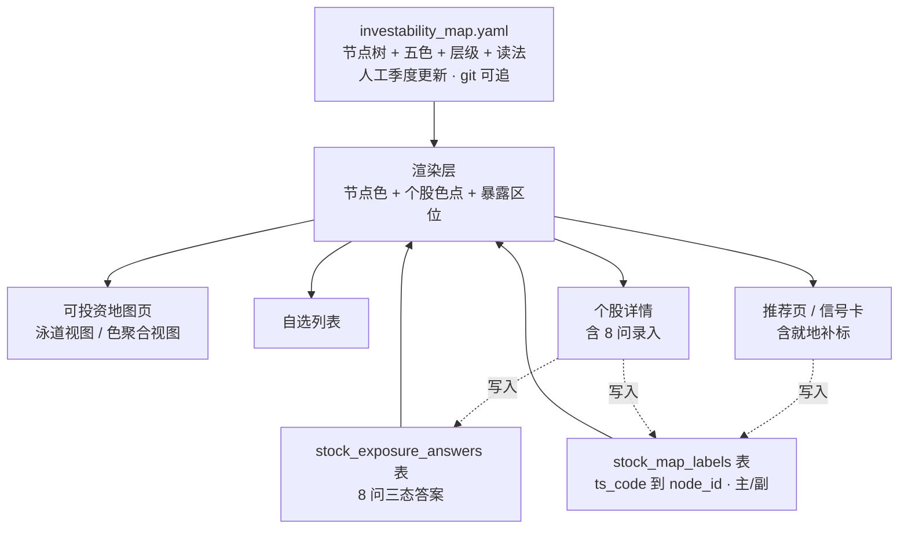
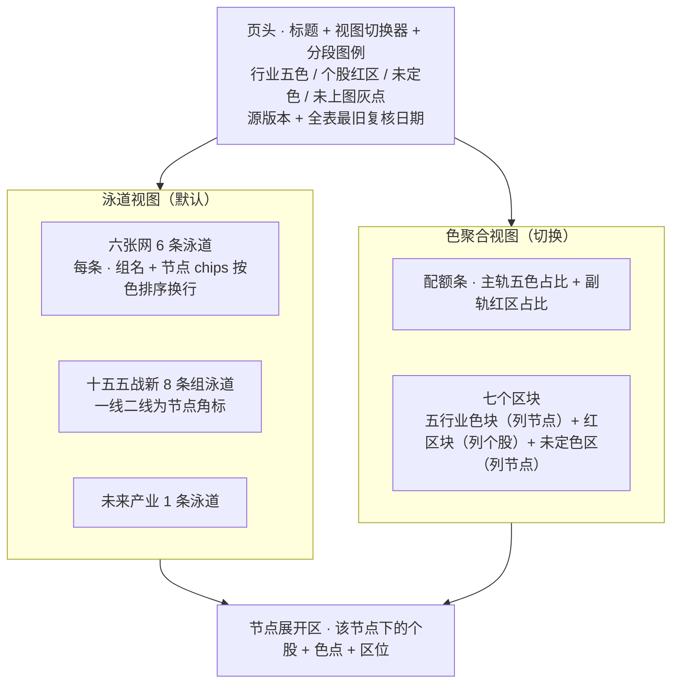
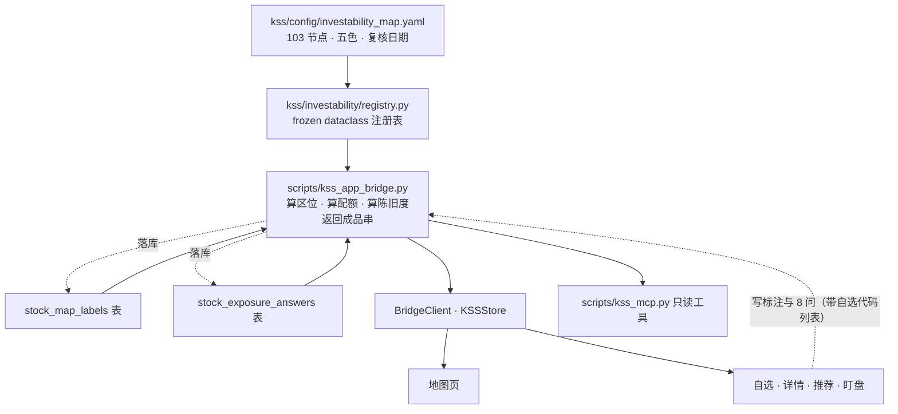

# 可投资地图 - Plan

## Goal Capsule

- **Objective:** 把《Keynes Analysis to this world》第 5 章的可投资地图落成 KSS 的一个页面与一层个股标签。103 个子行业节点按五色行业色板上色，主视图按产业链泳道排、可切到按色聚合。自选与紫苏叶覆盖的票手工挂到节点上，于是自选列表、个股详情、推荐卡上每只票都带行业色点与 8 问暴露区位。
- **Product authority:** Product Contract（R1 到 R25）> 后续 Planning Contract > 实现裁量。地图的色与节点内容以源 PDF 为准，PDF 未明确处以 `pending` 显式暴露，不由实现方补判断。
- **Execution profile:** code。地图骨架为 git 内 YAML，个股标注与 8 问答案为 DB，判定逻辑在 Python 桥接层，桌面端 SwiftUI 只渲染。
- **Product Contract:** 已变更。新增 R24 与 R25 两条 agent 面对等要求，其余 R1 到 R23 与全部流程、验收示例保持 brainstorm 原意与编号。新增两条的理由见 Planning Contract 的 KTD8。
- **Stop conditions:** 出现下列任一情况停下询问。要把行业色改成自动推导、要让 8 问分数改写行业色、要把标注写回 git 工作区文件、要把地图接进每日 cron、要给 agent 开任何写入路径、要把地图数据接进回测入口。
- **Open blockers:** 无。

---

## Product Contract

### Summary

新增一个「可投资地图」页，六张网、十五五战略性新兴产业、十五五未来产业共 103 个子行业节点，按深绿、浅绿、黄、橙、紫五色标注暴露属性。主视图按产业链泳道排列，可切换到按色聚合的视图。自选与紫苏叶覆盖的个股手工挂到节点上，在自选列表、详情页、推荐卡上显示行业色点与暴露区位；未挂节点的票显示灰点并可就地补标。

### Problem Frame

KSS 现有的板块与主题维度回答的是「哪个方向在涨」。[storage/themes_15th_5y.yaml](storage/themes_15th_5y.yaml) 的 22 个主题映射到东财行业与同花顺概念的板块名，[Sources/KSSDesktop/Views/ThemesView.swift](Sources/KSSDesktop/Views/ThemesView.swift) 靠热点轮动归档的龙头名单才落到具体的票上。[kss/supply_chain/scoring.py](kss/supply_chain/scoring.py) 的紫苏叶四维评分回答的是「这只票在产业链多深、护城河多宽」。

规则风险这一维度目前没有任何界面承载。制裁、出口管制、许可物项、反制筹码、资本进出通道，这四类风险在 A 股的定价里已成日常，在 KSS 里既不可见也不可比。看到一只半导体设备股和一只 CXO 股，现有界面给的是资金流、动量、产业链深度；前者是替代主航道、后者吃的是外需与全球定价，遇到同一条制裁新闻会朝相反方向走，这一层界面没说。

要补的是映射数据，也就是**那只票凭什么是这个色**。`stock_names` 表在本地库和运行态库都是 0 行，`theme_registry` 表 0 行，[storage/industry_map.csv](storage/industry_map.csv) 只有 20 行注释模板。唯一有 per-stock 标注的是 [kss/config/supply_chain.yaml](kss/config/supply_chain.yaml) 的 106 只票，其中 81 只带产业链标注，横跨半导体 20、新能源储能 18、AI算力 17、生物医药 13、具身智能 7、工业母机与低空航天 7、数字经济 4，另 25 只标注为空。

### Key Decisions

- **行业色板只用五色，红保留给个股级红区。** 源 PDF 5.6 的「红」条下挂的三项是清单深度锁定、美元清算高风险通道、无替代进口代理，都在描述公司状态而非子行业。红因此用作个股降级标记，触发条件是 8 问答出 5 项以上高暴露。Governs R2, R14。
- **色跟子行业走，暴露分跟公司走，两者不互相改写。** 色描述这个格子踩在什么规则风险上，8 问描述这家公司自己有多脏。源 PDF 5.7 的「橙+紫上限、红≈0」是组合层面的配额，不给个股改色。用户在听过「8 问会改色」这个替代读法后认可分离。Governs R6, R14, R15。
- **每节点一个主色，可带一个次色，次色不取红。** 源表里存在「黄→浅绿」这种演进方向、「浅绿/橙」这种并存、「浅绿/代理偏红」这种例外通道，单色字段承载不了三者。主色决定渲染，次色在节点详情里作为限定说明。次色取值限于五个行业色，源文的红色限定改写进限定说明文本，否则同一个红在同一页面上要同时表达行业属性与个股区位。Governs R3。
- **地图骨架走 git 内 YAML 且随应用打包分发，个股标注与 8 问答案走 DB。** 打包版 app 内的配置文件不可写（[kss/config/cron_manifest.py](kss/config/cron_manifest.py) 第 34 行有同样约束，`KSS_STATE_ROOT` 在 [kss/config/paths.py](kss/config/paths.py) 负责重定向），UI 就地补标必须落库。色表是人工季度判断的产物，不进 git 就无法回看上季度为什么定成橙。YAML 落 `kss/config/` 并按模块相对路径解析，与 [kss/supply_chain/registry.py](kss/supply_chain/registry.py) 同姿势；仓库顶层 `storage/` 不是可选落点，签名打包脚本会把它从应用资源里删掉。Governs R1, R10, R22, R23。
- **手工标注，不做申万行业自动映射。** 申万行业粒度对不到「光模块/连接」这一级，自动上色会大面积错色。覆盖面因此收在自选加紫苏叶 106 只。用户在申万别名表、LLM 辅助标注、复用板块龙头三个方案中选定了手工标。Governs R7。
- **源 PDF 未明确到节点级的色标记为 `pending`，不由实现方补判断。** 103 个节点里 17 个的色在源文里只有产业级或网级描述、或存在互相冲突的两处标注，推不到节点。让它们显式空着，比让实现方或模型猜一个色再被当成权威更安全。Governs R4。
- **源 PDF 中重复出现的子行业按字面结构算两个独立节点。** 「合成生物」在生物医药与生物制造下各出现一次，两处都保留，节点总数因此是 103，所属主轴字段保持单值。一只两边都算的票靠 R6 的一对多同时挂两个节点，不需要多值主轴。Governs R1, R5。

真值源分工与四个落点的关系。

### Requirements

**地图内容与色板**

- R1. 地图节点树按源 PDF 第 5 章逐条录入，共 103 个子行业节点，其中六张网 35、十五五战略性新兴产业 48、十五五未来产业 20。节点全表见 Appendix A2 到 A4。
- R2. 行业色板为五色，分别是深绿（底座、低暴露）、浅绿（替代、政策主航道）、黄（外需、全球定价）、橙（许可、点名博弈）、紫（反制筹码）。红不作为行业色使用。色在任何落点都不作为唯一信息载体，须与文本标签成对出现（深绿、浅绿、黄、橙、紫、已上图 · 待定色、未上图）。
- R3. 每个节点带一个主色，并可带一个次色与一句限定说明。主色决定该节点及挂在其下个股的显示色。次色取值限于五个行业色，红不得作为次色，源文的红色限定写进限定说明文本。
- R4. 源 PDF 未给到节点级色标、或对同一节点给出互相冲突色标的节点，主色记为 `pending` 并在地图上以未定色样式呈现，不由实现方或模型代为判定。Appendix 标出的 17 个节点属此类。
- R5. 每个节点带所属主轴（六张网、战略性新兴产业、未来产业）、所属组（如「算力网」「新材料」）、源 PDF 给出的读法一句、定色所依据的源文章节与片段、源 PDF 版本号、以及最近复核日期。一线或二线是可选字段，仅新一代信息技术的节点有值，缺失时不参与排布。

**个股标注与联动**

- R6. 个股与节点是一对多关系，其中恰有一个是主节点。主节点决定该股显示的行业色。
- R7. 可标注范围为自选列表全部个股加 [kss/config/supply_chain.yaml](kss/config/supply_chain.yaml) 已收录的 106 只，全部人工标注，不做自动映射。首版不以覆盖率达标为准入条件，覆盖度按 F2 随日常使用滚动增长。
- R8. 未标注个股在所有落点显示灰色点与「未上图」文案。主节点主色为 `pending` 的个股显示未定色样式与「已上图 · 待定色」文案，与灰点、与五色三者均可区分，并在 R20 的按色筛选中作为独立筛选项。
- R9. 节点下无个股分两态。未经人工确认覆盖的节点显示「未核」样式，人工确认过无标的的节点显示空心描边，只有后者计入 F1 的「无暴露」结论。未标注个股用实心灰点，与上述两种节点样式均可区分。
- R10. 个股标注可新增、可修改、可删除，每条记录带最后更新时间。
- R11. 个股标注的读写不依赖 git 工作区文件可写。

**8 问与暴露区位**

- R12. 每只个股可录入源 PDF 5.7 的 8 个尽调问题，每问三态，分别是「是」（高暴露）、「否」、「未知」。8 问原文见 Appendix A5。已定题数指答「是」或「否」的题数，「未知」不计入已定。
- R13. 8 问允许部分录入与全部留空，不强制填完。
- R14. 8 题全部已定时，暴露区位由答「是」的题数决定。0 到 2 为核心区、3 到 4 为卫星、5 及以上为红区。「未知」既不计入答「是」也不计入答「否」。区位与行业色是并列显示的两个维度，区位不改写行业色。
- R15. 未满足 R14 前置条件的票按下界定档，只往危险方向报。已答「是」达到 5 题显示「红区 · 已定 N/8」，达到 3 或 4 题显示「至少卫星 · 已定 N/8」，其余显示「未尽调 · 已定 N/8」。核心区结论只在 R14 前置条件满足时给出。

**界面落点**

- R16. 新增「可投资地图」页，默认视图按产业链泳道排列。六张网各一条泳道；十五五战略性新兴产业按所属组各一条泳道，分别是新一代信息技术、新能源、新材料、智能网联车、机器人、生物医药、高端装备、航空航天；未来产业单独一条。一线与二线降为泳道内的节点角标，只对新一代信息技术生效。泳道内节点按色排序并自动换行，泳道高度随行数增长，页面只做纵向滚动。
- R17. 地图页顶部提供视图切换器，可切到按色聚合的视图，共七个区块。五个行业色块各列出该色的全部节点并标注所属组；红区块不列节点，改列 8 问判定为红区的个股，块头注明红是个股区位而非行业色；末尾的未定色区列出主色为 `pending` 的节点并标注所属组。
- R18. 色聚合视图带组合暴露配额，分两轨且两轨不相加。主轨按五个行业色算只数占比，五色相加为 100%；副轨单独显示红区个股占比，用同一分母。分母为自选列表中已完成主节点标注的个股只数，未标注个股不计入分母，其只数在配额条旁单独标出。已标注不足 10 只时不渲染百分比，改显示各色只数并标注样本不足。用户可设定橙加紫合计上限，配额条以参考线呈现，越线时该段高亮；上限默认留空即不判定。
- R19. 地图上任一节点可展开，显示挂在该节点下的个股，每只带名称、行业色与暴露区位。
- R20. 自选列表每行显示该股的行业色点、色标签与主节点名，并可按色筛选，筛选项以文本形式呈现。
- R21. 个股详情页显示完整卡片，含行业色、主节点与副节点路径、8 问录入界面、暴露区位、标注最后更新时间。节点路径行提供改主节点与增删副节点的入口，删除主节点需二次确认并回落到「未上图」状态，任一修改后四个落点当场同步。
- R22. 推荐页与信号卡的个股卡片显示行业色点、色标签与暴露区位标，红区必须显示且视觉权重不低于色点。未标注个股显示灰点，点击后在当前界面弹出节点选择器完成标注，无需跳转。选择器按所属组分节呈现，顶部输入框对节点名与组名即时过滤，未定色节点以未定色样式正常可选，取消不写库。

**更新与维护**

- R23. 地图色表按季度人工更新，改 YAML 后提交 git，随下一次应用重签打包发布生效，不接入任何定时任务。每次复核在节点上写入复核日期。复核日期距今超过 120 天的节点，其节点与挂在其下个股的色点加陈旧标记；地图页头常驻显示当前生效的源 PDF 版本号与全表最旧复核日期。

**agent 面对等**

- R24. 个股的行业色、主节点与副节点路径、暴露区位、标注最后更新时间可按股票代码一次取出并暴露为只读工具；节点树连同五色、所属主轴、所属组、读法、源文依据与复核日期可整体取出。R21 的个股详情卡所用字段集与该工具的返回契约是同一份，桌面端不得有工具取不到的字段。
- R25. 标注与 8 问答案不提供任何 agent 写入路径，实时模式下同样不提供。地图内容的修改只经人工界面或人工改 YAML 提交。

地图页两个视图的区域构成。

### Key Flows

- F1. 浏览地图并下钻到个股
  - **Trigger:** 用户打开可投资地图页。
  - **Steps:** 页面以泳道视图渲染 103 个节点；用户切到色聚合视图查看配额条与各色节点；点开任一节点，展开该节点下已标注的个股及其色点与区位。
  - **Outcome:** 用户知道自己在哪些暴露区有票、哪些方向完全没有暴露。
  - **Covered by:** R16, R17, R18, R19

- F2. 从推荐卡就地补标
  - **Trigger:** 推荐页出现一只未标注的个股，卡片上显示灰点与「未上图」。
  - **Steps:** 用户点击灰点，当前界面弹出节点选择器；用户选定主节点与可选的副节点；标注写入并带时间戳；卡片当场变为对应行业色。
  - **Outcome:** 标注覆盖度随日常使用滚动增长，不需要单独的批量维护动作。
  - **Covered by:** R8, R10, R11, R22

- F3. 录入 8 问并得到暴露区位
  - **Trigger:** 用户在个股详情页展开 8 问录入界面。
  - **Steps:** 用户逐题选择「是」「否」「未知」；每次保存后重算答「是」的题数；8 题全部答完时给出核心区、卫星或红区；仍有未定题时显示「未尽调」与已定题数。
  - **Outcome:** 个股在所有落点的区位标随之更新，行业色点不变。
  - **Covered by:** R12, R13, R14, R15

### Acceptance Examples

- AE1. 未标注个股、未核节点、已确认无标的节点的三态区分
  - **Covers R8, R9.**
  - **Given:** 自选里有一只未标注的票；地图上「水网 / 水务运营」节点未经人工确认覆盖；「水网 / 泵阀管材」节点已人工确认无标的。
  - **When:** 用户看自选列表和地图页。
  - **Then:** 该票显示实心灰点与「未上图」；「水务运营」显示「未核」样式；「泵阀管材」显示空心描边。只有「泵阀管材」计入 F1 的「无暴露」结论。

- AE2. 主节点决定色
  - **Covers R3, R6.**
  - **Given:** 一只票主节点为「光模块/连接」（黄），副节点为「光纤光器件」（浅绿）。
  - **When:** 该票出现在自选列表与推荐卡上。
  - **Then:** 色点为黄；两个节点都出现在个股详情页的路径里，且该票同时出现在地图两个节点的展开区中。

- AE3. 8 问部分录入
  - **Covers R13, R15.**
  - **Given:** 一只票的 8 问只答了 5 题，其中 2 题答「是」。
  - **When:** 该票在任一落点显示。
  - **Then:** 区位显示「未尽调 · 已定 5/8」，不显示核心区；行业色点正常显示。

- AE4. 红区不改写行业色
  - **Covers R2, R14.**
  - **Given:** 一只主节点为「半导体设备」（浅绿）的票，8 问答完且有 6 题答「是」。
  - **When:** 该票在任一落点显示。
  - **Then:** 色点仍为浅绿，区位显示「红区 · 已定 6/8」；地图上该票仍挂在「半导体设备」节点下。

- AE5. 未定色节点
  - **Covers R4.**
  - **Given:** 「城市地下管网 / GIS一张图/数字孪生」节点的主色为 `pending`。
  - **When:** 用户在泳道视图与色聚合视图中查看。
  - **Then:** 泳道视图中该节点以未定色样式显示；色聚合视图中该节点不归入任何色块，单列在未定色区。

- AE6. 配额条口径与分母
  - **Covers R18.**
  - **Given:** 自选有 25 只票，其中 20 只已完成主节点标注、5 只未标注；已标注的 20 只里 4 只主节点是橙色节点、1 只是紫色节点，另有 1 只主节点浅绿但 8 问判为红区。
  - **When:** 用户查看色聚合视图的配额。
  - **Then:** 主轨分母为 20，橙显示 20%、紫显示 5%，五色相加为 100%，那只红区票在主轨按浅绿计；副轨单独显示红区 5%；未标注 5 只在配额条旁单独标出，不进分母；口径标明为只数而非仓位。

- AE9. 8 问全选「未知」不给低暴露结论
  - **Covers R12, R14, R15.**
  - **Given:** 一只票的 8 问全部选了「未知」。
  - **When:** 该票在任一落点显示。
  - **Then:** 区位显示「未尽调 · 已定 0/8」，不显示核心区；行业色点正常显示。

- AE10. 已定题数达到红区下界时提前定档
  - **Covers R15.**
  - **Given:** 一只票的 8 问已定 6 题，其中 5 题答「是」，另 2 题未录入。
  - **When:** 该票在任一落点显示。
  - **Then:** 区位显示「红区 · 已定 6/8」；剩余 2 题不可能把它翻回核心区，故不显示「未尽调」。

- AE7. 复合色节点的显示
  - **Covers R3.**
  - **Given:** 「新一代信息技术 / 先进代工、先进封装、存储」节点主色橙、次色黄，源文限定为「管制与周期双杀或双击」。
  - **When:** 该节点及挂在其下的个股显示。
  - **Then:** 节点与个股均按橙渲染；节点详情里显示次色黄与那句限定说明。

- AE8. 就地补标后立即生效
  - **Covers R10, R22.**
  - **Given:** 推荐页某只票显示灰点。
  - **When:** 用户点击灰点并选定主节点「减速器伺服控制」（浅绿）。
  - **Then:** 该卡片当场变为浅绿点；该票同时出现在地图对应节点的展开区与自选列表的色点上；标注记录带本次更新时间。

### Scope Boundaries

- 资讯雷达命中制裁、管制、反制类新闻后推送地图节点「待复核」队列。已讨论并明确推后，先把地图做成。
- 从 Tushare `stock_basic` 拉全市场申万行业并做别名表自动上色。
- 用模型读主营业务描述辅助生成候选节点标注。
- 8 问的自动预填，包括海外收入占比、十大股东外资、合规新闻。
- 按仓位市值计算配额条。自选是无权重列表，本期只做只数口径。
- 修改 [kss/config/supply_chain.yaml](kss/config/supply_chain.yaml) 的紫苏叶评分逻辑或字段语义。本计划只读取它的个股清单作为标注覆盖面。
- 与 [storage/themes_15th_5y.yaml](storage/themes_15th_5y.yaml) 的十五五主题做映射或合并。两者是各自独立的分类。地图节点按子行业手标、服务规则风险暴露；主题按板块名匹配、服务资金叙述。键对不上，本期不打通。
- 推荐页与信号卡长期以灰点为主。候选来自全市场因子排名，与 R7 的覆盖面几乎不相交，这是设计结果不是缺陷；色点在该落点的作用是提示这只票还没进地图。

#### Deferred to Follow-Up Work

- 8 问答案的按题追加写与详情页的区位变化时间线。本期按 KTD11 走覆盖写。
- 打包版下不重签包也能拿到新色表的运行态覆盖副本加同步动作。形状在定时任务清单那边已有先例，本期按 KTD9 走随重签发布生效。
- 修复十五五主题配置在打包版里的静默失效。它解析仓库顶层 `storage/` 而该目录被打包脚本删掉，消费方拿到空字典。这是本轮研究顺带发现的相邻缺陷，与本计划同源但不同域，单独处理。

### Dependencies / Assumptions

- 源 PDF `Keynes Analysis to this world.pdf` V1.1（2026-08-09）是地图内容的唯一权威。它自述「分析框架与思想实验，不构成投资、法律或合规建议」，本模块沿用同样定位。色只用来管理暴露，不下买卖判断。
- 假设首版录入时 103 个节点里有 17 个色为 `pending`，其余 86 个可从源 PDF 直接推得。首版上线不以补齐这 17 个为前提。
- 假设地图开局大量节点无个股。106 只紫苏叶票里 81 只带链标注，集中在半导体、新能源储能、AI算力、生物医药几条链上，水网、城市地下管网、物流网大概率一只票都没有。按 R9，这些节点开局是「未核」而不是「已确认无暴露」，两者不共用样式。
- 人工工作量按 R7 的覆盖面计：约 108 条主节点标注、8 问满配 864 题、每季度复核 103 个节点。8 问为可选录入、按需逐只补，不作为首版准入条件。以此量级判断人工成本可接受。
- 假设 8 问所需的美系收入占比、股权穿透、合规史、出境新规四类事实在 KSS 现有数据面里没有对应字段，只能站外逐票查证。这项查证成本本计划未估。
- 桌面端已有的主题系统与响应式布局约定适用于新页面，本计划不引入新的视觉体系。

### Outstanding Questions

**Resolve Before Implementation（2026-08-09 已裁决）**

- ~~两张新表要不要进自由 SQL 查询的可见表清单。~~ **不进清单，只靠 U8 的专用工具供数。** 登记门「新旧真源逐行核对」的语义不被稀释，`kss/storage/duck.py` 不动。代价已知：没预想到的交叉提问（如「橙色节点下的票近 20 日涨幅」）答不了，等真的被问到再谈扩门。
- ~~应用内 AI 面板要不要也拿 U8 的两个只读工具。~~ **给面板，与 MCP 对称。** 三个只读工具（`get_investability_map` / `get_investability_exposure` / `get_investability_quota`）已进 `kss_chat_loop.TOOL_SPECS`。不照抄紫苏叶先例的理由是数据性质不同：这层是用户自己维护的判断，「这只票我标了吗」天然会问面板。写面在两侧同样缺席（KTD8），并由 `test_investability_mcp.py` 的两条新断言钉住。

**Deferred to Planning**

- 源 PDF 内部对「充换电」的色标不一致。5.3 表写「电控充换浅绿」，5.6 总览色条把「充换电基建」列在深绿。按 R4 首版落 `pending`，季度复核时人工裁决。
- 节点选择器在推荐卡上的具体容器形式，下拉、弹层或内联展开。内容要求已由 R22 定死。
- 泳道视图与色聚合视图的切换是否保留展开状态。两个视图共用同一个展开区。
- 地图页节点展开区是否复用现有概念主题页的下钻组件。
- 五色在每套设计系统下的具体取值。KTD6 已定进主题 token 且逐套定值，剩下的是配色判断，实现时逐套过一遍对比度。

**2026-08-09 审阅挂起**

以下四项来自本轮文档审阅，都在新增能力，留给你裁决。它们不进 Implementation Units。

- ~~是否把「自选列表全部个股的 8 问答完」设为首版准入门槛。~~ **不设门槛，先上线。** 区位这一维度会长期停在「未尽调」是已知代价，按需逐只补。
- **（2026-08-09 追加裁决）给助手草拟路径，草稿要人工确认后入库。** 落成只读桥接命令 `investability-answer-draft SYMBOL`：模型逐题给 `yes/no/unknown` 加一句依据，拿不准一律 unknown；草稿不碰任何表，只在详情页 8 问卡上逐题挂一个「采纳」，点它才走 `investability-answer` 落库。KTD8 不被绕开——写的仍然是人。该命令仅应用内可用，不注册 agent 工具（命令表条目已注明）。
- 是否加一条覆盖率读数（近 30 天推荐与信号卡去重个股中已标注的比例、最近一次新增标注日期），用来看出这个手工数据模块还有没有人喂。
- 是否加首版有效性判据。当前的验收全在测渲染，全部通过也不能说明这层色改变过任何一个决定，首版跑完没有依据判断该继续投入还是收窄。
- 是否用 [kss/config/supply_chain.yaml](kss/config/supply_chain.yaml) 已有的 81 条手标（产业链、层级、角色）生成首版主节点候选值，再在界面里逐条人工确认后入库。这与被否掉的申万自动映射不是同一件事，源头是你自己的手标；但它改变了「全手工标注」的执行方式。

### Sources / Research

- 源文档 `Keynes Analysis to this world.pdf` V1.1 扩地图版，第 5 章「可投资地图」（5.1 色板、5.2 六张网拆解、5.3 战略性新兴产业、5.4 未来产业、5.5 一线 vs 二线、5.6 总览色条、5.7 公司 8 问与五步流程）。
- [kss/config/supply_chain.yaml](kss/config/supply_chain.yaml)，106 只票的人工产业链标注，其中 81 只带链标注横跨 7 条链、25 只为空，是本计划标注覆盖面的来源。
- [kss/supply_chain/registry.py](kss/supply_chain/registry.py) 的 `StockChainInfo` 多值 `demand_chains` 字段，是「个股对多节点」这一形状的既有先例。
- [storage/themes_15th_5y.yaml](storage/themes_15th_5y.yaml)，22 个十五五主题映射到板块名，是「YAML 存人工判断骨架、走 git」这一模式的来源。它的落点不可照抄。仓库顶层 `storage/` 会被签名打包脚本从应用资源里删掉，`kss/` 才会被拷进去，所以地图 YAML 按 [kss/supply_chain/registry.py](kss/supply_chain/registry.py) 的模块相对姿势落 `kss/config/`。
- [Sources/KSSDesktop/Views/ThemesView.swift](Sources/KSSDesktop/Views/ThemesView.swift)，现有「概念主题」页的主题、板块、龙头三级下钻，可作地图页下钻结构的参照。
- [kss/config/cron_manifest.py](kss/config/cron_manifest.py) 第 34 行，bundle 模式下 app 内文件不可写的既有约束记录。
- [kss/config/paths.py](kss/config/paths.py) 的 `KSS_STATE_ROOT` 双根重定向，决定用户可写数据的落地位置。
- 数据缺口核实（本次实测）。`stock_names` 表在仓库内 `kss.db` 与运行态 `~/Library/Application Support/KSS/storage/kss.db` 中均为 0 行；`theme_registry` 表 0 行；[storage/industry_map.csv](storage/industry_map.csv) 仅 20 行注释模板。这三处的空是「手工标注而非自动映射」这一决策的直接依据。

---

## Planning Contract

### Key Technical Decisions

- KTD1. **地图配置落 `kss/config/investability_map.yaml`，由桥接层单点直读，不进库。** 打包脚本把 `kss/` 整目录 rsync 进应用资源、把仓库顶层 `storage/` 删掉，所以 `kss/config/` 是唯一能随包分发的人工配置落点，且该目录已有 7 个 yaml 在包里。桥接读一次、桌面端与 agent 共用同一份解析结果，绕开那条至今无人跑的 YAML 到运行态导入链。Governs R1, R5。
- KTD2. **暴露区位、配额占比、陈旧判定全部在 Python 侧算完，返回成品串。** 桌面端拿到的是「红区 · 已定 6/8」这样的完整文案而不是三态原始答案。规则只实现一次，agent 侧不必重算；仓库已经为「把确定性变换派给模型」付过一次代价（龙虎榜数字被编造）。Governs R14, R15, R18, R23, R24。
- KTD3. **配额分母由桌面端传显式股票代码列表，Python 不自己查自选表。** 自选的真源是桌面端的 `@AppStorage("watchlistSymbols")`，`watchlist` 表只是镜像且同步失败被静默吞掉，从表里算配额会在镜像写失败时漂移。Governs R18。
- KTD4. **8 问存成 8 个整数列，空值表示未答，不用 `payload_json`。** 数据层的既有政策是结构随策略迭代变动的域才用 JSON 载荷，结构稳定的域用真列；8 个固定问题是稳定的那一类。整数列也让已定题数可以直接在 SQL 里数。Governs R12, R14, R15。
- KTD11. **8 问答案与节点标注都用覆盖写加更新时间，本期不留答案变更历史。** 每条记录带 `updated_at`，改答案就地覆盖旧值。留痕的价值是能回看一只票什么时候从核心区滑到红区，但那需要按题追加写并在详情页加一条时间线，属于新增能力而不是修缺陷，列入后续候选。覆盖写仍保留了 R23 的陈旧判定所需的时间字段。Governs R10, R12。
- KTD5. **两张新表以追加一条迁移的方式加入，表定义 `) STRICT` 收尾，不对自选表建外键。** 历史迁移的 SQL 文本绝不修改。不建外键的理由是自选表每次点星都整表 `DELETE` 再重写，外键会连带删掉标注。Governs R10, R11。
- KTD6. **五个行业色作为新色槽进主题 token，9 套设计系统 × 2 个外观逐套定值。** 共 90 个色值，并同步更新断言 palette 数量的测试。本轮由用户裁定，代之于独立于设计系统的单一语义色集，理由是视觉一致性优先。Governs R2。
- KTD7. **地图加载器在配置缺失时降级为空并告警，不抛异常。** 项目的数据层纪律是降级返回而非抛错，加载器抛异常会让部分安装的打包版直接起不来。节点树读空时地图页显示空态，不影响其他页面。Governs R1, R4。
- KTD8. **agent 只读不写。** 新增的桥接读命令登记进命令表但不进写命令集合，MCP 侧只注册读工具。写确认机制的 `confirm=True` 来自 agent 而不是人，拿它守人工色表等于把 R7 的手工标注偷换成模型标注。Governs R24, R25。
- KTD9. **季度改色随下一次重签打包发布生效，本期不做运行态覆盖副本。** 覆盖副本的形状在定时任务清单那边已有先例（包内清单只读、运行态目录放覆盖文件、内存合并从不回写），本期不引入是因为色表变更频率是季度级，等一次发版可接受。Governs R23。
- KTD10. **地图数据靠类型隔离挡在回测入口之外。** 节点标签与 8 问答案是人工当下判断、没有时点历史，喂进横截面回测就是前视偏差加幸存者偏差。机制是这些数据只经桥接出到界面与 agent，不进 `kss/backtest/` 任何入口所接受的数据类型，而不是靠约定提醒。

### 需求到代码落点的映射

R19 到 R22 说的四处界面，对应的具体渲染点如下。这张表消除「个股详情页」「信号卡」这类说法的歧义。

| 需求 | 界面说法 | 实际渲染点 |
|---|---|---|
| R19 | 地图节点展开区 | `Sources/KSSDesktop/Views/InvestabilityMapView.swift`（新建） |
| R20 | 自选列表 | `Sources/KSSDesktop/Views/StockBrowserView.swift` 的列表行，该视图同时服务自选与全部股票两个入口 |
| R21 | 个股详情页 | 同文件内的 `StockDetailView`，8 问卡片与既有的复盘卡、紫苏叶富化卡并列 |
| R22 | 推荐页 | `Sources/KSSDesktop/Views/RecommendationsView.swift` 的 `recTableRow` |
| R22 | 信号卡 | `Sources/KSSDesktop/Views/DashboardView.swift` 的 `TodayPicksList` 与 `PerillaPicksTable` 两张表 |

### High-Level Technical Design

读路径与判定位置。所有判定在桥接层完成，两个消费端拿到的是同一份成品。

### System-Wide Impact

四处改动会波及本计划之外的东西，实现时要连带确认。

- **主题系统。** U4 给全部 18 个 palette 加五个色槽，任何一套漏定值都会在该主题下渲染出空色。断言 palette 数量与设计系统数量的既有测试要同步更新，改动本身不改这两个数字。
- **桥接命令表。** 新增五个命令后，取向命令会把整张命令表发给 agent。命令登记了而工具没给，agent 会看到一个叫不动的命令并倾向于自己猜或编。所以 U3 与 U8 要么同批落地，要么在命令说明里注明仅应用内可用。
- **既有四处视图的行渲染。** 推荐页与盯盘页的表头列宽是重复字面量，新增独立列需同时改表头与行；优先把徽标放进既有的名称与代码竖排。自选列表的可点灰点必须是行按钮的兄弟节点，嵌套会被列表吞掉点击。
- **sidecar 生命周期。** 它是长进程且只导入一次桥接模块，加完命令后不完整重启就一直服旧代码。SIGHUP 会留旧环境，需要 SIGTERM 后重起。

### 排期与依赖

U1 与 U2 无相互依赖，可并行。U3 依赖两者。U4 与 U1 到 U3 无依赖，可任意时点插入，但必须早于 U5 与 U6。U5 到 U8 依赖 U3。U8 与 U5 到 U7 无依赖，可并行，但按上面的命令表影响，U8 不宜比 U3 晚太多。

---

## Implementation Units

### U1. 地图配置与加载器

- **Goal:** 把源文第 5 章的 103 个节点落成可加载的 YAML，并提供一个只读注册表。
- **Requirements:** R1, R2, R3, R4, R5
- **Dependencies:** 无
- **Files:**
  - `kss/config/investability_map.yaml`（新建）
  - `kss/investability/__init__.py`（新建）
  - `kss/investability/registry.py`（新建）
  - `kss/tests/test_investability_registry.py`（新建）
- **Approach:**
  1. YAML 顶层含 `version`、`source_version`、`palette`、`nodes`。每个节点带 `node_id`、`name`、`axis`、`group`、`primary_color`、`secondary_color`、`tier`、`reading`、`source_ref`、`last_reviewed`。
  2. 节点内容照录 Appendix A2 到 A4 的三张表，17 个未定色节点的 `primary_color` 写 `pending`。
  3. 加载器类结构对齐 `kss/supply_chain/registry.py`，错误纪律对齐 `kss/sector/themes.py`，即自定义一个配置异常类用于 YAML 语法错误与顶层结构错误，文件缺失走 KTD7 的降级。
  4. 路径按 `Path(__file__).resolve().parents[1] / "config" / "investability_map.yaml"` 解析，模块相对，打包后仍成立。
- **Patterns to follow:** `kss/supply_chain/registry.py` 的 frozen dataclass 加 `as_dict()` 加容器类三段式；`kss/sector/themes.py` 的异常类与逐项容错跳过。
- **Test scenarios:**
  - 完整 YAML 加载后节点总数为 103，六张网 35、战略性新兴 48、未来产业 20。
  - 未定色节点的主色读出为 `pending`，且不等同于缺失字段。
  - 次色为红的节点加载失败并告警跳过该节点，其余节点仍可用（守 R3 的红不作次色）。
  - YAML 语法错误抛出配置异常类。
  - 顶层缺 `nodes` 键抛出配置异常类。
  - 文件不存在时返回空注册表并告警，不抛异常。
  - 单个节点缺必填字段时告警跳过该节点，其余节点仍可用。
  - 按 `node_id` 查询命中；查询不存在的 id 返回空值而非抛错。
- **Verification:** `pytest kss/tests/test_investability_registry.py -q` 全绿；`python -c` 加载真实配置文件打印节点数为 103。

### U2. 暴露数据的两张表与存储模块

- **Goal:** 建立个股节点标注与 8 问答案的持久化，含读写函数。
- **Requirements:** R6, R10, R11, R12, R13
- **Dependencies:** 无
- **Files:**
  - `kss/storage/db.py`（在迁移元组尾部追加一条）
  - `kss/storage/investability.py`（新建）
  - `kss/tests/test_investability_storage.py`（新建）
- **Approach:**
  1. 追加迁移建两张表。`stock_map_labels` 含 `ts_code`、`node_id`、`is_primary`、`updated_at`，主键为 `(ts_code, node_id)`。`stock_exposure_answers` 含 `ts_code` 主键、`q1` 到 `q8` 八个整数列、`updated_at`。两表均 `) STRICT` 收尾，均不建外键。
  2. `q1` 到 `q8` 的取值约定为 1 表示「是」、0 表示「否」、空值表示「未知」或未答。三态与两态的区别由列是否为空承载。
  3. 存储模块提供按代码读标注、整体替换某只票的标注、读 8 问、写单题、以及批量读多只票的函数。每个函数自己调用建表保证函数。
  4. 主节点唯一性由写函数保证，写入新主节点时把该票旧的主标记清掉。
- **Patterns to follow:** `kss/storage/watchlist.py` 的 `with connect(db_path) as conn` 加建表保证的开头两行；`kss/storage/signal_cards.py` 的模块组织。
- **Test scenarios:**
  - 迁移追加后建表成功，且既有迁移版本列表断言不变。
  - 表定义为 STRICT，往整数列写非数字文本被拒。
  - 写入一主一副两个节点后读回，主节点标记唯一。
  - 同一只票再写一个新主节点，旧主自动降为副或被替换，主节点仍唯一。
  - 删除某票全部标注后读回为空。
  - 8 问只写第 3 题，读回时第 3 题有值、其余七题为空。
  - 8 问某题先写「是」再改「否」，读回为「否」且更新时间变化。
  - 批量读 100 只票的标注，返回字典键为代码。
  - 自选表整表删除重写后，标注数据不受影响（守 KTD5 的不建外键）。
- **Verification:** `uv run pytest kss/tests/test_investability_storage.py kss/tests/test_storage_db.py -q` 全绿。

### U3. 桥接读写命令

- **Goal:** 把地图与暴露数据经桥接层暴露给桌面端，判定逻辑在此实现。
- **Requirements:** R14, R15, R18, R23, R24
- **Dependencies:** U1, U2
- **Files:**
  - `scripts/kss_app_bridge.py`（新增实现函数、dispatch 分支、命令表登记、写命令集合登记）
  - `kss/config/write_command_labels.yaml`（写命令的人类可读说明）
  - `kss/tests/test_bridge_investability.py`（新建）
- **Approach:**
  1. 读命令三个。取节点树（含五色与全部节点字段）；按代码取单只票的暴露信息；取自选口径的汇总（收一个显式代码列表，返回各色只数、红区名单、未标注只数、配额占比或样本不足标记）。
  2. 写命令两个。写某只票的节点标注；写某只票的单题答案。两者都进写命令集合。
  3. 区位判定在此实现 R14 与 R15 的完整规则，含 8 题全定才给核心区、「未知」不计入两侧、以及下界定档。返回值是成品串。
  4. 陈旧判定在此比较节点复核日期与当前日期，超过 120 天打标记。
  5. 全部函数从模块级状态根变量派生数据库路径，不导入路径常量，以便测试替换。
- **Patterns to follow:** `_watchlist_set` 的显式路径传递写法；命令表条目的 `desc` 与 `args` 字段格式。
- **Test scenarios:**
  - 取节点树返回 103 个节点，未定色节点的主色字段为 `pending`。
  - 覆盖 AE3。某票 8 问只答 5 题其中 2 题「是」，返回区位串为「未尽调 · 已定 5/8」。
  - 覆盖 AE9。某票 8 题全选「未知」，返回「未尽调 · 已定 0/8」，不返回核心区。
  - 覆盖 AE10。某票已定 6 题其中 5 题「是」，返回「红区 · 已定 6/8」。
  - 覆盖 AE4。某票主节点为浅绿节点且 8 题全定 6 题「是」，返回的行业色仍为浅绿、区位为红区。
  - 覆盖 AE6。传入 25 只代码其中 20 只已标注，主轨分母为 20、五色占比合计 100%，副轨红区单独给出，未标注 5 只单列。
  - 已标注不足 10 只时返回样本不足标记而非百分比。
  - 覆盖 AE2。某票主节点黄、副节点浅绿，返回色为黄，两个节点都在路径里。
  - 未标注个股返回明确的未上图态，与已标注但主节点未定色的态取值不同。
  - 节点复核日期为 200 天前时返回陈旧标记，为 30 天前时不返回。
  - 写标注后立即读回，更新时间非空。
  - 新增的读命令与写命令全部出现在命令表中（守既有的命令漂移测试）。
  - 写命令出现在写命令集合中，读命令不出现。
- **Verification:** `.venv-desktop/bin/python -m pytest kss/tests/test_bridge_investability.py kss/tests/test_bridge_orientation.py -q` 全绿。改完命令后完整重启 sidecar（SIGTERM 后重起，SIGHUP 会留旧代码），再手工调一次读命令确认走的是新代码。

### U4. 五色主题 token

- **Goal:** 让五个行业色成为主题系统的一等色槽，9 套设计系统各自定义。
- **Requirements:** R2
- **Dependencies:** 无
- **Files:**
  - `Sources/KSSDesktop/Support/ThemeTokens.swift`
  - `Tests/KSSDesktopTests/ThemeCatalogTests.swift`
- **Approach:**
  1. 在主题 token 结构里增加五个色槽，命名对应五色语义而非颜色本身，避免与既有的涨跌色槽混淆。
  2. 9 套设计系统 × 2 个外观各定 5 个值，共 90 个。定值时保证同一外观下五色两两可辨，尤其是深绿与浅绿、黄与橙这两对。
  3. 另外定义未定色、未上图灰点、未核节点三个非五色状态的取值，同样按外观区分。
  4. 更新断言 palette 总数与设计系统数量的测试。
- **Execution note:** 这是本计划里唯一一处大批量数值改动，先改一套设计系统跑通测试，再铺其余八套。
- **Patterns to follow:** 既有涨跌色槽的外观区分写法。
- **Test scenarios:**
  - 全部 18 个 palette 都能解析出五个行业色槽，无空值。
  - 既有的 palette 数量断言与设计系统数量断言仍成立。
  - 每个 palette 内五色两两不相等。
  - 未定色、未上图、未核三个状态色在每个 palette 内与五色均不相等。
- **Verification:** `swift test --filter ThemeCatalogTests` 全绿。无完整 Xcode 时降级为 `swift build --build-system native` 通过。

### U5. 可投资地图页

- **Goal:** 新增地图页，含泳道与色聚合两个视图和节点展开区。
- **Requirements:** R16, R17, R18, R19
- **Dependencies:** U3, U4
- **Files:**
  - `Sources/KSSDesktop/Views/InvestabilityMapView.swift`（新建）
  - `Sources/KSSDesktop/Models/KSSModels.swift`（新增模型类型与工作区分区枚举成员）
  - `Sources/KSSDesktop/Services/BridgeClient.swift`（新增读方法）
  - `Sources/KSSDesktop/Services/KSSStore.swift`（新增发布属性与加载方法）
  - `Sources/KSSDesktop/Views/ContentView.swift`（新增路由分支）
  - `Sources/KSSDesktop/Support/SidebarNavIcon.swift`（新增图标基名分支）
  - `Resources/Icons/nav/`（新增描边与填充两个 PDF）
- **Approach:**
  1. 工作区分区枚举加一个成员，编译器会强制补显示名与符号；不要把它加进隐藏数组，否则侧栏不显示。排序方法已声明会把持久化顺序里缺失的成员追加到末尾，不需要迁移用户偏好。
  2. 路由分支要放在等待仪表盘快照那个条件之外，与 AI 面板和投研分析页同层，因为地图页只读配置与两张小表，不该等大快照。
  3. 泳道视图按 R16 分道，节点 chip 按色排序并自动换行。
  4. 色聚合视图按 R17 分七区，配额条按 R18 的两轨渲染。
  5. 两个视图共用同一个展开区组件。
- **Patterns to follow:** 既有概念主题页的主题、板块、龙头三级下钻结构；列表行用按钮加行背景而不是系统选中态。
- **Test scenarios:**
  - 工作区分区新成员有显示名、符号与图标基名，两个图标 PDF 均可加载。
  - 覆盖 AE5。未定色节点在泳道视图显示未定色样式，在色聚合视图落在未定色区而不进任何色块。
  - 覆盖 AE1。已确认无标的的节点显示空心描边，未核节点显示未核样式，两者可区分。
  - 节点树为空时地图页显示空态而不崩（守 KTD7）。
  - 视图切换后展开区状态的行为符合实现选择，且两个视图不会同时持有互相冲突的展开态。
- **Verification:** `swift test --filter SidebarNavIconTests` 全绿；`script/build_and_run.sh` 起应用后地图页可打开、两个视图可切换、任一节点可展开。

### U6. 四处落点的色点与区位徽标

- **Goal:** 把行业色点、色标签与暴露区位标铺到日常看得见的四处界面。
- **Requirements:** R8, R9, R20, R22
- **Dependencies:** U3, U4
- **Files:**
  - `Sources/KSSDesktop/Views/StockBrowserView.swift`（列表行加徽标，筛选条件加色）
  - `Sources/KSSDesktop/Views/RecommendationsView.swift`（`recTableRow` 加徽标）
  - `Sources/KSSDesktop/Views/DashboardView.swift`（`TodayPicksList` 与 `PerillaPicksTable` 两张表加徽标）
  - `Sources/KSSDesktop/Services/KSSStore.swift`（标注字典的加载与分发）
- **Approach:**
  1. 四处共用一个徽标组件与一份标注字典，由存储层统一加载后按参数下发，不给任一视图单开读路径。
  2. 推荐页与盯盘页的表头列宽是重复字面量，若新增独立列需同时改表头与行；优先把徽标放进既有的名称与代码竖排里，避免动列宽。
  3. 未标注个股的灰点是可点击控件，必须作为行按钮的兄弟节点而不是嵌套在里面，否则列表会吞掉内层点击。
  4. 按色筛选的筛选项以文本形式呈现，不用纯色块作可点目标。
- **Patterns to follow:** 自选星标按钮作为行按钮兄弟节点的既有写法。
- **Test scenarios:**
  - 覆盖 AE1。未标注个股在四处均显示灰点与未上图文案。
  - 已标注但主节点未定色的个股显示未定色样式与已上图待定色文案，与灰点可区分。
  - 覆盖 AE4。主节点浅绿且判为红区的个股，四处显示的色点均为浅绿、区位标均为红区。
  - 按色筛选选中某色后，自选列表只剩该色个股；选中未上图筛选项后只剩未标注个股。
  - 点击灰点触发标注流程，不触发行本身的选中行为。
- **Verification:** `swift build --build-system native` 通过；起应用后四处界面各确认一遍徽标渲染与灰点可点。

### U7. 个股详情的节点编辑与 8 问录入

- **Goal:** 提供标注的增改删入口与 8 问录入界面，以及推荐卡上的就地补标。
- **Requirements:** R10, R21, R22
- **Dependencies:** U3, U4
- **Files:**
  - `Sources/KSSDesktop/Views/StockBrowserView.swift`（`StockDetailView` 内新增节点路径卡与 8 问卡）
  - `Sources/KSSDesktop/Views/RecommendationsView.swift`（灰点触发的节点选择器）
  - `Sources/KSSDesktop/Services/BridgeClient.swift`（新增两个写方法）
  - `Sources/KSSDesktop/Services/KSSStore.swift`（写入后的本地状态刷新）
- **Approach:**
  1. 节点选择器按所属组分节呈现，顶部输入框对节点名与组名即时过滤，未定色节点正常可选，取消不写库。
  2. 详情页的节点路径行提供改主节点与增删副节点，删除主节点二次确认后回落到未上图态。
  3. 8 问逐题保存，每次保存后重新取一次区位串，不在桌面端自行计算。
  4. 写确认弹窗对界面直接写入不触发，与自选点星的现有行为一致；这一点写清楚以免实现方去接确认流程。
- **Patterns to follow:** 自选点星的直写路径；详情页既有卡片的布局与间距。
- **Test scenarios:**
  - 覆盖 AE8。推荐卡灰点选定主节点后卡片当场变色，同一只票在自选列表与地图展开区同步出现。
  - 选择器输入关键词后候选列表按名称与组名过滤命中。
  - 选择器取消后不产生任何写入。
  - 详情页改主节点后，四处落点的色点同步变化。
  - 删除主节点二次确认后该票回到未上图态。
  - 覆盖 AE3。8 问答到第 5 题时区位标显示未尽调与已定题数，答满后显示结论。
- **Verification:** `swift build --build-system native` 通过；起应用后完整走一遍补标、改标、删标、8 问录入四条路径，每步确认库里数据与界面一致。

### U8. agent 面读工具与目录登记

- **Goal:** 让助手能查到与界面同一份暴露数据。
- **Requirements:** R24, R25
- **Dependencies:** U3
- **Files:**
  - `scripts/kss_mcp.py`（新增两个只读工具）
  - `kss/config/data_catalog_meta.yaml`（补两张表的列含义）
  - `kss/storage/duck.py`（可见表清单，取决于 Open Questions 里那条裁决）
  - `kss/tests/test_investability_mcp.py`（新建）
- **Approach:**
  1. 两个工具。取节点树；按代码取暴露信息，代码为空时返回自选口径汇总。参数扁平字符串带默认值，返回字典，说明里写清覆盖边界与降级取值。
  2. 应用内面板是否也给这两个工具需要一个明确决定，紫苏叶富化的先例是给 MCP 不给面板且有测试钉住，这层数据性质不同。
  3. 工具说明里写明标签是人工先验不是核实事实，避免助手拿它下合规结论。
- **Patterns to follow:** 紫苏叶富化工具的参数与返回形状；按代码可选、空则返回汇总的既有工具写法。
- **Test scenarios:**
  - R21 详情卡用到的每个字段都出现在按代码取暴露信息的返回里，用固定断言两侧字段集相等。
  - 区位串在工具返回值与界面显示中逐字一致。
  - 未标注、已上图待定色、未核三态在返回值里取三个不同枚举值。
  - 实时模式下启动 MCP，注册工具里不含任何地图写工具。
  - 汇总返回的红区名单与色分布与配额口径一致。
- **Verification:** `pytest kss/tests/test_investability_mcp.py -q` 全绿；起 MCP 后手工调两个工具确认返回结构。

---

## Verification Contract

| 门 | 命令 | 适用单元 |
|---|---|---|
| Python 单测 | `uv run pytest kss/tests -q` | U1, U2, U8 |
| 桥接单测 | `.venv-desktop/bin/python -m pytest kss/tests/test_bridge_investability.py kss/tests/test_bridge_orientation.py -q` | U3 |
| 静态检查 | `ruff check kss/` 与 `mypy kss/` | U1, U2, U3, U8 |
| Swift 单测 | `swift test` | U4, U5 |
| Swift 构建 | `swift build --build-system native` | U4, U5, U6, U7 |
| 应用真机 | `script/build_and_run.sh` | U5, U6, U7 |
| sidecar 刷新 | 完整 SIGTERM 重启后手调一次新读命令 | U3 |

---

## Definition of Done

- 103 个节点全部录入，17 个未定色节点显式标记，加载器读得到全表。
- 两张新表随迁移建立，既有迁移版本断言未变，自选表整表重写不影响标注数据。
- 区位判定的四条规则（8 题全定才给核心区、未知不计入两侧、下界定档、行业色不被改写）在桥接层实现，且验收示例 AE3、AE4、AE9、AE10 全部通过。
- 配额两轨按已标注个股算，样本不足 10 只时不出百分比，未标注只数单列。
- 18 个 palette 各有完整的五色与三个状态色，主题相关测试全绿。
- 地图页可打开，两个视图可切换，任一节点可展开看到挂载个股。
- 未标注个股、已上图待定色个股、未核节点、已确认无标的节点四态在界面上互相可区分。
- 补标、改标、删标、8 问录入四条写路径走通，界面与库内数据一致。
- 两个只读工具可调用，返回的字段集与区位串与界面一致，写工具在实时模式下确认缺席。
- 全部验收门通过，sidecar 已完整重启并确认服的是新代码。

---

## Appendix

### A1. 色板定义

源 PDF 5.1 给出六色，其中五色为行业属性、一色为个股状态。

| 色 | 含义 | 用作 |
|---|---|---|
| 深绿 | 底座 / 低暴露 | 行业色 |
| 浅绿 | 替代 / 政策主航道 | 行业色 |
| 黄 | 外需 / 全球定价 | 行业色 |
| 橙 | 许可 / 点名博弈 | 行业色 |
| 紫 | 反制筹码 | 行业色 |
| 红 | 回避区 | 个股区位（8 问 5+），非行业色 |

源 PDF 给出的判据是，可投资性 ≈ 暴露面 × 替代弹性 × 反制或政策收益权 × 资本进出通道。美方工具为实体清单、先进计算管制、投资限制、二级制裁风险；中方工具为稀土等出口管制、不可靠实体、管控名单、反倾销与反制裁法。

### A2. 六张网节点表（35）

依据列中，`5.2` 指六张网拆解的 chip 标注与网级色标签，`5.2 一览` 指该节小结的六网一览，`5.6` 指总览色条。

| 组 | 节点 | 主色 | 次色 | 依据 |
|---|---|---|---|---|
| 水网 | 水利工程/设计 | 深绿 | | 5.2 网级 + 5.6「水网/地下管网市政」 |
| 水网 | 泵阀管材 | 深绿 | | 同上 |
| 水网 | 水务运营 | 深绿 | | 同上 |
| 水网 | 节水智慧灌区 | pending | | 网级仅「深绿为主」，节点偏技术替代，未点名 |
| 水网 | 水质监测治理 | pending | | 同上 |
| 新型电网 | 特高压/主网设备 | 深绿 | | 5.6「特高压/主网」 |
| 新型电网 | 配网一二次 | 深绿 | | 5.2 一览「深绿设备」 |
| 新型电网 | 电化学储能 | 浅绿 | | 5.6「储能」 |
| 新型电网 | 虚拟电厂软件 | 浅绿 | | 5.2 一览「浅绿储能软件」 |
| 新型电网 | 电力芯片/工控安全 | 橙 | | 5.2 chip 高亮 + 5.2 一览「局部橙工控芯」 |
| 新型电网 | 柔性输电 | 深绿 | | 5.2 一览「深绿设备」 |
| 算力网 | IDC/智算中心 | 浅绿 | | 5.6「IDC/液冷」+ 5.2 一览「浅绿 IDC/液冷」 |
| 算力网 | 液冷/温控/电力模块 | 浅绿 | | 同上 |
| 算力网 | 服务器整机 | 黄 | | 5.2 一览「黄光模块服务器」 |
| 算力网 | 国产AI芯片 | 橙 | | 5.2 chip 高亮 + 5.6「AI 训练芯片」 |
| 算力网 | 光模块/连接 | 黄 | | 5.6「光模块」 |
| 算力网 | 算力调度软件 | 浅绿 | | 5.6「信创软件」+ 网级浅绿 |
| 算力网 | 枢纽电力配套 | 深绿 | | 5.6「公用」「电网底座」 |
| 新一代通信网 | 主设备 | 橙 | 黄 | 5.6「主设备海外」列橙，网级含黄 |
| 新一代通信网 | 射频/天线/滤波 | 浅绿 | | 5.2 一览「浅绿射频光器件」 |
| 新一代通信网 | 光纤光器件 | 浅绿 | | 同上 |
| 新一代通信网 | 卫星互联网 | 橙 | | 5.2 一览「橙 6G/卫星」 |
| 新一代通信网 | 物联网模组 | 黄 | | 5.6「物联网模组」 |
| 新一代通信网 | 工业互联网专网 | pending | | 网级「黄/橙/浅绿」，未点名 |
| 城市地下管网 | 管廊/市政施工 | 深绿 | | 5.6「水网/地下管网市政」 |
| 城市地下管网 | 管网更新改造 | 深绿 | | 同上 |
| 城市地下管网 | 检测机器人/非开挖 | pending | | 网级仅「深绿为主」，节点偏设备 |
| 城市地下管网 | GIS一张图/数字孪生 | pending | | 同上 |
| 城市地下管网 | 传感器/边缘网关 | pending | | 同上 |
| 物流网 | 物流枢纽/园区 | 深绿 | | 5.6「物流枢纽」 |
| 物流网 | 多式联运设备 | 浅绿 | | 5.2 一览「浅绿冷链自动化」 |
| 物流网 | 冷链仓储设备 | 浅绿 | | 同上 |
| 物流网 | 分拣/自动化仓 | 浅绿 | | 同上 |
| 物流网 | TMS/WMS软件 | pending | | 网级「深绿/浅绿/黄」，未点名 |
| 物流网 | 干线无人/配送 | 黄 | | 5.2 一览「黄无人驾驶」 |

### A3. 十五五战略性新兴产业节点表（48）

层级列仅新一代信息技术在源表中给出。

| 组 | 节点 | 层级 | 主色 | 次色 | 依据与读法 |
|---|---|---|---|---|---|
| 新一代信息技术 | 互联网平台/云/网安/消费电子 | 一线 | 黄 | 浅绿 | 5.3 表「黄→浅绿」，内需监管为主，出海看合规 |
| 新一代信息技术 | 芯片设计(消费/工控/车规) | 二线 | 黄 | 浅绿 | 5.3 表「黄→浅绿」，节点与 EDA 依赖 |
| 新一代信息技术 | 先进代工/先进封装/存储 | 二线 | 橙 | 黄 | 5.3 表「橙→黄」，管制与周期双杀或双击 |
| 新一代信息技术 | 半导体设备 | 二线 | 浅绿 | | 5.3 表「浅绿/代理偏红」，限定说明记为代理通道偏红，按 R3 次色不取红，验证突破定倍数 |
| 新一代信息技术 | 材料/特气/光刻胶 | 二线 | 浅绿 | | 5.3 表，替代斜率 |
| 新一代信息技术 | EDA/工业软件/基础软件 | 二线 | 浅绿 | | 5.3 表，信创慢变量 |
| 新一代信息技术 | 行业大模型应用 | 二线 | 浅绿 | 橙 | 5.3 表，算力与数据合规 |
| 新能源 | 光伏全链 | | 黄 | | 5.3 表「黄为主」+ 5.6「光伏锂电出海」 |
| 新能源 | 逆变器 | | 黄 | | 5.3 表「黄为主」 |
| 新能源 | 风电 | | 黄 | | 同上 |
| 新能源 | 海缆 | | 黄 | | 同上 |
| 新能源 | 核电设备 | | 深绿 | 浅绿 | 5.3 表「核电深绿/浅绿」 |
| 新材料 | 半导体材料 | | 浅绿 | | 5.3 表 + 5.6「国产半导体设备材料」 |
| 新材料 | 碳纤维 | | 浅绿 | | 5.3 表 |
| 新材料 | 高端合金 | | 浅绿 | | 5.3 表 |
| 新材料 | 显示材料 | | 浅绿 | | 5.3 表 |
| 新材料 | 电池材料 | | 浅绿 | 紫 | 5.3 表 + 5.6 紫条含「部分电池管制链」 |
| 新材料 | 稀土磁材 | | 紫 | | 5.3 表「稀土/部分管制紫」+ 5.6「稀土磁材」 |
| 新材料 | 超硬材料 | | 紫 | | 5.6「超硬材料管制链」 |
| 智能网联车 | 整车 | | 黄 | | 5.3 表「整车/电池黄」+ 5.6「整车出海」 |
| 智能网联车 | 动力电池 | | 黄 | | 5.3 表「整车/电池黄」 |
| 智能网联车 | 电机电控 | | 浅绿 | | 5.3 表「电控充换浅绿」 |
| 智能网联车 | 智驾芯片/域控 | | 橙 | | 5.3 表「智驾芯橙」 |
| 智能网联车 | 激光雷达 | | pending | | 5.3 表未点名 |
| 智能网联车 | 车路云 | | pending | | 5.3 表未点名 |
| 智能网联车 | 充换电 | | pending | | 5.3 表「充换浅绿」与 5.6「充换电基建」深绿冲突，季度复核时人工裁决 |
| 机器人 | 工业本体/集成 | | 浅绿 | | 5.3 表 |
| 机器人 | 减速器伺服控制 | | 浅绿 | | 5.3 表 + 5.6「机器人核心件」 |
| 机器人 | 协作 | | 浅绿 | | 5.3 表 |
| 机器人 | 人形零部件 | | 橙 | | 5.3 表「人形交叉橙」 |
| 机器人 | 机器视觉 | | 浅绿 | | 5.3 表 |
| 生物医药 | 创新药 | | 浅绿 | | 5.3 表「国内浅绿」 |
| 生物医药 | CXO | | 黄 | 橙 | 5.3 表「CXO/仪器黄橙」+ 5.6「CXO」 |
| 生物医药 | 器械 | | 浅绿 | | 5.3 表「国内浅绿」 |
| 生物医药 | 生命科学仪器 | | 橙 | 黄 | 5.3 表「CXO/仪器黄橙」 |
| 生物医药 | 疫苗血液 | | 浅绿 | | 5.3 表「国内浅绿」 |
| 生物医药 | 合成生物 | | 浅绿 | | 5.3 表 + 5.6「生物制造」，与 A4 同名节点为两个独立节点 |
| 高端装备 | 工业母机 | | 浅绿 | 橙 | 5.3 表「浅绿/黄；母机关键件橙」 |
| 高端装备 | 工程机械智能 | | pending | | 产业级「浅绿/黄」未细分 |
| 高端装备 | 仪器仪表 | | pending | | 同上 |
| 高端装备 | 轨交 | | pending | | 同上 |
| 高端装备 | 船舶海工 | | pending | | 同上 |
| 高端装备 | 重大技术装备 | | pending | | 同上 |
| 航空航天 | 航发材料部件 | | 深绿 | | 5.3 表「国家任务偏深绿」 |
| 航空航天 | 大飞机配套 | | 深绿 | | 同上 |
| 航空航天 | 卫星载荷 | | pending | | 产业级「浅绿/橙」未细分 |
| 航空航天 | 航天地面 | | pending | | 同上 |
| 航空航天 | 低空经济 | | 浅绿 | | 5.6「低空」列浅绿 |

### A4. 十五五未来产业节点表（20）

| 组 | 节点 | 主色 | 次色 | 依据与说明 |
|---|---|---|---|---|
| 量子科技 | 量子通信 | 橙 | 浅绿 | 5.4 表「橙/浅绿」，研发早期，国家订单为主 |
| 量子科技 | 量子计算硬件 | 橙 | 浅绿 | 同上 |
| 量子科技 | 量子测量 | 橙 | 浅绿 | 同上 |
| 生物制造 | 合成生物 | 浅绿 | | 5.4 表，场景与监管约束，与 A3 生物医药下同名节点为两个独立节点 |
| 生物制造 | 酶工程 | 浅绿 | | 5.4 表 |
| 生物制造 | 生物基材料 | 浅绿 | | 5.4 表 |
| 氢能与核聚变 | 电解槽 | 浅绿 | | 5.4 表「浅绿/紫」+ 5.6「氢能中游」 |
| 氢能与核聚变 | 储运 | 浅绿 | | 同上 |
| 氢能与核聚变 | 燃料电池 | 浅绿 | | 同上 |
| 氢能与核聚变 | 聚变材料/超导 | 浅绿 | 紫 | 5.4 表，聚变极早期 |
| 脑机接口 | 设备 | 橙 | 浅绿 | 5.4 表「橙/浅绿」，临床与伦理 |
| 脑机接口 | 电极 | 橙 | 浅绿 | 同上 |
| 脑机接口 | 康复接口 | 橙 | 浅绿 | 同上 |
| 具身智能 | 人形 | 橙 | 浅绿 | 5.4 表「橙/浅绿」，与机器人重叠，兑现慢 |
| 具身智能 | 多模态 | 橙 | 浅绿 | 同上 |
| 具身智能 | 灵巧手 | 橙 | 浅绿 | 同上 |
| 具身智能 | 触觉 | 橙 | 浅绿 | 同上 |
| 第六代移动通信 | 6G预研 | 橙 | 浅绿 | 5.4 表「橙/浅绿」，与通信网、卫星交叉 |
| 第六代移动通信 | 太赫兹 | 橙 | 浅绿 | 同上 |
| 第六代移动通信 | 空天地一体 | 橙 | 浅绿 | 同上 |

### A5. 公司 8 问

源 PDF 5.7 原文，逐条录入为三态字段。

| 序 | 问题 |
|---|---|
| 1 | 收入，美 + 盟伴、政府军方占比？ |
| 2 | BOM，美系设备 / EDA / IP 是否不可替换？ |
| 3 | 股权，是否穿透连坐？ |
| 4 | 上市融资，中概 / 美元债 / 美资股东？ |
| 5 | 客户集中，前五是否高风险？ |
| 6 | 政策角色，是否握许可物项或六张网 / 十五五订单？ |
| 7 | 合规史，点名 / 拒许可 / 被罚？ |
| 8 | 出境，技术数据人员是否触发新规？ |

答「是」的题数与暴露区位的对应关系由 R14 定义。源 PDF 给出的五步流程为行业上色 → 是否十五五或六张网主轴 → 8 问 → 橙+紫上限、红≈0 → 每季度更新。

源 PDF 的定义句是，可投资 = 政策要你做的（十五五 / 六张网 / 产业政策）∩ 别人卡你你还能做的（替代）∩ 你有牌或有订单的（反制 / 基建）∩ 钱进得来出得去（资本通道）。
