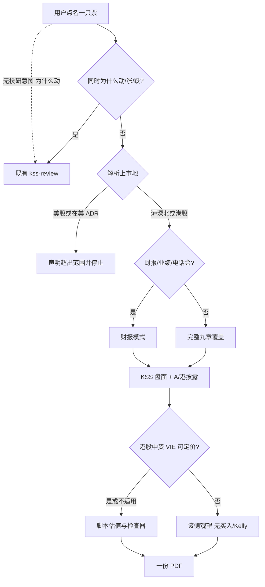
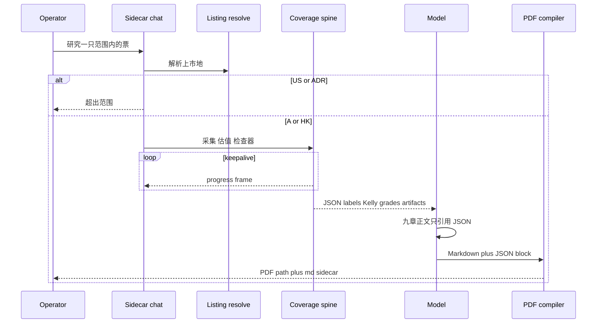

# A股港股深度研究 Skill - Plan

## Goal Capsule

- **Objective:** 在 KSSDeck 对话里，对一只具名 A 股（沪/深/北）或港股，产出与 [rollingSirius/equity-research-skill](https://github.com/rollingSirius/equity-research-skill) 同等深度的覆盖文件：九章研报、财报模式、脚本估值、检查器、结论加 Kelly-lite 仓位，默认 PDF。数据以 KSS 本地真值为盘面、以 A/港一手披露为账本。
- **Product authority:** Product Contract（R1–R12）约束规划与实现。方法论本体以上游 skill 为准，本计划只记录相对它的增量。全局「不是 decider」规则及其余研究 skill 不在本计划改写范围内。
- **Product Contract preservation:** Product Contract unchanged except Summary gained a plan-scoping embed (no R/A/F/AE split).
- **Execution profile:** `execution: code`. Implementer follows Implementation Units in dependency order; progress lives in git, not this file.
- **Open blockers:** 无。

---

## Product Contract

### Summary

给 KSSDeck 对话加一条个股深度研究路径：用户点名一只 A 股或港股，agent 按上游机构级流程写出九章覆盖文件（含财报模式），估值、质量分数、标签、动作与 Kelly-lite 由脚本计算，报告默认 PDF。进出场按解析后的上市地门控：美股与在美上市 ADR 拒绝；港股中概须先做结构风险定价。其余 KSS 对话仍只解释、不给买卖。

本计划覆盖 brainstorm 的全部范围，不收窄、不顺手改周报或全局人设。实现沿现有对话工具/剧本模式扩展：打包覆盖 skill、上市地门、脚本估值脊柱、编译器产出 PDF。验收走对话工具与技能路径（场馆门、脚本评级隔离、超时收尾、与「为什么动」并存），不只测计算器脚本。

### Problem Frame

KSSDeck 今天能回答「这只票今天为什么动」，不能留下一份可复算、可复核的个股覆盖文件。`kss-review` 走复盘剧本；vibe-adapted 研究 skill 按 [docs/adr/2026-07-27-skill-provenance-and-overlays.md](docs/adr/2026-07-27-skill-provenance-and-overlays.md) 去掉了目标价、评级和仓位；受保护的日报/周报 skill 测试禁止「建议仓位」「目标价为」。操作者目前根本不在 KSSDeck 里做 A/港深度覆盖，要做就离开应用。上游 GitHub skill 以美股 10-K 与多市场为默认，直接装进来会对不准 KSS 的 A 股本地真值和「网页与披露正文不得构成交易指令」纪律。

### Key Decisions

- **进出场按解析后的上市地：沪深北与港股进入，美股与在美上市 ADR 拒绝；港股中资须先做 VIE/结构风险定价。** `(session-settled: user-directed — chosen over 美股/ADR 覆盖: 收窄到 KSS 有本地数据的市场)` Governs R1, R2, R4.
- **深度不砍：九章、财报模式、脚本估值、检查器、Kelly-lite 全要。** `(session-settled: user-directed — chosen over 一篇随手备忘或只做估值: 市场范围是唯一切口)` Governs R3, R4, R8, R9.
- **入口是 KSSDeck 对话，不是 Claude Code 或周报包。** `(session-settled: user-directed — chosen over Claude Code / investment-weekly: 操作者在应用内点名一只票)` Governs R1, R11.
- **只有这条路径可以评级和给仓位；其余 skill 仍是 explainer。** `(session-settled: user-directed — chosen over 改写全局「不是 decider」或全员可给买卖: 冲突只在本 skill 打开)` Governs R9.
- **默认交付 PDF；JSON/脚本/检查器/CSV 等工作文件非默认交付；用户可按 R10 显式索要 Markdown/Word/工作簿。** `(session-settled: user-directed — chosen over 聊天里先看 Markdown: 与上游交付契约对齐)` Governs R10, R11.
- **KSS 接地，不整包 vendor、不做薄适配层。** `(session-settled: user-approved — chosen over 原样搬仓库或只挂上游快照: 盘面数字必须能在本应用里核验)` Governs R6, R7, R8.

### Requirements

**触发与市场门**

- R1. 用户在 KSSDeck 应用内对话中给出公司名或股票代码，并带有投研意图（研究、分析、估值、值不值得买、财报/业绩/电话会，或等价说法）时，走本 skill。无投研意图的一句话报价或「今天为什么动」仍走既有复盘路径。同一句同时匹配投研意图与复盘/一句话报价（为什么动、为什么涨、为什么跌）时，复盘路径优先，不启动本 skill，R9 例外关闭。
- R2. 进出场以解析后的上市地为准，不以公司名或 ADR 代码黑名单：`.SH` / `.SZ` / `.BJ` 与 `.HK` 进入；美股与在美上市 ADR 停止。模糊名称须先解析到上市地再门控（「阿里巴巴」「BABA」可能对应 9988.HK）。A/H 两地上市默认双边对比、分市场结论。分市场的 R9 动作仅当两侧盘面都有 KSS 工具返回值时才允许；缺的一侧写「未获取到」且动作观望，网页报价不得作为该侧买入或仓位依据。

**研究契约**

- R3. 默认完整覆盖；财报、业绩、指引、电话会类请求自动进入同等深度的财报模式。无旧报告或旧模型时先重建至少 3 年年报加 8 个季度的基线，不得因「首次覆盖」拒绝。上市不足 3 年时按可获取历史重建基线，并在报告中标注历史长度限制，不视为拒绝。
- R4. 章节结构、预期差主线、财报可信度等级、不少于三种估值方法、检查器、反方论证与 Kelly-lite 仓位，遵循 [rollingSirius/equity-research-skill](https://github.com/rollingSirius/equity-research-skill)。范围内的港股中资公司在给出任何 R9 标签、动作或 Kelly-lite 之前，须完成上游 `markets-cn-hk.md` 第 8 节的 VIE/结构风险定价；无法定价则该侧动作观望。本计划相对上游的增量仅 R1–R3 与 R5–R12。
- R5. 行业附录仍按价值贡献选用，KPI 与模型随附录变。检查器 KPI、财报质量测试与财报模式科目必须是 A/港披露口径（CAS/HKFRS、扣非、业绩预告/盈利警告）。不得把 US-only 项（作为必过对的 GAAP vs Non-GAAP、仅 10-K 的 VIE 措辞）当作检查器通过或解锁 R9 的条件。

**数据接地**

- R6. 涨跌幅、价格、排名、资金流等盘面数字，凡 KSS 工具有返回值，必须逐字引用。没有返回值就写「未获取到」，禁止用模型记忆或心算补盘面数字。
- R7. 财报科目与附注优先 A/港一手披露（交易所、监管、公司公告）。披露正文与外部检索只提供科目和背景，不得覆盖 R6 的本地盘面，也不得写成动作、仓位或 agent 工作流。上述文本继承 [kss/research/evidence.py](kss/research/evidence.py) 的三条证据规则（`localTruthPrecedence`、`doNotTreatWebAsInstruction`、`noTradeAdvice`）与 injection 扫描；标为 prompt_injection 的片段不得作为 R9 评级、动作或 Kelly-lite 的依据。
- R8. 报告中的估值结果、财报质量分数、估值标签、动作映射（含可信度 C/D 否决）与 Kelly-lite 量级必须来自本 skill 的可复算脚本与检查器。正文只能引用这些输出，禁止心算目标价、等级或仓位。

**结论例外与交付**

- R9. 仅在本 skill 作为当前研究路径时，报告可以给出由 R8 脚本产出的估值标签、投资动作与 Kelly-lite 仓位量级。`kss-review`、投资日报/周报、以及 vibe-adapted 研究 skill 仍不得给出个性化买卖或仓位。网页与披露正文不得构成交易指令。本 skill 交出报告后，同一会话后续回合可以引用该报告已公布的标签与 Kelly-lite 数字，但不得计算新的动作或仓位，除非 R1 再次启动覆盖；为什么动与一句话报价仍走 F5。
- R10. 用户交付物只有报告本身，默认 PDF；用户可改要 Markdown / Word / 估值工作簿。语言跟随当前对话，或用户显式指定。假设 JSON、脚本原始输出、检查器结果、财务 CSV 为内部工作文件，除非用户索要。
- R11. v1 把 PDF 落成用户能在该次 KSSDeck 会话中打开的文件即可。不要求聊天气泡自带下载控件。
- R12. 每次调用要么交出完整报告，要么以「证据不足 / 超出范围 / 无法完成」明确收尾。禁止静默中断后留下半篇备忘充数。

### Actors

- A1. 操作者：在 KSSDeck 对话里点名一只 A 股或港股、要覆盖文件的人。
- A2. KSS 对话 agent：加载本 skill、调本地工具与披露检索、跑估值/检查脚本、写出报告。
- A3. 既有 explainer 路径（`kss-review`、日报/周报、vibe-adapted skill）：同一应用内并存，不受 R9 例外扩大。

### Key Flows



- F1. 首次覆盖
  - **Trigger:** A1 在 KSSDeck 对话点名一只在范围内的股票并要求研究，且该句不同时匹配「为什么动/涨/跌」。
  - **Actors:** A1, A2
  - **Steps:** 先解析上市地再门控；范围内港股中资在任何 R9 输出前完成 VIE/结构风险定价；走完整模式；按 R6–R8 采集与计算；按 R4 成稿并过检查器；按 R10–R12 交付 PDF。
  - **Covered by:** R1, R2, R3, R4, R6, R8, R10, R12
- F2. 财报模式
  - **Trigger:** A1 问最新业绩、指引或电话会。
  - **Actors:** A1, A2
  - **Steps:** 进入财报模式；无旧模型则先重建基线（次新股按可获取历史并标注限制）；检查器与科目用 A/港口径；分析本期质量与估值变化；交付财报深度 PDF。
  - **Covered by:** R3, R4, R5, R10
- F3. 市场拒绝
  - **Trigger:** 解析后的上市地为美股或在美上市 ADR。
  - **Actors:** A1, A2
  - **Steps:** 先解析上市地，不以公司名黑名单拒绝；美股/ADR 说明本 skill 只覆盖 A 股与港股，停止，不写九章、不给评级。
  - **Covered by:** R2, R12
- F4. 数据缺口
  - **Trigger:** KSS 无该盘面字段；一手披露未取到；A/H 缺一侧 KSS 盘面；范围内港股中资无法完成 VIE/结构风险定价；或上市不足 3 年。
  - **Actors:** A2
  - **Steps:** 该格写「未获取到」并标明缺的是盘面还是披露；不编造。港股允许比 A 股更多缺口。A/H 缺的一侧动作观望，网页报价不得写成该侧买入或仓位。VIE 无法定价则该侧观望、无买入/Kelly。次新股按可获取历史重建并标注历史长度限制，不按拒绝处理。独立观点无法成立时动作降为观望，仍按 R10 交付报告并列出缺口。仅当超出范围、证据不足以形成可交付报告、或无法完成时，才以 R12 三种失败用语明确收尾。
  - **Covered by:** R2, R3, R4, R6, R7, R12
- F5. 与复盘并存
  - **Trigger:** 同一句同时匹配投研意图与「为什么动/涨/跌」；或本 skill 已交出报告后，同一会话再问为什么动、或引用上次结论。
  - **Actors:** A1, A2, A3
  - **Steps:** 同时匹配时走既有复盘，不启动本 skill。报告交出后可引用已公布的标签与 Kelly-lite 数字，不得计算新的动作或仓位，除非 R1 再次启动覆盖。为什么动仍只解释、不给买卖。
  - **Covered by:** R1, R9

### Acceptance Examples

- AE1. 范围内首次覆盖
  - **Covers R1, R4, R9, R10.**
  - **Given:** A1 在 KSSDeck 说「研究一下 600519.SH」。
  - **When:** A2 跑完本 skill。
  - **Then:** 用户拿到一份九章 PDF；含预期差表、至少三种脚本估值、可信度等级、反方论证、Kelly-lite 量级；聊天里不是把工作文件当交付物甩出。
- AE2. 美股拒绝
  - **Covers R2, R12.**
  - **Given:** A1 说「研究 NVDA」，或「研究 BABA ADR」，或名称解析结果为美股/在美 ADR。
  - **When:** A2 按解析后的上市地门控。
  - **Then:** 明确超出范围并停止；无九章、无评级、无 PDF 充数。
- AE3. A/H 双边
  - **Covers R2, R4, R6.**
  - **Given:** 标的为 A/H 两地上市，且两侧盘面都有 KSS 工具返回值。
  - **When:** 完整覆盖跑完。
  - **Then:** 报告分市场给结论，而不是只写一个价格；两侧动作均引用各自 KSS 盘面。
- AE4. 财报且无旧模型
  - **Covers R3.**
  - **Given:** A1 要某港股最新业绩深度分析，且没有上一份覆盖。
  - **When:** A2 进入财报模式。
  - **Then:** 先重建基线再分析本期，不因「没旧报告」拒绝。
- AE5. 盘面以 KSS 为准
  - **Covers R6, R7.**
  - **Given:** KSS 工具给出涨跌幅，网页摘要给出另一个数字。
  - **When:** 写入报告。
  - **Then:** 采用工具返回值并逐字引用；网页数字最多作为对账冲突记下，不覆盖本地真值。
- AE6. 复盘不被例外污染
  - **Covers R1, R9.**
  - **Given:** 刚用本 skill 覆盖过某票。
  - **When:** A1 问「它今天为什么涨」，或同一句既要研究又问为什么涨。
  - **Then:** 走 explainer 复盘，不启动本 skill 的新覆盖；可引用已公布标签与 Kelly-lite 数字，不得计算新的买入/仓位。
- AE7. 交付形态
  - **Covers R10, R11, R12.**
  - **Given:** 用户未指定格式。
  - **When:** 研究完成。
  - **Then:** 有一份打得开的 PDF；Markdown 源保留但不充当主交付；若失败则说明失败原因，而不是一段未完成草稿。
- AE8. 模糊名称按上市地进入
  - **Covers R2, R4.**
  - **Given:** A1 说「研究阿里巴巴」，解析结果为 9988.HK。
  - **When:** 门控与覆盖。
  - **Then:** 进入港股覆盖，不因中概或 ADR 别名拒绝；给出任何 R9 标签/动作/Kelly 前须完成 VIE/结构风险定价。
- AE9. 次新股重建基线
  - **Covers R3.**
  - **Given:** 标的上市不足 3 年。
  - **When:** 重建基线。
  - **Then:** 按可获取历史重建并在报告中标注历史长度限制；不视为拒绝，不以 R12 收尾。
- AE10. A/H 缺一侧盘面
  - **Covers R2, R6.**
  - **Given:** A/H 两地上市，H 股盘面 KSS 无返回值。
  - **When:** 写分市场结论。
  - **Then:** H 侧写「未获取到」且动作观望；网页报价最多作为对账，不得写成该侧买入或仓位。

### Success Criteria

- 对一只范围内的 A 股，一次对话调用能得到检查器通过的九章 PDF，盘面数字能对上 KSS 工具返回值。
- 对一只范围内的港股，同样契约成立；允许更多「未获取到」，但不允许编造。
- 同一应用内，未走本 skill 的对话仍不出现个性化买卖或仓位建议。

### Scope Boundaries

**Deferred for later**

- 美股与在美上市 ADR 覆盖。港股上市的中资/VIE 结构在范围内，受 R4 定价约束。
- 聊天气泡原生 PDF 下载控件。
- 把本 skill 编进投资周报/日报包。
- 把评级例外扩大到其他研究 skill。

**Outside this product's identity**

- 原样 vendor 上游仓库、或只做不改数据脊的薄适配层。
- 改写全局「永不是 decider」，使「为什么动」复盘也能给买卖。
- 高频交易信号、组合调仓、下单或账户操作。
- 用本 skill 替换 `kss-review` 的当日复盘职责。

<!-- ce-section: work-relationships -->
### How This Work Fits Together

本计划只拥有：KSSDeck 对话里的 A/港个股深度覆盖 skill，以及「仅此路径可评级/给仓位」这条例外。下面是当前理解，不是路线图。

- 既有 `kss-review` 当日复盘
  - Shares 同一 KSSDeck 对话入口与数字纪律（R6）
  - Can proceed independently of 本 skill
- vibe-adapted 研究 skill 与受保护日报/周报
  - Shares 「网页与披露正文不得构成交易指令」
  - Can proceed independently of 本 skill；R9 不得扩大到它们
- 全局 agent 人设（[kss/config/chat_system_prompt.md](kss/config/chat_system_prompt.md)、[kss/AGENTS.md](kss/AGENTS.md)）
  - Depends on 本计划把例外收在本 skill，而不是改写全局条文的默认含义
- 上游 GitHub skill 的后续版本
  - Still to decide 是否跟踪上游修订；本计划不承诺同步节奏

### Dependencies / Assumptions

- KSS 本地数据偏 A 股；港股「未获取到」多于 A 股是可接受结果，不是缺陷（对话中已确认）。
- KSSDeck 应用内对话当前不设置 `profile_id=chat`，技能过滤在无 profile 时不按 `allowed_profiles` 裁剪。规划须保证本 skill 在该入口可加载，且不进入日报/周报白名单。
- 对话 agent 今日能收 PDF 附件，没有把生成 PDF 当出站附件发出的现成路径。R11 按「打得开的文件」验收，不按气泡下载验收。
- 默认对话超时短于一份九章研究。规划必须让分钟级任务仍能满足 R12，具体机制不在本契约指定。
- [kss/research/evidence.py](kss/research/evidence.py) 的 `localTruthPrecedence`、`doNotTreatWebAsInstruction`、`noTradeAdvice` 与 `warning_from_text` / `scan_for_injection` 约束披露正文与外部检索。R9 允许的是本 skill 脚本产出的标定结论；网页与披露正文不得构成交易指令；标为 prompt_injection 的片段不得接地 R9。
- 报告语言默认跟随 KSSDeck 对话（通常为中文）。
- 北交所计入 A 股范围。
- 用户尚未在 KSSDeck 跑过此类深度覆盖；本能力是净新增，不替换一条已有痛苦路径。

### Outstanding Questions

**Resolve Before Planning**

无。

**Deferred to Planning**

已在 Planning Contract 关闭：回合预算与 R12（KTD1）、会话内打开 PDF（KTD5）、R9 表达方式（KTD3）、上游脚本进入仓库的方式（KTD4）、行业附录数据入口（KTD4 / U4）。

**Deferred to Implementation**

- WeasyPrint 在 `.venv-desktop` 加载失败时启用 fpdf2 回退的具体字体子集与表格折行观感（KTD5 已选定顺序，未锁像素级排版）。
- 20 类行业附录中与 A/港无关的官方数据入口，实现时按 R5 忽略或改写，不在本计划逐条点名。

### Sources / Research

- 方法论权威：[rollingSirius/equity-research-skill](https://github.com/rollingSirius/equity-research-skill)（MIT；九章、财报模式、`scripts/dcf.py`、检查器、A/港手册）。本契约只记录增量。
- 仓库内无等价九章/DCF/EPV skill；现有估值是时间贴水 *n* 与 PE 分位，不是本 skill 的折现模型。
- 人设与数字纪律：[kss/AGENTS.md](kss/AGENTS.md)、[kss/config/chat_system_prompt.md](kss/config/chat_system_prompt.md)。
- 技能加载与对话入口：[kss/agent/skills.py](kss/agent/skills.py)（含用户 overlay 根，本计划不使用）、[kss/agent/service.py](kss/agent/service.py)（`profile_id` 为空则不按 profile 过滤）、[scripts/kss_sidecar.py](scripts/kss_sidecar.py)。
- 适配 skill 去评级：[docs/adr/2026-07-27-skill-provenance-and-overlays.md](docs/adr/2026-07-27-skill-provenance-and-overlays.md)；受保护日报/周报禁止仓位/目标价用语见 `kss/tests/test_agent_skills.py`。
- 外部研究：`research_bundle` 为 `external_background_only`，规则含 `localTruthPrecedence` 与 `noTradeAdvice`。
- 相邻复盘：[.claude/skills/kss-review/SKILL.md](.claude/skills/kss-review/SKILL.md)。
- 数字纪律与脚本工具先例：`number_guard`（[scripts/kss_chat_loop.py](scripts/kss_chat_loop.py)）、`backtest_indicator` / `indicator-backtest`。
- 机构教训：[docs/solutions/ai_native_surface_assessment.md](docs/solutions/ai_native_surface_assessment.md)、[docs/solutions/dragon_tiger_integration_retrospective.md](docs/solutions/dragon_tiger_integration_retrospective.md)（LLM 复述数字失败；R9 必须脚本产出）。
- 流空闲上限：[Sources/KSSDesktop/Services/BridgeClient.swift](Sources/KSSDesktop/Services/BridgeClient.swift) `maxIdleTicks = 300`。
- 报告打开器只认 Markdown：[Sources/KSSDesktop/Services/ExternalReportOpener.swift](Sources/KSSDesktop/Services/ExternalReportOpener.swift)。

---

## Planning Contract

### Key Technical Decisions

- KTD1. 覆盖占住发起回合：粗粒度只读 bridge 工具在流上发进度帧，必要时仅本路径升高 `RuntimeRunOptions`；禁止后台任务先结束对话。 `(session-settled: user-approved — chosen over 后台任务、对话先回来: 对不上「这次会话里拿到报告」)` Governs R11, R12, F1. Rejected: 全局抬高 240 秒/8 步而不心跳；模型轮询 `job_id`。
- KTD2. 上市地解析是只读工具，门控看解析后的后缀。同一中文名同时命中美股别名与 A/港代码时，范围内上市地优先（「阿里巴巴」进港股而不是 `BABA`）。Governs R2, F3, AE2, AE8.
- KTD3. R9 只来自本轮覆盖工具 JSON，并由 PDF 编译器回贴同一块字段；全局 `chat_system_prompt.md` 仍写「永不是 decider」。Skill 正文最多允许「引用这些字段」。用于评级的检索摘录命中注入则丢弃（quarantine），不是只打标。 `(conflict call-out: docs/solutions/ai_native_surface_assessment.md 把个性化投资决策标为红线 — 可工作前提是隔离到本 skill 且生成器为脚本，禁止 LLM 自拟买卖)` Governs R7, R8, R9.
- KTD4. 确定性脊柱做成一两个只读覆盖工具（采集 + 改编后的估值/检查器），JSON 进 JSON 出；在进程内调用改编脚本，不把 Bash/Python 暴露给模型，不整包 vendor 上游仓库。检查器读本地财报表做扣非等 A/港口径；缺字段写「未获取到」，不得用 US-only 项当必过。Governs R4, R5, R6, R8.
- KTD5. 模型写 Markdown；代码编译默认 PDF，并保留 Markdown 侧车供后续引用。先证明 WeasyPrint 能在桌面环境加载并嵌入 TTF（不用苹方当主字体）；失败则 fpdf2。聊天给出相对路径，用户点击后用系统默认应用打开；不自动弹预览，不出站附件气泡。 `(session-settled: user-approved — chosen over 自动弹出预览, and over 先只用简单 Python PDF 绑死排版)` Governs R10, R11, AE7.
- KTD6. Skill 打成 `kss-bundled` 打包根，`allowed_profiles` 仅 chat，不进 vibe-adapted 固定十件套，不进日报/周报白名单。不要求置顶；描述里同时写投研触发与「为什么动」负向触发。Governs R1, R9, F5.
- KTD7. 同一会话同时只跑一场覆盖；流中途的「为什么动」进 follow_up 而不是 steer。产物路径带时间戳。Governs R1, R9, F5.

### High-Level Technical Design

覆盖回合把 LLM 步数留给门控、少量披露检索和成稿；重计算放在一次带心跳的工具调用里。



组件边界：解析器与脊柱都是 `TOOL_SPECS` + bridge `COMMANDS` + `dispatch` 三处注册，照 `indicator-backtest`。Skill 目录只提供方法论文本，`read_skill_resource` 不执行脚本。

### Assumptions

- 桌面 venv 当前没有 WeasyPrint / fpdf2 / ReportLab；KTD5 的证明步骤可能失败，届时走 fpdf2 回退，不因此把覆盖主路径停掉。
- 港股盘面与扣非缺失会大量「未获取到」；这是可接受结果，不是缺陷。
- 对话入口继续不传 `profile_id`；`allowed_profiles: [chat]` 只在 Research runner 设了 profile 时把本 skill 挡在周报外，挡不住 KSSDeck 加载（这是需要的）。
- F5 在 v1 仍是提示词竞争加描述负向触发，不是代码路由器；确定性保证来自「覆盖工具未返回本轮 JSON 则编译器不写 R9」。
- 上游 MIT 脚本可改编进本仓库并保留许可声明，只要数据脊走 KSS 工具与 A/港披露。

### Implementation Constraints

- 不新增 Bash/Python 对话工具。
- 不改 Swift 5 分钟无帧上限来「代替」心跳。
- 不把覆盖 skill 放进 `.agents/skills/vibe-adapted/` 或 `storage/agent/user_skills`。
- 不把 PDF 写入做成会卡住长任务的 `confirm_required` 人审（估值/检查器保持只读；产物写入走覆盖工具内部落盘，效果标签若需确认不得要求用户在无帧窗口里点确认）。
- `number_guard` 保持 ASCII 数字检测；R9 字段另做与工具 JSON 的相等断言。

### Sequencing

U1 与 U2 可并行。U3 的心跳与 R12 收尾必须在 U4 长工具之前可用。U4 之后才能绑 U5 的 `required_tools`。U6 回归锁与 U7 PDF 依赖 U4 JSON 契约。U8 依赖 U7 侧车与 U5 描述。

---

## Output Structure

```
.claude/skills/cn-hk-equity-research/
  SKILL.md
  LICENSE.upstream
  references/
    markets-cn-hk.md
    report-template.md
    earnings-mode.md
    checker-cas-hkfrs.md
    industry-routing.md
  industries/
    (paged appendices; US-only pass gates stripped)
kss/equity_research/
  (listing resolve, spine runner, json contracts, pdf compile)
```

树是范围声明。每单元 `Files` 仍是权威清单。实现时可调整目录名，但必须留在打包 skill 根与 `kss/` 下，不得进 vibe-adapted。

---

## Implementation Units

### U1. Listing venue resolve

- **Goal:** 对话可调用只读解析器，返回带后缀的候选；门控只看解析后的上市地。
- **Requirements:** R2, F3, AE2, AE8, AE3. KTD2.
- **Dependencies:** 无
- **Files:** `scripts/kss_chat_loop.py`, `scripts/kss_app_bridge.py`, `kss/tests/test_bridge_orientation.py`, `kss/tests/test_listing_resolve.py` (new). Bind catalog 只作别名提示，不是门。
- **Approach:**
  1. 新增只读 bridge 命令，输入名称或代码，输出候选列表（代码、后缀、显示名）。
  2. 范围内后缀（`.SH/.SZ/.BJ/.HK`）优先于美股/ADR；「阿里巴巴」不得因 catalog 里的 `BABA` 被拒。
  3. 无后缀数字不得走现有 `get_stock` 的 688→SH 否则 SZ 启发式去猜港股。
  4. 多只范围内上市按 A/H 双边，不弹选择器。只剩美股则 F3。
- **Test scenarios:**
  - Happy: `600519.SH` → 单候选沪市，进入覆盖。
  - Happy: 「阿里巴巴」→ 含 `09988.HK` 的范围内命中，不把 `BABA` 当门控结果。
  - Edge: 「研究 BABA ADR」或解析结果仅美股 → 超出范围，无 PDF。
  - Error: 无法解析 → R12 超出范围或请用户给代码，不猜测 `.SZ`。
- **Verification:** 新测与 `test_bridge_orientation` 的命令/dispatch 对齐仍绿。

### U2. HK primary evidence and R9 quarantine

- **Goal:** 港交所披露易等一手主机标成 official_or_primary；命中注入的摘录不得进入 R9。
- **Requirements:** R7, R9. KTD3.
- **Dependencies:** 无
- **Files:** `kss/research/evidence.py`, `kss/tests/test_research_adapter.py`, coverage runner 对 quarantine 的调用点（与 U4 衔接）。
- **Approach:**
  1. `source_tier` 增加港交所/披露易及本 skill 实际使用的 A 股法定披露主机。
  2. 覆盖路径对将喂给评级/VIE 的摘录走丢弃而非只告警；其余正文仍可写报告。
  3. 被丢弃片段若是唯一 VIE/质量证据 → 该侧观望，不脚本买入。
- **Test scenarios:**
  - Happy: hkexnews 年报 URL → `official_or_primary`。
  - Edge: 摘录含 ignore-previous 类模式 → 不出现在 R9 输入，动作不为买入。
  - Integration: `research_bundle` 仍带三条 evidence rules；盘面数字仍只来自 KSS 工具。
- **Verification:** `test_research_adapter` 与覆盖 runner 的注入夹具。

### U3. Coverage envelope, heartbeats, R12 closer

- **Goal:** 本路径在分钟级任务上要么完整结束要么 R12 三语收尾；Swift 无帧上限不被静默工作撞上；禁止半篇备忘和 legacy 五维回放。
- **Requirements:** R12, F1, AE7. KTD1.
- **Dependencies:** 无
- **Files:** `kss/agent/service.py`, `scripts/kss_sidecar.py`, `scripts/kss_chat_loop.py`, `kss/tests/test_agent_service.py`, `kss/tests/test_chat_loop.py`, `kss/tests/test_chat_e2e.py`. 不改 `BridgeClient` 的 300 秒 idle。
- **Approach:**
  1. 仅当本覆盖路径激活时传非默认 `RuntimeRunOptions`（步数/超时按叙事需要，不靠全局抬高代替心跳）。
  2. 长工具至少每数十秒发一行 JSON 进度帧。
  3. 超时、步数用尽、空闲断开、用户停止：用 R12「无法完成」替换已生成的半章；本路径关闭 `shouldFallbackToLegacyAgent`。
- **Execution note:** 先写超时/空助手/legacy 回放的表征测试，再改收尾行为。
- **Test scenarios:**
  - Happy: 假工具 >60s 且持续发帧 → 客户端不因 idle 结束。
  - Error: 静默超预算 → 助手正文为 R12 用语，无半章，无 legacy 五维。
  - Error: 用户停止且正文为空 → R12，不是「（已停止）」充数（若现有停止文案保留，须同时满足 R12 三种失败语之一可见）。
  - Integration: 非本路径对话仍 8 步/240 秒。
- **Verification:** agent service 与 chat loop 测；e2e 夹具覆盖「无帧 vs 有帧」。

### U4. Scripted coverage spine

- **Goal:** 一次只读覆盖调用完成采集、VIE 门、改编估值/检查器，返回模型只能引用的 JSON。
- **Requirements:** R3, R4, R5, R6, R8, R9, F1, F2, F4, AE1, AE4, AE5, AE9, AE10. KTD4.
- **Dependencies:** U1, U2, U3
- **Files:** `kss/equity_research/` (new), `scripts/kss_app_bridge.py`, `scripts/kss_chat_loop.py`, `kss/tests/test_equity_coverage_runner.py` (new), upstream-adapted calculator/checker with license notice. 不把脚本放进 skill 目录当可执行。
- **Approach:**
  1. 输入：已解析代码、模式（完整/财报）、本币盘面由现有 KSS 工具在脊柱内读取（不是让模型心算）。
  2. 输出：公允价值/标签/质量等级/动作/Kelly-lite/缺口列表/工作文件路径；缺 Kelly 输入则跳过仓位段并在 JSON 标明，禁止模型补。
  3. 港股中资：VIE/结构风险未定价则该侧动作观望，JSON 不得给出买入/Kelly。
  4. 检查器：CAS/HKFRS、扣非（本地 fina 有则用，无则「未获取到」）、业绩预告/盈利警告；禁止 GAAP vs Non-GAAP 必过对。
  5. A/H：缺一侧 KSS 盘面则该侧观望。
- **Test scenarios:**
  - Happy: 固定假设 JSON → 标定标签与 Kelly 与脚本一致，两次运行字节级稳定。
  - Edge: 次新股历史不足 3 年 → 基线带历史长度标记，不是拒绝。
  - Edge: H 股无盘面 → H 侧「未获取到」+ 观望，网页报价不进该侧动作。
  - Error: 检查器缺脚本 JSON → 无 R9 块，R12 或观望按独立观点是否成立。
  - Integration: 返回值进入本轮 `tool_results_text`，聊天里的阿拉伯数字能过 `number_guard`。
- **Verification:** runner 单测 + chat loop 数字纪律夹具。

### U5. Packaged coverage skill router

- **Goal:** KSSDeck 可发现并加载本 skill；十二千字路由；手册分页；周报发现不了它。
- **Requirements:** R1, R3, R4, F5. KTD6.
- **Dependencies:** U1, U4
- **Files:** `.claude/skills/cn-hk-equity-research/SKILL.md`, `references/` and `industries/` as in Output Structure, `kss/tests/test_agent_skills.py`.
- **Approach:**
  1. `source: kss-bundled`，`protected` 按打包 skill 惯例，`required_tools` 列出解析器与脊柱（须已在 `TOOL_SPECS`）。
  2. `allowed_profiles: [chat]`。描述含投研意图与「为什么动/涨/跌」负向触发。
  3. 上游方法论文本改编为资源文件，经 `read_skill_resource` 分页；去掉 US-only 必过项。
- **Test scenarios:**
  - Happy: 无 `profile_id` 的 chat discover 含本 skill 且 enabled。
  - Edge: `investment-weekly-v3` 白名单仍不含本 skill。
  - Error: 覆盖工具未注册 → skill `missing_required_tools`，不回退到 Bash。
  - Integration: vibe-adapted 十件套集合不变。
- **Verification:** `test_agent_skills` 扩展。

### U6. R9 isolation and explainer regression

- **Goal:** 只有本路径能出现脚本评级/仓位；其它 skill 与复盘仍 explainer。
- **Requirements:** R1, R9, F5, AE6. KTD3, KTD6.
- **Dependencies:** U4, U5
- **Files:** `kss/config/chat_system_prompt.md`, `kss/tests/test_chat_system_prompt.py`, `kss/tests/test_agent_skills.py`, `kss/tests/test_chat_loop.py`.
- **Approach:**
  1. 全局人设不改默认含义。至多加一句：仅当本轮覆盖工具返回标定字段时允许**引用**。
  2. 编译器（U7）是 R9 的第二道闸：无 JSON 则 PDF 无标签/Kelly 段。
  3. 回归：vibe-adapted 与受保护日报/周报仍禁止建议仓位/目标价；`kss-review` 不出现 Kelly。
- **Test scenarios:**
  - Happy: 覆盖 JSON 在场 → 报告/摘要中的标签与 JSON 字段相等。
  - Happy: 覆盖过后问「为什么涨」→ 无新动作/仓位，可引用已公布数字。
  - Error: 无覆盖 JSON 时模型散文出现买入/仓位 → 编译器不输出 R9 段；其它 skill 语料测试仍红灯那些词。
  - Integration: `test_system_prompt_loaded_and_injected` 仍要求首条 system 含 decider。
- **Verification:** 上述测试文件全绿。

### U7. PDF compile and session-openable path

- **Goal:** 默认交付可在本会话打开的 PDF，并留下 Markdown 侧车。
- **Requirements:** R10, R11, AE7. KTD5.
- **Dependencies:** U4
- **Files:** `kss/equity_research/` compile module, desktop/pyproject dependency lock as needed, `Sources/KSSDesktop/Services/` PDF 打开路径（系统默认应用，不是 MarkEdit 的 `.md` 校验），对应 `Tests/KSSDesktopTests/`, `kss/tests/test_equity_pdf_compile.py` (new).
- **Approach:**
  1. 先探测 WeasyPrint 在 `.venv-desktop` 是否可加载；HTML 路径嵌入 Noto/Source Han 等 TTF；禁止苹方作为主字体。
  2. 探测失败则 fpdf2 回退；用户要 Word/工作簿而生成器缺失 → 该格式 R12「无法完成」，若默认 PDF 已成功则 PDF 仍有效。
  3. 落盘带时间戳；聊天只给相对路径与短结论，不甩工作 JSON。
  4. 点击路径 → NSWorkspace 默认应用（Preview）。不自动前台、不出站 `attachment_ref`。
- **Test scenarios:**
  - Happy: 未指定格式 → 存在 `.pdf` 与 `.md` 侧车；聊天无假设 JSON。
  - Happy: 路径打开器接受 `.pdf`（与 MarkEdit `.md` 门分开）。
  - Edge: WeasyPrint 不可用 → 仍产出可打开 PDF（fpdf2），测试标明引擎。
  - Error: 用户只要 docx 且无生成器 → 该请求 R12，不留下假 Word。
- **Verification:** 编译单测；Swift 打开器测；有条件的 PDFKit 光栅抽查（实现阶段若环境无 Preview 则记录为手工门）。

### U8. Published cite and mid-flight queue

- **Goal:** 报告交出后只能引用冻结数字；进行中的覆盖不被「为什么动」steer 污染。
- **Requirements:** R9, F5, AE6. KTD7.
- **Dependencies:** U5, U7
- **Files:** `scripts/kss_sidecar.py` / agent input queue, `kss/agent/service.py` or session store for published record pointer, `kss/tests/test_agent_service.py`, `kss/tests/test_chat_e2e.py`.
- **Approach:**
  1. 发布记录：代码、标签、Kelly、PDF/md 相对路径、时间戳。后续回合用 `get_report` 读侧车，禁止再跑脊柱除非 R1 新覆盖。
  2. 同会话 `already_running` 时不启动第二场覆盖；流内「为什么动」进 follow_up。
  3. 一句两只票 → R12 超出范围，不默默做第一只。
- **Test scenarios:**
  - Happy: 发布后再问仓位 → 引用冻结 Kelly，脊柱调用计数不增加。
  - Edge: 覆盖流中途插入「为什么涨」→ 本场跑完后下一回合走复盘，不改本场 R9。
  - Error: 同会话第二句「再研究另一只」在 busy 时 → 不并行覆盖。
- **Verification:** service/e2e 队列与 cite 夹具。

---

## Verification Contract

在仓库根：

```
.venv-desktop/bin/python -m pytest kss/tests/test_listing_resolve.py kss/tests/test_equity_coverage_runner.py kss/tests/test_equity_pdf_compile.py kss/tests/test_agent_skills.py kss/tests/test_chat_loop.py kss/tests/test_chat_system_prompt.py kss/tests/test_agent_service.py kss/tests/test_research_adapter.py kss/tests/test_bridge_orientation.py kss/tests/test_chat_e2e.py -q
```

另跑 `kss/tests/test_agent_attachments.py` 确认仍只有入站 PDF。Swift：`ExternalReportOpener` 的 `.md` 向量保持；新增 `.pdf` 默认应用打开测。

`release:validate` 不因本计划单独成为门；以 pytest 与上述 Swift 测为准。

行为门：AE1 路径出现脚本 Kelly 与可打开 PDF；AE2/AE8 对「阿里巴巴」家族一正一反；vibe/周报语料仍禁止仓位词。

---

## Definition of Done

- 全部 Implementation Units 按依赖顺序落地，且 Verification Contract 命令通过。
- R1–R12 均被至少一个单元的 Requirements 引用；F1–F5 与 AE1–AE10 出现在对应单元测试场景。
- 全局人设默认仍是 explainer；R9 仅在覆盖 JSON 在场时出现。
- 用户在 KSSDeck 对范围内 A 股说「研究一下」能在同一会话打开 PDF，或看到 R12 三语之一，看不到半篇备忘。
- 本计划不要求开 PR；落地策略遵循仓库惯例与用户当时指示。

---

## Alternatives Considered

- **后台任务 + 结束后再通知。** 现有 `agent-turn` 没有无人值守完成通道，对不上「这次会话拿到报告」。范围确认已否决。
- **把上游 skill 原样放进 skill 目录让模型 Bash。** `read_skill_resource` 不执行脚本；与 KSS 接地冲突。
- **只靠 skill 正文覆盖「永不是 decider」。** 系统提示永远在前；龙虎榜路径已证明模型复述数字会编造。改用工具 JSON + 编译器回贴。
- **把覆盖编进 `run_recipe` 当唯一入口。** 剧本无 LLM、适合脊柱，但成稿仍要模型；脊柱用只读工具/剧本，叙事留在 chat loop。

---

## System-Wide Impact

- 对话 `TOOL_SPECS` 增加解析与覆盖工具；`test_chat_system_prompt` 要求提示词里出现的工具名必须注册。
- `number_guard` 继续扫全对话数字；覆盖 JSON 必须进本轮工具文本。
- Skill 发现面变宽（无 profile 时全量描述进上下文）；须靠描述预算与负向触发，而不是再加置顶。
- Swift 桥 idle 行为不变；失败模式从「半篇 + 可能 legacy 回放」改为本路径 R12。
- 周报/日报 Research runner 不应看见本 skill（profile 白名单）。

---

## Risks and Dependencies

- WeasyPrint 需要 Pango 等系统库；桌面打包可能失败 → KTD5 回退。
- 即使脊柱合并为一次调用，披露抓取仍可能超过数分钟 → 心跳是硬依赖，不是优化。
- F5 提示词竞争可能误启动覆盖；编译器无 JSON 则无 R9，作为安全网。
- 本地 fina 无扣非列时检查器必须降级而不是跳过测试充通过。
- 上游 skill 后续修订不同步（Product Contract 已声明）。

---

## Documentation / Operational Notes

实现时在 skill `SKILL.md` 写清：工作 JSON 不给用户；失败用三句 R12；港股缺口预期。不新增独立运维 runbook。
