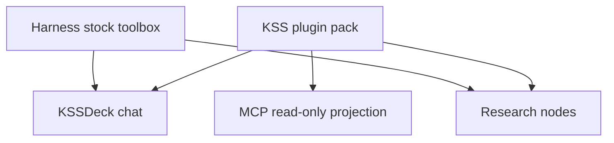
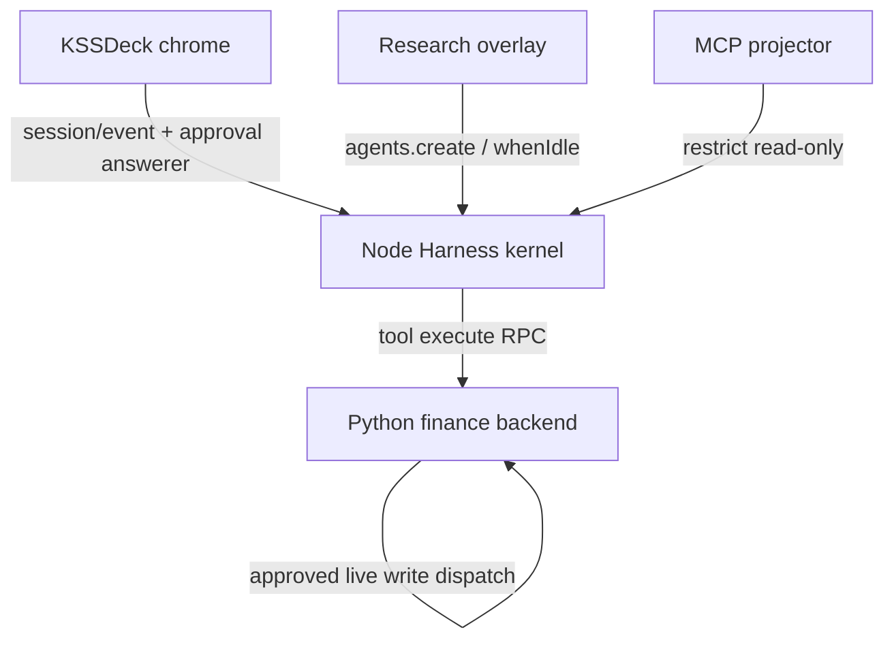

# DeepSeek Harness Agent Base - Plan

## Goal Capsule

- **Objective:** 把 KSS 的 agent 本体换成 DeepSeek Harness：KSSDeck 聊天和研究入口皮肤不变，自建 runtime 停掉；KSS 业务能力以插件包挂上；MCP 只投影只读业务插件。
- **Product authority:** Product Contract（R1–R12）约束规划与实现。Harness 插件、会话、审批与工具箱语义以上游文档为准。
- **Product Contract preservation:** changed: R3 — MCP is a read-only projection of the pack; added R10–R12 for dedicated research workspace, serial write-capable nodes, and investability exclusions.
- **Execution profile:** `execution: code`. Implementer follows Implementation Units in dependency order; progress lives in git, not this file.
- **Stop conditions:** R9 三表面各完成一次真实 KSS 任务；或钉住的 Harness 预览无法承载 R2/R6 皮肤与审批时停在 observe，不切生产。
- **Open blockers:** 无。

---

## Product Contract

### Summary

KSS 成为 DeepSeek Harness 上的金融改装件加 KSSDeck 皮肤。Node Harness 进程拥有 agent 与会话日志；Python 只做金融能力后端；Swift 渲染会话与审批事件。业务插件登记一次：桌面和研究按各自写策略使用；MCP 只投影只读业务插件。Harness 自带工具箱对桌面和研究开放。桌面 live 写问人；研究按白名单自动放行（含独立工作区内的 bash 与改文件）。Research 的 Profile、DAG、audit 留下，节点改绑到 Harness。

### Problem Frame

KSS 已是带工具调用的桌面 agent，但编排主人仍是 Python 自建 runtime：Pi 只负责模型流，薄 loop 负责工具圈，sidecar 负责写闸，Research overlay 再坐在这套内核上。给 agent 加能力要在多处登记；loop 的 hook 语义不完整（`after_step` 返回值被丢弃）；研究节点今天拒绝一切写。维护和持续迭代已经超过单用户产品愿意承担的运维。更早的计划选择保留这条自建链路、不把外部 harness 换进生产——那是当时的减负，不是现在要守的产品形状。

### Key Decisions

- **KSS 是 Harness 原生产品，不是工具包装内核，也不是只换执行世界。** `(session-settled: user-directed — chosen over 工具包装 / 换执行世界: 连自建 runtime 一起停，留下皮肤换掉电线)` Governs R1, R2.
- **整包一次交付，不能少一块。** `(session-settled: user-directed — chosen over 先切一角: 少一条表面或少工具箱都不算升级成功)` Governs R3, R5, R7, R9.
- **外观不变指皮肤和交互骨架，不上 DeepSeek Web 当 KSS 入口，也不做跨表面续聊。** `(session-settled: user-directed — chosen over Harness Web 一等入口 / 共享 session log: 人仍住在 KSSDeck)` Governs R2.
- **KSS 业务能力以插件为唯一登记面；MCP 是只读投影。** `(session-settled: user-directed — chosen over MCP 带 live 写 / 继续分面维护能力表: 一次定义，MCP 不绕过桌面审批)` Governs R3, R4.
- **MCP 不是第二套宿主工具箱。** `(session-settled: user-directed — chosen over MCP 完整工具箱: Cursor/Claude Code 自己已有宿主工具)` Governs R4.
- **完整 Harness 工具箱是产品的一部分，不是可选项。** `(session-settled: user-directed — chosen over 只挂 KSS 工具: 底座能力必不可少)` Governs R5.
- **写策略按会话分叉：桌面问人，研究白名单自动写。** `(session-settled: user-directed — chosen over 研究只读 / Harness never 全拒绝: 无人值守要能写，且 never 不是自动放行)` Governs R6, R7.
- **Research 的 Profile、DAG、audit 留下，只换节点所绑的执行内核。** `(session-settled: user-directed — chosen over 重做研究产品或拆掉 overlay: 目标、证据、完成审计仍归研究层)` Governs R8.
- **研究 bash/改文件锁在独立工作区。** `(session-settled: user-approved — chosen over 以仓库为 cwd: Harness 沙箱不管网络，cwd 就是可写根)` Governs R10.
- **能写的研究节点同一层串行。** `(session-settled: user-approved — chosen over 写节点也可双并发: 避免并行改同一工作区)` Governs R11.
- **投资可标相关写永远不进插件包。** `(session-settled: user-approved — chosen over F3 覆盖全部 bridge 写: 保住既有 never-agent-writable 红线)` Governs R12.

### Requirements

**底座与皮肤**

- R1. Agent 的编排主人是 DeepSeek Harness。KSS 不再拥有自建 agent loop 或自建 runtime 作为编排主人。
- R2. KSSDeck 聊天入口与研究入口保持现有皮肤和交互骨架。会话、工具过程、写确认以 Harness 的会话与审批为准。排队映射 Harness inbox、转向映射 steer、中止映射 cancel，不得在换电线时丢掉。

**插件目录**

- R3. KSS 的工具、技能、审批都是 Harness 插件。同一条定义服务三处：桌面和研究按 R6/R7 使用完整能力；MCP 只获得只读业务插件。Live 写不出现在 MCP 面上。
- R4. MCP 不把 Harness 自带的 bash、文件系统、终端导出给 Cursor / Claude Code。



**工具箱与写纪律**

- R5. 桌面 agent 与研究 agent 可以使用 Harness 自带工具箱（含 bash、文件系统、终端、subagent）。
- R6. 桌面会话中，任何 live 写在执行前必须得到操作者在 Harness 审批上的一次允许。没有应答者、断开或中止时失败关闭，不得执行。
- R7. 研究会话使用一份具名写白名单：命中的写（包括独立工作区内的 bash、改文件、以及白名单内的 KSS live 写）自动放行且不问人；未命中的写直接拒绝且不问人。本规则取代现行研究节点一律只读。

**研究 overlay 与晋级**

- R8. Research 的 Profile、DAG、audit 继续存在，并继续拥有目标完成与证据判定。节点执行改绑到 Harness agent；模型输出仍不能自行标记研究目标完成。
- R9. 同一升级内，桌面聊天、研究任务、MCP 都必须能在新底座上完成一次真实的 KSS 任务。只切其中一条表面不构成成功。
- R10. 研究任务的 bash 与改文件只允许发生在该次 attempt 的独立工作区。禁止以仓库根、`kss.db`、或生产 `storage/` 为可写 cwd。
- R11. 同一 DAG 层里，带写白名单的节点串行。只读节点仍最多两个并发。
- R12. `investability-label`、`investability-answer`、`node-coverage` 永不注册为 agent 或 MCP 工具。

### Actors

- A1. 操作者：在 KSSDeck 里聊天、确认桌面 live 写、查看研究结果的人。
- A2. 无人值守研究运行：按 Profile/DAG 推进节点、使用研究写策略的后台任务。
- A3. MCP 客户端：Cursor / Claude Code 经 MCP 调用只读 KSS 业务能力。
- A4. Harness agent：新的编排与工具循环主体。
- A5. 桌面审批应答：A1 对 R6 的一次允许或拒绝。

### Key Flows

- F1. 桌面 live 写
  - **Trigger:** A1 的对话使 A4 要执行一次 live 写。
  - **Actors:** A1, A4, A5
  - **Steps:** 回合在 Harness 中进行；写在审批上停下；A1 在现有皮肤里作答；仅当允许时写才执行。中止、关闭确认或断开视为拒绝。
  - **Outcome:** 写完成且留下一次人的决定，或被拒绝且不执行。
  - **Covered by:** R2, R5, R6
- F2. 研究白名单写
  - **Trigger:** A2 的节点需要 bash、改文件、或白名单内的 KSS live 写。
  - **Actors:** A2, A4
  - **Steps:** 不向 A1 提问；命中白名单则在 R10 工作区内自动放行；未命中则拒绝。子 agent 继承白名单与 cwd，不得提权。
  - **Outcome:** 允许的写发生在无人工打断的研究运行中；不允许的写失败关闭。
  - **Covered by:** R5, R7, R8, R10, R11
- F3. 一次登记、按面投影
  - **Trigger:** 新增一项 KSS 业务能力。
  - **Actors:** A1, A2, A3, A4
  - **Steps:** 将该能力作为插件加入 KSS 包；桌面和研究按写策略可见；若为只读则 MCP 在下次连接后可见。
  - **Outcome:** 定义不叉；MCP 仍不见 bash/文件系统/终端/live 写。
  - **Covered by:** R3, R4, R9, R12
- F4. 审批中中止
  - **Trigger:** 确认条已打开时 A1 中止生成。
  - **Actors:** A1, A4, A5
  - **Steps:** 待批写拒绝；Harness 回合中止；确认 UI 清掉。不得让迟到的允许落到已中止的 call。
  - **Outcome:** 无写发生，会话回到可输入。
  - **Covered by:** R2, R6
- F5. 定时研究
  - **Trigger:** 调度器以 scheduled origin 启动研究。
  - **Actors:** A2, A4
  - **Steps:** 与 F2 同一写策略；永不弹桌面确认。白名单为空则写失败关闭。
  - **Outcome:** 无人值守跑完或失败关闭；完成仍由 overlay 判定。
  - **Covered by:** R7, R8, R10

### Acceptance Examples

- AE1. 桌面下单或启禁 cron
  - **Covers R6, R2.**
  - **Given:** A1 在 KSSDeck 聊天里让 agent 做一次 live 写。
  - **When:** A4 即将执行该写。
  - **Then:** 现有皮肤里出现一次确认；A1 允许后才执行；A1 拒绝、中止、断开或不应答则不执行。
- AE2. 研究任务改工作区文件
  - **Covers R7, R5, R10.**
  - **Given:** 写白名单包含该文件系统写；A2 正在跑一个研究节点。
  - **When:** A4 调用改文件。
  - **Then:** 不问 A1，写落在 attempt 工作区成功；不得改仓库根；研究 overlay 仍按 R8 判定节点是否完成。
- AE3. 研究任务碰到未入白名单的 live 写
  - **Covers R7.**
  - **Given:** 该 KSS live 写不在白名单中。
  - **When:** 研究节点请求它。
  - **Then:** 不问 A1，请求被拒绝，写不发生。
- AE4. 在 Cursor 里看见新只读能力、看不见 bash 与 live 写
  - **Covers R3, R4.**
  - **Given:** 刚按 F3 登记了一个 KSS 只读业务插件。
  - **When:** A3 列出 MCP 工具。
  - **Then:** 新插件在列；bash、文件系统、终端、live 写不因本次升级出现在 MCP 面上。
- AE5. 皮肤未改、能力已变
  - **Covers R2, R5, R9.**
  - **Given:** 升级完成。
  - **When:** A1 打开原来的聊天入口并完成一次带工具的盘面问答，含排队或中止。
  - **Then:** 入口布局与操作骨架可辨认为原来的 KSSDeck；该次问答由 Harness 驱动且可以使用自带工具箱；排队/中止仍然有效。
- AE6. 审批中中止
  - **Covers R6, F4.**
  - **Given:** 桌面确认条已打开。
  - **When:** A1 中止生成。
  - **Then:** 写不发生；确认条消失；迟到的允许无效。
- AE7. 投资可标写不进任何 agent 面
  - **Covers R12.**
  - **Given:** 插件包已加载。
  - **When:** 桌面、研究或 MCP 列出工具。
  - **Then:** `investability-label` / `investability-answer` / `node-coverage` 均不在列。
- AE8. `never` 不能充当研究自动放行
  - **Covers R7.**
  - **Given:** 研究会话被误设为 Harness `never`。
  - **When:** 节点请求白名单内的 bash。
  - **Then:** 写不得成功。正确路径必须是 pre-execute allow，而不是 `never`。

### Scope Boundaries

**Deferred for later**

- DeepSeek 自带 Web UI 作为 KSS 产品入口。
- 桌面与 Harness Web 共享一份会话并跨表面续聊。
- MCP live 写配上与桌面等价的人在环内闸。
- 向进行中的回合热插入新插件。

**Outside this product's identity**

- 继续让自建 runtime 当编排主人，或把 Harness 只当内圈 while-loop 去包一层。
- 把 Research overlay 拆掉，改用 Harness 自带目标系统顶替 Profile/DAG/audit。
- 经 MCP 向 Cursor / Claude Code 再导出一份宿主工具箱。
- 用 ACP 或 `dsh-headless` 当桌面/研究宿主。
- 用 `ApprovalPolicy never` 或 `danger-full-access` 表示研究自动放行。

**Deferred to Follow-Up Work**

- 把金融数字纪律做成硬验收闸（本次假设不是门槛；既有 explainer 人设不在此改写）。
- 重写 bridge 业务命令语义。

### Dependencies / Assumptions

- 依赖 DeepSeek Harness 作为可运行的 agent 宿主。产品增量以 [开发入门](https://deepseek-harness.github.io/deepseek-harness/en/develop/basic/) 与 [架构参考](https://deepseek-harness.github.io/deepseek-harness/en/reference/) 为权威。
- 依赖现有 KSS 金融能力作为插件要挂上的业务面。本计划不重新定义那些业务语义。
- 假设模型供应商沿用现有通道，不把「换成 DeepSeek 模型」算进本次成功标准。Harness 侧使用已有 `llm-pi-ai` / `llm-deepseek` 适配缝。
- 假设金融数字纪律不是本次验收门槛。冲突：既有解决方案仍视输出侧 sanitizer（`docs/solutions/` 所称 U7，非本计划 Implementation Unit U7 Signed Node kernel packaging）为硬红线；本次不把它升成 R-ID，实现时不得主动削弱现有 sanitizer。
- 假设仍是单操作者产品。
- 假设 Harness 保持开发者预览；实现时钉 commit，升级不保证会话格式可迁移。

### Outstanding Questions

**Deferred to Implementation**

- 研究写白名单的具体命令与路径成员，只要满足 R7 与 R10–R12。不得复用 sidecar `AUTO_TASKS` 或 MCP `confirm=True`。
- 实现时钉住的 Harness git commit SHA，以及该 commit 上 inbox API 的准确名字（`followup` / `send` / `steer`）。
- 当前 `WRITE_COMMANDS` 里未出现在 chat `TOOL_SPECS` 的命令默认不登记为 agent 工具；若要额外排除，在 U2 具名，不新开 R。

### Sources / Research

- DeepSeek Harness：[Architecture](https://deepseek-harness.github.io/deepseek-harness/en/reference/)、[User approval](https://deepseek-harness.github.io/deepseek-harness/en/reference/subsystems/approval)、[Tools](https://deepseek-harness.github.io/deepseek-harness/en/reference/subsystems/tools)、[Capability seams](https://deepseek-harness.github.io/deepseek-harness/en/reference/capability-seams)。`never` 是全拒绝。UI 集成是 `ctx.agents` + `session/event`。MCP 官方是 inbound client，不是把插件包导出成 MCP 服务。
- 现有链路：[`kss/agent/runtime.py`](kss/agent/runtime.py)、[`kss/agent/pi_ai_provider.py`](kss/agent/pi_ai_provider.py)、[`scripts/kss_chat_loop.py`](scripts/kss_chat_loop.py)、[`scripts/kss_sidecar.py`](scripts/kss_sidecar.py)、[`scripts/kss_app_bridge.py`](scripts/kss_app_bridge.py)（`WRITE_COMMANDS` 分类器）、[`kss/research/runner.py`](kss/research/runner.py)、[`kss/research/service.py`](kss/research/service.py)、[`scripts/kss_mcp.py`](scripts/kss_mcp.py)。
- 被翻转的先前选择：[`docs/adr/2026-07-26-research-runtime-separation.md`](docs/adr/2026-07-26-research-runtime-separation.md) 的内核归属；[`docs/adr/2026-07-27-pi-ai-provider-helper.md`](docs/adr/2026-07-27-pi-ai-provider-helper.md) 的「Python 拥有 loop」（Keychain/abort/不写密钥进日志仍保留）；[`docs/adr/2026-07-27-research-multi-agent-pilot.md`](docs/adr/2026-07-27-research-multi-agent-pilot.md) 的只读并发假设。
- 桌面面板原需求：[`docs/brainstorms/2026-06-22-kssdeck-agent-panel-requirements.md`](docs/brainstorms/2026-06-22-kssdeck-agent-panel-requirements.md)。

---

## Planning Contract

### Key Technical Decisions

- KTD1. **自定义 profile 叠 `dsh-base` + KSS bundle，不叠 `dsh-web-app`。** `(session-settled: user-directed — chosen over 工具包装内核: R1 要求 Harness 当宿主)` 桌面不是 `dsh-headless`（一次性、无 follow-up）。研究也用 `agents.create` 自定义 driver，不用 headless 的单 `task`。Governs R1, R2, R8.
- KTD2. **Node Cordis 进程拥有 `ctx.agents` 与会话日志；Python sidecar 只做金融能力后端。** 插件包含 live-write `defineTool`；execute 仍走 bridge，且仅当该次 Harness `callId` 已被允许（桌面应答者或研究 pre-execute）。Harness 不直接 `dispatch` KSS live 命令。sidecar/`request_write` 不得再当第二写主人。无授权、过期/已中止 `callId`、或 Node 已死 → 不得 `dispatch`。Governs R1, R6.
- KTD3. **Swift 从 `session/event` 渲染；UDS 帧是投影不是事实源。** 桌面 `approval/request` 应答者只回答它拥有的 agent，并绑到已有确认皮肤的 `callId`。不得从旁路缓存再抄一份参数。无应答者 → `unavailable` → 失败关闭。排队映射 Harness inbox；转向映射 `steer`；中止取消回合并拒绝在途审批（迟到允许无效）。Governs R2, R6. Covers AE1, AE5, AE6.
- KTD4. **研究自动放行走 `tools/pre-execute` 的 allow/deny，会话审批策略保持 `ask`。** 禁止用 `never` 或 `danger-full-access` 表示自动放行。未命中白名单直接 deny，不发起问人。Governs R7. Covers AE3, AE8.
- KTD5. **MCP 是 Cordis 插件包上的只读投影（`restrict` / 过滤），不是官方 MCP server 导出，也不是第二份 FastMCP 手写表。** `(session-settled: user-directed — chosen over MCP 投影 live 写: confirm 不是人在环内)` Governs R3, R4. Covers AE4.
- KTD6. **研究 overlay 仍判定完成；Harness `ctx.goals` 不顶替 Profile/DAG/audit。** 崩溃中的回合按上游合成 `interrupted`；overlay 以 Harness 回合状态为准，不以 `session_store` 未完成 run 为节点真相。恢复必须用同一 `agentPreset`、同一 attempt 工作区，且不得重放已执行的写。新 cwd 或新白名单是新 attempt。Governs R8.
- KTD7. **钉住 Harness commit。** 上游是 2026-08-13 起的开发者预览，承诺破兼容，会话格式无迁移器。CI 对 profile 跑 `--dump-config` 金样。
- KTD8. **子 agent 继承父研究白名单与工作区 cwd，不得提权。** Governs R5, R7, R10.
- KTD9. **显式废止「Python AgentRuntime 是编排主人」。** 保留 pi-ai helper 的 Keychain、abort、密钥不进日志。Governs R1.
- KTD10. **新插件在下次 agent 会话 / MCP 重连后可见，不热插入进行中的回合。** Governs F3.

### High-Level Technical Design



桌面与研究是同一内核上的不同 agent preset：桌面 preset 挂 UI 应答者；研究 preset 挂 pre-execute 白名单 + R10 工作区。

RPC execute 不是隐含批准。桌面：应答者允许该 `callId` 后再 RPC。研究：`tools/pre-execute` allow 后再 RPC 进 R10 cwd。投影器：`session/event` → 现有 UDS/chrome 帧；帧不是事实源。

| Surface | Action | Context | Approval |
|---|---|---|---|
| Desktop | pack（只读 + live 写）+ stock toolbox | desktop preset | `ask` + UI 应答者；无应答者 → unavailable |
| Research | 同一 pack + toolbox；写须命中白名单 | R10 工作区；写节点串行 | 会话保持 `ask`；pre-execute allow/deny；未命中 deny 不问人；`never` 不得成功 |
| MCP | restrict 只读 KSS 插件 | 无 stock toolbox、无 live 写 | 无 HITL；工具不在列即闸 |

三套机制、一份包。MCP 上的 `confirm` 仍不在产品身份内。

### Output Structure

```text
harness/kss-profile/          # dsh profile + bundle patch
harness/kss-plugins/          # tools, approval answerer, pre-execute policy
scripts/kss_harness_host.*    # launch/lifecycle for the Node kernel
```

Implementer may adjust layout; per-unit Files remain authoritative.

### Assumptions

- 金融数字纪律不作为本计划 R-ID；不得删除现有 sanitizer。
- 白名单初始成员在 U5 落地时选定，并写入配置而非硬编码散落。不得把 `AUTO_TASKS` 或 MCP `confirm=True` 当成 R7。
- Harness 沙箱只约束文件效果，不约束网络；R10 工作区不能被理解成「金融隔离」。
- agent 可见 live 写以现有 chat `TOOL_SPECS` 写子集为起点；`WRITE_COMMANDS` 仍是 dispatch 分类器。`kss_mcp.py` `_LIVE` 不是登记权威。

### Implementation Constraints

- 插件 `cordis.patch.yml` 按整行替换、无 deep merge；覆盖必须重写全部 config 键。
- `ApprovalRequest` 不含 args；确认 UI 必须绑 `callId`。
- 同进程 `execute` 不能硬杀；取消必须协作。
- macOS 打包已有签名 Node helper 模式（[`script/sign_and_build.sh`](script/sign_and_build.sh)）；Harness 树按同一指纹/拉起规则。

### Sequencing

U1 → U2 → U3。U3 后 U4 与 U5 并行。U6 仅依赖 U2，可与 U4/U5 并行。U7 依赖 U4/U5，可与 U6 并行。U8 依赖 U4、U5、U6、U7。U3 依赖 U2，因为策略挂在已登记工具上。

---

## Implementation Units

### U1. Pin Harness and KSS profile

- **Goal:** 可启动的 KSS profile：`dsh-base` + KSS bundle，无 `dsh-web-app`。
- **Requirements:** R1
- **Dependencies:** none
- **Files:** `harness/kss-profile/` (create); `harness/kss-plugins/` skeleton (create); `kss/tests/test_harness_profile.py` (create)
- **Approach:**
  1. 钉住 upstream commit，记入 profile 元数据。
  2. `dsh --profile kss --dump-config` 金样断言没有 web-app 行，且 KSS insert 存在。
- **Patterns to follow:** 上游 bundle/profile 分层；[`helpers/pi-ai/package.json`](helpers/pi-ai/package.json) 的 Node 版本约束。
- **Test scenarios:**
  - dump-config 不含 `dsh-web-app`。
  - 缺 patch 目标 id 时失败响亮，不静默。
- **Verification:** 金样测试绿；本地能拉起空 agent 至 idle。

### U2. KSS plugin pack over Python backend

- **Goal:** 单一权威包：只读 + live 写 `defineTool`；live 写只进入桌面/研究 preset，不进入 MCP。
- **Requirements:** R3, R6, R12. Covers F3, AE7. Cites KTD2, KTD10.
- **Dependencies:** U1
- **Files:** `harness/kss-plugins/` (modify); `scripts/kss_app_bridge.py` (`WRITE_COMMANDS`, `_make_read_only_call`, `dispatch`); `scripts/kss_chat_loop.py` (`TOOL_SPECS` as agent-visible catalog); `scripts/kss_sidecar.py` or new RPC (modify/create — intent RPC; `_execute_write` only after policy); `kss/config/write_command_labels.yaml`; `kss/agent/service.py` (`allow_write_tools` strip — retire or retarget); `kss/tests/test_harness_kss_tools.py` (create); `kss/tests/test_bridge_investability.py`; `kss/tests/test_investability_mcp.py`
- **Approach:**
  1. Cordis 注册以 chat `TOOL_SPECS` 为 agent 可见目录，不以 MCP 表为权威。
  2. 只读插件走 `_make_read_only_call`（或等价）；碰 `WRITE_COMMANDS` 必须失败。
  3. live 写插件登记 `TOOL_SPECS` 写子集；execute 只 RPC **意图**，Python 仅在 Harness 已允许该 `callId` 后 `_execute_write`。
  4. R12 三命令不注册。未出现在 `TOOL_SPECS` 的其余 `WRITE_COMMANDS` 默认不登记。
  5. 包变更在下次 `agents.create` / MCP 重连后可见；不热插入进行中回合（KTD10）。
- **Patterns to follow:** [`scripts/kss_chat_loop.py`](scripts/kss_chat_loop.py) `TOOL_SPECS` 与 sidecar `_execute_write`；bridge `_make_read_only_call`。不要抄 [`scripts/kss_mcp.py`](scripts/kss_mcp.py) `_LIVE`。
- **Test scenarios:**
  - Covers AE7. 投资可标三命令不在任何 schema。
  - live 写名在 pack / 桌面 / 研究 schema 中，不在 MCP list。
  - 只读工具 execute 返回与 bridge 一致。
  - 读插件不能 dispatch 写命令。
  - 无 Harness allow 的 live 写 RPC 不得 `dispatch`。
  - 进行中会话的工具表在包变更后不变。
- **Verification:** schema 测试与 RPC 往返测试绿；MCP 列表缺 live 写名。

### U3. Desktop ask answerer and research pre-execute allowlist

- **Goal:** 桌面问人、研究白名单自动写，且 `never` 不能放行。策略挂在 U2 已登记的工具上，不另建一份工具表。
- **Requirements:** R5, R6, R7, R10. Covers F1, F2, AE3, AE8. Cites KTD4, KTD8.
- **Dependencies:** U1, U2
- **Files:** `harness/kss-plugins/` policy plugin (create); `kss/tests/test_harness_approval_policy.py` (create)
- **Approach:**
  1. 桌面 preset：`ask` + 拥有者限定的 `approval/request` 应答者。
  2. 研究 preset：`ask` + `tools/pre-execute` allow/deny；deny 不问人。
  3. pre-execute 对子 agent 同样生效；子 agent 不得扩大白名单或 cwd（KTD8）。
  4. AE8 回归：研究设 `never` 时白名单 bash 不得成功。
  5. 不把 sidecar `AUTO_TASKS` 或 MCP `confirm=True` 编码成 R7。
- **Execution note:** Start with failing tests for AE8 and no-answerer fail-closed.
- **Test scenarios:**
  - Covers AE8. `never` + 白名单 bash → 不写。
  - 无应答者 + `ask` → `unavailable`，不写。
  - 白名单命中 → 无 `approval/asked`。
  - 白名单未命中 → deny，无问人。
  - 子 agent 不能调用父级已 deny 的 live 写，也不能改指向仓库根的 cwd。
- **Verification:** 策略测试覆盖 AE3/AE8；无 UI 也可测 fail-closed。

### U4. Desktop session host and chrome mapping

- **Goal:** Swift 皮肤消费 `session/event` 与审批 `callId`；排队/转向/中止映射 inbox/cancel。UDS 帧词汇保留为皮肤契约，来源换成 Harness 日志投影。
- **Requirements:** R2, R5, R6, R9. Covers F1, F4, AE1, AE5, AE6. Cites KTD3.
- **Dependencies:** U2, U3
- **Files:** `Sources/KSSDesktop/Services/BridgeClient.swift` (modify — `sendConfirm` and `AgentControlChannel`); `Sources/KSSDesktop` chat/confirm views and `ChatConfirmGate` (modify); `scripts/kss_sidecar.py` (modify — Harness host 传输；保留 `_execute_write` 为已批准 dispatch；映射 `_handle_chat_turn` 与 `_handle_agent_turn` / `_confirm_reader` 的 pending `call_id`); `kss/config/write_command_labels.yaml`; `Tests/KSSDesktopTests/AgentFrameTests.swift` (modify); `kss/tests/test_sidecar_chat.py` (modify); `kss/tests/test_chat_e2e.py` (modify)
- **Approach:**
  1. 把 Harness 耐久事件投影到现有皮肤能渲染的帧。不得发明第二份 transcript。不得把 UDS/chat-turn 帧词汇整协议换掉。
  2. 确认条绑 `callId`；现有两套确认线必须映射到同一 Harness 审批或退役其中一套。
  3. F4 中止先作废 `callId` 再 abort 回合；迟到允许不得落到 Python `dispatch`。
  4. 排队走 Harness inbox；转向走 `steer`；中止走 cancel。
- **Patterns to follow:** 现有 `confirm_required` / `ChatConfirmGate`；[`docs/adr/2026-07-26-agent-input-queue-settlement.md`](docs/adr/2026-07-26-agent-input-queue-settlement.md) 的中止语义。
- **Test scenarios:**
  - Covers AE1, AE5, AE6.
  - 断开确认中 → 不写。
  - 迟到的允许在 abort 后无效。
  - 生成中转向仍进入 Harness，不另起 sidecar 队列主人。
- **Verification:** Swift 与 sidecar 聊天测试覆盖确认与中止；手动 AE5 骨架可辨认。

### U5. Research driver, workspace, serial writes

- **Goal:** 节点跑在 Harness agent 上；只读并发上限保留；写节点串行；工作区独立；子 agent 继承白名单与 cwd。
- **Requirements:** R5, R7, R8, R10, R11. Covers F2, F5, AE2, AE3. Cites KTD6, KTD8.
- **Dependencies:** U2, U3
- **Files:** `kss/research/runner.py` (modify); `kss/research/service.py` (modify — `_parallel_research_task` and write-layer serial); `kss/research/execution_slot.py` (keep cross-process mutex; not R11); `kss/agent/service.py` (`allow_write_tools`); `docs/adr/2026-07-27-research-multi-agent-pilot.md` (modify — 写节点串行); `kss/tests/test_research_runner.py` (modify); `kss/tests/test_research_service.py` (modify); `kss/tests/test_sidecar_research.py` (modify)
- **Approach:**
  1. 删除 `research_read_only` / `reject_write` 作为写主人；改由 U3 白名单。
  2. 每 attempt 工作区落在 state-root 下；deny 仓库根与 DB。
  3. 同一层写节点串行；只读层仍最多两个并发。`execution_slot` 仍是跨进程互斥，不是 R11。
  4. overlay 仍判定 completed。scheduled origin 走 F5，恢复时永不挂桌面应答者。
  5. 节点中断/崩溃 → overlay attempt `interrupted` 来自 Harness 回合状态（KTD6）。恢复 = 同一 `agentPreset`、同一工作区、不重放已落地的写。新 cwd 或新白名单 ⇒ 新 attempt。
  6. 子 agent 带着父白名单与 R10 cwd 生成；不得提权。
- **Test scenarios:**
  - Covers AE2, AE3.
  - 写节点不能与另一写节点并行。
  - 只读层仍最多两个并发。
  - cwd 指向仓库根的改文件失败。
  - 模型文本不能标记目标完成。
  - 子 agent 不能补登被 deny 的 live 写或改 cwd。
  - 恢复路径不重放已执行写；F5 无桌面确认。
- **Verification:** research runner 与 service 测试绿；scheduled 路径无桌面确认。

### U6. MCP read-only projector

- **Goal:** MCP 从同一插件包投影只读业务工具。删除 `_LIVE` 写登记，而不是投影它。
- **Requirements:** R3, R4, R9, R12. Covers F3, AE4, AE7. Cites KTD5, KTD10.
- **Dependencies:** U2
- **Files:** `scripts/kss_mcp.py` (modify — delete `_LIVE` write tools; projector over U2 pack); `scripts/run_kss_mcp.sh` (modify if needed); `kss/tests/test_mcp_*.py` (modify); `kss/tests/test_investability_mcp.py` (modify)
- **Approach:**
  1. 去掉第二份手写工具表作为权威。名字以 U2 pack 为准。
  2. `restrict` 到只读 KSS 插件；排除 bash/fs/terminal/live 写/R12。
  3. MCP 读路径也必须在碰 `WRITE_COMMANDS` 时失败（今日 `_call` 是未闸 `dispatch`）。
  4. 新只读插件在 MCP 重连后可见，不热插入当前连接（KTD10）。
- **Test scenarios:**
  - Covers AE4, AE7.
  - 新增只读插件后 MCP 重连可见。
  - live 写工具名不在 list（断言缺席，不是 `confirm=True`）。
  - pack 中存在的 live 写名经 restrict 后消失。
- **Verification:** MCP 列表测试与桌面 schema 对只读名对齐。

### U7. Signed Node kernel packaging

- **Goal:** 桌面发行含签名的 Harness Node 树与双进程存活。崩溃域独立可用性，不独立写权限。
- **Requirements:** R1, R6, R9. Cites KTD2.
- **Dependencies:** U4, U5
- **Files:** `script/sign_and_build.sh` (modify); `kss/tests/test_agent_packaging.py` (modify)
- **Approach:**
  1. 按 pi-ai helper 的签名/指纹/拉起模式加入 Harness 树。
  2. Node 内核与 Python sidecar 可独立死亡；任一段死亡则 live 写失败关闭，不得裸 bash。
  3. Python 不得在没有新的 Harness allow 时重试已批准 `callId`。
- **Patterns to follow:** [`kss/agent/pi_ai_provider.py`](kss/agent/pi_ai_provider.py)；[`script/sign_and_build.sh`](script/sign_and_build.sh)。
- **Test scenarios:**
  - packaging 测试断言 Harness 树被复制且签名步骤覆盖。
  - Node 挂、Python 仍活：不得新 live `dispatch`；待批 `unavailable`。
  - Python 挂在已批准 `callId` 期间：不得静默成功；无新 allow 不得再 `dispatch`。
  - Swift/应答者消失：`unavailable`，不写（KTD3）。
- **Verification:** `test_agent_packaging` 绿；本地签名构建能拉起双进程。

### U8. Retire Python loop owner and R9 gate

- **Goal:** Python 不再当编排主人；三表面各完成一次真实任务。生产不以 Python transcript 为会话事实源。
- **Requirements:** R1, R9. Covers AE4, AE5. Cites KTD9.
- **Dependencies:** U4, U5, U6, U7
- **Files:** `scripts/kss_chat_loop.py` (retire owner role); `kss/agent/runtime.py` (retire owner role); `kss/agent/service.py` (modify); `kss/agent/session_store.py` (production SoT retired if present); `kss/tests/test_chat_loop.py` / `test_agent_runtime.py` (modify or replace); ADRs listed in Sources (modify)
- **Approach:**
  1. 删除或降级为测试替身的自建 loop 主人路径。
  2. 生产不得把 `session_store` 或 chat-loop transcript 当会话事实源。若保留，仅测试双份 / debug。聊天回放 = Harness 日志经 U4 投影。
  3. 更新 ADR：内核归属 Harness；overlay 与 Keychain 约束保留。
  4. R9：桌面盘面问答、研究节点、MCP 只读调用各一次。
- **Test scenarios:**
  - 生产路径不再实例化 Python loop 主人。
  - Covers AE5 的三表面闸（MCP 用 AE4）。
- **Verification:** 旧 loop 主人测试改为断言缺席或委托；R9 清单勾完。

---

## Verification Contract

| Gate | Command / signal | Proves |
|---|---|---|
| Python unit/integration | `pytest kss/tests/test_harness_profile.py kss/tests/test_harness_kss_tools.py kss/tests/test_harness_approval_policy.py kss/tests/test_research_runner.py kss/tests/test_research_service.py kss/tests/test_sidecar_research.py kss/tests/test_sidecar_chat.py kss/tests/test_agent_packaging.py kss/tests/test_bridge_investability.py kss/tests/test_investability_mcp.py -v` | U1–U8 策略、研究、打包、R12 |
| Chat/MCP regression | `pytest kss/tests/test_chat_e2e.py kss/tests/test_mcp_research.py kss/tests/test_mcp_longbridge.py kss/tests/test_investability_mcp.py -v` | 旧契约不回潮成 loop 主人；MCP 名面对齐 |
| Swift | `swift test`（需 Xcode） | 确认皮肤、`callId`、中止 |
| Profile dump | `dsh --profile kss --dump-config` 对金样 | 无 web-app；KSS 行在 |
| R9 manual | 桌面一次带工具问答；一次研究节点；一次 MCP list+只读调用 | AE4, AE5 |

---

## Definition of Done

- R1–R12 均有对应 U 与测试或 R9 闸。
- AE1–AE8 均有测试或手工闸；AE8 必须自动测。
- 自建 loop 不再是生产编排主人。
- 废弃实验代码不留在 diff。
- ADR 内核归属与研究并发已改写，与代码一致。

**Per unit:** U1 dump-config 金样；U2 pack 含 live 写且无 R12；U3 AE8+fail-closed；U4 AE1/AE6 且 UDS 仅为投影；U5 AE2/AE3+R10/R11+不重放；U6 删除 `_LIVE`；U7 三崩溃域；U8 R9。

---

## System-Wide Impact

- **进程：** Node 内核 + Python 后端 + Swift chrome。崩溃域独立可用性，不独立写权限。Live 写 = Node 授权然后 Python `dispatch`（KTD2）。任一段死亡 ⇒ 失败关闭（R6, U7）。
- **传输 vs 事实源：** Harness `SessionEvent` / 会话日志是事实源（KTD2）。现有 sidecar UDS 帧仍是 chrome 投影（R2, U4）。本计划不把 UDS 当皮肤协议整份换掉；也不把 sidecar turn 留作第二份 transcript。
- **会话恢复：** 桌面 follow-up 留在 Harness 会话上。研究 overlay 把 Harness `interrupted` 映到 attempt 状态；恢复要求同一 `agentPreset`（KTD6, U5）且不重放写。
- **权限：** 桌面 HITL 与研究 pre-execute 是两条 Cordis 策略，不是 MCP `confirm=True`（KTD3–KTD5）。
- **并发：** 研究写节点串行，只读仍最多二。`execution_slot` 仍是跨进程互斥，不是 R11。
- **打包：** 新增签名 Node 树；entitlements 必须覆盖 Harness 拉起。

---

## Risks & Dependencies

- Harness 开发者预览会破兼容；缓解：钉 commit + dump-config CI。
- 沙箱不管网络；缓解：R10 独立工作区，不把 sandbox 当成金融隔离。
- 投影当第二份 log：UDS 帧或 `session_store` 若仍当权威，不完整金融文本会在 Harness 事件追上前渲染。缓解：KTD3 + U4 只投影；U8 退役 Python 事实源。
- KTD2 审批–执行窗口：授权在 Node，`dispatch` 在 Python。缓解：`callId` 作用域 execute；中止/Node 死亡作废 dispatch；U7 测该窗口。不要改成让 Harness 直接 `dispatch` KSS live 命令（那会翻转 KTD2）。
- 研究 `interrupted` 被当成新节点：新 agent/cwd 会改写工作区或跳过 overlay 审计。缓解：KTD6 同一 preset；U5 不重放写；overlay 仍判定完成（R8）。
- 把 UDS 整协议换掉会违反 R2/AE5。缓解：U4 只投影；协议替换与 Harness Web / 共享 session log 一并延后。
- 双进程运维成本上升；这是 R1 的已知代价。
