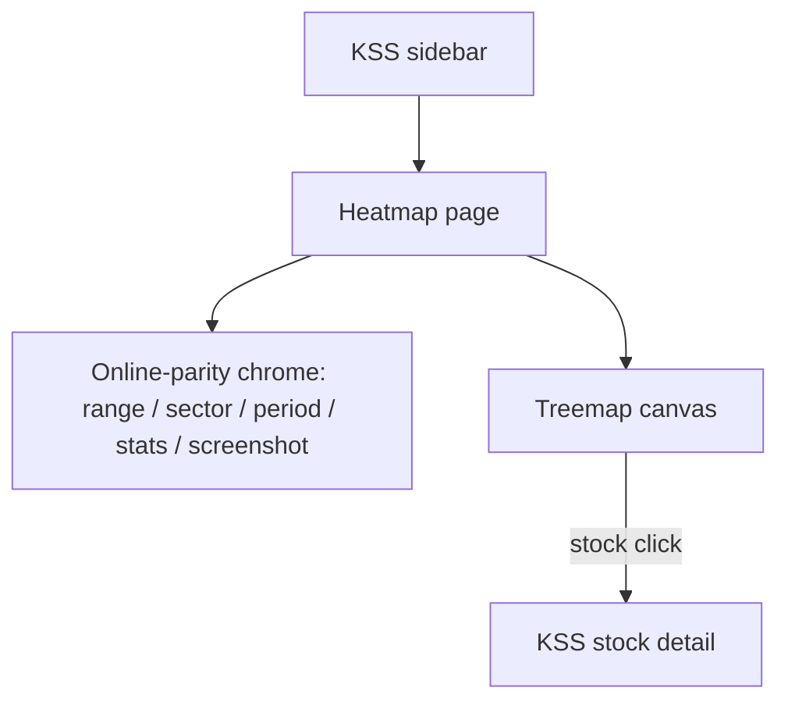
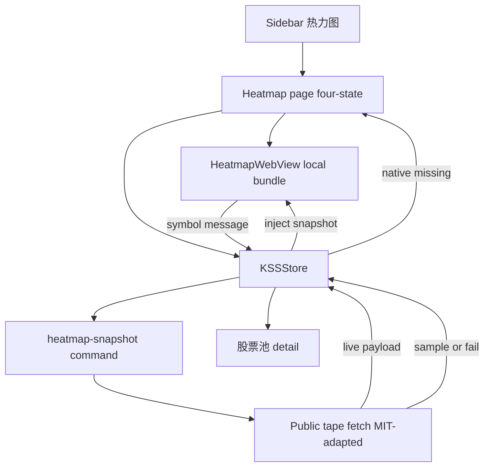

# A-Share Heatmap Page - Plan

## Goal Capsule

- **Objective:** From the KSS sidebar, the operator can open a full-market A-share cloud and read live structure (who is up or down, where weight sits, which industries lead) in one glance — the judgment 盯盘 currently cannot make.
- **Means:** Bundled ChartWebView-style heatmap page plus a new public-tape snapshot command (KTD1, KTD2).
- **Product authority:** Product Contract (R1–R15) > Planning Contract > implementer discretion. The live [A-share heatmap](https://map.wenyuanw.me) and [wenyuanw/a-share-heatmap](https://github.com/wenyuanw/a-share-heatmap) remain the interaction authority for in-scope map behavior; this contract owns the KSS deltas.
- **Execution profile:** code.
- **Stop conditions:** Stop and ask if the page would embed map.wenyuanw.me, show bundled sample tiles as live tape, feed this snapshot into backtest/PIT paths, or stretch Longbridge into a full-market feed.
- **Open blockers:** None.
- **Product Contract preservation:** unchanged.

---

## Product Contract

### Summary

Add a sidebar page that is the map.wenyuanw.me market cloud: float-cap area, return color, market range, level-1 sectors, periods, canvas gestures, breadth stats, and screenshot.
Clicking a stock opens KSS stock detail.
Watchlist heatmap is out; failed data must not look like a live tape.

### Problem Frame

盯盘 already answers index level, northbound/ETF cards, and 资金热点 (今日板块 plus the themes rotation archive).
The operator has been reading only that hotspot layer and skipping the full market.
There is no surface that spreads A-share names by float cap and paints today's (or another period's) return, so breadth versus a few hot themes stays invisible.
可投资地图 answers rule-risk color, not tape structure.
Trends' inflow calendar is a month heat, not a stock cloud.

### Key Decisions

- **Ship the online cloud as a full page, not a trimmed today-only map.** (session-settled: user-directed — chosen over a smaller subset: the smallest useful version is that page.) Governs R2, R3, R4, R5, R6, R7, R8, R9.
- **Stock click stays in KSS.** (session-settled: user-directed — chosen over Xueqiu: this page supplements 盯盘 instead of leaving the app.) Governs R11.
- **No watchlist heatmap in this version.** (session-settled: user-directed — chosen over KSS 自选 or a private local list: only full-market and sector views.) Governs R10.
- **Online public-snapshot cadence counts as the live tape.** (session-settled: user-directed — chosen over tick-level live or close-only: Longbridge cannot cover the whole market.) Governs R12.
- **Own sidebar page, not a 盯盘 strip.** Confirmed with the synthesis. Governs R1, R14.
- **Unavailable data stays visibly unavailable.** Built-in sample tiles must not be shown as the current market. Governs R13.

<!-- ce-section: work-relationships -->
### How This Work Fits Together

This plan owns the market-cap / return cloud page only.
The surrounding surfaces are the current understanding, not a roadmap.

- 盯盘
  - Shares the morning-scan job.
  - Can proceed independently of this page.
  - This plan does not change 盯盘 layout or 今日板块.
- 主题 / 热点轮动
  - Shares the "what is hot" question.
  - Out of scope here; already the fund-hotspot layer.
- 可投资地图 (`docs/plans/2026-08-09-001-feat-investability-map-plan.md`)
  - Shares the word "map" only.
  - Can proceed independently of; different meaning (rule-risk colors).
- 自选热力图
  - Still to decide as later work.
  - Not a requirement here.

### Requirements

**Placement**

- R1. The cloud is a first-class sidebar workspace page, not a region on 盯盘.

**Map (online parity, KSS deltas only)**

- R2. In-scope map behavior matches [map.wenyuanw.me](https://map.wenyuanw.me) / [wenyuanw/a-share-heatmap](https://github.com/wenyuanw/a-share-heatmap), except R10, R11, and R13.
- R3. Tile area encodes float-cap weight in the current view; tile color encodes return for the selected period.
- R4. The operator can switch the market ranges the online page offers.
- R5. The operator can focus one or more level-1 industries the way the online page does.
- R6. The operator can switch return windows the online page offers (including today, near 5d, near 20d, and year-to-date).
- R7. The canvas supports the online page's zoom, pan, and hover-detail behavior.
- R8. A market overview shows up / flat / down counts and turnover, and recomputes when the industry focus changes.
- R9. The operator can capture a screenshot of the current cloud the way the online page does.

**KSS deltas**

- R10. This version has no watchlist-only cloud and no AI watchlist flow.
- R11. Activating a stock on the cloud opens that name's KSS stock detail and does not open Xueqiu.
- R12. Freshness matching the online public snapshot (short-cached, not a full-market tick feed) is enough.
- R13. When a current snapshot cannot be shown, the page must not present built-in sample tiles as live market.

**Adjacency**

- R14. This work does not add, restyle, or replace 今日板块 or 主题 as fund-hotspot surfaces.
- R15. The page is not 可投资地图 and must not reuse that page's risk-color language as the tape encoding.

### Key Flows

- F1. Open the cloud
  - **Trigger:** Operator selects the new sidebar section.
  - **Steps:** The page fills the workspace; a current snapshot (per R12) draws the default full-market view.
  - **Outcome:** Structure is readable without leaving KSS.
  - **Covered by:** R1, R2, R3, R12
- F2. Change range, industry, or period
  - **Trigger:** Operator uses the online-parity chrome.
  - **Steps:** The canvas and R8 stats update to the new cut.
  - **Outcome:** Same cloud, different slice — not a different product.
  - **Covered by:** R4, R5, R6, R8
- F3. Inspect a name
  - **Trigger:** Operator activates a stock tile.
  - **Steps:** KSS stock detail opens for that symbol.
  - **Outcome:** The scan continues inside KSS.
  - **Covered by:** R11
- F4. Snapshot missing
  - **Trigger:** Remote snapshot is down or unusable.
  - **Steps:** The page states that current market cannot be shown.
  - **Outcome:** No sample cloud is readable as today's tape.
  - **Covered by:** R13

### Acceptance Examples

- AE1. Online-parity scan
  - **Covers R2, R3, R4, R6, R7.**
  - **Given:** The page is open on a good snapshot.
  - **When:** The operator switches market range and period, then zooms a heavy industry.
  - **Then:** Area still reads as weight, color still reads as that period's return, and the chrome matches the online page for those controls.
- AE2. Industry focus updates stats
  - **Covers R5, R8.**
  - **Given:** Full-market stats are visible.
  - **When:** The operator focuses a level-1 industry.
  - **Then:** Counts and turnover are for that focus, not the previous universe.
- AE3. Click stays in KSS
  - **Covers R11.**
  - **Given:** A stock tile is visible.
  - **When:** The operator activates it.
  - **Then:** KSS stock detail opens and no Xueqiu window is launched.
- AE4. No watchlist mode
  - **Covers R10.**
  - **Given:** The page chrome is visible.
  - **When:** The operator looks for a watchlist cloud.
  - **Then:** That mode is absent.
- AE5. Failed snapshot is honest
  - **Covers R13.**
  - **Given:** No current snapshot can be loaded.
  - **When:** The operator opens the page.
  - **Then:** They cannot mistake a bundled sample cloud for the live market.
- AE6. Not a 盯盘 widget
  - **Covers R1, R14.**
  - **Given:** The operator is on 盯盘.
  - **When:** They want the cloud.
  - **Then:** They open the new sidebar page; 盯盘 itself is unchanged.

### Success Criteria

- After a short open, the operator can say whether the tape is broad or narrow, and which industries hold the weight — a sentence 盯盘's hotspot row does not support.
- A cold reader can tell this page from 可投资地图 without reading the plan.

### Scope Boundaries

**Out of this version**

- Watchlist cloud and the online AI-watchlist flow.
- Embedding the cloud on 盯盘.
- Rebuilding 今日板块, 主题, or 可投资地图.
- Full-market tick-by-tick quotes, including stretching Longbridge beyond 陆股通.
- Opening Xueqiu (or other external quote sites) from a tile.

**Deferred for later**

- Wiring the cloud to KSS 自选 as a watchlist mode.

**Deferred to Follow-Up Work**

- In-page stock sheet that keeps the operator on the heatmap.
- A dedicated full-market return cache that later analytics could share (this snapshot stays display-only).

### Dependencies / Assumptions

- `KSSStore.selectStock` is the stock-detail path; default `navigate` leaves this page for 股票池 (KTD4).
- Off-pool names may trigger import-then-open; the page must show progress rather than look hung.
- The primary actor is the desk operator who already uses 盯盘.
- KSS sidebar chrome remains; the cloud fills the workspace content pane as a full-pane WebView, not a child of a `ScrollView`.

### Outstanding Questions

**Deferred to implementation**

- Exact empty/error copy for R13 (follow existing loud-degradation wording, not invent a new voice).
- Exact public-tape vendor helper names inside the new bridge command.

### Sources / Research

- Live product: [https://map.wenyuanw.me](https://map.wenyuanw.me)
- Source repo: [https://github.com/wenyuanw/a-share-heatmap](https://github.com/wenyuanw/a-share-heatmap) (MIT; `/api/heatmap/quotes` caches ~8s)
- 盯盘 composition: `Sources/KSSDesktop/Views/DashboardView.swift`
- Workspace sections: `Sources/KSSDesktop/Models/KSSModels.swift` (`WorkspaceSection`)
- U5 routing: `Sources/KSSDesktop/Views/ContentView.swift` (`investabilityMap` before snapshot wait)
- WebView + Swift-owned data: `Sources/KSSDesktop/Views/ChartWebView.swift`, `Sources/KSSDesktop/Support/WebThemeBridge.swift`
- Local-only nav: `Sources/KSSDesktop/Views/KSSLaunchWebView.swift`
- Four-state page: `Sources/KSSDesktop/Views/InvestabilityMapView.swift`
- Stock click: `Sources/KSSDesktop/Services/KSSStore.swift` (`selectStock`)
- Bridge registry: `scripts/kss_app_bridge.py` (`COMMANDS`, `longbridge-quote`, `_load_dailybasic_cache`)
- Float-cap slice only: `scripts/refresh_daily_basic.py` (no multi-period return)
- Learnings: `docs/solutions/kss_desktop_swiftui_design_system.md`, `docs/solutions/sector_review_deployment.md`, `docs/solutions/ai_native_surface_assessment.md`, `docs/solutions/dragon_tiger_integration_retrospective.md`

---

## Planning Contract

### Key Technical Decisions

- KTD1. **Bundle a local heatmap WebView; do not load map.wenyuanw.me.** (session-settled: user-approved — chosen over embedding the live site: click-through and the sample gate cannot be enforced cross-origin.) Instantiates R1, R10, R11, R13. Mirror `ChartWebView`: local `loadFileURL`, message handler, Swift-owned payload.
- KTD2. **Add a display-only `heatmap-snapshot` bridge command for the public tape.** (session-settled: user-approved — chosen over Tushare close-only or Longbridge: R12 needs full-market multi-period returns.) Instantiates R3, R4, R6, R8, R12, R13. Adapt the MIT quote fetch from a-share-heatmap rather than depending on their Vercel staying up. If the payload is sample/fallback or has no current trade date, fail. Do not write this tape into backtest or PIT stores. Existing `snapshot` is pool-only; `dailybasic_latest.json` has `circ_mv` without period returns; `longbridge-quotes` is 陆股通 and capped.
- KTD3. **Route the page like InvestabilityMap U5.** Do not wait for the dashboard snapshot. Instantiates R1, F1.
- KTD4. **Stock activation calls `selectStock` with default navigate.** (session-settled: user-approved — chosen over an in-page sheet: same as 盯盘/主题.) Instantiates R11, F3. Off-pool import must show progress.
- KTD5. **The WebView is the page body, not inside a `ScrollView`.** Follow `docs/solutions/kss_desktop_swiftui_design_system.md`. Instantiates R7.
- KTD6. **Sidebar label is 热力图.** Visible and reorderable, not in `hidden`. Distinct icon from 可投资地图. Instantiates R1, R15.

### High-Level Technical Design

Swift owns fetch, cache, and honesty.
The web layer only renders tiles, chrome, gestures, and screenshot.
A failed or sample tape never reaches the renderer.

### Assumptions

- Vendoring/adapting the MIT canvas plus chrome is cheaper than rewriting the treemap in Swift.
- Full-market JSON needs the ChartWebView-style large-payload inject, not a naive string eval.
- Theme push uses the existing bridged-web coordinator; canvas colors stay online-parity (red/green tape), not 可投资地图五色.

### Sequencing

U1 can land first (empty routed page).
U2 defines the snapshot contract U3/U4 consume.
U3 and U2 may overlap once the payload fields are named in U2 tests.
U4 is last.

---

## Implementation Units

### U1. Sidebar section and U5 routing

- **Goal:** 热力图 appears in the sidebar and opens immediately without waiting for the dashboard snapshot.
- **Requirements:** R1, R14, R15, AE6. KTD3, KTD6.
- **Dependencies:** None.
- **Files:**
  - `Sources/KSSDesktop/Models/KSSModels.swift`
  - `Sources/KSSDesktop/Views/ContentView.swift`
  - `Sources/KSSDesktop/Support/SidebarNavIcon.swift`
  - `Sources/KSSDesktop/Resources/Icons/nav/` (new outline/filled PDFs)
  - `Tests/KSSDesktopTests/SidebarNavIconTests.swift`
  - `Tests/KSSDesktopTests/WorkspaceSectionTests.swift`
- **Approach:**
  1. Add a visible `WorkspaceSection` case with display name 热力图.
  2. Do not add it to `hidden` or `pinned`.
  3. Route it with `investabilityMap` before `else if let snapshot`.
  4. Add the matching `EmptyView` case inside the snapshot switch.
  5. Map a new nav icon base; keep SF Symbol fallback.
- **Patterns to follow:** InvestabilityMap U5 comments in `ContentView`; `WorkspaceSection.ordered(from:)` appends missing reorderable cases.
- **Test scenarios:**
  - Happy: default sidebar order includes 热力图 and not 可投资地图's icon base.
  - Happy: `ordered(from: "")` contains the new section; `hidden` does not.
  - Edge: a stored `sidebarOrder` missing the new raw value still appends it at the end.
  - Integration: ContentView source still routes the section before the snapshot wait (source-scan, same style as Seesaw/investment-analysis guards).
- **Verification:** Sidebar shows 热力图; opening it does not spin on dashboard snapshot.

### U2. Display-only heatmap snapshot command

- **Goal:** One bridge command returns a full-market public-tape payload (weight, period returns, level-1 industry, breadth stats) or a hard failure.
- **Requirements:** R3, R4, R6, R8, R12, R13, F1, F4, AE5. KTD2.
- **Dependencies:** None.
- **Files:**
  - `scripts/kss_app_bridge.py`
  - New helper module under `kss/` or `scripts/` for the MIT-adapted fetch
  - `kss/tests/test_bridge_heatmap.py`
  - `kss/tests/test_bridge_orientation.py` (passes once `COMMANDS` lists the new name)
- **Approach:**
  1. Register the command in `COMMANDS` and `dispatch`.
  2. Accept market range and period keys aligned with the online page.
  3. Fetch the public tape by adapting a-share-heatmap's quote path; short cache is enough.
  4. Reject sample/fallback/undated payloads as errors.
  5. Do not persist into backtest, `cs_data`, or PIT intraday stores.
  6. Do not call `longbridge-quotes` for this payload.
- **Execution note:** Start with failing tests for live vs sample/undated rejection before wiring the fetch.
- **Patterns to follow:** `test_bridge_orientation.py` command registration; InvestabilityMap bridge tests for explicit missing.
- **Test scenarios:**
  - Happy: a live-shaped fixture yields tiles with circ weight, a period return, and L1 industry, plus up/flat/down and turnover.
  - Happy: changing period or market changes the return field / constituent set.
  - Error: a sample or fallback fixture returns failure, not tiles.
  - Error: upstream timeout/5xx returns failure.
  - Edge: empty constituent list is failure, not a blank "live" cloud.
  - Integration: `COMMANDS` contains the new name so orientation drift fails if dispatch is forgotten.
- **Verification:** Tests fail closed on sample; no new writes into backtest paths.

### U3. Bundled heatmap renderer

- **Goal:** Local HTML/JS draws the online-parity cloud and talks only to KSS.
- **Requirements:** R2, R3, R4, R5, R6, R7, R8, R9, R10, R11, AE1, AE2, AE4. KTD1, KTD5.
- **Dependencies:** U2 (payload field contract).
- **Files:**
  - `Sources/KSSDesktop/Resources/Heatmap/` (html/js/css)
  - `Package.swift`
  - `Tests/KSSDesktopTests/KSSResourcesTests.swift`
- **Approach:**
  1. Vendor/adapt the MIT canvas and chrome; strip watchlist and AI watchlist.
  2. Tile activation posts a symbol to a dedicated message handler; no Xueqiu navigation.
  3. Screenshot stays in the web chrome (R9).
  4. Renderer draws only injected live payloads; it has no bundled demo tape.
  5. Copy the folder in `Package.swift` like `Resources/Launch`.
- **Patterns to follow:** `ChartWebView` file URL + allow-read; Launch subdirectory bundle.
- **Test scenarios:**
  - Happy: bundle resolves heatmap HTML.
  - Happy: chrome has no watchlist mode (string/fixture assert on the shipped assets).
  - Edge: shipped JS contains the KSS message-handler name and does not contain a Xueqiu navigation helper.
- **Verification:** `KSSResources` can load the heatmap HTML; assets have no watchlist/Xueqiu path.

### U4. Heatmap page, inject, and click-through

- **Goal:** Opening 热力图 loads a live tape into the WebView, or shows a native missing state; activating a tile opens 股票池.
- **Requirements:** R1, R7, R11, R12, R13, F1, F2, F3, F4, AE3, AE5. KTD1, KTD4, KTD5.
- **Dependencies:** U1, U2, U3.
- **Files:**
  - `Sources/KSSDesktop/Views/HeatmapView.swift` (new)
  - `Sources/KSSDesktop/Views/HeatmapWebView.swift` (new)
  - `Sources/KSSDesktop/Services/KSSStore.swift`
  - `Sources/KSSDesktop/Services/BridgeClient.swift`
  - `Sources/KSSDesktop/Views/ContentView.swift`
  - `Tests/KSSDesktopTests/HeatmapPageTests.swift` (new)
- **Approach:**
  1. Four-state page: loading / missing / empty-error / content (InvestabilityMap).
  2. Store fetches `heatmap-snapshot` on appear. Range and period changes initiated in the WebView chrome post a refetch request to the store before redraw.
  3. Inject live JSON with the large-payload pattern from `ChartWebView`.
  4. Never inject a sample payload.
  5. Message handler calls `selectStock`; show import progress when the name is off-pool.
  6. Block non-file navigation.
- **Patterns to follow:** `ChartWebView` coordinator + base64 inject; `InvestabilityMapView` four states; `ContentView` `onSelectSymbol` closures.
- **Test scenarios:**
  - Happy: live payload reaches the inject path; missing payload shows native missing, not a cloud.
  - Covers AE3. Handler symbol `000001` / `000001.SZ` calls `selectStock` and does not open a URL.
  - Covers AE5. Failed fetch never calls inject.
  - Edge: off-pool symbol sets importing/progress rather than silent hang.
  - Integration: F2 range/period change requests a new snapshot and redraws.
- **Verification:** Manual open shows a live cloud or a loud miss; a tile click lands on 股票池; Xueqiu does not open.

---

## Verification Contract

| Gate | Command | Proves |
|---|---|---|
| Bridge command registered | `uv run pytest kss/tests/test_bridge_orientation.py -q` | New dispatch name is in `COMMANDS` |
| Snapshot honesty | `uv run pytest kss/tests/test_bridge_heatmap.py -q` | Live vs sample/undated/empty |
| Sidebar + icons | `swift test --filter SidebarNavIconTests --filter WorkspaceSectionTests --filter KSSResourcesTests` | Section visible; assets bundled |
| Page / click | `swift test --filter HeatmapPageTests` | Inject gate and `selectStock` |
| No dashboard wait | Source-scan in `WorkspaceSectionTests` (or sibling) | U5 routing preserved |

`swift test` needs full Xcode (not CLT-only), same as other KSSDesktop suites.

---

## Definition of Done

- R1–R15 and AE1–AE6 are each owned by a unit above.
- 热力图 is a sidebar page that does not wait on the dashboard snapshot.
- A live public-tape snapshot draws the cloud; sample/failed tape shows native missing.
- Tile activation opens KSS 股票池 and never Xueqiu.
- No watchlist/AI watchlist chrome ships.
- Heatmap tape is not stored on a backtest/PIT path.
- Abandoned vendor experiments are not left in `Resources/` or the bridge.
- Verification Contract gates are green on a machine that can run them.
