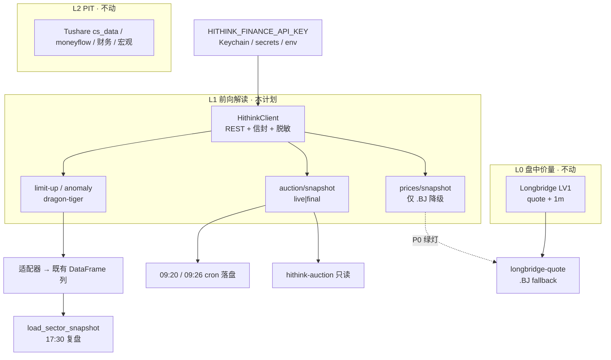

# feat: 同花顺 Financial-API 解读层

**Status (2026-09-12):** U1–U6、U8 已落地。**U7 BLOCKED** — P0 为 NO-GO：计划里的 `830799.BJ` 对 HiThink 是 `code=1002 Unknown A-share thscode`（北交所现行代码为 `92xxxx.BJ`）；本次探针在周六休市，即便 `920735.BJ` 有 `last_price` 也不是竞价/连续竞价 live 证明。按计划不留半套 fallback，`_longbridge_quote_inner` 不接 HiThink。

## Summary

把 [HiThink Financial-API](https://github.com/HiThink-Tech/Financial-API)（`fuyao.aicubes.cn`）接进 KSS，**只作为前向解读层**：集合竞价 live、官方涨停/异动/龙虎榜，以及北交所快照降级。

**不替换** Longbridge 盘中现价 / 1m bar，**不迁移** Tushare PIT（`cs_data` / 资金流 / 财务 / 宏观）。现有 `ths_client`（`zx.10jqka.com.cn/getharden`）和东财龙虎榜无鉴权 scrape 在适配器稳定后退役。

官方契约硬边界（不得假装覆盖）：无分钟 K、tick、Level-2、海外、宏观、新闻公告原文、研报原文。个股历史 K 仅 `1d`。

---

## Problem Frame

KSS 盘中价量已经有 Longbridge ChinaConnect LV1。缺口不在「再找一个行情主站」，而在：

1. **09:15–9:25 集合竞价空白**。`morning_divergence_alert` 09:00 用的是 T-1 ETF 雷达，不是竞价。
2. **题材归因与涨停池依赖未鉴权 scrape**，且 `getharden` 注释写明盘后 15:30 起 `reason` 才齐。
3. **北交所无可靠盘中价**。Longbridge 不覆盖 `.BJ`；东财 1m 端点本机不稳。HiThink thscode 支持 `.BJ`，但 snapshot 延迟未测，不能先切。
4. 龙虎榜走东财 datacenter，契约漂移 + 17:30 复盘可能赶不上 18:00 齐数。官方 `dragon-tiger-list` 更稳，实时性不是这条的瓶颈。

---

## Requirements

- **R1** 薄 HTTP 客户端：统一信封（HTTP 200 且 `code==0`）、`X-api-key`、失败不抛、指数退避（含 `4001` 限流最多 3 次）、`fuyao.aicubes.cn` 走 `NO_PROXY`、error 脱敏。
- **R2** 凭据 `HITHINK_FINANCE_API_KEY` 与 Tushare/Longbridge 同纪律：Keychain + secrets 文件 + env-first；永不进 git / plist / 日志 / LLM 上下文。
- **R3** 接外部端点前先拉真实响应核字段（`verify-data-source-before-building`）。snapshot **延迟探针**只门禁北交所现价降级，不挡竞价/特色。
- **R4** `SectorSnapshot.ths_hot` / `dragon_tiger` 列契约不变，commentary / `render_*_line` 不改数字职责。
- **R5** 新增集合竞价：bridge 按需 live 拉取 + 交易日 09:20 live / 09:26 final 落盘。不塞进 `morning_divergence_alert`。
- **R6** 北交所：仅当 P0 探针证明 HiThink snapshot 在竞价/连续竞价有 `.BJ` 有效 `last_price` 后，才给 `longbridge-quote` 做降级。陆股通 covered 标的永不改走 HiThink。
- **R7** 新 bridge 命令只读、不入 `WRITE_COMMANDS`；MCP 经 `TOOL_SPECS` → harness_pack 投影，不手写第二份工具表。
- **R8** eligibility 结构封顶 `forward_observed`。HiThink 任何输出不得写入 `cs_data` / 回测输入。
- **R9** 明确不做：`collect_intraday` 改源、Tushare `moneyflow_*` 删除、HiThink dump 替换日线主库、把 `get_hithink_quote` 做成 agent 现价主工具。

---

## Key Technical Decisions

- **KTD1 只做 REST，不安官方 Python/CLI 运行时依赖。** KSS 数据层已有 `requests` + 失败返回 `None` 范式。官方 SDK/CLI 适合探针与人工，不进生产 import。Base URL `https://fuyao.aicubes.cn`，Header `X-api-key`。
- **KTD2 适配器保契约，不改复盘渲染。** `ths_hot` 必须继续提供 `code` / `name` / `reason`（`_hot_reason_tags` 按 `+/、·` 切）。`dragon_tiger` 必须继续提供 `net_amount`（元）+ `reason`（`_dragon_tiger_summary` / `render_dragon_tiger_line`）。HiThink 字段在适配器内映射；`keyword_list` 用 `+` 拼进 `reason`，避免切分器失效。
- **KTD3 主源 HiThink、scrape 单版本降级。** `load_sector_snapshot` 先 HiThink；失败或空才调用现有 `fetch_ths_hot` / `fetch_dragon_tiger`，并在 snapshot 上记 `ths_hot_source` / `dragon_tiger_source` ∈ `{hithink, scrape, missing}`。下一迭代再删 scrape（本计划不删文件）。
- **KTD4 探针门禁分两条。**
  - **特色/竞价**：有 Key 后拉一天真实 JSON，核列名，fixture 脱敏入库，才能写 mapper。
  - **现价延迟（P0）**：交易时段对 `688008.SH` / `300750.SZ` / `830799.BJ` 同时打 Longbridge `fetch_quote` 与 HiThink `/api/a-share/prices/snapshot`。未测或 `.BJ` 无值 → U7 不做。
- **KTD5 现价主路径不可漂移。** Agent「此刻价」仍是 `get_longbridge_quote`。新增工具命名避开 quote：`get_hithink_auction` / `get_hithink_limit_up`。北交所降级走**同一** `longbridge-quote` 命令的 fallback 字段（`source=hithink_snapshot`），避免模型选错工具。
- **KTD6 竞价是新产品面。** 09:00 ETF 见顶快讯保留。竞价脚本独立。universe = `load_watchlist()` ∪ 北证扫描池（`storage/bj_cache` 或 scan 输入表，实现期钉一份），单次请求 ≤100 `thscode`（官方上限）。
- **KTD7 数字仍归代码。** 涨停池/竞价若进 Telegram 或复盘正文，走 `render_*_line`；LLM payload 只留定性 tag。对齐 `docs/solutions/dragon_tiger_integration_retrospective.md`。
- **KTD8 时间与代码格式。** 对内 `trade_date` 仍 `YYYYMMDD`；HiThink `date` / `date_ms` 在客户端边界转换。`thscode` 必须带 `.SH/.SZ/.BJ`，禁止猜后缀（复用 `longbridge_coverage.normalize_symbol`）。
- **KTD9 不把托管 MCP 配进 KSS 运行时。** Cursor 侧可选安装 HiThink MCP 是人用，不进 `kss-mcp` / sidecar。KSS agent 只经 bridge。

---

## High-Level Technical Design

---

## Implementation Units

### U1. `HithinkClient`（传输层）

- **Goal**: 可测的薄客户端，不含业务字段映射。
- **Requirements**: R1, R8, KTD1。
- **Dependencies**: 无。
- **Files**:
  - `kss/data/hithink_client.py`（新）
  - `kss/tests/test_hithink_client.py`（新）
- **Approach**:
  - `get(path, params) -> dict | None`。成功条件：HTTP 200 且 `body.code == 0` 且 `data` 非 null。`1xxx/2xxx` 不重试；网络 / `4001` / `5xxx` 退避最多 3 次。
  - Token 解析顺序对齐 Tushare：`HITHINK_FINANCE_API_KEY` env → `$KSS_STATE_ROOT/secrets/hithink_finance_api_key`（0600）→ 历史文件路径不建。
  - `_bypass_system_proxy` 追加 `fuyao.aicubes.cn`。
  - 异常/`error` 走 `kss.security.redaction.redact_text`，并传入 known_secrets=当前 key。断言响应日志不含 `X-api-key` 值。
  - 不在本单元实现具体端点函数以外的「业务 GET 包装」也可以：提供 `get_prices_snapshot` / `get_auction_snapshot` / `get_limit_up_pool` / `get_anomaly_analysis_list` / `get_dragon_tiger_list` 五个薄方法，返回原始 `data` dict，映射留 U4–U6。
- **Patterns**: `kss/data/dragon_tiger_client.py`（失败 None、2 次退避）+ `TushareClient._bypass_system_proxy`。
- **Tests**（不打真网）:
  - 缺 key → `None` + warning，不抛。
  - HTTP 200 + `code=0` → 返回 `data`。
  - `code=2003` → None，不重试。
  - `code=4001` 两次后成功 → 返回 data。
  - 异常文本含假 key → `error`/log 不含该串。

### U2. 凭据与设置面

- **Goal**: Key 与 Longbridge 一样能配、能测、能进 cron。
- **Requirements**: R2。
- **Dependencies**: U1。
- **Files**:
  - `Sources/KSSDesktop/Services/KeychainStore.swift`（`managedKeys` 加 `HITHINK_FINANCE_API_KEY`）
  - `Sources/KSSDesktop/Models/KSSModels.swift`（`SettingsCategory.hithink`）
  - `Sources/KSSDesktop/Views/SettingsView.swift`（数据源卡 + 测试按钮）
  - `Tests/KSSDesktopTests/SettingsTabTests.swift`（managedKeys 含新键）
  - `scripts/kss_app_bridge.py`（`_load_project_env` allowlist；selfcheck 凭据元组；`datasource-test hithink`）
  - `kss/tests/test_bridge_datasource_test.py` / `test_bridge_selfcheck.py`
  - `scripts/lib_cron_credentials.sh` 的调用方（U4/U6 wrapper）；本单元先保证 `kss_load_credential HITHINK_FINANCE_API_KEY` 可解析
- **Approach**:
  - `datasource-test hithink`：无 key → `not_configured`；有 key 则 `GET /api/meta/tickers/search?q=600519&limit=1`，返回 `{ok, latency_ms, error}`。
  - Settings 文案写明：官方 A 股解读层（竞价/涨停/龙虎榜），**不是**分钟行情，不能替代 Longbridge。
  - plist 渲染器已拒 token-pattern；加测试：渲染产物不含 `HITHINK` 值。
- **Tests**: 镜像 Longbridge 的 not_configured / ok / 异常三类。

### U3. 真实响应探针 + 脱敏 fixture（门禁）

- **Goal**: 每个要接的端点有一份脱敏真实 JSON，字段名钉死后再写 mapper。
- **Requirements**: R3, KTD4。
- **Dependencies**: U1, U2（要真 Key，非 CI）。
- **Files**:
  - `scripts/probe_hithink_endpoints.py`（新；scratch 可进 repo，只从 env 读 key）
  - `kss/tests/fixtures/hithink/`（脱敏 JSON，无 key、无多余 PII）
- **Approach**（人工交易日跑一次，输出写入 fixture）:
  1. `limit-up-pool` 今日、`anomaly-analysis-list`（可带 `tag_codes=LIMIT_UP,SHARP_RISE`）
  2. `dragon-tiger-list?board_type=all`
  3. `auction/snapshot?stage=live` 与 `final`（非竞价时段记录 `data_status`）
  4. **P0 延迟**：同时打 Longbridge quote 与 HiThink snapshot（三只代码），把 `now`、两边价格、时间戳写入 `storage/reports/hithink_probe/`（git-ignore 真值，计划只收汇总结论）
- **Gate**:
  - U4 需要 1+2 fixture。
  - U5 需要 2。
  - U6 需要 3。
  - U7 需要 4 的结论：`.BJ` 有价 **且**（可选）与对照标的延迟可接受。延迟不可接受 → U7 取消，不降级陆股通。
- **Execution note**: 探针打真网；CI 只用 fixture。

### U4. 替换 `ths_hot` 题材归因

- **Goal**: 17:30 复盘的 `reason` 改走官方涨停/异动，盘中也可取（不再等 15:30 getharden）。
- **Requirements**: R4, KTD2, KTD3, KTD7。
- **Dependencies**: U1, U3 fixture。
- **Files**:
  - `kss/data/hithink_special.py`（新；mapper）
  - `kss/sector/data_fetcher.py`（`load_sector_snapshot` 改调用序）
  - `kss/tests/test_hithink_special.py`（新）
  - `kss/tests/test_sector_data_fetcher.py`（characterization：列契约）
  - 保留 `kss/data/ths_client.py` 作 fallback
- **Approach**:
  - 主路径：`limit-up-pool` 行 + `anomaly-analysis-list` 按 `thscode` join。`reason` = `limit_up_reason` 优先，否则 `"+".join(keyword_list)`，再否则 `analysis_content` 截断。
  - 输出列与 `fetch_ths_hot` 对齐：`code, name, reason, pct_change, close, ...`。`code` 用 ticker（6 位），与现 commentary 一致。
  - 失败 → 现 `fetch_ths_hot`。`missing` 仅当两边都空。
- **Tests**:
  - fixture → DataFrame 含 `reason`，`_hot_reason_tags` 仍能切出 tag。
  - HiThink None + scrape 有值 → snapshot.ths_hot 非空、source=scrape。
  - 两边空 → missing 含 `ths_hot`。
  - 幻觉防护既有用例不改（不碰 `render_*`）。

### U5. 替换龙虎榜 scrape

- **Goal**: 官方 `dragon-tiger-list` 映射到现有 `net_amount` / `reason` 契约。
- **Requirements**: R4, KTD2, KTD3, KTD7。
- **Dependencies**: U1, U3。
- **Files**: 同 U4 的 `hithink_special.py` + `data_fetcher.py`；`kss/tests/test_dragon_tiger_client.py` 保留 scrape 回归；新增 mapper 测试。
- **Approach**:
  - 用 U3 fixture 钉：`net_amount` 来自 `buy_value - sell_value`（或官方净额字段，以真实列名为准，禁止猜）。单位必须是**元**（与现 `render_dragon_tiger_line` 的 `/1e8` 一致）。若官方是万元，在 mapper 乘 1e4，测试锁死。
  - `reason`：上榜原因字段或 `concept_list` join；进 LLM 前仍 `sanitize_llm_input`。
  - 17:30 仍可能空（披露滞后）→ `None` + missing，行为与今天 scrape 空相同，不补零。
- **Tests**: 净额符号、单位、`_dragon_tiger_summary` 数字与 fixture 逐字一致。

### U6. 集合竞价 live + cron + 只读命令

- **Goal**: 盘前竞价可问、可落盘，与 09:00 ETF 预警解耦。
- **Requirements**: R5, R7, KTD6, KTD7。
- **Dependencies**: U1, U2, U3 auction fixture。
- **Files**:
  - `scripts/fetch_hithink_auction.py`（新）
  - `scripts/run_hithink_auction.sh`（新；`kss_load_credential HITHINK_FINANCE_API_KEY`）
  - `kss/config/cron_jobs.yaml`（`auction_live` 09:20、`auction_final` 09:26，weekdays 1–5）
  - `scripts/kss_app_bridge.py`（`hithink-auction` 只读）
  - `scripts/kss_chat_loop.py`（`get_hithink_auction`）
  - `kss/config/chat_system_prompt.md`（竞价用新工具；现价仍 Longbridge）
  - `kss/tests/test_hithink_auction.py`、`test_bridge_hithink_auction.py`
- **Approach**:
  - CLI：`--stage live|final --thscodes ...`；缺省 universe = watchlist ∪ 北证池，截断 100。
  - 落盘 `storage/auction/YYYY-MM-DD-{live,final}.json` 原子写。bridge 默认打 live API；`--from-cache` 仅非竞价时段降级。
  - `data_status=not_ready` 原样返回，禁止补零。
  - 数字字段（`auction_price` / `auction_pct` / `auction_unmatched`）原样 JSON；若做 Telegram，另写 `render_auction_line`，本单元可不推送（先工具+落盘）。
- **Tests**: mock client；命令 ∉ `WRITE_COMMANDS`；`TOOL_SPECS` 投影后 `mcpVisible=true`。cron 测试：manifest 渲染出两条 plist，ProgramArguments 含 `--stage`。

### U7. 北交所 snapshot 降级（P0 门禁）

- **Goal**: `longbridge-quote` 对 `.BJ` 不再只有 `no_realtime_snapshot`，在探针绿灯时返回 HiThink 最新价。
- **Requirements**: R6, KTD5。
- **Dependencies**: U1, U3 P0 结论为 GO。
- **Files**:
  - `scripts/kss_app_bridge.py`（`_longbridge_quote_inner`）
  - `kss/tests/test_bridge_longbridge.py`
  - `kss/config/chat_system_prompt.md`（北交所：无 1m；现价可能是 HiThink snapshot，标 `source`）
- **Approach**:
  - 仅 `normalize_symbol` 以 `.BJ` 结尾时尝试 HiThink snapshot。
  - 返回增加 `source: "hithink_snapshot"`、`eligibility: "forward_observed"`。陆股通路径零改动。
  - 若 P0 = NO-GO：本单元整段 skip，在本 plan 顶部状态改 `U7 BLOCKED`，不留半套 fallback。
- **2026-09-12 执行结论：U7 BLOCKED。** 探针 `storage/reports/hithink_probe/p0_delay.json`：`u7_verdict=NO-GO`，`in_session=false`；`830799.BJ` 未知，`920735.BJ` 有休市 last_price。characterization `830799.BJ → no_realtime_snapshot` 保持不变。
- **Tests**: `.BJ` mock snapshot；`688008.SH` 永不调用 HithinkClient。

### U8. Agent 文案与涨停只读工具

- **Goal**: 盘中可查官方涨停池，且模型不会把它当成现价主源。
- **Requirements**: R7, KTD5, KTD7。
- **Dependencies**: U4, U6。
- **Files**:
  - `scripts/kss_chat_loop.py`（`get_hithink_limit_up` → `hithink-limit-up`）
  - `kss/config/chat_system_prompt.md`（「实时 vs 存量」段补竞价/涨停；现价句不动）
  - `kss/tests/test_chat_loop.py`（工具名集合）
- **Approach**: 涨停工具返回结构化 rows（thscode/name/limit_up_time/reason/continue_day_cnt），agent 逐字引用。不在 prompt 里让模型「复述涨幅数字」而不给字段。

---

## 排期（实时性优先）

| 顺序 | 单元 | 可并行 | 阻塞 |
|------|------|--------|------|
| 1 | U1 客户端 | — | — |
| 2 | U2 凭据 | 与 U1 测试并行 | 真探针要 Key |
| 3 | U3 探针 | 交易日人工 | 挡 U4–U7 对应端点 |
| 4 | U6 竞价 | U4/U5 之后或并行 | **实时性最高优先落地** |
| 5 | U4 涨停/异动 | 与 U5 并行 | 17:30 复盘收益 |
| 6 | U5 龙虎榜 | 与 U4 并行 | 稳定性，非盘中 |
| 7 | U8 agent 面 | 接 U4+U6 | — |
| 8 | U7 北交所 | 仅 P0 GO | 否则 BLOCKED |

同一 HEAD 有其他会话时用 `git worktree`，见龙虎榜复盘。

---

## 明确不做（本计划范围外）

- 改 `collect_intraday` 默认 provider 或用 HiThink 拉分钟 K（官方无此能力）。
- 用 HiThink historical / market dumps 替换 `cs_data` 或 Tushare `daily`。
- 删除 `moneyflow_ind_dc` / `moneyflow_cnt_ths` / MacroClient / 两融 / yFinance。
- 替换 `duanxianxia` 板块轮动强度分（无等价强度字段）。
- 把 HiThink 托管 MCP 配进 KSSDeck sidecar。
- 修改 `morning_divergence_alert` 的 ETF 逻辑去「顺便」打竞价。

---

## 验收

- [x] U1/U2 单测绿；`datasource-test hithink` 无 key 为 `not_configured`（`test_bridge_datasource_test.py`）；有 key 时 live `ok=true`。
- [x] U3 fixture 入库（`kss/tests/fixtures/hithink/`：limit-up / 龙虎榜 / 竞价 live+final / snapshot；异动周末为空属 today-only 契约）。mapper 列名来自真实响应。
- [x] 复盘数字契约：fixture 行 `net_amount=67123708.26` / `limit_up_reason` 与 `_hot_reason_tags` / `render_dragon_tiger_line` 锁定；`test_sector_commentary.py` 幻觉回归仍绿。
- [x] 09:20/09:26 plist 由 `cron_jobs.yaml` 生成，`EnvironmentVariables` 不含 API key。
- [x] `get_longbridge_quote` 对陆股通行为不变（`test_bridge_longbridge.py`）。
- [x] U7 **未做**（P0 NO-GO / BLOCKED）；无 `source=hithink_snapshot`；`.BJ` 仍 `no_realtime_snapshot`。
- [x] 无 HiThink 数据写入 `cs_data` / parquet 日线缓存；`collect_intraday` 默认仍 `eastmoney_akshare`。

---

## 运维

- Key 申请：https://fuyao.aicubes.cn/admin/
- 环境变量名必须是 `HITHINK_FINANCE_API_KEY`（与官方推荐一致）。
- 限流 `4001` 已在客户端退避；全市场 snapshot 分页禁止进 agent 对话（大结果落盘纪律，本计划不接全市场拉价）。
- 官方文档：https://fuyao.aicubes.cn/docs/ ；契约以仓库 `docs/api/` 为准。
