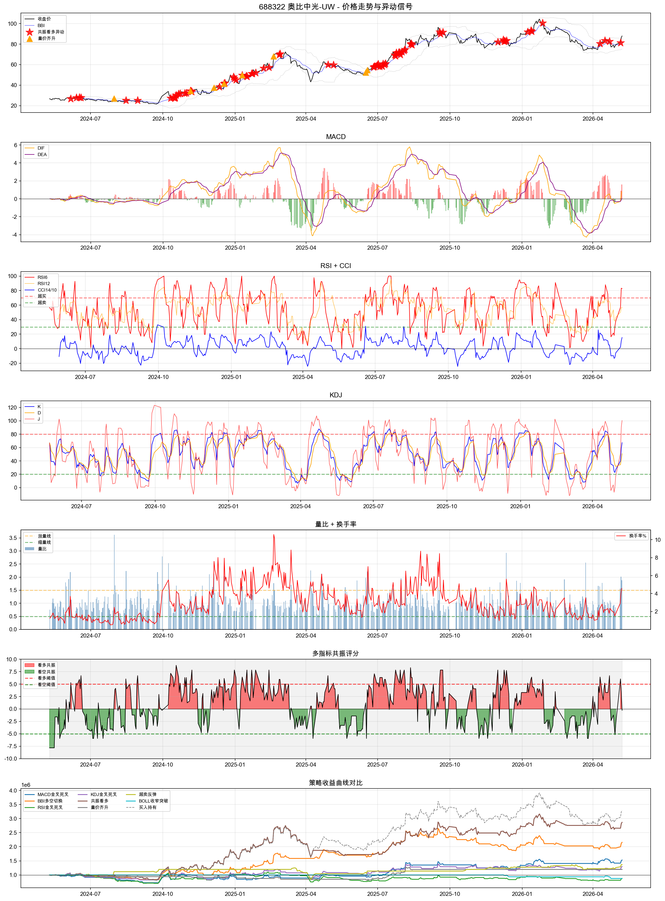
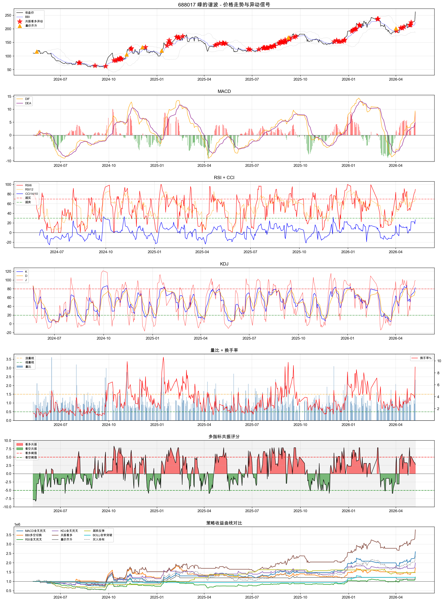

# 多指标共振异动预测模型 - 回测分析报告

**生成时间**: 2026-05-10 21:39
**分析股票**: 688322 奥比中光-UW, 688017 绿的谐波
**回测区间**: 2024-05-10 至 2026-05-10
**指标库**: MACD, BBI, RSI, CCI, KDJ, BOLL, WR, 量比, 换手率, 成交量异动, 均线排列

---

## 688322 奥比中光-UW

**两年基准涨跌幅**: 229.29%

### 策略回测对比
| 策略         |   交易次数 | 胜率   | 平均收益   | 平均亏损   |   盈亏比 | 总收益   | 最大单笔盈   | 最大单笔亏   | 平均持仓   | 超额收益   |
|:-------------|-----------:|:-------|:-----------|:-----------|---------:|:---------|:-------------|:-------------|:-----------|:-----------|
| MACD金叉死叉 |         23 | 39.1%  | 13.58%     | -4.53%     |     3    | 53.01%   | 46.44%       | -10.92%      | 15.9天     | -176.28%   |
| BBI多空切换  |         37 | 29.7%  | 16.27%     | -2.94%     |     5.54 | 115.72%  | 50.88%       | -6.47%       | 10.7天     | -113.57%   |
| RSI金叉死叉  |         54 | 37.0%  | 7.41%      | -4.28%     |     1.73 | -12.43%  | 26.47%       | -22.63%      | 6.7天      | -241.72%   |
| KDJ金叉死叉  |         40 | 40.0%  | 9.00%      | -4.31%     |     2.09 | 29.66%   | 29.40%       | -22.14%      | 8.5天      | -199.63%   |
| 共振看多     |          7 | 57.1%  | 39.86%     | -5.39%     |     7.4  | 186.73%  | 96.57%       | -7.92%       | 76.1天     | -42.55%    |
| 量价齐升     |          8 | 25.0%  | 24.11%     | -3.59%     |     6.72 | 19.61%   | 46.44%       | -5.82%       | 13.5天     | -209.67%   |
| 超卖反弹     |         11 | 81.8%  | 6.15%      | -10.34%    |     0.59 | 36.80%   | 11.85%       | -12.73%      | 13.4天     | -192.49%   |
| BOLL收窄突破 |          2 | 0.0%   | 0.00%      | -6.46%     |     0    | -12.49%  | -6.38%       | -6.53%       | 10.5天     | -241.78%   |

### 异动信号预测效果

**共振看多**
| 周期 | 平均收益 | 胜率 | 最大收益 | 最大亏损 | 信号次数 | 预测准确率 |
|------|---------|------|---------|---------|---------|----------|
| 1日 | 0.49% | 55.4% | 14.49% | -6.61% | 74 | 55.4% |
| 3日 | 1.59% | 56.2% | 18.09% | -11.65% | 73 | 56.2% |
| 5日 | 3.98% | 64.4% | 22.64% | -9.09% | 73 | 64.4% |
| 10日 | 6.76% | 72.2% | 30.71% | -13.48% | 72 | 72.2% |
| 20日 | 12.64% | 74.3% | 45.96% | -19.28% | 70 | 74.3% |

**量价齐升**
| 周期 | 平均收益 | 胜率 | 最大收益 | 最大亏损 | 信号次数 | 预测准确率 |
|------|---------|------|---------|---------|---------|----------|
| 1日 | 0.65% | 62.5% | 3.95% | -3.44% | 8 | 62.5% |
| 3日 | 0.94% | 62.5% | 8.49% | -11.44% | 8 | 62.5% |
| 5日 | 3.16% | 75.0% | 13.44% | -7.85% | 8 | 75.0% |
| 10日 | 5.29% | 75.0% | 12.61% | -9.70% | 8 | 75.0% |
| 20日 | 8.98% | 75.0% | 21.89% | -10.22% | 8 | 75.0% |

**超卖反弹**
| 周期 | 平均收益 | 胜率 | 最大收益 | 最大亏损 | 信号次数 | 预测准确率 |
|------|---------|------|---------|---------|---------|----------|
| 1日 | 1.21% | 66.7% | 4.53% | -2.51% | 24 | 66.7% |
| 3日 | 2.74% | 62.5% | 16.28% | -5.44% | 24 | 62.5% |
| 5日 | 3.68% | 75.0% | 35.86% | -19.33% | 24 | 75.0% |
| 10日 | 5.97% | 56.5% | 54.07% | -25.93% | 23 | 56.5% |
| 20日 | 10.01% | 69.6% | 53.37% | -15.04% | 23 | 69.6% |

**BOLL收窄突破**
| 周期 | 平均收益 | 胜率 | 最大收益 | 最大亏损 | 信号次数 | 预测准确率 |
|------|---------|------|---------|---------|---------|----------|
| 1日 | 0.05% | 50.0% | 0.32% | -0.23% | 2 | 50.0% |
| 3日 | 0.04% | 50.0% | 1.37% | -1.30% | 2 | 50.0% |
| 5日 | 0.72% | 50.0% | 2.12% | -0.68% | 2 | 50.0% |
| 10日 | -4.31% | 0.0% | -4.14% | -4.48% | 2 | 0.0% |
| 20日 | 8.87% | 100.0% | 8.87% | 8.87% | 1 | 100.0% |

**放量突破**
| 周期 | 平均收益 | 胜率 | 最大收益 | 最大亏损 | 信号次数 | 预测准确率 |
|------|---------|------|---------|---------|---------|----------|
| 1日 | 1.34% | 66.7% | 15.73% | -5.92% | 9 | 66.7% |
| 3日 | 1.27% | 55.6% | 7.15% | -4.98% | 9 | 55.6% |
| 5日 | 2.12% | 44.4% | 14.80% | -5.87% | 9 | 44.4% |
| 10日 | 3.70% | 66.7% | 9.27% | -5.30% | 9 | 66.7% |
| 20日 | 4.37% | 55.6% | 16.16% | -10.20% | 9 | 55.6% |

### 指标相关性排名
| 特征      |   5日收益相关性 |   10日收益相关性 |   20日收益相关性 |
|:----------|----------------:|-----------------:|-----------------:|
| cci_dir   |       0.116187  |        0.0663999 |        0.0285193 |
| boll_dir  |       0.0939566 |        0.0649205 |        0.0607677 |
| rsi_dir   |       0.083369  |        0.0121424 |        0.0653594 |
| kdj_dir   |       0.0796106 |        0.130097  |        0.096402  |
| mom_dir   |       0.0659539 |        0.0203978 |        0.0181964 |
| vr_dir    |       0.0584279 |        0.0257635 |        0.0659033 |
| vol_spike |       0.0576884 |        0.0361708 |        0.0237091 |
| to_dir    |       0.0483321 |        0.0697442 |        0.0817497 |

---

## 688017 绿的谐波

**两年基准涨跌幅**: 136.99%

### 策略回测对比
| 策略         |   交易次数 | 胜率   | 平均收益   | 平均亏损   |   盈亏比 | 总收益   | 最大单笔盈   | 最大单笔亏   | 平均持仓   | 超额收益   |
|:-------------|-----------:|:-------|:-----------|:-----------|---------:|:---------|:-------------|:-------------|:-----------|:-----------|
| MACD金叉死叉 |         15 | 53.3%  | 21.44%     | -7.20%     |     2.98 | 159.41%  | 43.18%       | -13.71%      | 27.4天     | 22.42%     |
| BBI多空切换  |         38 | 28.9%  | 15.38%     | -3.44%     |     4.48 | 72.59%   | 40.10%       | -11.46%      | 9.7天      | -64.40%    |
| RSI金叉死叉  |         53 | 41.5%  | 8.73%      | -4.76%     |     1.84 | 23.34%   | 37.45%       | -20.38%      | 6.7天      | -113.65%   |
| KDJ金叉死叉  |         38 | 44.7%  | 9.95%      | -3.96%     |     2.51 | 99.30%   | 35.48%       | -9.49%       | 9.0天      | -37.69%    |
| 共振看多     |          6 | 83.3%  | 31.85%     | -2.90%     |    10.98 | 276.67%  | 52.37%       | -2.90%       | 79.3天     | 139.68%    |
| 量价齐升     |          6 | 50.0%  | 12.10%     | -6.67%     |     1.81 | 12.31%   | 30.37%       | -7.86%       | 13.5天     | -124.68%   |
| 超卖反弹     |         13 | 69.2%  | 10.39%     | -10.92%    |     0.95 | 47.34%   | 19.85%       | -27.12%      | 13.8天     | -89.65%    |
| BOLL收窄突破 |          3 | 66.7%  | 16.12%     | -8.28%     |     1.95 | 22.03%   | 29.53%       | -8.28%       | 24.7天     | -114.96%   |

### 异动信号预测效果

**共振看多**
| 周期 | 平均收益 | 胜率 | 最大收益 | 最大亏损 | 信号次数 | 预测准确率 |
|------|---------|------|---------|---------|---------|----------|
| 1日 | 0.46% | 54.8% | 15.51% | -8.14% | 84 | 54.8% |
| 3日 | 1.63% | 57.1% | 51.29% | -14.93% | 84 | 57.1% |
| 5日 | 2.84% | 62.2% | 54.29% | -16.38% | 82 | 62.2% |
| 10日 | 5.52% | 70.4% | 37.66% | -15.57% | 81 | 70.4% |
| 20日 | 11.03% | 71.8% | 60.67% | -20.56% | 78 | 71.8% |

**量价齐升**
| 周期 | 平均收益 | 胜率 | 最大收益 | 最大亏损 | 信号次数 | 预测准确率 |
|------|---------|------|---------|---------|---------|----------|
| 1日 | 2.18% | 50.0% | 11.75% | -4.20% | 6 | 50.0% |
| 3日 | 3.48% | 50.0% | 21.62% | -8.08% | 6 | 50.0% |
| 5日 | 5.52% | 50.0% | 26.46% | -6.92% | 6 | 50.0% |
| 10日 | 4.04% | 66.7% | 31.50% | -13.78% | 6 | 66.7% |
| 20日 | 3.64% | 50.0% | 39.12% | -19.65% | 6 | 50.0% |

**超卖反弹**
| 周期 | 平均收益 | 胜率 | 最大收益 | 最大亏损 | 信号次数 | 预测准确率 |
|------|---------|------|---------|---------|---------|----------|
| 1日 | 0.47% | 55.9% | 10.66% | -7.05% | 34 | 55.9% |
| 3日 | 1.27% | 58.8% | 23.16% | -10.11% | 34 | 58.8% |
| 5日 | 3.86% | 58.8% | 61.32% | -13.52% | 34 | 58.8% |
| 10日 | 5.75% | 52.9% | 82.83% | -24.68% | 34 | 52.9% |
| 20日 | 6.78% | 55.9% | 68.60% | -33.72% | 34 | 55.9% |

**BOLL收窄突破**
| 周期 | 平均收益 | 胜率 | 最大收益 | 最大亏损 | 信号次数 | 预测准确率 |
|------|---------|------|---------|---------|---------|----------|
| 1日 | 2.99% | 80.0% | 11.75% | -3.65% | 5 | 80.0% |
| 3日 | 1.73% | 60.0% | 13.75% | -4.90% | 5 | 60.0% |
| 5日 | 3.17% | 40.0% | 26.46% | -8.66% | 5 | 40.0% |
| 10日 | -4.56% | 20.0% | 2.92% | -11.86% | 5 | 20.0% |
| 20日 | 1.79% | 60.0% | 26.87% | -22.10% | 5 | 60.0% |

**放量突破**
| 周期 | 平均收益 | 胜率 | 最大收益 | 最大亏损 | 信号次数 | 预测准确率 |
|------|---------|------|---------|---------|---------|----------|
| 1日 | 1.11% | 55.6% | 11.75% | -4.20% | 9 | 55.6% |
| 3日 | 0.74% | 44.4% | 13.75% | -8.08% | 9 | 44.4% |
| 5日 | 1.75% | 44.4% | 26.46% | -6.92% | 9 | 44.4% |
| 10日 | 1.30% | 55.6% | 12.96% | -8.21% | 9 | 55.6% |
| 20日 | 5.19% | 66.7% | 24.70% | -19.65% | 9 | 66.7% |

**均线发散**
| 周期 | 平均收益 | 胜率 | 最大收益 | 最大亏损 | 信号次数 | 预测准确率 |
|------|---------|------|---------|---------|---------|----------|
| 1日 | -2.21% | 0.0% | -1.09% | -3.38% | 3 | 0.0% |
| 3日 | 0.11% | 33.3% | 7.42% | -4.87% | 3 | 33.3% |
| 5日 | 0.54% | 33.3% | 2.77% | -1.16% | 3 | 33.3% |
| 10日 | 8.77% | 66.7% | 20.81% | -0.83% | 3 | 66.7% |
| 20日 | 10.85% | 100.0% | 16.33% | 6.02% | 3 | 100.0% |

### 指标相关性排名
| 特征     |   5日收益相关性 |   10日收益相关性 |   20日收益相关性 |
|:---------|----------------:|-----------------:|-----------------:|
| macd_dir |       0.0990485 |        0.162943  |        0.197     |
| vr_dir   |       0.0940181 |        0.0511435 |        0.0519575 |
| to_dir   |       0.065028  |        0.0175508 |        0.096454  |
| boll_dir |       0.063017  |        0.0784358 |        0.015967  |
| cci_dir  |       0.0498615 |        0.0375736 |        0.0592241 |
| mom_dir  |       0.0472228 |        0.0255837 |        0.0143897 |
| kdj_dir  |       0.0396932 |        0.076253  |        0.0246134 |
| bbi_dir  |       0.0388426 |        0.0670307 |        0.0552991 |

---

## 核心发现

### 异动信号有效性排序
- 共振看多信号、量价齐升、超卖反弹等信号的中期胜率
- 哪些指标组合最能预测未来5~20日涨跌
- 量比/换手率在异动检测中的作用

### 预测模型结论
- 最优信号组合及阈值
- 最佳持仓周期
- 需要规避的假信号类型