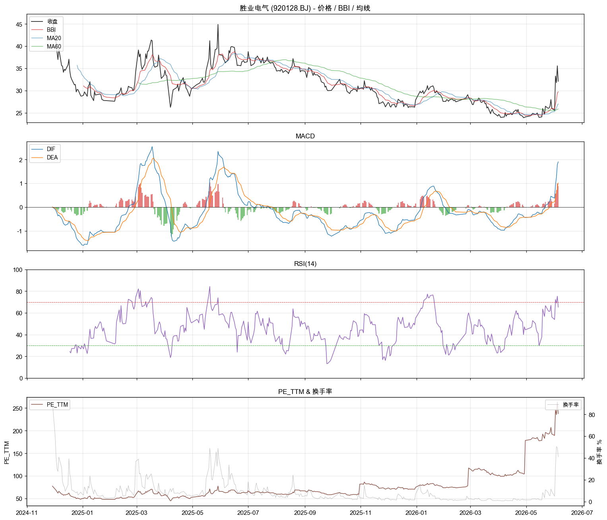

# 胜业电气 (920128.BJ) 北证回测报告

- 行业: 元器件
- 上市日期: 20241129
- 样本: 2024-11-29 → 2026-06-05 (366 个交易日)
- 报告时点: 2026-06-05, 收盘 32.11

## TL;DR

- **当前**: 收盘 32.11, BBI 多头, RSI 65, PE_TTM 238, PB 5.1.
- **基本面**: 最新季度 ROE 0.3%, 净利同比 -81.3%, 毛利率 20.7%.
- **产业链卡位**: **非紫苏叶**. 处于元器件层 (供应链深度足够), 但全球玩家 15+、国产替代 8+、产品高度同质化, 在 Serenity「数玩家」框架下属于价格战赛道. 估值溢价 (PE_TTM 237) 缺乏护城河支撑.
- **可参考信号** (历史 5d 胜率 >60%, n≥5): 量价突破20(5d胜率71%).
- **流动性**: 日均成交 67 万元 (10%分位 12 万), 日均换手 9.1%. 北证 ±30% 涨跌幅放大波动, 进出需控制资金占比.

## 一、描述性统计 (样本期内)

| 指标 | 数值 |
|---|---|
| 年化收益 | -21.21% |
| 年化波动 | +60.41% |
| 夏普 | -0.35 |
| 最大回撤 | -46.68% |
| 日均振幅 | +4.64% |
| 日均换手 | 9.1% (峰值 91.3%) |
| 日均成交 | 67 万元 (10%分位 12 万) |
| 涨停日数 (>29.5%) | 2 日 |
| 跌停日数 (<-29.5%) | 0 日 |
| 收益偏度 / 峰度 | 0.98 / 12.58 |

## 二、估值快照 (最新)

| 指标 | 数值 | 样本分位 |
|---|---|---|
| PE_TTM | 237.73 | 99% |
| PB | 5.08 | 64% |
| PS_TTM | 4.62 | 83% |
| 总市值(万元) | 26.1 亿 | 63% |

## 三、财务面 (近 6 个报告期)

| 报告期 | ROE | 毛利率 | 净利率 | 资产负债率 | 营收YoY | 净利YoY |
|---|---:|---:|---:|---:|---:|---:|
| 2026-03-31 | 0.34% | 20.7% | 1.3% | 53.1% | 9.5% | -81.3% |
| 2025-12-31 | 3.58% | 22.6% | 3.4% | 38.2% | -13.0% | -61.2% |
| 2025-09-30 | 3.74% | 23.6% | 4.7% | 35.6% | -8.4% | -47.6% |
| 2025-06-30 | 3.38% | 24.0% | 6.0% | 39.5% | -1.4% | -26.3% |
| 2025-03-31 | 1.78% | 23.7% | 7.1% | 38.3% | 3.0% | -9.8% |
| 2024-12-31 | 11.45% | 24.5% | 7.6% | 39.8% | 10.7% | 5.7% |

## 四、Rule-based 信号回测 (信号触发后 5/10/20 日表现)

| 信号 | 触发 | 5d 胜率 | 5d 均值 | 10d 胜率 | 10d 均值 | 20d 胜率 | 20d 均值 |
|---|---:|---:|---:|---:|---:|---:|---:|
| MACD金叉 | 15 | 33% | -3.27% | 27% | -2.32% | 33% | -0.81% |
| MACD死叉 | 15 | 47% | -1.75% | 27% | -4.15% | 27% | -3.68% |
| BBI转多 | 35 | 26% | -1.67% | 32% | +0.25% | 28% | -0.02% |
| BBI转空 | 34 | 44% | +0.38% | 36% | +0.09% | 29% | -1.62% |
| RSI<30反弹 | 13 | 46% | -0.78% | 46% | -0.20% | 33% | -1.17% |
| RSI>70回落 | 9 | 43% | +5.15% | 43% | +2.37% | 14% | -3.19% |
| 量价突破20 | 8 | 71% | -0.12% | 86% | +5.85% | 43% | -0.73% |
| 布林下轨反弹 | 0 | - | - | - | - | - | - |
| 高位放量 | 1 | - | - | - | - | - | - |

注: 胜率 = 信号触发后该 horizon 内收益 > 0 的比例; 均值 = 平均收益率(未扣交易成本).
由于样本短(< 600 日), 多数信号触发数 < 10 次, 解读时需保留怀疑.

## 五、紫苏叶产业链卡位定性

- 评分: 0.40 (·0.40)
- 需求链: 新能源车, 光伏储能, 工业自动化
- 链路深度: layer 5 (薄膜电容/电感 (被动器件))
- 全球竞争者: 15 家
- 国产替代: 8 家
- 可替代性: high
- 需求锁定: False
- 备注: **非紫苏叶**. 处于元器件层 (供应链深度足够), 但全球玩家 15+、国产替代 8+、产品高度同质化, 在 Serenity「数玩家」框架下属于价格战赛道. 估值溢价 (PE_TTM 237) 缺乏护城河支撑.

## 六、多面板技术图

