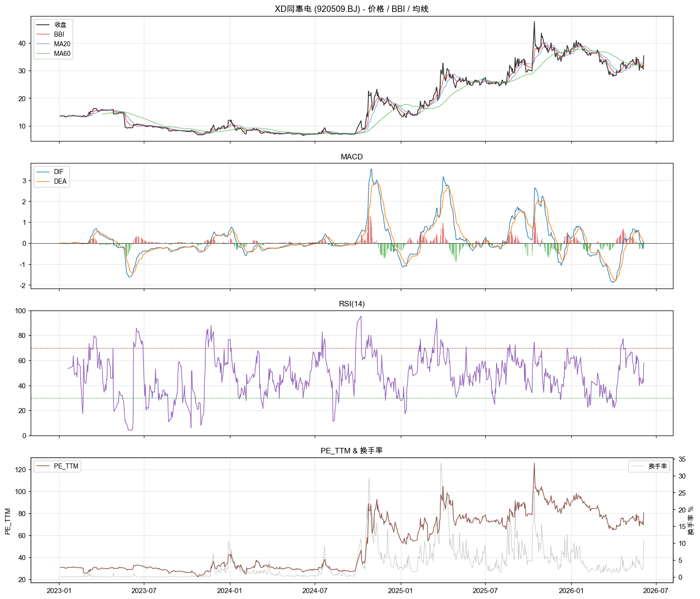

# XD同惠电 (920509.BJ) 北证回测报告

- 行业: 电器仪表
- 上市日期: 20210111
- 样本: 2023-01-03 → 2026-06-05 (827 个交易日)
- 报告时点: 2026-06-05, 收盘 35.42

## TL;DR

- **当前**: 收盘 35.42, BBI 多头, RSI 58, PE_TTM 80, PB 17.0.
- **基本面**: 最新季度 ROE 3.0%, 净利同比 +15.4%, 毛利率 58.9%.
- **产业链卡位**: **半紫苏叶**. 在国产电子测量仪器细分赛道处中端位置, 国内主要玩家 4 家, 受益于半导体测试 + 自主可控双轮驱动 (毛利率 56-59%、ROE 19.4%、资产负债率仅 11% 印证护城河). 估值高 (PE_TTM 80) 但有基本面支撑, 需观察是否能进入高端 (是德/罗德 替代).
- **可参考信号** (历史 5d 胜率 >60%, n≥5): 高位放量(5d胜率62%).
- **流动性**: 日均成交 82 万元 (10%分位 0 万), 日均换手 3.8%. 北证 ±30% 涨跌幅放大波动, 进出需控制资金占比.

## 一、描述性统计 (样本期内)

| 指标 | 数值 |
|---|---|
| 年化收益 | +32.41% |
| 年化波动 | +74.64% |
| 夏普 | 0.43 |
| 最大回撤 | -60.61% |
| 日均振幅 | +5.56% |
| 日均换手 | 3.8% (峰值 33.7%) |
| 日均成交 | 82 万元 (10%分位 0 万) |
| 涨停日数 (>29.5%) | 5 日 |
| 跌停日数 (<-29.5%) | 0 日 |
| 收益偏度 / 峰度 | 1.31 / 12.66 |

## 二、估值快照 (最新)

| 指标 | 数值 | 样本分位 |
|---|---|---|
| PE_TTM | 80.48 | 82% |
| PB | 17.02 | 93% |
| PS_TTM | 23.96 | 85% |
| 总市值(万元) | 56.8 亿 | 90% |

## 三、财务面 (近 6 个报告期)

| 报告期 | ROE | 毛利率 | 净利率 | 资产负债率 | 营收YoY | 净利YoY |
|---|---:|---:|---:|---:|---:|---:|
| 2026-03-31 | 3.05% | 58.9% | 25.8% | 10.5% | 12.9% | 15.4% |
| 2025-12-31 | 19.43% | 59.5% | 30.0% | 13.1% | 19.6% | 36.9% |
| 2025-09-30 | 12.88% | 59.2% | 29.2% | 11.4% | 16.4% | 59.4% |
| 2025-06-30 | 8.74% | 57.7% | 29.1% | 11.1% | 16.8% | 55.4% |
| 2025-03-31 | 2.87% | 56.8% | 25.1% | 12.2% | 23.8% | 125.4% |
| 2024-12-31 | 14.76% | 56.0% | 26.0% | 12.6% | 14.5% | 30.5% |

## 四、Rule-based 信号回测 (信号触发后 5/10/20 日表现)

| 信号 | 触发 | 5d 胜率 | 5d 均值 | 10d 胜率 | 10d 均值 | 20d 胜率 | 20d 均值 |
|---|---:|---:|---:|---:|---:|---:|---:|
| MACD金叉 | 30 | 45% | +0.70% | 34% | -0.28% | 48% | +10.54% |
| MACD死叉 | 29 | 55% | +3.01% | 61% | +2.89% | 57% | +7.78% |
| BBI转多 | 77 | 51% | +1.48% | 50% | +0.36% | 45% | +6.25% |
| BBI转空 | 76 | 47% | +1.17% | 47% | +2.71% | 47% | +5.12% |
| RSI<30反弹 | 30 | 40% | -2.24% | 40% | -2.54% | 37% | -2.18% |
| RSI>70回落 | 22 | 55% | +8.10% | 73% | +10.59% | 64% | +12.71% |
| 量价突破20 | 22 | 48% | -1.30% | 57% | +6.52% | 57% | +12.81% |
| 布林下轨反弹 | 0 | - | - | - | - | - | - |
| 高位放量 | 9 | 62% | -3.76% | 50% | +12.21% | 62% | +23.99% |

注: 胜率 = 信号触发后该 horizon 内收益 > 0 的比例; 均值 = 平均收益率(未扣交易成本).
由于样本短(< 600 日), 多数信号触发数 < 10 次, 解读时需保留怀疑.

## 五、紫苏叶产业链卡位定性

- 评分: 0.50 (·0.50)
- 需求链: 半导体测试, 电子制造检测, 国产仪器自主可控
- 链路深度: layer 4 (LCR表/阻抗分析仪/直流电源 (电子测量仪器))
- 全球竞争者: 8 家
- 国产替代: 4 家
- 可替代性: medium
- 需求锁定: True
- 备注: **半紫苏叶**. 在国产电子测量仪器细分赛道处中端位置, 国内主要玩家 4 家, 受益于半导体测试 + 自主可控双轮驱动 (毛利率 56-59%、ROE 19.4%、资产负债率仅 11% 印证护城河). 估值高 (PE_TTM 80) 但有基本面支撑, 需观察是否能进入高端 (是德/罗德 替代).

## 六、多面板技术图

